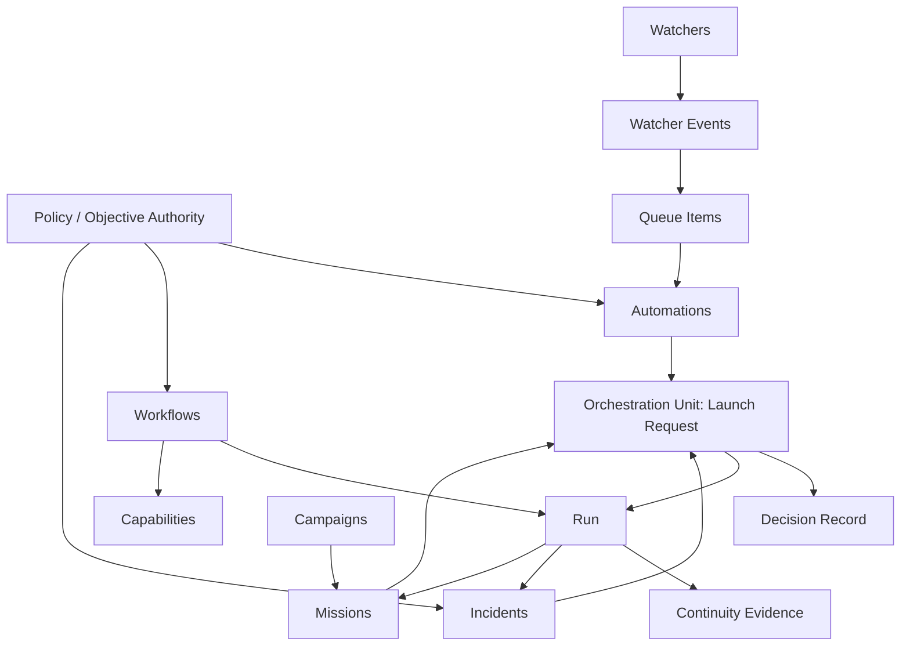

# Domain Model

## Purpose

Define the canonical vocabulary, ownership model, and cross-surface
relationships for the orchestration domain.

This document is normative for domain terminology and responsibility boundaries.
Contracts and lifecycle documents may specialize behavior, but they must use the
same meanings defined here.

## Core Concepts

| Concept | Definition | Primary Responsibility | Lifecycle Anchor |
|---|---|---|---|
| orchestration domain | The bounded subsystem that detects work, admits work, launches bounded procedures, records execution evidence, and governs abnormal conditions | coordinate runtime surfaces without collapsing policy, execution, and evidence into one layer | package-wide |
| surface | A first-class runtime or evidence-bearing object family with one primary job | own one kind of state or decision boundary | surface-specific contract |
| orchestration unit | The smallest material action candidate that must resolve to exactly one decision outcome before side effects proceed | provide a deterministic unit of routing, policy, and evidence | decision record |
| workflow | A bounded, reusable, agent-readable procedure definition | define how bounded work executes | workflow definition plus run |
| capability | A concrete tool, skill, service, or implementation primitive invoked by workflows or incident actions | perform domain work inside a bounded step | workflow execution context |
| contract | A normative specification for shape, behavior, or linkage | constrain implementation and validation | contract version / authority |
| policy | The rule set that determines whether a material action is allowed, blocked, or escalated | govern execution safely | decision record plus governance authority |
| execution state | The mutable lifecycle state of a surface or execution record | expose current eligibility, progress, or terminal outcome | lifecycle specs |
| dependency | A reference, artifact, state condition, approval, or timing prerequisite required by an orchestration unit | make admission deterministic and fail closed when missing | dependency-resolution |
| coordination key | Canonical identity for the external target or shared mutable resource an execution may affect | prevent conflicting side-effectful executions | concurrency-control-model |
| run | The authoritative execution-instance record for one admitted bounded execution | record status, lineage, and evidence linkage | run record plus continuity evidence |
| decision record | The canonical evidence for `allow`, `block`, or `escalate` on a material action | explain why work did or did not proceed | `continuity/decisions/` |
| incident | The abnormal-condition surface for containment, escalation, recovery, and closure | coordinate exception handling without becoming policy | incident object plus governance policy |

## Orchestration Units

An orchestration unit is not a separate runtime surface. It is the evaluation
boundary used by the orchestrator when deciding whether a material action may
proceed.

Canonical orchestration-unit types are:

- workflow launch
- queue claim
- queue acknowledgement
- queue retry transition
- incident open / enrich / close transition
- mission lifecycle transition
- campaign lifecycle transition
- automation active-state transition
- watcher active-state transition

Every orchestration unit must:

1. resolve referenced objects and dependencies
2. evaluate policy and approvals
3. acquire coordination guarantees when side effects are possible
4. emit exactly one `decision_id`
5. either stop with `block` / `escalate`, or proceed with the admitted action

## Surface Model

| Surface | Owns | Must Not Own |
|---|---|---|
| `campaigns` | strategic grouping, milestones, mission rollups | workflow execution, queue state, incident policy |
| `missions` | bounded initiative intent, owner, success criteria, progress context | workflow definitions, recurrence, durable execution evidence |
| `workflows` | bounded procedure definition and verification gates | recurrence, long-lived state, portfolio planning |
| `automations` | recurrence, trigger policy, unattended launch policy, overlap/idempotency rules | workflow content, queue semantics, incident closure authority |
| `watchers` | source observation, rule evaluation, event emission, watcher health | direct workflow launch, automation policy |
| `queue` | durable transient intake, claim/ack/retry/dead-letter transitions | mission planning, workflow semantics, policy authorship |
| `runs` | execution-instance identity, status, lineage, evidence linkage | durable evidence payloads, mission progress, future intent |
| `incidents` | abnormal-condition state, containment coordination, closure evidence | policy authorship, routine execution planning |

## Workflow, Capability, And Policy Relationship

- `workflow` defines the bounded procedure.
- `capability` is the mechanism a workflow step uses to do concrete work.
- `policy` determines whether the workflow may be launched or a state change may
  occur.
- `run` records what happened when an admitted workflow or incident action
  executed.

Capabilities are intentionally outside the orchestration-domain surface set.
They are invoked by orchestration, but orchestration governs when they may run
and how their effects are evidenced.

## Dependency Model

Dependencies come in five canonical classes:

| Class | Meaning | Example |
|---|---|---|
| reference dependency | another surface object must resolve unambiguously | `workflow_ref` resolves to exactly one workflow |
| artifact dependency | a required file or contract artifact must exist and validate | `policy.yml` exists for an automation |
| state dependency | a referenced object must be in an eligible lifecycle state | automation is `active`; mission is not `archived` |
| authority dependency | approval, objective scope, or policy must permit the action | closure authority exists for incident close |
| timing dependency | the action must be eligible at the current time | queue `available_at`, schedule window due |

Dependency evaluation order is defined in
`dependency-resolution.md`.

## Identity And Lineage

Canonical identifiers and cross-surface references are defined in
`contracts/cross-surface-reference-contract.md`.

The following rules are domain invariants:

- identity is stable after creation
- references use canonical IDs, never display names
- lineage is explicit, not inferred from directory position or narrative logs
- a material execution always links `decision_id` to `run_id` when a run exists
- continuity evidence is the durable system of record for material decision and
  run evidence
- side-effectful execution identity is stabilized by `coordination_key`

## Lifecycle Ownership

| Concept | Created By | Mutated By | Terminalized By |
|---|---|---|---|
| mission | operator, workflow follow-up path, or incident follow-up path | mission owner or delegated actor | mission owner / closeout flow |
| workflow | authoring process | authoring process | deprecation / removal process |
| automation | authoring process | automation controller or operator | operator retirement |
| watcher | authoring process | watcher runner or operator | operator retirement |
| queue item | event router or replay/quarantine tooling | queue manager | queue manager or operator quarantine |
| run | workflow launcher | workflow launcher / run writer | workflow launcher on terminal outcome |
| decision record | routing / policy evaluation | append-only; never rewritten in place | retention only |
| incident | incident manager or operator | incident owner / incident manager with authority | explicit closure authority |
| campaign | operator or planning workflow | campaign owner | archival flow |

## Lifecycle Relationship Rules

- workflow definitions outlive runs
- missions may span many runs over time
- automations and watchers are long-lived controllers that create many
  orchestration units over time
- queue items are transient but durable until acknowledged or dead-lettered
- incidents may reference multiple runs and missions, but do not absorb their
  state ownership
- campaigns remain optional and may never be required for normal-path execution

## Canonical Relationships

## Non-Goals

This domain model does not define:

- workflow step syntax in full
- implementation-language or storage-backend selection
- UI layout or operator tooling
- product-specific external capability behavior

Those choices may vary, but they must preserve the ownership and lifecycle
rules defined here.
