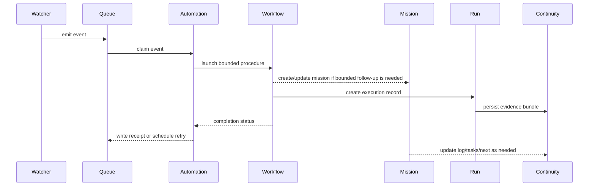
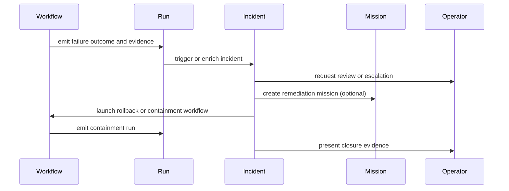

# End-To-End Flow

## Normal Autonomous Flow

## Exception And Incident Flow

## Worked Example: Weekly Governance Drift Control

1. A `watcher` detects that a freshness threshold or governance drift condition
   has been met.
2. The watcher emits an item into the `queue`.
3. An `automation` claims the event and decides to launch
   `audit-continuous-workflow`.
4. The workflow runs as a bounded procedure.
5. The execution produces a `run`.
6. The run points to evidence in `continuity/runs/`.
7. If findings are within expected bounds, the automation records completion and
   the queue item is acknowledged by receipt and removed from active lanes.
8. If severity crosses policy, an `incident` is opened or enriched.
9. If remediation is larger than one bounded run, a `mission` is created to own
   the follow-up work.
10. If the work contributes to a broader strategic objective, the mission rolls
    up into a `campaign`.

## Key Flow Rules

### Normal Path

- Watchers detect.
- Queue buffers automation-ingress only.
- Automations decide and launch.
- Workflows execute.
- Runs record.
- Missions are created only downstream when bounded follow-up work exists.

### Exception Path

- Runs provide the evidence needed for escalation.
- Incidents redirect or suspend normal execution.
- Human escalation stays explicit.

## Why This Flow Works

It keeps each major orchestration question in one place:

- detection is not execution
- execution is not scheduling
- evidence is not intent
- exceptions are not routine work

That separation is what makes the model both autonomous and governable.
