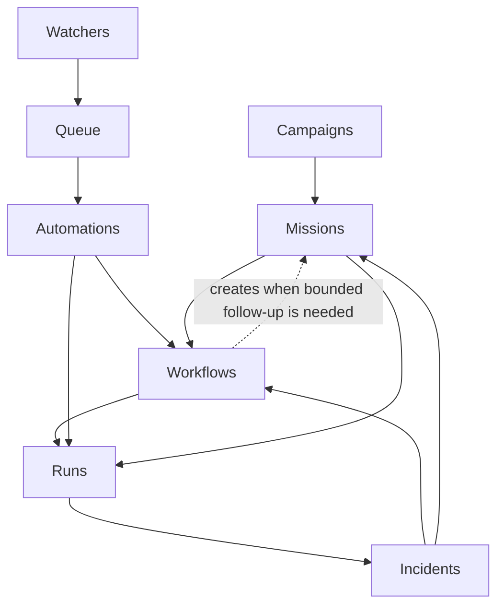

# Layered Model

## Layered View

## Layer Definitions

| Layer | Surfaces | Purpose |
|---|---|---|
| Strategic | `campaigns` | Coordinate multiple related missions around one larger objective |
| Initiative | `missions` | Own bounded multi-session intent, scope, and progress |
| Trigger | `watchers`, `queue`, `automations` | Detect conditions, buffer intake, and decide when bounded work should run |
| Execution | `workflows`, `runs` | Define bounded procedures and record concrete executions |
| Override | `incidents` | Handle abnormal conditions, escalation, rollback, and recovery |

## How The Layers Interact

### Strategic to Initiative

- `campaigns` organize and prioritize multiple `missions`
- a mission can exist without a campaign
- a campaign should not directly execute work; it coordinates mission-level work

### Trigger to Execution

- `watchers` detect signals
- `queue` buffers and normalizes automation-ingress only
- `automations` decide whether to launch a bounded procedure
- `workflows` execute the bounded procedure

### Execution to Initiative Creation

- `missions` are not queue consumers
- a mission may be created downstream by a workflow or incident response path
- mission creation is appropriate only when follow-up work becomes a bounded,
  multi-session initiative

### Initiative to Execution

- `missions` often invoke `workflows`
- a mission may own many workflow runs over time
- missions provide the durable intent and progress boundary around otherwise
  stateless bounded procedure runs

### Execution to Evidence

- every material workflow or automation execution should produce a `run`
- runs link:
  - workflow identity
  - automation identity, if any
  - mission identity, if any
  - outcome
  - evidence bundle

### Evidence to Operational Override

- `incidents` consume run evidence
- incident workflows and mission work can also produce additional runs
- incidents should be able to point to the exact run lineage that triggered or
  mitigated the incident

## Cross-Cutting Governance

The layered model depends on three cross-cutting controls:

- policy and authority boundaries
- continuity and evidence retention
- operator-visible escalation rules

Without those controls, the model becomes merely distributed, not governed.

## Minimal Mature Core

If Harmony adopts only part of the mature model, the best minimal mature core
is:

- `workflows`
- `missions`
- `runs`

That gives Harmony:

- bounded procedures,
- bounded multi-session work,
- durable evidence and replay/debug context.
