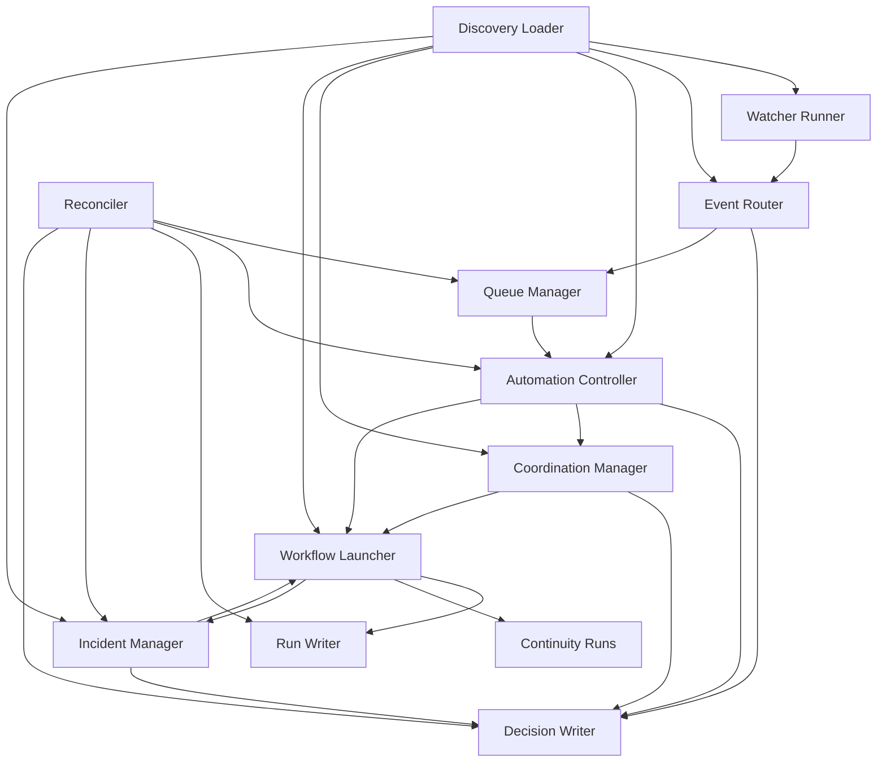

# Runtime Architecture

## Purpose

Define the logical runtime architecture that implements the orchestration
domain.

This document is normative for component responsibilities, write ownership, and
reconciliation behavior. It is intentionally deployment-agnostic: one process,
multiple workers, or a mixed runtime are all acceptable if they preserve the
same behavioral contract.

## Architectural Position

The orchestration domain is implemented as one logical control plane composed of
specialized components with explicit ownership boundaries.

The architecture is not defined as a microservice topology. It is defined as a
set of cooperating responsibilities that may be deployed together or apart.

## Logical Components

| Component | Responsibility | Canonical Inputs | Canonical Outputs | Owned Mutable State |
|---|---|---|---|---|
| discovery loader | load manifests, registries, contracts, and definitions into a resolved reference view | runtime discovery artifacts, contracts | resolved references, validation results | none durable |
| watcher runner | evaluate watcher sources and rules | watcher definitions, source state | watcher events, watcher health updates | watcher `state/` |
| event router | convert watcher events into queueable work | watcher events, active event-triggered automations | queue items, routing decisions | none durable beyond produced artifacts |
| coordination manager | derive coordination keys and acquire/release lock leases for side-effectful work | admitted launch requests, workflow side-effect metadata | lock acquisition results, contention outcomes | active coordination leases |
| queue manager | own claim, ack, retry, dead-letter, and receipt transitions | queue lanes, automation claimant identity | claimed items, receipts, retry/dead-letter transitions | queue lanes and receipts |
| automation controller | evaluate automation policy and admit launch requests | automation definitions, queue items or schedule windows | allow/block/escalate decisions, launch requests, automation counters/state | automation `state/` |
| workflow launcher | create runs, start workflows, and finalize run outcomes | admitted launch requests, workflow definitions | run records, continuity evidence, workflow terminal outcomes | active run records |
| incident manager | open, enrich, transition, and close incidents | failed runs, escalation conditions, operator approvals | incident object updates, containment/remediation requests | incident runtime state |
| run writer | maintain run projections and reverse-lookup indexes | run lifecycle updates | `runs/index.yml`, `by-surface/`, `<run-id>.yml` | `runtime/runs/` |
| decision writer | append decision evidence for all material actions | resolved decision outcome | `continuity/decisions/<decision-id>/decision.json` | continuity decision evidence |
| reconciler | detect incomplete writes, expired claims, orphan evidence, and broken lineage | queue items, runs, decisions, incidents | deterministic repair transitions, incidents, operator-visible errors | none primary |

## Component Interaction Model

## Deployment Compatibility Rule

Implementations may collapse or distribute components, but the following must
remain true:

- watcher state has one effective writer at a time
- queue lane transitions are serialized per queue item
- automation state has one effective writer per automation
- run records have one effective writer per active run
- coordination leases have one effective owner per exclusive key
- incident lifecycle transitions are serialized per incident
- continuity decision evidence is append-only

## Write Ownership Rules

| Artifact | Single Effective Writer |
|---|---|
| watcher `state/cursor.json`, `health.json`, `suppressions.json` | watcher runner |
| coordination leases | coordination manager |
| queue lane placement and receipts | queue manager |
| automation `state/status.json`, `last-run.json`, `counters.json` | automation controller |
| active run record and terminal status update | workflow launcher / run writer |
| decision record bundle | decision writer or the component acting through the decision-writer contract |
| incident lifecycle fields and closure artifacts | incident manager with required operator/policy authority |

## Material Action Commit Protocol

All material actions follow this protocol:

1. Resolve the orchestration unit and load authoritative definitions.
2. Validate dependencies, contracts, current state, and policy prerequisites.
3. Derive `coordination_key` when the action may produce external side effects.
4. Acquire the required coordination lock when applicable.
5. Create exactly one decision record.
6. If the outcome is `block` or `escalate`, stop after the decision record.
7. If the outcome is `allow` and the action launches a workflow:
   - create the canonical `run_id`
   - write the orchestration-facing run record with `status=running`
   - record executor ownership fields in placeholder form pending acknowledgement
   - allocate the continuity evidence path
   - wait for executor acknowledgement before side-effectful workflow steps begin
8. Write receipts, evidence, and terminal state updates.
9. Apply downstream queue, mission, or incident transitions.

## Coordination Protocol

Side-effectful actions must:

1. derive `coordination_key`
2. determine the required lock class
3. acquire a lock lease before `allow`
4. include lock evidence in the decision record

If lock acquisition fails, admission must defer, block, or escalate according to
`concurrency-control-model.md`.

The lock artifact schema and lease state shape are defined in
`contracts/coordination-lock-contract.md`.

## Queue Transition Protocol

Queue transitions are special because they coordinate multiple actors.

### Claim

Claim must be implemented as one compare-and-swap style transition that:

1. verifies eligibility and target ownership
2. moves the item into `claimed`
3. sets `claimed_by`, `claimed_at`, `claim_deadline`, and `claim_token`

No claim is valid if those fields were not created together.

### Acknowledgement

Ack must:

1. verify the presented `claim_token`
2. write a receipt
3. remove the item from active lanes

If the token mismatches, the ack is rejected and recorded as failed handling.

### Lease Expiry

Lease expiry must be driven by deterministic time comparison against
`claim_deadline`. Expiry does not require claimant cooperation.

## Schedule Evaluation Loop

The automation controller owns scheduled launch evaluation.

At each evaluation tick it must:

1. load active scheduled automations
2. compute due schedule windows using
   `orchestration-execution-model.md`
3. derive the canonical schedule-window idempotency key
4. emit one launch attempt per newly due window
5. apply overlap and retry policy before launch

Scheduled launch evaluation does not require the queue unless an implementation
explicitly inserts an internal queueing layer. If it does, the external
behavior must remain identical.

## Event Routing Loop

The event router owns event-to-automation matching.

For each emitted watcher event it must:

1. validate the event envelope
2. resolve matching automations using `dependency-resolution.md`
3. write the required decision evidence
4. create zero or more queue items, each targeted to exactly one automation

The event router must not launch workflows directly.

## Reconciliation And Recovery

The reconciler is mandatory for safe operation. It is responsible for detecting
and handling incomplete writes or abandoned work without guessing.

| Condition | Detection | Required Response |
|---|---|---|
| expired claim | `status=claimed` and `claim_deadline < now` | move item to `retry` and increment `attempt_count` |
| orphan allow decision | `allow` decision for launch exists but no run record exists after `launch_commit_timeout` | mark the originating automation or controller path `error`, record operator-visible failure, and open/enrich incident if policy requires; do not start the workflow speculatively |
| run missing executor acknowledgement | run exists but `executor_acknowledged_at` missing after `executor_ack_timeout` | set `recovery_status=recovery_pending`, keep execution non-authoritative, and require reconciler action |
| run heartbeat expired | `status=running` and `lease_expires_at < now` | set `recovery_status=recovery_pending`, stop assuming ownership is live, and require deterministic recovery |
| coordination lease lost | active run no longer owns its `coordination_key` | preserve lineage, stop new side effects, and escalate recovery |
| run without continuity path | run exists with missing or unresolved evidence path | keep run non-complete for acceptance, block closure/completion paths that depend on evidence, and raise operator-visible inconsistency |
| orphan continuity evidence bundle | continuity bundle exists without canonical run record | quarantine as lineage inconsistency; do not silently adopt it as canonical state |
| incident close requested without required evidence | close transition requested and closure prerequisites unresolved | block closure and preserve incident state |

`launch_commit_timeout` is implementation-configurable but mandatory. It is the
maximum allowed age of an `allow` decision for launch before the system treats
the admission as incomplete.

`executor_ack_timeout` is implementation-configurable but mandatory. It is the
maximum time between run creation and executor ownership acknowledgement.

## External Side-Effect Boundary

External side effects are permitted only after:

- decision outcome is `allow`
- required approvals exist
- required coordination lease is held
- run record exists for workflow-backed actions
- executor ownership has been acknowledged
- evidence location has been allocated

This ordering prevents the system from performing untraceable work.

## Non-Goals

This document does not require:

- one specific runtime process layout
- one specific storage technology
- one specific task executor for workflow steps

It does require equivalent ownership, ordering, and recovery behavior.
