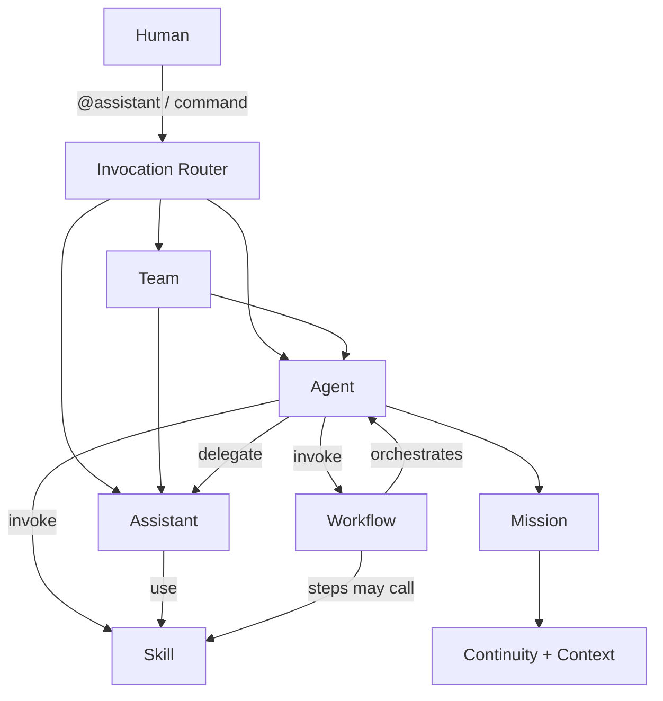

# Agency Subsystem Architecture

## Selected Context

archetype=platform/infra + developer tooling; testing=service/distributed profile; operations=service/runtime profile; risk_tier=B; mode=full-architecture

## Goal

Finalize an agency architecture for `.harmony/agency` that is:

- semantically clear,
- operationally simple,
- composable with skills/workflows/missions,
- aligned with AGENTS.md ecosystem patterns.

## Current State Summary

Observed in repository:

- `assistants/` is defined and usable.
- `agents/` exists but lacks a complete registry contract for current concrete roles.
- `subagents/` duplicates agent semantics and conflicts with assistant semantics.
- `teams/` is a placeholder without structure.

This creates role ambiguity and weakens routing and governance.

## Options Considered

### Option A: Keep all four as first-class types (`agents`, `assistants`, `subagents`, `teams`)

Pros:

- maximal taxonomy flexibility,
- explicit place for future parallel delegated workers.

Cons:

- high conceptual overlap (`subagents` vs `assistants`),
- larger configuration and validation surface,
- contradicts simplicity-first guidance.

### Option B: Consolidate `subagents` into `assistants`; keep `teams`

Pros:

- clear role boundaries,
- minimal migration cost,
- preserves ability to model multi-actor compositions,
- better alignment with simpler AGENTS.md-style operating model.

Cons:

- loses separate artifact label for subagent worker class.

### Option C: Keep only `agents` and `assistants`; drop `teams`

Pros:

- smallest surface area.

Cons:

- no reusable composition construct for repeatable multi-role collaboration,
- orchestration logic leaks into ad hoc workflow text.

## Decision

Choose Option B.

- Keep `agents` (orchestration authority).
- Keep `assistants` (specialized delegated execution).
- Keep `teams` as declarative composition.
- Remove `subagents` as first-class artifact and retain only as runtime term.

## Architecture Overview

## Layered Model

| Layer | Concern | Primary Artifacts |
|---|---|---|
| L1 | Actor identity and routing | `agency/manifest.yml`, actor registries |
| L2 | Actor behavior contracts | `agent.md`, `assistant.md`, `team.md` |
| L3 | Capability execution | skills and workflows |
| L4 | Durable progress/state | missions, continuity, cognition |
| L5 | Verification/governance | quality gates, audits, CI validation |

## Key Contracts and Boundaries

### Boundary 1: Orchestration vs Capability

- Orchestration belongs to agents and workflows.
- Deterministic capability execution belongs to skills.

### Boundary 2: Persistent vs Stateless actors

- Agents are persistent owners of mission state.
- Assistants are stateless delegated workers.

### Boundary 3: Composition vs Execution primitive

- Teams are compositions, not execution engines.
- Teams should not duplicate workflow semantics.

## Interaction Patterns

### Pattern 1: Human-to-Assistant direct

1. Human invokes `@reviewer`.
2. Router resolves alias from nearest registry.
3. Assistant executes bounded task.
4. Assistant escalates if out of scope.

### Pattern 2: Agent-delegated specialist execution

1. Agent plans work and identifies specialist need.
2. Agent delegates to assistant with scoped context.
3. Assistant uses skills and returns structured output.
4. Agent integrates output and advances mission/workflow.

### Pattern 3: Team-guided orchestration

1. Human or workflow selects `team`.
2. Team policy chooses lead agent and participating assistants.
3. Execution proceeds through declared handoff policy.
4. Outputs are attributed by actor for auditability.

## Interaction with Other Subsystems

| Subsystem | Agency Interaction | Primary Constraint |
|---|---|---|
| `capabilities/skills` | Agents/assistants invoke capabilities | Respect skill `allowed-tools` and I/O contracts |
| `orchestration/workflows` | Agents run procedures; workflows can target actors | Keep orchestration in workflows, not skills |
| `orchestration/missions` | Agents own lifecycle; assistants contribute via delegation | Single owner at a time |
| `cognition/` | Agents read/write decisions/lessons/context | Maintain append-only history rules |
| `continuity/` | Agents update progress and next actions | Preserve traceability of actor actions |
| `quality/` | Actor outputs pass quality gates | No bypass for delegated outputs |

## Data Governance and Compliance

No personal/regulated data model changes are introduced by this architecture.

Operationally required controls:

- do not write secrets to logs,
- ensure actor output templates avoid sensitive data leakage,
- enforce least-privilege tool use by actor and skill scope.

## Risks and Mitigations

| Risk | Impact | Mitigation |
|---|---|---|
| Legacy docs/config continue to reference `subagents/` | Routing confusion | Compatibility shim + explicit deprecation lint |
| Teams become redundant with workflows | Modeling drift | Define team as composition only; workflow remains procedure source of truth |
| Skills start orchestrating actors | Circular complexity | Policy gate: no actor orchestration from skills without explicit delegator exemption |
| Alias collisions across nested harnesses | Misrouting | Enforce nearest-scope precedence + uniqueness checks |

## Rollout Architecture

### Phase 1

- Introduce canonical agency manifest and registries.
- Add team registry/template scaffold.

### Phase 2

- Migrate `subagents/` content into `agents/` or `assistants/` as needed.
- Mark `subagents/` deprecated and block new usage.

### Phase 3

- Update routing and validation to canonical taxonomy.
- Add CI checks for schema and alias uniqueness.

### Phase 4

- Remove compatibility shim and delete `subagents/` path.

## Observability

Track at minimum:

- invocation counts by actor type,
- delegation chains and depth,
- escalation frequency and cause,
- per-actor workflow/skill failure rate,
- alias resolution conflicts.

## Testing Strategy

- Unit: registry parsing, alias resolution, validation rules.
- Integration: end-to-end routing (human -> actor -> skills/workflows).
- Contract: schema conformance for agent/assistant/team manifests.
- Regression: legacy `subagents/` references blocked after migration cutoff.

## Architecture Outcome

A three-type actor model (`agents`, `assistants`, `teams`) with explicit contracts and deterministic interactions, minimizing taxonomy overhead while preserving orchestration power.
