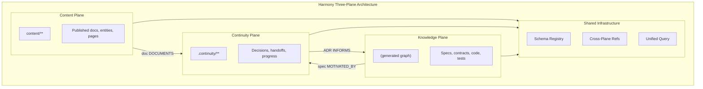
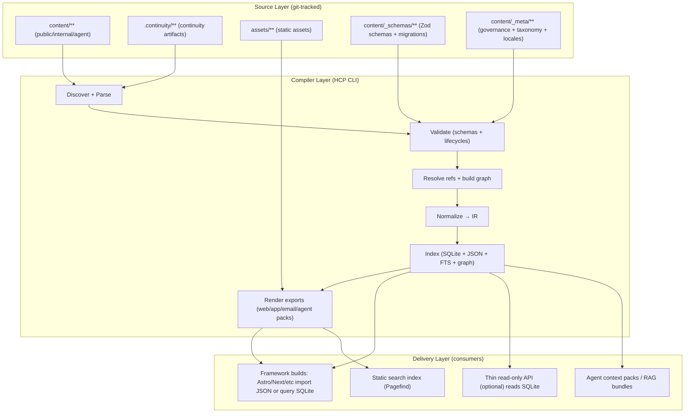
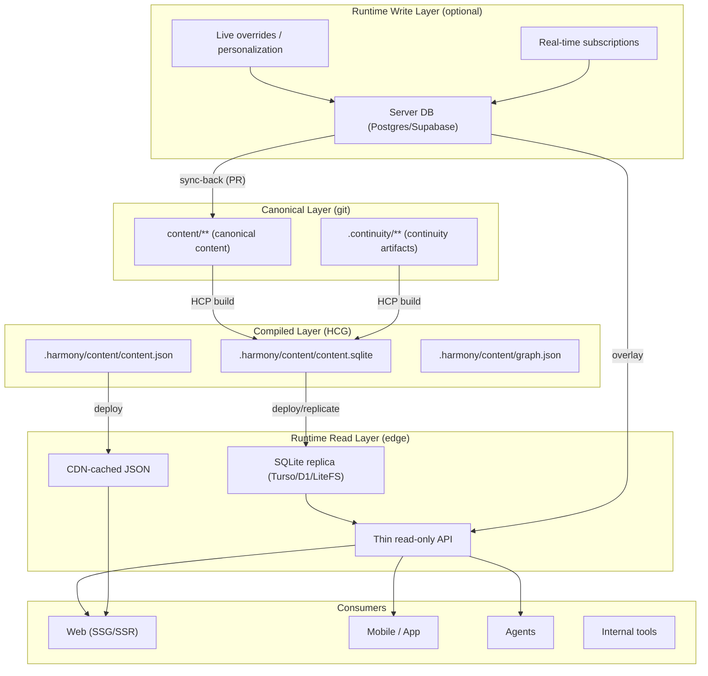
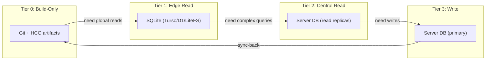
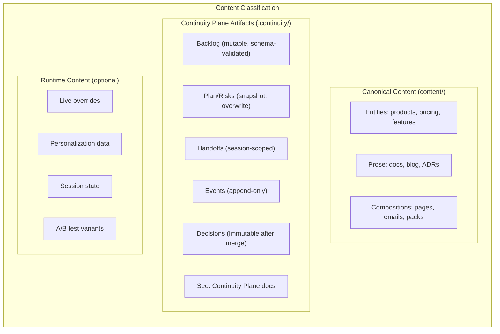

# Content Plane Architecture Diagram

## Three-Plane Context

The Content Plane is one of three architectural planes. This diagram shows how Content Plane relates to the other planes:

See [Three Planes Integration](../../../continuity/architecture/three-planes-integration.md) for complete cross-plane architecture.

---

## Core Architecture (Build-Time)

## Extended Architecture (With Runtime Layer)

When boundary conditions are crossed (see [boundary-conditions.md](./boundary-conditions.md)), the architecture extends to include runtime layers:

## Tiered Storage Model

## Content Type Classification

