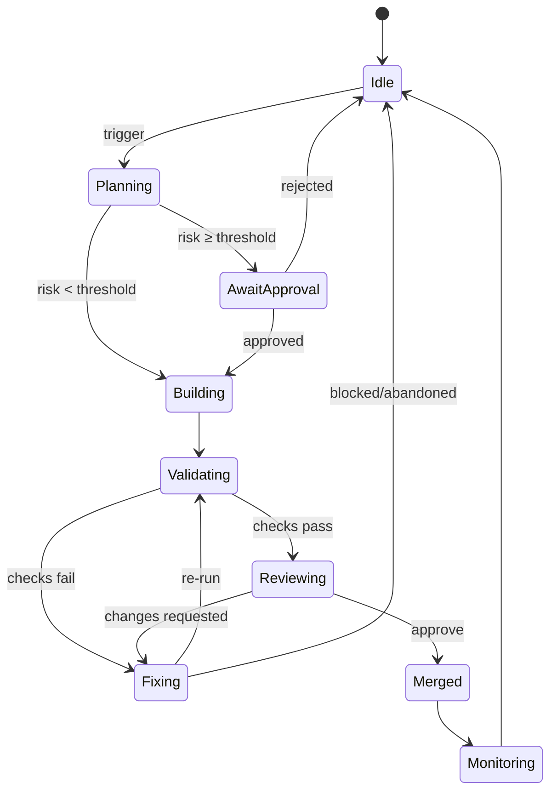

# Kaizen Subsystem (Technical)

Related docs: [monorepo polyglot (normative)](./monorepo-polyglot.md), [overview](./overview.md), [tooling integration](./tooling-integration.md), [governance model](./governance-model.md), [knowledge plane](../knowledge-plane/knowledge-plane.md), [contracts registry](./contracts-registry.md)

This document specifies the Kaizen subsystem: an agentic, fail-closed improvement loop that proposes and validates small, incremental changes via dry‑run pull requests before any merge to main.

## Summary

- Purpose: continuous, automated improvements with human-governed safety.
- Mode: fail‑closed with dry‑run PRs; no merge without validation + approval.
- Agents: Planner, Builder, Verifier; backed by the Knowledge Plane and CI/CD.
- Triggers: scheduled cadence and event-driven (e.g., CVEs, CI failures).
- HITL: plan approval (risk‑gated) and pre‑merge code review.
- Outputs: branch + PR per improvement, verification artifacts, post‑merge outcomes logged.

## Audience and Scope

Developer-facing documentation for engineers building, operating, and extending the Kaizen loop. Covers responsibilities, workflow, controls, and operations. Tooling specifics (CI vendor, exact commands) are illustrative; outcomes are normative.

## Scope & Non‑Goals

In‑scope (tiny, reversible improvements with evidence):

- Documentation hygiene (linting, link fixes, template normalization, ADR/link gaps)
- Governance hygiene (risk rubric nits, required sections, CODEOWNERS coverage hints)
- Observability scaffolding (add missing spans/logs on changed paths; sample trace outlines)
- Preview/E2E smoke coverage checks and wiring suggestions
- Contract drift detection with suggested OpenAPI/JSON Schema updates
- Performance nudges (bundle size notes, caching headers, perf budget deltas)
- Feature‑flag hygiene (stale‑flag diff, owner mapping, expiry annotations)

Out‑of‑scope (require human initiation or separate process):

- Changes that materially alter runtime behavior without approval
- Secret access, key management, or policy exceptions
- Merging/approving its own PRs; cutting releases; production deployments

## Cross‑Cutting Scope and Boundaries

- Cross‑cutting plane: the Kaizen layer observes the whole repo (docs, tests, observability, contracts, flags, CI) and proposes tiny, reversible changes across slices.
- Evidence + policy: every proposal is backed by reports/artifacts and evaluated against codified gates/rubrics; PRs are suggest‑only until reviewed.
- Quality attributes over features: aims to improve consistency, governance, and safety; avoids user‑visible behavior changes.

When it is not cross‑cutting

- Domain logic or UX changes belong to feature owners; Kaizen may suggest, but owners decide and review.
- Higher‑risk refactors or anything that changes runtime semantics runs as Copilot (PRs to owners; required reviews).
- During incidents or freezes, the layer observes the freeze and files issues instead of opening PRs.

## System Components

- Planner Agent: analyzes system state via the Knowledge Plane and proposes improvements with rationale and risk.
- Builder Agent: implements approved plans on an isolated branch and opens PRs.
- Verifier Agent: executes automated checks (tests, static analysis) and reports results.
- Knowledge Plane: shared context for findings, plans, policies, and outcomes.
- CI/CD Pipeline: runs verification gates and performs merges/deploys per policy.
- Platform Runtime Service: executes Kaizen and governance flows (for example, evaluation runs or hygiene checks) as **platform-managed flows** when needed, and emits standardized telemetry (`flow_id`, `flow_version`, `run_id`, `caller_kind`, `caller_id`, `project_id`, `environment`, `risk_tier`) that feeds Kaizen reports and risk assessments (see `runtime-architecture.md` and `observability-requirements.md`). In the canonical layout, this is implemented by platform runtime services under `platform/runtimes/*-runtime/` (for example, the flow runtime under `platform/runtimes/flow-runtime/**`).

### Minimal Architecture Alignment (Sensors → Evaluators → Planners → Actuators)

Complementing the Planner/Builder/Verifier loop, the subsystem uses a simple pipeline that fits the current polyglot monorepo:

- Sensors: CI outcomes (TS + Python tasks), DORA/SRE signals, preview smoke results, OpenTelemetry traces/logs, and platform runtime run metadata (for example, flow/run records for Kaizen and governance flows).
- Evaluators/Policy: codified rules from required checks, the risk rubric, and change‑type gates; outputs include reports/artifacts consumed by planners and attached to PRs.
- Planners: small tasks drawn from retrospectives and stop‑the‑line triggers, producing decision‑grade plans.
- Actuators: PR‑opening bots using our prompts/scripts (e.g., docs lint, span scaffolding, contract drift diffs), always behind HITL + branch protection. Contract drift work operates over the root `contracts/` registry (OpenAPI/JSON Schema, TS/Py clients) so that proposed changes consider both TypeScript and Python consumers. Weekly summaries are published under `kaizen/reports/`.

## Workflow (Dry‑Run Improvement Loop)

The loop executes on cadence or trigger and iterates over small, isolated changes.

1) Trigger

- Scheduler (e.g., nightly) or event (new CVE, CI failure on main, drift detected).
- Optional manual start to request an improvement pass.

2) Plan Generation (Planner)

- Reviews system context and candidates: fix failing tests, refactor duplication, update dependencies, improve logging, add DB index, etc.
- Prioritizes and selects one item (or a trivially orthogonal bundle).
- Assigns risk aligned to governance thresholds; prepares validation criteria.

3) Plan Approval (HITL)

- If risk ≥ threshold, await human approval; low‑risk routine maintenance may auto‑proceed per policy.
- Early maturity: prefer quick human review of all plans to build trust.

4) Execution as Dry‑Run (Builder)

- Create branch: `kaizen-<YYYYMMDD>-<topic>`.
- Implement the change; open a PR labeled "Kaizen-AI proposed" and link plan context.

5) Automated Validation (Verifier + CI)

- Run unit/integration tests, linting/static analysis, and other required checks.
- If failures occur, loop on fixes within the PR when tractable; otherwise hold for human input.

6) Review & Decision (HITL)

- Human reviewer validates intent, quality, and alignment even when CI is green.
- Approve when satisfied; request changes or close otherwise.

7) Merge & Deploy

- Merge to main after approval. CI/CD deploys per standard release policy.

8) Monitor Outcomes

- Observe effects (e.g., performance improvements) and detect regressions.
- Record outcomes in the Knowledge Plane for traceability.

9) Iterate

- Return to idle until next schedule or trigger; prefer one improvement at a time unless changes are clearly independent.

```mermaid
flowchart LR
  T[Trigger (schedule/event)] --> P[Plan]
  P -->|risk < threshold| B[Build (branch + PR)]
  P -->|risk ≥ threshold| A[HITL Plan Approval]
  A -->|approved| B
  A -->|rejected| X[Fail-closed: no change]
  B --> V[Verifier + CI]
  V -->|checks pass| R[HITL Review]
  V -->|checks fail| F[Fix or Hold]
  F -->|fixed| V
  F -->|blocked| X
  R -->|approve| M[Merge]
  R -->|request changes| F
  M --> O[Monitor Outcome]
  O --> K[Log to Knowledge]
  K --> T
```

## Fail‑Closed Controls

Default posture is "no change" unless evidence and approval support merge.

- Any test or verification failure prevents merge; PR remains open for fixes or is closed.
- If planning or building reveals unexpected complexity, halt and flag HITL.
- Human reviewers can reject or request changes even on all‑green runs.
- Post‑merge monitoring may trigger revert/rollback if adverse effects are detected.

This guarantees safety even when an AI misjudges an improvement: the process blocks or reverts rather than silently drifting system behavior.

Guardrails (practical defaults):

- Map actions to the risk rubric: Trivial/Low may auto‑proceed within the loop; Medium/High require explicit HITL plan approval and review.
- Non‑negotiables: no direct pushes, no bot approvals on protected branches, pinned/approved AI configs, and evidence artifacts for every PR.

## Risk Model & Guardrails

Map change types to tracks and preconditions. Higher risk always elevates to HITL.

| Change type | Track | Preconditions (examples) |
|---|---|---|
| Docs/content‑only | Autopilot | CI green; no code changes |
| Dev‑only hygiene | Autopilot | Tests unaffected |
| Observability scaffolding | Copilot | Trace plan attached; preview smoke green |
| Contract drift (suggested) | Copilot | `oasdiff` report attached; contract tests pass |
| Perf/cost nudge | Copilot | Budget deltas attached; no regression |
| Threat‑model tests | Copilot | STRIDE checklist attached; tests‑only change |
| Runtime behavior | Out‑of‑scope | Human‑initiated with design + tests |

See also: `governance-model.md` for risk rubric, two‑person rule on high‑risk, and waiver policy.

## Triggers and Scheduling

- Cadence: nightly/weekly runs to "garden" quality (docs, tests, refactors).
- Events: new CVEs, dependency freshness, CI failures, performance anomalies, or other drift signals.
- Manual: on‑demand runs by maintainers.

Default schedule (GitHub Actions): weekdays at 12:00 America/Chicago (18:00 UTC); configurable via `on.schedule`.

Additional practical triggers the loop may watch:

- Daily trunk preview smoke; weekly stale‑flag reports; SLO burn‑rate or cost anomalies; DORA regressions. Risky conditions elevate to issues and can tighten gates per freeze policy.

Implementation note: workflow wiring lives in `tooling-integration.md` (Kaizen Workflow). Kaizen PRs use `.github/PULL_REQUEST_TEMPLATE/kaizen.md`. PR template sections include: Why; What changed (low-risk, reversible); Evidence (CI/artifacts/trace plan); Safety (change type, track, non‑negotiables).

## Branching and PR Conventions

- Branch naming: `kaizen-<YYYYMMDD>-<topic>`.
- PR title example: `chore: bump json-lib to 2.3.2 (Kaizen AI)`.
- Labels: `Kaizen-AI proposed`; link to plan/risk context in the PR body.
- One PR per improvement; avoid batching unless trivial and orthogonal.

PRs must include evidence artifacts (report/diff/tests/trace) and PR↔build↔trace correlation as per the Knowledge Plane ingestion contract.

Autopilot vs Copilot categories (applies to PR intent, not approvals):

- Autopilot (eligible to proceed within normal review): docs hygiene (lint/links/titles), stale‑flags cleanup diffs, preview smoke wiring for top routes.
  (see `scripts/smoke-check.sh`)
- Copilot (must open PRs with evidence; human approval required): observability scaffolding (missing spans/logs on changed paths with a sample trace outline), contract drift fixes using OpenAPI/JSON‑Schema + `oasdiff`, perf budget nudges (bundle/caching deltas), and targeted threat‑model test stubs (e.g., STRIDE‑driven checks).

## Validation and Quality Gates

- Required checks: unit/integration tests, lint/static analysis, type checks; security/license scans where applicable.
- Verifier may include dependency/SBOM diffs for update clarity.
- CI status and artifacts are written back to the Knowledge Plane.

Reports: a weekly Kaizen digest is generated under `kaizen/reports/YYYY‑WW.md` (hygiene score, span coverage, perf/cost deltas, merged Kaizen PRs).

## Human‑in‑the‑Loop (HITL)

- Plan approval when risk ≥ threshold; can be streamlined for low‑risk maintenance.
- Pre‑merge code review for semantic correctness and intent alignment.
- Early operation favors more HITL to build trust; automation can expand over time.

Change freezes/incidents: operate in suggest‑only mode (issues over PRs); resume PRs when unfreezed.

## Observability and Feedback

- After merge, monitor key metrics to validate intended effects and detect side effects.
- Knowledge Plane records: proposed plan, risk, approver, PR link, checks, outcome, and post‑merge observations.
- Failed or rejected attempts inform future planning and policy refinements.
- Link PRs and CI runs to trace IDs to accelerate incident correlation and audit trails.

## Failure Handling and Rollback

- Prefer feature flags for risky behavior changes; roll out gradually when possible.
- Maintain rapid rollback capability; revert recent PR if production signals regress.
- Keep changes small so that reverting is straightforward and low‑risk.

## Learning and Postmortems

- Conduct lightweight, blameless postmortems for material incidents or unexpected outcomes; capture root causes, actions, and follow‑ups.
- Persist learnings as ADRs and Knowledge Plane entries; link to related PRs/traces and update policies/tests when warranted.
- Optional kit: introduce a lightweight PostmortemKit to standardize templates, checklists, and Knowledge Plane updates when incident frequency/severity justifies additional structure. Default to the documented process until then.

## Operational Controls

- Pause/resume the loop (e.g., during high‑risk release windows).
- Suggest‑only mode: propose plans and PR diffs without auto‑execution when trust is low.
- Daily summary dashboards: "3 PRs opened, 2 merged, 1 awaiting input" for visibility.

## Metrics and Reporting

- Throughput: improvements proposed vs. merged.
- Lead time: trigger → merge duration.
- Change failure rate: percent of PRs reverted or rejected post‑checks.
- MTTR for event‑driven fixes (e.g., CVE remediation time).
- Coverage/quality drift corrected over time.

## Example Scenarios

### Low‑risk dependency update

- Plan: bump `json-lib` from `2.3.1` to `2.3.2`; no API changes; run full tests.
- Execution: update dependency; open PR; CI passes; human approves; merge; outcome logged.

### Behavior change needing specification

- Plan: add null guards for recurring NPE in ModuleA.FunctionX; update tests.
- Execution: implement change and tests; CI reveals ambiguity or failures; hold for human decision.
- Resolution: clarify intended behavior; update spec/tests; proceed or abandon; fail‑closed protects main until intent is explicit.

## State Model



## Notes

- Keep changes small, traceable, and independently reviewable.
- Treat Kaizen PRs like any team member’s: same standards, same gates.
- The loop increases velocity while preserving safety by defaulting to no change without proof.

## Repository Home (Visibility & Ownership)

Create a first‑class home for the loop so it’s visible and ownable:

```plaintext
/kaizen/
  policies/      # YAML/JSON policy (risk rubric extensions, gates)
  evaluators/    # scripts: oasdiff, docs lint, OTel coverage, bundle budgets
  codemods/      # AST transforms + safe refactors
  agents/        # small planners that file issues/PRs (PatchKit wrappers)
  reports/       # weekly kaizen + error‑budget/cost summaries
.github/workflows/kaizen.yaml   # scheduled & on‑demand runners
```

This complements existing CI and prompts while keeping ownership clear.

### Drop-in Usage

- For repos adopting this pattern incrementally, add the `/kaizen/` directory and `.github/workflows/kaizen.yaml` as shown above.
- Optionally mirror this document (or a shortened variant) at `docs/kaizen/README.md` for contributors who look for operational guidance near the Kaizen layer.
- Configure initial policies in `kaizen/policies/{risk.yml,gates.yml}` to match your risk rubric and gates; keep Autopilot limited to trivial/low‑risk changes.

## Ownership & Governance

- Area ownership via CODEOWNERS; Kaizen PRs route to relevant owners.
- Bot identity: `@repo-improve-bot` (or similar) for auditability.
- Labels: `autopilot`, `copilot`, `needs-owner`, `risk:low|med|high`, `docs`, `observability`, `contracts`, `perf`, `flags`.
- Freeze respect: During change freezes or incidents, operate in suggest‑only mode (issues>PRs) and resume PRs when unfreezed.

### Merging Policy and Non‑Negotiables

- Autopilot PRs still require at least one human approval; bots never approve or push to protected branches.
- AI configuration is pinned and versioned; every PR carries evidence artifacts and PR↔build↔trace correlation for provenance.

## Triggers & Schedules

- Daily (weekdays): Docs hygiene, preview smoke coverage audit, stale‑flag scan.
- Weekly: Kaizen report, perf/cost budget deltas, span coverage report.
- Event‑based: SLO burn rate, CI flakiness spikes, contract drift detection, performance regressions.

Default schedule: weekdays at 12:00 America/Chicago (18:00 UTC); configurable via `on.schedule` in `.github/workflows/kaizen.yaml`.

See `tooling-integration.md` for a sample Kaizen workflow wiring.

## Reports

Generate a weekly report under `/kaizen/reports/YYYY‑WW.md` summarizing:

- Hygiene score (docs coverage, span coverage, bundle budget adherence)
- Incidents and freezes observed (links)
- Top recommendations (ranked with projected impact/cost)
- Merged Kaizen PRs (by area)

## Configuration (Policy Examples)

Policy files live under `kaizen/policies/` and gate what the Kaizen layer may propose or automate. These examples illustrate a sensible starting point; adjust to your org’s rubric and gates.

`/kaizen/policies/risk.yml`

```yaml
change_types:
  docs:
    track: autopilot
    requires:
      - ci_green
      - no_runtime_change
  dev_hygiene:
    track: autopilot
    requires: [ci_green]
  observability_scaffold:
    track: copilot
    requires: [trace_plan, preview_smoke_green]
  contract_drift:
    track: copilot
    requires: [oasdiff_attached, contract_tests_green]
  perf_nudge:
    track: copilot
    requires: [budget_deltas_attached]
  threat_model_tests:
    track: copilot
    requires: [stride_checklist_attached, spec_prompts_attached]
non_negotiables: [no_push_protected, no_self_approve, ai_config_pinned]
```

`/kaizen/policies/gates.yml`

```yaml
required_sections:
  - docs/README.md
  - docs/ARCHITECTURE.md
  - docs/ADR/
min_span_coverage: 0.70
max_bundle_kb: 250
preview_smoke_routes:
  - /
  - /healthz
  - /api/ready
```

## Extending the Kaizen Layer

1. Add an evaluator under `kaizen/evaluators/` that emits JSON findings + severity.
2. Register it in `kaizen/agents/*` to open a PR with the standard template.
3. Update policy in `kaizen/policies/risk.yml` with the new `change_type` and preconditions; adjust gates in `kaizen/policies/gates.yml`.
4. Add or extend a job in `.github/workflows/kaizen.yaml`.

Evaluator output contract (agents/evaluators emit JSON payloads consumed by PR‑opening agents):

```json
{
  "change_type": "docs",
  "title": "Normalize headings in ADRs",
  "evidence": { "report": "kaizen/reports/2025-11-09-docs.md" },
  "diff": "...optional unified diff...",
  "risk": "low"
}
```

## Security & Compliance

- Use least‑privilege tokens (PR creation only); respect CODEOWNERS and branch protections.
- No secrets or production data access; telemetry is metadata only.
- AI usage must be pinned and versioned; prompts live in‑repo and are reviewed like code.

## Rollout Plan

- Phase 0 (Dry Run): generate reports only; no PRs.
- Phase 1 (Autopilot): enable docs/dev‑hygiene PRs; measure signal‑to‑noise.
- Phase 2 (Copilot): add observability scaffolds, contract drift suggestions, and perf nudges behind labels and owner approval.

Success indicators: +docs completeness, +span coverage on changed paths, −bundle size/build time, fewer flaky reruns, faster MTTR on hygiene regressions.
