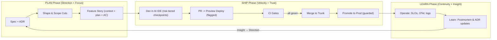

# Harmony Methodology

Harmony is an AI-native, human-governed development methodology for solo builders.

Harmony empowers solo developers across experience levels to ship high-quality software with speed, safety, and confidence. It combines spec-led intent capture, context-efficient planning, autonomous AI execution loops, and risk-tiered human checkpoints within a principled, progressively adoptable framework.

Harmony is lean in ceremony and rich in capability: context-efficient artifacts, progressive disclosure, and fast feedback loops — without imposing vendor lock-in or stack prescription.

Harmony is stack-, host-, and environment-agnostic, adapting to your chosen IDE, terminal, harness, repository structure, and deployment platform. Start with the defaults; deepen as your project demands.

Work is organized as a closed loop across **PLAN** (Direction, Focus), **SHIP** (Velocity, Trust), and **LEARN** (Continuity, Insight). Defaults are principled and guardrails are opinionated: contract-first design, small-batch trunk flow, reversible delivery, observability, and secure-by-default controls informed by established standards.

---

> Terminology: Slices vs Layers — see `.harmony/cognition/_meta/architecture/slices-vs-layers.md`.

## Harmony’s Unifying Objective

Harmony unifies speed, safety, and simplicity so a solo builder can ship high-quality software quickly, safely, and predictably. AI agents drive planning, implementation, and verification autonomously within principled bounds, while humans govern direction, define safety boundaries, and exercise risk-tiered oversight. Every principle, guardrail, and artifact reinforces one or more of Harmony's six pillars and closes the loop from validated intent → focused implementation → fast shipping → safe delivery → preserved knowledge → structured learning.

### The Six Pillars

Harmony's pillars are organized in three phases forming a complete feedback loop. For the complete pillar specifications, see [`../pillars/README.md`](../pillars/README.md).

**PLAN Phase:**
1. **[Direction through Validated Discovery](../pillars/direction.md)** — Build the right thing because every feature is validated before investment.
2. **[Focus through Absorbed Complexity](../pillars/focus.md)** — Build features, not infrastructure — Harmony handles the rest.

**SHIP Phase:**
3. **[Velocity through Agentic Automation](../pillars/velocity.md)** — Ship fast because AI automation removes bottlenecks and multiplies output.
4. **[Trust through Governed Determinism](../pillars/trust.md)** — Ship confidently because behavior is predictable, agents are bounded, security is enforced, and mistakes are reversible.

**LEARN Phase:**
5. **[Continuity through Institutional Memory](../pillars/continuity.md)** — Knowledge persists because decisions, traces, and context are captured durably.
6. **[Insight through Structured Learning](../pillars/insight.md)** — Improve continuously because every outcome teaches us something.

Together these pillars create a self‑reinforcing system: Direction ensures we build the right thing, Focus gives us bandwidth to build it, Velocity and Trust let us ship fast and safely, Continuity preserves what we learned, and Insight feeds back to Direction for the next cycle.

#### Pillar Quick Reference

| Phase | Pillar | Developer Question | Key Practice |
|-------|--------|-------------------|--------------|
| PLAN | [Direction](../pillars/direction.md) | "What are we building?" | Spec-first validation |
| PLAN | [Focus](../pillars/focus.md) | "How do we think about it?" | Kits absorb complexity |
| SHIP | [Velocity](../pillars/velocity.md) | "How do we deliver fast?" | Agentic automation |
| SHIP | [Trust](../pillars/trust.md) | "How do we deliver safely?" | Governed determinism |
| LEARN | [Continuity](../pillars/continuity.md) | "How do we remember?" | ADRs, traces, ObservaKit |
| LEARN | [Insight](../pillars/insight.md) | "How do we improve?" | Postmortems, EvalKit |

> Terminology note: “SpecKit” (`speckit`) wraps GitHub’s Spec Kit. Mentions of the upstream tool use “GitHub’s Spec Kit” explicitly. PlanKit implements its planning kernel via BMAD; this adapter is transparent to methodology consumers.

#### Pillars → Practices Map (at a glance)

| Pillar | Phase | Primary Practices/Tools | Feedback loop it reinforces |
| --- | --- | --- | --- |
| Direction | PLAN | SpecKit; PlanKit (planning kernel); Shape Up; Convivial Impact Assessment | Validated specs ensure effort is well-spent; no code without approved spec |
| Focus | PLAN | kit-base; PromptKit; Turborepo; Hexagonal adapters | Absorbed complexity frees cognitive bandwidth; build features, not infrastructure |
| Velocity | SHIP | AgentKit; FlowKit; CIKit; Trunk‑Based Development; Vercel Previews | AI automation removes bottlenecks; fast, frequent delivery within validated direction |
| Trust | SHIP | PolicyKit; GuardKit; EvalKit; FlagKit; Pact; OpenAPI/JSON‑Schema | Typed contracts; bounded agents; rollback capability; fail‑closed governance |
| Continuity | LEARN | Dockit; ObservaKit; ADR templates; RunbookKit; OnboardKit | ADRs, traces, decision logs preserve context; knowledge survives time and handoffs |
| Insight | LEARN | EvalKit; DatasetKit; postmortem templates; retro practices | Postmortems, evals, retros drive continuous improvement; Insight → Direction loop |

> **Reference implementation.** Specific platforms above (Turborepo, Vercel) reflect Harmony's reference stack. Substitute your own build system and deployment platform. Harmony's principles and gates are stack-, host-, and environment-agnostic.

---

## Kit Architecture and Stage Mapping

Harmony's kit layer provides the building blocks that implement Harmony's gates and flows. For a concise mapping from Harmony's principles to specific kits, see "Harmony Alignment" in `.harmony/capabilities/services/_meta/docs/platform-overview.md#harmony-alignment`. In practice, use FlagKit for feature gating and progressive delivery, ObservaKit for telemetry, EvalKit/PolicyKit/GuardKit for gates, and PatchKit for PRs.

### Stage‑to‑Kit Map (operational)

- Spec → Plan → Flow → Implement → Verify → Ship → Learn
  - Spec/Shape: SpecKit (`speckit`), PlanKit
  - Flow orchestration: FlowKit (defines `FlowConfig`/`FlowRunner`/`FlowRunResult` and calls the shared LangGraph runtime under `agents/runner/runtime/**` to instantiate long‑running, stateful flows from plans or canonical prompts)
  - Implement (agentic): AgentKit (plan‑driven agents built on top of FlowKit and the shared runtime), DevKit, CodeModKit (as needed)
  - Verify/Govern: EvalKit (structure/hallucination), PolicyKit (ASVS/SSDF policy), GuardKit (redaction), TestKit (unit/contract/e2e), ComplianceKit (evidence)
  - Ship: PatchKit (PRs), Vercel Previews (promotion), ReleaseKit (changelog)
  - Observe/Learn: ObservaKit (OTel traces + logs), BenchKit (perf), Dockit (docs/ADR), ScheduleKit (jobs)

#### LLMOps & ContextOps kit expectations

To keep responsibilities crisp and repeatable:

- **PromptKit (PromptOps, design-time)**
  - Standardizes **prompt templates, variable schemas, variants, and fixtures**.
  - Compiles templates (often from `packages/prompts/**`) into canonical prompts with `prompt_hash` and metadata used by ObservaKit/EvalKit/TestKit.
  - Does **not** own retrieval, logging/metrics, dashboards, or evaluation logic.

- **LLMOps (runtime monitoring, evaluation, governance)**
  - **ObservaKit**: traces/logs/metrics (including LLM cost/latency) for all model calls.
  - **EvalKit + DatasetKit**: evaluation suites and golden datasets for prompts/flows (e.g., hallucination, grounding, style), including per-template/variant scores.
  - **PolicyKit**: fail-closed policy rules (determinism, redaction, safety thresholds) applied to LLM behavior.
  - **CacheKit**: idempotency and memoization for pure/expensive LLM operations.
  - **ModelKit / CostKit** (when adopted): model policy, routing, and cost budgets.
  - **FlowKit / AgentKit / ToolKit**: orchestrate and execute agent flows that *use* prompts compiled by PromptKit.
  - **UIkit**: provides human-friendly surfaces (playgrounds, dashboards, approver UIs) composed over these kits.

- **ContextOps (RAG pipelines and context design)**
  - **IngestKit → IndexKit → QueryKit (+ SearchKit)**: ingest, normalize, index, and retrieve content with provenance; define context quality and retrieval behavior.
  - **PromptKit**: defines **context slots and schemas** in templates (e.g., how retrieved documents, policies, or prior runs are embedded in prompts) and validates those inputs before rendering.
  - **ObservaKit + EvalKit + DatasetKit**: observe and evaluate retrieval behavior and answer grounding; PromptKit does not construct indexes or decide which documents to retrieve.

This mirrors the mental model used in `.harmony/capabilities/services/_meta/docs/platform-overview.md` and the kit architecture docs: PromptKit is the **PromptOps kit at the template/contract layer**, while LLMOps and ContextOps concerns are implemented by a **composition of other kits** rather than being folded into PromptKit itself.

In practice, PlanKit, FlowKit, AgentKit, and the shared LangGraph runtime align as follows (see also `.harmony/capabilities/services/execution/service-roles.md`):

- SpecKit validates specs.
- PlanKit turns specs into governed plans (`plan.json`).
- FlowKit turns “run this flow with these prompts/manifests/paths” into HTTP calls to the shared LangGraph runtime.
- AgentKit consumes `plan.json`, decides which flows to run via FlowKit, and uses the shared runtime’s checkpointing to maintain durable agent state.

Use FlowKit when workflows:

- span multiple kits,
- must be paused/resumed or inspected, or
- require explicit, auditable state (maps, issue registers, reports).

### Deterministic Agent Loops & Provenance (kit-layer alignment)

- Standard agent loop: Plan → Diff → Explain → Test (no direct apply). Each step produces an artifact (plan, proposed edits, risk/explain notes, tests) that is reviewable.
- Pin and record AI configuration whenever agents are used for code or content:
  - Provider, model and version; temperature/top_p, max_tokens; seed (if supported) and region.
  - Record the system prompt and inputs (minus secrets) and persist via ObservaKit traces.
  - Attach the ObservaKit trace URL (and EvalKit run ID when applicable) to the PR description.
- Require reproducibility:
  - Add or update AI “golden tests” guarded by JSON‑Schema via EvalKit/TestKit; fail on schema or material output drift.
  - Prefer low‑variance settings (temperature ≤ 0.3) for deterministic outputs; justify higher variance in PR.
- License and provenance:
  - Run GitHub Dependency Review and include a license/provenance note in the PR.
  - Avoid adding new dependencies unless they materially reduce complexity; prefer permissive licenses (MIT/BSD/Apache).

Prompt templates and variants used in these loops are standardized and compiled by **PromptKit** (template/variable/variant contracts and `prompt_hash`), while **IngestKit/IndexKit/QueryKit/SearchKit** own retrieval behavior for any context injected into those prompts and **ObservaKit/EvalKit/DatasetKit/PolicyKit/CacheKit/ModelKit/CostKit** own LLMOps concerns (telemetry, evaluation, governance, cost, and reliability). This keeps PromptKit focused on **PromptOps at the template/contract layer** and prevents LLMOps or ContextOps responsibilities from leaking into the prompt templating kit.

---

## System Guarantees (self‑reinforcing invariants)

Harmony operates as a closed loop with a few non‑negotiable, compounding habits that keep solo development fast, safe, and sustainable:

- Spec‑first changes: Every material change starts with a one‑pager + ADR and micro‑STRIDE. No spec, no start.
- No silent apply: Agents produce plans/diffs/tests only; humans gate side‑effects. Local runs default to `--dry-run`.
- Deterministic AI: Provider/model/version/params pinned; low variance (temperature ≤ 0.3); prompt hash recorded; golden tests guard drift.
- Observability required: Changed flows must emit OTel spans/logs; PRs link a `trace_id`. Evidence packs are assembled per PR.
- Idempotency & rollback: Mutations use idempotency keys; risky features ship behind flags; rollback is “promote prior preview”.
- Fail‑closed governance: Policy/Eval/Test gates block on missing evidence or violations; High‑risk changes require a Navigator pass with an explicit security checklist.
- Local‑first & privacy‑first: Secrets never leave Vault/env; PII redacted at log/write boundaries; offline telemetry buffers flush later.
- Cost & efficiency guardrails: Publish monthly AI token and infra budgets; alert on cost anomalies; freeze risky merges/promotions on sustained anomalies until budgets recover. PRs that use AI must include pinned model config and a short cost note (estimated/observed).
- Supply chain provenance: SBOMs are produced for releases and build artifacts are attested (e.g., GitHub attestations/Sigstore). Provenance notes are linked in PRs for changes that affect build/release surfaces.
- Small batches by policy: Trunk‑based, tiny PRs, explicit WIP limits, and preview smoke keep cycle time short and outcomes reversible.
- Waiver discipline: Gate waivers are exceptional and rare; Navigator approval (with a security checklist for High‑risk) is required with an explicit scope/timebox (≤ 7 days or until merge) and a PR‑linked justification. Waivers are disallowed for secrets/PII exposure, missing observability on changed flows, missing rollback/flag, and sustained SLO burn‑rate violations. Waivers auto‑expire at merge and must include a follow‑up issue for any residual risk or work.

These guarantees align 1:1 with Harmony’s kit-layer invariants (determinism, typed contracts, idempotency, observability, and fail‑closed policy), ensuring the methodology is self‑reinforcing instead of fragile.

---

## Methodology Map

Use these companion documents when you need deeper operational detail:

- `spec-first-planning.md` — Spec-first planning workflow, templates, and AI IDE integration.
- `flow-and-wip-policy.md` — Board columns, WIP limits, Definitions of Ready/Done/Safe/Small, and risk rubric.
- `ci-cd-quality-gates.md` — CI/CD pipeline, required checks, and waiver policy.
- `security-baseline.md` — OWASP ASVS/NIST SSDF alignment, STRIDE per feature, and defenses.
- `reliability-and-ops.md` — SLIs/SLOs, error budgets, incidents, and postmortems.
- `performance-and-scalability.md` — Perf budgets, caching, queues, and load testing.
- `architecture-and-repo-structure.md` — 12-Factor modulith, Hexagonal boundaries, and feature flags.
- `tooling-and-metrics.md` — GitHub/Vercel/Turborepo tooling map and improvement metrics.
- `adoption-plan-30-60-90.md` — 30/60/90 adoption plan and quick-start cadence.
- `sandbox-flow.md` — Canonical end-to-end sandbox flow using previews, flags, CI gates, and observability before production rollout.

---

## Harmony's Components

Here’s an explanation of each framework, method, and tool in the **Harmony Methodology** — and *why* it aligns with Harmony’s AI-native, human-governed delivery model. Together, these ensure that every change — human or AI-generated — is **traceable, testable, and reversible**, fulfilling Harmony’s promise of fast, safe, high-confidence shipping.

### Frameworks & Standards

| Item                       | Role                                       | Why it aligns with Harmony                                                                                                                                                                                                                   |
| -------------------------- | ------------------------------------------ | -------------------------------------------------------------------------------------------------------------------------------------------------------------------------------------------------------------------------------------------- |
| **OWASP ASVS v5**          | Application Security Verification Standard | Provides clear, testable security requirements (auth, input validation, crypto, logging) that integrate directly into Harmony’s **spec-first + CI gates** (CodeQL, Semgrep, SBOM). Maps 1-to-1 with Harmony’s “security by default” policy.  |
| **NIST SSDF (SP 800-218)** | Secure Software Development Framework      | Defines secure development activities (planning, coding, reviewing, releasing) that Harmony automates and embeds into each lifecycle stage. The SSDF “plan-protect-produce-respond” phases align with Harmony’s Spec → CI → Postmortem loop. |
| **OpenTelemetry (OTel)**   | Observability Standard                     | Harmony mandates OTel for **structured logs, traces, and metrics**, ensuring reliable AI observability and root cause analysis (tied to **ObservaKit** and **BenchKit**).                                                                    |

### Methods & Practices

| Item                        | Role                               | Why it aligns with Harmony                                                                                                                         |
| --------------------------- | ---------------------------------- | -------------------------------------------------------------------------------------------------------------------------------------------------- |
| **Google SRE**              | Reliability Engineering discipline | Introduces SLIs, SLOs, and **error budgets**, the backbone of Harmony’s reliability guardrails and postmortems.                                    |
| **DORA Metrics**            | DevOps performance metrics         | Harmony explicitly targets DORA’s four keys—lead time, deploy frequency, MTTR, and change-fail rate—to measure improvement in automation and flow. |
| **Trunk-Based Development** | Integration practice               | Core to Harmony’s “flow over ceremony”: small, frequent PRs to a single trunk with instant **preview deploys** and feature flags for safe rollout. |
| **12-Factor App**           | Cloud-native design principles     | Ensures stateless, portable, and disposable services—Harmony’s **monolith-first stack** (e.g., Turborepo) adheres to this for simplicity and speed.        |
| **Kanban / Little’s Law**   | Flow optimization principle        | Harmony’s WIP limits (Ready=3, In‑Dev=1, In‑Review=1, Preview=1) derive directly from Little’s Law to maximize throughput and reduce cycle time.                   |
| **Shape Up**                | Product shaping method             | Used to size “appetites” and cut scope before development—Harmony’s shaping step implements this to define crisp, buildable features.    |
| **STRIDE**                  | Threat-modeling methodology        | Harmony mandates STRIDE per feature in the spec phase, linking threats → mitigations → tests, enforced by **PolicyKit** and **GuardKit**.          |
| **Monolith-First**          | Architectural strategy             | Harmony advocates a **modular monolith** (e.g., in Turborepo) before microservices—maximizing speed and minimizing ops overhead for solo developers.       |

### Architectural Patterns

| Item                       | Role                           | Why it aligns with Harmony                                                                                                                                                      |
| -------------------------- | ------------------------------ | ------------------------------------------------------------------------------------------------------------------------------------------------------------------------------- |
| **Hexagonal Architecture** | Domain-driven ports & adapters | Core pattern of Harmony: keeps business logic isolated from infrastructure. Enables testability, AI-generated adapters, and contract testing via **Pact** and **Schemathesis**. |

> **Reference implementation.** The platforms below are used in Harmony's reference stack. Substitute equivalents as appropriate.

### Platforms & Platform Controls

| Item       | Role                           | Why it aligns with Harmony                                                                                                                                                |
| ---------- | ------------------------------ | ------------------------------------------------------------------------------------------------------------------------------------------------------------------------- |
| **Vercel** | Deployment platform            | Implements Harmony’s **safe deploys**: PR previews, feature flags, and instant rollback (`vercel promote`)—turning SLO-based release gating into a one-command operation. |
| **GitHub** | Source of truth and guardrails | Provides branch protection, CODEOWNERS, and built-in secret scanning—Harmony integrates all into its CI/CD quality gates.                                                 |

### Build & Repo Tooling

| Item          | Role                | Why it aligns with Harmony                                                                                                                              |
| ------------- | ------------------- | ------------------------------------------------------------------------------------------------------------------------------------------------------- |
| **Turborepo** | Monorepo build tool | Supports Harmony’s **modular monolith** design: enables incremental builds, shared caching, and parallel CI pipelines for both Python and TypeScript. |

### Security Analysis Tooling

| Item        | Role                       | Why it aligns with Harmony                                                                                                    |
| ----------- | -------------------------- | ----------------------------------------------------------------------------------------------------------------------------- |
| **CodeQL**  | Semantic static analysis   | Integrated into CI for code scanning, enforcing ASVS/NIST controls for code-level vulnerabilities.                            |
| **Semgrep** | Rule-based static analysis | Fast, rule-driven checks for style and security; Harmony uses it alongside CodeQL for coverage and custom policy enforcement. |

### Testing & Contract Tools

| Item             | Role                       | Why it aligns with Harmony                                                                                                        |
| ---------------- | -------------------------- | --------------------------------------------------------------------------------------------------------------------------------- |
| **Playwright**   | End-to-end testing         | Powers preview smoke tests to validate deployments in **Vercel previews** before promotion.                                       |
| **Pact**         | Contract testing           | Enforces boundary contracts across adapters (Hexagonal pattern) and aligns with Harmony’s **ports/adapters testing discipline**.  |
| **Schemathesis** | Property-based API testing | Tests OpenAPI contracts automatically; enforces correctness and prevents drift—Harmony mandates this for APIs with OpenAPI specs. |

### Specifications & Schemas

| Item            | Role                     | Why it aligns with Harmony                                                                                 |
| --------------- | ------------------------ | ---------------------------------------------------------------------------------------------------------- |
| **OpenAPI**     | API description standard | Foundation of Harmony’s **spec-first** model; drives contract testing, diff checks, and schema validation. |
| **JSON Schema** | Data validation schema   | Used across Harmony kits to validate AI and API payloads, including “golden test” outputs for determinism. |

### Guidance

| Item                                   | Role                       | Why it aligns with Harmony                                                                                                                         |
| -------------------------------------- | -------------------------- | -------------------------------------------------------------------------------------------------------------------------------------------------- |
| **OWASP Cheat Sheets (CSP/CSRF/SSRF)** | Targeted security guidance | Harmony integrates these directly into the **Spec → Threat Model → Tests** flow; AI IDE prompts reference them by name during implementation. |

---

## How Harmony’s Components Reinforce Each Other

Methods (SRE, DORA, Shape Up) define how work flows. Frameworks and standards (ASVS, SSDF, STRIDE) define what “safe” means. Tools and platforms (Vercel, GitHub, OTel, Turborepo) ensure speed and safety coexist. This alignment makes Harmony AI-native, principled, and safe by default — so solo builders can move fast without breaking trust.

### 1) Security and Compliance (Defense‑in‑Depth)

- OWASP ASVS and NIST SSDF establish baseline security and development controls; specs and CI gates map directly to them.
- STRIDE injects threat modeling at design time (spec‑first), translating risks → mitigations → tests.
- CodeQL, Semgrep, and OWASP cheat sheets operationalize controls as automated CI checks and developer guidance.
- Outcome: security and compliance are built in, not bolted on after the fact.

### 2) Speed and Flow (Lean Delivery)

- Trunk‑Based Development, Kanban/Little’s Law, and Shape Up synchronize scope, WIP, and integration cadence.
  - Shape Up defines appetites and trims scope.
  - Kanban limits WIP to keep cycle times low.
  - Trunk‑based flow yields tiny, frequent integrations.
- Monolith‑First and 12‑Factor keep the architecture lean, reducing coordination and operational overhead.
- Outcome: delivery is continuous, reversible, and predictable.

### 3) Reliability and Observability (Continuous Feedback)

- Google SRE introduces SLIs/SLOs and error budgets; DORA metrics measure speed versus stability to guide release decisions.
- OpenTelemetry powers the observability stack (via ObservaKit) for traces, metrics, and structured logs.
- Vercel and GitHub provide controlled deployment and governance surfaces that enforce reliability goals.
- Outcome: reliability is measurable, and feedback loops are fast.

### 4) Architecture and Maintainability

- Hexagonal architecture, Turborepo, OpenAPI, and JSON Schema form Harmony’s structural backbone.
  - Contracts/schemas define boundaries and expectations.
  - Pact and Schemathesis ensure adapters remain compatible.
  - Turborepo enforces modularity and fast iteration.
- Outcome: systems are deterministic, testable, and easy to evolve—aligned with spec‑first and simplicity‑first rules.

### 5) Testing and Quality Assurance

- Playwright, Pact, and Schemathesis span the testing pyramid (E2E, contract, property‑based layers).
- Combined with JSON Schema validations and EvalKit, they produce verifiable AI and code outputs.
- Outcome: agent‑assisted changes are safe, observable, and reversible.

### 6) Guided Agentic Autonomy (Deterministic Agent Loops & Risk-Tiered Governance)

- Deterministic, reviewable agent loops: Plan → Diff → Explain → Test; no silent apply.
- Pinned AI configuration and low‑variance defaults; golden tests guarded by JSON‑Schema prevent drift.
- Observability and provenance: OTel traces/logs on runs; PRs include representative `trace_id` and Eval/Policy outcomes.
- Fail-closed governance: risk-tiered HITL checkpoints enforced; agents cannot approve PRs or push to protected branches; humans retain ultimate authority, oversight, and accountability.
- Outcome: AI systems autonomously self‑build, self‑heal, and self‑tune within deterministic, observable, and reversible bounds.

### In Short

- Not random best practices: each fills a clear gap (security, flow, observability, architecture) with minimal overlap.
- Mutual reinforcement: DORA depends on trunk flow; trunk flow depends on safe CI gates (ASVS, SSDF); SLOs depend on observability (OTel).
- Shared philosophy: prioritize small, deterministic, testable, reversible changes—the core of Harmony.

---

## Harmony in Practice

**Goal.** Ship small, quality, safe, and frequent changes with **enterprise‑grade** security, reliability, and performance using **AI-native** workflows with **risk-tiered human governance**. Humans own direction, safety boundaries, and material risk decisions.

**Guiding principle.** **Simplicity first**: prefer the smallest viable process, design, and tooling that satisfy the requirement. Add complexity only when SLOs, scale, or compliance clearly require it; avoid unnecessary dependencies.

**Methodology**:

- **Simplicity‑first**: choose the simplest process, design, and tooling that meets the requirement. Defer advanced patterns until justified by SLOs/scale/compliance. Default to no new dependency unless it materially reduces complexity.
- **Spec‑first**: every meaningful change starts with a **Specification one‑pager** + **ADR** capturing problem, scope, API/UI contracts, SLIs/SLOs, **non‑functionals**, and a **micro‑threat model (STRIDE)** mapped to **OWASP ASVS** & **NIST SSDF** tasks.
- **Context-efficient planning**: Convert the Spec to a context packet (structured intent + agent plan + acceptance criteria). AI agents generate plans/diffs/tests from the Spec within governed bounds; risk-tiered checkpoints enforce human oversight on material changes.
- **Flow over ceremony**: **Trunk‑Based Development** (+ short‑lived branches), tiny PRs, gated **Vercel Preview** per PR, **feature‑flagged** releases with guarded manual promote to prod; rollbacks are instant by promoting a prior preview.
- **Reliability guardrails**: Define **SLIs/SLOs**, manage via **error budgets**, alert on budget burn, run blameless postmortems with action items.
- **Security by default**: **OWASP ASVS** controls + **NIST SSDF** activities embedded in **CI/CD** quality gates: static analysis (**CodeQL/Semgrep**), dependency & **license** scan, **secret scanning**, SBOM, and contract tests.
- **Architecture**: **12‑Factor** monolith‑first in a **Turborepo** monorepo with **Hexagonal** boundaries enforced by **contract tests**, and observability via **OpenTelemetry** + structured logs.

**Expected impact (for a solo developer after 30–60 days)**:

- **Lead time**: hours → sub‑day for small changes via trunk flow, preview environments, and tiny PRs. **DORA** research supports doing speed *with* stability.
- **Change‑fail rate**: drops via feature flags, previews, contract tests, and error‑budget‑driven discipline.
- **MTTR**: minutes–hours via instant rollback (promote a known‑good preview) and clear runbooks.
- **SLO attainment**: measurable improvement by alerting on **burn‑rate** and holding code until budget recovers.

### Human–AI Roles & HITL Checkpoints

- Roles
  - Owner (you): accountable for risk, waivers, and promotion decisions.
  - Driver (usually you): owns implementation and rollout plan (often the Owner).
  - Navigator (you, separate pass): owns review, security/license checks, and rollout readiness.
  - Agents (AI IDE/terminal/harness): drive planning, implementation, and verification within governed bounds; never approve risk or production changes.
- Two‑pass rule: High‑risk changes require a Driver pass and a distinct Navigator pass (ideally time-separated) from spec to promotion; with 2 devs, Navigator is the other person.

- Non‑negotiables (AI)
  - Cannot commit directly to protected branches; cannot approve PRs; cannot handle secrets or long‑lived credentials.
  - Must produce artifacts (plan, diffs, tests) for human review; no silent apply. Mutations require idempotency keys.
  - Must operate with pinned provider/model/version and documented parameters (temperature, top_p, max_tokens, seed if supported); runs record a stable prompt hash.

- Non‑negotiables (Humans)
  - Classify PR risk (Trivial/Low/Medium/High) and confirm rollback/flag plan.
  - Verify license/provenance and secret hygiene; check OpenAPI/JSON‑Schema diff where applicable.
  - Confirm observability for changed flows (trace + structured logs) and attach a representative trace or trace_id in the PR.
- Required human‑in‑the‑loop checkpoints
  1. Before implementation: spec one-pager + micro-STRIDE + acceptance criteria approved by Navigator.
  2. Before merge: PR review using the risk rubric (below) with license/provenance note and OpenAPI diff.
  3. Before promotion: Feature behind a flag, Preview e2e smoke green, rollback noted, owner on‑call.
  4. After promote: 30‑minute watch window; check SLO burn‑rate and key SLIs; document in PR thread.
- Stop‑the‑line triggers (any → block or rollback)
  - Secret exposure, license violation, security regression (ASVS high/critical), SLO burn‑rate breach.
  - Missing rollback path or flag; Preview e2e red; OpenAPI breaking change without consumer sign‑off.
  - Missing observability on changed flows; missing PR risk rubric; AI model/provider/params not pinned when agents were used.
  - Debt budget exceeded or WIP limits breached for >24h without mitigation (freeze feature work; restore system health first).
- Decision log
  - Dockit auto‑prompts an ADR summary on merge; link PR, preview URL, post‑deploy notes, and (when agents were used) AI provider/model/version + parameters and ObservaKit/EvalKit run links.

### HITL Waivers & Exceptions (minimal rules)

- Waivers are exceptional and rare—prefer scope cuts, flags, and staged rollouts.
- Who can waive: Navigator (High‑risk requires Navigator security checklist). Agents cannot waive.
- PR requirements: waiver justification (why safe now), explicit scope/timebox (≤ 7 days or until merge), named owner, and link to a follow‑up issue.
- Disallowed waivers: secrets/PII exposure, missing rollback/flag, missing observability on changed flows, sustained SLO burn‑rate breaches (see Stop‑the‑line triggers).
- Expiration & tracking: waivers auto‑expire at merge; reopening requires a new waiver. Add a `waiver` label and review in the weekly retro.

---

## Method Lifecycle Overview

The lifecycle maps to Harmony's three pillar phases: **PLAN → SHIP → LEARN**, forming a closed feedback loop.



**The loop closes:** Insight (what we learned) feeds back to Direction (what we build next). Postmortems reveal what we should have validated; eval results inform future spec criteria.

Note: Schedule non‑blocking tasks (e.g., notifications, cache invalidation, analytics enrichment) with `next/after` where applicable so responses are fast and side‑effects are reliable without blocking the user path.

---

## Operating Cadence (Solo + AI)

**Cycle**: 1‑week mini‑cycles.
**Roles**: switch hats per PR: **Driver (build)**, **Navigator (review)**.

- **Async daily check‑in (2 bullets)**: Yesterday outcome, Today intent (+ block).
- **Second set of eyes**: For risky changes and critical boundaries (auth, billing, data), do a time‑separated Navigator pass and (if possible) get a quick external review.
- **Weekly retro (≤15 min)**: 3 questions: What slowed flow? What broke gates? What SLO budget burned? Adjust WIP/gates accordingly (error‑budget policy).

### Backlog Intake & Triage (lightweight)

- Keep Backlog bounded (≤ 30 active items); archive/split items stale > 30 days.
- New work must meet DoR essentials before moving to Ready; otherwise keep as “Idea/Draft”.
- Prioritize by appetite, SLO/risk, and value; stamp initial risk class and note flag/rollback approach.

### Sustainable Pace Policy

- Focus hours: two 2‑hour deep‑work blocks per day; async by default outside those blocks.
- No after‑hours work except incidents; incidents follow rollback‑first policy and postmortem within 48h.
- Daily Kaizen: 10 minutes to remove one friction (tooling, doc, test); track as a tiny PR and label `kaizen` for easy weekly review.
- If WIP limits are exceeded for >24h, pause new work, restore flow, then resume.
- No mid‑cycle scope increases; new asks go to Backlog/Ready. Descoping is allowed to protect the appetite.
- Reserve 10% weekly capacity for maintenance (deps, tests, docs) to prevent debt accumulation.
- WIP aging triggers: any card >2 days in **In‑Dev** or >3 days end‑to‑end cycle time triggers a stop-and-unblock; >3 days in **In‑Dev** escalates to a scope cut or split. Track WIP age and cycle time in board insights.

### Sustainability & Burnout Guardrails

- Meeting budget: ≤4 hours/week total synchronous meetings; default to async. Require an agenda and desired outcomes; auto‑cancel if missing. Keep at least one no‑meeting day/week for deep work.
- Focus protection: During focus blocks, notifications are silenced; only on‑call incidents may interrupt. Use the board to signal availability.
- Review SLA: PRs in **In‑Review** complete the Navigator pass within 4 working hours. If blocked >4 hours, cut scope or pause new work to maintain flow.
- Timeboxing & scope: If a task is estimated to exceed 1 day, split or descoped before starting. If **In‑Dev** reaches 1 day without reviewable output, initiate a scope cut.
- Communication hygiene: Prefer issues/PRs over DMs for decisions; summarize decisions in the PR/issue thread to preserve history.
- Recovery policy: No heroics. After incidents, preserve the 48h blameless postmortem and protect the following day’s focus blocks to recover.

---

## Flow & WIP Policy (Kanban for solo)

Harmony uses a lightweight Kanban flow with strict WIP limits and explicit Definitions of Ready/Done/Safe/Small to keep cycle times low and changes reversible. The default board is *Backlog → Ready → In‑Dev → In‑Review → Preview → Release → Done → Blocked*, with tight limits and a simple risk rubric.

See `flow-and-wip-policy.md` for the full board policy, WIP limits, definitions, debt/risk classifiers, and change-type gates.

## Spec-First Planning (step-by-step)

Harmony is explicitly spec-first: every meaningful change starts with a spec one-pager and feature story (structured context + agent plan + acceptance criteria), then runs through an AI-assisted loop of Plan → Diff → Explain → Test with risk-tiered human checkpoints.

See `spec-first-planning.md` for the full spec one-pager template, feature story pattern, and AI IDE integration guide.

---

> **Reference implementation.** The branching and release details below use Vercel as the deployment platform. The principles (preview-per-PR, guarded promotion, instant rollback, server-evaluated feature flags) are platform-agnostic.

## Branching & Release Model

- **Trunk‑Based**: short‑lived branches (≤1 day). One small change per PR. Use **feature flags** for any risky behavior.
- **Vercel Previews**: every PR gets a live URL for acceptance and e2e smoke. **Promote** a known‑good preview to production (instant rollback path).
- **Environment naming & Production policy**: Use **PR Preview** (per PR), **Trunk Preview** (on `main`), and **Production** (manual promote only). In Vercel, disable **Auto Production Deployments** so Production is updated exclusively via `vercel promote <preview-url>`.
- **Feature flags**: use **Vercel Flags** (Edge Config‑backed) as the provider (server‑evaluated). The in‑repo `packages/config/flags.ts` reads flag values from the Vercel provider (registered at app startup) and falls back to env overrides (`HARMONY_FLAG_*`) for local/dev. Call `setFlagProvider(vercelFlagsProvider)` during application startup — for this repo, register in `apps/api/src/server.ts` (API) and in Next.js SSR entry points (e.g., `apps/ai-console/instrumentation.ts` or your App Router root) when adding SSR surfaces. For **Astro SSG/static** pages, evaluate flags server‑side and inject values at build time or via Edge middleware; avoid using `process.env` in the browser. Otherwise, evaluation uses env (`HARMONY_FLAG_*`) and defaults. Clean up flags within 2 cycles.
- **Environments & secrets**: use **Vercel envs** + CLI to manage; never commit secrets; rely on **GitHub secret scanning** + **TruffleHog** in CI.
- **Preview smoke (fast path)**: Use Playwright or the provided helper `scripts/smoke-check.sh` to verify the PR Preview URL for core routes; link results in the PR.
- **Flags hygiene automation**: Run `scripts/flags-stale-report.js` weekly and remove or consolidate stale flags; each flag must have an owner and explicit expiry.
- **Next.js 15+/16 and React 19 note**: Defaults for `fetch`/GET handlers are `no-store`; opt into caching explicitly when stable and record cache keys. Prefer Server Actions for mutations and `next/after` for non‑blocking tasks; heed hydration mismatch warnings before enabling caching.
- **Small change policy**: PRs should satisfy **DoSm** by default. If not feasible, split scope or include a brief “size‑override” justification and obtain Navigator approval before merge.
- **Review cadence**: Aim to complete the Navigator review pass within 4 working hours of opening a PR to prevent idle WIP.

### Release Freeze Procedure (error‑budget policy)

Triggered when multi‑window burn‑rate alerts sustain > 30 minutes or SLOs are at risk:

1. Freeze risky merges and promotions (Medium/High risk) until budgets recover.
2. Keep features behind flags; reduce or disable canary cohorts; validate rollback by promoting a known‑good preview.
3. Prioritize reliability fixes: incident triage, perf regressions, error spikes, and missing observability on changed flows.
4. Exit criteria: error‑budget burn returns to healthy thresholds for two consecutive alert windows (or 24h) and preview smoke is green.
5. Communicate status in the current PR(s) and retro; link ObservaKit trace IDs and postmortem follow‑ups.

---

## CI/CD Quality Gates

Harmony’s CI/CD pipeline enforces linting, tests, type checking, contracts, security scans, SBOM, and provenance before merges. Gates are tuned for TypeScript and Python, with optional extras you can adopt over time.

See `ci-cd-quality-gates.md` for the full gate diagram, checklist, and waiver policy.

---

## Test Strategy (pyramid + contracts)

- **Unit** close to logic (pure TS/Python).
- **Contract tests** at **ports** (API/UI) to freeze **Hexagonal** boundaries: Pact for consumer/provider; validate OpenAPI with Schemathesis; Prism mocks for dev.
- **AI “golden” tests**: snapshot expected model outputs for critical prompts and guard with **JSON‑Schema**.
- **Golden test stability**: prefer deterministic fixtures and schema-based assertions; allow bounded tolerances for token variance. Fail on schema or material output drift, not minor wording differences.
- **E2E smoke** on Preview (Playwright) for core flows (login, pay, CRUD) — recommended.
- **Canary/flag validation checklist** before enabling flags for a % of users.
  - Start with a small, internal or low‑risk cohort (≤ 5% traffic) and default OFF.
  - Kill‑switch documented and verified; rollout plan and owner recorded.
  - Success criteria defined up‑front: p95 latency within budget, 5xx ≤ 0.5%, no SLO burn‑rate breach.
  - Observability in place: representative `trace_id` linked in PR; dashboard links attached.
  - Rollback rehearsal completed (`vercel promote <known‑good‑preview>`).
  - Idempotency validated on toggles; no client‑cached secrets or state drift.
  - Minimum canary window: ≥ 60 minutes of normal traffic before widening.

---

## Security Baseline (mapped to frameworks)

Harmony’s security baseline bakes OWASP ASVS and NIST SSDF into specs, CI, and operations, with STRIDE per feature and clear guidance for secrets, headers, and privacy.

See `security-baseline.md` for full control mappings, STRIDE guidance, header/secret policies, and accessibility/privacy notes.

---

## Reliability & Ops (Google SRE)

Harmony borrows heavily from Google SRE: SLIs/SLOs, error budgets, and blameless postmortems drive how we respond to incidents and tune guardrails over time.

**Insight → Direction:** Postmortems are where the [LEARN phase](../pillars/insight.md) feeds back to [PLAN](../pillars/direction.md). Each postmortem should answer: *"What should we have validated in the spec that we didn't?"* Action items flow into future spec criteria, closing the feedback loop.

See `reliability-and-ops.md` for detailed SLI/SLO guidance, error budget policy, on-call expectations, and the full postmortem template and severity table.

---

## Performance & Scalability

Harmony defines explicit performance budgets and leans on caching, queues, and load testing to keep latency and error rates within SLOs as usage grows.

See `performance-and-scalability.md` for perf budget guidance, caching/queue recommendations, and load-test practices.

---

## Architecture & Repository Structure

Harmony uses a 12-Factor, monolith-first modular monolith with Hexagonal boundaries and feature flags as a first-class concern.

See `architecture-and-repo-structure.md` for the detailed layout, feature flag implementation, and scaling policy from solo → 2 developers.

---

## AI IDE Prompt Library

> Use these prompts verbatim in your AI IDE or terminal agent. Keep prompts (suggested filenames) under `/docs/prompts/`. Paste into PRs as evidence.

- **Spec‑to‑code**:
  *“Given the spec below, propose a minimal design and file‑by‑file diff (TypeScript/Python). Include contract types, tests, and a step‑by‑step plan. Flag any security, privacy, or licensing concerns. Do NOT add new deps without justification.”*
- **Refactor‑safely**:
  *“Refactor `<path>` to match the Hexagonal boundary. Preserve public contracts and ensure existing tests pass. Propose additional tests for risky branches.”*
- **Generate tests from spec**:
  *“From this Spec + OpenAPI/JSON‑Schema, generate unit + contract tests. Include negative tests derived from STRIDE threats.”*
- **Schema & contract tests**:
  *“Validate responses against `<schema>` using AJV/Zod. Add tests that fail on schema drift.”*
- **Explain diff & risks**:
  *“Summarize this diff: intent, surface area, security/perf risks, rollback plan, and flags to guard.”*
- **License‑safe suggestion**:
  *“Recommend libraries with permissive licenses only (MIT/BSD/Apache). Provide license matrix and bundle impact. Avoid GPL.”*
- **Threat‑model from spec**:
  *“Enumerate STRIDE threats for this feature. For each, propose mitigations and tests (unit/contract/e2e).”*
- **Perf budget enforcement**:
  *“Check this change against our perf budgets. Identify bundle increases and server latency risks. Suggest reductions.”*
- **PR risk rubric (summarize & gate)**:
  *“Classify this PR as Trivial/Low/Medium/High using the lightweight rubric. List gating steps met (flag, rollback, preview smoke, Navigator pass + security checklist) and any missing gates.”*
- **Observability scaffolding**:
  *“Add OTel spans and structured logs to `<path/function>`. Ensure `trace_id` is logged on errors and key events. Show before/after snippets and a sample trace outline.”*

---

## Tooling Map

See `tooling-and-metrics.md` for a dedicated deep-dive into tooling and metrics.

> **Reference implementation.** The tooling below reflects Harmony's reference stack. Substitute your own equivalents as needed.

- **GitHub Projects**: board columns above; templates for Spec/Story/bug; Insights for cycle time. Protect `main` with **required checks**.
- **Actions matrix per package**: `turbo run lint test build --filter=...` using remote cache.
- **Required checks**: the gates configured in `infra/ci/pr.yml` (subset of §7); adopt additional gates incrementally.
- **Vercel**: previews on every PR; **promote** for instant rollback; env & secret management; **feature flags** via Vercel Flags/Toolbar; **cron** for schedules.
- **Scripts**: `scripts/smoke-check.sh` for quick PR preview smoke checks; `scripts/flags-stale-report.js` for weekly flag hygiene reports.

---

## Metrics & Improvement

- **Minimal DORA**: lead time (PR open→merge), deployment frequency, change‑fail %, MTTR. Track automatically via PR & Actions timestamps; correlate with SLO burn.
- **SRE targets**: publish current SLOs, weekly error‑budget report; adjust gates when burn is high (e.g., freeze features, raise test thresholds).
- **Kaizen log**: surface daily `kaizen` PRs in the weekly retro; aim for ≥5 small improvements/week. Celebrate and keep the habit compounding.
- **WIP/cycle analytics**: monitor WIP aging, 50th/90th percentile cycle time, and blocked WIP. Tighten WIP or cut scope if trends degrade for 2 consecutive weeks.
- **Cost dashboard**: review monthly AI token and infra cost trends; investigate anomalies; record decisions in the weekly retro and PR notes.
- **Weekly retro prompts**:

  - *What blocked flow?*
  - *What broke gates?*
  - *Which SLI/SLO regressed?*
  - *What 1 guardrail to tighten/loosen?*

---

## 30/60/90 Adoption Plan

See `adoption-plan-30-60-90.md` for the full staged adoption plan and quick-start cadence.

- **Day 1–30 (Foundations)**: set up **board, Spec/ADR, CODEOWNERS, branch protection**, Turbo pipelines, minimal CI (lint, unit, typecheck, preview). Enable **Vercel previews/envs**, **secret scanning**, **Dependabot**.
- **Day 31–60 (Security/Reliability)**: add **CodeQL, Semgrep, SBOM**, Pact/Schemathesis, Playwright smoke; define **SLOs**, alerts on burn rate; OTel + pino; require **Observability** for changed flows.
- **Day 61–90 (Perf & Flags)**: set **perf/bundle budgets**, feature flag process, load tests on preview, postmortems template, error‑budget policy in README.
  - Automate **flags hygiene** with `scripts/flags-stale-report.js`; adopt `scripts/smoke-check.sh` for fast preview validation.

---

## Worked Example — “OAuth login + org billing” (sketch)

**Spec extract (abbrev)**:

- Problem: Add OAuth (Google) login + org billing (Stripe).
- Contracts: `/api/auth/callback`, `/api/billing/webhook` (OpenAPI).
- Non‑functionals: p95 auth callback ≤ 600 ms; availability ≥ 99.9%.
- Security: ASVS V2 (authentication), V3 (session), V4 (access control), V10 (errors/logging). **STRIDE**: spoofing (OAuth state), tampering (webhook sig), info disclosure (PII), DoS (webhook storms), elevation (role mapping). Mitigations: state+nonce, Stripe signature verify, PII minimization, rate limit, RBAC checks.

**Feature story → AI IDE**:

- Context packets: OAuth sequence, Stripe events (`checkout.session.completed`, `invoice.paid`).
- Agent plan: add adapters (`adapters/oauth-google.ts`, `adapters/stripe.ts`), domain services (`AuthService`, `BillingService`), routes, tests (unit + Pact for webhook), e2e smoke on Preview.
- Acceptance: user can sign‑in → org created/linked; paid plan toggles flag `billing.active`; webhook retries idempotent.

**PR flow**:

- Tiny PR 1: contracts + stub adapters + tests (failing) → green.
- Tiny PR 2: OAuth implementation behind `flag.oauth_google`, CSRF/state checks, contract tests pass.
- Tiny PR 3: Stripe webhook with signature verify + idempotent store; Pact verifies; Playwright smoke passes on Preview.
- Release: enable `flag.oauth_google` to internal org only → monitor SLO/error rate → widen.

---

## Prompt Snippets Library

```plaintext
/docs/prompts/spec-to-code.md
/docs/prompts/refactor-safely.md
/docs/prompts/threat-model-from-spec.md
/docs/prompts/perf-budget-enforcement.md
/docs/prompts/license-safe-suggestion.md
```

---

## Extras

**Data migrations & rollback**:

- Forward‑only schema; write‑compat via dual‑write/dual‑read when needed; **feature flag** gates migration usage; keep backfill idempotent; have a `rollback.md` with `vercel promote` to prior deployment.

**Feature flags cleanup cadence**: tag flags by owner & expiry; automate weekly report; remove within 2 cycles.

**AI license‑safety tips**: prefer permissive deps; add **license scan gates**; AI IDE diff review must include license notes (`license-checker`, `pip-licenses`).

**Day‑in‑the‑life (Solo)**:

- **Mon**: Spec/Plan → small PR #1.
- **Tue**: Tests/contracts; PR #2.
- **Wed**: Feature + flags; preview smoke.
- **Thu**: Security scans & perf budgets; PR #3.
- **Fri**: Enable flag for internal; retro (15m); plan next cycle.

---

## Quick‑Start Page (tomorrow morning)

**Cadence & roles**: 1‑week cycle; switch hats between **Driver** and **Navigator**; async daily check‑ins.

**Simplicity‑first**: Ship the smallest viable change that meets the requirement; avoid new dependencies unless they clearly reduce complexity or meet a non‑functional requirement.

**Board & WIP**: Backlog → Ready (3) → In‑Dev (1) → In‑Review (1) → Preview (1) → Release → Done → Blocked.

**Spec → Plan → PR flow**:

1. Write **spec one-pager** + **ADR**.
2. Convert to **feature story** (context + plan + AC).
3. Use **AI IDE** to propose plan/diffs/tests with risk-tiered checkpoints.
4. Open tiny PR → **preview deploy** → run e2e smoke → merge if gates pass.

**Required CI checks**: lint/format; TS `--strict`; unit; typecheck; **OpenAPI diff (oasdiff)**; **CodeQL + Semgrep**; **Dependabot/SCA + Dependency Review (license)**; **secret scanning + TruffleHog**; **SBOM**; Preview URL comment; **Observability for changed flows** (trace/logs + trace_id in PR). Recommended: Pact/Schemathesis and **e2e smoke (Playwright or `scripts/smoke-check.sh`)**; publish **bundle/perf budgets** (CI enforcement optional).

**SLOs (starter)**: Availability 99.9%; p95 API ≤300 ms warm (≤600 ms incl. cold); p95 TTFB ≤400 ms; 5xx ≤0.5%. **Error budget** gates releases.

**Release behind a flag**: ship with `flag.<feature>=off` → enable for internal → ramp; **rollback** = *promote prior preview to production*.

**How to rollback**: Vercel dashboard/CLI: `vercel promote <deployment-url>`.

**Top 10 security/perf checks**:

1. STRIDE threats covered;
2. CSRF tokens on mutations;
3. CSP set;
4. SSRF outbound allow‑list;
5. Secrets in env only;
6. CodeQL/Semgrep clean;
7. SBOM present;
8. License policy OK;
9. p95 latency within budget;
10. bundle under budget.

**Incident hotline**: page only for **SLO burn** or **customer impact**; **rollback first**, then fix; blameless **postmortem** within 48h.

---

## Authoritative References

- **Standards**: OWASP ASVS v5 (canonical); NIST SSDF SP 800‑218 (v1.1)
- **Practices**: Google SRE (SLIs/SLOs, error budgets, postmortems); DORA metrics; Trunk‑Based Development; 12‑Factor App; Hexagonal architecture; Kanban/WIP (Little’s Law); Shape Up
- **Tooling & governance**: GitHub (branch protection, CODEOWNERS, secret scanning)
- **Static analysis & SCA**: CodeQL; Semgrep; Dependabot; OWASP Dependency‑Check; SBOM: Syft; Secret scanning: GitHub, TruffleHog
- **Testing & contract**: Playwright; Pact; Schemathesis
- **Observability**: OpenTelemetry (Next.js/Astro SSR + Node); pino
- **Delivery platform (reference implementation)**: Turborepo (caching/monorepo); Vercel (previews, envs, promote/rollback, feature flags, cron)
- **OWASP cheat sheets**: CSP, CSRF, SSRF

---

### Final notes

- This method intentionally **minimizes ceremony and maximizes capability**: few meetings, tiny PRs, clear gates, strong **spec-led intent capture** with **AI-native execution loops** and **risk-tiered human governance**.
- It **scales with your risk**: tighten gates when error budget burns, loosen when healthy.
- It is **stack-, host-, and environment-agnostic**, adapting to your project's needs while providing **enterprise‑grade** security and reliability from day one.
