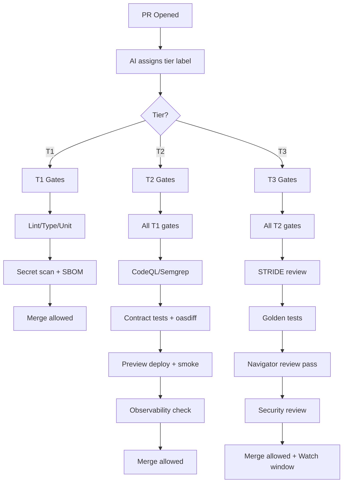

# CI/CD Quality Gates

This document provides the full reference for Harmony's CI/CD gates, organized by risk tier. It complements the methodology overview with a concrete pipeline, tier-specific checklists, and waiver rules you can wire directly into your CI configuration.

---

## Tiered Gate System

Harmony uses a **three-tier risk classification** that determines which CI gates run for each PR.

| Tier | Label | Gates | Human Review |
|------|-------|-------|--------------|
| **T1** | `tier:1` | Basic (lint, type, unit, secrets) | Minimal |
| **T2** | `tier:2` | Standard (+ security scans, preview, contracts) | Summary review |
| **T3** | `tier:3` | Full (+ STRIDE review, navigator pass, security) | Thorough review |

→ See [risk-tiers.md](./risk-tiers.md) for tier classification criteria.
→ See [auto-tier-assignment.md](./auto-tier-assignment.md) for how AI assigns tiers.

Solo-first note: **Owner** and **Navigator** are roles. When you’re solo, you perform both as distinct passes (ideally time-separated); when you have collaborators, they can be separate people.

---

## Pipeline Overview

The pipeline supports **TypeScript and Python**. CI runs language-specific linters, type checks, and tests per package using Turbo filters. **Gates are selected based on PR tier** (auto-assigned by AI, labeled on PR).

### Tiered Pipeline Flow



---

## Gates by Tier

### T1 Gates (Trivial)

**Required for T1 PRs:**

| Gate | Tool | Blocking | Notes |
|------|------|----------|-------|
| Lint/format | ESLint + Prettier | ✅ | Type-aware ESLint |
| Type check | `tsc --noEmit` | ✅ | Strict mode |
| Unit tests | Vitest/Jest | ✅ | Existing must pass |
| Secret scan | GitHub + TruffleHog | ✅ | Always run |
| Dependency alerts | Dependabot | ✅ | Check for CVEs |
| SBOM | Syft | ✅ | Generate artifact |

**Not required for T1:**
- CodeQL/Semgrep (run nightly instead)
- Preview deployment
- E2E smoke tests
- Contract tests
- Feature flags

**Human touchpoint:** Skim AI summary (30 sec), verify CI green, approve.

### T2 Gates (Standard)

**Required for T2 PRs (includes all T1 gates plus):**

| Gate | Tool | Blocking | Notes |
|------|------|----------|-------|
| Static analysis | CodeQL + Semgrep | ✅ | Fail on high-sev |
| License scan | Dependency Review | ✅ | Block restricted licenses |
| Contract tests | Pact/Schemathesis | ✅ | If API changes |
| OpenAPI diff | oasdiff | ✅ | Breaking change detection |
| Preview deploy | Vercel | ✅ | Auto-deploy PR |
| E2E smoke | Playwright | ✅ | Core flows |
| STRIDE-lite | Automated | ✅ | AI-generated analysis |
| Observability | Check spans/logs | ✅ | Changed flows only |
| Feature flag | Verify present | ✅ | Default OFF |

**Human touchpoint:** Review spec summary (2-5 min), spot-check PR (5-10 min), approve.

### T3 Gates (Elevated)

**Required for T3 PRs (includes all T2 gates plus):**

| Gate | Tool | Blocking | Notes |
|------|------|----------|-------|
| Spec approval | Human checkpoint | ✅ | **Before AI builds** |
| Full STRIDE | Human-reviewed | ✅ | Complete threat model |
| Golden tests | EvalKit/TestKit | ✅ | Critical paths |
| Integration tests | Full suite | ✅ | If applicable |
| Provenance | GitHub attestation | ✅ | For releases |
| Navigator review | Independent review pass | ✅ | Required |
| Security review | Navigator | ✅ | Explicit sign-off |
| ADR | Updated | ✅ | Architecture decision |
| Watch window | Post-promote | ✅ | 30 minutes |

**Human touchpoint:** 
1. Review full spec before build (10-15 min)
2. Review threat model (5-10 min)
3. Approve spec for build
4. Review PR + code (10-15 min)
5. Navigator security review
6. Post-promote watch (30 min)

---

## Gate Checklist (Complete Reference)

### Always Required (All Tiers)

- [ ] **Lint/format**: ESLint (type-aware) + Prettier
- [ ] **Type Check**: TypeScript (`tsc --noEmit` with strict)
- [ ] **Unit Tests**: Existing tests pass
- [ ] **Secret scan**: GitHub secret scanning + TruffleHog
- [ ] **Dependency alerts**: Dependabot active
- [ ] **SBOM**: Syft generates artifact

### T2+ Required

- [ ] **Static analysis**: CodeQL + Semgrep; fail on high-sev
- [ ] **License scan**: Dependency Review; block restricted
- [ ] **Contract tests**: Pact/Schemathesis if API changes
- [ ] **OpenAPI diff**: oasdiff for breaking changes
- [ ] **Preview deploy**: Vercel preview with URL comment
- [ ] **E2E smoke**: Playwright core flows
- [ ] **Feature flag**: Present and default OFF
- [ ] **Observability**: Changed flows emit traces/logs
- [ ] **PR size**: Meets DoSm or has size-override

### T3 Required

- [ ] **Spec approval**: Owner + Navigator before build (time-separated if solo)
- [ ] **Full STRIDE**: Complete threat model reviewed
- [ ] **Golden tests**: Critical paths covered
- [ ] **Navigator review**: Security-focused
- [ ] **Security sign-off**: Explicit approval
- [ ] **ADR**: Created or updated
- [ ] **Watch window**: 30 min post-promote scheduled

### Optional / Adopt Incrementally

- [ ] **Ruff/Black**: When Python added
- [ ] **mypy**: When Python added
- [ ] **Bundle budgets**: Size-Limit (report first, enforce later)
- [ ] **Perf budgets**: Lighthouse CI (report first)
- [ ] **SPDX headers**: Add to new files
- [ ] **Provenance/attestation**: For release artifacts

---

## Tier Override Rules

### Bumping Up (Always Allowed)

Anyone can bump a PR to a higher tier:

```bash
harmony tier-up <pr-number> --reason "touches session handling"
```

Reasons to bump up:
- Change is riskier than AI assessed
- Non-obvious dependencies
- First change in sensitive area
- Gut feeling says "be careful"

### Bumping Down (Restricted)

Bumping down requires justification:

| From → To | Allowed | Requires |
|-----------|---------|----------|
| T2 → T1 | Yes | Justification in PR |
| T3 → T2 | Yes | Navigator approval (review pass) |
| T3 → T1 | Yes | Navigator approval (security checklist) |

```bash
harmony tier-down <pr-number> --reason "config file in auth/ but no auth logic"
```

Valid reasons:
- File path triggered higher tier but content is trivial
- AI over-classified based on keywords
- Change is genuinely simpler than it looks

---

## Gate Waivers

Gate waivers are rare and tightly controlled.

### Waiver Authority by Tier

| Tier | Who Can Waive | Notes |
|------|---------------|-------|
| T1 | Owner | Rare; document reason |
| T2 | Navigator | Requires justification |
| T3 | Navigator (security checklist) | Avoid waivers; explicit sign-off required |

**AI agents cannot waive gates.**

### Waiver Process

1. Document waiver inline in PR using "Waivers" section
2. Include:
   - Justification (why is this safe?)
   - Scope/timebox (≤ 7 days or until merge)
   - Owner name
   - Follow-up issue link
3. Label PR with `waiver`
4. Review in weekly retro

### Never Waivable

These gates cannot be waived under any circumstances:

- Secret/PII scan failures
- Missing observability on changed flows (T2+)
- Missing rollback plan (T2+)
- Missing feature flag (T2+)
- Active SLO freeze
- T3 navigator review pass
- T3 spec approval

### Waiver Lifecycle

- Waivers auto-expire at merge
- Reopening PR requires new waiver
- All waivers reviewed in weekly retro

---

## CI Configuration

### Tier Detection in CI

```yaml
# .github/workflows/ci.yml
jobs:
  detect-tier:
    runs-on: ubuntu-latest
    outputs:
      tier: ${{ steps.tier.outputs.tier }}
    steps:
      - uses: actions/checkout@v4
      - name: Detect tier from label or AI
        id: tier
        run: |
          # Check for explicit tier label
          TIER=$(gh pr view ${{ github.event.pull_request.number }} --json labels -q '.labels[].name | select(startswith("tier:"))' | head -1)
          if [ -z "$TIER" ]; then
            # Run AI tier classification
            TIER=$(harmony classify-tier --pr ${{ github.event.pull_request.number }})
          fi
          echo "tier=${TIER#tier:}" >> $GITHUB_OUTPUT

  t1-gates:
    needs: detect-tier
    if: needs.detect-tier.outputs.tier == '1'
    # ... T1 gates

  t2-gates:
    needs: detect-tier
    if: needs.detect-tier.outputs.tier == '2'
    # ... T2 gates (includes T1)

  t3-gates:
    needs: detect-tier
    if: needs.detect-tier.outputs.tier == '3'
    # ... T3 gates (includes T2)
```

### PR Labels

| Label | Color | Description |
|-------|-------|-------------|
| `tier:1` | Green | Trivial - minimal review |
| `tier:2` | Yellow | Standard - normal review |
| `tier:3` | Red | Elevated - thorough review |
| `waiver` | Orange | Gate waiver in effect |
| `spec-approved` | Blue | T3 spec approved |

---

## Related Documentation

- [Risk Tiers Overview](./risk-tiers.md)
- [Auto-Tier Assignment](./auto-tier-assignment.md)
- [Flow & WIP Policy](./flow-and-wip-policy.md)
- [Spec Templates](./templates/README.md)
- [Human-Facing Risk Tiers](../RISK-TIERS.md)

Reference: Use the PatchKit PR Template (canonical) in `docs/services/automation-and-delivery/patchkit/guide.md` to standardize PR bodies, determinism/provenance notes, and tier information.
