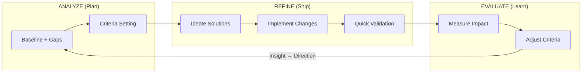

# ARE Loop Overview

The **Analyze → Refine → Evaluate (ARE) Loop** is a systematic methodology for improving documentation quality. It provides structured phases, standardized scoring, and quality gates to ensure documentation meets its intended purpose.

---

## For AI Agents

If you are an AI agent executing this workflow across multiple sessions, use the **Agent Harness**:

→ **[agent-harness.md](./agent-harness.md)** - Session protocol, progress tracking, verification checklists

The harness ensures reliable progress across context windows by:
- Tracking state in `<target-dir>/.harmony/.are/are-progress.json`
- Following a consistent session start/end protocol
- Verifying completion before marking phases done
- Committing progress for clean handoffs

**Directory Structure**:
- **Central ARE prompts**: `.harmony/orchestration/workflows/are/` (methodology files - this directory)
- **Runtime artifacts**: `<target-dir>/.harmony/.are/` (created per documentation set)

---

## What is the ARE Loop?

The ARE Loop transforms documentation improvement from ad-hoc editing into a rigorous, repeatable process. Each cycle produces measurable improvement and creates artifacts that inform future cycles. It aligns with Harmony's **PLAN → SHIP → LEARN** cycle while focusing specifically on iterative documentation quality improvement.



### Core Principles

- **Iterative and Adaptive**: Each cycle builds on the last, with criteria adjustments ensuring progressive gains in clarity, usability, and relevance.
- **User-Centric Focus**: Prioritizes feedback from end-users (readers, stakeholders) to drive meaningful changes.
- **Tiered by Risk**: Documentation criticality determines process depth (ARE-Lite, ARE-Standard, ARE-Full).
- **Flow-Optimized**: Explicit WIP limits and cycle constraints prevent context-switching and ensure completion.
- **Key Feedback Mechanism**: **Evaluation criteria are dynamically adjusted based on measured outcomes**, ensuring the loop evolves rather than stagnates.

### Harmony Alignment

ARE maps directly to Harmony's Six Pillars and three-phase methodology:

| Harmony Pillar | ARE Loop Support | ARE Phase | Harmony Phase |
|----------------|------------------|-----------|---------------|
| **Direction** | Gap Analysis identifies what to improve; Evaluation Context captures intent | Analyze | PLAN |
| **Focus** | Tiered evaluation depth prevents over-engineering; Scoring Rubric standardizes assessment | Analyze | PLAN |
| **Velocity** | Quick Reference enables fast execution; Stress Tests validate practical usability | Refine | SHIP |
| **Trust** | Quality Self-Check ensures thoroughness; Health Indicators provide confidence | Refine | SHIP |
| **Continuity** | Criteria Evolution Log preserves learning; Re-Evaluation Triggers maintain relevance | Evaluate | LEARN |
| **Insight** | Exploration Framework surfaces opportunities; Documentation Set Analysis finds patterns | Evaluate | LEARN |

**The loop closes:** Insight from Evaluate feeds back to Direction in Analyze. What we learned about documentation effectiveness informs what we improve next.

---

## When to Use ARE

| Scenario | Recommended Tier |
|----------|------------------|
| Fixing typos, minor clarifications | ARE-Lite |
| Improving existing guides, API docs, onboarding | ARE-Standard |
| Overhauling critical docs (security policies, compliance) | ARE-Full |
| Maintaining living documents (wikis, runbooks) | ARE-Standard |
| New documentation from scratch | ARE-Standard or ARE-Full |

---

## Cycle Overview

```
┌─────────────────────────────────────────────────────────────────────────┐
│                           ARE LOOP CYCLE                                │
├─────────────────────────────────────────────────────────────────────────┤
│                                                                         │
│   ┌─────────┐      ┌─────────┐      ┌──────────┐                       │
│   │ ANALYZE │ ──▶  │ REFINE  │ ──▶  │ EVALUATE │                       │
│   └─────────┘      └─────────┘      └──────────┘                       │
│        │                                   │                            │
│        │                                   ▼                            │
│        │           ┌──────────────────────────────────┐                │
│        │           │ Decision: Accept / Iterate / Stop │                │
│        │           └──────────────────────────────────┘                │
│        │                          │                                     │
│        └──────────────────────────┘                                     │
│              (if iterate)                                               │
└─────────────────────────────────────────────────────────────────────────┘
```

---

## Evaluation Tiers

Choose the appropriate depth based on document criticality:

| Tier | Name | When to Use | Time Budget | Cycle Duration | Recommended Cycles |
|------|------|-------------|-------------|----------------|-------------------|
| **ARE-Lite** | Quick pass | Minor updates, low-risk docs | 15-30 min | 1-2 days | 1-2 cycles |
| **ARE-Standard** | Full cycle | New docs, significant changes | 1-2 hours | 3-5 days | 3-4 cycles |
| **ARE-Full** | Deep dive | Critical docs, major refactors | 2-4 hours | 5-7 days | 4-6 cycles |

### Tier Selection Guide

```text
Is the document...
├── Trivial changes (typos, formatting)? → ARE-Lite
├── User-facing with moderate impact? → ARE-Standard  
├── Security, compliance, or legally binding? → ARE-Full
├── Critical to operations (runbooks, incident response)? → ARE-Full
└── Unsure? → Start with ARE-Standard, escalate if needed
```

### Time Allocation (per Cycle)

| Phase | Allocation | Activities |
|-------|------------|------------|
| **Analyze** | 25% | Gap analysis, criteria review, scope setting |
| **Refine** | 45% | Ideation (15%), implementation (25%), quick validation (5%) |
| **Evaluate** | 30% | Impact measurement, criteria adjustment, decision logging |
| **Total** | **100%** | |

### Time Scaling by Tier

| Tier | Analyze | Refine | Evaluate | Total |
|------|---------|--------|----------|-------|
| ARE-Lite | 15-20 min | 10-15 min | 5-10 min | ~30-45 min |
| ARE-Standard | 60-90 min | 50-70 min | 45-65 min | ~2.5-3.5 hrs |
| ARE-Full | 90-120 min | 90-120 min | 60-90 min | ~4-5.5 hrs |

### WIP Limits

- **Concurrent cycles per contributor**: 1-2 maximum
- **Complete or pause** before starting new cycles
- **Aging target**: No cycle should exceed 2× the tier's recommended duration without escalation

---

## Evaluation Context

Before beginning a cycle, document the evaluation context:

| Field | Value |
|-------|-------|
| **Document Being Evaluated** | |
| **Version** | |
| **Evaluation Date** | |
| **Evaluator(s)** | |
| **Previous Cycle Date (if any)** | |
| **Trigger for This Cycle** | New doc / Major update / Scheduled review / Issue-driven / User feedback |

---

## Suggested Evaluation Order

For first-time users or complex evaluations, follow this sequenced workflow:

| Step | Activity | Time (ARE-Standard) | Phase | Purpose |
|------|----------|---------------------|-------|---------|
| 0 | **Skim entire document** | 15-30 min | Pre-work | Build mental model before assessment |
| 1 | **Document Evaluation Context** | 5 min | Analyze | Capture version, trigger, evaluator |
| 2 | **Run automated checks** | 5-10 min | Analyze | Links, linting, readability score |
| 3 | **Gap Identification** | 30-45 min | Analyze | Systematic gap discovery |
| 4 | **Completeness Check** | 10-15 min | Analyze | Verify referential integrity |
| 5 | **Criteria Setting** | 10-15 min | Analyze | Weight and target decisions |
| 6 | **Prioritize + Ideate** | 15-20 min | Refine | Select top gaps, generate solutions |
| 7 | **Implement Changes** | 30-45 min | Refine | Make edits |
| 8 | **Quick Validation** | 5-10 min | Refine | Self-review and smoke test |
| 9 | **Measure Impact** | 20-30 min | Evaluate | Quantitative + qualitative |
| 10 | **Stress Tests** | 15-20 min | Evaluate | Scenario validation (Standard+) |
| 11 | **Decide + Document** | 10-15 min | Evaluate | Standardize / Continue / Pivot / Archive |

> **Tip**: For ARE-Lite, compress steps 3-8 into a single focused pass. For ARE-Full, expand steps 3 and 9 with stakeholder interviews and formal user testing.

---

## Prompt File Index

Use these prompts based on your task:

### Core Workflow (Sequential)

| File | Purpose | When to Use |
|------|---------|-------------|
| [01-are-analyze-single-doc.md](./01-are-analyze-single-doc.md) | Analyze phase for individual documents | Every cycle |
| [02-are-analyze-audits.md](./02-are-analyze-audits.md) | Optional deep-dive audits | ARE-Full or claim-heavy docs |
| [03-are-refine.md](./03-are-refine.md) | Refine phase | Every cycle |
| [04-are-evaluate.md](./04-are-evaluate.md) | Evaluate phase and decisions | Every cycle |
| [05-are-stress-tests.md](./05-are-stress-tests.md) | Validation scenarios | ARE-Standard+ |
| [06-are-quality-gates.md](./06-are-quality-gates.md) | Stop-the-line triggers, re-evaluation | Before Standardize decision |

### Specialized

| File | Purpose | When to Use |
|------|---------|-------------|
| [are-document-sets.md](./are-document-sets.md) | Multi-document analysis | 5+ related docs |
| [workflow-document-set-improvement.md](./workflow-document-set-improvement.md) | **End-to-end workflow** for doc sets | Improving a doc set around a concept |
| [07-are-templates.md](./07-are-templates.md) | All blank templates | Reference |
| [08-are-tooling.md](./08-are-tooling.md) | Tools and AI prompts | Setup, automation |
| [09-are-best-practices.md](./09-are-best-practices.md) | Anti-patterns, failure modes | Troubleshooting |
| [10-are-quick-reference.md](./10-are-quick-reference.md) | Condensed reference card | Quick lookup |
| [11-are-worked-example.md](./11-are-worked-example.md) | Complete example | Learning |

---

## Workflow Navigation

```
Start → 00-are-overview.md (select tier, understand scope)
           │
           ▼
    ┌──────────────────────────────────────────┐
    │           Individual Document?            │
    │                                          │
    │  Yes → 01-are-analyze-single-doc.md      │
    │         └─(optional)→ 02-are-analyze-audits.md
    │        03-are-refine.md                  │
    │        04-are-evaluate.md                │
    │         └─(optional)→ 05-are-stress-tests.md
    │         └─(optional)→ 06-are-quality-gates.md
    │                                          │
    │  No (Doc Set) → are-document-sets.md     │
    │                 + above phases           │
    └──────────────────────────────────────────┘
```

---

*This is the entry point for the ARE Loop methodology. Select your tier, then proceed to the appropriate phase prompts.*
