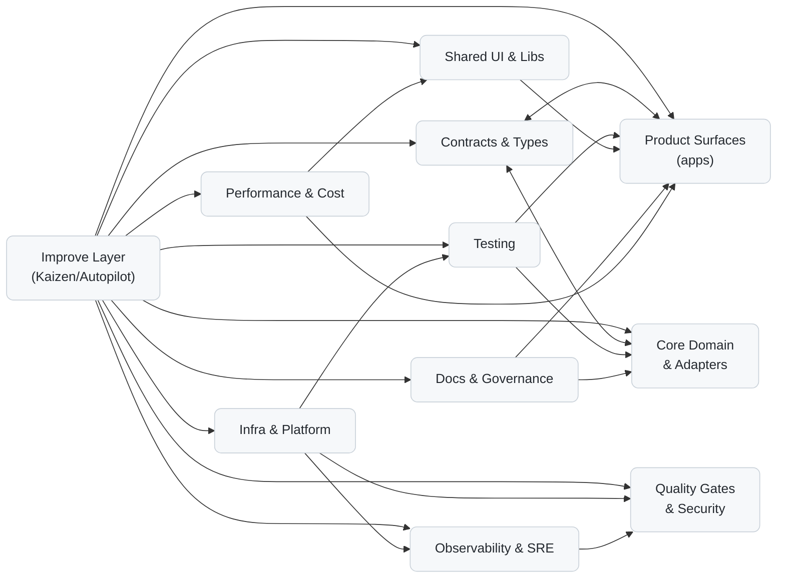

# Layers Overview

This document is a high‑level map of the repository’s layers — what each layer is responsible for, where it lives, who owns it (via `CODEOWNERS`), and which required checks must pass before changes to that layer can merge.

> Terminology note: In the Octon architecture, “layer” refers only to cross‑cutting governance/control‑plane concerns (e.g., Improve/Kaizen, quality gates, testing, docs). Runtime code is organized by vertical feature slices with hexagonal (ports/adapters) boundaries. See: [`slices-vs-layers.md`](./slices-vs-layers.md).

---

## Diagram (clickable)



> Tip: Some renderers support clickable nodes. If not, the table below includes the same references.

**Layer references (aligned with polyglot monorepo):**

- Product Surfaces → `apps/`, `agents/`
- Core Domain & Adapters → `packages/<feature>/domain/`, `packages/<feature>/adapters/`
- Contracts & Types → `contracts/`
- Shared UI & Libs → `packages/ui/` (if present), `packages/common/`
- Infra & Platform → `infra/`, `platform/`, `.github/workflows/`
- Quality Gates & Security → `.github/workflows/`, `ci-pipeline/`
- Testing → `packages/<feature>/tests/`, `apps/*/tests/`
- Observability & SRE → `platform/observability/`, `infra/otel/`, `apps/*/otel/`
- Docs & Governance → `docs/`, `docs/ADR/`, `.github/CODEOWNERS`
- Performance & Cost → `infra/perf/`, `apps/*/build/`
- Improve Layer → `kaizen/` (Kaizen/Autopilot home) plus `.github/workflows/kaizen.yaml` and `ci-pipeline/` for scheduling and orchestration

---

## Layer Registry

A concise map you can copy into `docs/layers/registry.yml` (optional) to keep the table and diagram in sync.

```yaml
layers:
  - name: Product Surfaces (apps & agents)
    folders: ["apps/", "agents/"]
    codeowners: ["/apps/** @team-apps", "/agents/** @team-platform"]
    required_checks: ["build", "lint", "typecheck", "unit", "e2e_smoke", "container_build"]
  - name: Core Domain & Adapters
    folders: ["packages/*/domain/", "packages/*/adapters/"]
    codeowners: ["/packages/*/domain/** @team-domain", "/packages/*/adapters/** @team-domain"]
    required_checks: ["lint", "typecheck", "unit", "contracts_verify"]
  - name: Contracts & Types
    folders: ["contracts/"]
    codeowners: ["/contracts/** @team-platform @team-api"]
    required_checks: ["contracts_diff", "schemathesis", "pact_verify"]
  - name: Shared UI & Libs
    folders: ["packages/ui/"]
    codeowners: ["/packages/ui/** @team-frontend"]
    required_checks: ["lint", "typecheck", "unit", "bundle_budget"]
  - name: Infra & Platform
    folders: ["infra/", ".github/workflows/"]
    codeowners: ["/infra/** @team-platform", "/.github/** @team-platform"]
    required_checks: ["iac_validate", "policy_check", "ci_selftest"]
  - name: Quality Gates & Security
    folders: [".github/workflows/", "infra/ci/"]
    codeowners: ["/.github/workflows/** @team-platform", "/infra/ci/** @team-platform"]
    required_checks: ["static_analysis", "sca_licenses", "secret_scan", "sbom"]
  - name: Testing
    folders: ["tests/", "apps/*/tests/"]
    codeowners: ["/tests/** @team-quality", "/apps/*/tests/** @team-quality"]
    required_checks: ["unit", "integration", "e2e_smoke"]
  - name: Observability & SRE
    folders: ["infra/otel/", "apps/*/otel/"]
    codeowners: ["/infra/otel/** @team-sre", "/apps/*/otel/** @team-sre"]
    required_checks: ["otel_coverage", "alerts_validate", "slo_check"]
  - name: Docs & Governance
    folders: ["docs/", "docs/ADR/", ".github/CODEOWNERS"]
    codeowners: ["/docs/** @team-docs", "/docs/ADR/** @team-architecture", "/.github/CODEOWNERS @team-platform"]
    required_checks: ["markdownlint", "vale_docs", "adr_lint"]
  - name: Performance & Cost
    folders: ["infra/perf/", "apps/*/build/"]
    codeowners: ["/infra/perf/** @team-platform", "/apps/*/build/** @team-frontend"]
    required_checks: ["bundle_budget", "perf_smoke", "cost_regression"]
  - name: Improve Layer (Kaizen/Autopilot)
    folders: ["kaizen/", "ci-pipeline/", ".github/workflows/kaizen.yaml"]
    codeowners: ["/kaizen/** @team-platform @team-quality", "/ci-pipeline/** @team-platform @team-quality", "/.github/workflows/kaizen.yaml @team-platform @team-quality"]
    required_checks: ["docs_hygiene", "flags_hygiene", "otel_scaffold", "contracts_drift"]
```

> Replace `@team-*` with your actual GitHub teams or users. The job names under `required_checks` should match your CI.

---

## Table — Layers, Folders, Owners, Required Checks

| Layer                            | Key folders                                         | Owners (CODEOWNERS patterns)                                                                   | Required checks                                                |
| -------------------------------- | --------------------------------------------------- | ---------------------------------------------------------------------------------------------- | -------------------------------------------------------------- |
| Product Surfaces (apps & agents) | `apps/` · `agents/`                                 | `/apps/** @team-apps`, `/agents/** @team-platform`                                             | build · lint · typecheck · unit · e2e_smoke · container_build  |
| Core Domain & Adapters           | `packages/*/domain/` · `packages/*/adapters/`       | `/packages/*/domain/** @team-domain`, `/packages/*/adapters/** @team-domain`                  | lint · typecheck · unit · contracts_verify                     |
| Contracts & Types                | `contracts/`                                        | `/contracts/** @team-platform @team-api`                                                      | contracts_diff · schemathesis · pact_verify                    |
| Shared UI & Libs                 | `packages/ui/` · `packages/common/`                 | `/packages/ui/** @team-frontend`, `/packages/common/** @team-frontend`                        | lint · typecheck · unit · bundle_budget                        |
| Infra & Platform                 | `infra/` · `platform/` · `.github/workflows/`       | `/infra/** @team-platform`, `/platform/** @team-platform`, `/.github/** @team-platform`       | iac_validate · policy_check · ci_selftest                      |
| Quality Gates & Security         | `.github/workflows/` · `ci-pipeline/`               | `/.github/workflows/** @team-platform`, `/ci-pipeline/** @team-platform`                      | static_analysis · sca_licenses · secret_scan · sbom            |
| Testing                          | `packages/*/tests/` · `apps/*/tests/`               | `/packages/*/tests/** @team-quality`, `/apps/*/tests/** @team-quality`                        | unit · integration · e2e_smoke                                 |
| Observability & SRE              | `platform/observability/` · `infra/otel/` · `apps/*/otel/` | `/platform/observability/** @team-sre`, `/infra/otel/** @team-sre`, `/apps/*/otel/** @team-sre` | otel_coverage · alerts_validate · slo_check                    |
| Docs & Governance                | `docs/` · `docs/ADR/` · `.github/CODEOWNERS`        | `/docs/** @team-docs`, `/docs/ADR/** @team-architecture`, `/.github/CODEOWNERS @team-platform` | markdownlint · vale_docs · adr_lint                            |
| Performance & Cost               | `infra/perf/` · `apps/*/build/`                     | `/infra/perf/** @team-platform`, `/apps/*/build/** @team-frontend`                             | bundle_budget · perf_smoke · cost_regression                   |
| Improve Layer (Kaizen/Autopilot) | `kaizen/` · `ci-pipeline/` · `.github/workflows/kaizen.yaml` | `/kaizen/** @team-platform @team-quality`, `/ci-pipeline/** @team-platform @team-quality`, `/.github/workflows/kaizen.yaml @team-platform @team-quality` | docs_hygiene · flags_hygiene · otel_scaffold · contracts_drift |

---

## Required Checks — Reference

Map these names to jobs in `.github/workflows/*.yml`.

- build: compile/build the app or packages
- lint: code style and static linting
- typecheck: TypeScript or equivalent type system
- unit / integration / e2e_smoke: test stages; e2e runs against previews
- container_build: Docker image build/scan (if applicable)
- contracts_diff: `oasdiff` or equivalent against canonical spec
- schemathesis: API property‑based tests against the OpenAPI
- pact_verify: consumer/provider contract verification
- bundle_budget: ensures bundles remain under budget
- iac_validate: Terraform/Pulumi/k8s schema validation
- policy_check: policy‑as‑code (e.g., OPA/Conftest) for infra and workflows
- ci_selftest: quick sanity on CI workflows/pipelines
- static_analysis: SAST/linters beyond style (e.g., CodeQL)
- sca_licenses: dependency vulnerability/license scan
- secret_scan: detect secrets in diffs
- sbom: build and validate software bill of materials
- otel_coverage: minimum tracing/logging coverage on changed paths
- alerts_validate: alert definitions compile; no broken dashboards
- slo_check: SLO/error budget guardrails
- perf_smoke: quick performance sanity (TTFB, P95 latencies)
- cost_regression: rough cost deltas (build/runtime) per change
- docs_hygiene / flags_hygiene / otel_scaffold / contracts_drift: jobs owned by the Improve layer

---

## CODEOWNERS — Patterns (starter, polyglot-aligned)

Place in `.github/CODEOWNERS` and adjust teams to match your org:

```text
# Product surfaces
/apps/**                      @team-apps
/agents/**                    @team-platform

# Domain & adapters
/packages/*/domain/**         @team-domain
/packages/*/adapters/**       @team-domain

# Contracts & shared libs
/contracts/**                 @team-platform @team-api
/packages/ui/**               @team-frontend

# Infra, CI, and gates
/infra/**                     @team-platform
/.github/**                   @team-platform
/infra/ci/**                  @team-platform

# Testing & Observability
/tests/**                     @team-quality
/apps/*/tests/**              @team-quality
/infra/otel/**                @team-sre
/apps/*/otel/**               @team-sre

# Docs & Governance
/docs/**                      @team-docs
/docs/ADR/**                  @team-architecture
/.github/CODEOWNERS           @team-platform

# Improve Layer
/kaizen/**                    @team-platform @team-quality
```

> Enforce at least one approving review from the layer’s owners for any change that touches their patterns.

---

## How to Add/Update a Layer

1. Create/confirm folders listed in the registry.
2. Add owners to `CODEOWNERS` using the patterns above.
3. Wire required checks in `.github/workflows/*.yml`; protect `main` to require them.
4. Link in docs: Add the layer to this document’s registry.
5. Improve layer hooks (optional): add evaluator/agent jobs that maintain the layer’s hygiene.
