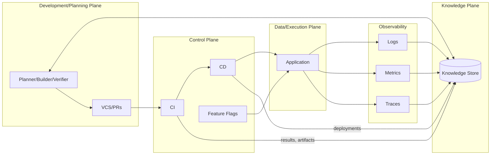

# Tooling Integration: Planes, Contracts, and Flows

This document specifies how Octon’s engineering toolchain integrates across planes (control, data, knowledge, and development), the contracts between tools, expected data flows, and operational guarantees. It serves as a reference for implementing, extending, and troubleshooting integrations.

Related docs: [monorepo polyglot (normative)](./monorepo-polyglot.md), [overview](./overview.md), [runtime architecture](./runtime-architecture.md), [knowledge plane](../../runtime/knowledge/knowledge.md), [observability requirements](./observability-requirements.md), [runtime policy](./runtime-policy.md), [contracts registry](./contracts-registry.md), [python runtime workspace example](/.octon/scaffolding/practices/examples/stack-profiles/python-runtime-workspace.md)

## Scope and Goals

- Define the planes and responsibilities across the ecosystem.
- Catalog tool roles and primary integration points.
- Specify inter‑kit contracts, payloads, and APIs.
- Document end‑to‑end flows and failure handling.
- Provide examples that are production‑ready and testable.
- Standardize preview deployments on Vercel for `apps/*`; promotion remains manual with flags.

## Determinism & Runtime Defaults (Authoritative)

- AI determinism: pin provider/model/version; prefer low temperature (≤ 0.3); record prompt hash (sha256), idempotency keys, and cache keys where applicable. Persist evidence to the Knowledge Plane for provenance.
- Runtime posture: prefer Node runtimes for heavy/long‑running or IO/AI work and delegate complex, multi‑step flows to the **platform runtime service** (see `runtime-architecture.md`); reserve Edge for lightweight evaluations (e.g., flags/headers) and read‑mostly endpoints. Keep correctness paths deterministic and server‑side by default.
- Caching posture: dynamic reads default to `no-store`; opt‑in caching requires explicit, stable keys/TTLs and observability validation.

## Polyglot Task Graph: Turborepo + pnpm + uv

Octon uses a single Turborepo task graph that spans TypeScript and Python workspaces and enforces a contracts-first posture (see `monorepo-polyglot.md` for concrete `turbo.json`, `package.json`, `pnpm-workspace.yaml`, and `pyproject.toml` snippets).

### Workspaces

- **pnpm workspace** (`pnpm-workspace.yaml`):
  - `apps/*` — TS apps (Next.js, Astro, etc.).
  - `packages/*` and `packages/kits/*` — TS feature slices and kits.
  - `agents/*` — Python agent hosts (Planner/Builder/Verifier/Orchestrator and Kaizen/governance agents), exposed via shims.
  - `platform/*` — platform-level Python tools and platform runtime services (for example, `platform/runtimes/flow-runtime/**` as the LangGraph-based implementation of the platform flow runtime service).
  - `contracts` — contracts registry for OpenAPI/JSON Schema and generated TS/Py clients.
- **uv workspace** (`pyproject.toml`):
  - `[tool.uv.workspace].members = ["agents/*", "contracts/py", "platform/*"]`.
  - Shared lockfile (`uv.lock`) ensures deterministic Python environments.

### Core Turbo Pipeline

Key pipeline stages (conceptual):

- `gen:contracts`:
  - Inputs: `contracts/openapi/**/*`, `contracts/schemas/**/*`.
  - Outputs: `contracts/ts/**/*`, `contracts/py/**/*`.
  - Tools: `openapi-typescript` for TS, `openapi-python-client` for Python.
- TypeScript:
  - `ts:build`: depends on `gen:contracts` and `^ts:build`; builds `apps/*` and `packages/*`.
  - `ts:typecheck`, `ts:lint`, `ts:test`: propagate via `^ts:*` dependencies for incremental checks.
- Python (via uv):
  - `py:lint`: `uv run ruff check .` and `uv run ruff format --check .` (per Python member).
  - `py:typecheck`: `uv run mypy src`.
  - `py:test`: `uv run -m pytest -q`.
  - Each Python member (`agents/*`, `contracts/py`, `platform/*`) is wired into Turbo via a tiny `package.json` shim exposing `py:*` scripts.
- Aggregates:
  - `build`: depends on `ts:build`.
  - `test`: depends on `ts:test` and `py:test`.
  - `lint`: depends on `ts:lint` and `py:lint`.
  - `typecheck`: depends on `ts:typecheck` and `py:typecheck`.

The invariant: **no TS or Python build/test task runs against stale contracts**; `gen:contracts` must succeed first.

## Kit Versioning & Compatibility

- Contract versions: each kit must publish an explicit contract/ABI version (semantic versioning) alongside its APIs and span metadata.
- Compatibility metadata: declare supported peer kit versions (e.g., PolicyKit ↔ EvalKit) and persist a compatibility matrix in the Knowledge Plane.
- Breaking changes: require a major version bump, migration notes, and CI gating to prevent incompatible pairings.
- Deprecation windows: maintain backward compatibility for a defined period; surface deprecation warnings in CI and spans.
- Scope hygiene: keep kits thin; if scope grows, split into specialized sub‑kits to preserve single‑purpose clarity and predictable interfaces.

### Adoption Notes (Cross‑References)

- ScheduleKit: introduce by Day 30 for periodic/background jobs with deterministic behavior and observability. See `migration-playbook.md`.
- ModelKit: introduce by Day 60+ to document and gate approved models/prompts; record model versions and prompt hashes for determinism. See `migration-playbook.md`.
- A11yKit: optional from Day 0–30 to centralize automated accessibility checks in CI; treat failures as policy/evaluation violations. See `a11ykit.md` and `migration-playbook.md`.
- i18nKit and SeedKit: optional at Day 60+ based on product needs. Use i18nKit to manage localization workflows and SeedKit for deterministic seed data. Default to off for small teams. See `migration-playbook.md`.

### Sensitive Data Controls (Interplay)

- Redaction vs. Secrets: enforce a clear boundary. Secret retrieval and usage must flow exclusively through the secrets manager (VaultKit) with audited access. Redaction (GuardKit) scrubs/log‑write boundaries for PII/PHI and must never be used as a substitute for proper secret handling.
- Ordering: apply input validation → authorization → business logic; at emit time, apply redaction before any writes to logs/traces/metrics.
- Secret handling hygiene: all secret access paths go through VaultKit; do not pass secrets through logs/traces/metrics; GuardKit never processes secret values.
- Provenance: record redaction actions (categories, rule IDs) at low cardinality in spans for audit; do not emit sensitive values.

## Terminology and Planes

- **Data/Execution Plane:** Application runtime handling user requests. Emits telemetry.
- **Control Plane:** CI/CD, feature flags, and orchestrators that configure and deploy the data plane.
- **Knowledge Plane:** Aggregated system knowledge (designs, specs, build/test results, deployments, and derived insights). Not on the runtime critical path.
- **Development/Planning Plane:** Source control, code review, IDEs, and planning/AI agents.
- **Security Plane (conceptual):** Governance and security enforcement overlaying all planes.



## CI as Control Plane (Gates)

- Security gates: CodeQL, Semgrep, SBOM, and secrets/licensing scans fail‑closed on new critical issues.
- Contract gates: Pact (consumer/provider) and Schemathesis (fuzz/negative) for OpenAPI/JSON Schema contracts; block merges on failures unless waived per governance.
- Policy/Eval/Test gates: policy-as-code checks (align to ASVS/SSDF), evaluation runs, and extended tests for high-risk changes.
- PR template enforcement: require risk class, rollback plan, and a `trace_id` linking PR ↔ CI ↔ traces.
- Promotion: prefer manual promote after preview verification; rehearse instant rollback.

### Required Cross‑Cutting Checks (All PRs)

- `docs_hygiene`: documentation lint/consistency checks with evidence attached to PRs.
- `flags_hygiene`: stale/expired flag reports and ownership/expiry hints.
- `otel_scaffold`: missing span/log coverage suggestions for recently changed paths.
- `contracts_drift`: `oasdiff` or equivalent contract drift reports.

Notes: These checks are evidence producers; they do not bypass ACP. Bots may open PRs but never approve protected branches.

### Toolkit Integration Matrix (excerpt)

| Stage      | Kit(s)                                | Required spans            | Notes                                              |
| ---------- | ------------------------------------- | ------------------------- | -------------------------------------------------- |
| plan       | `plankit`                             | `kit.plankit.plan`        | Idempotent plans; evidence persisted to KP         |
| implement  | `agentkit`, `toolkit`, `cachekit`     | `kit.agentkit.execute`    | Record idempotency/cache keys; deterministic runs  |
| verify     | `evalkit`, `policykit`, `testkit`     | `kit.testkit.run`         | Fail‑closed gates incl. contracts/security         |
| ship       | `patchkit`, `releasekit`, `flagkit`   | `kit.patchkit.open_pr`    | PR annotations and flag hygiene                    |
| operate    | `observakit`, `benchkit`              | `kit.observakit.flush`    | Trace/log/metric baselines + DORA events           |

All kits must emit low‑cardinality spans and include a `trace_id` that correlates PR ↔ CI ↔ traces in the Knowledge Plane.

### Platform Runtime and Tool Adapters

The **platform runtime service** executes flows on behalf of apps, agents, and Kaizen. Tooling integration within flows must follow these rules:

- Tools (HTTP, DB, Git, CI, etc.) are exposed to flows as **adapters** configured via runtime configuration and secrets, not as ad‑hoc imports of infra libraries from flow code.
- Flow and kit authors depend on **stable tool contracts** (for example, HTTP client interfaces, repository adapters) that are versioned and captured in the `contracts/` registry, rather than calling low‑level infrastructure directly.
- Apps and agents:
  - Call the platform runtime via generated TS/Py clients (for example, `runtime-flows` in `contracts/ts` and `contracts/py`) with explicit caller metadata (`callerKind`, `callerId`, `projectId`, `environment`, and optional `riskTier`). The LangGraph-based implementation of the flow runtime lives under `platform/runtimes/flow-runtime/**` and is treated as an internal engine behind these contracts, not as a public HTTP surface.
  - Pass only configuration and inputs that are part of the runtime contract; they do not reach inside the runtime to wire tools.
- The runtime:
  - Binds tool adapters to flows according to configuration and policy (for example, which HTTP/DB endpoints are allowed per environment and risk profile).
  - Emits standardized telemetry for each run, including attributes such as `flow_id`, `flow_version`, `run_id`, `caller_kind`, `caller_id`, `project_id`, `environment`, and `risk_tier`, so observability and Kaizen/governance systems can reason about behavior consistently (see `runtime-architecture.md` and `observability-requirements.md`).

Notes

- Accessibility: optionally include an `a11ykit` that runs automated accessibility checks for key UIs as part of Policy/Eval/Test gates; suggested span name `kit.a11ykit.run`. Treat failures as policy violations.
- Scope discipline: keep `toolkit` a thin wrapper over deterministic actions (git/shell/http). If HTTP‑specific logic grows substantial, prefer a dedicated `httpkit` to preserve clarity and single‑purpose boundaries.

## Tooling Inventory and Roles

| Tool/Service                                       | Primary Role                               | Key Integrations                                                                 |
|----------------------------------------------------|--------------------------------------------|----------------------------------------------------------------------------------|
| VCS (GitHub/GitLab)                                | Code collaboration and review              | CI via webhooks/status checks; Issue tracker linking                             |
| CI (Actions/GitLab/Jenkins)                        | Build, test, analyze                       | VCS status; artifacts; Knowledge Plane results; SAST/coverage annotations        |
| CD (ArgoCD/Harness/scripts)                        | Promote artifacts to envs                  | CI artifacts; infra APIs; Observability for canaries; Feature flags coordination |
| Issue Tracker (Jira/GitHub Issues)                 | Planning and work tracking                 | VCS linking; bots; Knowledge Plane indexing                                      |
| Observability (Prometheus/Grafana, Jaeger, ELK)    | Metrics, traces, logs                      | App instrumentation (OpenTelemetry); event ingestion; Knowledge Plane indexing   |
| Feature Flags                                      | Runtime configuration                      | App SDKs; CD rollout gating; defaults/fallbacks                                  |
| Knowledge Plane                                    | System of record for engineering knowledge | CI/CD ingestion; Observability summaries; Agent APIs                             |
| Contracts (OpenAPI/JSON Schema)                    | API/interface specs                         | CI contract tests (Pact); fuzz/negative testing (Schemathesis)                   |
| Dev Tools (IDE/Review)                             | Pre‑commit checks and review context       | Linters in IDE; PR annotations (coverage, SAST, test failures)                   |
| Security Tools (Dependabot/SAST/DAST)              | Security posture and signals               | PRs to VCS; CI checks; issue creation                                            |

## Inter‑Kit Contracts

### Kaizen Layer Workflow (GitHub Actions sample)

A minimal, provider‑agnostic skeleton for scheduled/manual Kaizen runs. Adjust steps to your scripts and policies.

```yaml
name: Kaizen Autopilot
on:
  workflow_dispatch:
  schedule:
    - cron: "0 18 * * 1-5"  # 12:00 PM America/Chicago = 18:00 UTC

permissions:
  contents: write
  pull-requests: write

jobs:
  docs-hygiene:
    runs-on: ubuntu-latest
    steps:
      - uses: actions/checkout@v4
      - uses: pnpm/action-setup@v4
        with: { version: 9 }
      - run: pnpm -w install --frozen-lockfile
      - run: pnpm -w exec markdownlint .
      - run: pnpm -w exec vale docs/ || true
      - run: node kaizen/agents/open-pr-docs-hygiene.mjs

  flags-hygiene:
    runs-on: ubuntu-latest
    steps:
      - uses: actions/checkout@v4
      - run: node scripts/flags-stale-report.js
      - run: node kaizen/agents/open-pr-stale-flags.mjs

  observability-scaffold:
    runs-on: ubuntu-latest
    steps:
      - uses: actions/checkout@v4
      - run: node kaizen/evaluators/otel-coverage.mjs --threshold 0.7
      - run: node kaizen/agents/open-pr-otel-scaffold.mjs

  contracts-drift:
    runs-on: ubuntu-latest
    steps:
      - uses: actions/checkout@v4
      - run: pnpm -w exec oasdiff ./contracts/openapi/inventory.yaml ./dist/openapi.from-code.json --format md > ./kaizen/reports/oasdiff.md || true
      - run: node kaizen/agents/open-pr-contract-drift.mjs
```

Notes

- Jobs open PRs with attached artifacts (diff/tests/trace/report) per governance.
- Autopilot changes still require human review; bots cannot approve protected branches.
- Default schedule aligns with the Kaizen guidance; tune as needed.
- Kaizen PRs should use the repository template at `.github/PULL_REQUEST_TEMPLATE/kaizen.md` to capture trigger signal, evidence, and safety metadata.

### Flags Provider Registration (repo touchpoints)

- Register the server‑side flags provider in `apps/ai-console/instrumentation.ts` and `apps/api/src/server.ts`.
- Default new flags OFF; evaluate flags at the server boundary and pass decisions inward. Under outages, fail‑closed to safe defaults.

### VCS ↔ CI

- **Purpose:** Trigger pipelines and display commit/PR status.
- **Direction:** VCS → CI via webhooks on push/PR; CI → VCS via Status/Checks API.
- **Transport:** HTTPS webhooks; REST APIs.
- **Success criteria:** Required checks pass; PR annotated with results and links to run artifacts. Include trace/build identifiers to enable PR ↔ build ↔ trace correlation in the Knowledge Plane/Observability.

PR Trace/Build Annotation (Custom Action)

- We use a custom GitHub Action to publish a JSON annotation on each PR containing:
  - `build_id` (CI run id), `commit_sha`, `pr_number`
  - `trace_context` (root trace id or W3C traceparent for the CI run), optional `deployment_id`
  - links to artifacts and logs
- Example (GitHub Actions step):

```yaml
jobs:
  ci:
    runs-on: ubuntu-latest
    steps:
      - uses: actions/checkout@v4
      - name: Build & Test
        run: |
          echo "run build & tests"
      - name: Annotate PR with build/trace
        uses: actions/github-script@v7
        with:
          script: |
            const payload = {
              build_id: process.env.GITHUB_RUN_ID,
              commit_sha: process.env.GITHUB_SHA,
              pr_number: context.payload.pull_request?.number,
              trace_context: process.env.OTEL_TRACE_ID || '',
              artifacts_url: `${context.serverUrl}/${context.repo.owner}/${context.repo.repo}/actions/runs/${process.env.GITHUB_RUN_ID}`
            };
            core.info(`KP-correlation: ${JSON.stringify(payload)}`);
            github.rest.issues.createComment({
              owner: context.repo.owner,
              repo: context.repo.repo,
              issue_number: payload.pr_number,
              body: `Correlation: ${'```json'}\n${JSON.stringify(payload, null, 2)}\n${'```'}`
            });
      - name: Publish correlation to KP
        env:
          KP_TOKEN: ${{ secrets.KP_TOKEN }}
        run: |
          curl -sSf -X POST "$KP_BASE_URL/correlation" \
            -H "Authorization: Bearer $KP_TOKEN" \
            -H "Content-Type: application/json" \
            -d @<(jq -n \
              --arg run "$GITHUB_RUN_ID" \
              --arg sha "$GITHUB_SHA" \
              --arg pr  "${{ github.event.pull_request.number }}" \
              --arg trace "${OTEL_TRACE_ID:-}" \
              '{build_id:$run, commit_sha:$sha, pr_number:$pr, trace_context:$trace}'))
```

- The action both comments on the PR (human-friendly) and posts a machine-readable correlation record to the Knowledge Plane.
- Payloads MUST conform to the Knowledge Plane API: Correlation Ingestion schema (`POST /kp/correlation`) to ensure uniform ingestion.
- **Failure handling:** Branch protection blocks merges; reruns allowed; alerts to owners.

### CI ↔ Knowledge Plane

- **Purpose:** Persist build/test outcomes, coverage, and SBOM metadata.
- **Direction:** CI → KP (push after each pipeline stage).
- **Transport:** REST with token auth.
- **Data model (example):**

---

## Kaizen Workflow (Docs/Flags Hygiene)

Purpose: run safe, incremental Kaizen tasks on a schedule and on‑demand. Jobs open PRs with evidence and respect branch protections and ACP review.

Example (GitHub Actions skeleton):

```yaml
name: Kaizen Autopilot
on:
  workflow_dispatch:
  # Weekdays at 12:00 PM America/Chicago (18:00 UTC)
  schedule: [{cron: "0 18 * * 1-5"}]

permissions:
  contents: write
  pull-requests: write

jobs:
  docs-hygiene:
    runs-on: ubuntu-latest
    steps:
      - uses: actions/checkout@v4
      - uses: pnpm/action-setup@v4
        with: { version: 9 }
      - run: pnpm -w install --frozen-lockfile
      - run: pnpm -w exec markdownlint .
      - run: pnpm -w exec vale docs/ || true
      - run: node kaizen/agents/open-pr-docs-hygiene.mjs

  flags-hygiene:
    runs-on: ubuntu-latest
    steps:
      - uses: actions/checkout@v4
      - run: node scripts/flags-stale-report.js  # produces report + PR
      - run: node kaizen/agents/open-pr-stale-flags.mjs

  observability-scaffold:
    runs-on: ubuntu-latest
    steps:
      - uses: actions/checkout@v4
      - run: node kaizen/evaluators/otel-coverage.mjs --threshold 0.7
      - run: node kaizen/agents/open-pr-otel-scaffold.mjs

  contracts-drift:
    runs-on: ubuntu-latest
    steps:
      - uses: actions/checkout@v4
      - uses: pnpm/action-setup@v4
        with: { version: 9 }
      - run: pnpm -w install --frozen-lockfile
      - run: pnpm -w exec oasdiff ./contracts/openapi/inventory.yaml ./dist/openapi.from-code.json --format md > ./kaizen/reports/oasdiff.md || true
      - run: node kaizen/agents/open-pr-contract-drift.mjs
```

Notes:

- Autopilot tasks: docs/links/titles normalization; stale‑flag diffs with owners/expiry; preview smoke wiring for top routes.
- Copilot tasks (PRs require ACP gate): observability scaffolding PRs for missing spans/logs (with sample trace outlines), contract drift fixes using `oasdiff` on OpenAPI/JSON‑Schema; perf budget nudges with budget delta evidence; targeted threat‑model test stubs (STRIDE‑driven). Contracts and observability jobs above attach artifacts (e.g., `kaizen/reports/oasdiff.md`, trace coverage report) to PRs.
- Non‑negotiables: no bot approvals or direct pushes; AI configs pinned; artifacts produced for review. All PRs carry PR↔build↔trace correlation per Knowledge Plane schema.

```json
{
  "build_id": "ci-2025-11-11T10:35:00Z-9f2e",
  "repo": "octon/monorepo",
  "commit": "a1b2c3d",
  "branch": "feature/abc",
  "tests": [
    {"id": "spec:FR-003:unit:foo", "result": "pass", "duration_ms": 42},
    {"id": "spec:FR-007:int:bar", "result": "fail", "duration_ms": 3100, "trace": "trace-123"}
  ],
  "coverage": {"lines": 83.2, "branches": 78.5},
  "sbom_digest": "sha256:...",
  "artifacts": [
    {"name": "web-image", "type": "container", "digest": "sha256:..."}
  ]
}
```

- **Failure handling:** Buffer and retry on 5xx; do not block CI outcome.

### CI ↔ Issue Tracker

- **Purpose:** Link changes to work items and create incidents when needed.
- **Direction:** CI → Issues (optional automation); VCS messages close issues (Fixes #123).
- **Transport:** REST; commit message conventions.
- **Failure handling:** Non‑blocking; bots can reconcile periodically.

### CD ↔ CI and Infra

- **Purpose:** Deploy artifacts from CI to target environments.
- **Direction:** CI → CD trigger with artifact refs; CD → Infra (Kubernetes/cloud APIs).
- **Transport:** GitOps, REST/CLI.
- **Success criteria:** Health checks pass; canary metrics within thresholds.

### CD ↔ Observability

- **Purpose:** Automated canary analysis and deployment event correlation.
- **Direction:** CD → Obs (deployment events); CD ← Obs (metrics queries).
- **Transport:** Prometheus/Grafana APIs.
- **Example PromQL:** `rate(http_server_errors_total[5m]) < 0.01`.

### Feature Flags ↔ Application

- **Purpose:** Runtime configuration toggles for progressive delivery.
- **Direction:** App ↔ Flag Service (SDK with local cache and defaults).
- **Contract:** `flagClient.get("newFeatureX", default=false)`; must operate under network loss.
- **Failure handling:** Deterministic defaults; cache TTL with backoff.

### CI ↔ Contracts

- **Purpose:** Enforce contract-first design for published APIs and module interfaces.
- **Direction:** CI executes Pact (consumer/provider) and Schemathesis (OpenAPI-based fuzz/negative) tests; posts results to VCS and KP.
- **Success criteria:** All contract suites pass; breaking changes are either versioned or blocked.
- **Failure handling:** Block merge/deploy; waiver required for exceptions with explicit scope and expiry.

### Knowledge Plane ↔ Agents (Planner/Builder/Verifier)

- **Purpose:** Read specs and system state; write test and verification results.
- **Direction:** Agents ↔ KP via authenticated APIs.
- **Example endpoints:**
  - `GET /kp/specs/{id}` → Markdown spec.
  - `GET /kp/test_failures?since=2025-11-01`.
  - `POST /kp/test_results` → see CI ↔ KP schema.

### Security Tools ↔ VCS/CI

- **Purpose:** Surface dependency and code risks early.
- **Direction:** Security → VCS (PRs/comments); Security → CI (checks).
- **Failure handling:** Treat as required or advisory per policy; auto‑issue creation optional.

## Inter‑Plane Contracts

- **Control ↔ Data:** Deployments and configuration (including feature flags) from control to data; health and readiness from data to control.
- **Control ↔ Knowledge:** CD posts deployment facts (version, env, time) to KP for correlation.
- **Data ↔ Knowledge:** Telemetry routed from app instrumentation to observability and indexed/summarized into KP.
- **Dev ↔ Knowledge:** Developers and agents query specs, traceability, and recent results; update specs and links.
- **Contracts ↔ CI/Dev:** Contract definitions are the source of truth; CI validates changes and annotates PRs with contract diffs and results.

## End‑to‑End Flow

```mermaid
sequenceDiagram
  participant Dev as Developer/Agent
  participant VCS as VCS
  participant CI as CI
  participant CD as CD
  participant APP as Application
  participant OBS as Observability
  participant KP as Knowledge Plane

  Dev->>VCS: Push branch / open PR
  VCS-->>CI: Webhook triggers pipeline
  CI->>CI: Build, test, analyze
  CI->>VCS: Report PR status/annotations
  CI->>KP: Push results, coverage, SBOM
  CI-->>CD: Trigger deploy to staging
  CD->>APP: Rollout new version
  APP->>OBS: Emit metrics/logs/traces
  CD->>OBS: Post deployment event
  OBS-->>CD: Canary metrics query
  CD->>KP: Record deployment fact
  note over KP: Agents query KP for planning
  Dev->>VCS: Merge PR; repeat to prod
```

Flow narrative:

1. Commit/PR triggers CI which builds, tests, and annotates the PR.
2. CI publishes results and artifacts to the Knowledge Plane.
3. On success, CI triggers CD to stage/prod; CD records deployment into KP.
4. Application emits telemetry; Observability stores time‑aligned signals; KP indexes summaries/links.
5. Agents/planners use KP and Observability APIs to propose fixes or improvements and open issues/PRs.

## Automation and Sync

- **Webhooks/bots:** Keep issues, PRs, and knowledge entries in sync when items close or change.
- **Scheduled jobs:** Periodic SBOM and vulnerability syncs to KP and issue tracker.
- **PR annotations:** Coverage, test failures, and SAST comments via CI.

## Separation of Concerns

- CI ensures code quality and artifacts; it does not make user‑exposure decisions (CD/flags handle rollout).
- Feature flags provide values; application code interprets behavior.
- Knowledge Plane is authoritative for engineering knowledge but not on the application’s runtime path.
- Avoid duplicating truths between the issue tracker and KP; prefer linking or automated sync.

## Failure Handling and Resilience

- **CI unavailable:** Branch protections block merges; rerun when restored.
- **Flag service unreachable:** Use deterministic defaults and cached values; fail safe (prefer disabled).
- **Knowledge Plane down:** Application unaffected; CI buffers and retries publishing.
- **Observability degraded:** Minimal OS metrics/logs continue; alerts may be delayed; KP marks gaps.

## Implementation Notes and Examples

- **GitHub Commit Status API:** Report per‑job checks with URLs to logs.
- **Prometheus Canary Check:**

```bash
curl -s "${PROM_URL}/api/v1/query" \
  --data-urlencode 'query=rate(http_requests_total{status=~"5.."}[5m])'
```

- **Feature Flag Read (pseudo‑code):**

```ts
const enabled = flagClient.get("newFeatureX", false);
if (enabled) {
  renderNewPath();
} else {
  renderOldPath();
}
```

- **CI → KP publish (shell sketched):**

```bash
curl -X POST "$KP_URL/api/results" \
  -H "Authorization: Bearer $KP_TOKEN" \
  -H "Content-Type: application/json" \
  -d @results.json
```

## Extensibility

- Provider swaps (e.g., CI, flags, or CD) require only adapter changes at the contract level.
- New tools integrate by declaring: purpose, direction, transport, payload schema, and failure semantics.

## References

- OpenTelemetry instrumentation for services.
- GitHub/GitLab webhooks and Status/Checks APIs.
- Prometheus/Grafana/Jaeger APIs for metrics/traces.
- SBOM formats (CycloneDX, SPDX) and ingestion practices.
- Next.js: Server Actions and Partial Prerendering guidance.
- Next.js 16: default uncached GET route handlers; opt‑in caching only with stable keys.
- Vercel: promoting deployments and instant rollback.
