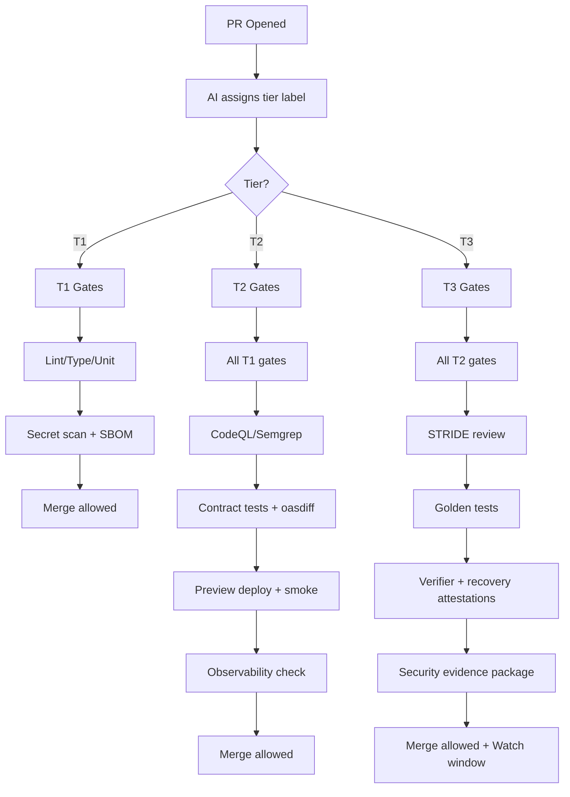

# CI/CD Quality Gates

This document provides the full reference for Octon's CI/CD gates, organized by risk tier. It complements the methodology overview with a concrete pipeline, tier-specific checklists, and waiver rules you can wire directly into your CI configuration.

---

## Tiered Gate System

Octon uses a **three-tier risk classification** that determines which CI gates run for each PR.

| Tier | Label | Gates | Oversight Mode |
|------|-------|-------|---------------|
| **T1** | `tier:1` | Basic (lint, type, unit, secrets) | Optional receipt/digest review |
| **T2** | `tier:2` | Standard (+ security scans, preview, contracts) | On-loop summary review; escalate only on thresholds |
| **T3** | `tier:3` | Full (+ STRIDE review, quorum attestations, security checks) | On-loop oversight + watch window |

→ See [risk-tiers.md](./risk-tiers.md) for tier classification criteria.
→ See [auto-tier-assignment.md](./auto-tier-assignment.md) for how AI assigns tiers.
→ Governance model: [Autonomous Control Points](../../governance/principles/autonomous-control-points.md), [Deny by Default](../../governance/principles/deny-by-default.md), [Arbitration & Precedence](../../governance/principles/README.md#arbitration--precedence).

Solo-first note: **Owner** and **Navigator** are roles. When you’re solo, you perform both as distinct passes (ideally time-separated); when you have collaborators, they can be separate people.

Canonical ownership: this document is the SSOT for tier gate matrices and checklists. `Gates by Tier` and `Gate Checklist (Complete Reference)` are the canonical sections; other methodology docs should summarize and link.

---

## Pipeline Overview

The pipeline supports **TypeScript and Python**. CI runs language-specific linters, type checks, and tests per package using Turbo filters. **Gates are selected based on PR tier** (auto-assigned by AI, labeled on PR).

### Tiered Pipeline Flow



---

## Gates by Tier

### T1 Gates (Trivial)

**Required for T1 PRs:**

| Gate | Tool | Blocking | Notes |
|------|------|----------|-------|
| Lint/format | ESLint + Prettier | ✅ | Type-aware ESLint |
| Type check | `tsc --noEmit` | ✅ | Strict mode |
| Unit tests | Vitest/Jest | ✅ | Existing must pass |
| Secret scan | CI secret scanning | ✅ | Always run |
| Dependency alerts | Dependabot | ✅ | Check for CVEs |
| SBOM | Syft | ✅ | Generate artifact |

**Not required for T1:**
- CodeQL/Semgrep (run nightly instead)
- Preview deployment
- E2E smoke tests
- Contract tests
- Feature flags

**Oversight touchpoint:** Skim AI summary and receipt digest (30 sec). Promotion still depends on ACP outcome, not standing approval.

**Governance note:** human confirmation is on-the-loop only; CI and ACP decisions are the canonical runtime gates for promotion.

### T2 Gates (Standard)

**Required for T2 PRs (includes all T1 gates plus):**

| Gate | Tool | Blocking | Notes |
|------|------|----------|-------|
| Static analysis | CodeQL + Semgrep | ✅ | Fail on high-sev |
| License scan | Dependency Review | ✅ | Block restricted licenses |
| Contract tests | Pact/Schemathesis | ✅ | If API changes |
| OpenAPI diff | oasdiff | ✅ | Breaking change detection |
| Preview deploy | Deployment platform preview/staging | ✅ | Auto-provision per PR |
| E2E smoke | Playwright | ✅ | Core flows |
| STRIDE-lite | Automated | ✅ | AI-generated analysis |
| Observability | Check spans/logs | ✅ | Changed flows only |
| Feature flag | Verify present | ✅ | Default OFF |

**Oversight touchpoint:** Review summary + receipt digest (2-5 min). Escalate only when policy thresholds are crossed or quorum is unresolved.

### T3 Gates (Elevated)

**Required for T3 PRs (includes all T2 gates plus):**

| Gate | Tool | Blocking | Notes |
|------|------|----------|-------|
| ACP preflight | ACP gate | ✅ | Stage + evidence contract before promote |
| Full STRIDE | Automated + verifier attestation | ✅ | Complete threat model |
| Golden tests | EvalKit/TestKit | ✅ | Critical paths |
| Integration tests | Full suite | ✅ | If applicable |
| Provenance | Artifact attestation | ✅ | Required for release artifacts |
| Verifier attestation | Independent agent/service | ✅ | Required for ACP-3 quorum |
| Recovery attestation | Independent agent/service | ✅ | Rollback path proven |
| ADR | Updated | ✅ | Architecture decision |
| Watch window | Post-promote | ✅ | 30 minutes |

**Human-on-the-loop oversight:** 
1. Review evidence summary before/after promote (required for T3)
2. Inspect receipts/digest and escalation artifacts when ACP returns `STAGE_ONLY`
3. Participate only when policy escalation thresholds are crossed
4. Run post-promote watch window (30 min)

---

## Gate Checklist (Complete Reference)

### Always Required (All Tiers)

- [ ] **Lint/format**: ESLint (type-aware) + Prettier
- [ ] **Type Check**: TypeScript (`tsc --noEmit` with strict)
- [ ] **Unit Tests**: Existing tests pass
- [ ] **Secret scan**: CI secret scanning is enabled and clean
- [ ] **Dependency alerts**: Dependabot active
- [ ] **SBOM**: Syft generates artifact

### T2+ Required

- [ ] **Static analysis**: CodeQL + Semgrep; fail on high-sev
- [ ] **License scan**: Dependency Review; block restricted
- [ ] **Contract tests**: Pact/Schemathesis if API changes
- [ ] **OpenAPI diff**: oasdiff for breaking changes
- [ ] **Preview deploy**: preview/staging URL is attached to the PR
- [ ] **E2E smoke**: Playwright core flows
- [ ] **Feature flag**: Present and default OFF
- [ ] **Observability**: Changed flows emit traces/logs
- [ ] **PR size**: Meets DoSm or has size-override
- [ ] **Security controls**: CSRF/CSP/SSRF controls verified for changed surfaces
- [ ] **Latency budgets**: p95 budget checks captured for risky/runtime-facing changes

### T3 Required

- [ ] **ACP preflight**: Stage + evidence package present before promote
- [ ] **Full STRIDE**: Complete threat model reviewed
- [ ] **Golden tests**: Critical paths covered
- [ ] **Verifier attestation**: Independent attestation for ACP-3 quorum
- [ ] **Recovery attestation**: Rollback proof attestation for ACP-3 quorum
- [ ] **ADR**: Created or updated
- [ ] **Watch window**: 30 min post-promote scheduled

### Optional Controls (Non-Blocking by Default)

- [ ] **Ruff/Black**: When Python added
- [ ] **mypy**: When Python added
- [ ] **Bundle budgets**: Size-Limit (report first, enforce later)
- [ ] **Perf budgets**: Lighthouse CI (report first)
- [ ] **SPDX headers**: Add to new files
- [ ] **Preview smoke helper**: optional helper script or workflow-run smoke tests against preview URLs
- [ ] **Flags hygiene report**: reviewed weekly via CI workflow or equivalent automation

---

## CI Health Objectives

- **PR pipeline target**: tier-appropriate required checks should complete in <= 7 minutes for normal PR paths.
- **Nightly heavy scan target**: full scans (CodeQL/Semgrep/secrets/SBOM and extended smoke) should complete in <= 20-30 minutes.
- **Tracking**: monitor median and 90th percentile duration; tighten cache, test split, or job scope when targets degrade for two consecutive weeks.

---

## Tier Override Rules

### Bumping Up (Always Allowed)

Anyone can bump a PR to a higher tier:

```bash
octon tier-up <pr-number> --reason "touches session handling"
```

Reasons to bump up:
- Change is riskier than AI assessed
- Non-obvious dependencies
- First change in sensitive area
- Gut feeling says "be careful"

### Bumping Down (Restricted)

Bumping down requires justification:

| From → To | Allowed | Requires |
|-----------|---------|----------|
| T2 → T1 | Yes | Justification in PR |
| T3 → T2 | Yes | Escalation artifact + verifier review |
| T3 → T1 | No | Prohibited direct downgrade; must downgrade to T2 first with escalation evidence, then re-evaluate |

```bash
octon tier-down <pr-number> --reason "config file in auth/ but no auth logic"
```

Valid reasons:
- File path triggered higher tier but content is trivial
- AI over-classified based on keywords
- Change is genuinely simpler than it looks

---

## Gate Waivers

Gate waivers are rare and tightly controlled.

### Waiver Authority by Tier

| Tier | Who Can Waive | Notes |
|------|---------------|-------|
| T1 | Policy owner | Rare; document reason |
| T2 | Policy owner + navigator review | Requires justification and expiry |
| T3 | Policy owner + navigator security checklist | Avoid waivers; explicit sign-off required |

**AI agents cannot waive gates. ACP receipt outcomes determine runtime promotion authority; humans retain policy authorship, exceptions, and escalation authority.**

### Waiver Process

1. Document waiver inline in PR using "Waivers" section
2. Include:
   - Justification (why is this safe?)
   - Scope/timebox (≤ 7 days or until merge)
   - Owner name
   - Follow-up issue link
3. Label PR with `waiver`
4. Review in weekly retro

### Never Waivable

These gates cannot be waived under any circumstances:

- Secret/PII scan failures
- Missing observability on changed flows (T2+)
- Missing rollback plan (T2+)
- Missing feature flag (T2+)
- Active SLO freeze
- Missing ACP-3 quorum evidence
- Missing ACP receipt/digest artifacts

### Waiver Lifecycle

- Waivers auto-expire at merge
- Reopening PR requires new waiver
- All waivers reviewed in weekly retro

---

## CI Configuration

### Tier Detection in CI

```yaml
# .github/workflows/pr-quality.yml
jobs:
  detect-tier:
    runs-on: ubuntu-latest
    outputs:
      tier: ${{ steps.tier.outputs.tier }}
    steps:
      - uses: actions/checkout@v4
      - name: Detect tier from label or AI
        id: tier
        run: |
          # Check for explicit tier label
          TIER=$(gh pr view ${{ github.event.pull_request.number }} --json labels -q '.labels[].name | select(startswith("tier:"))' | head -1)
          if [ -z "$TIER" ]; then
            # Run AI tier classification
            TIER=$(octon classify-tier --pr ${{ github.event.pull_request.number }})
          fi
          echo "tier=${TIER#tier:}" >> $GITHUB_OUTPUT

  t1-gates:
    needs: detect-tier
    if: needs.detect-tier.outputs.tier == '1'
    # ... T1 gates

  t2-gates:
    needs: detect-tier
    if: needs.detect-tier.outputs.tier == '2'
    # ... T2 gates (includes T1)

  t3-gates:
    needs: detect-tier
    if: needs.detect-tier.outputs.tier == '3'
    # ... T3 gates (includes T2)
```

### PR Labels

| Label | Color | Description |
|-------|-------|-------------|
| `tier:1` | Green | Trivial - minimal review |
| `tier:2` | Yellow | Standard - normal review |
| `tier:3` | Red | Elevated - thorough review |
| `waiver` | Orange | Gate waiver in effect |
| `spec-approved` | Blue | T3 spec approved |

---

## Related Documentation

- [Risk Tiers Overview](./risk-tiers.md)
- [Auto-Tier Assignment](./auto-tier-assignment.md)
- [Flow & WIP Policy](./flow-and-wip-policy.md)
- [Spec Templates](./templates/README.md)
- [Human-Facing Risk Tiers](../../runtime/context/risk-tiers.md)

Reference: Use the PatchKit PR Template (canonical) in `.octon/capabilities/runtime/services/delivery/patch/guide.md` to standardize PR bodies, determinism/provenance notes, and tier information.
