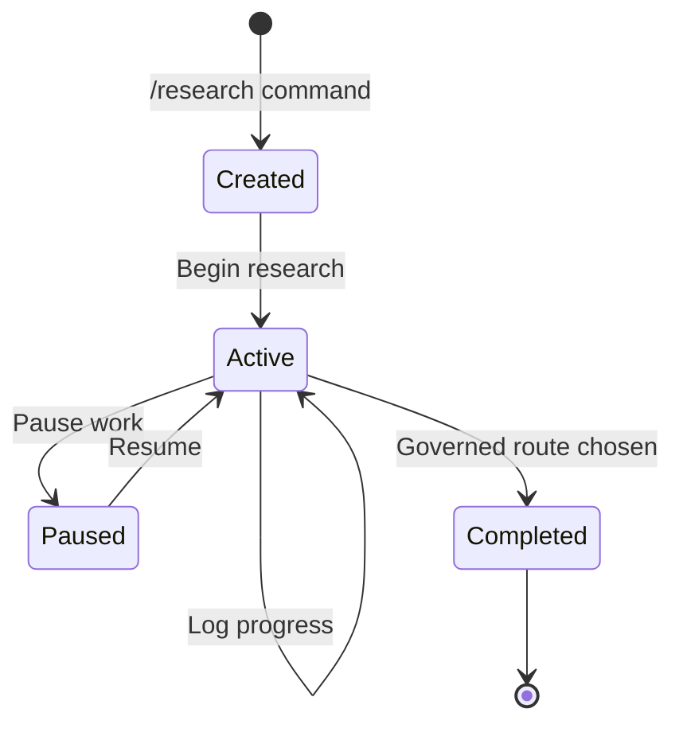
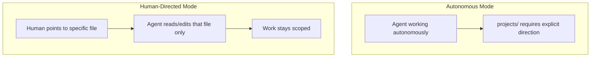

# Projects

Projects are **human-led explorations** that live in `.octon/inputs/exploratory/ideation/projects/`. They provide isolated scope, memory, and continuity for structured research spanning multiple sessions. They remain non-authoritative input until findings are routed through governed work outside `inputs/**`.

---

## What is a Project?

A project is a **structured workspace** for human-led exploration:

| Harness Component | Project Equivalent |
|---------------------|----------------------------|
| `scope.md` | `project.md` (Goal, Scope, Questions) |
| `/.octon/state/continuity/repo/log.md` | `log.md` (Session notes) |
| `/.octon/instance/cognition/decisions/` | Findings Summary in `project.md` |
| `/.octon/state/continuity/repo/tasks.json` | Key Questions in `project.md` |

Projects provide structure for investigations that:

- Span **multiple sessions** and need continuity
- Require isolated research memory separate from governed work
- May inform a governed proposal, plan, Change, retained evidence update, or
  durable authored edit outside `inputs/**`
- Benefit from **explicit goal and scope** definition

Required route: governed proposal, plan, Change, retained evidence update, or durable authored edit outside `inputs/**`.

---

## Projects vs. Missions

Projects and missions serve different purposes:

| Aspect | Project | Mission |
|--------|---------|---------|
| **Location** | `projects/` | governed execution surface |
| **Purpose** | Divergent exploration | Convergent execution |
| **Autonomy** | Human-led | Agent-accessible |
| **Output** | Insights, decisions, learnings | Completed deliverables |
| **Ownership** | Always human-driven | Agent, assistant, or human |
| **Lifecycle** | Open-ended | Time-bounded |

**Decision heuristic:**
- Need to **investigate or explore** something? → Project
- Need to **execute and deliver** something? → Mission

---

## The Funnel

Projects sit in a pipeline from raw ideas to executed work:

```
ideation/scratchpad/ideas/      Quick captures (most ephemeral)
        ↓
ideation/scratchpad/brainstorm/ Structured exploration (filter stage)
        ↓
ideation/projects/              Committed research (non-authoritative input)
        ↓
governed proposal, plan, Change, retained evidence update, or durable edit
        ↓
durable surface outside inputs/** after validation and evidence
```

Most ideas die in `ideas/`. Some graduate to `brainstorm/`. Survivors become
projects. Projects remain non-authoritative input and may inform a governed
proposal, plan, Change, retained evidence update, or durable authored edit
outside `inputs/**`.

---

## Project Lifecycle



| Status | Description |
|--------|-------------|
| **Active** | Research in progress |
| **Paused** | Temporarily on hold (document reason) |
| **Completed** | Governed route chosen and outcome recorded |

---

## Directory Structure

```text
.octon/inputs/exploratory/ideation/projects/
├── README.md              # Purpose and rules
├── registry.md            # Index of all projects by status
├── _scaffold/template/             # Template for new projects
│   ├── project.md
│   ├── log.md
│   └── resources.md
└── <project-slug>/        # Active project
    ├── project.md         # Goal, scope, questions, findings
    ├── log.md             # Session progress notes
    ├── resources.md       # Links to useful harness resources
    └── [additional files as needed]
```

---

## Registry Format

The `registry.md` tracks all projects in three tables:

```markdown
## Active

| Project | Goal | Started | Last Activity |
|---------|------|---------|---------------|
| auth-patterns | Evaluate auth library options | 2025-01-10 | 2025-01-12 |

## Paused

| Project | Goal | Paused Reason |
|---------|------|---------------|
| perf-audit | Profile app performance | Waiting on staging env |

## Completed

| Project | Goal | Completed | Outcomes |
|---------|------|-----------|----------|
| api-design | Design v2 API structure | 2025-01-05 | Governed proposal accepted; durable decision update landed outside inputs/** |
```

---

## Project Specification Format

Each `project.md` follows this structure:

```markdown
---
title: "Project: [topic]"
status: active
started: YYYY-MM-DD
last_activity: YYYY-MM-DD
---

# Project: [topic]

## Goal
[What question are we trying to answer? What are we exploring?]

## Scope

**In scope:**
- [What's included]

**Out of scope:**
- [What's excluded]

## Key Questions
1. [Question 1]
2. [Question 2]
3. [Question 3]

## Constraints
- [Time, resource, or other constraints]

## Outputs

When this research matures, findings should go to:
- [ ] Governed proposal
- [ ] Advisory plan
- [ ] Change with validation and evidence
- [ ] Retained evidence update
- [ ] Durable authored edit outside `inputs/**`
- [ ] Other: [specify]

## Status
**Current:** active
**Notes:** [Any status notes]

---

## Findings Summary

*Summarize key findings here as research progresses.*

### Key Insights
1. [Insight 1]
2. [Insight 2]

### Decisions Made
- [Decision and rationale]

### Open Questions
- [Remaining questions]
```

---

## Progress Log Format

Each `log.md` captures session-by-session progress:

```markdown
# Project Log: [topic]

Progress notes for this project.

---

## [YYYY-MM-DD]

**Focus:** [What you explored this session]

**Findings:**
- [Key finding 1]
- [Key finding 2]

**Sources reviewed:**
- [Source 1]
- [Source 2]

**Questions raised:**
- [New question that emerged]

**Next:**
- [What to explore next session]
```

---

## Autonomy Rules

Projects are **human-led**. Agents assist only when explicitly directed.



| Mode | Agent Behavior |
|------|----------------|
| **Autonomous** | MUST NOT scan or autonomously access `projects/` |
| **Human-directed** | MAY access specific files when human explicitly points to them |

### Valid Collaboration

```text
Human: "Review projects/auth-research/findings.md and help organize"
Agent: [Reads specific file, assists as directed]
```

### Invalid Autonomous Action

```text
Agent: "I found relevant notes in projects/..."
→ VIOLATION: Agent scanned projects/ without human direction
```

---

## Creating a Project

### Via Command

```text
/research <slug>
```

This will:
1. Copy `_scaffold/template/` to `projects/<slug>/`
2. Initialize `project.md` with slug and start date
3. Add entry to `registry.md` under **Active**

### From Brainstorm

When a brainstorm graduates:
1. Copy `_scaffold/template/` to `projects/<slug>/`
2. Transfer context from brainstorm file
3. Add entry to `registry.md` under **Active**
4. Update brainstorm status to `graduated`

### Manually

1. Copy `_scaffold/template/` to `projects/<slug>/`
2. Fill in `project.md` with goal, scope, and key questions
3. Add entry to **Active** table in `registry.md`
4. Begin research, logging progress in `log.md`

---

## During Research

Best practices while a project is active:

| Activity | How |
|----------|-----|
| Log progress | Update `log.md` at end of each session |
| Track findings | Summarize insights in `project.md` as you go |
| Add sources | Create `sources.md` for references (optional) |
| Update registry | Keep `Last Activity` current in `registry.md` |
| Use harness resources | Leverage assistants and prompts via `resources.md` |

---

## Leveraging Harness Resources

Projects can leverage harness resources while maintaining human-led control.

### Assistants

Invoke harness assistants for focused help during research:

```text
Human: "@reviewer Check my findings in projects/auth-patterns/project.md
        for logical gaps and contradictions"
```

| Assistant | Use Case |
|-----------|----------|
| `@reviewer` | Review findings for clarity, gaps, contradictions |
| `@docs` | Help organize research notes into documentation |
| `@refactor` | Restructure project files or consolidate notes |

### Context References

Projects should consume harness context as research inputs:

| Resource | How It Helps |
|----------|--------------|
| `/.octon/instance/cognition/context/shared/glossary.md` | Understand domain terminology |
| `/.octon/generated/cognition/summaries/decisions.md` | Know existing decisions to build on |
| `/.octon/instance/cognition/context/shared/lessons.md` | Avoid known anti-patterns |
| `/.octon/instance/cognition/context/shared/constraints.md` | Respect non-negotiable boundaries |

---

## Completing Research

When findings are ready:

1. **Summarize findings** in `project.md` Findings Summary section
2. **Choose a governed route** — proposal, plan, Change, retained evidence
   update, or durable authored edit outside `inputs/**`
3. **Record validation and evidence** required by that governed route
4. **Move registry entry** from **Active** to **Completed**
5. **Note outcomes** — what route consumed the findings and where durable
   output landed

Projects remain non-authoritative input. Findings become durable only through a
separate governed proposal, plan, Change, retained evidence update, or durable
authored edit outside `inputs/**`.

---

## Pausing Research

When work needs to pause:

1. **Document reason** in `project.md` Status section
2. **Move registry entry** from **Active** to **Paused**
3. **Resume later** by moving back to **Active**

---

## Where Findings Go

| Content Type | Destination |
|--------------|-------------|
| Design decisions | governed decision update outside `inputs/**` |
| Anti-patterns discovered | governed retained evidence or durable authored update |
| New terminology | governed durable authored update |
| Actionable work identified | governed proposal, plan, or Change |
| Finalized constraints | governed durable authored update |

---

## Example: Auth Patterns Project

```text
projects/auth-patterns/
├── project.md
├── log.md
└── sources.md
```

**project.md:**
```markdown
---
title: "Project: Auth Library Evaluation"
status: active
started: 2025-01-10
last_activity: 2025-01-12
---

# Project: Auth Library Evaluation

## Goal
Evaluate authentication library options for the new user service.

## Scope

**In scope:**
- OAuth2/OIDC libraries for Node.js
- Session management approaches
- Token refresh patterns

**Out of scope:**
- Authorization (handled separately)
- Legacy system migration

## Key Questions
1. Which library has the best TypeScript support?
2. How do refresh token flows compare?
3. What are the security tradeoffs?

## Outputs
- [x] Governed proposal — Library selection
- [ ] Retained evidence update — Security pitfalls found
- [ ] Change with validation and evidence — Implementation work

## Findings Summary

### Key Insights
1. Library A has best TS support but limited OIDC
2. Library B is more mature but heavier bundle

### Decisions Made
- Selected Library A for TypeScript-first approach

### Open Questions
- How to handle token refresh in offline mode?
```

---

## See Also

- [Scratchpad](./scratchpad.md) — Ideas and brainstorm (upstream)
- [Dot-Prefixed Directories](../../../cognition/_meta/architecture/dot-files.md) — Autonomy rules
- [README.md](./README.md) — Canonical harness structure
- `.octon/inputs/exploratory/ideation/projects/README.md` — In-harness documentation
