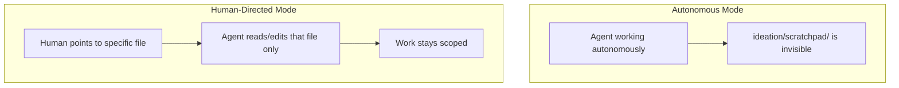
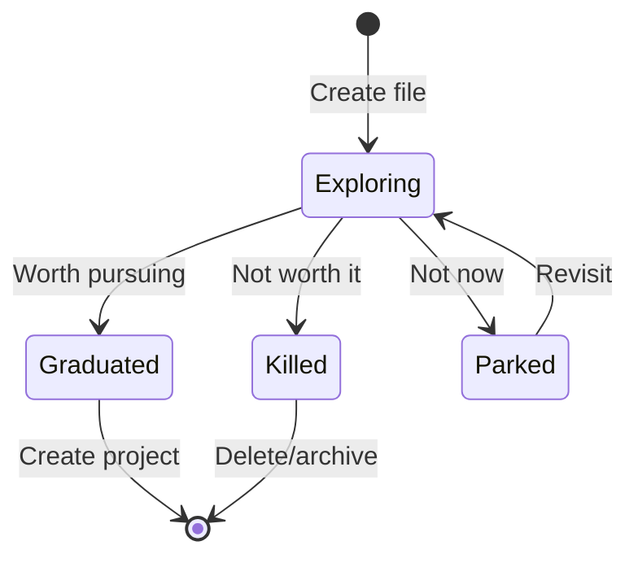
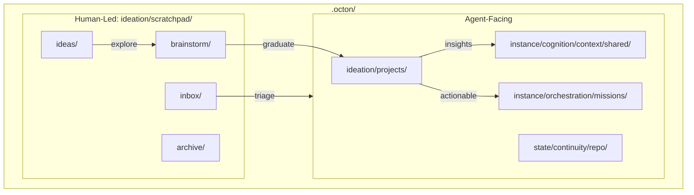

# Harness Scratchpad

The `ideation/scratchpad/` directory is a **persistent, human-led space** for thinking, exploration, and early-stage idea development. Unlike the main harness which is agent-facing, `ideation/scratchpad/` requires explicit human direction for agent collaboration.

---

## Purpose

The scratchpad serves needs that don't fit in agent-facing directories:

| Need | Solution |
|------|----------|
| Capture raw ideas | `ideas/` |
| Explore before committing | `brainstorm/` |
| Draft content not ready for agents | `drafts/` |
| Keep daily notes | `daily/` |
| Save snippets for reference | `clips/` |
| Stage external imports | `inbox/` |
| Archive deprecated content | `archive/` |

---

## The Funnel

The scratchpad is the **entry point** for a pipeline that filters ideas into committed work:

```
ideation/scratchpad/             .octon/
┌─────────────────────┐        ┌─────────────────────┐
│ ideas/              │        │ projects/           │
│ (quick captures)    │───────▶│ (committed research)│
│         ↓           │        │         ↓           │
│ brainstorm/         │────┘   │ missions/           │
│ (explore before     │        │ (committed execution)│
│  committing)        │        │         ↓           │
└─────────────────────┘        │ context/            │
                               │ (permanent knowledge)│
                               └─────────────────────┘
```

| Stage | Location | Purpose | Survival Rate |
|-------|----------|---------|---------------|
| Capture | `ideas/` | Quick notes, "what if" | ~10% graduate |
| Explore | `brainstorm/` | Validate before committing | ~30% graduate |
| Research | `projects/` | Committed exploration | Most complete |
| Execute | `missions/` | Committed execution | Ships work |

**Design principle:** Low friction capture, aggressive filtering. Most ideas should die early.

---

## Directory Structure

```text
ideation/scratchpad/
├── README.md       # Purpose and rules
├── inbox/          # Temporary staging for imports
├── archive/        # Deprecated content
├── brainstorm/     # Ideas under structured exploration
│   ├── README.md   # Template and lifecycle
│   └── <topic>.md  # Single file per brainstorm
├── ideas/          # Quick captures and possibilities
├── daily/          # Date-based notes (YYYY-MM-DD.md)
├── drafts/         # Work-in-progress documents
└── clips/          # Snippets and fragments
```

---

## Autonomy Rules

**This directory is human-led. Agents must not access it autonomously.**



| Mode | Agent Behavior |
|------|----------------|
| **Autonomous** | MUST NOT scan, read, or write to `ideation/scratchpad/**` |
| **Human-directed** | MAY access specific files when human explicitly points to them |

### Valid Collaboration

```text
Human: "Review ideation/scratchpad/brainstorm/new-feature.md and help clarify"
Agent: [Reads specific file, assists as directed]
```

### Invalid Autonomous Action

```text
Agent: "I found relevant notes in ideation/scratchpad/..."
→ VIOLATION: Agent scanned ideation/scratchpad/ without human direction
```

---

## Brainstorm

The `brainstorm/` directory is a **filter stage** between raw ideas and committed projects.

### When to Use

| Scenario | Use Brainstorm? | Alternative |
|----------|-----------------|-------------|
| Idea worth more than a note | Yes | — |
| Need to validate before committing | Yes | — |
| Quick thought, low stakes | No | Keep in `ideas/` |
| Already confident it's worth pursuing | No | Create project directly |

### Format

Each brainstorm is a **single file** (not a directory):

```markdown
---
topic: [topic name]
created: YYYY-MM-DD
status: exploring | graduated | killed | parked
---

# Brainstorm: [Topic]

## The Idea
[Core idea and trigger]

## Why It Might Matter
[Potential value]

## Exploration Notes
[Free-form notes]

## Key Questions
- [Questions to answer]

## Verdict
**Status:** [exploring | graduated | killed | parked]
**Reasoning:** [Why this verdict?]
```

### Lifecycle



### Graduating to Project

When a brainstorm graduates:

1. Create project: `projects/<slug>/`
2. Copy template files
3. Transfer relevant context
4. Update brainstorm status to `graduated`
5. Add entry to `projects/registry.md`

---

## Ideas

The `ideas/` directory is for **quick captures** — the lowest friction entry point.

- One file per topic
- Brief entries (if writing paragraphs, use `brainstorm/`)
- Most ideas die here (that's fine)

### When to Graduate

| Signal | Action |
|--------|--------|
| Worth structured exploration | → `brainstorm/` |
| Spending multiple sessions | → `brainstorm/` or `projects/` |
| Confident it's worth pursuing | → `projects/` directly |

---

## Other Subdirectories

### inbox/

Temporary staging for external imports:
- PDFs, screenshots, copied content
- Voice transcripts, rough drops
- Untriaged artifacts

**Lifecycle:** Move out when processed or delete.

### archive/

Deprecated content for reference:
- Outdated materials
- Superseded workflows
- Historical context

**Lifecycle:** Permanent. Use date prefixes: `2024-01-15-old-workflow.md`

### daily/

Date-based notes:
- Session notes
- Stream-of-consciousness
- Format: `YYYY-MM-DD.md`

### drafts/

Work-in-progress documents not ready for agent consumption.

### clips/

Snippets, quotes, code fragments for reference.

---

## Relationship to Harness



| Directory | Autonomy | Persistence |
|-----------|----------|-------------|
| `projects/` | Human-led (explicit direction) | Until completed |
| `missions/` | Agent-accessible | Until archived |
| `context/` | Agent-accessible | Permanent |
| `ideation/scratchpad/*` | Human-led only | Varies |

---

## Best Practices

### For Daily Use

- Use `daily/YYYY-MM-DD.md` for stream-of-consciousness
- Use `ideas/` for quick "what if" captures
- Use `clips/` for reference snippets

### For Exploration

- Start in `ideas/` (low commitment)
- Graduate to `brainstorm/` when worth exploring
- Graduate to `projects/` when ready to commit
- Be willing to kill ideas — that's the funnel working

### For Collaboration

- Point agents to specific files when you need help
- Keep agent work scoped to referenced files
- Don't expect agents to discover scratchpad content

---

## See Also

- [Projects](./projects.md) — Committed research (downstream from brainstorm)
- [Dot-Prefixed Directories](../../../cognition/_meta/architecture/dot-files.md) — Autonomy rules for human-led directories
- [README.md](./README.md) — Canonical harness structure
- [Missions](../../../orchestration/_meta/architecture/missions.md) — Agent-facing sub-projects
- `.octon/inputs/exploratory/ideation/scratchpad/README.md` — In-harness documentation
- `.octon/inputs/exploratory/ideation/scratchpad/brainstorm/README.md` — Brainstorm template
