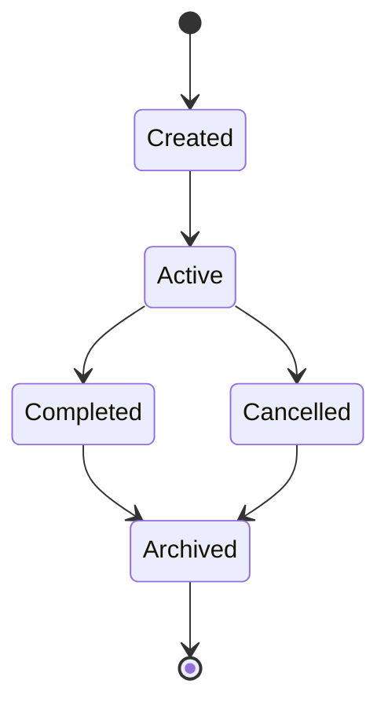

# Harness Artifact Taxonomy

This document clarifies the distinctions between harness artifact types: **commands**, **workflows**, **prompts**, and their relationship to **Cursor commands**.

---

## Quick Reference

| Type | Location | Nature | When to Use |
|------|----------|--------|-------------|
| **Harness Entry Point** | `.<harness>/commands/` | Thin wrapper | Harness-specific invocation (Cursor, Claude Code, Codex) |
| **Harness Command** | `.octon/framework/capabilities/runtime/commands/` | Deterministic procedure | Atomic, repeatable operation |
| **Harness Workflow** | `.octon/framework/orchestration/runtime/workflows/` | Multi-step procedure (source of truth) | Complex, sequential operation |
| **Harness Prompt** | `.octon/framework/scaffolding/practices/prompts/` | Task template | Context-dependent, requires judgment |
| **Harness Skill** | `.octon/framework/capabilities/runtime/skills/` | Composable capability | Defined I/O, pipelines, auditability |
| **Assistant** | `.octon/framework/execution-roles/runtime/specialists/` | Focused specialist | Scoped, delegatable tasks |
| **Mission** | `.octon/instance/orchestration/missions/` | Sub-project | Isolated, time-bounded work |

---

## The Key Distinctions

### Executable vs Template

| Category | Types | Characteristics |
|----------|-------|-----------------|
| **Executable** | Commands, Workflows | Agent follows steps exactly; deterministic output |
| **Template** | Prompts | Agent adapts to situation; output varies |

### Atomic vs Multi-Step

| Category | Types | Characteristics |
|----------|-------|-----------------|
| **Atomic** | Commands | Single action; completes in one operation |
| **Multi-Step** | Workflows | Sequential steps; may span multiple actions |

---

## Terminology

| Term | Location | Triggered By | Scope |
|------|----------|--------------|-------|
| **Harness Entry Point** | `.<harness>/commands/` | User typing `/command` in any AI harness | Repository-wide, harness-specific |
| **Harness Command** | `.octon/framework/capabilities/runtime/commands/` | Harness delegation or direct agent reference | Harness-specific, atomic |
| **Harness Workflow** | `.octon/framework/orchestration/runtime/workflows/` | Harness delegation or direct agent reference | Harness-specific, multi-step |
| **Harness Prompt** | `.octon/framework/scaffolding/practices/prompts/` | Direct agent reference | Harness-specific, template |

### Supported Harnesses

| Harness | Entry Point Location | Integration |
|---------|---------------------|-------------|
| **Cursor** | `.cursor/commands/` | Slash commands, autocomplete |
| **Claude Code** | `.claude/commands/` | Slash commands |
| **Codex** | `.codex/commands/` | Commands |
| **Future harness** | `.<harness>/commands/` | Harness-specific |

---

## Harness Entry Points

**Location:** `.<harness>/commands/*.md` (e.g., `.cursor/commands/`, `.claude/commands/`, `.codex/commands/`)

Thin wrappers that provide harness-specific invocation for harness commands or workflows. The actual implementation logic lives in `.octon/`.

### Design Principle: Universal Harness-Agnostic Pattern

```
┌─────────────────────────────────────────────────────────┐
│  Harness Entry Points (thin wrappers)                   │
├─────────────────┬─────────────────┬─────────────────────┤
│ .cursor/        │ .claude/        │ .codex/             │
│ commands/       │ commands/       │ commands/           │
│ research.md     │ research.md     │ research.md         │
└────────┬────────┴────────┬────────┴──────────┬──────────┘
         │                 │                   │
         ▼                 ▼                   ▼
┌─────────────────────────────────────────────────────────┐
│  .octon/framework/orchestration/runtime/workflows/projects/create-project.md        │
│                                                         │
│  Source of truth — same workflow for all harnesses      │
└─────────────────────────────────────────────────────────┘
```

### Characteristics

- **Thin wrappers** — Only usage syntax and pointer to implementation
- **Harness-specific integration** — Autocomplete, slash commands, etc.
- **Repository-wide scope** — Available everywhere in the repo
- **User-initiated** — Triggered by typing `/command` in chat
- **No business logic** — All logic lives in `.octon/framework/orchestration/runtime/workflows/` or `.octon/framework/capabilities/runtime/commands/`

### Entry Point Template

```markdown
# Command Name `/command-name`

Brief description.

See `.octon/framework/orchestration/runtime/workflows/<category>/<name>/00-overview.md` for full description and steps.

## Usage

\`\`\`text
/command-name <args>
\`\`\`

## Parameters

| Parameter | Required | Description |
|-----------|----------|-------------|
| `<arg>` | Yes | Description |

## Implementation

Execute the workflow in `.octon/framework/orchestration/runtime/workflows/<category>/<name>/`.

Start with `00-overview.md` and follow each step in sequence.

## References

- **Workflow:** `.octon/framework/orchestration/runtime/workflows/<category>/<name>/`
```

---

## Harness Commands

**Location:** `.octon/framework/capabilities/runtime/commands/*.md`

Harness-specific atomic operations that operate on artifacts in the harness's parent directory.

See [commands.md](../../../capabilities/_meta/architecture/commands.md) for full details and examples.

### Characteristics

- Single-action, atomic operations
- Harness-specific scope
- Can be triggered by harness entry points or directly by agents
- No harness integration (unless wrapped by a harness entry point)
- **Source of truth** for atomic operations

### Examples

- `format-for-publication.md` — Single formatting action
- `validate-frontmatter.md` — Single validation check
- `lint-conventions.md` — Single lint pass

---

## Harness Workflows

**Location:** `.octon/framework/orchestration/runtime/workflows/*.md` or `.octon/framework/orchestration/runtime/workflows/<name>/`

Multi-step procedures that operate on artifacts in the harness's parent directory. Workflows are the **source of truth** for complex operations.

See [workflows.md](../../../orchestration/_meta/architecture/workflows.md) for full details, including the Universal Harness-Agnostic Pattern.

### Characteristics

- Multi-step procedures
- Harness-specific scope
- Can be triggered by any harness entry point or referenced directly by agents
- No harness integration (unless wrapped by a harness entry point)
- **Source of truth** for multi-step operations
- **Portable** — Same workflow works across Cursor, Claude Code, Codex, etc.

### Examples

- `audit-and-refactor.md` — Multi-step audit procedure
- `publish-to-docs.md` — Multi-step publication workflow
- `create-workflow/` — Subdirectory with sequential steps

---

## Harness Prompts

**Location:** `.octon/framework/scaffolding/practices/prompts/*.md`

Task templates that guide agents through context-dependent work requiring judgment or parameterization.

See [prompts.md](../../../scaffolding/_meta/architecture/prompts.md) for full details.

### Characteristics

- Templates, not executable procedures
- Require context or parameters from user/situation
- Output varies based on judgment
- Agent adapts template to the specific case

### Examples

- `audit-content.md` — Review content (criteria vary)
- `improve-clarity.md` — Enhance readability (subjective)
- `summarize-changes.md` — Summarize work (context-dependent)

### Command vs Prompt Decision

See `.octon/instance/bootstrap/catalog.md#command-vs-prompt-decision` for the canonical decision logic.

---

## Assistants

**Location:** `.octon/framework/execution-roles/runtime/specialists/<name>/SPECIALIST.md`

Focused specialists that serve agents or humans for scoped, one-off tasks.

See [Agency](../../../agency/README.md) for canonical actor details.

### Characteristics

- Invoked via `@mention` or agent delegation
- Stateless (inherits context from caller)
- Produces structured output in defined format
- Knows when to escalate

### Assistant vs Agent

| Characteristic | Agent | Assistant |
|----------------|-------|-----------|
| Autonomy | Autonomous, long-running | Invoked for specific tasks |
| Lifecycle | Persistent across sessions | Stateless |
| Scope | Orchestrates broad work | Focused, scoped operations |
| Examples | Planner, Builder, Verifier | Reviewer, Refactor, Docs |

### When to Create an Assistant

- Repeated specialized task
- Task needs consistent output format
- Agent should be able to delegate

---

## Missions

**Location:** `.octon/instance/orchestration/missions/<slug>/`

Time-bounded sub-projects with isolated progress tracking.

See [missions.md](../../../orchestration/_meta/architecture/missions.md) for full details.

### Characteristics

- Has specific goal and success criteria
- Has an owner (agent, assistant, or human)
- Maintains isolated progress (`tasks.json`, `log.md`)
- Lifecycle: created → active → completed → archived

### Mission Lifecycle



### When to Create a Mission

| Scenario | Use Mission? |
|----------|--------------|
| Parallel workstreams | Yes |
| Time-bounded initiative | Yes |
| Delegatable unit of work | Yes |
| Single task, one session | No |
| Different codebase area | No (use repo-root missions or domain-specific root-harness context) |

---

## Skills

**Location:** `.octon/framework/capabilities/runtime/skills/<id>/skill.md`

Composable capability units with defined inputs, outputs, and behavior.

See [skills.md](../../../capabilities/runtime/skills/README.md) for full details.

### Characteristics

- Invoked via `/command` or `use skill: <id>`
- Has defined inputs and outputs (enables composition)
- Writes outputs only to designated paths
- Logs execution for auditability (run logs)
- Progressive disclosure via registry

### Skills vs Other Artifacts

| Characteristic | Skill | Assistant | Workflow | Prompt |
|----------------|-------|-----------|----------|--------|
| **I/O contract** | Yes (typed paths) | No | No | No |
| **Composable** | Yes (pipelines) | No | Loosely | No |
| **Logging** | Required (run logs) | No | No | No |
| **Invocation** | `/command` or explicit | `@mention` | Reference | Reference |
| **Scope** | Composable capability | Focused specialist | Procedure | Template |

### When to Create a Skill

| Scenario | Use Skill? |
|----------|------------|
| Repeated capability with defined I/O | Yes |
| Need to chain operations (pipelines) | Yes |
| Require auditability (run logs) | Yes |
| One-off task requiring judgment | No (use Prompt) |
| Focused specialist role | No (use Assistant) |
| Complex multi-step procedure | No (use Workflow) |

---

## Decision Guidance

All decision flowcharts and tables are maintained in `.octon/instance/bootstrap/catalog.md#decision-guidance` as the single source of truth. This includes:

- **Artifact Type Decision** — When to create Cursor commands, harness commands, workflows, or prompts
- **Command vs Prompt Decision** — Distinguishing deterministic operations from templates
- **Harness Modification Decision** — Choosing between create, update, migrate, and evaluate

See `.octon/instance/bootstrap/catalog.md` for complete decision flowcharts and examples.

---

## File Locations Summary

| Type | Location | Scope | Harness Integration |
|------|----------|-------|---------------------|
| Harness Entry Points | `.<harness>/commands/*.md` | Repository-wide | Yes (harness-specific) |
| Harness Commands | `.octon/framework/capabilities/runtime/commands/*.md` | This harness only | No (unless wrapped) |
| Harness Workflows | `.octon/framework/orchestration/runtime/workflows/*.md` | This harness only | No (unless wrapped) |
| Prompts | `.octon/framework/scaffolding/practices/prompts/*.md` | Task templates | No |
| Assistants | `.octon/framework/execution-roles/runtime/specialists/<name>/` | Focused specialists | Via @mention |
| Missions | `.octon/instance/orchestration/missions/<slug>/` | Sub-projects | No |
| Checklists | `.octon/framework/assurance/*.md` | Quality gates | No |

### Harness Entry Point Directories

| Harness | Directory |
|---------|-----------|
| Cursor | `.cursor/commands/` |
| Claude Code | `.claude/commands/` |
| Codex | `.codex/commands/` |
| Future harness | `.<harness>/commands/` |

---

## See Also

- [Harness Commands](../../../capabilities/runtime/commands/manifest.yml) — Deterministic atomic operations
- [Harness Workflows](../../../orchestration/runtime/workflows/README.md) — Multi-step procedures
- [Harness Prompts](../../../scaffolding/practices/prompts/README.md) — Context-dependent task templates
- [Agency](../../../agency/README.md) — Canonical actor taxonomy and routing model
- [Missions](../../../instance/orchestration/missions/README.md) — Time-bounded sub-projects
- [Checklists](../../../assurance/_meta/architecture/checklists.md) — Quality gates
- [README.md](./README.md) — Canonical harness structure reference
