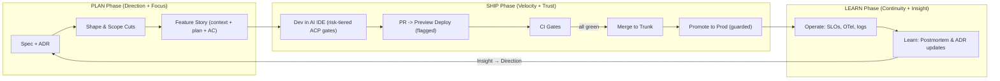

# Octon Methodology

Octon is an agent-first, system-governed development methodology for cross-project execution with practical solo-builder ergonomics.

## Machine Discovery

- `index.yml` - canonical methodology discovery index.
- `README.index.yml` - sidecar section index for methodology overview headings.
- `implementation-guide.index.yml` - sidecar section index for implementation guide headings.
- `migrations/index.yml` - machine-readable migration governance doctrine index.
- `audits/index.yml` - machine-readable bounded audit governance doctrine index.
- `templates/index.yml` - machine-readable risk-tiered spec template index.

Octon empowers solo developers across experience levels to ship high-quality software with speed, safety, and confidence. It combines spec-led intent capture, context-efficient planning, autonomous AI execution loops, and risk-tiered ACP governance within a principled, progressively adoptable framework.

Octon is lean in ceremony and rich in capability: context-efficient artifacts, progressive disclosure, and fast feedback loops — without imposing vendor lock-in or stack prescription.

Octon is stack-, host-, and environment-agnostic, adapting to your chosen IDE, terminal, harness, repository structure, and deployment platform. Start with the defaults; deepen as your project demands.

Work is organized as a closed loop across **PLAN** (Direction, Focus), **SHIP** (Velocity, Trust), and **LEARN** (Continuity, Insight). Defaults are principled and guardrails are opinionated: contract-first design, small-batch trunk flow, reversible delivery, observability, and secure-by-default controls informed by established standards.

---

> Terminology: Slices vs Layers — see `.octon/framework/cognition/_meta/architecture/slices-vs-layers.md`.

## Octon’s Unifying Objective

Octon unifies speed, safety, and minimal sufficient complexity so a solo builder can ship high-quality software quickly, safely, and predictably. AI agents drive planning, implementation, and verification autonomously within principled bounds, while humans own policy authorship, exception handling, and escalation authority. Every principle, guardrail, and artifact reinforces one or more of Octon's six pillars and closes the loop from validated intent -> focused implementation -> fast shipping -> safe delivery -> preserved knowledge -> structured learning.

### The Six Pillars

Octon's pillars are organized in three phases forming a complete feedback loop. For the complete pillar specifications, see [`../../governance/pillars/README.md`](../../governance/pillars/README.md).

**PLAN Phase:**
1. **[Direction through Validated Discovery](../../governance/pillars/direction.md)** — Build the right thing because every feature is validated before investment.
2. **[Focus through Absorbed Complexity](../../governance/pillars/focus.md)** — Build features, not infrastructure — Octon handles the rest.

**SHIP Phase:**
3. **[Velocity through Agentic Automation](../../governance/pillars/velocity.md)** — Ship fast because AI automation removes bottlenecks and multiplies output.
4. **[Trust through Governed Determinism](../../governance/pillars/trust.md)** — Ship confidently because behavior is predictable, agents are bounded, security is enforced, and mistakes are reversible.

**LEARN Phase:**
5. **[Continuity through Institutional Memory](../../governance/pillars/continuity.md)** — Knowledge persists because decisions, traces, and context are captured durably.
6. **[Insight through Structured Learning](../../governance/pillars/insight.md)** — Improve continuously because every outcome teaches us something.

Together these pillars create a self‑reinforcing system: Direction ensures we build the right thing, Focus gives us bandwidth to build it, Velocity and Trust let us ship fast and safely, Continuity preserves what we learned, and Insight feeds back to Direction for the next cycle.

#### Pillar Quick Reference

| Phase | Pillar | Developer Question | Key Practice |
|-------|--------|-------------------|--------------|
| PLAN | [Direction](../../governance/pillars/direction.md) | "What are we building?" | Spec-first validation |
| PLAN | [Focus](../../governance/pillars/focus.md) | "How do we think about it?" | Kits absorb complexity |
| SHIP | [Velocity](../../governance/pillars/velocity.md) | "How do we deliver fast?" | Agentic automation |
| SHIP | [Trust](../../governance/pillars/trust.md) | "How do we deliver safely?" | Governed determinism |
| LEARN | [Continuity](../../governance/pillars/continuity.md) | "How do we remember?" | ADRs, traces, ObservaKit |
| LEARN | [Insight](../../governance/pillars/insight.md) | "How do we improve?" | Postmortems, EvalKit |

> Terminology note: “SpecKit” (`speckit`) wraps GitHub’s Spec Kit. Mentions of the upstream tool use “GitHub’s Spec Kit” explicitly. PlanKit implements its planning kernel via BMAD; this adapter is transparent to methodology consumers.

#### Pillars → Practices Map (at a glance)

| Pillar | Phase | Primary Practices/Tools | Feedback loop it reinforces |
| --- | --- | --- | --- |
| Direction | PLAN | SpecKit; PlanKit (planning kernel); Shape Up; Convivial Impact Assessment | Validated specs ensure effort is well-spent; no code without approved spec |
| Focus | PLAN | kit-base; PromptKit; Turborepo; Hexagonal adapters | Absorbed complexity frees cognitive bandwidth; build features, not infrastructure |
| Velocity | SHIP | AgentKit; FlowKit; CIKit; Trunk‑Based Development; Preview Environments | AI automation removes bottlenecks; fast, frequent delivery within validated direction |
| Trust | SHIP | PolicyKit; GuardKit; EvalKit; FlagKit; Pact; OpenAPI/JSON‑Schema | Typed contracts; bounded agents; rollback capability; fail‑closed governance |
| Continuity | LEARN | Dockit; ObservaKit; ADR templates; RunbookKit; OnboardKit | ADRs, traces, decision logs preserve context; knowledge survives time and handoffs |
| Insight | LEARN | EvalKit; DatasetKit; postmortem templates; retro practices | Postmortems, evals, retros drive continuous improvement; Insight → Direction loop |

> **Reference implementation.** Specific tools above reflect Octon's
> reference stack. Substitute your own build system and deployment platform.
> Octon's principles and gates are stack-, host-, and environment-agnostic.

---

## Kit Architecture and Stage Mapping

Octon's kit layer maps execution stages to reusable capability surfaces.
This methodology overview keeps only the operating synopsis; canonical kit
ownership and runtime behavior details live in dedicated capability docs:

- Principle-to-kit alignment:
  `.octon/framework/capabilities/runtime/services/_meta/docs/platform-overview.md#octon-alignment`
- Service responsibilities and boundaries:
  `.octon/framework/capabilities/runtime/services/execution/service-roles.md`
- Determinism/provenance expectations:
  `ci-cd-quality-gates.md`, `risk-tiers.md`, and `tooling-and-metrics.md`

At a high level: SpecKit/PlanKit shape intent, FlowKit/AgentKit execute plans
through governed runtime flows, and EvalKit/PolicyKit/GuardKit/TestKit plus
ObservaKit enforce safety, evidence, and observability at promotion time.

---

## System Guarantees (self‑reinforcing invariants)

Octon operates as a closed loop with a few non‑negotiable, compounding habits that keep solo development fast, safe, and sustainable:

- Profile-first execution: before implementation, record exactly one `change_profile`, `release_state`, and a `Profile Selection Receipt`.
- Release-maturity gate: when `release_state` is `pre-1.0`, default `change_profile` to `atomic`; use `transitional` only when hard gates require coexistence and include `transitional_exception_note` (rationale, risks, owner, decommission date).
- Autonomous-by-default execution, least-privilege authority: agents run by default inside deny-by-default capability bounds and ACP promotion gates. This is not authority-by-default, and humans are not default step-by-step runtime approvers.
- Spec‑first changes: Every material change starts with a one‑pager + ADR and micro‑STRIDE. No spec, no start.
- No silent apply: Agents produce plans/diffs/tests only. ACP receipt outcomes determine runtime promotion authority; humans retain policy authorship, exceptions, and escalation authority.
- Deterministic AI: Provider/model/version/params pinned; low variance (temperature ≤ 0.3); prompt hash recorded; golden tests guard drift.
- Observability required: Changed flows must emit OTel spans/logs; PRs link a `trace_id`. Evidence packs are assembled per PR.
- Idempotency & rollback: Mutations use idempotency keys; risky features ship behind flags; rollback is “promote prior preview”.
- Fail‑closed governance: Policy/Eval/Test gates block on missing evidence or violations; T3 changes require a Navigator pass with an explicit security checklist.
- Local‑first & privacy‑first: Secrets never leave Vault/env; PII redacted at log/write boundaries; offline telemetry buffers flush later.
- Cost & efficiency guardrails: Publish monthly AI token and infra budgets; alert on cost anomalies; freeze risky merges/promotions on sustained anomalies until budgets recover. PRs that use AI must include pinned model config and a short cost note (estimated/observed).
- Supply chain provenance: SBOMs are produced for releases and build artifacts are attested (e.g., GitHub attestations/Sigstore). Provenance notes are linked in PRs for changes that affect build/release surfaces.
- Small batches by policy: Trunk‑based, tiny PRs, explicit WIP limits, and preview smoke keep cycle time short and outcomes reversible.
- Waiver discipline: Gate waivers are exceptional and rare; Navigator approval (with a security checklist for T3) is required with an explicit scope/timebox (≤ 7 days or until merge) and a PR‑linked justification. Waivers are disallowed for secrets/PII exposure, missing observability on changed flows, missing rollback/flag, and sustained SLO burn‑rate violations. Waivers auto‑expire at merge and must include a follow‑up issue for any residual risk or work.

These guarantees align 1:1 with Octon’s kit-layer invariants (determinism, typed contracts, idempotency, observability, and fail‑closed policy), ensuring the methodology is self‑reinforcing instead of fragile.

---

## Methodology Map

Use these companion documents when you need deeper operational detail:

- `spec-first-planning.md` — Spec-first planning workflow, templates, and AI IDE integration.
- `playbooks/prompts.md` — Reusable prompt library for AI IDE and terminal execution.
- `playbooks/quick-start.md` — Day-one operational checklist and rollout safety baseline.
- `examples/oauth-billing.md` — Worked end-to-end example (spec -> implementation -> staged rollout).
- `flow-and-wip-policy.md` — Board columns, WIP limits, Definitions of Ready/Done/Safe/Small, and risk rubric.
- `ci-cd-quality-gates.md` — CI/CD pipeline, required checks, and waiver policy.
- `security-baseline.md` — OWASP ASVS/NIST SSDF alignment, STRIDE per feature, and defenses.
- `reliability-and-ops.md` — SLIs/SLOs, error budgets, incidents, and postmortems.
- `performance-and-scalability.md` — Perf budgets, caching, queues, and load testing.
- `architecture-and-repo-structure.md` — 12-Factor modulith, Hexagonal boundaries, and feature flags.
- `feature-placement-guide.md` — Surface selection matrix for deciding whether a feature belongs in core authority, executable capability, governed pack, adapter, proposal, or autonomy surfaces.
- `tooling-and-metrics.md` — provider-agnostic tooling policy and improvement metrics.
- `sandbox-flow.md` — Canonical end-to-end sandbox flow using previews, flags, CI gates, and observability before production rollout.
- `architecture-readiness/README.md` — Whole-harness and bounded-domain architecture-readiness applicability and execution model.
- `architecture-readiness/framework.md` — Architecture-readiness scoring dimensions, hard gates, and failure-mode expectations.
- `migrations/README.md` — Profile-governed migration policy, invariants, exceptions, CI gates, and legacy banlist governance.
- `audits/README.md` — Bounded audit policy, invariants, convergence controls, CI gates, and stable findings contract.

---

## Octon's Components

Octon's component inventory is intentionally summarized in this hub.
Canonical operational details live in dedicated methodology surfaces:

| Component Surface | Canonical Reference |
| --- | --- |
| Risk tiers and governance depth | [risk-tiers.md](./risk-tiers.md), [auto-tier-assignment.md](./auto-tier-assignment.md) |
| CI/CD quality and stop-the-line gates | [ci-cd-quality-gates.md](./ci-cd-quality-gates.md) |
| Security controls and threat-model posture | [security-baseline.md](./security-baseline.md) |
| Reliability, SLOs, incident posture | [reliability-and-ops.md](./reliability-and-ops.md) |
| Performance/scalability budgets and practices | [performance-and-scalability.md](./performance-and-scalability.md) |
| Architecture and repo boundaries | [architecture-and-repo-structure.md](./architecture-and-repo-structure.md) |
| Tooling and metrics framework | [tooling-and-metrics.md](./tooling-and-metrics.md) |
| Spec-first process and templates | [spec-first-planning.md](./spec-first-planning.md), [templates/README.md](./templates/README.md) |

For the reference stack mapping across frameworks, standards, and tools, use
[tooling-and-metrics.md](./tooling-and-metrics.md) as the canonical deep-dive.

---

## How Octon’s Components Reinforce Each Other

Octon's standards, flow policies, and gates are intentionally composable:
spec-first direction (`spec-first-planning.md`) feeds risk-tiered governance
(`risk-tiers.md`, `auto-tier-assignment.md`), which is enforced by CI/CD gates
(`ci-cd-quality-gates.md`) and closed-loop reliability/metrics feedback
(`reliability-and-ops.md`, `tooling-and-metrics.md`). Together they preserve
fast iteration without weakening safety or reversibility.

---

## Octon in Practice

Octon in practice is a tight loop:
`spec-first-planning.md` -> `flow-and-wip-policy.md` ->
`ci-cd-quality-gates.md` -> `sandbox-flow.md` -> `reliability-and-ops.md`.
Use those canonical surfaces for operating detail. This hub remains concise
orientation and cross-linking, while humans retain policy authorship,
exceptions, and escalation authority under the agency governance contracts.

---

## Method Lifecycle Overview

The lifecycle maps to Octon's three pillar phases: **PLAN → SHIP → LEARN**, forming a closed feedback loop.

**The loop closes:** Insight (what we learned) feeds back to Direction (what we build next). Postmortems reveal what we should have validated; eval results inform future spec criteria.

Note: Schedule non‑blocking tasks (e.g., notifications, cache invalidation, analytics enrichment) with `next/after` where applicable so responses are fast and side‑effects are reliable without blocking the user path.

---

## Operating Cadence (Solo + AI)

**Cycle**: 1‑week mini‑cycles.
**Roles**: switch hats per PR: **Driver (build)**, **Navigator (review)**.

- **Async daily check‑in (2 bullets)**: Yesterday outcome, Today intent (+ block).
- **Second set of eyes**: For risky changes and critical boundaries (auth, billing, data), do a time‑separated Navigator pass and (if possible) get a quick external review.
- **Weekly retro (≤15 min)**: 3 questions: What slowed flow? What broke gates? What SLO budget burned? Adjust WIP/gates accordingly (error‑budget policy).

### Backlog Intake & Triage (lightweight)

- Keep Backlog bounded (≤ 30 active items); archive/split items stale > 30 days.
- New work must meet DoR essentials before moving to Ready; otherwise keep as “Idea/Draft”.
- Prioritize by appetite, SLO/risk, and value; stamp initial risk class and note flag/rollback approach.

### Sustainable Pace Policy

- Focus hours: two 2‑hour deep‑work blocks per day; async by default outside those blocks.
- No after‑hours work except incidents; incidents follow rollback‑first policy and postmortem within 48h.
- Daily Kaizen: 10 minutes to remove one friction (tooling, doc, test); track as a tiny PR and label `kaizen` for easy weekly review.
- If WIP limits are exceeded for >24h, pause new work, restore flow, then resume.
- No mid‑cycle scope increases; new asks go to Backlog/Ready. Descoping is allowed to protect the appetite.
- Reserve 10% weekly capacity for maintenance (deps, tests, docs) to prevent debt accumulation.
- WIP aging triggers: any card >2 days in **In‑Dev** or >3 days end‑to‑end cycle time triggers a stop-and-unblock; >3 days in **In‑Dev** escalates to a scope cut or split. Track WIP age and cycle time in board insights.

### Sustainability & Burnout Guardrails

- Meeting budget: ≤4 hours/week total synchronous meetings; default to async. Require an agenda and desired outcomes; auto‑cancel if missing. Keep at least one no‑meeting day/week for deep work.
- Focus protection: During focus blocks, notifications are silenced; only on‑call incidents may interrupt. Use the board to signal availability.
- Review SLA: PRs in **In‑Review** complete the Navigator pass within 4 working hours. If blocked >4 hours, cut scope or pause new work to maintain flow.
- Timeboxing & scope: If a task is estimated to exceed 1 day, split or descoped before starting. If **In‑Dev** reaches 1 day without reviewable output, initiate a scope cut.
- Communication hygiene: Prefer issues/PRs over DMs for decisions; summarize decisions in the PR/issue thread to preserve history.
- Recovery policy: No heroics. After incidents, preserve the 48h blameless postmortem and protect the following day’s focus blocks to recover.

---

## Flow & WIP Policy (Kanban for solo)

Octon uses a lightweight Kanban flow with strict WIP limits and explicit Definitions of Ready/Done/Safe/Small to keep cycle times low and changes reversible. The default board is *Backlog → Ready → In‑Dev → In‑Review → Preview → Release → Done → Blocked*, with tight limits and a simple risk rubric.

See `flow-and-wip-policy.md` for the full board policy, WIP limits, definitions, debt/risk classifiers, and change-type gates.

## Spec-First Planning (step-by-step)

Octon is explicitly spec-first: every meaningful change starts with a spec one-pager and feature story (structured context + agent plan + acceptance criteria), then runs through an AI-assisted loop of Plan → Diff → Explain → Test with risk-tiered ACP gates.

See `spec-first-planning.md` for the full spec one-pager template, feature story pattern, and AI IDE integration guide.

---

> **Reference implementation.** The branching and release details below use a
> generic preview-and-promotion deployment model. Adapt naming and commands to
> your platform. The principles (preview-per-PR, guarded promotion, instant
> rollback, server-evaluated feature flags) remain platform-agnostic.

## Branching & Release Model

- **Trunk‑Based**: short‑lived branches (≤1 day). One small change per PR. Use **feature flags** for any risky behavior.
- **Preview environments**: every PR should expose a preview URL for acceptance and smoke tests. Promote only from known-good staged artifacts.
- **Environment naming & Production policy**: Use **PR Preview**, **Trunk Preview**, and **Production**. Production updates should be manual promote only.
- **Feature flags**: use a provider-agnostic, server-evaluated flag contract. Keep default-off behavior for new features, use explicit rollout cohorts, and remove stale flags within 2 cycles.
- **Environments & secrets**: use your platform secret manager and CI secret scanning. Never commit secrets.
- **Preview smoke (fast path)**: run smoke checks against preview URLs for core routes and link evidence in PR artifacts.
- **Flags hygiene automation**: run a weekly stale-flag report in CI and remove or consolidate stale flags; each flag must have an owner and explicit expiry.
- **Next.js 15+/16 and React 19 note**: Defaults for `fetch`/GET handlers are `no-store`; opt into caching explicitly when stable and record cache keys. Prefer Server Actions for mutations and `next/after` for non‑blocking tasks; heed hydration mismatch warnings before enabling caching.
- **Small change policy**: PRs should satisfy **DoSm** by default. If not feasible, split scope or include a brief “size‑override” justification and obtain Navigator approval before merge.
- **Review cadence**: Aim to complete the Navigator review pass within 4 working hours of opening a PR to prevent idle WIP.

### Release Freeze Procedure (error‑budget policy)

Triggered when multi‑window burn‑rate alerts sustain > 30 minutes or SLOs are at risk:

1. Freeze risky merges and promotions (T2/T3 risk) until budgets recover.
2. Keep features behind flags; reduce or disable canary cohorts; validate rollback by promoting a known‑good preview.
3. Prioritize reliability fixes: incident triage, perf regressions, error spikes, and missing observability on changed flows.
4. Exit criteria: error‑budget burn returns to healthy thresholds for two consecutive alert windows (or 24h) and preview smoke is green.
5. Communicate status in the current PR(s) and retro; link ObservaKit trace IDs and postmortem follow‑ups.

---

## CI/CD Quality Gates

Octon’s CI/CD pipeline enforces linting, tests, type checking, contracts, security scans, SBOM, and provenance before merges. Gates are tuned for TypeScript and Python, with optional extras you can adopt over time.

See `ci-cd-quality-gates.md` for the full gate diagram, checklist, and waiver policy.

---

## Test Strategy (pyramid + contracts)

- **Unit** close to logic (pure TS/Python).
- **Contract tests** at **ports** (API/UI) to freeze **Hexagonal** boundaries: Pact for consumer/provider; validate OpenAPI with Schemathesis; Prism mocks for dev.
- **AI “golden” tests**: snapshot expected model outputs for critical prompts and guard with **JSON‑Schema**.
- **Golden test stability**: prefer deterministic fixtures and schema-based assertions; allow bounded tolerances for token variance. Fail on schema or material output drift, not minor wording differences.
- **E2E smoke** on Preview (Playwright) for core flows (login, pay, CRUD) — recommended.
- **Canary/flag validation checklist** before enabling flags for a % of users.
  - Start with a small, internal or low‑risk cohort (≤ 5% traffic) and default OFF.
  - Kill‑switch documented and verified; rollout plan and owner recorded.
  - Success criteria defined up‑front: p95 latency within budget, 5xx ≤ 0.5%, no SLO burn‑rate breach.
  - Observability in place: representative `trace_id` linked in PR; dashboard links attached.
  - Rollback rehearsal completed using a deterministic platform rollback/promotion command.
  - Idempotency validated on toggles; no client‑cached secrets or state drift.
  - Minimum canary window: ≥ 60 minutes of normal traffic before widening.

---

## Security Baseline (mapped to frameworks)

Octon’s security baseline bakes OWASP ASVS and NIST SSDF into specs, CI, and operations, with STRIDE per feature and clear guidance for secrets, headers, and privacy.

See `security-baseline.md` for full control mappings, STRIDE guidance, header/secret policies, and accessibility/privacy notes.

---

## Reliability & Ops (Google SRE)

Octon borrows heavily from Google SRE: SLIs/SLOs, error budgets, and blameless postmortems drive how we respond to incidents and tune guardrails over time.

**Insight → Direction:** Postmortems are where the [LEARN phase](../../governance/pillars/insight.md) feeds back to [PLAN](../../governance/pillars/direction.md). Each postmortem should answer: *"What should we have validated in the spec that we didn't?"* Action items flow into future spec criteria, closing the feedback loop.

See `reliability-and-ops.md` for detailed SLI/SLO guidance, error budget policy, on-call expectations, and the full postmortem template and severity table.

---

## Performance & Scalability

Octon defines explicit performance budgets and leans on caching, queues, and load testing to keep latency and error rates within SLOs as usage grows.

See `performance-and-scalability.md` for perf budget guidance, caching/queue recommendations, and load-test practices.

---

## Architecture & Repository Structure

Octon uses a 12-Factor, monolith-first modular monolith with Hexagonal boundaries and feature flags as a first-class concern.

See `architecture-and-repo-structure.md` for the detailed layout, feature flag implementation, and scaling policy from solo → 2 developers.

---

## AI IDE Prompt Library

The operational prompt catalog is maintained in
[playbooks/prompts.md](./playbooks/prompts.md). Use that playbook as the
canonical source for reusable AI IDE/terminal prompts and snippet filenames.

---

## Tooling Map

See `tooling-and-metrics.md` for a dedicated deep-dive into tooling and metrics.

> **Reference implementation.** The tooling below reflects Octon's reference stack. Substitute your own equivalents as needed.

- **Work tracking**: use your issue/board system with explicit Ready/In-Dev/In-Review/Preview states and cycle-time reporting.
- **Actions matrix per package**: `turbo run lint test build --filter=...` using remote cache.
- **Required checks**: the gates configured in repository workflow surfaces (for example `.github/workflows/pr-quality.yml` and `.github/workflows/smoke.yml`), plus any additional policy gates.
- **Deployment surface**: preview/staging per PR, guarded manual promotion, rollback to previous known-good deployment, managed environment and secret controls.
- **Flag hygiene**: run a scheduled stale-flag job (for example `.github/workflows/flags-stale-report.yml`) and remove stale flags within two cycles.

---

## Metrics & Improvement

- **Minimal DORA**: lead time (PR open→merge), deployment frequency, change‑fail %, MTTR. Track automatically via PR & Actions timestamps; correlate with SLO burn.
- **SRE targets**: publish current SLOs, weekly error‑budget report; adjust gates when burn is high (e.g., freeze features, raise test thresholds).
- **Kaizen log**: surface daily `kaizen` PRs in the weekly retro; aim for ≥5 small improvements/week. Celebrate and keep the habit compounding.
- **WIP/cycle analytics**: monitor WIP aging, 50th/90th percentile cycle time, and blocked WIP. Tighten WIP or cut scope if trends degrade for 2 consecutive weeks.
- **Cost dashboard**: review monthly AI token and infra cost trends; investigate anomalies; record decisions in the weekly retro and PR notes.
- **Weekly retro prompts**:

  - *What blocked flow?*
  - *What broke gates?*
  - *Which SLI/SLO regressed?*
  - *What 1 guardrail to tighten/loosen?*

---

## Operational Defaults

Octon's canonical operating defaults are captured directly in the core methodology artifacts:

- Spec-to-PR fast path: `spec-first-planning.md`
- Baseline CI gates and CI health targets: `ci-cd-quality-gates.md`
- Starter SLOs, rollback defaults, and incident posture: `reliability-and-ops.md`
- Tooling execution and metrics targets: `tooling-and-metrics.md`
- Sandbox rollout and rollback behavior: `sandbox-flow.md`

---

## Worked Example — “OAuth login + org billing” (sketch)

This example has been moved to
[examples/oauth-billing.md](./examples/oauth-billing.md) to keep this hub
compact while preserving end-to-end worked guidance.

---

## Prompt Snippets Library

Prompt snippet filenames and reusable prompt text are consolidated in
[playbooks/prompts.md](./playbooks/prompts.md).

---

## Quick‑Start Page (tomorrow morning)

The detailed day-one checklist has moved to
[playbooks/quick-start.md](./playbooks/quick-start.md).
Use this hub for orientation and the playbook for operational execution steps.

---

## Authoritative References

- **Standards**: OWASP ASVS v5 (canonical); NIST SSDF SP 800‑218 (v1.1)
- **Practices**: Google SRE (SLIs/SLOs, error budgets, postmortems); DORA metrics; Trunk‑Based Development; 12‑Factor App; Hexagonal architecture; Kanban/WIP (Little’s Law); Shape Up
- **Tooling & governance**: GitHub (branch protection, CODEOWNERS, secret scanning)
- **Static analysis & SCA**: CodeQL; Semgrep; Dependabot; OWASP Dependency‑Check; SBOM: Syft; Secret scanning: GitHub, TruffleHog
- **Testing & contract**: Playwright; Pact; Schemathesis
- **Observability**: OpenTelemetry (Next.js/Astro SSR + Node); pino
- **Delivery platform (reference implementation)**: Turborepo (caching/monorepo) plus a deployment platform that supports previews, promote/rollback, feature flags, and scheduled jobs
- **OWASP cheat sheets**: CSP, CSRF, SSRF

---

### Final notes

- This method intentionally **minimizes ceremony and maximizes capability**: few meetings, tiny PRs, clear gates, strong **spec-led intent capture** with **agent-first execution loops** and **risk-tiered system governance**.
- It **scales with your risk**: tighten gates when error budget burns, loosen when healthy.
- It is **stack-, host-, and environment-agnostic**, adapting to your project's needs while providing **enterprise‑grade** security and reliability from day one.
