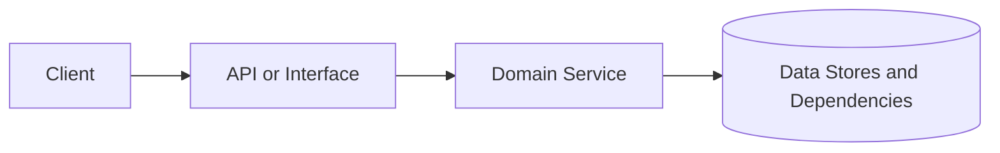

# {{feature-name}} - Specification One-Pager

## Problem and Intended Outcome

<One paragraph: who is affected, why now, and measurable success criteria.>

## Scope

- **Must**: <concrete outcomes>
- **Defer**: <explicit out-of-scope items>

## Interfaces and Contracts

- API contract: `packages/contracts/openapi.yaml`
- Payload schemas: `packages/contracts/schemas/feature-name.schema.json`
- UI contract (if applicable): <link to state/interaction contract>

## I/O and Artifacts (If Applicable)

- Inputs: <records, events, payloads>
- Outputs: <responses, events, files>
- Artifacts: <files with schema_version, manifests, snapshots>

## Non-Functional Targets

- Performance: <latency/throughput budgets>
- Reliability: <availability/error-rate targets>
- Security and privacy: <data classification, redaction, access controls>

## Security and Compliance Mapping

- Threat model baseline (for example, STRIDE categories)
- Applicable control frameworks (for example, ASVS, SSDF, SOC 2, ISO 27001)
- Evidence required in CI (contract diff, tests, dependency scan, secret scan)

## Architecture Sketch

## Key Design Choices

- Summarize major decisions and trade-offs.
- Link ADR: [ADR-0001](./adr-0001.md)

## Octon Alignment

- Spec-first and contract-driven
- Auditability via versioned docs and traceable decisions
- Risk-aware rollout and explicit rollback path

## Risks and Mitigations

- Spoofing: <mitigation + test>
- Tampering: <mitigation + test>
- Repudiation: <mitigation + test>
- Information disclosure: <mitigation + test>
- Denial of service: <mitigation + test>
- Elevation of privilege: <mitigation + test>

## Rollout Plan

- Feature flag: `flag.{{feature-name}}` (if applicable)
- Initial audience: <internal/canary/limited>
- Expansion criteria and rollback trigger

## Preview or Staging Acceptance

- <behavior 1>
- <behavior 2>

## Decision and ADR Link

- Decision summary -> [ADR-0001: Initial approach](./adr-0001.md)
- Consequences and follow-up actions
