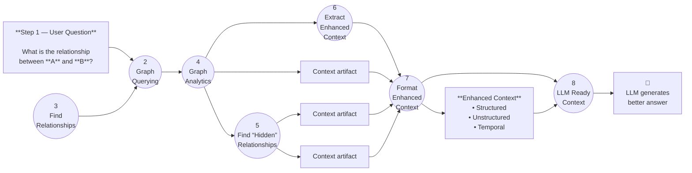
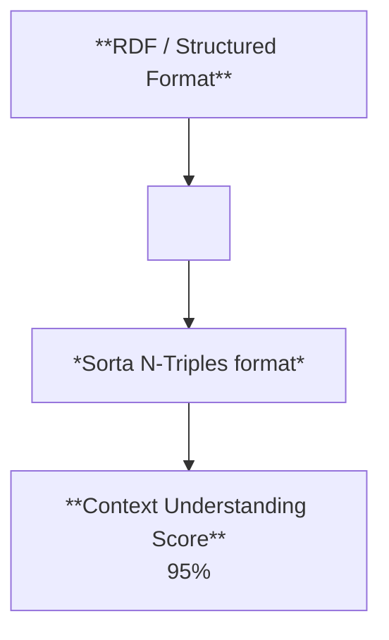

# Todo list

## 1) Foundations (repo, docs, stack)

- [ ] Finalize initial repo apps, packages, config, etc.
- [ ] Implement full tech stack spec
- [ ] Implement design-system distribution model
- [ ] How do we implement using both Python and Typescript?
- [ ] Is it fine that we have the docs/ app rather than keeping all the docs in the root?
- [ ] Rename docs/handbook to docs/octon and refer to octon as a framework/paradigm that is made up of the methodology, architecture, and toolkit.

## 2) Architecture (modularity, future-proofing, contracts)

- [ ] Make sure the tech (especially for AI related) is easily swapable, modular, and extendable since the landscape is constantly evolving. For instance, RAG currently solves the problem of getting the right data to the right place at the right time, but it is not the only solution, and other solutions may emerge in the future. We should be able to easily swap out the RAG solution with a different one if needed. This should be done in a way that is not too invasive to the existing codebase. This should be implemented for any technologies in the stack that are rapidly evolving.
- [ ] Determine wether the framework is setup to be future proof and scalable to accommodate future technologies and patterns.
- [ ] Standardize parts of the Octon architecture into an explicit contracts using the `standardizing-convention-into-explicit-contract.md` prompt.
- [ ] Review the sandbox-flow.md, containerization-profile.md, and self-contained-repos.md files. Determine whether any adjustments could/should be made to the methodology and architecture to ensure even better implementation of self-contained, forkable, and modular pieces of the framework. Does contracts placement need to be adjusted in any way to ensure that the framework is more modular, future proof, and scalable? Should critically review the architecture and methodology to ensure that the framework is as modular, future proof, and scalable as possible.

## 3) Methodology & continuous improvement (prompts, workflows, ARE)

- [ ] Update prompt files for the lean doc ops pipeline.
- [ ] Create prompt to uncover gas in architecture, methodology, and toolkit.
- [ ] Create/layout prompt workflows for one-off prompts and multi-step prompts.
- [ ] How do I run a prompt continuously, to iteratively improve the files it's improving, until it can no longer improve the files?
- [ ] Implement self-improvement layer in the project.
- [ ] Implement the iterative assessement process.
- [ ] Complete the ARE Loop documentation and implementation.
- [ ] Run the ARE Loop on the methodology and architecture documentation to ensure it is working as expected.
- [ ] Look at moving from Agile in the methodology to something better suited for a AI-assisted solo developer.
- [ ] Update methodology with agile replacement before building out the AI-native workflow.
- [ ] Build out the AI-native workflow based on ranked articles and videos (use ChatGPT chat: <https://chatgpt.com/c/6949fc01-e9c4-8326-b177-d45220f0f2a0>) and the prompt @build-ai-native-workflow.prompt.md
- [-] Evaluation current methodology and architecture to ensure we are on the right track and covering everything.
- [-] Continue to iterate on the framework to ensure it is as modular, future proof, and scalable as possible.
- [-] Make sure we addressed all the initial evaluation suggestions.
- [-] Distill the <https://resonantcomputing.org/> doc to determine whether our methodology and architecture might benefit from anything they are doing.
- [ ] Look at adding or making sure that progressive disclosure is implemented in the framework pillars and methodology.

## 4) Toolkit (kits, engines, orchestration)

- [ ] Build out kits.
- [ ] GraphKit? MemKit? A kit for processing pdfs to markdown (ConvertKit)? SemantiKic/RelateKit (finding+creating semantic relationships)
- [ ] How do I get the kits to communicate with each other? What protocol do I use?
- [ ] Setup so we can control/activate these kits via natural language? Add a routerKit for routing to kits.
- [ ] Do we need a flowKit for creating and running workflows?
- [ ] Sould I add a CommandKit (create Cursor commands) and/or a SkillKit (create Claude-like skills) to the toolkit?
- [ ] Look into implementing this Code Execution with MCP in the project: <https://www.anthropic.com/engineering/code-execution-with-mcp>
- [ ] Integrate the Engines documentation into the framework. `.archive/architecture-engines-update`. Maybe engines should be thought of the Kit workflows (the moving parts).
- [-] Update the kit documentation to align with the new structure.
- [-] Continue kit alignment work with octon methodology and architecture.

## 5) Agents & harnesses (skills, workspaces, continuity)

- [ ] Should Kaizen and cross-system agents live in the same place?
- [ ] Run the agent setup, agent documentation.
- [ ] Research and update agent implementation according to the latest research and best practices. Look into using Pydantic AI for building individual agents that can be used in the framework. Agent work is being done in `.archive/architecture-agents`.
- [ ] Document universal skills and how they can be used in the framework.
- [ ] Document how skills and agent harnesses work together and can be used to create a self-improving framework.
- [ ] Build out the universal workflows. (in progress)
- [ ] Look at implementing new universal localized agent harness workspace patterns and concepts (agents, teams, tools, skills, etc.). This harness expands on the agent harnesses provided by coding agents like Cursor, Claude, etc.
  - [ ] Create guidance for being agent harness agnostic so that the framework can be used with any agent harness (Cursor, Claude, etc.). Explore creating skills, commands, and other agent harness agnostic artifacts. Run these prompts: @universal-localized-agent-harness-implementation-plan.md + @universal-localized-agent-harness.md and @universal-agent-md-implementation-plan.md
- [ ] Update the universal agent continuity framework to gain additional insights into how to implement the framework from the video: <https://youtu.be/xNcEgqzlPqs?si=beKcmVL1OqbljE6G>. Look for other related videos and resources to gain additional insights. The prompt to update: @universal-agent-continuity-framework.md
- [ ] Create a prompt to update the universal agent continuity framework to gain additional insights into how to implement the framework from the video: <https://youtu.be/xNcEgqzlPqs?si=beKcmVL1OqbljE6G>. Look for other related videos and resources to gain additional insights. The prompt to update: @universal-agent-continuity-framework.md
- [ ] Create a workspaceKit for creating and managing workspaces.
- [ ] Look at adding a decisions directory into the workspace for managing decision traces. Reference: <https://foundationcapital.com/context-graphs-ais-trillion-dollar-opportunity/>, <https://cloudedjudgement.substack.com/p/clouded-judgement-121225-long-live>,
- [ ] Implemented a scratchpad within the main workspace harness. Ensure that it is implemented into the other local workspace harnesses.
- [ ] Implement workspace harnesses where we are not replicating artifacts across the framework (i.e. local workspaces that are in child directories of the the repository). An inheritance pattern should be used to ensure that the workspace harnesses are consistent, up to date, and avoid drift or duplication.
- [ ] Implement a universal agent + assistant standard in the framework (.octon/ideation/scratchpad/archive/universal-agent-assistant-standard-draft.md). This standard should be used to define the agents and assistants in the framework.

## 6) Knowledge (RAG, graphs, context/memory)

- [ ] Implement RAG (flat-file, vectorless, graph and agentic rag, multi-query + query expansion, context aware  chunking and late chuncking, hierarchical chunking, self-refective,etc.)
- [ ] Look at integrating graphs across the framework. Architect a flat-file knowledge graph for the framework to connect files and directories together. Reference: <https://chatgpt.com/share/e/695290bb-e2c4-8012-a0cc-05dc257a4ccb>
- [ ] Do some research on flat-file workflow architectures and patterns.
- [ ] Create a prompt for pulling implementable architectural patterns from context graph and memory graph research. What concepts could be applied to the framework? Look into decision traces. Look into types of context and types of memory.
- [ ] Researching into continuity should include looking into the concept of context and memory as they relate to the framework. Context and memory engineering should be considered as part of the framework. Context and memory should be localized to the workspace harnesses. Explore how we might bestconnect context and memory from one workspace to another workspace.
- [ ] Look into Resource Description Framework, Property Graphs, Knowledge Graphs, and other graph-based architectures and patterns. (<https://www.youtube.com/watch?v=gZjlt5WcWB4>)
- [ ] Look into <https://github.com/FlatbreadLabs/flatbread>
- [ ] Explore implementing a context exploration/discovery/walker agent and a context collection agent that walks through knowledge and context graphs and collects connectted context to provide to other agents. Explore how we navigate graphs to gather and engineer context to provide to other agents.
- [ ] How does subjective and obejective truth play into observations?
- [ ] How do we track context vs memory vs knowledge vs observations vs decisions vs handoffs vs progress vs backlogs vs rationale vs etc.?
- [ ] How do we implement graph algorithms (clustering, density, outliers, community detection, etc.) within a flat file graph architecture?
- [ ] Explore flat-file graph architecture patterns and how they can be applied to the framework. Look into sqlite and json graph architectures and patterns.
- [ ] Explore ontologies: Research what ontologies are, the role they play in structuring knowledge and context (e.g., semantic web, domain-specific standards), and how Octon should handle them. Investigate using existing, industry-standard ontologies versus creating custom ones, as well as strategies for ingesting, mapping, and applying ontologies within the Octon framework to support knowledge interoperability and context graph retrieval.

Charts from: <https://www.youtube.com/watch?v=gZjlt5WcWB4>

## 6) Skills

- [ ] Ensure that skills employ deterministic and predictable execution patterns and behavior.
- [ ] Ensure we are properly applying progressive disclosure within the skills system.
- [ ] Actually implement the hierarchical workspace model, scope authority, and workspace resolution algorithm that was doucmented in @docs/architecture/workspaces/skills/architecture.md
- [x] Update the synthesize-research skill to align with our latest documentation and best practices (e.g. naming conventions: synthesize-research, etc.).
- [ ] Create evaluate-skill (check for alignment and create an alignment plan) and update-skill (implement the alignment plan) workflows.
- [x] Bring the refine-prompt skill into alignment with the latest documentation and best practices.
- [x] Ensure skills documentation aligns with our latest implementation and best practices. See: @migrate-refactor-workflow-to-skills.md and @workflows-vs-skills-analysis.md
- [x] Since we have implemented pattern-triggered complex files, should we roll the atomic skills into the complex skills and just introduce complexity to skills as needed? Decision: Keep the two-tier system.
- [ ] Implement the Progressive Complexity Architecture proposal (@progressive-complexity-proposal.md also in the claude code tab).
- [x] Implement capabilities.yml in the `.octon/capabilities/skills/capabilities.yml` file for fast skill capability lookup.

## Workflows

- [x] Is there a need for workflows now that we have workflow skills? What would workflows bring to the table? If we keep both, how do we adress cognitive confusion? **Decision**: No, we don't need workflows.
- [ ] Update the create-skill workflow to create skills that are aligned with the latest documentation and best practices.
- [ ] Migrate all workflows to skills. Deprecate the workflows primitive.
- [ ] Determine whether "workflows" should be renamed to "processes" and include Linear, Looped, and Interconnected process patterns. How do missions fit into this?
  - Linear: It handles standard "if-this-then-that" steps. A straightforward sequence of steps where each action follows the last, like reading a file or executing a simple script.
  - Looped: It manages cyclic or iterative feedback loops, allowing processes to return to previous states based on real-time data. Processes that repeat a set of actions until a condition is met, like a while loop or a data processing batch.
  - Interconnected: It coordinates cross-departmental "symphonies" where multiple separate workflows must trigger or influence each other simultaneously. Systems where different states and processes interact dynamically, often event-driven, like user interfaces or concurrent systems.

## Workspaces

- [ ] Create a workspaceKit for creating and managing workspaces.
- [ ] Determine where we implement the workspace resolution algorithm that was documented in @docs/architecture/workspaces/skills/architecture.md. In the @.octon/capabilities/skills/scripts directory?

## Principles

- [ ] Stop with diminishing returns.
- [ ] Update simplicity over complexity with mention of justified complexity.
- [ ] Build based on principles: <https://youtu.be/_gPODg6br5w?si=5fBlsJmwIzobFGgr>
- [ ] Flexible determinism + constrained flexibility:don't be so rigid, allow for some flexibility in the determinism of the framework.
- [ ] Progressive diclosure and localizability everywhere.
- [ ] Agent native, agent forward, age first. Humans for ideas, directions, guidance, and approval.  
- [ ] Simplicity and Consistency for reduced complexity.
- [ ] Introduce progressive complexity to skillls and to our principles.

## Pillars

## Docs

- [ ] Apply progressive disclosure to the docs.

## Completed

- [x] Update the create-skill workflow to create skills that align with the agent skills spec. Use `.octon/capabilities/skills/refine-prompt` as an example. Progressive disclosure is important. Also, include the following instructions for naming skills:
     When naming agent skills, use clear, consistent, action-oriented names (like verbs or gerunds, e.g., generate-report, process-payment),
    incorporate keywords for searchability, keep them concise, use hyphens/lowercase for technical systems, and group related skills for better
    organization, reflecting their function and making them easy to find and use by both humans and AI.
- [x] How do we know which .workspace we are working in? Do we need to set it explicitly when calling a skill? Change into the workspace directory before calling a skill?
- [x] Need to update workspace documentation to include the hierarchical workspace model and scope authority.
- [x] Should I move prompts in the /packages directory?
- [x] Implement self-improvement layer documentation in `docs/octon/architecture/`.
- [x] Add the fourth pillar to the methodology: autonomous agentic self-improvement.
- [x] I've established the architecture and methodology foundational pieces of the octon framework/paradigm are there any other foundational pieces that are missing?
- [x] Run platform runtime architecture update. Located in `.archive/architecture-platform-centric-runtimes`.
- [x] Ensure the Octon Methodology has a pillar to ensure flexibility, scalability, and future-proofing of the framework.
- [x] Implement a straightforward, automated process for applying updates in a sandbox environment using feature flags, allowing changes to be thoroughly tested and validated before production rollout. Ensure that validations and testing in the sandbox are easy to set up, fully automated, CI/CD-friendly, understandable, auditable, and central to the framework’s reliability.
- [x] Modular pieces as self contained repos that can be forked and modified for specific use cases.
- [x] Dockerizing the framework and the pieces of the framework so they can be easily deployed and tested in a sandbox environment.
- [x] Implement projects and assistants in the workspace harnesses.
