# FlowKit Integration Exploration & Recommendation

## Executive Summary

- **Recommendation:** Choose **Option 1 (Layered integration)**: keep `.cursor` as UX entrypoint, keep root `.workspace` as the repo-wide harness/workflow spec, keep `packages/kits/flowkit` as the canonical TS implementation (CLI + HTTP client), and keep `agents/runner/runtime` as the canonical runtime (FastAPI + LangGraph).
- **Why:** This matches the repo’s explicit workspace scope rules (root `.workspace` owns repo-wide tool workflows; code lives in `/packages`) and preserves a single, composable implementation surface.
- **Big gap to fix first:** The repo currently **does not contain the flow assets** that many places assume exist (`packages/prompts/assessment/**` including canonical prompts, manifests, and `.flow.json` configs). This prevents validating the intended end-to-end FlowKit path.
- **Drift risks found:** asset-path drift, inconsistent Studio env vars across flows, and a contracts-first gap for `/flows/run`.

## Current-State Diagram (verified chain)

```mermaid
flowchart LR
  CursorRunFlow["Cursor_/run-flow"] --> CursorCmd[".cursor/commands/run-flow.md"]
  CursorCmd --> WorkspaceWF[".workspace/workflows/flowkit/run-flow/*"]
  WorkspaceWF --> PnpmScript["pnpm_flowkit:run_<config.flow.json>"]
  PnpmScript --> RootScript["package.json_flowkit:run"]
  RootScript --> KitsScript["packages/kits/package.json_flowkit:run-config"]
  KitsScript --> FlowkitCLI["packages/kits/flowkit/src/cli.ts"]
  FlowkitCLI --> HttpClient["packages/kits/flowkit/src/index.ts_createHttpFlowRunner"]
  HttpClient --> RunnerAPI["POST_/flows/run"]
  RunnerAPI --> PyRunner["agents/runner/runtime/server.py"]
  PyRunner --> FlowImpls["agents/runner/runtime/(assessment|glossary)/*"]
  FlowkitCLI --> RunRecords["runs/*_(kit-base_run-records)"]

  LangGraphStudio["langgraph_dev_(langgraph.json)"] --> StudioEntries["agents/runner/runtime/*/studio_entry.py"]
  StudioEntries --> FlowImpls
```

## Ground Truth Evidence (key files)

- **Cursor entrypoint**: [`.cursor/commands/run-flow.md`](.cursor/commands/run-flow.md) delegates to the workspace workflow.
- **Workspace harness**: [`.workspace/workflows/flowkit/run-flow/00-overview.md`](.workspace/workflows/flowkit/run-flow/00-overview.md) → `01-validate-input` → `02-parse-config` → `03-execute-flow` (`pnpm flowkit:run ...`) → `04-report-results` (Studio instructions).
- **Workspace scope rule (constraint)**: [`.workspace/scope.md`](.workspace/scope.md) explicitly includes “Repository-wide tool workflows (e.g., FlowKit execution)” and explicitly excludes “Code implementation (belongs in /packages, /apps)”.
- **Repo script**: [`package.json`](package.json) defines `flowkit:run` → `pnpm --filter @octon/kits flowkit:run-config`.
- **Kits script**: [`packages/kits/package.json`](packages/kits/package.json) defines `flowkit:run-config` → `tsx flowkit/src/cli.ts` and installs `flowkit` as a bin.
- **Canonical TS implementation**:
- CLI/config validation + runner lifecycle: [`packages/kits/flowkit/src/cli.ts`](packages/kits/flowkit/src/cli.ts)
- HTTP runner client (`POST {baseUrl}/flows/run`): [`packages/kits/flowkit/src/index.ts`](packages/kits/flowkit/src/index.ts)
- **Runtime boundary**:
- `/healthz` and `/flows/run` handlers: [`agents/runner/runtime/server.py`](agents/runner/runtime/server.py)
- Studio graphs registered: [`langgraph.json`](langgraph.json)

## Inventory: FlowKit entrypoints (and who uses them)

- **Cursor (human dev)**: `/run-flow` via [`.cursor/commands/run-flow.md`](.cursor/commands/run-flow.md).
- **Workspace workflow (human dev / agent procedure)**: [`.workspace/workflows/flowkit/run-flow/*`](.workspace/workflows/flowkit/run-flow/00-overview.md).
- **Repo scripts (human dev / CI)**: `pnpm flowkit:run <config.flow.json>` via [`package.json`](package.json).
- **Binary (human dev / automation)**: `flowkit run <config.flow.json>` via [`packages/kits/package.json`](packages/kits/package.json).
- **Programmatic (apps/agents)**: `createHttpFlowRunner().run(...)` via [`packages/kits/flowkit/src/index.ts`](packages/kits/flowkit/src/index.ts).
- **Runtime service (local/remote)**: `python -m agents.runner.runtime.server` (FastAPI/uvicorn) via [`agents/runner/runtime/server.py`](agents/runner/runtime/server.py).
- **Studio (human dev)**: `langgraph dev --config langgraph.json` via [`langgraph.json`](langgraph.json) and `studio_entry.py` modules under `agents/runner/runtime/**`.

## Inventory: configs / manifests / assets

- **Expected (per docs + code) but missing in this workspace**:
- `packages/prompts/assessment/architecture/architecture-assessment.md`
- `packages/prompts/assessment/architecture/workflows/architecture-assessment.yaml`
- `packages/prompts/assessment/architecture/architecture-assessment.flow.json`
- `packages/prompts/assessment/glossary/docs-glossary.md`
- `packages/prompts/assessment/glossary/workflows/docs-glossary.yaml`
- **Evidence these are assumed to exist**:
- Runtime defaults: [`agents/runner/runtime/assessment/graph_factory.py`](agents/runner/runtime/assessment/graph_factory.py) and [`agents/runner/runtime/glossary/graph_factory.py`](agents/runner/runtime/glossary/graph_factory.py).
- Runtime tests: [`agents/runner/runtime/__tests__/test_server.py`](agents/runner/runtime/__tests__/test_server.py) and flow tests under `agents/runner/runtime/**/__tests__/`.
- Canonical doc examples: [`docs/services/planning/flow/guide.md`](docs/services/planning/flow/guide.md).

## Responsibility Matrix (single owner per responsibility)

| Responsibility | Owner (should be) | Current evidence | Notes |

|---|---|---|---|

| Cursor UX entrypoint (`/run-flow`) | `.cursor/commands` | [`.cursor/commands/run-flow.md`](.cursor/commands/run-flow.md) | Thin wrapper; should not re-spec semantics. |

| Repo-wide harness/workflow procedure | root `.workspace` | [`.workspace/workflows/flowkit/run-flow/*`](.workspace/workflows/flowkit/run-flow/00-overview.md) | Correct per [`.workspace/scope.md`](.workspace/scope.md); keep as *procedure*, not *implementation*. |

| `.flow.json` schema + validation | `packages/kits/flowkit` | [`packages/kits/flowkit/src/cli.ts`](packages/kits/flowkit/src/cli.ts) | Workflow currently re-lists required fields; drift risk. |

| CLI flags/output format | `packages/kits/flowkit` | [`packages/kits/flowkit/src/cli.ts`](packages/kits/flowkit/src/cli.ts) | Produces deterministic JSON for Cursor consumption. |

| Runner lifecycle (autostart/health) | `packages/kits/flowkit` | [`packages/kits/flowkit/src/cli.ts`](packages/kits/flowkit/src/cli.ts) | Uses `/healthz` and optional python autostart. |

| `/flows/run` HTTP protocol | Runtime + contracts registry | [`agents/runner/runtime/server.py`](agents/runner/runtime/server.py) | Not yet represented in [`packages/contracts/openapi.yaml`](packages/contracts/openapi.yaml) (gap). |

| Concrete flow implementations (graphs/state) | Runtime | `agents/runner/runtime/**` | Should not be imported by TS kits. |

| Studio wiring | Runtime + repo root | [`langgraph.json`](langgraph.json), `studio_entry.py` files | Env var naming is inconsistent across flows today. |

| Docs (conceptual + usage) | `docs/` | [`docs/services/planning/flow/guide.md`](docs/services/planning/flow/guide.md) | Examples currently reference missing assets (drift). |

## Conflicts / Gaps / Drift (evidence-backed)

- **Missing asset set**: multiple runtime defaults/tests/docs reference `packages/prompts/assessment/**`, but the directory is absent under `packages/prompts/` in this workspace.
- **Env var inconsistency (Studio)**:
- Assessment uses `FLOWKIT_STUDIO_*` in [`agents/runner/runtime/assessment/studio_entry.py`](agents/runner/runtime/assessment/studio_entry.py).
- Glossary uses `FLOWKIT_GLOSSARY_*` in [`agents/runner/runtime/glossary/studio_entry.py`](agents/runner/runtime/glossary/studio_entry.py).
- **Contracts-first gap**: `/flows/run` exists in runtime ([`agents/runner/runtime/server.py`](agents/runner/runtime/server.py)) and TS kit calls it directly ([`packages/kits/flowkit/src/index.ts`](packages/kits/flowkit/src/index.ts)), but it’s not defined in [`packages/contracts/openapi.yaml`](packages/contracts/openapi.yaml).

## Options Comparison (1–5) — rubric scores

| Option | Architecture_fit | Single_source_of_truth | Velocity | Trust | Focus | Continuity | Insight | Notes |

|---|---:|---:|---:|---:|---:|---:|---:|---|

| **1. Layered (harness + package + runtime)** | 5 | 4 | 5 | 4 | 4 | 5 | 4 | Matches `.workspace` scope + kits model; requires drift prevention + asset restoration. |

| 2. Packages-only | 4 | 4 | 4 | 4 | 3 | 4 | 3 | Loses the explicit harness/workflow spec; worse IDE-guided procedure consistency. |

| 3. Workspace-centric | 1 | 2 | 3 | 3 | 2 | 3 | 3 | Conflicts with [`.workspace/scope.md`](.workspace/scope.md) (“code implementation out of scope”); likely to drift/duplicate. |

| 4. Template-distributed (optional overlay) | 4 | 3 | 5 | 4 | 3 | 4 | 4 | Useful *in addition to* Option 1 for discoverability; avoid forking logic. |

## Final Recommendation

Choose **Option 1 (Layered integration)**.

- **Keep**:
- Cursor wrapper: [`.cursor/commands/run-flow.md`](.cursor/commands/run-flow.md)
- Root harness workflow: [`.workspace/workflows/flowkit/run-flow/*`](.workspace/workflows/flowkit/run-flow/00-overview.md)
- Canonical TS kit + CLI: `packages/kits/flowkit/**`
- Canonical runtime + Studio entrypoints: `agents/runner/runtime/**` + [`langgraph.json`](langgraph.json)
- **Change** (tighten boundaries + eliminate drift):
- Restore or relocate the missing **flow asset set** (canonical prompts, manifests, `.flow.json`) and make docs/tests match.
- Standardize Studio env var naming across flows.
- Add contracts-first definition for `/flows/run` (or explicitly mark it as “proto” until contractized).

## Implementation Plan (phased, low-risk first)

### Phase 0 — Make the golden path runnable

- Add/restore the FlowKit asset set under a single canonical location (default: `packages/prompts/assessment/**`) so:
- runtime defaults resolve,
- Studio graphs load,
- `/run-flow` can be used as designed.
- Add at least one real `.flow.json` per flow so the `.workspace` workflow and `flowkit run` have something to execute.

### Phase 1 — Prevent drift (single source of truth)

- Make `.workspace` workflow and docs **reference** the package schema/CLI behavior rather than re-specify it.
- Add a lightweight “path validity” check (CI or script) to ensure all docs/examples pointing at flow assets refer to existing files.

### Phase 2 — Unify Studio UX

- Standardize Studio env vars to one naming scheme (recommend: `FLOWKIT_STUDIO_*` for all flows) and document it in [`docs/services/planning/flow/guide.md`](docs/services/planning/flow/guide.md).

### Phase 3 — Contracts-first hardening

- Define `/flows/run` in [`packages/contracts/openapi.yaml`](packages/contracts/openapi.yaml).
- Optionally: generate TS/Py clients and have `@octon/flowkit` use the generated TS client (or keep direct fetch but validate against the contract schema).

### Phase 4 — Optional: template-distributed discoverability

- If domain workspaces need local discoverability, add a *reference-only* FlowKit workflow snippet to `.workspace/templates/**` that delegates to the same canonical root workflow (no forked logic).

## Migration / Deprecation Plan

- **No consolidation/removal recommended**. The goal is boundary clarity + drift prevention, not moving code into `.workspace`.
- If any existing docs or scripts currently reference non-existent assets, migrate them to the chosen canonical asset location and deprecate the old paths.

## Definition of Done (verifiable)

- A developer can run a real flow via:
- `/run-flow @<some>.flow.json` in Cursor, and
- `pnpm flowkit:run <some>.flow.json` from repo root or subdir.
- The runtime responds successfully to `/healthz` and `/flows/run` for at least one flow.
- Studio loads the same flow using the environment-variable snippet derived from the `.flow.json`.
- Docs/examples match real file locations.
- A minimal contract-first artifact exists (at least `/flows/run` in `packages/contracts/openapi.yaml`) *or* the repo explicitly documents that it is not yet contractized.

## Open Questions (only if you want to override defaults)

- Should FlowKit flow assets live under `packages/prompts/assessment/**` (default; matches docs/tests) or in a dedicated package like `packages/flows/**`?
