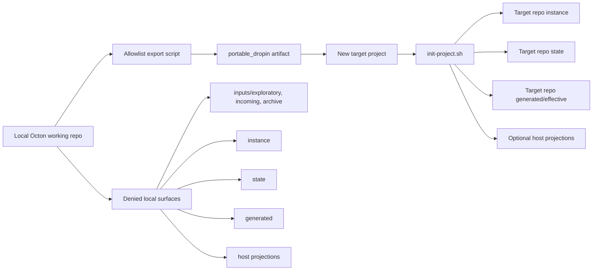
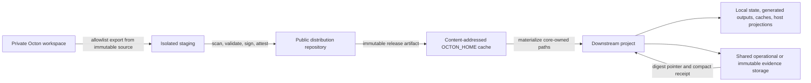

# Consolidated Conversation Thread

This is a chronological convenience copy of `SRC-001` through `SRC-019`.
The turn-scoped files remain the stable source units. No hidden instructions,
reasoning, tool traffic, or unavailable attachments are included.

## SRC-001: Inputs source-material and authority review

- Supplied at: `2026-06-20T15:50:24.000Z`
- Turn status at capture: `completed`

### User Message

Act as a principal Octon architecture reviewer.

Assess the claim that `.octon/inputs/**` is the repo-specific source-material layer that makes an Octon installation unique to a given repository.

Evaluate the claim without assuming it is true. Distinguish clearly between:

- repo-specific or differentiating material
- proprietary or IP-sensitive material
- authored authority
- runtime-consumed configuration
- retained evidence
- generated/effective outputs

Scope:
- Review `.octon/inputs/**` as non-authoritative input material.
- Compare it against the roles of `.octon/framework/**`, `.octon/instance/**`, `.octon/state/**`, and `.octon/generated/**`.
- Treat `.octon/inputs/exploratory/ideation/**` as human-led; inspect only as needed for this review and do not mutate anything.

Questions to answer:

1. In what sense, if any, does `.octon/inputs/**` make an Octon installation repo-specific?
2. Where does repo-specific durable authority actually live?
3. Which parts of `.octon/inputs/**` are raw intake, advisory planning, proposal lineage, normalized extension source, or human-led ideation?
4. What would be misleading or dangerous about calling `.octon/inputs/**` “the proprietary layer”?
5. What is the better mental model for how `.octon/inputs/**` relates to governed promotion, publication, runtime use, and authority?
6. Are there naming, documentation, or taxonomy changes that would make this boundary clearer?

Deliverables:
- A concise verdict: true, partly true, or false, with nuance.
- An evidence table citing relevant repository paths.
- A boundary model showing how `inputs/**` relates to `instance/**`, `state/**`, and `generated/**`.
- Risks caused by confusing raw inputs with authority.
- Recommended wording for the concept.
- Open questions or assumptions.

Constraints:
- Read-only review only.
- Do not promote, publish, install, archive, or modify any files.
- Do not treat raw inputs as policy, runtime authority, retained evidence, or generated-effective output.
- Do not make legal/IP conclusions from the word “proprietary” unless the repository contains explicit evidence for that claim.

### Assistant Message 1 (commentary)

I’ll use the `audit-domain-architecture` skill for a read-only architecture assessment, and first load the repo ingress instructions plus the skill contract so the review matches local conventions.

### Assistant Message 2 (commentary)

I’ve confirmed the local ingress explicitly says `framework/**` and `instance/**` are authored authority, `state/**` is operational truth/evidence, `generated/**` is derived, and raw `inputs/**` is not a runtime or policy dependency. I’m going to verify that claim against the actual tree and surrounding contracts rather than taking the ingress text as conclusive.

### Assistant Message 3 (commentary)

Next I’m loading the mandatory constitutional and workspace files plus the conditional standards. This is still read-only; I’m using them as evidence about how the repository describes authority, runtime posture, and retained evidence.

### Assistant Message 4 (commentary)

The core constitutional files strongly separate “input material” from authority and evidence. I’m reading the rest of the mandatory set, then I’ll map the actual `.octon/inputs` structure and look for any runtime references that contradict that separation.

### Assistant Message 5 (commentary)

The mandatory reads are complete. I’m now mapping directories and searching for explicit references to input, authority, publication, evidence, and generated-effective roles so the conclusion rests on observed placement and contracts.

### Assistant Message 6 (commentary)

The tree shows `.octon/inputs` has two main families: `additive` extension/source intake and `exploratory` plans, syntheses, proposals, reports, and ideation. I’m narrowing into the local READMEs and registries now, because those are the strongest evidence for intended classification without opening human ideation content unnecessarily.

### Assistant Message 7 (commentary)

The local READMEs align with the registry: exploratory material is advisory/lineage-only, reports are source material, syntheses are advisory, and ideation is explicitly human-led. I’m checking the deeper registry entries and additive extension manifests next, because “unique to a repository” may be truer for normalized extension source than for exploratory notes.

### Assistant Message 8 (commentary)

The registry’s path-family entries are useful: `inputs_additive` is explicitly “unselected desired extension source material,” while `inputs_exploratory` is “human-led ideation, proposal packets, plans, syntheses, and reports retained as exploratory lineage.” I’m checking the publication side so I can separate source material from active/generated extension state.

### Assistant Message 9 (commentary)

The extension publication path confirms the key distinction: desired selection is instance-owned, active truth is state-owned, runtime-facing outputs are generated/effective, and `inputs/additive/extensions/**` remains source material with hashes in generated artifact maps. I’m reading the small governance docs that define that split, then I’ll do a contradiction pass.

### Assistant Message 10 (commentary)

For exploratory inputs, I’ve deliberately limited ideation inspection to directory-level docs. The request scopes it as human-led, and the evidence needed for this review is the boundary contract, not the substance of the notes.

### Assistant Message 11 (commentary)

Proposal packets are structurally richer than ordinary notes, but they still describe themselves as temporary and non-canonical, with promotion targets outside the proposal path. That matters for the claim: some `inputs/**` material is differentiating design lineage, but not durable authority.

### Assistant Message 12 (commentary)

I’m now filling the comparison columns for `state/**`, `generated/**`, and `instance/**`: where current control, retained evidence, generated read models, and repo-authored authority actually live.

### Assistant Message 13 (commentary)

The comparison is converging: `instance/**` is the durable repo-specific authored layer; `state/**` carries mutable truth and evidence; `generated/**` carries rebuildable views. I’m checking the root and instance manifests for portability/profile claims, because those are the places that define what travels with an installation.

### Assistant Message 14 (commentary)

One nuance surfaced: some validators and publication tooling are allowed to read raw extension source under `inputs/additive/extensions/**`, and generated artifact maps retain source hashes from those paths. That does not make the source runtime authority, but it does mean “inputs are inert” would be too strong.

### Assistant Message 15 (commentary)

The term “proprietary” appears in intake-routing risk checks, not as a class name for all inputs. That supports a narrower conclusion: proprietary or IP-sensitive material is something intake classification may detect and constrain, not something the entire `inputs/**` root implies.

### Assistant Message 16 (commentary)

I have the evidence set. I’ll do a short self-challenge pass now: look for cases where `inputs/**` is consumed by runtime, where promotion targets still point into inputs, or where “source material” is doing more work than the labels imply.

### Assistant Message 17 (commentary)

The contradiction pass found no obvious durable runtime/policy dependence on raw inputs as authority. The runtime references I checked are either tests/fixtures, proposal lifecycle handling, generated-source dependency tracking, or explicit denial/classification paths.

### Assistant Message 18 (commentary)

One real naming risk did surface in code: authority-path classification groups `.octon/inputs/additive/**` with “authored governance or durable control surface” for write-scope/criticality purposes. That appears to be a safety classification, but the label is easy to misread as source-of-truth authority.

### Assistant Message 19 (commentary)

Generated/effective contracts are consistent: runtime may consume generated outputs only through resolver-verified handles, with raw inputs rejected as authority sources. That gives the boundary model a clear promotion path from source to generated handle without treating the source as live.

### Assistant Message 20 (commentary)

A second nuance is sharper: the topology registry’s generic `runtime_effective` metadata says input families are forbidden source families, while the extension publication artifacts trace published extension outputs back to `inputs/additive/extensions/**` and even some proposal README anchors. That is probably intended as digest provenance, but the registry wording is too broad for extension publication.

### Assistant Message 21 (commentary)

I’m reading the runtime-resolution selector and support declarations for one final check on where repo-specific runtime configuration is actually anchored.

### Assistant Message 22 (commentary)

The self-challenge is done. I found two boundary-clarity issues worth calling out, but no basis for treating `inputs/**` as durable authority or as a blanket proprietary/IP layer.

### Assistant Message 23 (final_answer)

**Verdict**

Partly true. `.octon/inputs/**` can make an Octon installation repo-specific as a non-authoritative source-material and lineage layer: local extension source packs, proposal packets, advisory plans, syntheses, reports, and human-led ideation can differ by repo. But it is not the repo-specific authority layer, not inherently proprietary, not retained evidence, not runtime-consumed policy/config, and not generated/effective output.

**Evidence**

| Path | Evidence |
| --- | --- |
| [.octon/README.md](/Users/jamesryancooper/Projects/octon/.octon/README.md) | Defines `instance/` as repo-specific durable authored authority and `inputs/` as non-authoritative additive/exploratory inputs. |
| [.octon/framework/cognition/_meta/architecture/contract-registry.yml](/Users/jamesryancooper/Projects/octon/.octon/framework/cognition/_meta/architecture/contract-registry.yml) | Classifies `inputs` as `non-authoritative-input`; separates authored authority, control, evidence, generated handles, exploratory input, and raw additive input. |
| [.octon/octon.yml](/Users/jamesryancooper/Projects/octon/.octon/octon.yml) | `repo_snapshot` includes `instance/**` and enabled additive extension sources, excludes exploratory/state/generated; runtime authority order excludes `inputs`. |
| [.octon/instance/extensions.yml](/Users/jamesryancooper/Projects/octon/.octon/instance/extensions.yml) | Repo-owned desired extension selection lives in `instance`, while source roots point to `inputs/additive/extensions`. |
| [.octon/inputs/additive/README.md](/Users/jamesryancooper/Projects/octon/.octon/inputs/additive/README.md) | Additive material becomes capability only after classification, validation, selection, and publication. |
| [.octon/inputs/additive/extensions/README.md](/Users/jamesryancooper/Projects/octon/.octon/inputs/additive/extensions/README.md) | Normalized extension packs are raw source packs, not the published runtime-facing extension surface. |
| [.octon/state/control/extensions/active.yml](/Users/jamesryancooper/Projects/octon/.octon/state/control/extensions/active.yml) | Active published extension state and publication receipt linkage live under `state/control`. |
| [.octon/generated/effective/extensions/catalog.effective.yml](/Users/jamesryancooper/Projects/octon/.octon/generated/effective/extensions/catalog.effective.yml) | Runtime-facing extension catalog is generated/effective and points back to input source manifests by provenance. |
| [.octon/inputs/exploratory/README.md](/Users/jamesryancooper/Projects/octon/.octon/inputs/exploratory/README.md) | Exploratory material may inform work but is not runtime, policy, generated, control, publication, evidence, or host-projection authority. |
| [.octon/inputs/exploratory/proposals/README.md](/Users/jamesryancooper/Projects/octon/.octon/inputs/exploratory/proposals/README.md) | Proposals are temporary implementation aids; promotion targets must be durable surfaces outside proposal paths. |
| [.octon/state/evidence/README.md](/Users/jamesryancooper/Projects/octon/.octon/state/evidence/README.md) | Retained evidence belongs under `state/evidence/**`; raw inputs may be cited but are not evidence authority. |
| [.octon/instance/governance/runtime-resolution.yml](/Users/jamesryancooper/Projects/octon/.octon/instance/governance/runtime-resolution.yml) | Runtime config forbids `.octon/inputs/**` as runtime authority and consumes generated/effective handles resolver-only. |

**Boundary Model**

```text
inputs/additive/.incoming/**
  -> classify + route
  -> state/evidence/** receipts
  -> proposal/program handoff or blocked/deferred

inputs/additive/extensions/**
  -> selected by instance/extensions.yml
  -> active/quarantine truth in state/control/extensions/**
  -> publication receipts in state/evidence/validation/publication/**
  -> generated/effective/extensions/** for runtime resolver use

inputs/exploratory/**
  -> human review, proposal lifecycle, plan, synthesis, or governed Change
  -> durable authority only if promoted into framework/** or instance/**
  -> retained proof only if recorded under state/evidence/**
  -> generated projections only as derived discovery/read models
```

No valid model has `inputs/** -> runtime/policy authority` directly.

**Input Taxonomy**

| Inputs subtree | Best classification |
| --- | --- |
| `inputs/additive/.incoming/**` | Raw additive intake before classification. |
| `inputs/additive/.archive/**` | Historical retained input copy, not retained evidence. |
| `inputs/additive/extensions/**` | Normalized extension source packs. |
| `inputs/exploratory/proposals/**` | Manifest-governed proposal lineage. |
| `inputs/exploratory/plans/*.md` | Advisory planning. |
| `inputs/exploratory/syntheses/*.md` | Advisory research synthesis. |
| `inputs/exploratory/reports/**` | Multi-file non-authoritative report sets. |
| `inputs/exploratory/ideation/**` | Human-led exploration; I inspected only boundary docs/listings needed for this review. |

**Risks**

Calling `inputs/**` “the proprietary layer” is dangerous because it turns a risk finding into a class identity. The repo only treats proprietary, licensed, redistribution-unsafe, secret, or private data as intake classification concerns, not as a blanket property of the root.

Confusing raw inputs with authority can cause direct runtime reads, stale proposal dependencies, skipped publication/freshness gates, invalid closeout claims, unsafe retention of sensitive material, and autonomous access to human-led ideation.

Two clarity issues are worth fixing: runtime write-scope code labels `.octon/inputs/additive/**` as `octon-authored-governance` for approval gating, which is protective but easy to misread; and generic runtime-effective metadata says input families are forbidden source families, while extension publication necessarily records input source digests. That should be worded as “forbidden authority sources,” not “no provenance from inputs.”

**Recommended Wording**

“`.octon/inputs/**` is Octon’s non-authoritative source-material and lineage workbench. It can contain repo-differentiating additive source, proposal history, planning, synthesis, reports, and human-led ideation. Governed promotion may consume it, but durable authority lives in `framework/**` and `instance/**`, operational truth and retained evidence live in `state/**`, and runtime-facing derived handles live in `generated/effective/**`.”

**Recommended Changes**

Rename or document `inputs/additive/extensions/**` as “extension source packs” more prominently.

Split the runtime classification label for `.octon/inputs/additive/**` from `authored-governance` to something like `protected-additive-source`.

Clarify publication metadata so input paths may be provenance/digest sources for extension publication but never authority sources.

Replace proposal-local “source of truth” wording with “proposal-local working reference” where it appears in exploratory proposal prompts.

**Open Questions**

Should first-party bundled extension source under `inputs/additive/extensions/**` be considered repo-specific, portable pack material, or both?

Should runtime-facing extension locks depend on exploratory proposal README anchors, or should those anchors move to framework/scaffolding docs?

Should proposal promotion targets continue to include `inputs/additive/extensions/**`, or should normalized extension source get a clearer non-authority class name?

I made no file edits. The worktree was already dirty when checked.

---

## SRC-002: Sensitive-information and publication-boundary review

- Supplied at: `2026-06-20T16:13:59.000Z`
- Turn status at capture: `completed`

### User Message

Act as a principal Octon security and information-boundary reviewer.

I want to identify every repository surface where proprietary, sensitive, private, or publication-restricted information may reside before the repository is pushed publicly to GitHub.

Context:
- Sensitive material may appear under `.octon/inputs/**`, especially raw intake, exploratory notes, plans, proposals, reports, or human-led ideation.
- Additional proprietary or sensitive material may also reside under `.octon/instance/**`, `.octon/state/**`, `.octon/generated/**`, host projections, logs, evidence, or generated artifacts.
- I am not asking whether these surfaces are authoritative. I am asking where sensitive material may physically or semantically reside in the local repository and how it could accidentally become public through Git tracking, generated outputs, publication artifacts, or pushes to GitHub.

Scope:
- Review likely sensitivity-bearing surfaces across the repository, especially:
  - `.octon/inputs/**`
  - `.octon/instance/**`
  - `.octon/state/**`
  - `.octon/generated/**`
  - root/config/host projection files that may mirror or publish Octon content
  - Git-tracked generated artifacts, evidence, logs, reports, and archives
- Treat `.octon/inputs/exploratory/ideation/**` as human-led; inspect only boundary docs, file names, and minimal metadata unless explicitly authorized.
- Do not mutate files, rewrite history, delete files, alter `.gitignore`, or run cleanup.

Questions to answer:
1. Which repository surfaces may contain proprietary, sensitive, private, secret, credential, license-restricted, or publication-restricted material?
2. Which of those surfaces are likely to be Git-tracked, generated, copied, projected, or published to GitHub?
3. Which surfaces are raw source material, authored authority, runtime/control state, retained evidence, generated output, host projection, or local-only residue?
4. Where are the highest-risk leak paths from local-only or sensitive material into public GitHub history?
5. What safety/security mechanism should be planned to prevent accidental public publication?
6. What naming, taxonomy, `.gitignore`, validation, pre-commit, CI, redaction, or publication-gate changes would reduce risk?

Deliverables:
- A concise risk verdict.
- A surface inventory table with path, role, sensitivity risk, Git/publication risk, and recommended handling.
- A data-classification taxonomy for Octon repository material.
- A leak-path model showing how sensitive material could move from local files into generated outputs, evidence, commits, or GitHub.
- Recommended controls, prioritized by impact and implementation cost.
- Open questions and assumptions.

Constraints:
- Read-only review only.
- Do not quote or expose sensitive contents in the response; redact examples.
- Do not make legal/IP conclusions unless the repository explicitly provides evidence.
- Distinguish “may contain sensitive material” from “is proprietary by definition.”
- Distinguish authority boundaries from information-security boundaries.


### Assistant Message 1 (commentary)

I’ll keep this read-only and treat this as an information-boundary review, not an authority review. I’m going to inspect path inventories, tracking status, ignore rules, publication/projection docs, and filename/keyword signals without opening human-led ideation content beyond boundary metadata.

### Assistant Message 2 (commentary)

I’m starting with the file-level exposure map: which Octon and host projection paths are tracked, which are untracked, and what ignore rules exist. That tells us what can reach GitHub by ordinary push versus what can leak through later staging, generation, or projection.

### Assistant Message 3 (commentary)

I’m continuing from the prior architectural pass, but this time treating authority and information exposure as separate axes. I’ll keep the evidence at path/category level and avoid quoting any potentially sensitive payload content.

### Assistant Message 4 (commentary)

The root ignore rules already show a mixed posture: several sensitive-looking roots are ignored by default, but there are explicit unignore exceptions for selected evidence runs, proposal archives, incoming intake status files, generated materialized indexes, and host-facing generated surfaces. I’ll now quantify what is currently tracked versus merely present.

### Assistant Message 5 (commentary)

Current tracking is materially broader than “source docs only”: thousands of tracked files sit under operational control, retained evidence, generated projections, proposal packets, and host-agent projections. That does not prove sensitive content, but it means a normal public push could expose more than authoritative Octon source.

### Assistant Message 6 (commentary)

The ideation surface is not only notes: filenames show tracked scratchpad material plus an embedded executable-layer project with source files and a `service.wasm`. I have not opened those contents; the path shape alone is enough to treat that subtree as sensitive until deliberately classified.

### Assistant Message 7 (commentary)

A filename/content-marker scan, limited to paths and not values, shows the expected policy documents plus real publication workflows. The content-marker list is not a secret finding by itself; it identifies where secret/redaction/publication concepts are represented and where generated/evidence outputs can carry them.

### Assistant Message 8 (commentary)

I’m going to pull line-numbered excerpts from the repository’s own boundary documents now. I’ll keep this to governance and taxonomy files, not raw payloads or human-led ideation notes.

### Assistant Message 9 (commentary)

The additive intake documents are security-relevant even though they are authority-boundary documents: they explicitly identify executable, binary, secret/private-data, redistribution, and provenance posture as classification inputs. That supports “may contain sensitive material,” not “is proprietary by definition.”

### Assistant Message 10 (commentary)

The repo has a good conceptual foundation for security controls: disclosure tiers distinguish private raw evidence, repo-publishable evidence, release disclosure, and generated read models, and the context-packing policy has explicit redaction/secret-denial semantics. The weaker spot is that those semantics are not uniformly reflected in Git tracking defaults for the local repository.

### Assistant Message 11 (commentary)

The GitHub workflows create a concrete public leak path, not just a theoretical one: one release workflow stages and pushes generated effective state, extension control state, selected evidence decision logs, validation evidence, and publication receipts back to a release branch. Artifact upload workflows also publish selected evidence/generated bundles as CI artifacts.

### Assistant Message 12 (commentary)

Ignore-rule probing confirms the mixed stance: incoming raw payloads are ignored, but additive archives are explicitly unignored; local evidence and stash archives are ignored; state control run roots are explicitly unignored; materialized generated projections are generally ignored except selected indexes. That means the main exposure comes from committed state/evidence/control exceptions and publication paths, not just accidental raw intake staging.

### Assistant Message 13 (commentary)

There is an existing repo-hygiene policy, but it scopes out `.octon/inputs/**` and focuses on cleanup/retention rather than pre-publication secrecy. For a public GitHub push, that leaves a gap: hygiene may protect local residue from deletion without proving that tracked evidence, control, proposals, or human-led notes are safe to publish.

### Assistant Message 14 (commentary)

I’ll do one last path-only sweep for classic secret-bearing filenames and repository-local artifacts. This does not read file contents; it helps distinguish ignored local residue from tracked publication surfaces.

### Assistant Message 15 (commentary)

The path-only sweep reinforces the same risk classes: tracked files include effect-token records, `.jsonl` filesystem snapshots, proposal archives with source-context and implementation prompts, `.patch` diffs, `.log` outputs, and WebAssembly artifacts. I’m not treating those as confirmed secrets; I’m treating them as surfaces that need classification before a public push.

### Assistant Message 16 (commentary)

The broad `find` path scan is still running because it is walking the full workspace. It is read-only; I’ll let it finish briefly, then I’ll use the already bounded Git-index evidence for the final review if it remains too broad.

### Assistant Message 17 (commentary)

The path sweep also found ignored build products under runtime `target/` and generated `.tmp/`; those are less likely to be pushed by ordinary Git commands but still need local-publication hygiene because force-adds, archive exports, or broad packaging can include them.

### Assistant Message 18 (final_answer)

**Verdict**

High risk to push publicly as-is. Not because `.octon/inputs/**` is “the proprietary layer,” but because the repo currently tracks broad classes of raw input, human-led notes, proposal lineage, operational state, retained evidence, generated projections, and host projections. I did not inspect raw ideation contents beyond filenames/metadata, and I am not making legal/IP conclusions.

Observed tracked scope: `.octon/inputs` 4,390 files, `.octon/instance` 442, `.octon/state` 27,840, `.octon/generated` 1,211, plus tracked `.codex`, `.claude`, `.cursor`, and `.github` surfaces.

**Surface Inventory**

| Surface | Role | Sensitivity Risk | Git / Publication Risk | Recommended Handling |
|---|---:|---:|---:|---|
| [`.octon/inputs/additive/.incoming/**`](/Users/jamesryancooper/Projects/octon/.octon/inputs/additive/.incoming/README.md:1) | raw intake | High: explicit risk fields for executable, binary, secret/private-data, redistribution | Payloads ignored; status files can track | Keep raw payloads ignored; classify before any promotion |
| [`.octon/inputs/additive/.archive/**`](/Users/jamesryancooper/Projects/octon/.octon/inputs/additive/.archive/README.md:1) | retained raw intake copies | High | Explicitly unignored in [.gitignore](/Users/jamesryancooper/Projects/octon/.gitignore:7) | Default-deny public unless classified safe and justified |
| [`.octon/inputs/additive/extensions/**`](/Users/jamesryancooper/Projects/octon/.octon/inputs/additive/extensions/README.md:1) | normalized extension source | Medium-high: prompts, skills, templates, source packs | 701 tracked; published to `generated/effective` | Require provenance/license/source classification before publication |
| [`.octon/inputs/exploratory/ideation/**`](/Users/jamesryancooper/Projects/octon/.octon/inputs/exploratory/ideation/scratchpad/README.md:72) | human-led ideation | High: notes, inbox, daily, project experiments | 79 tracked; includes executable-layer project and `.wasm` by filename metadata | Track structure only or explicit allowlist; default private |
| [`.octon/inputs/exploratory/proposals/**`](/Users/jamesryancooper/Projects/octon/.octon/inputs/exploratory/proposals/README.md:1) | proposal lineage | Medium-high: plans, prompts, source lineage, implementation reviews | 3,533 tracked; 196 untracked; registry projection | Treat as advisory lineage; public only after review/redaction |
| `.octon/inputs/exploratory/{plans,reports,syntheses}/**` | advisory planning/research | Medium-high | tracked | Review for private strategy, source excerpts, internal analysis |
| [`.octon/instance/**`](/Users/jamesryancooper/Projects/octon/.octon/README.md:58) | repo-specific durable authority | Medium: governance, support posture, connectors, ownership, missions | tracked; feeds generated outputs | Decide which authored authority is public product vs private deployment |
| [`.octon/state/control/**`](/Users/jamesryancooper/Projects/octon/.octon/state/control/README.md:1) | mutable runtime/control truth | High: run contracts, approvals, exceptions, effect-token records | 13,550 tracked; run roots explicitly unignored | Public only by narrow allowlist; most should be local/private |
| [`.octon/state/continuity/**`](/Users/jamesryancooper/Projects/octon/.octon/state/continuity/README.md:1) | resumable work state | High: handoff/current work context | 732 tracked; run continuity unignored | Default local-only; publish summaries only if redacted |
| [`.octon/state/evidence/**`](/Users/jamesryancooper/Projects/octon/.octon/state/evidence/README.md:1) | retained evidence | Very high: logs, traces, receipts, raw/pointer payloads, diffs | 13,558 tracked; publication receipts tracked; CI uploads evidence | Enforce disclosure tiers and redaction before GitHub |
| [`.octon/generated/effective/**`](/Users/jamesryancooper/Projects/octon/.octon/octon.yml:63) | generated runtime-facing outputs | Medium-high: source refs, hashes, active pack state | 471 tracked; release workflow auto-commits paths | Generated output inherits source classification |
| [`.octon/generated/cognition/**`](/Users/jamesryancooper/Projects/octon/.octon/generated/cognition/projections/README.md:1) | generated read models | Medium-high: aggregates private facts | 648 tracked | Publish only with traceability and source-safe classification |
| [`.octon/generated/proposals/**`](/Users/jamesryancooper/Projects/octon/.octon/inputs/exploratory/proposals/README.md:20) | proposal registry/artifacts | Medium-high | 92 tracked; 4 untracked | Treat as derivative proposal exposure |
| `.codex/**`, `.claude/**`, `.cursor/**` | host projections | Medium-high: commands, skills, settings, prompts | 667 tracked total | Publish only from reviewed projection manifest |
| [`.github/workflows/**`](/Users/jamesryancooper/Projects/octon/.github/workflows/release-please.yml:100) | CI/publication automation | Medium-high: can publish artifacts and commit generated/evidence paths | 47 tracked; release workflow stages state/evidence/generated paths | Add public-publication gate before upload/commit |

**Boundary Model**

```text
raw/local source
  -> inputs/additive/.incoming or inputs/exploratory/ideation
  -> proposals/plans/reports or normalized extension source
  -> instance authority only through governed promotion
  -> state/control + state/evidence during execution
  -> generated/effective, generated/cognition, generated/proposals
  -> host projections and GitHub workflows/artifacts
  -> git commit / release branch / GitHub artifact / public repo
```

Authority and security are separate. The repo correctly says `inputs/**` is non-authoritative and excludes it from runtime/policy authority, but non-authoritative files can still contain sensitive information and can still leak through proposal packets, evidence, generated summaries, host projections, or CI artifacts.

**Highest-Risk Leak Paths**

1. Raw or human-led material becomes proposal/support/source-lineage content, then appears in `generated/proposals/**`.
2. Private run output lands in `state/evidence/**`, then is summarized into disclosure or uploaded as a CI artifact.
3. Extension source under `inputs/additive/extensions/**` is published into `generated/effective/extensions/**` and projected into `.codex`, `.claude`, or `.cursor`.
4. Runtime/control records under `state/control/**` expose run scopes, grants, exceptions, effect-token metadata, or local execution context.
5. Release automation stages generated/effective, extension control, and publication evidence paths into a release branch.

**Recommended Controls**

P0 before public push:
- Add a public-publication gate that fails on tracked files under high-risk roots unless explicitly allowlisted.
- Run secret scanning and history scanning before any public remote push.
- Require disclosure-tier classification for every public `state/evidence/**` file.
- Block raw-copy promotion from private evidence or raw input into generated/read-model/public artifacts.
- Restrict GitHub artifact uploads to redacted, tiered, allowlisted paths.

P1:
- Change `.gitignore` posture to default-ignore ideation content, continuity, run control, most evidence, additive archives, and generated materialized projections.
- Add `classification.yml` or equivalent per publication-bearing root: `public_allowed`, `disclosure_tier`, `source_class`, `redaction_status`.
- Add generated taint tracking: generated files inherit the most restrictive source classification.
- Review `.claude/settings.json` and host projections before public release.

P2:
- Create a curated public-export profile instead of publishing the full working repo.
- Plan separate Git history remediation if any sensitive material was previously committed.
- Add CODEOWNERS/review gates for high-risk roots.

**Recommended Wording**

“`.octon/inputs/**` is a non-authoritative source-material and proposal-lineage area. It may contain repo-specific, private, proprietary, licensed, or publication-restricted material, but it is not proprietary by definition and not an authority layer. Public release requires governed promotion, classification, redaction/minimization, evidence-tiering, and generated-output publication gates.”

**Open Questions**

- Is the goal to publish the whole working repository, or a curated public export?
- Which `instance/**` governance/support surfaces are intended public product documentation?
- Are existing tracked evidence/control/proposal histories already cleared for public disclosure?
- Should host projections be distributed publicly or regenerated by installers?
- Who owns final redaction and license/provenance signoff?

---

## SRC-003: Portable public-distribution boundary review

- Supplied at: `2026-06-20T16:33:17.000Z`
- Turn status at capture: `completed`

### User Message

Act as a principal Octon release-boundary and public-distribution architect.

Goal:
Define a public GitHub publishing boundary for Octon that includes only the portable, drop-in parts needed to install or bootstrap Octon into any project. Exclude project-specific, proprietary, private, sensitive, generated, evidence, runtime-state, or local host-projection material.

Core intent:
The public repository/artifact should be a portable Octon distribution, not a full clone of this local working repository.

Context to inspect:
- `.octon/octon.yml`, especially `bootstrap_core`, `repo_snapshot`, `pack_bundle`, and generated commit defaults
- `.octon/README.md`
- `.octon/framework/scaffolding/runtime/**`
- `.octon/framework/scaffolding/runtime/templates/octon/**`
- `.octon/framework/cognition/_meta/architecture/inputs/README.md`
- `.octon/framework/constitution/contracts/retention/evidence-disclosure-tiers-v1.yml`
- `.gitignore`
- `.github/workflows/release-please.yml`
- Host projection roots: `.codex/**`, `.claude/**`, `.cursor/**`

Questions to answer:
1. What is the minimal portable Octon distribution needed to drop into a new project and get running?
2. Which current repo surfaces are portable product/framework material?
3. Which current repo surfaces are project-specific, private, proprietary-risk, or publication-restricted?
4. Should the existing `bootstrap_core`, `repo_snapshot`, or `pack_bundle` profile be reused, narrowed, or replaced with a new `public_distribution` / `portable_dropin` profile?
5. What Git, CI, `.gitignore`, export-script, or publication-gate changes are needed to prevent accidental public publication of local/project-specific material?

Strict exclusions unless explicitly justified:
- `.octon/inputs/exploratory/**`
- `.octon/inputs/additive/.incoming/**`
- `.octon/inputs/additive/.archive/**`
- repo-local `.octon/instance/**`, except portable templates or minimal default manifests
- `.octon/state/**`
- `.octon/generated/**`, except intentionally rebuilt public distribution artifacts if source-safe
- `.codex/**`, `.claude/**`, `.cursor/**` local host projections, except reviewed templates
- local evidence, logs, traces, receipts, run state, proposal lineage, scratchpads, and generated read models

Deliverables:
- Concise public-publishing verdict
- Proposed public distribution allowlist
- Explicit denylist with rationale
- Boundary model showing source repo -> public export artifact
- Recommended profile name and semantics
- Required validation gates before public push
- Recommended `.gitignore`, CI, and pre-push controls
- Open questions and assumptions

Constraints:
- Start read-only.
- Do not delete, rewrite history, publish, push, or change `.gitignore` without explicit approval.
- Do not inspect human-led ideation content beyond filenames/metadata unless explicitly authorized.
- Do not assume “non-authoritative” means “safe to publish.”
- Do not assume “portable framework” includes this repo’s local `instance`, `state`, `inputs`, or `generated` material.


### Assistant Message 1 (commentary)

I’ll keep this read-only and treat the local repo as a source workspace, not the target artifact. I’m going to inspect the manifest profiles, scaffolding templates, and publication automation to define a narrow export boundary rather than infer one from the current tracked tree.

### Assistant Message 2 (commentary)

The current manifest profiles are useful orientation, but `repo_snapshot` intentionally includes repo `instance/**`, and generated defaults still commit runtime-facing outputs. That is too broad for a public drop-in distribution. I’m now narrowing onto scaffolding/template surfaces that are meant to create a fresh instance.

### Assistant Message 3 (commentary)

The scaffold template itself includes starter `state/**`, `generated/**`, and `inputs/exploratory/**` directories, but these are empty/default convention files, not this repo’s local state. That distinction matters: templates can be public, instantiated local state should not be.

### Assistant Message 4 (commentary)

The canonical bootstrap assets already describe a drop-in flow: copy a base `.octon` harness, then run `init-project.sh` to generate repo-specific bootstrap files and objective contracts. A public distribution should ship that mechanism and neutral templates, not this repository’s instantiated `instance/**`.

### Assistant Message 5 (commentary)

One important finding: the `templates/octon/manifest.json` declares a complete base harness including `README.md`, `AGENTS.md`, `octon.yml`, and `framework/manifest.yml`, but the current file inventory I saw under that template is partial. I’ll verify whether the template is complete or just a legacy starter bundle.

### Assistant Message 6 (commentary)

The current `templates/octon` manifest is not a complete drop-in source by itself: required files named by the manifest are absent there. That points to a new curated export process: assemble from `framework/**` plus selected neutral bootstrap/template files, not simply copy `templates/octon/**` wholesale.

### Assistant Message 7 (final_answer)

**Verdict**

Partly true in intent, but not safe as implemented today: this repository should not be pushed publicly as-is. The public Octon artifact should be a curated export, not a clone of this working repo.

The closest existing profile is `bootstrap_core`, but I would not reuse it unchanged. It includes `.octon/framework/**`, which is directionally right, but it also points at a live repo `instance/manifest.yml` and does not give a complete neutral drop-in template. `repo_snapshot` is too broad for public distribution, and `pack_bundle` is for extension transfer, not base Octon installation.

Use a new profile: `portable_dropin`.

**Minimal Portable Distribution**

The drop-in distribution should contain only:

| Include | Why |
|---|---|
| `.octon/octon.yml` or a sanitized distribution manifest | Defines Octon profile semantics without local repo state |
| `.octon/README.md` | Portable orientation docs |
| `.octon/framework/**` | Product/framework authority and portable runtime/scaffolding source |
| `.octon/framework/scaffolding/runtime/bootstrap/**` | First-run bootstrap entrypoints |
| `.octon/framework/scaffolding/runtime/templates/**` | Neutral templates for generating repo-local instance/state/generated surfaces |
| Minimal root adapter templates: `AGENTS.md`, `CLAUDE.md`, `.octon/AGENTS.md` | Install-time ingress adapters only |
| Minimal default instance templates | Needed to create a new repo’s `instance/**`, but should come from templates, not this repo’s live instance |

Important gap: [templates/octon/manifest.json](/Users/jamesryancooper/Projects/octon/.octon/framework/scaffolding/runtime/templates/octon/manifest.json:1) declares required base files such as `README.md`, `AGENTS.md`, `octon.yml`, and `framework/manifest.yml`, but those files are not actually present under that template root. That template must be repaired or replaced before it can be the public distribution source.

**Explicit Denylist**

| Path | Rationale |
|---|---|
| `.octon/inputs/exploratory/**` | Human-led notes, plans, proposals, reports, ideation; not safe by being non-authoritative |
| `.octon/inputs/additive/.incoming/**` | Raw intake; likely highest ambiguity and sensitivity risk |
| `.octon/inputs/additive/.archive/**` | Retained intake/history; not public by default |
| `.octon/inputs/additive/extensions/**` | Not base distribution; export only as separately reviewed packs |
| `.octon/instance/**` | Repo-specific durable authority; create from template in target repos |
| `.octon/state/**` | Runtime/control/evidence/continuity state |
| `.octon/generated/**` | Derived effective outputs/read models; rebuild in target |
| `.codex/**`, `.claude/**`, `.cursor/**` | Local host projections/settings; publish templates only, not projections |
| `.github/workflows/release-please.yml` as-is | Current workflow stages generated, evidence, and control paths; unsafe for public distro |
| Logs, traces, receipts, reports, archives, local evidence | Publication-restricted unless explicitly redacted/classified |

**Evidence**

| Evidence | Interpretation |
|---|---|
| [octon.yml](/Users/jamesryancooper/Projects/octon/.octon/octon.yml:33) | `bootstrap_core` includes framework plus only `instance/manifest.yml`; `repo_snapshot` includes local `instance/**`; `pack_bundle` targets extension exports |
| [octon.yml](/Users/jamesryancooper/Projects/octon/.octon/octon.yml:60) | Generated/effective and raw-input freshness defaults are operational concerns, not public boundary controls |
| [README.md](/Users/jamesryancooper/Projects/octon/.octon/README.md:29) | Defines `framework` as portable core, `instance` as repo-specific authority, `state` as mutable truth/evidence, `generated` as rebuildable, `inputs` as non-authoritative |
| [inputs README](/Users/jamesryancooper/Projects/octon/.octon/framework/cognition/_meta/architecture/inputs/README.md:3) | Inputs are raw source material and never runtime, policy, evidence, publication, or host-projection authority |
| [evidence tiers](/Users/jamesryancooper/Projects/octon/.octon/framework/constitution/contracts/retention/evidence-disclosure-tiers-v1.yml:16) | Raw/private evidence is not publishable by default; generated read models cannot become evidence |
| [runtime bootstrap README](/Users/jamesryancooper/Projects/octon/.octon/framework/scaffolding/runtime/bootstrap/README.md:1) | Bootstrap assets are the right portable install machinery |
| [init-project.sh](/Users/jamesryancooper/Projects/octon/.octon/framework/scaffolding/runtime/bootstrap/init-project.sh:96) | Bootstrap writes new repo-local `instance/**` artifacts, confirming they should be generated per target repo |
| [release-please.yml](/Users/jamesryancooper/Projects/octon/.github/workflows/release-please.yml:100) | Current release workflow explicitly stages generated/evidence/control paths |
| [.gitignore](/Users/jamesryancooper/Projects/octon/.gitignore:1) | Current ignore rules still allow many Octon runtime/evidence surfaces to be tracked |

**Boundary Model**



**Recommended Profile**

Use `portable_dropin`.

Semantics:

- allowlist-driven export only
- no live repo `instance/**`
- no live `state/**`
- no live `generated/**`
- no raw `inputs/**`
- no host projections
- creates target-local authority/state/generated outputs only after install
- optional extension packs are separate reviewed artifacts, not part of the base profile

Keep `bootstrap_core` as an internal bootstrap source profile or narrow it to stop copying live `instance/manifest.yml`. Do not use `repo_snapshot` or `pack_bundle` for the public base artifact.

**Required Gates**

Highest impact controls:

1. Add a `portable_dropin` export script that copies only allowlisted paths into a clean temp directory.
2. Add a denylist validator that fails if the artifact contains `.octon/inputs`, `.octon/instance`, `.octon/state`, `.octon/generated`, `.codex`, `.claude`, or `.cursor`, except approved templates under `.octon/framework/scaffolding/runtime/templates/**`.
3. Add a template completeness check for `templates/octon/manifest.json`.
4. Add secret/sensitive-content scanning on the export artifact and public branch.
5. Replace or disable the current release workflow for public distribution; it currently publishes generated/evidence/control paths.
6. Add a pre-push hook or CI job that blocks public remotes from receiving denied paths.
7. Use `.gitattributes export-ignore` for local-only roots if archive-based distribution is used.
8. Treat `.gitignore` as hygiene only, not the security boundary.

**Recommended Wording**

“`.octon/framework/**` plus reviewed bootstrap templates form the portable Octon distribution source. A public `portable_dropin` artifact is produced by allowlist export. Repository-local `inputs/**`, `instance/**`, `state/**`, `generated/**`, evidence, and host projections are installation/runtime material and are excluded unless separately classified and intentionally published.”

**Open Questions**

- Should public Octon be a separate repository, or a generated release artifact from this repo?
- Which parts of `.octon/framework/**` need license/provenance review before publication?
- Are any additive extension packs intended to ship as first-party public packs?
- Should the public artifact include generated starter files, or should all `state/**` and `generated/**` be created only during first init?
- Should `bootstrap_core` be deprecated in favor of `portable_dropin`, or retained as an internal profile?

---

## SRC-004: Sponsor distribution decisions

- Supplied at: `2026-06-20T16:52:08.000Z`
- Turn status at capture: `completed`

### User Message

1. **Separate repo or generated artifact?**  
Use a separate public repository that is populated only by a generated, allowlist-based `portable_dropin` artifact from this repo.  
This repo remains the full development/workspace repo. The public repo is a distribution mirror, not a clone target.

2. **Which `.octon/framework/**` parts need license/provenance review?**  
All of `.octon/framework/**` before first publication, with priority on:
- executable/runtime material, including scripts, Rust/WASM/runtime assets
- bundled templates and generated scaffolds
- skills, prompts, agent instructions, and host-tool projections
- schemas/contracts derived from external standards or prior systems
- test fixtures, examples, sample data, reports, and docs
- anything copied from vendors, OSS projects, AI outputs, or private work

Default answer: framework is portable by role, but not automatically publication-cleared.

3. **Should additive extension packs ship as first-party public packs?**  
Not in the base distribution.  
Initial public Octon should ship with zero additive packs by default. Any first-party packs should be separately reviewed, classified, versioned, and exported through a dedicated pack profile. If an extension is essential to Octon itself, promote it into reviewed framework material instead of treating it as local additive input.

4. **Should generated starter files be included?**  
No live `.octon/state/**` or `.octon/generated/**` files should ship in the artifact.  
The artifact should include neutral templates only, preferably under `.octon/framework/scaffolding/runtime/templates/**`. First init should create target-local state, generated/effective outputs, evidence roots, and host projections.

5. **Deprecate `bootstrap_core` or retain it?**  
Retain `bootstrap_core` as an internal/bootstrap implementation profile, but do not use it as the public distribution boundary.  
Introduce `portable_dropin` as the public-facing profile. Narrow `bootstrap_core` if needed so it does not imply copying live repo `instance/**` into other projects. Over time, deprecate public references to `bootstrap_core`, not necessarily the internal profile itself.

Recommended concise policy:

> Public Octon is a `portable_dropin` export produced from reviewed framework and bootstrap templates only. It is published through a separate public distribution surface. Local inputs, instance authority, state, generated outputs, evidence, host projections, and additive packs are excluded unless separately classified and intentionally exported.


### Assistant Message 1 (final_answer)

Agreed. This resolves the public-boundary decision cleanly.

The architecture should be:

```text
development repo
  full Octon workspace, including local inputs/instance/state/generated/evidence/projections
        |
        | allowlist export + validation gates
        v
portable_dropin artifact
  reviewed framework + bootstrap/templates only
        |
        | publish
        v
separate public distribution repo
  distribution mirror, not a clone of the development repo
```

I would treat your concise policy as the canonical wording, with one small precision:

> Public Octon is a `portable_dropin` export produced from publication-cleared framework source and neutral bootstrap templates only. It is published through a separate public distribution repository populated by an allowlist export artifact. Local inputs, instance authority, state, generated outputs, evidence, host projections, and additive packs are excluded unless separately classified, reviewed, versioned, and intentionally exported.

Key implementation implications:

- `portable_dropin` becomes the only public-facing distribution profile.
- `bootstrap_core` remains internal/bootstrap machinery, not a publication boundary.
- `.octon/framework/**` is portable by architectural role, but publication-cleared only after license/provenance/security review.
- First public release ships zero additive packs.
- The public repo must never be populated by `git push --mirror`, branch copy, or broad rsync from this repo.
- Public CI should validate the exported artifact, not this full workspace.
- Live `.octon/instance/**`, `.octon/state/**`, `.octon/generated/**`, `.octon/inputs/**`, `.codex/**`, `.claude/**`, and `.cursor/**` remain denied by default.

The next concrete artifact should be a `portable_dropin` profile contract plus an export validator that makes those exclusions mechanically enforceable.

---

## SRC-005: Architecture fit-for-purpose question

- Supplied at: `2026-06-20T16:56:40.000Z`
- Turn status at capture: `completed`

### User Message

> Is Octon’s current architecture fit for its intended purpose, and does its structure support the public, portable, governed distribution model we are trying to create?

Architecture-review:

> Assess whether Octon’s current architecture, repository structure, authority boundaries, and publication model are fit for purpose. Specifically, determine where the current design supports or conflicts with the goal of producing a portable public Octon distribution while keeping repo-specific inputs, instance authority, runtime state, generated outputs, evidence, and host projections out of the public surface.

Answer:

> Does Octon’s current architecture align with the intended public distribution model, or are there structural boundaries that need to be clarified, narrowed, or redesigned before publication?


### Assistant Message 1 (commentary)

I’ll use the `audit-domain-architecture` skill because this is explicitly an architecture fitness review. I’ll keep this read-only and focus on the public distribution boundary, not on judging local content as publishable.

### Assistant Message 2 (commentary)

The skill’s contract is read-only in intent, but it normally writes audit receipts. I’m not going to write those here because your publication-boundary work has consistently required no mutation; I’ll apply the review structure directly in the response.

### Assistant Message 3 (commentary)

I’m going to re-check the live repository shape and the distribution-related manifests so the answer is grounded in current files, not just the prior boundary discussion.

### Assistant Message 4 (final_answer)

**Short Answer**

Octon is partly aligned with the intended public distribution model, but it is not publication-ready as structured today.

The core architecture has the right conceptual boundaries: `framework` is portable, `instance` is repo authority, `state` is runtime/evidence, `generated` is derived, and `inputs` are non-authoritative raw/advisory material. The problem is that the repository and release mechanics do not yet enforce a public distribution boundary. A public push of this repo would be structurally unsafe.

Target mode: observed for the current repo; prospective for `portable_dropin`, because that profile does not yet exist.

**Current Surface Map**

| Surface | Current role | Public distribution fitness |
|---|---|---|
| [.octon/framework/**](/Users/jamesryancooper/Projects/octon/.octon/README.md:33) | Portable authored Octon core | Architecturally fit, but needs license/provenance/security clearance |
| [.octon/instance/**](/Users/jamesryancooper/Projects/octon/.octon/README.md:34) | Repo-specific durable authority | Must be excluded except neutral templates |
| [.octon/state/**](/Users/jamesryancooper/Projects/octon/.octon/README.md:35) | Mutable control, continuity, retained evidence | Must be excluded |
| [.octon/generated/**](/Users/jamesryancooper/Projects/octon/.octon/README.md:36) | Rebuildable effective outputs/read models | Must be excluded and rebuilt in target repos |
| [.octon/inputs/**](/Users/jamesryancooper/Projects/octon/.octon/framework/cognition/_meta/architecture/inputs/README.md:3) | Raw/non-authoritative inputs | Must be excluded by default |
| `.codex/**`, `.claude/**`, `.cursor/**` | Local host projections | Must be excluded except reviewed templates |
| [.github/workflows/release-please.yml](/Users/jamesryancooper/Projects/octon/.github/workflows/release-please.yml:100) | Local release automation | Not fit for public distribution as-is |

Tracked local-publication risk is high: this repo currently tracks thousands of files under excluded surfaces, including `.octon/state` and `.octon/inputs`.

**What Fits**

The class-root model is strong. [.octon/README.md](/Users/jamesryancooper/Projects/octon/.octon/README.md:29) clearly separates portable framework material from repo-local authority, runtime state, generated outputs, and inputs.

The input boundary is also directionally correct. The inputs architecture says `inputs/**` is raw source material and is never runtime, policy, generated, state/control, publication, retained evidence, or host-projection authority.

The evidence model supports safe publication in principle. The evidence tier contract explicitly forbids raw-copy promotion into publishable surfaces and says generated read models cannot become retained evidence.

The scaffolding runtime is the right architectural mechanism for public distribution: ship neutral bootstrap machinery, then let first init create target-local `instance`, `state`, `generated`, evidence roots, and projections.

**What Conflicts**

Finding A1: No explicit public distribution profile exists.

Current profiles are not the right boundary. [bootstrap_core](/Users/jamesryancooper/Projects/octon/.octon/octon.yml:34) is closest but still includes live `instance/manifest.yml`. [repo_snapshot](/Users/jamesryancooper/Projects/octon/.octon/octon.yml:39) includes local `instance/**`. [pack_bundle](/Users/jamesryancooper/Projects/octon/.octon/octon.yml:49) is extension-specific. None means “reviewed portable public artifact only.”

Finding A2: Release automation conflicts with the desired public model.

The current release workflow refreshes and stages `.octon/generated/effective/**`, `.octon/state/control/**`, and `.octon/state/evidence/**` paths during release. That is appropriate for an internal governed repo, but unsafe as a public distribution pipeline.

Finding A3: Template boundary is incomplete.

The base Octon template manifest declares required files like `README.md`, `AGENTS.md`, `octon.yml`, `framework/manifest.yml`, and `instance/manifest.yml`, but those files are currently missing under the template root. That makes the intended “generate target-local surfaces from neutral templates” path under-specified.

Finding A4: Framework is portable by role, not automatically publication-cleared.

The architecture correctly places framework material in the portable root, but executable/runtime assets, prompts, skills, schemas, test fixtures, examples, and docs still need publication clearance before first release.

Finding A5: Host projections are not isolated from distribution.

The repo tracks `.codex`, `.claude`, and `.cursor` projection surfaces. These may be useful locally, but they should not be copied into a public Octon distribution except as reviewed templates or generated target-local outputs.

**Fit Verdict**

Octon’s architecture is conceptually fit for the public portable model, but its current repository structure and publication mechanics are not yet mechanically fit.

Before publication, the boundary must be clarified and enforced with:

- a new `portable_dropin` profile
- an allowlist export script
- denylist validation for local roots
- repaired neutral bootstrap templates
- a separate public distribution repository
- CI/pre-push gates that reject local `inputs`, `instance`, `state`, `generated`, evidence, and host projections

**Keep As-Is**

Keep the class-root model. It is the strongest part of the architecture.

Keep `bootstrap_core` as internal implementation machinery, but stop presenting it as the public boundary.

Keep `pack_bundle` separate for reviewed extension packs. Do not include additive packs in base Octon.

Keep generated/evidence publication rules for the development repo, but do not reuse that release workflow for the public mirror.

**Required Redesign Before Publication**

The missing structural piece is not a new conceptual taxonomy; it is an enforced export boundary.

Recommended shape:

```text
full development repo
  framework + local inputs + instance + state + generated + evidence + projections
        |
        | portable_dropin allowlist export
        v
generated artifact
  publication-cleared framework + neutral bootstrap/templates only
        |
        v
separate public distribution repo
```

**Final Answer**

Octon aligns at the architectural-concept level, but not yet at the repository/publication-mechanics level. The structural boundaries are clear enough to support the intended model, but they must be narrowed and made enforceable before publication. The public distribution should be generated from reviewed `framework` and bootstrap templates only; it should not be a clone, branch, release workflow output, or GitHub mirror of this current workspace.

---

## SRC-006: Public-distribution implementation-planning brief

- Supplied at: `2026-06-26T18:50:37.000Z`
- Turn status at capture: `completed`

### User Message

Act as a principal Octon architecture and release-boundary planner.

Based on the work explored in this thread, produce a concise implementation-planning brief for the Octon public distribution model.

Goal:
Summarize what has been explored, what decisions or recommendations have emerged, and how to proceed toward a finalized implementation plan for publishing Octon as a portable public distribution.

Context to cover:
- The distinction between the full local development/workspace repo and the separate public distribution repo
- The proposed `portable_dropin` export model
- Why `bootstrap_core`, `repo_snapshot`, and `pack_bundle` are not sufficient as the public boundary
- Which repository surfaces are portable framework material
- Which surfaces must remain excluded: local inputs, instance authority, state, generated outputs, evidence, host projections, additive packs, logs, reports, and local residue
- The need for framework-wide license, provenance, sensitivity, and publication review before first public release
- The requirement that the public repo be populated only by an allowlist-generated artifact, not by cloning or mirroring this workspace repo

Deliverables:
1. Executive overview of what was explored
2. Current architectural verdict: what aligns, what does not, and what needs clarification
3. Recommended target model for public distribution
4. Proposed implementation workstreams
5. Required policy/profile changes, especially `portable_dropin`
6. Required export, validation, CI, pre-push, and publication gates
7. Risks and failure modes to prevent
8. Suggested phased roadmap from current state to finalized implementation
9. Open questions and decisions still needed

Constraints:
- Do not mutate files.
- Do not inspect sensitive or human-led ideation content.
- Do not assume non-authoritative content is safe to publish.
- Distinguish architecture boundaries from information-security/publication boundaries.
- Clearly separate confirmed findings from recommendations and assumptions.

Answer in a structured but concise format suitable for turning into an implementation plan.

### Assistant Message 1 (final_answer)

**1. Executive Overview**

We reviewed Octon’s current architecture against the goal of publishing a portable public distribution. The main conclusion: the conceptual architecture is mostly sound, but the current repository/publication mechanics are not safe as a public boundary.

Confirmed from prior inspection:

- [`.octon/README.md`](/Users/jamesryancooper/Projects/octon/.octon/README.md:29) already distinguishes `framework`, `instance`, `state`, `generated`, and `inputs`.
- [`.octon/octon.yml`](/Users/jamesryancooper/Projects/octon/.octon/octon.yml:33) has `bootstrap_core`, `repo_snapshot`, and `pack_bundle`, but no true public distribution profile.
- [inputs architecture](/Users/jamesryancooper/Projects/octon/.octon/framework/cognition/_meta/architecture/inputs/README.md:3) correctly says inputs are raw/non-authoritative, not publication authority.
- [evidence tiers](/Users/jamesryancooper/Projects/octon/.octon/framework/constitution/contracts/retention/evidence-disclosure-tiers-v1.yml:16) support private vs publishable disclosure boundaries.
- [release-please workflow](/Users/jamesryancooper/Projects/octon/.github/workflows/release-please.yml:100) currently stages generated/evidence/control paths, so it is not suitable for public distribution.

**2. Architectural Verdict**

Partly aligned.

What aligns:

- `framework/**` is the right portable product/framework root.
- `instance/**` is correctly modeled as repo-specific durable authority.
- `state/**` is correctly modeled as runtime/control/evidence/continuity.
- `generated/**` is correctly modeled as derived/effective output.
- `inputs/**` is correctly non-authoritative and not runtime authority.
- Scaffolding/bootstrap is the right mechanism for creating target-local surfaces.

What does not align yet:

- There is no enforced `portable_dropin` public boundary.
- Existing profiles can be mistaken for publication profiles.
- Current release automation can publish local generated/evidence/control material.
- The base Octon template manifest appears ahead of actual template files.
- Host projections are tracked locally and need exclusion from public output.
- `framework/**` is portable by role, but not automatically publication-cleared.

**3. Target Model**

Use a separate public distribution repository populated only by a generated artifact:

```text
full local development repo
  framework + local inputs + instance + state + generated + evidence + projections
        |
        | allowlist export: portable_dropin
        v
portable_dropin artifact
  publication-cleared framework + neutral bootstrap/templates only
        |
        v
separate public Octon repo
  distribution mirror, not a clone of this workspace
```

The public repo must never be populated by `git push --mirror`, branch copy, broad `rsync`, or a normal clone of this workspace.

**4. Why Current Profiles Are Insufficient**

| Profile | Finding |
|---|---|
| `bootstrap_core` | Closest, but internal; currently includes live `instance/manifest.yml`, so it should not define public distribution. |
| `repo_snapshot` | Too broad; includes repo-local `instance/**` and enabled extension material. |
| `pack_bundle` | Useful for separately reviewed extension packs, not base Octon. |
| `full_fidelity` | Explicitly a normal clone; opposite of the public distribution boundary. |

**5. Public Allowlist**

Recommended public source classes:

- `.octon/octon.yml`, sanitized or profile-scoped for distribution
- `.octon/README.md`
- `.octon/framework/**`, after publication review
- `.octon/framework/scaffolding/runtime/bootstrap/**`
- `.octon/framework/scaffolding/runtime/templates/**`, after template repair/review
- neutral root adapter templates, not local adapters as-is
- neutral instance/state/generated templates under framework scaffolding only

**6. Required Denylist**

Exclude by default:

- `.octon/inputs/**`
- `.octon/instance/**`, except neutral templates
- `.octon/state/**`
- `.octon/generated/**`
- `.codex/**`, `.claude/**`, `.cursor/**`
- additive packs
- evidence, logs, traces, reports, receipts, archives
- local run state and local residue
- generated effective outputs unless rebuilt inside a public-safe export process

**7. Implementation Workstreams**

1. Define `portable_dropin` profile semantics in `.octon/octon.yml`.
2. Repair or replace the base Octon template set so required files actually exist.
3. Build an allowlist export script that writes to a clean artifact directory.
4. Build a denylist validator for exported artifacts.
5. Add framework-wide license/provenance/sensitivity/publication review.
6. Create separate public distribution repo and publish only export output.
7. Replace public release CI with artifact validation, not local workspace release logic.
8. Add pre-push/public-remote protections against denied paths.
9. Document the boundary in README and contributor guidance.

**8. Required Gates**

Before first public publication:

- allowlist-only export verification
- denylist scan for local roots and host projections
- secret/sensitive-content scan
- framework license/provenance review
- executable/runtime/WASM/script review
- template completeness check
- generated-output taint check
- evidence-disclosure classification check
- public repo diff check before push
- CI gate that fails if excluded roots appear

**9. Risks To Prevent**

- Publishing the full workspace repo instead of a distribution artifact.
- Treating “non-authoritative” as “safe to publish.”
- Copying live `instance/**` into public Octon.
- Publishing generated/effective outputs that encode local configuration.
- Shipping retained evidence, logs, reports, or receipts.
- Accidentally publishing host projections from `.codex`, `.claude`, or `.cursor`.
- Shipping additive packs before separate classification/versioning.
- Assuming all framework material is license-safe without review.

**10. Phased Roadmap**

Phase 1: Boundary contract  
Define `portable_dropin`, denylist, allowlist, and public repo policy.

Phase 2: Template repair  
Make neutral bootstrap/templates complete and remove dependency on live local `instance/**`.

Phase 3: Export tooling  
Implement clean-room artifact generation plus manifest/checksum output.

Phase 4: Validation gates  
Add denylist, template completeness, provenance, secret, generated-taint, and evidence checks.

Phase 5: Public repo pipeline  
Populate a separate public repo only from validated artifacts.

Phase 6: First release review  
Run full framework publication review and publish only after all gates pass.

**11. Open Decisions**

- Exact public repo name and ownership.
- Whether `portable_dropin` lives only in `.octon/octon.yml` or also gets a standalone contract file.
- Whether root adapters ship as files, templates, or generated install outputs.
- Whether any framework-host projection templates should be included.
- How to record publication clearance for each framework subtree.
- Whether `bootstrap_core` should be narrowed immediately or only documented as internal.

---

## SRC-007: External architect handoff prompt request

- Supplied at: `2026-06-26T18:57:30.000Z`
- Turn status at capture: `completed`

### User Message

I want to provide all the information in this thread to an architectural engineer to review, finalize, and create an implementation plan for the public distribution model. Create a prompt that will instruct this.


### Assistant Message 1 (final_answer)

Use this prompt:

```text
Act as a principal Octon architecture and release-boundary engineer.

Objective:
Review, finalize, and turn the Octon public distribution model into an implementation plan.

Context:
Octon currently lives in a full local development/workspace repository. That repository contains portable framework material, but also local repo-specific material, private/sensitive/proprietary-risk material, generated outputs, runtime state, retained evidence, host projections, logs, reports, and local residue.

The intended public model is not to publish this workspace repo. The intended model is:

development/workspace repo
  -> allowlist-generated portable_dropin artifact
  -> separate public distribution repo

The public repo is a distribution mirror populated only from the generated artifact. It must not be a clone, mirror, branch copy, or broad rsync of the workspace repo.

Prior findings and working decisions:
- `.octon/framework/**` is portable by architectural role, but not automatically publication-cleared.
- All of `.octon/framework/**` requires license, provenance, sensitivity, and publication review before first public release.
- High-priority framework review areas include executable/runtime material, scripts, Rust/WASM/runtime assets, templates, generated scaffolds, skills, prompts, agent instructions, host-tool projections, schemas/contracts derived from external standards or prior systems, test fixtures, examples, sample data, reports, docs, vendor/OSS/AI/private-work derived material.
- `.octon/instance/**` is repo-specific durable authority and must not be copied into the public artifact except as neutral templates.
- `.octon/state/**` is runtime/control/evidence/continuity state and must not ship.
- `.octon/generated/**` is derived/effective output and must not ship as live local content.
- `.octon/inputs/**` is non-authoritative raw/advisory material; non-authoritative does not mean safe to publish.
- `.octon/inputs/exploratory/ideation/**` is human-led; inspect only filenames/metadata unless explicitly authorized.
- `.codex/**`, `.claude/**`, `.cursor/**` are local host projections/settings; exclude except reviewed templates.
- Additive packs should not ship in the base distribution. Ship zero additive packs initially. Any first-party pack needs separate classification, versioning, review, and export profile. If an extension is essential to Octon, promote it into reviewed framework material.
- No live `.octon/state/**` or `.octon/generated/**` starter files should ship. First init should create target-local state, generated/effective outputs, evidence roots, and host projections from neutral templates.
- Retain `bootstrap_core` as an internal/bootstrap implementation profile, but do not use it as the public distribution boundary.
- Introduce `portable_dropin` as the public-facing profile.
- Over time, deprecate public references to `bootstrap_core`, not necessarily the internal profile itself.

Important files/surfaces to inspect:
- `AGENTS.md`
- `.octon/instance/ingress/AGENTS.md`
- `.octon/octon.yml`, especially `bootstrap_core`, `repo_snapshot`, `pack_bundle`, generated commit defaults, and runtime refs
- `.octon/README.md`
- `.octon/framework/scaffolding/runtime/**`
- `.octon/framework/scaffolding/runtime/templates/**`
- `.octon/framework/scaffolding/runtime/templates/octon/manifest.json`
- `.octon/framework/cognition/_meta/architecture/inputs/README.md`
- `.octon/framework/constitution/contracts/retention/evidence-disclosure-tiers-v1.yml`
- `.gitignore`
- `.github/workflows/release-please.yml`
- Host projection roots: `.codex/**`, `.claude/**`, `.cursor/**`, metadata only unless needed
- Do not inspect human-led ideation content beyond filenames/metadata.

Known concerns to verify:
- Existing profiles are insufficient:
  - `bootstrap_core` is closest but internal and may imply copying live `instance/manifest.yml`.
  - `repo_snapshot` is too broad because it includes local `instance/**` and extension material.
  - `pack_bundle` is for separately reviewed extension packs, not base Octon.
  - `full_fidelity` is a normal clone and is explicitly not the public model.
- Current release workflow appears unsafe for public distribution because it stages generated/effective, state/control, and state/evidence paths.
- The base Octon template manifest may declare required files that are missing from the actual template tree. Verify and plan repair.
- Current `.gitignore` is hygiene, not a security/publication boundary.

Constraints:
- Start read-only.
- Do not mutate files while producing the plan.
- Do not publish, push, delete, rewrite history, or clean files.
- Do not assume non-authoritative content is safe to publish.
- Distinguish architecture/authority boundaries from information-security/publication boundaries.
- Distinguish confirmed findings from recommendations and assumptions.
- Do not make legal/IP conclusions unless explicit repository evidence supports them.

Tasks:
1. Validate whether the current architecture is fit for the portable public distribution model.
2. Identify structural gaps that must be clarified, narrowed, or redesigned before publication.
3. Define the `portable_dropin` profile contract and semantics.
4. Define the public distribution allowlist.
5. Define the explicit denylist and rationale.
6. Specify how the export artifact should be generated from the workspace repo.
7. Specify validation gates for export, CI, pre-push, publication, and public repo sync.
8. Specify how framework-wide license/provenance/sensitivity/publication review should be recorded.
9. Specify required changes to `bootstrap_core`, docs, templates, `.gitignore`, CI, and release automation.
10. Provide a phased roadmap from current state to first public release.
11. Identify open questions and decisions needed before implementation.

Deliverables:
- Executive verdict: aligned, partly aligned, or not aligned, with nuance.
- Current surface inventory table:
  - path
  - role
  - public distribution handling
  - risk
  - recommended action
- Proposed `portable_dropin` profile specification.
- Public artifact allowlist and denylist.
- Boundary model showing:
  - full workspace repo
  - allowlist export
  - generated artifact
  - separate public distribution repo
  - target project first init
- Export tool design:
  - inputs
  - outputs
  - manifest/checksum expectations
  - failure behavior
- Validation gate design:
  - denylisted path scan
  - template completeness
  - secret/sensitivity scan
  - license/provenance scan
  - generated-output taint check
  - evidence-disclosure check
  - host projection exclusion
  - public repo diff check
- CI/pre-push/publication-gate recommendations.
- Phased implementation roadmap with acceptance criteria.
- Risks and failure modes.
- Open questions and assumptions.

Recommended policy wording to evaluate and refine:
“Public Octon is a `portable_dropin` export produced from publication-cleared framework source and neutral bootstrap templates only. It is published through a separate public distribution repository populated by an allowlist export artifact. Local inputs, instance authority, state, generated outputs, evidence, host projections, and additive packs are excluded unless separately classified, reviewed, versioned, and intentionally exported.”
```

---

## SRC-008: Conversation attachment review instruction

- Supplied at: `2026-06-26T19:09:00.000Z`
- Turn status at capture: `completed`

### User Message

Add a section that explains that I will be providing each conversation as an attachment to be reviewed.


### Assistant Message 1 (final_answer)

Add this section after `Context` or before `Important files/surfaces to inspect`:

```text
Conversation Attachments:
I will provide prior conversations as attachments. Treat those attachments as review inputs and planning context, not as unquestioned authority.

For each attached conversation:
- Read it for explored findings, assumptions, decisions, risks, and unresolved questions.
- Distinguish confirmed repository evidence from conversational conclusions or recommendations.
- Carry forward useful decisions only when they remain consistent with repository evidence and the target public distribution model.
- Do not quote sensitive content from attachments unless necessary; summarize and redact where appropriate.
- If an attachment conflicts with repository evidence, prefer repository evidence and call out the conflict.
- If attachments conflict with each other, identify the conflict and recommend a resolution.
- Use the attachments to avoid redoing prior exploration unnecessarily, but independently verify any implementation-critical claim before relying on it.
```

You can insert it into the prompt like this:

```text
Context:
Octon currently lives in a full local development/workspace repository...
[existing context]

Conversation Attachments:
I will provide prior conversations as attachments. Treat those attachments as review inputs and planning context, not as unquestioned authority.

For each attached conversation:
- Read it for explored findings, assumptions, decisions, risks, and unresolved questions.
- Distinguish confirmed repository evidence from conversational conclusions or recommendations.
- Carry forward useful decisions only when they remain consistent with repository evidence and the target public distribution model.
- Do not quote sensitive content from attachments unless necessary; summarize and redact where appropriate.
- If an attachment conflicts with repository evidence, prefer repository evidence and call out the conflict.
- If attachments conflict with each other, identify the conflict and recommend a resolution.
- Use the attachments to avoid redoing prior exploration unnecessarily, but independently verify any implementation-critical claim before relying on it.

Important files/surfaces to inspect:
...
```

---

## SRC-009: Architecture review and finalization brief

- Supplied at: `2026-07-09T18:05:35.000Z`
- Turn status at capture: `completed`

### User Message

# Octon Public Distribution Architecture Review and Finalization

Act as a principal Octon architecture, security-boundary, and release engineering reviewer.

## Objective

Review the complete conversation thread, all attached prior conversations, and the relevant repository evidence. Then evaluate, challenge, finalize, and translate the proposed Octon Public Distribution Model into an implementation-ready architecture plan.

Do not merely summarize earlier conclusions. Independently verify implementation-critical claims, identify conflicts or unsupported assumptions, and determine whether the proposed model is coherent, secure, enforceable, and fit for purpose.

## Conversation Attachments

I will provide each relevant prior conversation as an attachment.

Treat these attachments as review inputs and planning history, not as unquestioned authority. For each attachment:

- Extract findings, decisions, recommendations, assumptions, risks, and unresolved questions.
- Distinguish confirmed repository evidence from conversational interpretation.
- Identify contradictions between conversations.
- Verify implementation-critical claims against the current repository.
- Prefer repository evidence when it conflicts with a conversational claim, while identifying whether the repository itself needs to change.
- Avoid quoting or exposing sensitive content; summarize or redact it where appropriate.
- Produce a consolidated decision record so important context is not lost between conversations.

## Established Direction

Treat the following as sponsor decisions unless repository evidence demonstrates that they are infeasible or internally contradictory:

- The current repository remains the full development and workspace repository.
- Public Octon will live in a separate public distribution repository.
- The public repository will be populated only from a generated, allowlist-based `portable_dropin` artifact.
- The public repository is a distribution mirror, not a clone or mirror of the full workspace repository.
- `bootstrap_core` remains an internal bootstrap profile and is not the public release boundary.
- `repo_snapshot`, `pack_bundle`, and `full_fidelity` are not suitable public base-distribution boundaries.
- The base public distribution ships with zero additive packs.
- All `.octon/framework/**` material requires license, provenance, sensitivity, and publication-clearance review before first publication.
- Live repository-specific inputs, instance authority, runtime state, generated outputs, evidence, host projections, logs, reports, archives, and local residue must not enter the public artifact.
- Initialization in a target repository should create target-local instance authority, state, evidence roots, generated outputs, and host projections from reviewed neutral templates.

## Architectural Distinctions

Keep these boundaries explicit throughout the review:

- Architectural authority is not the same as publication safety.
- Non-authoritative material is not automatically safe to publish.
- Portable-by-role material is not automatically publication-cleared.
- “May contain sensitive information” is not the same as “proprietary by definition.”
- Generated material may reproduce or transform sensitive source material.
- Git ignore rules are hygiene controls, not a complete publication boundary.

## Repository Evidence to Review

Prioritize these surfaces:

- `.octon/octon.yml`
- `.octon/README.md`
- `.octon/framework/**`
- `.octon/framework/scaffolding/runtime/**`
- `.octon/framework/scaffolding/runtime/templates/octon/**`
- `.octon/framework/cognition/_meta/architecture/inputs/README.md`
- `.octon/framework/constitution/contracts/retention/evidence-disclosure-tiers-v1.yml`
- `.gitignore`
- `.github/workflows/release-please.yml`
- `.codex/**`, `.claude/**`, and `.cursor/**`

Inspect other paths only when necessary to validate a boundary, dependency, projection, or leak path.

## Required Evaluation

1. Determine whether Octon’s current class-root architecture supports the proposed public distribution model.
2. Identify where current structure, naming, profiles, templates, workflows, or Git behavior conflict with that model.
3. Classify repository surfaces as:
   - portable framework source
   - neutral bootstrap or scaffolding template
   - repository-specific authored authority
   - raw or exploratory input
   - runtime or control state
   - retained evidence
   - generated or effective output
   - host projection
   - additive extension source
   - local-only residue
4. Define the exact semantics of `portable_dropin`, including its allowlist, denylist, output structure, initialization behavior, and invariants.
5. Determine whether the existing bootstrap templates are complete and neutral enough to support a new installation.
6. Define how the private workspace repository produces and updates the separate public repository without exposing excluded material.
7. Specify the controls required before the first release and for every later publication.
8. Convert all confirmed gaps into an ordered, implementation-ready plan with dependencies and measurable acceptance criteria.

## Required Deliverables

Provide:

1. A concise architectural verdict: aligned, partly aligned, or misaligned.
2. A consolidated decision record from the conversation attachments.
3. A current-state versus target-state boundary model.
4. A definitive public artifact allowlist.
5. An explicit denylist with rationale.
6. A normative specification for the `portable_dropin` profile.
7. A comparison explaining why existing profiles are insufficient.
8. A phased implementation plan with file-level work areas, dependencies, and acceptance criteria.
9. Required export, validation, CI, pre-push, and publication gates.
10. A framework-wide license, provenance, sensitivity, and publication-review plan.
11. Key leak paths, failure modes, and rollback considerations.
12. Open questions requiring sponsor or maintainer decisions.
13. Recommended policy wording for repository documentation.

Label conclusions as one of:

- **Confirmed evidence**
- **Sponsor decision**
- **Recommendation**
- **Assumption**
- **Open question**

## Minimum Publication Gates

At minimum, evaluate and specify:

- Allowlist-only export from a clean staging directory
- Denylisted-path detection
- Template completeness and neutrality checks
- Secret and sensitive-content scanning
- License and provenance clearance
- Executable, script, Rust, WASM, and runtime-asset review
- Generated-output provenance or taint checks
- Evidence-disclosure classification
- Host-projection exclusion
- Public-repository content and diff validation
- CI rejection of excluded roots
- Protected publication credentials and release authorization
- Pre-push protection against targeting a public remote from the workspace repository

## Constraints

- Begin read-only.
- Do not modify, promote, publish, install, archive, delete, or rewrite files.
- Do not inspect `.octon/inputs/exploratory/ideation/**` beyond filenames, boundary documentation, and minimal metadata.
- Do not expose sensitive contents in the report.
- Do not make legal or intellectual-property conclusions without explicit evidence.
- Do not treat current repository behavior as correct merely because it exists.
- Do not treat prior conversational recommendations as confirmed until verified.
- Do not propose publishing this full workspace repository.

The final result must be sufficiently precise that an implementation engineer can turn it into tracked work without needing to reconstruct the architectural intent from the original conversations.

### Assistant Message 1 (commentary)

I’m using the `audit-domain-architecture` skill because this is a bounded, evidence-backed architecture critique. I’ll first load its audit contract and Octon’s canonical repository instructions, then verify the profile, template, publication, and projection boundaries without reading ideation content or changing files.

### Assistant Message 2 (commentary)

The skill’s audit contract requires fixed lenses, path-level evidence, stable findings, acceptance criteria, a self-challenge pass, and explicit coverage accounting. Because your constraint is strictly read-only, I’ll produce that structure in the response but will not write the skill’s usual evidence receipts into `.octon/state/**`.

### Assistant Message 3 (commentary)

I’m treating the audit target as the observed cross-domain publication boundary (`.octon/**` plus release and host-projection surfaces), using a deep evidence pass. The governing files will be assessed as architectural evidence rather than presumed correct; next I’m binding the repository’s mandatory context and then mapping the actual current tree.

### Assistant Message 4 (commentary)

The repository’s own doctrine strongly supports the five-class authority separation, but that is only one half of the question. I’m now checking the physical Git/publication surfaces and the bootstrap implementation, where a sound conceptual boundary can still fail operationally.

### Assistant Message 5 (commentary)

The current tree confirms an important distinction: the class-root model is conceptually strong, while the shipped scaffold still contains live-looking `state/**`, `generated/**`, input, and legacy path material. I’ll complete the review in five passes:

1. Verify profile and class-root semantics.
2. Test bootstrap/template completeness, neutrality, and path consistency.
3. Trace Git, workflow, host-projection, and public-remote leak paths.
4. Inventory framework publication-clearance obligations without inspecting sensitive content.
5. Self-challenge findings and convert confirmed gaps into sequenced work with acceptance criteria.

### Assistant Message 6 (commentary)

The bootstrap review has surfaced two concrete implementation problems, not just policy gaps: the base template manifest names required root files that are absent, and the canonical initializer’s default path calculation appears to resolve the repository root as the existing `.octon/` directory. I’m validating both statically before assigning severity.

### Assistant Message 7 (commentary)

The next risk is transport, not authority: what Git and CI can physically copy or commit. I’m checking tracked-volume exposure, ignore exceptions, release automation, host projections, and whether any public-remote push guard exists; I will report only classifications and paths, not sensitive payloads or remote URLs.

### Assistant Message 8 (commentary)

The transport review confirms the highest-risk leak path: the existing exporter copies the working-tree `framework/` directory recursively. This checkout currently contains roughly 29,000 ignored framework files, including a large Rust build tree and nested local evidence, so ignore rules do not protect an export. The public builder must extract only reviewed files from a pinned Git tree, never `cp -R` the workspace.

### Assistant Message 9 (commentary)

Framework is a candidate public product surface, not a cleared one. The current tree has no repository-level `LICENSE`, `NOTICE`, or publication-clearance ledger; it also contains native binaries, WASM modules, hundreds of executable scripts, fixtures, prompts, skills, schemas, and a dependency-review workflow that covers only the main Rust workspace. That makes framework clearance a first-release blocking workstream, exactly as the sponsor direction anticipates.

### Assistant Message 10 (commentary)

The self-challenge pass upheld the main findings with one important qualification: tracked or sensitive-looking local surfaces do not prove a public leak by themselves. The release blocker is that no enforced artifact boundary exists yet, while the available exporter and templates are unsafe to reuse unchanged. I’m doing a final worktree sanity check, then I’ll provide the decision record, normative profile, gates, and phased file-level plan.

### Assistant Message 11 (final_answer)

## Architectural Verdict

**Confirmed evidence:** **Partly aligned, but publication-blocked.** Octon’s five-class architecture provides a strong conceptual basis for portable distribution: framework is portable authored material; instance is repository-specific authority; state is operational truth/evidence; generated is derived; inputs are non-authoritative source material. This is explicit in [.octon/README.md](/Users/jamesryancooper/Projects/octon/.octon/README.md:29) and the [architecture registry](/Users/jamesryancooper/Projects/octon/.octon/framework/cognition/_meta/architecture/contract-registry.yml:22).

The operational release boundary does not yet implement that architecture. There is no `portable_dropin` profile, existing validators reject additional profile names, the current exporter copies working-tree directories, and the bootstrap template is incomplete and not neutral. Octon should not be published through the current workspace or existing export workflow.

No reviewed surface is “proprietary by definition.” The report identifies publication and sensitivity risk, not legal ownership.

## Decision Record

| Status | Consolidated decision |
|---|---|
| **Sponsor decision** | Keep this repository as the private/full workspace repository. |
| **Sponsor decision** | Populate a separate public repository only from a generated `portable_dropin` artifact. |
| **Sponsor decision** | Public history must be synthetic artifact history, never cloned, mirrored, subtree-split, or pushed from workspace history. |
| **Sponsor decision** | Retain `bootstrap_core` internally; do not use it, `repo_snapshot`, `pack_bundle`, or `full_fidelity` as the public boundary. |
| **Sponsor decision** | Ship zero additive extension packs in the base distribution. |
| **Sponsor decision** | Exclude live instance, inputs, state, generated output, evidence, host projections, logs, reports, archives, and residue. |
| **Sponsor decision** | Require framework-wide license, provenance, sensitivity, and publication review before first release. |
| **Recommendation** | Treat `framework/**` as the candidate set, not an automatic allowlist. Every exported path must also have current clearance. |

## Critical Findings

| ID | Severity | Gap, evidence, and acceptance criterion |
|---|---|---|
| PD-001 | Critical | No public profile exists. Only four profiles are declared in [octon.yml](/Users/jamesryancooper/Projects/octon/.octon/octon.yml:33), and the [validator](/Users/jamesryancooper/Projects/octon/.octon/framework/assurance/runtime/_ops/scripts/validate-root-manifest-profiles.sh:107) rejects any other name. **Done:** `portable_dropin` has schema-backed semantics and positive/negative tests. |
| PD-002 | Critical | The existing exporter uses recursive working-tree copies in [export-harness.sh](/Users/jamesryancooper/Projects/octon/.octon/framework/orchestration/runtime/_ops/scripts/export-harness.sh:91) and refreshes source-repository publication state at [line 157](/Users/jamesryancooper/Projects/octon/.octon/framework/orchestration/runtime/_ops/scripts/export-harness.sh:157). The current framework tree contains about 29,000 ignored files, including build and nested evidence residue. **Done:** export only blobs from a pinned Git commit, with zero source-worktree mutation. |
| PD-003 | High | All five files declared required by the [base template manifest](/Users/jamesryancooper/Projects/octon/.octon/framework/scaffolding/runtime/templates/octon/manifest.json:8) are absent; 19 of 52 described content files are absent. The template also contains legacy top-level roots and published-looking state/generated placeholders. **Done:** clean-target installation test proves a complete, neutral, five-class result. |
| PD-004 | High | The initializer’s default path resolves `OCTON_DIR` to `framework` at [init-project.sh](/Users/jamesryancooper/Projects/octon/.octon/framework/scaffolding/runtime/bootstrap/init-project.sh:4), then derives output paths from the wrong default root at [line 105](/Users/jamesryancooper/Projects/octon/.octon/framework/scaffolding/runtime/bootstrap/init-project.sh:105). It also does not create the complete target-local topology. **Done:** default and explicit-root tests pass idempotently on empty fixture projects. |
| PD-005 | Critical | No repository-level `LICENSE`, `NOTICE`, or publication-clearance ledger was found. The Rust workspace declares a package license expression in [Cargo.toml](/Users/jamesryancooper/Projects/octon/.octon/framework/engine/runtime/crates/Cargo.toml:19), but that does not establish clearance for the whole framework. **Done:** every candidate path is cleared or denied and required license/notice material exists. |
| PD-006 | High | The current [release workflow](/Users/jamesryancooper/Projects/octon/.github/workflows/release-please.yml:100) commits generated, control, and evidence paths and pushes with a workspace credential. It is a workspace release workflow, not a public export pipeline. **Done:** a dedicated, isolated public-distribution workflow replaces it for public publication. |
| PD-007 | High | Inputs, instance, state, generated outputs, and host projections are heavily Git-tracked. Host projection generation reads effective routing and extension publication outputs in [publish-host-projections.sh](/Users/jamesryancooper/Projects/octon/.octon/framework/capabilities/_ops/scripts/publish-host-projections.sh:17). **Done:** artifact and public-repository CI reject every excluded root. |
| PD-008 | Medium | “Publication” currently primarily denotes generated-effective runtime publication in the [architecture registry](/Users/jamesryancooper/Projects/octon/.octon/framework/cognition/_meta/architecture/contract-registry.yml:1476), which can be confused with external public distribution. **Done:** documentation distinguishes `runtime_effective_publication` from `public_distribution`. |
| PD-009 | Medium | No executable local pre-push hook or configured hooks path was present. Server-side repository controls were not inspected. **Done:** workspace-to-public-remote rejection plus protected public-repository rules are verified. |

## Boundary Model

```text
Current
full workspace + local residue
    -> bootstrap_core / repo_snapshot / pack_bundle
    -> working-tree directory copy or normal Git clone
    -> workspace release workflow
    -> generated, control, evidence, and history exposure risk

Target
pinned private-workspace commit
    + private publication policy and clearance ledger
    -> isolated empty staging directory
    -> fixed allowlist intersected with current clearance
    -> denylist, content, provenance, and bootstrap gates
    -> signed portable_dropin artifact
    -> synthetic commit in separate public repository
    -> target init creates local instance/inputs/state/generated/projections
```

## Artifact Contract

**Recommendation:** The initial supported payload should be:

```text
.octon/
  README.md
  octon.yml
  framework/**        # only tracked, publication-cleared paths
```

The public-repository envelope may additionally contain reviewed `README.md`, license/notice/security documents, one distribution-validation workflow, and deterministic `portable-dropin.manifest.json`, checksums, SBOM, and provenance attestations.

**Definitive denylist:** Everything not explicitly allowed, including `.git/**`, `.octon/AGENTS.md`, `.octon/instance/**`, `.octon/inputs/**`, `.octon/state/**`, `.octon/generated/**`, unknown `.octon/*` roots, `.codex/**`, `.claude/**`, `.cursor/**`, current workspace `.github/**`, root adapters, workspace release metadata, untracked or ignored files, caches, unsafe symlinks, and unclassified executable/binary content.

Neutral template source under `framework/scaffolding/runtime/**` remains eligible only after repair and clearance. No pre-populated “published” state or generated-effective file may be installed.

## `portable_dropin` Semantics

**Recommendation:**

- Source basis: one immutable, preferably signed workspace commit.
- Candidate source: `.octon/{octon.yml,README.md}` plus cleared `.octon/framework/**`.
- Precedence: deny rules override includes; missing classification fails closed.
- Extraction: use Git objects from the pinned commit, never filesystem recursion.
- Determinism: identical source commit, profile version, and clearance ledger produce identical file lists and digests.
- Clearance: every output path is bound to an owner, origin/provenance decision, sensitivity decision, publication decision, license posture, and content digest.
- Public metadata: generated only in isolated staging and forbidden from embedding local paths, operator identities, private evidence, or workspace commit messages.
- Initialization: creates a new instance ID, instance authority, zero-pack extension configuration, state/evidence roots, generated outputs, and selected host projections in the target repository.
- Safety: init is collision-aware, idempotent, supports dry-run, and rolls back only files created by the failed invocation.

| Existing profile | Why it is insufficient |
|---|---|
| `bootstrap_core` | Includes live `instance/manifest.yml`, has no public clearance or repository envelope, and is not handled by the exporter. |
| `repo_snapshot` | Includes all local instance authority and enabled packs; its implementation mutates publication state and copies working-tree directories. |
| `pack_bundle` | Transfers additive extension packs only and is deliberately trust-agnostic. |
| `full_fidelity` | Uses a normal clone, including full workspace history and excluded material. |

## Implementation Plan

| Phase | File-level work areas | Dependency and acceptance criterion |
|---|---|---|
| 0. Decisions | `.octon/instance/cognition/decisions/**`; new `instance/governance/publication/**` | Decide public repository identity, license, binary posture, clearance owner, and host defaults. |
| 1. Contract | `.octon/octon.yml`; `framework/product/contracts/**`; architecture registry; README; profile validators/tests | Add normative `portable_dropin`; existing internal profiles retain their roles; unknown profiles still fail. |
| 2. Bootstrap | `framework/scaffolding/runtime/{bootstrap,templates}/**`; `init-project.sh`; `/init` docs and tests | Replace stale template topology, fix root resolution, and prove complete clean installation and idempotency. |
| 3. Clearance | Private clearance ledger; root license/notice sources; Cargo/service manifests; binaries/WASM; prompts, skills, fixtures, schemas, docs | One hundred percent of candidate files are `allow` or `deny`; no `unknown` remains. |
| 4. Export | New dedicated portable exporter/workflow; assurance validators and negative fixtures | Two builds from the same commit are byte-identical; dirty, ignored, denied, tainted, and unclassified fixtures fail. |
| 5. Delivery | New workspace publication workflow; reviewed public-repo templates; public CI; pre-push guard | Private rehearsal mirror exactly matches the artifact manifest; only a scoped GitHub App can update it after approval. |
| 6. Release | Public tree verification, signed tag/assets, installation matrix, incident playbook | All gates pass independently; public tree and release-asset digests match retained private receipts. |

## Required Gates

1. Pinned source commit, clean authorization record, protected release environment.
2. Complete path/digest-bound clearance, license review, third-party notices, SBOM, and dependency review across every Rust workspace.
3. Reproducible clean-directory export with no source-worktree writes.
4. Denylisted-path, unknown-root, unsafe-symlink, special-file, archive, and binary checks.
5. Secret, credential, private-path, sensitive-content, and publication-restriction scanning.
6. Generated-output taint and evidence-disclosure checks; no raw evidence or host projection.
7. Template completeness, neutrality, zero-pack, install, idempotency, and rollback tests.
8. Public-repository full-tree and diff equality against the artifact manifest.
9. Synthetic public commit messages and release notes; no private workspace history or commit subjects.
10. Scoped short-lived publication credentials, human release approval, protected branch/tag rules.
11. Workspace pre-push rejection for the public repository identity.
12. Public CI rejection of excluded roots, manifest drift, missing attestations, or unreviewed executable changes.

`.gitignore` should be tightened for genuine local residue, but remain a hygiene control. The enforceable boundary is the artifact builder plus CI.

## Framework Review

**Confirmed evidence:** The tracked framework currently contains 4,052 files, including 730 shell scripts, 112 Rust files, five WASM modules, two native macOS binaries, hundreds of executable-mode files, and large prompt, skill, template, fixture, test, schema, and documentation surfaces.

**Recommendation:** Review by subsystem and path digest. Native binaries should normally be rebuilt in public CI and released separately with checksums, SBOM, signatures, and source provenance. Prebuilt WASM must either reproduce from the included source or be excluded. New or changed framework files return to `unclassified` automatically.

## Risks and Rollback

- A workspace clone, subtree split, or mirrored ref can expose historical objects even when the current tree is filtered. Never use those mechanisms.
- Broad `framework/**` inclusion can silently publish new files. Clearance intersection must default-deny them.
- Generated outputs can reproduce sensitive input. Require source lineage and taint checks, not only path checks.
- Public receipts, release notes, SBOM metadata, and commit messages can leak local paths or private names.
- Init can damage target repositories if it overwrites existing files. Require preflight, creation manifest, and bounded rollback.
- A public leak is not undone by deleting a file. Revoke exposed credentials first, suspend releases, revert or purge public history under an incident procedure, and verify mirrors and release assets.

## Open Questions

- **Open question:** What repository-level license and third-party notice policy will govern the complete public surface?
- **Open question:** Will v1 ship source-only, reproducibly built WASM, or platform binaries as separate release assets?
- **Open question:** Does v1 publish the complete cleared framework, or should tests/fixtures/developer material be excluded through a proven dependency closure?
- **Open question:** Which host projections should init create by default, and should generation require explicit opt-in?
- **Open question:** What minimal target-local governance and overlay defaults must init create?
- **Open question:** What server-side visibility, branch protection, secret-scanning, and repository-transfer controls already exist?
- **Assumption:** The prior messages visible in this task constitute the supplied conversation record; no separate attachment artifacts were available for independent file-level comparison.

## Recommended Policy

> Public Octon is produced only through the `portable_dropin` profile from a pinned, reviewed workspace commit. The profile exports publication-cleared framework source and reviewed distribution metadata through an allowlist whose deny rules take precedence. It never exports workspace history, local inputs, instance authority, state, generated outputs, evidence, host projections, additive packs, or local residue. The separate public repository contains synthetic artifact history only. Target-local authority, control state, evidence, generated outputs, and host projections are created during initialization.

Audit mode was observed/deep at commit `eff350fcfec641e59665e74544f104f2e5bc6a4d`. Ideation contents were not inspected, no files were modified, and no audit receipts were written because of the read-only constraint.

---

## SRC-010: Hosted footprint and core update architecture

- Supplied at: `2026-07-09T18:49:38.000Z`
- Turn status at capture: `completed`

### User Message

# Octon Hosted-Repository Footprint and Core Update Architecture

Act as a principal Octon architecture, information-boundary, developer-experience, and release-engineering reviewer.

## Objective

Define the repository-storage and core-update model for Octon itself and for every project that adopts Octon.

The intended outcome is an easily portable and updateable Octon core that:

- speeds local development;
- avoids committing large volumes of generated evidence, runtime state, and derived artifacts;
- keeps sensitive or project-local material off public surfaces by default;
- preserves reproducibility, collaboration, governance, and required auditability;
- allows Octon core updates without overwriting or destabilizing project-specific authority or local material.

Evaluate these goals critically. Do not assume that every Octon project should use the same Git-tracking policy in every collaboration or hosting scenario.

## Architectural Surfaces

Keep these four surfaces distinct:

1. **Private Octon workspace repository**

   The full repository used to develop and self-host Octon. It may contain framework source, repo-specific instance authority, inputs, state, evidence, generated outputs, and development residue under an intentionally private policy.

2. **Public Octon distribution repository**

   A separate distribution mirror populated only from a generated, allowlist-based `portable_dropin` artifact. It must never be a clone, mirror, subtree split, or history projection of the private workspace.

3. **Downstream Octon project repository**

   A project-specific repository that consumes Octon. It owns its own instance authority and may be public or private.

4. **Machine-local or external operational storage**

   Local runtime state, generated outputs, evidence, caches, logs, host projections, and any external immutable evidence or artifact storage.

Do not collapse these surfaces into one repository policy.

## Established Public-Distribution Direction

Preserve these decisions unless strong repository evidence demonstrates a conflict:

- Public Octon lives in a separate distribution repository.
- That repository is populated only by a validated `portable_dropin` artifact.
- The public artifact contains publication-cleared framework and neutral bootstrap material only.
- Local instance authority, inputs, state, generated output, evidence, host projections, additive packs, and residue are excluded by default.
- Target initialization creates target-local authority, state, evidence roots, generated outputs, and host projections.
- Core updates must not overwrite target-local material.

## Hypothesis to Evaluate

A major purpose of the distribution model is to improve development speed by avoiding routine commits and pushes of generated evidence, generated-effective outputs, run state, logs, and similar high-churn artifacts.

Evaluate whether the following should become Octon’s default posture:

> Octon projects keep operational evidence, runtime state, generated outputs, caches, logs, and host projections local by default. Hosted repositories receive only durable authored material and the minimum intentionally publishable receipts or artifacts required for collaboration, CI, governance, release, or recovery.

Determine where this is correct, where exceptions are necessary, and what must remain reproducible or shareable.

## Questions to Resolve

1. Should downstream projects commit `.octon/framework/**`, or should they commit only a version lock and retrieve a verified `portable_dropin` artifact?

2. Compare at least these update models:

   - vendored, committed framework snapshot;
   - version lock plus local artifact cache;
   - package or release-asset retrieval;
   - Git submodule or subtree;
   - a justified hybrid.

3. Recommend the model that best balances:

   - fast local development;
   - deterministic installation;
   - offline or degraded-network operation;
   - reviewable framework upgrades;
   - supply-chain integrity;
   - compatibility checks;
   - simple rollback;
   - low repository churn.

4. For each `.octon` class root, determine what a downstream project should:

   - commit by default;
   - commit only after explicit classification;
   - keep local by default;
   - store externally with a retained pointer;
   - regenerate on demand;
   - prohibit from public publication.

5. Do not treat `.octon/inputs/**` as one homogeneous class. Decide separately for:

   - raw additive intake;
   - intake archives;
   - normalized extension source;
   - exploratory ideation;
   - proposals and proposal lineage;
   - advisory plans;
   - syntheses and reports.

6. Define the minimum evidence that must reach a hosted repository for PR review, CI claims, release authorization, collaboration, recovery, and governance. Distinguish this from private raw evidence and transport-only CI artifacts.

7. Determine the correct self-hosting policy for Octon:

   - what the private Octon workspace may track;
   - what the public Octon distribution repository may contain;
   - whether Octon’s own development project should follow the same downstream-project defaults or an explicitly broader private policy.

8. Define how an Octon project upgrades its core without affecting:

   - `.octon/instance/**`;
   - `.octon/inputs/**`;
   - `.octon/state/**`;
   - `.octon/generated/**`;
   - `.codex/**`, `.claude/**`, and `.cursor/**`;
   - project-owned files outside `.octon/**`.

9. Specify upgrade requirements for version resolution, compatibility checks, dry-run previews, file ownership, checksums, provenance, migrations, conflict detection, rollback, and interrupted-update recovery.

10. Resolve the prior public-distribution open questions where architectural evidence supports a recommendation. Clearly identify any decision that still requires sponsor, maintainer, security, or legal input.

## Required Classification Matrix

For each relevant repository surface, provide:

| Path or surface | Architectural role | Default Git posture | Public/private posture | Exceptions | Update ownership |
|---|---|---|---|---|---|

Use these Git-posture classifications:

- `hosted-required`
- `hosted-optional-after-classification`
- `local-by-default`
- `external-with-pointer`
- `generated-on-demand`
- `prohibited-from-public-distribution`

At minimum, classify:

- `.octon/octon.yml`
- `.octon/framework/**`
- `.octon/instance/**`
- every major `.octon/inputs/**` subtype
- `.octon/state/control/**`
- `.octon/state/evidence/**`
- `.octon/state/continuity/**`
- `.octon/generated/effective/**`
- `.octon/generated/cognition/**`
- `.octon/generated/proposals/**`
- `.octon/AGENTS.md`
- `.codex/**`, `.claude/**`, and `.cursor/**`
- root adapters, logs, caches, reports, archives, and release artifacts

## Repository Evidence

Review relevant current evidence, including:

- `.octon/octon.yml`
- `.octon/README.md`
- `.octon/framework/cognition/_meta/architecture/shared-foundation.md`
- `.octon/framework/cognition/_meta/architecture/inputs/README.md`
- `.octon/framework/constitution/contracts/retention/evidence-disclosure-tiers-v1.yml`
- `.octon/framework/orchestration/runtime/_ops/scripts/export-harness.sh`
- `.octon/framework/scaffolding/runtime/**`
- `.octon/framework/capabilities/_ops/scripts/publish-host-projections.sh`
- `.gitignore`
- `.github/workflows/release-please.yml`

Inspect other paths only as needed to verify tracking, dependency, update, or publication behavior.

## Deliverables

1. A concise verdict on the local-first evidence and generated-output hypothesis.
2. A recommended topology for the four architectural surfaces.
3. The required repository-surface classification matrix.
4. A recommended downstream framework installation and update model.
5. A distinct policy for the private self-hosting Octon workspace.
6. A policy for the public Octon distribution repository.
7. A policy for downstream public and private project repositories.
8. A minimum hosted-evidence and CI-artifact policy.
9. Core update invariants and rollback behavior.
10. Required changes to `portable_dropin`, initialization, Git policy, CI, and validation.
11. A migration path from the current high-churn tracking model.
12. Answers to prior open questions, with remaining sponsor decisions clearly identified.
13. Recommended normative policy wording.

Label conclusions as:

- **Confirmed evidence**
- **Sponsor decision**
- **Recommendation**
- **Assumption**
- **Open question**

## Constraints

- Begin read-only.
- Do not modify files or repository configuration.
- Do not inspect human-led ideation content.
- Do not assume that `inputs/**` is safe or appropriate to host.
- Do not assume that all hosted repositories are public.
- Do not equate non-authority with publication safety.
- Do not eliminate evidence needed for collaboration, governance, release, or recovery merely to reduce Git churn.
- Do not recommend Git submodules, vendoring, or remote package retrieval without evaluating their operational and supply-chain tradeoffs.
- Do not let a core update overwrite project-local authority, inputs, state, generated outputs, evidence, or host projections.
- Do not use workspace Git history as the public distribution mechanism.

The final recommendation should optimize for an updateable Octon core, fast local development, bounded hosted-repository content, reproducible installations, and clear separation between portable framework ownership and project-local ownership.

### Assistant Message 1 (commentary)

I’m using the `audit-domain-architecture` skill again because this request crosses class-root ownership, storage, update, and release boundaries. I’ll verify the current tracking and update machinery first, then evaluate the five delivery models and derive separate policies for the private workspace, public distribution, and downstream repositories without reading ideation content or changing files.

### Assistant Message 2 (commentary)

The audit will run in observed, deep-evidence mode across `.octon/**`, Git policy, and release tooling. The skill normally writes evidence bundles, but your read-only constraint overrides that output behavior; I’ll keep the findings and coverage ledger in the response only.

### Assistant Message 3 (commentary)

I’m treating this as a bounded, read-only architecture audit. I’ll verify the current tracking, export, bootstrap, evidence, and update mechanisms, then separate observed repository behavior from the target policy and recommendations.

### Assistant Message 4 (commentary)

The repository already encodes the right conceptual split between portable framework, instance authority, mutable state, derived outputs, and non-authoritative inputs. The key question is operational: whether installation, Git defaults, evidence retention, and upgrades actually preserve that split, so I’m now tracing those mechanisms rather than inferring policy from directory names.

### Assistant Message 5 (commentary)

The current adoption contract already says “install portable framework only, initialize instance locally, rebuild generated locally,” which aligns with the target model. However, I have not found a core artifact lock, verified resolver, or transactional core-upgrade command; the existing migration workflow addresses an older layout contract, not ongoing framework version updates.

### Assistant Message 6 (commentary)

A key counterpoint to “local by default” is collaboration: mutable control and raw evidence cannot simply disappear from shared systems when multiple operators, CI, or regulated retention depend on them. The better rule is Git-locality, not machine-only locality: keep high-churn material out of Git, but place required shared state/evidence in an access-controlled operational or immutable store and retain compact, publishable pointers and receipts.

### Assistant Message 7 (commentary)

The update model also exposes an ownership issue beyond Git: downstream core must be immutable, yet current initialization can write project-specific adapter enablement inside `framework/**`, and normal Rust builds place large caches beneath the framework tree. Those write paths need to move to `instance/**` or `$OCTON_HOME` before a shared, replaceable core can be enforced.

### Assistant Message 8 (commentary)

The recommendation is converging on a hybrid: exact lock plus signed release artifact plus content-addressed `$OCTON_HOME` cache as the downstream default, with an explicit vendored mode only for air-gapped or policy-constrained projects. This preserves deterministic rollback and offline reuse without making every project carry Octon’s framework history or high-volume operational artifacts.

### Assistant Message 9 (final_answer)

**Architectural Verdict**

**Partly aligned.** Octon’s class-root architecture supports the intended model: portable framework, repository-owned authority, mutable state, retained evidence, generated outputs, and inputs are structurally distinct. The repository’s current export, bootstrap, Git, release, and update mechanisms do not yet enforce that model.

**Recommendation:** The local-first hypothesis is correct as a **Git default**, but not as a universal machine-only rule:

> Keep high-churn operational material out of Git by default. Retain shared or mandatory state and evidence in controlled operational or immutable storage, with compact classified receipts and pointers in Git.

Authority placement and publication safety remain independent classifications.

**Confirmed Evidence**

- The canonical architecture defines `framework/**` as portable core, `instance/**` as repository authority, `state/**` as operational truth/evidence, and `generated/**` as rebuildable output. Framework updates are intended to preserve instance content. [shared-foundation.md](/Users/jamesryancooper/Projects/octon/.octon/framework/cognition/_meta/architecture/shared-foundation.md:30)
- External adoption already requires installing portable framework, initializing repository-specific authority, and rebuilding generated output locally. [external-project-adoption-v1.md](/Users/jamesryancooper/Projects/octon/.octon/framework/engine/runtime/spec/external-project-adoption-v1.md:7)
- Current profiles do not define `portable_dropin`; current generated defaults require committing several generated families. [octon.yml](/Users/jamesryancooper/Projects/octon/.octon/octon.yml:33)
- Current HEAD contains approximately 40,112 tracked state files totaling 398 MiB, 1,871 generated files, and 5,748 input files. This is a self-host workspace posture, not a suitable downstream default.
- Private raw evidence is already intended for pointer or external immutable storage, while compact claim-bearing evidence may be Git-hosted. [evidence-disclosure-tiers-v1.yml](/Users/jamesryancooper/Projects/octon/.octon/framework/constitution/contracts/retention/evidence-disclosure-tiers-v1.yml:16)
- The exporter recursively copies the working tree and invokes publication operations before export. It could copy ignored local build material, including the current multi-gigabyte Rust target directory. [export-harness.sh](/Users/jamesryancooper/Projects/octon/.octon/framework/orchestration/runtime/_ops/scripts/export-harness.sh:91)
- Initialization can write target-specific adapter configuration into `framework/**`, conflicting with replaceable-core ownership. [init-project.sh](/Users/jamesryancooper/Projects/octon/.octon/framework/scaffolding/runtime/bootstrap/init-project.sh:105)
- The starter-template manifest names required files that are currently absent from the template tree. [manifest.json](/Users/jamesryancooper/Projects/octon/.octon/framework/scaffolding/runtime/templates/octon/manifest.json:7)

**Target Topology**



**Sponsor decision:** The public repository remains a synthetic distribution mirror. Workspace Git history, subtree history, and full-tree mirroring never cross the boundary.

**Framework Delivery Model**

| Model | Assessment | Disposition |
|---|---|---|
| Vendored committed framework | Best offline behavior and Git rollback; large diffs, repository churn, easy local modification | Supported exception |
| Exact lock plus local cache | Low churn, deterministic, fast after first retrieval; needs a trusted bootstrapper and cache policy | Default mechanism |
| Release asset or package retrieval | Good immutable transport when signed and digest-pinned; network and registry dependency | Default transport |
| Git submodule | Exact commit, but poor bootstrap/authentication UX and couples projects to distribution Git topology | Reject as default |
| Git subtree | Copies history and files, creates upgrade churn, and weakens the no-history-projection boundary | Reject |
| Hybrid | Lock + signed release asset + content-addressed cache, with vendored or internal-mirror mode | **Recommended** |

Downstream repositories should normally commit `.octon/core.lock.yml`, not `.octon/framework/**`. The private workspace and public distribution repository remain exceptions because framework source is their product.

**Classification Matrix**

Defaults below apply to downstream repositories.

| Path or surface | Architectural role | Default Git posture | Public/private posture | Exceptions | Update ownership |
|---|---|---|---|---|---|
| `.octon/octon.yml` | Core root manifest | `hosted-required` | Public-safe after framework review | Project customizations prohibited | Core updater |
| Proposed `.octon/core.lock.yml` | Exact runtime-consumed core resolution | `hosted-required` | Public-safe; no credentials | None | Core resolver |
| `.octon/framework/**` | Portable authored core | `local-by-default` | Hosted in workspace/distribution; cleared framework only | Vendored mode | Octon core |
| `.octon/instance/**` | Repository-specific authored authority | `hosted-required` | Public projects require clearance; secrets use references | External authority store by policy | Project |
| `inputs/additive/.incoming/**` | Raw intake | `local-by-default` | `prohibited-from-public-distribution` | Sanitized intake metadata only | Project |
| `inputs/additive/.archive/**` | Historical intake | `external-with-pointer` | `prohibited-from-public-distribution` | Small cleared lineage | Project/evidence owner |
| `inputs/additive/extensions/**` | Normalized extension source | `hosted-optional-after-classification` | No base-distribution packs | External signed pack plus lock | Project/pack owner |
| `inputs/exploratory/ideation/**` | Human-led exploration | `local-by-default` | `prohibited-from-public-distribution` by default | Explicit human classification | Human owner |
| `inputs/exploratory/proposals/**` | Proposal and lineage input | `hosted-optional-after-classification` | Excluded from public distribution | Active collaborative packets | Project |
| `inputs/exploratory/plans/**` | Advisory planning | `hosted-optional-after-classification` | Cleared downstream publication only | None; never authority by location | Project |
| `inputs/exploratory/syntheses/**` | Research synthesis | `hosted-optional-after-classification` | Cleared downstream publication only | Raw sources external | Project |
| `inputs/exploratory/reports/**` | Non-authoritative reports | `local-by-default` | Distribution-prohibited | Sanitized compact report | Project |
| `.octon/state/control/**` | Mutable operational truth | `local-by-default` | `prohibited-from-public-distribution` | Shared external coordinator for multi-operator work | Runtime |
| Private `.octon/state/evidence/**` | Raw retained evidence | `external-with-pointer` | `prohibited-from-public-distribution` | Inline only when explicitly safe and required | Evidence system |
| Publishable evidence receipts | Compact claim evidence | `hosted-required` | Public only after disclosure validation | Required only when a hosted claim depends on it | Validator/disclosure owner |
| `.octon/state/continuity/**` | Resumption and handoff state | `local-by-default` | Distribution-prohibited | External shared handoff or compact hosted summary | Runtime/project |
| `.octon/generated/effective/**` | Runtime-facing derived handles | `generated-on-demand` | Live outputs distribution-prohibited | Ephemeral cache allowed | Canonical publisher |
| `.octon/generated/cognition/**` | Derived read models | `generated-on-demand` | Live outputs distribution-prohibited | Reviewed golden fixtures belong in framework | Generator |
| `.octon/generated/proposals/**` | Proposal discovery projection | `generated-on-demand` | Distribution-prohibited | None | Generator |
| `.octon/AGENTS.md`, root adapters | Required ingress projections | `hosted-required` | Distribution contains neutral templates only | Must remain thin/parity copies | Initializer |
| `.codex/**`, `.claude/**`, `.cursor/**` | Host projections | `generated-on-demand` | Live roots distribution-prohibited | Reviewed templates under framework | Projection publisher |
| Logs, caches, temporary files | Operational residue | `local-by-default` | `prohibited-from-public-distribution` | None | Producing tool |
| Local reports and archives | Retained or disposable residue | `external-with-pointer` | Distribution-prohibited | Classified compact summaries | Evidence owner |
| Release archives and binaries | Distribution payload | `external-with-pointer` | Public release assets allowed | Internal mirror or sealed offline bundle | Release pipeline |
| Checksums, SBOM, provenance, signatures | Release verification metadata | `hosted-required` | Public and immutable | No sensitive build paths | Release pipeline |

**`portable_dropin` Specification**

**Recommendation:** The profile should allow only publication-cleared `.octon/octon.yml`, `.octon/framework/**`, neutral bootstrappers such as `octonw`/`octonw.cmd`, license and notice material, an install manifest, per-file hashes, SBOM, provenance, signatures, and reviewed distribution-only CI metadata marked `installable: false`.

It must deny `.octon/{instance,inputs,state,generated}/**`, live host projections, additive packs, logs, evidence, reports, archives, caches, local build output, and `.git/**`. Export must enumerate files from an immutable source tree into empty staging, never use recursive working-tree copying, and never mutate source state.

Existing profiles remain insufficient:

- `bootstrap_core` includes a live instance manifest and lacks publication/supply-chain semantics.
- `repo_snapshot` includes repository authority and enabled packs and invokes publication.
- `pack_bundle` contains no core.
- `full_fidelity` explicitly requires workspace history.

**Core Update Contract**

1. Resolve an exact version under project-owned update policy; mutable tags are never sufficient.
2. Fetch or reuse a content-addressed artifact under `$OCTON_HOME`, following the existing host-scoped storage precedent. [provision-host-tools.md](/Users/jamesryancooper/Projects/octon/.octon/framework/capabilities/runtime/commands/provision-host-tools.md:44)
3. Verify archive digest, file manifest, signature, provenance, license ledger, platform, and supported instance schemas.
4. Produce a dry-run ownership diff; fail on local edits or unexpected files in core-owned paths.
5. Stage on the target filesystem, record an interruption journal, validate against project authority, then replace only `.octon/framework/**`, `.octon/octon.yml`, and the lock. Write the lock last.
6. If an instance migration is required, emit a separate migration plan or patch and stop. Core update never silently edits project-owned roots.
7. Treat existing generated and host projections as stale through digest mismatch. Rebuild them only through an explicit reconciliation command.

Rollback restores the previous cached artifact, root manifest, and lock. Interrupted runs must deterministically resume or roll back. Explicit rollback may bypass monotonic-version protection; ordinary updates may not.

**Minimum Hosted Evidence**

| Purpose | Git-hosted minimum | External or CI-only material |
|---|---|---|
| PR and collaboration | Change ID, exact commit, scope, validation summary, evidence digests, rollback handle | Full logs, traces, screenshots |
| CI claim | Commit/workflow identity, verdict, check summary, artifact digests, run locator and retention | Raw test output, coverage bodies, build caches |
| Release | Authorization, signed artifact manifest, SBOM, provenance, compatibility result, rollback version | Binaries and extensive build logs |
| Recovery | Current and previous core locks, update receipt, immutable backup pointers | Transaction journal and raw snapshots |
| Governance | Authored ADR/policy plus required approval, exception, or revocation receipts | Raw deliberation and private context |

CI uploads are transport artifacts, not retained evidence until indexed into a canonical evidence class. [evidence-store-v1.md](/Users/jamesryancooper/Projects/octon/.octon/framework/engine/runtime/spec/evidence-store-v1.md:52)

**Critical Findings And Acceptance Criteria**

| ID | Severity | Finding and required acceptance |
|---|---|---|
| `HRA-001` | High | Git defaults are repository-role unaware. Add role-specific storage policy and prove downstream fixtures do not track live state/generated/host roots. |
| `HRA-002` | High | No exact core lock, trusted resolver, or transactional update path exists. Pass install, offline-cache, upgrade, downgrade-denial, rollback, and interruption tests. |
| `HRA-003` | Critical | Export copies the working tree and may include ignored residue. Replace it with immutable allowlist enumeration and negative tests for ignored, symlink-escape, and denylisted content. |
| `HRA-004` | High | Bootstrap templates are incomplete and initialization writes project configuration under framework. A clean empty-repo initialization must produce complete neutral authority without framework mutation. |
| `HRA-005` | High | Current binary publication does not emit the required checksum, signature, SBOM, or provenance set. Every released asset must be verifiable offline from retained metadata. |
| `HRA-006` | High | External immutable evidence is contracted, but no definitive production backend was found. Shared/regulated profiles require a tested durable backend before adopting Git-local defaults. |
| `HRA-007` | Medium | Host projections are currently tracked and derive from effective and extension material. Downstream defaults must generate locally and scan any explicitly hosted projection. |
| `HRA-008` | Release blocker | Framework-wide license, provenance, sensitivity, and publication clearance is incomplete; no root license/notice surface was found. Publication requires a zero-uncleared-file ledger, without implying a legal conclusion. |

**Roadmap**

1. **P0, policy:** Ratify repository roles, core/project ownership, evidence minima, artifact trust model, and `portable_dropin`.
2. **P0, release boundary:** Implement immutable allowlist export, full framework clearance, deterministic manifest/SBOM/signing, and public-tree equality gates.
3. **P1, adoption/update:** Add lock schema, wrappers, cache resolver, compatibility preflight, transaction recovery, and complete neutral initialization.
4. **P1, storage:** Add role-specific `.gitignore` templates, pre-commit/CI path gates, external evidence backend, compact receipt validation, and workspace public-remote pre-push denial.
5. **P2, migration:** Stop adding new live artifacts to Git; classify existing state/generated/inputs; externalize raw evidence; retain compact receipts; remove current tracked residue in scoped forward commits. History rewriting remains a separate security decision.
6. **P2, pilot:** Test public/private downstream repositories, clean clone, offline restore, framework upgrade, stale-output denial, rollback, and public-repository regeneration.

**Keep As-Is**

Retain the five class roots, deny-blind-copy adoption contract, evidence disclosure tiers, zero-pack base distribution, target-local initialization intent, and `bootstrap_core` as an internal implementation profile. The private self-host workspace may use a broader classified policy, but should not define downstream defaults.

**Recommended Normative Wording**

> Octon repositories SHALL host durable project authority, exact core-resolution locks, and only intentionally classified publishable evidence. Operational control, raw evidence, generated outputs, caches, logs, and host projections SHALL remain local or externally retained by default. Downstream core SHALL be materialized from a signed, digest-pinned `portable_dropin` artifact and treated as immutable core-owned content. Core updates SHALL modify only core-owned paths. The public distribution repository SHALL be generated exclusively from the validated allowlist artifact and never from workspace Git history.

**Open Questions**

- **Open question:** Public repository identity, signing trust root, credential ownership, and release authorization.
- **Open question:** External state/evidence provider, retention periods, access control, and disaster recovery.
- **Recommendation:** Ship the complete publication-cleared framework in v1; defer runtime/developer package splitting until a framework dependency closure is proven.
- **Open question:** Required vendored/offline support period and supported internal-mirror formats.
- **Open question:** Whether existing hosted workspace history needs security review based on its actual visibility and prior publication.
- **Open question:** Cross-platform transaction semantics and support level for Windows bootstrapping.

This was an observed-mode, read-only audit. Human-led ideation was not inspected, no validators with mutation risk were run, no audit receipts were written, and no tracked or staged files changed. The review converged; implementation readiness requires closing `HRA-001` through `HRA-005` and `HRA-008`, plus `HRA-006` for collaboration profiles that require durable shared evidence.

---

## SRC-011: Delivery decision resolution and self-hosting migration

- Supplied at: `2026-07-09T19:18:29.000Z`
- Turn status at capture: `completed`

### User Message

# Octon Delivery Model Decision Resolution and Self-Hosting Migration Plan

Act as a principal Octon architecture, security-boundary, developer-experience, and release-engineering architect.

## Objective

Resolve the remaining open architectural questions for the Octon Public Distribution and Core Update Model, then produce an implementation-ready roadmap for migrating the current Octon project to the approved model.

Do not simply restate prior recommendations. Verify implementation-critical assumptions against the current repository, challenge weak conclusions, and distinguish decisions that can be resolved architecturally from those requiring sponsor, maintainer, security, release-operations, or legal authority.

## Required Distinction

The current Octon project is the private, self-hosting development workspace. It is not an ordinary downstream consumer.

Its target policy may therefore be broader than downstream defaults:

- It must continue tracking and developing canonical `.octon/framework/**` source.
- It owns its repository-specific `.octon/instance/**` authority.
- It should reduce unnecessary Git tracking of high-churn state, generated output, raw evidence, logs, caches, host projections, and local residue.
- It must produce the public distribution only through the validated, allowlist-based `portable_dropin` export.
- It must never publish workspace Git history or treat the workspace repository as the public distribution source tree.

Do not apply the downstream “retrieve framework from a lock and cache” policy to the framework-development workspace without accounting for this self-hosting role.

## Established Direction

Preserve these decisions unless current repository evidence proves them infeasible or contradictory:

- The private Octon workspace and public Octon distribution are separate repositories.
- The public repository is populated only from a generated and validated `portable_dropin` export.
- Downstream projects normally commit an exact core lock and retrieve a verified release artifact into machine-local storage.
- Vendored framework snapshots are an explicit exception for offline, air-gapped, or policy-constrained environments.
- Core updates may modify only core-owned paths.
- Repository-specific instance authority, inputs, state, evidence, generated outputs, and host projections are project-owned and must not be silently changed by a core update.
- Operational state, raw evidence, generated outputs, caches, logs, and host projections remain outside Git by default unless an explicit collaboration, governance, release, recovery, or retention requirement justifies hosting them.
- Compact, classified receipts and immutable pointers replace raw evidence in hosted Git wherever possible.
- The base public distribution ships with zero additive packs.
- All framework content requires publication, provenance, sensitivity, and license clearance before first release.

## Open Questions to Resolve

For each question, provide:

- the recommended decision;
- supporting repository evidence;
- alternatives considered;
- security, operational, and compatibility tradeoffs;
- the responsible decision authority;
- whether the issue is resolved or still requires approval;
- implementation consequences and acceptance criteria.

Address at least:

1. Public repository identity, ownership, branch protections, release authorization, and publication credentials.
2. Artifact signing trust root, provenance format, checksum policy, and key or identity rotation.
3. External operational-state and immutable-evidence storage, including access control, retention, recovery, and pointer durability.
4. Whether the first public release should contain the complete publication-cleared framework or a smaller dependency-closed runtime package.
5. Offline and air-gapped behavior, cache retention, internal mirrors, and vendored-mode support.
6. Cross-platform bootstrap, update transactions, rollback, and interrupted-update recovery.
7. Whether existing hosted workspace history requires a separate sensitivity or exposure review.
8. The source and ownership of public-repository-only CI files that must not be installed into downstream projects.
9. The minimum target-local instance, ingress, state-root, and generated-output initialization contract.
10. Any remaining legal, security, maintainer, sponsor, or release-operations decisions that cannot be resolved architecturally.

## Current Octon Migration

Define how the current self-hosting Octon project moves from its existing tracking and release posture to the target model.

The roadmap must cover:

- repository-role policy for the private workspace;
- continued tracking of canonical framework source;
- classification of current instance, input, state, evidence, generated, and host-projection material;
- prevention of new high-churn or sensitive material entering Git by default;
- migration of private raw evidence to external immutable storage where appropriate;
- retention of compact publishable evidence and required governance records;
- generated-output and host-projection regeneration;
- introduction of `portable_dropin`;
- replacement or narrowing of unsafe export behavior;
- public repository creation and controlled population;
- core lock, resolver, cache, bootstrap, update, migration, and rollback implementation;
- CI, pre-commit, pre-push, publication, and public-tree validation;
- handling of existing tracked material through forward migration without assuming history rewriting;
- pilot adoption in representative public, private, and offline downstream projects.

## Required Deliverables

1. Final decision register for all open questions.
2. Confirmed current-state and target-state topology.
3. Normative `portable_dropin` specification.
4. Downstream installation and update specification.
5. Private Octon workspace storage and Git policy.
6. Public distribution repository policy.
7. Current-to-target migration matrix for every major repository surface.
8. Phased roadmap with dependencies, owners, file-level work areas, risks, and measurable acceptance criteria.
9. Rollback and interrupted-migration strategy for each phase.
10. Required validation, security, provenance, publication, and supply-chain gates.
11. Pilot and rollout plan.
12. Remaining decisions that require explicit human authority.
13. Recommended normative policy wording.

Label every conclusion as:

- **Confirmed evidence**
- **Sponsor decision**
- **Recommendation**
- **Assumption**
- **Open question**

## Constraints

- Begin read-only.
- Do not modify files, Git configuration, history, remotes, or publication settings.
- Do not publish, push, delete, externalize, or migrate material during this review.
- Do not inspect human-led ideation content.
- Do not expose sensitive content in the report.
- Do not assume private hosting makes material safe or appropriate to track.
- Do not assume non-authoritative or generated material is safe to publish.
- Do not eliminate evidence required for collaboration, governance, release, recovery, or auditability.
- Do not make legal or intellectual-property conclusions without explicit evidence.
- Do not use workspace Git history as a public-distribution mechanism.
- Do not migrate the framework-development workspace as though it were an ordinary downstream consumer.

## Definition of Done

The result must be precise enough to create tracked implementation work without reconstructing intent from prior conversations.

Every phase must have:

- explicit scope and ownership;
- dependencies and ordering;
- measurable acceptance criteria;
- validation and negative controls;
- rollback behavior;
- security and publication implications;
- unresolved authority dependencies.

The final plan must show a credible path from the current self-hosting Octon workspace to a fast, updateable, low-churn development model that safely produces the separate public `portable_dropin` distribution.

### Assistant Message 1 (commentary)

I’ll treat the prior review as a hypothesis set, not the decision record. I’m rechecking the current repository for release identity, evidence backends, cross-platform bootstrap/update primitives, public-only CI ownership, and self-hosting write paths before resolving what can be decided architecturally.

### Assistant Message 2 (commentary)

The first decision boundary is already clear: “private workspace” is a repository role, not a guarantee supplied by directory naming. I’m checking the actual hosted visibility and protections because that determines whether history review is merely prudent or an immediate exposure-response requirement.

### Assistant Message 3 (commentary)

The hosted-state check found a material contradiction: `jamesryancooper/octon` is currently public, with secret scanning and push protection disabled. Therefore the “private self-hosting workspace” target is not the current hosted reality, and a repository-history sensitivity/exposure review is now a required P0 control, not an optional future question. I will keep the architecture plan non-destructive and separate remediation authority from the technical recommendation.

### Assistant Message 4 (commentary)

The architecture can now resolve most defaults, but two approvals remain unavoidable: security/legal disposition of already-public history, and organizational ownership of the new repositories and signing identity. Everything else can be specified as implementation contracts with those approvals as gates rather than left architecturally ambiguous.

### Assistant Message 5 (commentary)

The evidence review is complete. The decisive issue is that the current hosted repository is already public, so the migration must begin with exposure triage and repository-role separation before any new distribution pipeline is treated as safe.

### Assistant Message 6 (commentary)

The target model is now internally consistent: the self-hosting workspace remains source-authoritative for the framework, while downstream projects consume verified artifacts through a lock and local materialization. The roadmap starts with containment because export engineering cannot undo material already present in public Git history.

### Assistant Message 7 (final_answer)

**Architectural Verdict**

**Confirmed evidence:** Octon is **partly aligned but not publication-ready**. Its five-root architecture correctly separates portable framework, repository authority, inputs, runtime state, and generated output ([shared-foundation.md](/Users/jamesryancooper/Projects/octon/.octon/framework/cognition/_meta/architecture/shared-foundation.md:30)). That architectural boundary is suitable.

**Confirmed evidence:** The current release, export, initialization, Git, evidence-storage, and update implementations do not enforce the intended distribution boundary. More critically, the current origin is already public, with secret scanning and push protection reported disabled as of July 9, 2026 ([GitHub repository API](https://api.github.com/repos/jamesryancooper/octon)).

**Sponsor decision:** Separate workspace and public repositories, allowlist-only `portable_dropin`, exact downstream locks, zero base packs, and project-local operational material remain sound.

**Recommendation:** Treat first publication as blocked until exposure triage, framework clearance, deterministic export, protected publication, and transactional installation are implemented.

## Decision Register

| ID | Evidence and recommended decision | Alternatives and tradeoffs | Authority, status, acceptance |
|---|---|---|---|
| ODM-001 Critical: repository identity | **Confirmed evidence:** The hosted workspace is public and current releases tag workspace history. **Recommendation:** Establish an organization-owned private workspace identity and a new public distribution repository with synthetic, unrelated history. Freeze and disposition the current repository as legacy. | Changing visibility may help containment but cannot undo prior exposure. Reusing or rewriting this history as the public distribution violates the boundary. | **Open question:** Sponsor, Security, and Release Operations approve names, ownership, legacy disposition, protections, and contribution model. **Acceptance:** distinct repository IDs; no public workspace remote or credential; public tree has no workspace ancestry. |
| ODM-002 High: signing and credentials | **Confirmed evidence:** [`release-please.yml`](/Users/jamesryancooper/Projects/octon/.github/workflows/release-please.yml:100) uses a long-lived PAT and publishes from the workspace; runtime releases lack checksums, SBOMs, and attestations. **Recommendation:** Use a repository-scoped GitHub App for export PRs and protected public CI for SHA-256 manifests, SBOMs, and signed provenance. GitHub documents expiring installation tokens and signed artifact attestations with offline verification ([App authentication](https://docs.github.com/en/enterprise-cloud%40latest/apps/creating-github-apps/authenticating-with-a-github-app/authenticating-as-a-github-app-installation), [artifact attestations](https://docs.github.com/en/enterprise-cloud%40latest/actions/concepts/security/artifact-attestations), [offline verification](https://docs.github.com/en/actions/how-tos/secure-your-work/use-artifact-attestations/verify-attestations-offline)). | Static signing keys aid some air-gapped deployments but add custody and rotation risk. Use them only as a second offline signature. | **Open question:** Security owns trust policy and rotation; Release Operations owns credentials and environments. **Acceptance:** online/offline verification, overlap rotation, revocation, and anti-rollback tests pass. |
| ODM-003 High: operational and evidence storage | **Confirmed evidence:** The retention contract distinguishes private raw evidence from compact receipts ([evidence-disclosure-tiers-v1.yml](/Users/jamesryancooper/Projects/octon/.octon/framework/constitution/contracts/retention/evidence-disclosure-tiers-v1.yml:17)), but [`write-run.sh`](/Users/jamesryancooper/Projects/octon/.octon/framework/orchestration/runtime/_ops/scripts/write-run.sh:1079) constructs synthetic digest/locator fields without uploading immutable objects. **Recommendation:** Keep operational state local in V1; implement a real encrypted, content-addressed immutable evidence backend before external migration. | Git, LFS, and transient CI artifacts do not provide the required access, retention, or recovery semantics. A shared control-state service can follow when multi-operator coordination is needed. | **Open question:** Security, Legal, and Operations select provider, ACLs, retention, residency, recovery objectives, and deletion authority. **Acceptance:** upload, digest, reachability, authorization, retention, and restore tests pass. |
| ODM-004 Release blocker: first-release scope | **Confirmed evidence:** No root license/notice or file-level framework clearance ledger exists; no dependency-closure mechanism supports safe manual minimization. **Recommendation:** Publish the complete publication-cleared **portable framework closure after reclassification**, not every file currently under `framework/**`. Build platform binaries from the public commit. | Blindly publishing the path is unsafe; manually selecting a smaller runtime risks missing dependencies. A minimized package should follow machine-verified dependency closure. | **Open question:** Sponsor, Maintainers, Security, and Legal approve the first closure. **Acceptance:** every exported file has provenance, sensitivity, license, and component disposition; zero unresolved entries. |
| ODM-005: offline behavior | **Confirmed evidence:** Existing host-tool provisioning already establishes a versioned `$OCTON_HOME` precedent. **Recommendation:** Exact lock plus content-addressed cache is the default; mirrors are untrusted transports; air-gap bundles carry payload, checksums, SBOM, attestation bundle, and trusted roots. Vendoring remains an explicit exception. | Submodules/subtrees couple repository lifecycle and trust to Git remotes. Unlocked package retrieval is not deterministic. Vendoring increases churn but improves reviewability and offline recovery. | **Recommendation:** Architecturally resolved; Operations approves cache retention and mirrors. **Acceptance:** online, mirror, offline-cache, air-gap, and vendored installs resolve the same digest. |
| ODM-006 High: cross-platform update | **Confirmed evidence:** Bootstrap is Bash-oriented while runtime releases target five OS/architecture combinations ([runtime-binaries.yml](/Users/jamesryancooper/Projects/octon/.github/workflows/runtime-binaries.yml:1)); no transactional core updater exists. **Recommendation:** Implement compiled `octon core` commands with minimal POSIX and Windows wrappers. | Script-only updates have weaker transaction, locking, and recovery behavior. | **Recommendation:** Maintainer-owned and architecturally resolved. **Acceptance:** install, dry-run, update, interruption, resume, and rollback pass on all supported targets. |
| ODM-007 Critical: existing exposure | **Confirmed evidence:** Public history, tags, releases, workflow artifacts, issues, and PR attachments may already contain excluded material. **Recommendation:** Perform a full exposure review before further releases; revoke credentials before cleanup if any secret is found. | Scanning only the current tree misses removed or transformed material. History rewriting cannot retract previously fetched data. | **Open question:** Security and Legal own incident classification; Sponsor owns legacy disposition. **Acceptance:** signed exposure register and remediation disposition. |
| ODM-008 High: public-only CI | **Confirmed evidence:** Current workflows are workspace-specific and [`CODEOWNERS`](/Users/jamesryancooper/Projects/octon/CODEOWNERS:1) contains placeholder owners. **Recommendation:** Maintain reviewed public-repository templates as an `installable: false` component; export them only to `public_tree/.github/**`. | Editing the mirror directly causes canonical-source drift. | **Open question:** Sponsor must choose issue/patch intake because direct public-source PRs conflict with the mirror model. **Acceptance:** install payload contains no public CI; real owners and protected checks govern the public tree. |
| ODM-009 High: initialization | **Confirmed evidence:** The template manifest requires files absent from its template tree ([manifest.json](/Users/jamesryancooper/Projects/octon/.octon/framework/scaffolding/runtime/templates/octon/manifest.json:8)); initialization also writes target configuration into framework-owned paths. **Recommendation:** Replace this with a neutral, complete initialization contract. | Retaining partial templates produces installations that cannot be independently validated or safely updated. | **Recommendation:** Maintainer-owned. **Acceptance:** clean initialization is neutral, zero-pack, validation-complete, and does not modify framework source. |
| ODM-010 High: Git churn | **Confirmed evidence:** HEAD tracks roughly 40,000 state files, 5,700 inputs, and 1,800 generated files; current [`.gitignore`](/Users/jamesryancooper/Projects/octon/.gitignore) intentionally re-includes several high-churn roots. **Recommendation:** Introduce role-aware Git policy and migrate forward without rewriting history. | Ignoring everything loses required authority and receipts; retaining everything preserves churn and leak risk. | **Recommendation:** Sponsor approves policy; Maintainers execute it. **Acceptance:** default-local roots cannot be newly committed without an explicit classification override. |

## Target Topology

**Confirmed evidence, current state:**

```text
public GitHub workspace history
  <- framework + instance + inputs + state + evidence + generated + host projections
  <- release workflow tags and publishes from that same history
```

**Recommendation, target state:**

```text
private framework workspace commit
  -> clean allowlist staging
  -> portable_dropin/{public_tree, install_payload, metadata}
  -> protected public-repository PR
  -> public commit builds signed release assets
  -> verified local cache
  -> downstream .octon/framework materialization

project authority -> downstream Git
operational state/generated/hosts -> machine-local storage
raw evidence -> immutable external store -> compact classified Git pointer/receipt
```

## Normative `portable_dropin`

**Recommendation:**

- Source an exact protected private commit using tracked-tree enumeration, never working-tree `cp -R`; the current exporter does the latter ([export-harness.sh](/Users/jamesryancooper/Projects/octon/.octon/framework/orchestration/runtime/_ops/scripts/export-harness.sh:91)).
- Produce `public_tree/`, `install_payload/`, and `metadata/` components.
- Allow `install_payload/` to contain only a neutral `.octon/octon.yml`, publication-cleared framework closure, core wrappers, schemas, and neutral bootstrap templates.
- Add reviewed root documentation, license/notice/security files, real `CODEOWNERS`, and public-only `.github/**` only to `public_tree/`.
- Deny `.octon/{instance,inputs,state,generated}/**`, additive packs, live `.octon/AGENTS.md`, `.codex/**`, `.claude/**`, `.cursor/**`, evidence, logs, reports, archives, caches, `.git/**`, unknown roots, and initially symlinks.
- Emit a per-file path/mode/size/SHA-256/component/clearance manifest, checksums, SBOM, provenance, and attestations.
- Require deterministic double-build equality, fail-closed unknown-file handling, no source mutation, and exact public-tree digest equality.
- Retain `bootstrap_core`, `repo_snapshot`, and `pack_bundle` as internal profiles. None is suitable publicly: they include instance material, packs, omit core, or lack publication controls ([octon.yml](/Users/jamesryancooper/Projects/octon/.octon/octon.yml:33)).

## Downstream Installation and Update

**Recommendation:** Downstream Git tracks `.octon/octon.yml`, a generated `.octon/core.lock.yml`, project-owned `.octon/instance/**`, classified durable inputs, and root adapters. The framework is materialized locally from `$OCTON_HOME/core/sha256/<digest>`; vendored mode is explicit.

The lock must record version, artifact and manifest digests, sources, profile, install mode, compatibility, SBOM/provenance references, signature bundle, and trust-policy version. It must contain no credential-bearing URL.

Core owns the local framework materialization, neutral root manifest, wrappers, and intentional lock update. Project-specific settings move to `instance/**`. The updater must refuse framework replacement when repository role is `framework-development`.

Updates require: resolve, download, verify, compatibility check, dry-run, project-owned path hash, exclusive lock, same-volume staging, journal, core-only atomic swap, lock write last, validation, and explicit generated/host reconciliation. Interrupted operations resume or restore the previous cached digest; updates never commit automatically.

Initialization creates target-local manifests, charter/bootstrap/ingress authority, governance support and ownership declarations, empty extension configuration, `.octon/AGENTS.md`, root adapters, local state/evidence/continuity roots, and generated roots. Host projections remain opt-in.

## Surface Migration Matrix

**Recommendation:** Every row below is target policy; `hosted-*` refers to the owning project repository, not the public distribution.

| Surface | Private self-hosting workspace | Public distribution | Downstream default / owner |
|---|---|---|---|
| `.octon/octon.yml`, core lock | Track; remove repo-specific commit defaults; lock not used to replace source framework | Neutral manifest only; installer writes lock | `hosted-required`; core-owned and reviewable |
| `.octon/framework/**` | `hosted-required`; canonical source; classify and clear | Cleared component closure only | Local cache/materialization; core-owned; vendored exception |
| `.octon/instance/**` | Track durable authority after sensitivity classification | Excluded | `hosted-required`; project-owned |
| Additive `.incoming/**` | `local-by-default` | Excluded | Local; project-owned |
| Additive `.archive/**` | `external-with-pointer` when retention is required | Excluded | External with classified pointer |
| Normalized extensions | Host only after classification | Zero base packs | `hosted-optional-after-classification` |
| Ideation | Local; content was not inspected | Excluded | `local-by-default` |
| Proposals and lineage | Host compact active governance records; externalize raw lineage | Excluded | Optional after classification |
| Plans, syntheses, reports | Local by default; publish only reviewed derivatives | Excluded | Optional after classification |
| `state/control/**` | Local; shared coordination later requires a real service | Excluded | `local-by-default` |
| `state/evidence/**` | Raw evidence external; compact receipts may be hosted | Excluded from base artifact | `external-with-pointer`; classified receipt optional |
| `state/continuity/**` | Local; compact handoff optional | Excluded | Local by default |
| All `generated/**` classes | Regenerate; move genuine golden fixtures into framework tests | Excluded | `generated-on-demand` |
| `.octon/AGENTS.md`, root adapters | Track project projection | Template only | `hosted-required`; project-owned |
| `.codex/**`, `.claude/**`, `.cursor/**` | Regenerate locally | Excluded | `generated-on-demand` |
| `.github/**` | Track private-workspace CI | Generated public-only CI component | Project-owned CI, never installed by Octon |
| Logs, caches, build trees, archives | Local or external | Only signed release assets outside Git | Local/external; explicitly published reports are exceptions |

Forward migration should inventory and secure each tracked object before staged `git rm --cached` changes. Existing public history remains a separate exposure problem.

## Implementation Roadmap

**Recommendation:** Each phase is independently gated and reversible.

| Phase | Owner, scope, files | Acceptance and negative controls | Rollback / authority |
|---|---|---|---|
| P0 Contain | Security, Sponsor, GitHub Admin, Legal: freeze release activity; inventory history, refs, releases, artifacts, caches, issues, PRs, credentials | Signed exposure register; no sensitive content reproduced in reports | Lift freeze only after disposition; incident decisions remain human-owned |
| P1 Establish roles | Architecture/Release: create repository identities; add repository-role schema and private/public policies | Public repo has synthetic history; workspace has no public write credential; real owners/protections | Keep current repository read-only until replacement is proven |
| P2 Clear and export | Maintainers/Security/Legal: update `octon.yml`, profile validator, exporter, clearance ledger, public-repo templates | Deterministic clean export; denylist and ignored/untracked/symlink injection tests; zero uncleared paths | Disable `portable_dropin`; retain old profiles internally |
| P3 Publish securely | Release/Security: public-tree PR automation, protected environment, signed release pipeline, SHA-pinned actions | Tree parity, checksums, SBOM, attestations, offline verification, excluded-root CI rejection | Before GA recreate repo; after GA issue a new corrected version, never move tags |
| P4 Core delivery | Runtime Maintainers: lock schema, resolver, cache, `octon core` CLI, transaction journal, migration engine | Five-platform tests; ownership hashes unchanged; fault injection after every transaction state | Restore previous lock and cached core tree |
| P5 Init and Git policy | Scaffolding/DX: complete neutral templates, role-aware ignore policy, managed hooks, validators | Fresh public/private/offline projects initialize and rebuild without live state in artifact | Pin prior template version |
| P6 Evidence backend | Security/Ops: repair writer/schema; implement immutable storage adapter, ACLs, retention, restore | Real content digest and reachable object; denied-access and restore drills | Keep local evidence authoritative until every durability gate passes |
| P7 Forward workspace migration | Maintainers: classify current instance/input/state/generated/host material; externalize eligible evidence; remove high-churn tracking | Clean-clone rebuild works; required authority/receipts retained; commit gate rejects prohibited additions | Retain inventories and local/external copies; no history rewrite required |
| P8 Pilot and cut over | Release/DX/project owners: public cached, private collaborative, and offline vendored pilots | Two successful release cycles; reproducible digest, warm/cold install, rollback, interruption, and zero project-owned changes | Pin previous release and stop rollout |

## Mandatory Gates

**Recommendation:**

1. Workspace exposure clearance and pre-push rejection of public remotes.
2. Exact-commit, empty-stage, allowlist-only deterministic export.
3. Denylisted-path, unknown-file, secret, sensitive-content, dependency, binary, WASM, executable, license, and provenance checks.
4. Public-tree digest/diff validation and rejection of manual drift or excluded roots.
5. Protected credentials, release authorization, action digest pinning, checksums, SBOM, attestations, and offline verification.
6. Compatibility, safe extraction, file ownership, dry-run, rollback, anti-downgrade, and interrupted-update tests.
7. Real evidence-object integrity, access, retention, pointer durability, and restore validation.
8. `.gitignore` plus pre-commit/pre-push controls as hygiene; server-side CI remains authoritative.

## Human Decisions

**Open question:** Sponsor must approve organization/repository names, current-repository disposition, public contribution intake, supported platforms, and first-release scope.

**Open question:** Security, Legal, and Release Operations must approve exposure findings, publication license/notice, provenance exceptions, trademark posture, trust roots, storage provider, retention, credential model, and release authorization. Architecture cannot resolve these by itself.

## Normative Policy Wording

**Recommendation:**

> The Octon framework-development workspace is the private source authority for canonical framework development and project-local governance. Public Octon is produced only as a validated `portable_dropin` export into a separate repository with unrelated Git history. Downstream projects pin verified releases, materialize core-owned framework files locally, and retain project authority, operational state, evidence, generated output, and host projections under project-controlled policies.

**Coverage:** Requested architecture, profiles, exporter, bootstrap, evidence contracts and writer, Git tracking, workflows, repository settings, and host projections were reviewed. Human-led ideation content and sensitive file contents were not inspected. A full history exposure scan and framework clearance were not performed; they are P0/P2 implementation work.

No files, Git settings, remotes, or publication surfaces were modified.

---

## SRC-012: Human decisions in plain language

- Supplied at: `2026-07-09T19:34:29.000Z`
- Turn status at capture: `completed`

### User Message

In plain language, what am I deciding:

Human Decisions
**Open question:** Sponsor must approve organization/repository names, current-repository disposition, public contribution intake, supported platforms, and first-release scope.
**Open question:** Security, Legal, and Release Operations must approve exposure findings, publication license/notice, provenance exceptions, trademark posture, trust roots, storage provider, retention, credential model, and release authorization. Architecture cannot resolve these by itself.

Give me suggestions to help me make a decision.


### Assistant Message 1 (final_answer)

You are deciding **what Octon will publish, where it will live, who may change or release it, and what level of risk is acceptable**. Some choices are product/governance decisions you can make; others need specialist sign-off.

## Decisions You Own

| Decision | What it means | Suggested choice |
|---|---|---|
| Repository ownership and names | Which GitHub organization controls Octon and what the private and public repositories are called. | Use an organization, not a personal account. Suggested names: private `octon-workspace`; public `octon`; current repository renamed `octon-legacy`. |
| Current repository disposition | What happens to the repository whose history is already public. | Freeze releases, perform the exposure review, then archive it as a clearly labeled legacy repository. Do not reuse it as the new public distribution repository. Security may recommend making it private, but that cannot retract existing copies. |
| Public contributions | Whether outsiders can directly submit code to the generated public mirror. | Initially make it an issue-and-patch intake surface. Maintainers apply accepted changes to the private canonical workspace and republish them. Directly merging public PRs would conflict with the mirror model. Revisit this if community contribution becomes a major goal. |
| Supported platforms | Which systems you promise to test, document, release, and fix. | Tier 1: Linux x86-64, macOS ARM64, Windows x86-64. Tier 2 preview: Linux ARM64 and macOS x86-64. Promote Tier 2 only after installation, update, interruption, and rollback tests are reliable. |
| First-release scope | How much of Octon goes into version 1. | Ship the complete **publication-cleared portable framework closure**, neutral bootstrap templates, wrappers, and required runtime binaries. Ship zero packs and no live instance, inputs, state, evidence, generated output, or host projections. |
| Contribution future | Whether the public mirror may eventually become canonical public source. | Keep the generated-mirror model for the first releases. Record a later decision point after operating experience and community demand are known. |

## Approvals You Need

| Decision | What it means | Suggested default |
|---|---|---|
| Exposure findings | Whether anything already public requires credential revocation, notification, repository restriction, or other response. | Freeze publication until Security completes the review. Revoke any exposed credential immediately; do not wait for Git cleanup. |
| Publication license | What others may legally do with Octon. | Ask Legal to evaluate Apache-2.0 as the default because it provides an explicit patent grant. Use one simple project-wide license where possible, plus a third-party notices file. |
| Provenance exceptions | Whether files with uncertain origin may ship. | Allow no exceptions in the first release. Quarantine or exclude unresolved files until provenance and publication permission are established. |
| Trademark posture | Whether the Octon name and branding may be reused independently of the code. | Keep trademark permission separate from the software license and publish short, practical usage guidelines. Legal must approve the wording. |
| Signing trust | What evidence convinces an installer that an artifact is authentic. | Use GitHub OIDC/Sigstore attestations tied to the public repository and protected workflow. Publish checksums and an offline verification bundle. Add a separate offline organizational key only if air-gapped users require it. |
| Evidence storage | Where private raw evidence is retained. | Do not make external evidence storage a first-release dependency. Keep evidence local initially. Later adopt a provider-neutral, encrypted object store with versioning or object lock and tested recovery. |
| Retention periods | How long logs, evidence, receipts, and release records are retained. | Starting policy: caches 7–30 days; CI artifacts 30–90 days; raw operational evidence according to project need; release evidence for the supported release lifetime plus a defined recovery period; governance receipts durably retained. Security and Legal set final periods. |
| Publication credentials | What automation is allowed to write to the public repository. | Use a narrowly scoped GitHub App with short-lived tokens. Do not use personal access tokens or place public publishing credentials in the workspace. |
| Release authorization | Who can approve a public release. | Require a protected release environment, separation between exporter and approver, and two-person approval for initial releases. Do not move or replace published version tags. |

## Recommended Decision Package

A sensible initial resolution is:

1. Create an organization-owned private `octon-workspace`.
2. Create a new organization-owned public `octon` repository with unrelated history.
3. Rename and archive the current repository after exposure review.
4. Treat the public repository as a generated mirror with issue/patch intake only.
5. Support three Tier 1 platforms and two preview platforms.
6. Ship the cleared portable framework closure with zero packs.
7. Permit no provenance exceptions for the first release.
8. Use Apache-2.0 as the license candidate, subject to Legal approval.
9. Use GitHub App credentials, protected environments, checksums, SBOMs, and OIDC/Sigstore attestations.
10. Keep operational state and raw evidence local until a real external storage policy is approved.

## What Blocks Release

The public release should not proceed without:

- Completed exposure review
- Approved license and notices
- File-level framework publication clearance
- New private and public repository identities
- Working deterministic `portable_dropin` export
- Protected publication credentials and authorization
- Verified checksums, provenance, and rollback behavior

External evidence storage, advanced community contributions, and a minimized runtime package can be deferred without blocking the first release.

---

## SRC-013: Generated mirror explanation

- Supplied at: `2026-07-09T19:44:19.000Z`
- Turn status at capture: `completed`

### User Message

Explain the generated mirror model in concise, plain language.


### Assistant Message 1 (final_answer)

A **generated mirror** is a public repository built automatically from an approved subset of a separate private workspace.

- The private workspace is where Octon is developed.
- An export process selects only publication-approved framework files and neutral templates.
- It rejects project-specific inputs, authority, state, evidence, generated outputs, host projections, and other private material.
- The validated export is pushed into the public repository as a clean distribution.
- The public repository does not share the private workspace’s Git history.
- Changes are not made directly in the public repository. They are made in the private workspace, reviewed, and exported again.

In short:

```text
Private workspace -> validate and filter -> public generated mirror
```

The public repository contains only what users need to install Octon, not the full environment used to develop it.

---

## SRC-014: Solo-maintainer decision calibration input

- Supplied at: `2026-07-09T20:01:04.000Z`
- Turn status at capture: `completed`

### User Message

Below is where I currently stand on each item. Make adjustments if needed considering the size and scope of this project and the fact that I am a solo developer using AI as my main development driver for this open-source project.

---

Repository ownership and names - I'm a solo developer and will use a personal account for now. I agree with the suggested names: private octon-workspace; public octon; current repository renamed octon-legacy.

Current repository disposition - Freeze releases, perform the exposure review, then archive it as a clearly labeled legacy repository. Do not reuse it as the new public distribution repository. Security may recommend making it private, but that cannot retract existing copies.

Public contributions - We are not accepting public contributions currently.

Supported platforms - Tier 1: Linux x86-64, macOS ARM64, Windows x86-64. Tier 2 preview: Linux ARM64 and macOS x86-64. Promote Tier 2 only after installation, update, interruption, and rollback tests are reliable.

First-release scope - Ship the complete **publication-cleared portable framework closure**, neutral bootstrap templates, wrappers, and required runtime binaries. Ship zero packs and no live instance, inputs, state, evidence, generated output, or host projections.

Contribution future - Keep the generated-mirror model for the first releases. Record a later decision point after operating experience and community demand are known.

Exposure findings - Freeze publication until Security completes the review. Revoke any exposed credential immediately; do not wait for Git cleanup.

Publication license - Determine what's best and typical for a solo-developer open-source project of this type and scope.

Provenance exceptions - Allow no exceptions in the first release. Quarantine or exclude unresolved files until provenance and publication permission are established.

Trademark posture - Decide on the best proactive posture for this considering the size and scope of the project.

Signing trust - Decide on the best proactive posture for this considering the size and scope of the project.

Evidence storage - As it stands, I want to keep evidence local indefinitely.

Retention periods - We can use the recommended policy as the starting default. "Starting policy: caches 7–30 days; CI artifacts 30–90 days; raw operational evidence according to project need; release evidence for the supported release lifetime plus a defined recovery period; governance receipts durably retained. Security and Legal set final periods." Maybe we should have a compaction preservation for high-value items that no longer need to be retained in full but could be helpful as summarized past background/context.

Publication credentials - Decide on the best posture for this considering the size and scope of the project. 

Release authorization - This is a solo-developer project and requiring two-person approval is not viable. Decide on the best posture for this considering the size and scope of the project.

---

Use my answers as general guidance on how I want to address each item but don't take it as the final answer. Determine the best and final answer for each based on the general direction I want to take, the size and scope of the project, and the fact that this is an solo developer open-source project. Determine what is best based on this.

Update final decisions, Recommended Decision Package, and What Blocks Release based the final decisions.


### Assistant Message 1 (commentary)

I’m adjusting the earlier enterprise-style controls into a solo-maintainer model. The main change is replacing human separation of duties with protected automation, staged releases, and one explicit final human approval, while keeping specialist review only for genuine legal or security exceptions.

### Assistant Message 2 (final_answer)

## Overall Adjustment

Your direction is sound. For a solo, AI-driven project, the model should emphasize:

- Strong automation instead of multiple human approvers
- One deliberate human publication decision
- A small first-release surface
- Low-maintenance security mechanisms
- No controls that imply nonexistent Security, Legal, or Release teams

You remain the decision authority. AI may prepare, scan, test, and package releases, but it should not make the final publication decision.

## Final Decisions

| Area | Final decision |
|---|---|
| Repository ownership | Use your personal GitHub account for now. Create private `octon-workspace`, public `octon`, and rename the current repository `octon-legacy`. Consider an organization only when another maintainer, funding, or ownership-transfer requirement appears. |
| Account resilience | Treat your personal account as critical infrastructure. Register at least two passkeys or security keys on separate devices and retain recovery codes offline. GitHub warns that losing every recovery method can permanently lock the account ([GitHub account recovery](https://docs.github.com/en/authentication/securing-your-account-with-two-factor-authentication-2fa/recovering-your-account-if-you-lose-your-2fa-credentials)). |
| Current repository | Freeze releases and complete the exposure review first. If cleared, rename and archive it publicly as `octon-legacy`. If sensitive material is found, revoke credentials immediately and decide whether to restrict visibility; previous public copies remain outside your control. |
| Public contributions | Do not accept code contributions initially. Keep Issues for bug reports and add private vulnerability reporting. State in `CONTRIBUTING.md` that the repository is a generated distribution mirror and external PRs are not currently accepted. |
| Contribution review point | Reconsider contributions after the first stable release and at least six months of operating experience, or when sustained community demand appears. |
| Supported platforms | Tier 1: Linux x86-64, macOS ARM64, Windows x86-64. Their install, update, interruption, and rollback tests block releases. Tier 2: Linux ARM64 and macOS x86-64; publish preview assets only when their tests pass, but failures do not block a release. |
| First-release scope | Ship the smallest dependency-closed, publication-cleared **portable base** that delivers installation, bootstrap, execution, update, and rollback. Do not equate this with all current `framework/**`. Ship zero packs and no project-local material. |
| Main license | Use `Apache-2.0` for Octon framework code, documentation, prompts, schemas, and runtime material. It is permissive and contains explicit copyright and patent licensing terms ([Apache guidance](https://www.apache.org/legal/apply-license)). |
| Scaffold templates | Use `MIT-0` for specifically designated neutral files intended to be copied into downstream projects, subject to final license validation. This avoids requiring generated projects to retain Octon attribution; MIT-0 appears on the current OSI-approved license list ([OSI licenses](https://opensource.org/licenses)). |
| License records | Publish `LICENSE`, `NOTICE`, `THIRD_PARTY_NOTICES`, and machine-readable SPDX classifications. Preserve any third-party license requirements. Do not invent a custom project license. |
| Provenance | Permit no unknown-origin exceptions in the first release. Classify material as maintainer-authored, AI-assisted and reviewed, third-party cleared, or unresolved. AI assistance is not itself a blocker; unresolved external origin is. |
| Trademark | Perform a documented name-conflict search before launching the new repository. Publish a lightweight `TRADEMARKS.md`: truthful references and compatibility claims are allowed, but forks may not imply endorsement or present themselves as official Octon. |
| Trademark registration | Do not pursue registration initially unless the clearance search finds risk, commercial use begins, or adoption makes the brand materially valuable. You may use `Octon™`; do not use `®` without registration ([USPTO guidance](https://www.uspto.gov/trademarks/basics/what-trademark)). |
| Signing trust | Use GitHub artifact attestations backed by Sigstore, plus `SHA256SUMS` and an SBOM. Build and attest artifacts from the public repository commit. Artifact attestations are available for public repositories on current GitHub plans ([GitHub attestations](https://docs.github.com/en/enterprise-cloud%40latest/actions/how-tos/secure-your-work/use-artifact-attestations/use-artifact-attestations)). |
| Additional signing keys | Do not introduce a separately managed PGP or signing key initially. It creates disproportionate custody and rotation work. Add one later only if air-gapped consumers require an independent trust root. |
| Release immutability | Enable immutable releases, protect version tags, and never replace an existing release asset or move a version tag. GitHub supports repository-level release immutability for future releases ([GitHub release immutability](https://docs.github.com/en/code-security/how-tos/secure-your-supply-chain/establish-provenance-and-integrity/prevent-release-changes)). |
| Evidence storage | Keep raw operational evidence under your custody indefinitely as the storage model. Use encrypted machine-local storage plus at least one encrypted, disconnected backup. “Local” should not mean “only one copy on one machine.” |
| Hosted evidence | Commit only compact, reviewed receipts needed to justify releases or governance decisions. Do not commit raw logs, traces, prompts, transcripts, or run evidence. |
| Publication credentials | Use a GitHub App installed only on public `octon` for cross-repository export PRs. Installation tokens expire after one hour, and GitHub recommends Apps over PATs for automation ([GitHub App practices](https://docs.github.com/en/enterprise-cloud%40latest/apps/creating-github-apps/about-creating-github-apps/best-practices-for-creating-a-github-app)). |
| Release credentials | In the public repository, use the built-in `GITHUB_TOKEN` with job-level least permissions and `id-token: write` only for attestation. Keep workflow defaults read-only. Do not use a personal access token for routine publication. |
| Secret protection | Enable personal push protection, public-repository secret scanning, and local/CI secret scanning in the private workspace. Public repositories receive free GitHub secret scanning, but local scanning is still required for unsupported secret patterns ([GitHub secret-scanning scope](https://docs.github.com/en/code-security/reference/secret-security/secret-scanning-scope)). |
| Release authorization | Replace two-person approval with a protected, two-stage solo release ceremony: automation creates a validated public PR; you review and merge it; a separate manual action publishes the exact public commit. |
| Release environment | Use a protected `release` environment with yourself as the sole reviewer, self-review permitted, branch/tag restrictions enabled, and administrator bypass disabled. GitHub environments support this workflow for public repositories ([GitHub environments](https://docs.github.com/en/actions/reference/workflows-and-actions/deployments-and-environments)). |
| Emergency releases | Permit an explicit emergency path that still runs all security and artifact-integrity checks. Record the reason, affected version, and follow-up work in a release receipt. |

The licensing and trademark recommendations are architecture and operating-policy choices, not legal opinions. Seek professional review if the provenance audit finds copied, vendor-derived, contract-restricted, or otherwise ambiguous material.

## Evidence Retention and Compaction

Use these defaults:

| Material | Default retention |
|---|---|
| Rebuildable caches | Remove after 14 days unused |
| Routine local run state and logs | 30 days, then compact or delete |
| Failed or high-impact run evidence | 180 days, then review |
| CI transport artifacts | 30 days |
| Release-candidate artifacts | 90 days |
| Published checksums, SBOMs, attestations, and release receipts | Indefinite |
| Governance decisions and compact receipts | Project lifetime |
| Security-incident evidence | Until resolved, plus a separately documented retention period |
| Evidence needed for reproducibility | Retain raw while the corresponding claim or release remains supported |

A compacted **evidence capsule** should retain:

- Evidence identifier and classification
- Date, scope, and purpose
- Relevant result or decision
- Source and artifact hashes
- Tool and version information
- Redacted summary
- Reason raw material was retained or deleted
- Any remaining local pointer

Compaction is not equivalent to retaining the original evidence. Raw material should be deleted only after the capsule is verified and no release, incident, recovery, or governance requirement still depends on it.

## Recommended Decision Package

1. Continue under your personal GitHub account, protected by multiple passkeys and offline recovery information.
2. Establish `octon-workspace`, `octon`, and `octon-legacy` as distinct repository roles.
3. Keep `octon` as a generated mirror with no external code contributions initially.
4. Ship a dependency-closed portable base, not the entire current framework by path.
5. License core Octon under `Apache-2.0` and designated copy-out templates under `MIT-0`.
6. Require publication clearance for all exported material, including AI-assisted content.
7. Use a lightweight trademark policy and defer formal registration.
8. Use GitHub/Sigstore attestations, checksums, SBOMs, protected tags, and immutable releases.
9. Use a narrowly scoped GitHub App for private-to-public publication and `GITHUB_TOKEN` for public releases.
10. Keep raw evidence local with encrypted offline redundancy and compact high-value receipts.
11. Replace two-person approval with validated automation, a reviewed export PR, and a separate manual publication action.
12. Revisit organization ownership, contributions, independent signing keys, and trademark registration only when project adoption justifies their maintenance cost.

## What Blocks the First Release

The first release is blocked until all of these are complete:

1. Current public history, releases, artifacts, and credentials have been reviewed for exposure.
2. Any exposed credential has been revoked.
3. The three repository roles have been established without shared public workspace history.
4. The portable base has an explicit dependency-closed allowlist.
5. Every exported file has an accepted provenance and license classification.
6. The Octon name has received a documented basic conflict search.
7. `LICENSE`, `NOTICE`, `THIRD_PARTY_NOTICES`, `SECURITY.md`, `CONTRIBUTING.md`, and `TRADEMARKS.md` are ready.
8. `portable_dropin` produces deterministic public output and rejects excluded material.
9. Tier 1 installation, update, interruption, and rollback tests pass.
10. The GitHub App, public rulesets, release environment, secret scanning, attestations, SBOM, checksums, and immutable releases are operational.
11. A clean public-repository tree has passed final secret, sensitivity, license, provenance, and denylist validation.
12. You have manually reviewed and approved the exact first-release commit and artifact manifest.

The following do **not** need to block the first release:

- Moving to a GitHub organization
- Accepting public contributions
- Passing Tier 2 platforms
- External or cloud evidence storage
- Formal trademark registration
- A separate PGP or organizational signing key
- Additive packs
- A second human release approver

---

## SRC-015: Final solo-maintainer decision calibration

- Supplied at: `2026-07-09T20:57:08.000Z`
- Turn status at capture: `completed`

### User Message

# Octon Final Decision Calibration

Act as a principal software architect, security-boundary reviewer, release engineer, and solo-maintainer operations advisor.

## Objective

Perform a final calibration of the proposed Octon public-distribution and delivery decisions.

Challenge the current recommendations rather than preserving them automatically. Produce the simplest operating model that remains secure, reproducible, maintainable, recoverable, and appropriate for a solo developer using AI as the primary development driver.

“Final” means the adopted operating baseline for the first public release and the next implementation phase. It does not mean the decisions can never change.

Do not redesign Octon broadly. Limit the review to calibrating the current distribution, publication, update, storage, licensing, provenance, and release decisions.

## Evidence and Authority Order

Evaluate evidence in this order:

1. Current repository and hosted-repository evidence
2. Non-negotiable architectural boundaries below
3. Sponsor operating constraints and preferences
4. Prior decision records and attached conversations
5. Current official platform documentation and established engineering practice

Treat prior recommendations as planning history, not authority.

When repository behavior conflicts with the intended model:

- identify the conflict;
- determine whether the implementation or the decision should change;
- do not assume existing behavior is correct merely because it exists.

Use current primary or official sources for time-sensitive GitHub, licensing, signing, security, and platform claims.

## Non-Negotiable Boundaries

Preserve these unless repository evidence proves them infeasible or internally contradictory:

- The full Octon development workspace and the public distribution are separate repositories.
- The public repository is populated only from a deterministic, allowlist-based `portable_dropin` export.
- The public repository does not inherit or expose workspace Git history.
- The public distribution contains only publication-cleared portable framework material and neutral bootstrap content.
- Project-specific instance authority, inputs, state, evidence, generated output, host projections, logs, archives, and local residue are excluded.
- The base public distribution ships with zero additive packs.
- Core updates may modify only explicitly core-owned paths.
- Core updates may not overwrite project-owned authority, inputs, state, evidence, generated output, host projections, or unrelated project files.
- Irreversible public publication and explicit risk acceptance require a deliberate human action.
- Non-authoritative or generated material is not automatically safe to publish.

## Current Sponsor Direction

Treat the following as strong operating preferences that may be revised only when a concrete risk, incompatibility, or disproportionate cost justifies it:

- Octon is currently a solo-maintainer project.
- Repository ownership will remain under a personal GitHub account for now.
- Intended repositories are:
  - private `octon-workspace`;
  - public `octon`;
  - archived `octon-legacy`.
- Public code contributions are not currently accepted.
- Tier 1 targets are:
  - Linux x86-64;
  - macOS ARM64;
  - Windows x86-64.
- Tier 2 preview targets are:
  - Linux ARM64;
  - macOS x86-64.
- The first release should contain the smallest dependency-closed, publication-cleared portable base that provides the promised Octon workflows.
- Raw operational evidence should remain under the maintainer’s local custody.
- Two-person release approval is not viable.
- AI and deterministic automation should perform repetitive analysis, validation, packaging, and release preparation.
- The maintainer remains the final publication and risk-acceptance authority.

## Guiding Principles

### Solo-First Development

Optimize for one maintainer.

Do not introduce organizational roles, approval structures, paid services, infrastructure, or recurring operational work that assumes a larger team unless a concrete first-release requirement makes them necessary.

Where human separation of duties is impractical, use:

- deterministic validation;
- protected automation;
- explicit ownership boundaries;
- staged release transitions;
- deliberate final human authorization;
- recoverable and auditable operations.

Do not describe nonexistent “Security,” “Legal,” or “Release Operations” teams as decision owners. Instead, identify:

- what the maintainer can decide directly;
- the exact question requiring specialist advice;
- the condition that makes specialist involvement necessary.

### Minimal Sufficient Complexity

> As simple as possible, as complex as necessary.

Every mechanism must address a named risk, requirement, or failure mode.

Prefer:

- standard licenses;
- GitHub-native controls;
- short-lived credentials;
- keyless signing;
- deterministic manifests;
- content hashes;
- small schemas and validators;
- reversible defaults.

Avoid:

- custom platforms;
- premature services;
- redundant approval layers;
- bespoke cryptography;
- speculative multi-maintainer governance;
- controls whose recurring maintenance exceeds their current risk reduction.

### Velocity Through Agentic Automation

Use AI and deterministic automation to:

- inventory and classify files;
- prepare provenance records;
- detect excluded paths;
- scan for secrets and sensitive material;
- generate manifests and SBOMs;
- compare exported trees;
- run compatibility and rollback tests;
- prepare release candidates and decision summaries.

AI output is review input, not authority.

AI must not independently:

- approve publication;
- accept legal or provenance uncertainty;
- waive failed security controls;
- authorize destructive migration;
- classify ambiguous material as safe without evidence.

Prefer deterministic validation over AI judgment wherever the rule can be expressed mechanically.

### Complexity Calibration

For each proposed control, classify it as:

- `first-release-required`
- `post-release-required`
- `defer-until-trigger`
- `remove`

Also assign a decision disposition:

- `keep`
- `simplify`
- `strengthen`
- `defer`
- `remove`

A first-release blocker must:

- prevent a concrete material failure;
- have an objective acceptance test;
- have a clear condition for becoming unblocked.

Do not make something a release blocker merely because it represents ideal future maturity.

### Focus Through Absorbed Complexity

> Build features, not infrastructure.

Move repeated complexity into stable:

- kits;
- schemas;
- manifests;
- templates;
- validators;
- release profiles;
- generated receipts.

Prefer one-time automation that removes recurring cognitive load.

Use established platform functionality when it provides equivalent protection. Do not build internal infrastructure merely to reproduce GitHub or standard ecosystem capabilities.

## Required Evaluation

Evaluate every current decision concerning:

- repository ownership and topology;
- legacy-repository disposition;
- public contribution policy;
- supported platforms and support tiers;
- first-release package scope;
- licensing and generated-template licensing;
- AI-assisted and third-party provenance;
- trademark posture;
- artifact signing and supply-chain trust;
- evidence storage;
- retention and evidence compaction;
- publication credentials;
- release authorization;
- public-repository protections;
- `portable_dropin`;
- downstream installation, updates, rollback, and recovery.

For every decision:

1. State the concrete risk or requirement.
2. State the simplest adequate control.
3. Confirm, revise, simplify, defer, or reject the current recommendation.
4. Identify implementation cost as `low`, `medium`, or `high`.
5. Identify recurring maintenance cost as `low`, `medium`, or `high`.
6. Describe the residual risk after the control is implemented.
7. Determine whether the decision is easily reversible.
8. Assign work to:
   - deterministic automation;
   - AI-assisted review;
   - maintainer judgment;
   - external specialist, only when genuinely necessary.
9. Define an objective acceptance test.
10. Identify the trigger that would justify a more advanced model later.

Prefer a simpler alternative whenever it provides materially equivalent protection.

## Specific Calibration Questions

Resolve explicitly:

1. Whether personal-account ownership is sufficient for the first release and what account-recovery controls it requires.
2. Whether `octon-legacy` should remain public, become private, or depend on exposure findings.
3. How the public repository should communicate that external code contributions are not currently accepted.
4. Whether all three Tier 1 platforms should block the first release.
5. Whether the proposed portable base is small enough for a solo maintainer to clear and maintain.
6. Whether one license is sufficient or designated copy-out templates require separate treatment.
7. How AI-assisted material should be recorded without creating unmaintainable file-level bureaucracy.
8. Whether a lightweight trademark policy is necessary before release and what can be deferred.
9. Whether GitHub-native attestations, checksums, SBOMs, and immutable releases provide sufficient initial signing trust.
10. Whether any separately managed signing key is justified now.
11. How locally retained evidence is protected against machine loss without introducing a hosted evidence service.
12. Which evidence classes should be compacted, retained raw, or deleted.
13. Whether a GitHub App is justified for cross-repository publication or whether a simpler credential model provides equivalent protection.
14. What solo-maintainer release ceremony provides sufficient deliberate authorization without pretending there is a second reviewer.
15. Which controls genuinely block release and which are merely desirable improvements.

## Repository Evidence to Verify

At minimum, verify current behavior and constraints in:

- `.octon/octon.yml`
- `.octon/framework/**`
- `.octon/framework/orchestration/runtime/_ops/scripts/export-harness.sh`
- `.octon/framework/scaffolding/runtime/**`
- `.octon/framework/scaffolding/runtime/templates/octon/**`
- `.octon/framework/constitution/contracts/retention/**`
- `.octon/framework/orchestration/runtime/_ops/scripts/write-run.sh`
- `.gitignore`
- `CODEOWNERS`
- `.github/workflows/release-please.yml`
- `.github/workflows/runtime-binaries.yml`
- current GitHub repository visibility, protections, security settings, environments, tags, and releases

Inspect other paths only when needed to validate a dependency, boundary, or publication path.

## Required Deliverables

### 1. Final Verdict

Provide a concise verdict on whether the calibrated model is:

- appropriately simple;
- secure enough for first publication;
- feasible for one maintainer;
- ready to become the implementation baseline.

### 2. Decision Register

Use this schema:

| Decision | Final position | Disposition | Timing | Risk addressed | Implementation cost | Maintenance cost | Operator | Residual risk | Escalation trigger | Acceptance test |
|---|---|---|---|---|---|---|---|---|---|---|

`Timing` must be one of:

- `first-release-required`
- `post-release-required`
- `defer-until-trigger`
- `remove`

`Operator` must identify one or more of:

- deterministic automation
- AI-assisted review
- maintainer
- external specialist

### 3. Changes From the Current Decision Set

List:

- decisions retained;
- decisions simplified;
- decisions strengthened;
- decisions deferred;
- decisions removed.

Explain any material change from the current recommendation.

### 4. Final Recommended Decision Package

Provide one unambiguous current decision for every evaluated topic.

Do not present multiple equal alternatives unless a genuine sponsor choice remains unavoidable.

### 5. First-Release Blockers

Provide the smallest sufficient blocker set.

For each blocker include:

- failure prevented;
- validation mechanism;
- objective unblock condition.

### 6. Deferred Controls

List every deferred control with:

- why it is unnecessary now;
- the concrete adoption, threat, scale, or operational trigger that would activate it.

### 7. Solo-Maintainer Release Workflow

Provide a concise end-to-end workflow covering:

1. private workspace preparation;
2. deterministic export;
3. public-tree validation;
4. public-repository update;
5. release-candidate build;
6. maintainer review;
7. deliberate publication;
8. verification and rollback.

Keep the workflow short enough to operate routinely.

### 8. Specialist Questions

Do not say only “consult Legal” or “Security must approve.”

For each specialist question provide:

- the exact unresolved issue;
- why architecture cannot resolve it;
- whether it blocks release;
- the condition under which specialist involvement becomes necessary.

### 9. Implementation Handoff

Provide a short ordered implementation sequence, not a new architecture roadmap.

Each step must identify:

- the decision it implements;
- its dependency;
- its acceptance test.

## Constraints

- Begin read-only.
- Do not modify files, Git history, repository settings, remotes, releases, or credentials.
- Do not publish or migrate material.
- Do not inspect human-led ideation content.
- Do not expose sensitive content.
- Do not make unsupported legal or intellectual-property conclusions.
- Do not treat private hosting as sufficient protection.
- Do not treat generated or non-authoritative material as publication-safe.
- Do not require a second human approver.
- Do not recommend an organization solely to imitate enterprise governance.
- Do not recommend paid infrastructure without identifying the requirement that justifies it.
- Do not reopen the established private-workspace/public-mirror boundary without evidence of infeasibility.
- Do not let AI approve publication, waive controls, or accept unresolved provenance.
- Do not allow workspace Git history to become the public-distribution mechanism.

## Definition of Done

The calibration is complete only when:

- every topic has one clear current decision;
- every first-release blocker addresses a concrete failure and has an objective test;
- every deferred control has an activation trigger;
- recurring solo-maintainer burden is explicitly assessed;
- duplicate or ceremonial controls have been removed;
- the release workflow is feasible without a second person;
- AI and deterministic automation responsibilities are clearly separated;
- remaining specialist questions are precise rather than generic;
- the result can be adopted directly as the implementation decision baseline.

### Assistant Message 1 (commentary)

I’ll re-verify the repository and hosted GitHub state, then calibrate each control against a solo-maintainer cost test. I’ll keep the established workspace/export boundary fixed and reduce anything that does not prevent a concrete first-release failure.

### Assistant Message 2 (commentary)

The repository still presents two different operating models at once: its class-root documentation supports the intended boundary, while its current exporter, bootstrap, retention implementation, and release workflow bypass or blur it. I’m now measuring which gaps truly block publication versus which can be deferred without weakening the first release.

### Assistant Message 3 (commentary)

A key simplification is emerging: the first release does not need external evidence infrastructure, a second signing key, or multi-person governance. It does need a much smaller export contract than “all of framework,” because the current framework contains thousands of files and hundreds of executables with no publication-clearance ledger or dependency-closure model.

### Assistant Message 4 (commentary)

The solo-first calibration changes three earlier recommendations materially: use an explicit maintainer-run publication command instead of a GitHub App initially; use one manual publish action instead of a self-approval environment ceremony; and defer external evidence storage entirely while correcting the framework’s current false “external immutable” claims.

### Assistant Message 5 (commentary)

The blocker set is now down to six groups, all with mechanical pass conditions. Organization migration, a GitHub App, independent signing keys, external evidence storage, formal trademark registration, Tier 2 gating, vendored mode, and automated instance migrations are not first-release requirements.

### Assistant Message 6 (final_answer)

## Final Verdict

The calibrated model is **appropriately simple, feasible for one maintainer, and suitable as the implementation baseline**.

It is **not ready for publication yet**. The architecture is sound, but six implementation blocker groups remain. The main calibration result is that Octon does not need an organization, GitHub App, second signer, hosted evidence service, second reviewer, or formal trademark registration for its first release.

## Verified Current State

| Finding | Verified conflict |
|---|---|
| CAL-001 Critical | The current repository is public, not the intended private workspace. Repository-level secret scanning and push protection report disabled, and releases remain mutable ([repository API](https://api.github.com/repos/jamesryancooper/octon)). |
| CAL-002 Critical | [`export-harness.sh`](/Users/jamesryancooper/Projects/octon/.octon/framework/orchestration/runtime/_ops/scripts/export-harness.sh:91) copies the working tree with `cp -R`, includes instance material, and invokes source-mutating publication scripts. |
| CAL-003 High | `portable_dropin`, a core lock, resolver, cache, transactional updater, and rollback implementation do not exist. The current profile validator rejects new profile names ([validator](/Users/jamesryancooper/Projects/octon/.octon/framework/assurance/runtime/_ops/scripts/validate-root-manifest-profiles.sh:107)). |
| CAL-004 High | Bootstrap is Bash-only, requires an existing `.octon`, writes project configuration into `framework/**`, and its template manifest declares required files that are absent ([init-project.sh](/Users/jamesryancooper/Projects/octon/.octon/framework/scaffolding/runtime/bootstrap/init-project.sh:840), [manifest.json](/Users/jamesryancooper/Projects/octon/.octon/framework/scaffolding/runtime/templates/octon/manifest.json:8)). |
| CAL-005 High | [`write-run.sh`](/Users/jamesryancooper/Projects/octon/.octon/framework/orchestration/runtime/_ops/scripts/write-run.sh:1079) emits synthetic “external immutable” locators and digest strings without an external object or real content hash. |
| CAL-006 High | [`release-please.yml`](/Users/jamesryancooper/Projects/octon/.github/workflows/release-please.yml:38) requires a PAT and commits generated/state material from the workspace release branch. Runtime packaging downloads `yq` without verifying its digest ([runtime-binaries.yml](/Users/jamesryancooper/Projects/octon/.github/workflows/runtime-binaries.yml:76)). |
| CAL-007 Release blocker | The 4,052-file framework has no root license, publication-clearance ledger, provenance inventory, or dependency-closed portable-base manifest. |
| CAL-008 Post-release | Git tracks roughly 398 MiB of state and 22 MiB of generated output. [`.gitignore`](/Users/jamesryancooper/Projects/octon/.gitignore:53) contains extensive exceptions that preserve this high-churn model. |

Keep the five class roots, framework/instance ownership split, generated non-authority, zero-pack base, and separate public mirror. Those boundaries remain correct ([shared-foundation.md](/Users/jamesryancooper/Projects/octon/.octon/framework/cognition/_meta/architecture/shared-foundation.md:28)).

## Decision Register

| Decision | Final position | Disposition | Timing | Risk addressed | Implementation cost | Maintenance cost | Operator | Residual risk | Escalation trigger | Acceptance test |
|---|---|---|---|---|---|---|---|---|---|---|
| Personal ownership | Personal account is sufficient. Register two passkeys in separate failure domains and retain recovery codes offline. No organization or paid plan is required. | `strengthen` | `first-release-required` | Account compromise or lockout | low | low | maintainer | One person remains the ownership bottleneck. Reversible by repository transfer. | Second maintainer, institutional ownership, funding, or succession requirement | Secondary passkey works; recovery material exists offline; 2FA is active. GitHub recommends multiple devices for device-bound passkeys ([GitHub passkeys](https://docs.github.com/en/authentication/authenticating-with-a-passkey/managing-your-passkeys)). |
| Repository topology | Private `octon-workspace`, new public `octon`, and renamed `octon-legacy`; public `octon` has synthetic history. | `keep` | `first-release-required` | Workspace history disclosure | medium | low | deterministic automation, maintainer | Repository-role confusion remains possible. Partly reversible after publication. | None; this is the standing boundary | No shared Git ancestry; workspace has no public push remote; public tree matches an export manifest. |
| Legacy repository | Keep `octon-legacy` public and archived only if exposure review clears it. Otherwise restrict visibility after immediate credential revocation and incident disposition. | `strengthen` | `first-release-required` | Continuing exposure | medium | low | deterministic automation, AI-assisted review, maintainer, external specialist on a finding | Existing copies cannot be recalled. Not fully reversible. | Active secret, private data, contractual material, or plausible license restriction found | Signed inventory and disposition cover history, tags, releases, Actions artifacts, issues, and PR attachments. |
| Contributions | Do not accept external code contributions. State this in README and `CONTRIBUTING.md`; keep Issues and private vulnerability reporting. | `keep` | `first-release-required` | Contributor expectations and mirror drift | low | low | maintainer | Unsolicited PRs may still appear. Easily reversible. | Capacity and sustained demand to review external code | Public docs state the policy and security-reporting route; no workflow grants external PR code secrets or write access. |
| Platform tiers | Linux x86-64, macOS ARM64, and Windows x86-64 all block release. Tier 2 targets build only when passing and never block. | `keep` | `first-release-required` | Unsupported Tier 1 claims | high | medium | deterministic automation, maintainer | User environments exceed CI coverage. Reversible by an explicit support-tier change. | A Tier 1 target becomes unsustainable; demote it publicly rather than waive tests | Clean install, bootstrap, verify, update, interruption, and rollback pass on all three Tier 1 targets. |
| Portable-base scope | Define a component manifest for only the constitutional kernel, required runtime, bootstrap, validation, update machinery, and essential documentation. Do not export all `framework/**` by path. | `strengthen` | `first-release-required` | Unreviewable size and hidden dependencies | high | medium | deterministic automation, AI-assisted review, maintainer | Undeclared runtime dependency may remain. Additive expansion is reversible. | A later capability is proven essential to the base | Every exported path has a component and dependency reason; clean-room scenarios pass with everything else absent. |
| `portable_dropin` | Export an exact commit into an empty stage using an allowlist; never read untracked/ignored files, mutate source, or copy Git history. One manifest marks paths `installable` or `public-repo-only`. | `strengthen` | `first-release-required` | Sensitive-path and residue leakage | high | low | deterministic automation, AI-assisted review, maintainer | Exporter defects remain possible. Versioned and reversible. | New artifact component or publication class | Two builds produce identical digests; denylist injection tests fail closed; public tree equals the manifest. |
| Licensing | Apache-2.0 for core source, docs, prompts, schemas, and binaries; MIT-0 for explicitly designated copy-out templates. Use standard licenses only. Add third-party notices only when required. | `keep` | `first-release-required` | Ambiguous reuse and scaffold obligations | medium | low | deterministic automation, AI-assisted review, maintainer, external specialist on ambiguity | Rights cannot be inferred from a license declaration. Published grants are not retractable. | Non-original, employer/client, vendor, or contract-derived material | Every export path maps to Apache-2.0, MIT-0, or a cleared third-party entry; zero unknowns. Both are standard approved licenses ([Apache-2.0](https://www.apache.org/licenses/LICENSE-2.0), [MIT-0](https://opensource.org/license/mit-0)). |
| AI and third-party provenance | Record provenance by component and release, with path-level overrides only for exceptions. AI-assisted work is one normal category; unknown origin blocks export. | `simplify` | `first-release-required` | Unmaintainable file-level records and copied material | medium | low | deterministic automation, AI-assisted review, maintainer | Similarity to unknown source may escape detection. Reversible before publication. | External contributions, vendor imports, or copied examples begin | All exported paths inherit a provenance record; external dependencies and exceptions are explicit; no `unknown` entries. |
| Trademark | Perform a documented name search and add one README sentence reserving official Octon identity. Do not require `™`, a separate policy, or registration now. Apache-2.0 already withholds trademark permission. | `simplify` | `first-release-required` | Avoidable naming conflict and false endorsement | low | low | AI-assisted review, maintainer, external specialist only on a conflict | A conflict may be missed. Easily reversible before material adoption. | Similar software/AI marks found, commercial activity, impersonation, or registration intent | Search USPTO, GitHub, package registries, and general web; record results and resolve plausible conflicts ([USPTO search guidance](https://www.uspto.gov/trademarks/search)). |
| Signing and trust | Public CI emits SHA-256 checksums, an SBOM, and GitHub/Sigstore attestations from the public commit; enable immutable releases. No separate signing key. | `simplify` | `first-release-required` | Artifact substitution and opaque provenance | medium | low | deterministic automation, maintainer | Trust depends on GitHub, the account, and workflow identity. Mechanism is reversible; published releases are not. | Independent registry, regulated adopter, or true air-gap trust requirement | Fresh download verifies checksum and attestation against repository/workflow identity; SBOM matches payload; release is immutable. GitHub supports public attestations and immutable releases ([attestations](https://docs.github.com/en/enterprise-cloud%40latest/actions/how-tos/secure-your-work/use-artifact-attestations/use-artifact-attestations), [immutability](https://docs.github.com/en/code-security/how-tos/secure-your-supply-chain/establish-provenance-and-integrity/prevent-release-changes)). |
| Evidence semantics | Raw evidence remains `local-private`. Disable unsupported external storage mode and emit real content hashes only. No external evidence service. | `strengthen` | `first-release-required` | False durability and replay claims | medium | low | deterministic automation, maintainer | Local evidence can be lost. Reversible through a later backend version. | Multi-machine operation, multiple maintainers, remote replay, or recovery objective | No run claims `external-immutable`; every retained pointer has a real SHA-256 and reachable local object. |
| Local backup | Use the maintainer’s encrypted system backup plus one disconnected encrypted backup. Do not build this into Octon infrastructure. | `simplify` | `post-release-required` | Machine loss | low | low | maintainer | Correlated physical loss or stale backup. Easily replaceable. | Recovery-time requirement or multiple machines | Restore one raw artifact and its compact receipt from backup. |
| Retention policy | Ephemeral caches: disposable; successful routine evidence: 30 days; failed-run evidence: 90 days after resolution; release/security evidence: while claim remains live plus 90 days; compact governance/release receipts: indefinite. | `simplify` | `first-release-required` | Unbounded storage and premature deletion | low | low | deterministic automation, maintainer | A class may be misassigned. Policy is reversible; deletion is not. | Regulatory data, legal hold, or project-specific recovery need | Every evidence class resolves to one retention rule; deletion refuses active holds and unclassified material. |
| Compaction and Git cleanup | Add deterministic dry-run compaction later. AI may draft summaries; only the maintainer authorizes deletion. Migrate state/generated/host projections out of Git forward, without rewriting history. | `defer` | `post-release-required` | Churn and local disk growth | medium | low | deterministic automation, AI-assisted review, maintainer | Summaries lose raw detail; deletion is irreversible. | Evidence exceeds 10 GB or monthly cleanup exceeds 30 minutes | Idempotent dry-run; capsule contains hashes, scope, result, limitations, and deletion decision; clean clone rebuilds derived outputs. |
| Publication credentials | Do not create a GitHub App yet. Use normal maintainer `gh`/SSH authentication from a separate public-repository checkout. Store no cross-repository PAT and keep no public push remote in the workspace. | `simplify` | `first-release-required` | Long-lived automation credential leakage | low | low | deterministic automation, maintainer | Maintainer credential retains account-level importance. Easily reversible. | Publication must become unattended or CI-driven, or another maintainer joins | Publish command validates destination, displays export digest, and requires explicit `--authorize <digest>` before pushing a public branch. |
| Release authorization | Merge builds a draft candidate automatically. The maintainer reviews its manifest and invokes one separate manual publish workflow for the exact commit. No second reviewer or self-approval environment ceremony. | `simplify` | `first-release-required` | Accidental irreversible release | medium | low | deterministic automation, maintainer | A compromised maintainer account can still authorize release. Reversible only through a new corrective version. | Additional maintainer or higher-assurance adopter | Merge never creates a public release; only manual publish does; authorization record includes commit, version, and manifest digest. |
| Public protections | Require PRs and status checks but zero review count; prohibit force-push/deletion/bypass; protect tags; enable secret scanning/push protection; pin Actions; use least-privilege `GITHUB_TOKEN`; fix or remove placeholder `CODEOWNERS`. | `strengthen` | `first-release-required` | Direct mutation, secret leakage, and workflow compromise | medium | low | deterministic automation, maintainer | Account takeover remains possible. Settings are reversible. | Additional writers or public contributions | API assertions verify every setting; negative workflow tests cannot write from untrusted PRs. Public rulesets are available for personal public repositories ([GitHub rulesets](https://docs.github.com/en/repositories/configuring-branches-and-merges-in-your-repository/managing-rulesets/about-rulesets)). |
| Downstream install/update | Commit exact core lock and project authority; materialize framework locally from a verified release. Provide `install`, `verify`, `update`, and `rollback`; stage atomically, journal interruption, and hash project-owned paths. | `keep` | `first-release-required` | Non-reproducible or destructive updates | high | medium | deterministic automation, maintainer | OS file-lock behavior and schema evolution remain. Partly reversible through lock rollback. | First incompatible instance-schema transition | Tier 1 fault-injection tests restore the previous lock/tree and prove all project-owned hashes unchanged. |
| Offline and migrations | Support installation from a previously downloaded local artifact. Defer committed vendoring, internal mirrors, and automatic instance migration. | `defer` | `defer-until-trigger` | Premature modes and migration complexity | low | none | deterministic automation, maintainer | Air-gapped projects lack a polished workflow. Reversible. | Actual air-gapped adopter or second incompatible schema release | No implementation now; trigger creates a separately accepted requirement and tests. |

## Changes From the Previous Decision Set

**Retained:** personal ownership, three repositories, no public contributions, all three Tier 1 targets, zero packs, local evidence, Apache-2.0 core licensing, GitHub-native attestations, checksums, SBOMs, immutable releases, and project-owned update boundaries.

**Simplified:**

- GitHub App replaced by an explicit maintainer-run publish command.
- Self-review environment approval removed as ceremonial duplication.
- AI provenance moved from file-level records to component/release inheritance.
- Full trademark policy replaced by basic clearance and one identity statement.
- Evidence retention reduced to five operational classes.
- `portable_dropin` produces one component-tagged public tree; public CI builds the install archive from it.

**Strengthened:**

- All Tier 1 platforms genuinely gate release.
- Export reads an exact Git tree, not the working tree.
- Public branch publication requires local validation before anything is pushed.
- Unsupported external-evidence claims must be removed.
- Public PR, tag, secret, token, and release protections are objective API-validated gates.

**Deferred:** organization ownership, public contributions, GitHub App, independent signing key, formal trademark registration, external evidence service, scheduled compaction, Tier 2 gating, vendored mode, internal mirrors, and automatic instance migrations.

**Removed:** two-person approval, stored publication PAT, self-approval deployment ceremony, custom cryptography, blanket external storage, empty `NOTICE` files, and per-file AI labels.

## Final Recommended Decision Package

1. Operate under the personal account with two independent passkeys and offline recovery material.
2. Use private `octon-workspace`, new public `octon`, and conditionally public archived `octon-legacy`.
3. Accept no external code contributions; retain issue and vulnerability reporting.
4. Gate release on all three Tier 1 platforms; keep Tier 2 non-blocking.
5. Ship only a manifest-defined portable base with zero packs.
6. License core under Apache-2.0 and designated copy-out templates under MIT-0.
7. Record provenance by component/release; unresolved origin blocks export.
8. Perform basic name clearance; defer formal trademark policy and registration.
9. Use checksums, SBOM, GitHub attestations, protected tags, and immutable releases; use no separate key.
10. Keep raw evidence local, truthfully labeled and content-hashed; use ordinary encrypted backups.
11. Apply simple class-based retention; add compaction and Git cleanup after release.
12. Publish public-tree branches manually from a separate checkout; use no PAT or GitHub App initially.
13. Build draft candidates automatically but require one explicit manual publication action.
14. Protect public main and tags mechanically without pretending a second reviewer exists.
15. Ship exact-lock installation, core-only update, interruption recovery, and rollback on all Tier 1 targets.

## First-Release Blockers

| Blocker | Failure prevented | Validation | Objective unblock condition |
|---|---|---|---|
| B1 Exposure and repository roles | Existing sensitive material or workspace history enters the new public surface | Full legacy inventory, secret/sensitivity scan, repository ancestry check | Legacy disposition signed; credentials revoked where needed; new public repo has synthetic history |
| B2 Portable-base clearance | Uncleared, unlicensed, or unnecessary framework material ships | Component/dependency/provenance/license manifests plus clean-room scenarios | Every exported path classified; zero unknowns; basic name search resolved |
| B3 Deterministic export | Working-tree residue or excluded roots become public | Double-build digest comparison and denylist injection suite | Exact-commit export passes; no mutation; public tree equals manifest |
| B4 Tier 1 delivery | Installation or updates fail or overwrite project material | Linux/macOS/Windows clean install and fault-injection matrix | All Tier 1 tests pass; project-owned hashes unchanged; rollback succeeds |
| B5 Truthful local evidence | Octon claims evidence exists externally when it does not | Evidence schema and runtime negative tests | No unsupported storage class or synthetic digest can be emitted |
| B6 Public and release controls | Direct mutation, credential leakage, or unreviewed release | GitHub settings assertions; public CI; checksum/SBOM/attestation verification; manual publish test | All controls active; immutable test release verifies; merge alone cannot publish |

## Deferred Controls

| Control | Why unnecessary now | Activation trigger |
|---|---|---|
| GitHub organization | No shared ownership or team policy exists | Second maintainer, funding, succession, or institutional ownership |
| GitHub App | Publication is deliberate and maintainer-run | Unattended cross-repository publication becomes necessary |
| Independent signing key | GitHub/Sigstore is sufficient for current distribution | Independent registry, regulation, or real air-gap trust |
| Formal trademark policy/registration | No contribution ecosystem or commercial brand enforcement | Name conflict, impersonation, commercial use, or material adoption |
| External evidence backend | One maintainer and one operational custody boundary | Multiple machines/operators, remote replay, or defined recovery objective |
| Scheduled compaction service | Manual deterministic cleanup is sufficient initially | Evidence exceeds 10 GB or monthly cleanup exceeds 30 minutes |
| Tier 2 release gating | Preview targets are not promised support | Two stable release cycles plus meaningful user demand |
| Vendored/internal-mirror mode | Local artifact installation covers basic offline use | Actual air-gapped or policy-constrained adopter |
| Automatic instance migration | No incompatible released schema lineage exists yet | Second incompatible instance schema must be supported |
| Public contributions | No review capacity has been allocated | Maintainer explicitly allocates capacity and contribution governance |

## Solo-Maintainer Release Workflow

1. Prepare and validate an exact private-workspace commit; AI prepares the review summary.
2. Build `portable_dropin` twice from that commit and compare digests.
3. Run secrets, sensitivity, license, provenance, dependency, and denylist checks locally.
4. Review the manifest, then manually authorize pushing it into a separate public-repository branch.
5. Public CI independently validates tree parity; review and merge the generated PR.
6. Public CI builds a draft release candidate with checksums, SBOM, and attestations.
7. Review the candidate, then manually publish the exact commit and manifest digest.
8. Verify from a fresh Tier 1 environment. On failure, preserve the immutable release, publish an advisory, and issue a corrected version; downstream rollback uses the previous lock.

## Specialist Questions

| Exact question | Why architecture cannot answer it | Blocks release? | When specialist involvement is necessary |
|---|---|---|---|
| Does any exported material belong to an employer, client, vendor, or third party, or carry incompatible obligations? | Ownership and contractual rights require factual/legal interpretation | Only for affected unresolved material | Clearance inventory finds non-original or contract-associated content |
| Does a discovered prior use of “Octon” create a meaningful software/AI naming conflict? | Likelihood-of-confusion analysis is jurisdictional and fact-specific | Only when a plausible conflict is found | Basic search finds a similar active mark/product |
| Does a legacy exposure require notification, takedown, or incident handling beyond revocation? | Impact depends on the secret/data type and external obligations | Yes when such exposure is found | Active secret, personal data, private client work, or restricted material appears |
| Do local evidence records become subject to regulated retention or deletion duties? | This depends on actual data subjects, jurisdiction, and use | No under the current local development scope | Octon begins processing user, customer, health, financial, employment, or similarly regulated data |

No blanket legal or security consultation is a release requirement when these triggers are absent.

## Implementation Handoff

| Order | Implements | Dependency | Acceptance |
|---|---|---|---|
| 1 | Freeze and exposure-review the current public repository | None | B1 legacy disposition completed |
| 2 | Establish account recovery and three repository roles | Step 1 | Distinct identities, no public workspace remote, no shared public ancestry |
| 3 | Define portable-base components, licensing, and provenance | Step 1 | B2 clearance reaches zero unknowns |
| 4 | Implement exact-commit `portable_dropin` and validators | Step 3 | B3 deterministic and negative tests pass |
| 5 | Complete neutral cross-platform init, lock, updater, journal, and rollback | Steps 3–4 | B4 Tier 1 matrix passes |
| 6 | Replace unsupported external evidence mode with truthful local-private storage | Step 3 | B5 negative tests pass |
| 7 | Create the public tree, contribution docs, rulesets, security settings, and release workflow | Steps 2 and 4 | B6 settings and draft-release tests pass |
| 8 | Run clean public, private, and local-artifact pilots | Steps 5–7 | Install, verify, update, rollback, and release verification pass |
| 9 | Perform the first deliberate publication | All blockers | Exact approved digest is immutable and independently verifiable |
| 10 | Migrate high-churn tracking, configure backup, and implement compaction | After release | Clean-clone rebuild and restore tests pass |

## Coverage And Done Gate

Observed-mode review covered the requested manifests, framework profile and size, exporter, bootstrap/templates, retention contracts, evidence writer/schema, Git tracking policy, release workflows, repository settings, environments, protections, and releases. Human-led ideation contents were not inspected. Full framework publication clearance and full legacy-history exposure scanning were not performed; they are blocker work.

The calibration is complete and can be adopted as the implementation baseline. The publication done gate remains **failed** until B1–B6 pass.

No files, Git state, remotes, settings, credentials, or releases were changed. Pre-existing untracked material under excluded input/state/evidence roots was not inspected.

---

## SRC-016: Manual versus API-capable effects

- Supplied at: `2026-07-09T21:13:21.000Z`
- Turn status at capture: `completed`

### User Message

What cannot be implemented via the implementation of a proposal program and must be done manually? For instance, can any of the Repository ownership items be done via the GitHub API using Codex, or must it be done manually via the GitHub interface?


### Assistant Message 1 (commentary)

I’ll separate technical capability from governance permission. Many GitHub changes can be made through `gh` or the REST API, but they should be applied in a distinct operator-authorized step rather than inside an autonomous proposal program.

### Assistant Message 2 (final_answer)

## Short Answer

Most of the work can be implemented by a proposal program.

Most GitHub repository administration can also be performed by Codex through `gh`, Git, or the GitHub REST API. It does **not** generally require the GitHub web interface.

The important distinction is:

- **Automation capability:** Can an API perform the action?
- **Authority:** Is the proposal program allowed to perform it without stopping for you?

Repository creation and configuration can be API-driven after an explicit checkpoint. Account recovery, ambiguous risk decisions, and final public publication should remain deliberate maintainer actions.

## Automation Categories

| Category | Proposal program role | Execution |
|---|---|---|
| Repository-local implementation | Implement completely | Codex edits, tests, and commits normally |
| Reversible GitHub administration | Generate and validate an operations plan | Codex may apply it through the API after your explicit approval |
| High-impact repository migration | Prepare exact commands and rollback | Codex may execute after a dedicated authorization checkpoint |
| Judgment or risk acceptance | Gather evidence and make a recommendation | You decide |
| Account security or secret custody | Document required steps | You perform them |
| Final public publication | Prepare and validate the candidate | You invoke the final publish action |

## Repository Ownership Operations

| Operation | API/CLI capable? | Recommended operator |
|---|---:|---|
| Check whether names are available | Yes | Proposal program/Codex |
| Create private `octon-workspace` | Yes | Codex after approval |
| Push workspace history into `octon-workspace` | Yes, using Git | Codex after approval |
| Rename current `octon` to `octon-legacy` | Yes | Codex after exposure-review approval |
| Archive `octon-legacy` | Yes | Codex after you approve its disposition |
| Change legacy visibility | Yes | Codex can execute, but you decide based on findings |
| Create new empty public `octon` | Yes | Codex after approval |
| Configure repository description, issues, discussions, and merge policy | Yes | Codex |
| Create branch and tag rulesets | Yes | Codex; GitHub exposes repository ruleset APIs ([ruleset documentation](https://docs.github.com/en/repositories/configuring-branches-and-merges-in-your-repository/managing-rulesets/about-rulesets)) |
| Configure Actions permissions and SHA pinning | Yes | Codex ([Actions permissions API](https://docs.github.com/en/rest/actions/permissions)) |
| Enable secret scanning and push protection | Yes, where available | Codex |
| Enable private vulnerability reporting | Yes | Codex ([repository API](https://docs.github.com/en/rest/repos/repos)) |
| Enable immutable releases | Yes | Codex; GitHub provides `PUT /repos/{owner}/{repo}/immutable-releases` |
| Populate public repository from `portable_dropin` | Yes, using Git | Maintainer-authorized publication command |
| Trigger the final release workflow | Technically yes | You should invoke it manually |

The repository REST API supports creation, rename, archive, visibility, security, vulnerability-reporting, and immutable-release administration ([GitHub repository endpoints](https://docs.github.com/en/rest/repos/repos)).

## What Must Remain Manual

### Account Security

You should personally configure:

- Passkeys or security keys
- Two-factor authentication
- Recovery codes
- Backup email and account-recovery methods
- Hardware-key custody

These are personal authentication secrets, not repository configuration. Codex should not receive or store recovery codes or passkey material. GitHub recommends multiple authenticators for recovery resilience ([GitHub passkey guidance](https://docs.github.com/en/authentication/authenticating-with-a-passkey/managing-your-passkeys)).

### Human Judgments

Automation can prepare evidence, but you must decide:

- Whether exposure findings permit `octon-legacy` to remain public
- Whether identified material is yours to publish
- Whether ambiguous provenance is acceptable
- Whether a possible trademark conflict is material
- Whether a failed control may be waived
- Whether destructive cleanup or evidence deletion is authorized
- Whether the exact release candidate should become public

A specialist becomes necessary only when an actual ambiguity or conflict is found.

### Secret And Backup Custody

Codex can implement backup scripts and verify restoration, but you must control:

- Backup encryption credentials
- Recovery keys
- Physical removable media
- Revocation of non-GitHub credentials
- Any password-manager or hardware-token setup

### Final Publication

Codex can:

- Build the export
- Scan it
- Produce the manifest and digest
- Push a generated candidate branch after an explicit checkpoint
- Validate the public PR
- Build a draft release
- Prepare the exact publication command

You should personally invoke the final command or GitHub workflow that makes the release public. Manual does not require the web interface; running a command such as this yourself is sufficient:

```bash
gh workflow run publish-release.yml \
  --ref main \
  -f version=vX.Y.Z \
  -f commit=<approved-public-commit> \
  -f manifest_sha256=<approved-digest>
```

The proposal program must stop before this action.

## Recommended Proposal-Program Boundary

The implementation program should produce:

1. All repository-local code, schemas, validators, workflows, documentation, and tests.
2. An idempotent GitHub bootstrap script.
3. A declarative GitHub operations plan containing:
   - current state;
   - desired state;
   - API operation;
   - reversibility;
   - rollback;
   - expected result.
4. A `--dry-run` mode that performs no external mutation.
5. A verification command that reads GitHub settings back through the API.
6. A separate operator runbook for repository creation, rename, archive, and public initialization.

Execution should then work as follows:

```text
Proposal program implements and validates
    ↓
Program emits GitHub operations plan and digest
    ↓
You approve that exact plan
    ↓
Codex applies approved GitHub API operations
    ↓
Codex verifies actual versus desired settings
    ↓
You manually authorize the first public push and final release
```

## Practical Division

**Codex can execute after approval:**

- Create and configure repositories
- Rename and archive the legacy repository
- Push the workspace into its private repository
- Create rulesets and security settings
- Enable immutable releases
- Configure Actions
- Initialize the empty public repository
- Verify every resulting setting

**You must personally perform or decide:**

- GitHub account security and recovery setup
- Exposure and provenance risk acceptance
- Secret and encryption-key custody
- Legacy visibility when findings exist
- The first public-content authorization
- The final release publication

So, repository ownership setup is mostly API-automatable. The GitHub interface is optional except for personal account-security operations. The proposal program should build the automation, while actual external mutations occur through an explicit, separately authorized operator phase.

---

## SRC-017: Proposal-program scope decision

- Supplied at: `2026-07-09T21:17:00.000Z`
- Turn status at capture: `completed`

### User Message

Should we create a proposal program for all of the work related to the implementation of the Public Distribution Model?


### Assistant Message 1 (final_answer)

**Yes.** A proposal program is the correct work unit because the Public Distribution Model spans architecture, export tooling, runtime installation, repository policy, CI, security, migration, and cross-platform validation.

It should **not** be one large proposal packet. Use one program containing bounded, dependency-ordered packets.

## Recommended Program

**Program:** `octon-public-distribution-model`

**Objective:** Implement and verify the private-workspace, generated-public-mirror, and downstream core-delivery model through release-candidate readiness.

| Order | Proposed packet | Primary outcome |
|---:|---|---|
| 0 | `legacy-exposure-and-transition-readiness` | Inventory current public exposure and produce the human disposition checkpoint for `octon-legacy`. |
| 1 | `repository-role-and-distribution-contracts` | Define workspace, public mirror, downstream roles, ownership boundaries, and normative `portable_dropin` semantics. |
| 2 | `publication-clearance-and-portable-base` | Establish component, dependency, license, provenance, sensitivity, and publication-clearance manifests for the smallest portable base. |
| 3 | `portable-dropin-export` | Implement exact-commit, deterministic, allowlist-only export with denylist and tree-parity validation. |
| 4 | `downstream-core-delivery` | Implement core lock, artifact verification, local cache/materialization, initialization, update, interruption recovery, and rollback. |
| 5 | `local-storage-and-evidence-posture` | Establish local-private evidence semantics, retention classes, Git defaults, and removal of false external-storage claims. |
| 6 | `public-repository-scaffold-and-controls` | Create public-only workflows, documentation, security settings automation, ruleset definitions, release-candidate building, SBOMs, checksums, and attestations. |
| 7 | `self-hosting-workspace-forward-migration` | Stop new high-churn tracking, preserve required authority and receipts, and migrate current workspace behavior forward without rewriting history. |
| 8 | `distribution-pilots-and-release-readiness` | Validate public, private, local-artifact, and all Tier 1 install/update/rollback scenarios; produce the final readiness decision. |

Packets 4 and 5 can proceed in parallel after Packet 1. Packet 6 depends on the exporter. Packet 8 depends on all implementation packets.

## Program Boundary

The program should implement:

- Repository-local code, schemas, policies, templates, and documentation
- Exporter, installer, updater, rollback, and validation tooling
- License and provenance inventory mechanisms
- GitHub configuration scripts with dry-run and verification modes
- Public-repository scaffolding and workflows
- Exposure scanning and decision summaries
- Migration tooling and Tier 1 pilots
- Operator runbooks and exact commands

The program may prepare, but must not autonomously authorize:

- Final exposure disposition
- Ambiguous publication rights
- Trademark conflict acceptance
- Destructive evidence deletion
- GitHub account security changes
- Repository creation, rename, archive, or visibility changes without a checkpoint
- First public-tree push
- Final public release

## External-Effects Checkpoints

Use three explicit human gates:

1. **Legacy disposition:** approve whether `octon-legacy` remains public or becomes restricted.
2. **Repository transition:** approve the exact GitHub operations plan before Codex creates, renames, archives, or configures repositories.
3. **Publication:** personally authorize the first public-tree push and final release.

Codex can execute approved GitHub API operations after Gate 2. The final release action remains maintainer-invoked.

## Definition Of Done

The program should complete when:

- All six first-release blocker groups pass
- The private and public repository roles are established and verified
- `portable_dropin` is deterministic and leak-tested
- The portable base has zero unresolved clearance entries
- Tier 1 installation, update, interruption, and rollback tests pass
- The public repository builds a verified draft release candidate
- The self-hosting workspace follows the new forward-looking Git posture
- An operator runbook and rollback procedure have been exercised
- A final readiness receipt identifies the exact releasable commit and artifact digest

The program should stop at **release-ready**, not silently publish. Final publication remains a separate maintainer action.

---

## SRC-018: Proposal program creation orchestration

- Supplied at: `2026-07-09T21:25:45.000Z`
- Turn status at capture: `completed`

### User Message

# Octon Public Distribution Proposal Program Creation Orchestration

Act as a principal Octon architecture, security-boundary, release-engineering, proposal-governance, and solo-maintainer operations orchestrator.

## Objective

Deeply review the complete conversation history, every attached prior conversation, all finalized decision records, and current repository evidence. Resolve the authoritative implementation baseline, then create a comprehensive, review-ready Octon proposal program for implementing the Public Distribution Model.

This task creates proposal artifacts only. It does not implement the program, alter GitHub, migrate repositories, publish artifacts, or authorize a release.

Do not merely summarize the conversations or mechanically convert the latest answer into packets. Independently verify implementation-critical claims, distinguish final decisions from superseded recommendations, challenge contradictions, and ensure the resulting program is coherent, complete, bounded, and practical for one maintainer using AI as the primary development driver.

## Conversation Attachments

I will provide the current thread and each relevant prior conversation as attachments.

Treat every attachment as planning evidence, not authority. Assign each attachment a stable identifier and extract:

- findings;
- sponsor decisions;
- recommendations;
- assumptions;
- rejected alternatives;
- superseded decisions;
- deferred controls;
- manual approval boundaries;
- risks and failure modes;
- unresolved questions;
- repository claims requiring verification.

Do not quote or reproduce sensitive content. Use concise, redacted summaries and path references.

## Evidence And Authority Order

Resolve conflicts in this order:

1. Current repository and hosted-repository evidence
2. The non-negotiable architectural boundaries below
3. The latest explicit sponsor decisions and final calibration
4. Earlier conversations and decision records
5. Current official platform documentation and established engineering practice

Repository behavior is evidence of current implementation, not proof that the behavior is correct.

Do not silently revise an adopted sponsor decision. If repository evidence makes a decision infeasible or internally contradictory, identify the exact conflict and stop only if it changes authority, publication scope, or an irreversible outcome.

## Mandatory Pre-Creation Review Gate

Do not create any proposal program or child packet until all of the following are complete:

1. Every conversation attachment has been inventoried.
2. All decisions have been classified as:
   - adopted;
   - conditional;
   - superseded;
   - deferred;
   - removed;
   - unresolved human judgment.
3. Contradictions between conversations have been resolved.
4. Final decisions have been checked against current repository evidence.
5. Every first-release blocker has an objective acceptance test.
6. Every deferred control has an activation trigger.
7. Every manual or external-effect action has an explicit authority boundary.
8. Every adopted decision maps to at least one proposed child packet.
9. No superseded recommendation has been accidentally restored.
10. The proposed decomposition has been challenged for gaps, overlap, and unnecessary complexity.

Create a temporary in-memory review first. After the gate passes, preserve the resulting decision synthesis as a parent-program resource without sensitive quotations.

If this gate cannot pass because of a material authority or feasibility conflict, produce a concise blocker memorandum and do not create partial proposal artifacts.

## Non-Negotiable Architecture

Preserve these boundaries:

- The full Octon development workspace and public distribution are separate repositories.
- The public repository is populated only from a deterministic, allowlist-based `portable_dropin` export.
- The public repository has synthetic history and never inherits workspace Git history.
- The public distribution contains only publication-cleared portable framework material and neutral bootstrap content.
- Project-specific instance authority, inputs, state, evidence, generated output, host projections, logs, archives, and local residue are excluded.
- The base distribution contains zero additive packs.
- Core updates modify only explicitly core-owned paths.
- Core updates never overwrite project-owned authority, inputs, state, evidence, generated output, host projections, or unrelated files.
- Public publication and explicit risk acceptance require deliberate maintainer action.
- AI output is review input, never publication or legal authority.
- Non-authoritative and generated material is not automatically safe to publish.

## Adopted First-Release Baseline

Treat the following as the current adopted baseline unless current evidence proves a concrete contradiction.

### Repository Model

- Repository ownership remains under the maintainer’s personal GitHub account.
- Intended repositories are:
  - private `octon-workspace`;
  - new public `octon`;
  - archived `octon-legacy`.
- The personal account must have two independent passkeys or security keys and offline recovery information.
- `octon-legacy` remains public and archived only if the exposure review clears it.
- If exposure findings require restriction, credentials are revoked first and legacy visibility is decided by the maintainer.
- The new public repository receives no workspace ancestry or history.
- Public code contributions are not currently accepted.
- Public documentation must explain that `octon` is a generated distribution mirror, while retaining issue and private vulnerability reporting.

### Platform Support

- Tier 1 release-blocking targets:
  - Linux x86-64;
  - macOS ARM64;
  - Windows x86-64.
- Tier 2 non-blocking preview targets:
  - Linux ARM64;
  - macOS x86-64.
- A Tier 1 target may not silently bypass failed installation, update, interruption, or rollback tests. It must pass or be explicitly demoted before release.

### Portable Base

- The first release contains the smallest dependency-closed and publication-cleared portable base that provides the promised installation, bootstrap, execution, validation, update, and rollback workflows.
- Do not export all of `framework/**` merely because it is under the framework root.
- Every exported path must belong to an explicit component and dependency closure.
- The base contains zero packs.
- Public-repository-only CI and documentation must be classified separately from downstream-installable content.

### `portable_dropin`

- Export an exact Git commit, not the mutable working tree.
- Use an empty staging directory and an explicit allowlist.
- Never read untracked or ignored files as export source.
- Never copy Git history.
- Never mutate the source workspace during validation or export.
- Fail closed on denylisted, unknown, uncleared, or unclassified paths.
- Require deterministic repeated-build equality.
- Emit a path, component, mode, size, and SHA-256 manifest.
- Mark exported paths as either:
  - `installable`;
  - `public-repository-only`.
- Require exact public-tree parity with the export manifest.

### Licensing And Provenance

- Use Apache-2.0 for Octon core source, documentation, prompts, schemas, runtime code, and binaries.
- Use MIT-0 for explicitly designated neutral copy-out templates.
- Use standard licenses only.
- Add third-party notices only when an actual obligation requires them.
- Every exported component must have provenance and license coverage.
- Provenance is inherited by component and release, with path-level overrides only for exceptions.
- AI-assisted work is a normal provenance category.
- Unknown or ambiguous external origin blocks export.
- Do not make unsupported legal conclusions.

### Trademark

- Perform and record a basic name-conflict search before release.
- Add a concise official-identity statement.
- Do not require formal registration, extensive trademark policy, or `™` usage for the first release.
- Escalate only if the search finds a plausible conflict, impersonation occurs, or commercial adoption creates a concrete need.

### Supply-Chain Trust

- Public CI builds artifacts from the public repository commit.
- Releases include:
  - SHA-256 checksums;
  - an SBOM;
  - GitHub/Sigstore artifact attestations.
- Enable immutable releases and protected version tags.
- Do not introduce a separately managed signing key for the first release.
- Defer an independent trust root until an air-gapped, regulated, or independent-registry requirement exists.

### Evidence And Storage

- Raw operational evidence remains under local maintainer custody.
- The first release uses truthful `local-private` evidence semantics.
- Do not claim `external-immutable` storage without a real external object and real content digest.
- Use ordinary encrypted system backup plus a disconnected encrypted backup rather than building a hosted evidence service.
- Hosted Git receives only compact, classified receipts when needed.

Retention baseline:

- ephemeral caches: disposable;
- successful routine evidence: 30 days;
- failed-run evidence: 90 days after resolution;
- release and security evidence: while the claim remains live, plus 90 days;
- compact governance and release receipts: indefinite.

Compaction is post-release work:

- deterministic tooling identifies candidates;
- AI may draft summaries;
- the maintainer alone authorizes deletion;
- compacted receipts preserve hashes, scope, results, limitations, and disposition;
- compaction is not represented as equivalent to retaining raw evidence.

### Publication Credentials And Authorization

- Do not require a GitHub App for the first release.
- Do not store a cross-repository PAT.
- Use normal maintainer `gh` or SSH authentication from a separate public-repository checkout.
- The private workspace must not have a public push remote.
- Repository creation and configuration may be applied through GitHub APIs only after explicit maintainer approval of an exact operations plan.
- Merge may build a draft release candidate automatically.
- Merge must not publish a release.
- Final release publication is one separate, deliberate maintainer-invoked action for an exact commit, version, and manifest digest.
- Do not require a second reviewer or a ceremonial self-approval environment.

### Public Repository Protection

Require:

- pull requests and required status checks on `main`;
- zero mandatory human review count while there is one maintainer;
- no force pushes, branch deletion, or routine bypass;
- protected version tags;
- immutable releases;
- repository secret scanning and push protection;
- SHA-pinned Actions and verified external tool downloads;
- least-privilege `GITHUB_TOKEN`;
- no secret-bearing or write-capable execution from untrusted pull requests;
- valid ownership metadata or removal of placeholder `CODEOWNERS`;
- private vulnerability reporting;
- API-verifiable desired-state assertions.

### Downstream Core Delivery

- Downstream repositories commit an exact core lock and project-owned authority.
- Framework material is retrieved from a verified release and materialized locally.
- Implement:
  - install;
  - verify;
  - update;
  - interruption recovery;
  - rollback.
- Updates stage and verify before replacement.
- Updates journal transitions and write the new lock last.
- Project-owned path hashes must remain unchanged.
- No automatic commit occurs.
- A local artifact file may be used for basic offline installation.
- Defer committed vendoring, internal mirrors, and automatic instance migrations until a real adopter or schema-transition requirement exists.
- The self-hosting `octon-workspace` continues tracking canonical framework source and must not be treated as an ordinary downstream artifact consumer.

## First-Release Blocker Groups

The program must completely cover these blocker groups:

1. **Exposure and repository roles**
   - legacy exposure review;
   - credential disposition;
   - distinct repository identities;
   - synthetic public history.

2. **Portable-base clearance**
   - component closure;
   - sensitivity;
   - license;
   - provenance;
   - basic name search;
   - zero unknown exported paths.

3. **Deterministic export**
   - exact commit;
   - allowlist;
   - denylist;
   - no source mutation;
   - deterministic digest;
   - public-tree parity.

4. **Tier 1 delivery**
   - neutral initialization;
   - exact lock;
   - verified retrieval;
   - core-owned updates;
   - interrupted-update recovery;
   - rollback;
   - Linux, macOS, and Windows validation.

5. **Truthful local evidence**
   - no fake external object claims;
   - real content hashes;
   - local-private storage;
   - local-by-default generated, state, evidence, and host surfaces.

6. **Public and release controls**
   - repository protections;
   - credential posture;
   - checksums;
   - SBOM;
   - attestations;
   - immutable releases;
   - deliberate maintainer publication.

## Deferred Controls

Do not accidentally include these in first-release implementation scope:

- GitHub organization ownership;
- public code contributions;
- GitHub App publication;
- separately managed signing keys;
- formal trademark registration;
- hosted or external evidence service;
- scheduled evidence-compaction service;
- Tier 2 release gating;
- committed vendored framework mode;
- internal artifact mirrors;
- automatic instance migration.

Each must remain documented with its activation trigger.

## Current Repository Evidence To Verify

At minimum, inspect:

- `.octon/octon.yml`
- `.octon/README.md`
- `.octon/framework/manifest.yml`
- `.octon/framework/cognition/_meta/architecture/shared-foundation.md`
- `.octon/framework/engine/runtime/spec/external-project-adoption-v1.md`
- `.octon/framework/orchestration/runtime/_ops/scripts/export-harness.sh`
- `.octon/framework/assurance/runtime/_ops/scripts/validate-root-manifest-profiles.sh`
- `.octon/framework/scaffolding/runtime/**`
- `.octon/framework/scaffolding/runtime/templates/octon/**`
- `.octon/framework/constitution/contracts/retention/**`
- `.octon/framework/orchestration/runtime/_ops/scripts/write-run.sh`
- `.octon/framework/capabilities/_ops/scripts/publish-host-projections.sh`
- `.gitignore`
- `CODEOWNERS`
- `.github/workflows/release-please.yml`
- `.github/workflows/runtime-binaries.yml`
- `.codex/**`, `.claude/**`, and `.cursor/**` only as projection boundaries
- current repository visibility, security settings, rulesets, environments, tags, and releases through read-only GitHub queries.

Verify whether the following previously observed gaps still exist:

- current repository remains public;
- `portable_dropin` is absent;
- the current exporter copies from the working tree and includes project material;
- current export validation mutates publication state;
- bootstrap templates are incomplete or non-neutral;
- bootstrap is not Tier 1 cross-platform;
- project-specific configuration is written into framework-owned paths;
- no core lock, resolver, transactional updater, or rollback implementation exists;
- evidence code emits unsupported external-immutable claims;
- release automation relies on a PAT and workspace history;
- license and provenance clearance surfaces are absent;
- high-churn state and generated outputs remain tracked.

Treat changed repository evidence as authoritative current state and update packet scope accordingly.

## External-Effects Boundary

The proposal program may design and implement future automation for GitHub operations, but this creation run must not perform those operations.

API-capable but approval-gated future operations include:

- creating `octon-workspace`;
- pushing workspace history into the private repository;
- renaming the current repository to `octon-legacy`;
- archiving or changing legacy visibility;
- creating the new empty public `octon`;
- configuring repository metadata;
- creating branch and tag rulesets;
- configuring Actions permissions;
- enabling secret scanning, push protection, vulnerability reporting, and immutable releases;
- initializing the public repository from an approved export.

Human-only decisions or actions include:

- passkey, 2FA, and recovery-code custody;
- final exposure disposition;
- legal or provenance risk acceptance;
- trademark conflict acceptance;
- encryption-key and physical-backup custody;
- destructive evidence deletion;
- authorization of the first public-tree push;
- final public release publication.

The program must produce an idempotent, dry-run-capable GitHub operations plan and operator runbook, but must not execute it during proposal creation.

## Target Proposal Program

Use the canonical Octon proposal lifecycle.

Proposed parent program ID:

`octon-public-distribution-model`

Proposed program kind:

`architecture`

Proposed execution mode:

`gated-parallel`

Before creation, verify that the parent ID and every child ID are unique and do not conflict with an active, archived, superseded, or untracked proposal.

Start with the following child decomposition. Change it only when repository evidence demonstrates that a merge or split produces clearer ownership, validation, rollback, or delivery boundaries.

1. `public-distribution-legacy-exposure-readiness`
   - exposure-review mechanism;
   - redacted classification;
   - credential response;
   - legacy disposition gate;
   - repository-transition preconditions.

2. `public-distribution-repository-role-contracts`
   - private workspace, public mirror, downstream, and local-storage roles;
   - path ownership;
   - core/project update boundaries;
   - first-release and deferred policy.

3. `public-distribution-portable-base-clearance`
   - component closure;
   - dependency closure;
   - license mapping;
   - provenance model;
   - AI-assisted provenance;
   - sensitivity clearance;
   - trademark search procedure.

4. `public-distribution-portable-dropin-export`
   - profile and schema;
   - exact-commit exporter;
   - deterministic manifest;
   - allowlist and denylist;
   - component tagging;
   - public-tree parity;
   - negative leak tests.

5. `public-distribution-downstream-core-delivery`
   - lock schema;
   - resolver;
   - verified artifact retrieval;
   - cache and materialization;
   - neutral initialization;
   - update transaction;
   - interruption recovery;
   - rollback;
   - Tier 1 behavior.

6. `public-distribution-local-storage-evidence`
   - local-private evidence semantics;
   - real hashes;
   - state/generated/host locality;
   - retention classes;
   - downstream Git defaults;
   - backup and later compaction boundaries.

7. `public-distribution-public-repository-controls`
   - public-repository-only scaffold;
   - contribution and security documentation;
   - GitHub desired-state plan;
   - rulesets;
   - Actions security;
   - release-candidate pipeline;
   - checksums, SBOM, attestations, and immutable release behavior;
   - manual publication gate.

8. `public-distribution-self-hosting-workspace-migration`
   - continued canonical framework tracking;
   - forward-only Git posture migration;
   - high-churn untracking;
   - generated and host regeneration;
   - no history rewrite;
   - no downstream-style framework replacement.

9. `public-distribution-pilot-release-readiness`
   - clean public-project pilot;
   - private-project pilot;
   - local-artifact/offline pilot;
   - Tier 1 matrix;
   - fault injection;
   - rollback;
   - public-tree and release verification;
   - final release-readiness receipt.

Expected dependency shape:

- Child 1 gates external repository transition.
- Child 2 precedes Children 3, 5, 6, and 8.
- Child 3 precedes Children 4 and 7.
- Children 5 and 6 may proceed in parallel after their prerequisites.
- Child 7 depends on the public export contract.
- Child 8 depends on repository-role and local-storage decisions.
- Child 9 depends on all implementation children plus the approved, separately executed repository setup.

The dependency graph must be acyclic and explicit.

## Canonical Proposal-Creation Requirements

Use the canonical proposal lifecycle skills and validators. Do not hand-roll a parallel proposal format.

- Create every child as an independently valid canonical sibling packet.
- Do not nest child packet directories under the parent.
- Preserve child identity, validation, promotion targets, receipts, and archival state.
- Create the parent with the canonical `create-program` route.
- Require `support/program-creation.md`.
- Set `child_authority_preserved: yes` only when canonical sibling ownership is genuinely preserved.
- Create and validate `resources/child-packet-index.yml`.
- Include the human-readable child index, dependency sequence, execution mode, risk posture, evidence plan, and closeout plan required by the canonical program contract.
- Do not let a parent receipt substitute for child-owned completeness, review, implementation, promotion, or closeout evidence.
- Do not mark the parent or children `accepted`, `implemented`, or `archived`.
- End in `draft` or `in-review`, ready for explicit human proposal review.
- Do not run program implementation, delivery, promotion, archive, or GitHub operations.

Authorized mutation for this run is limited to:

- the new parent proposal packet;
- the new canonical sibling child proposal packets;
- proposal-local support and resource artifacts;
- canonical generated proposal discovery output only when the owning proposal generator requires it.

Do not modify durable framework, instance, state, GitHub, release, or runtime behavior during program creation.

## Required Conversation-Synthesis Artifacts

The parent program must retain concise, non-sensitive resources containing:

1. `conversation-decision-synthesis.md`
   - attachment inventory;
   - adopted decisions;
   - conditional decisions;
   - superseded recommendations;
   - removed controls;
   - deferred controls;
   - unresolved specialist triggers.

2. `decision-to-packet-traceability.yml`
   - stable decision ID;
   - final disposition;
   - source attachment IDs;
   - repository evidence refs;
   - owning child packet;
   - acceptance test;
   - manual gate, if any.

3. `external-effects-boundary.md`
   - repo-local implementation;
   - API-capable approval-gated operations;
   - human-only actions;
   - forbidden autonomous effects.

4. `first-release-blocker-map.yml`
   - six blocker groups;
   - child owners;
   - dependencies;
   - objective unblock tests;
   - aggregate release-readiness rule.

These are proposal resources and do not become durable runtime authority.

## Minimum Child-Packet Contract

Every child packet must include:

- problem statement;
- confirmed current evidence;
- target outcome;
- explicit scope and non-goals;
- adopted decisions implemented by the packet;
- superseded approaches that must not be restored;
- file-level work areas;
- path and authority ownership;
- dependencies and sequencing;
- implementation phases;
- migration and compatibility behavior;
- security and publication implications;
- deterministic automation responsibilities;
- bounded AI-assisted review responsibilities;
- maintainer-only decisions and effects;
- negative controls;
- validation plan;
- measurable acceptance criteria;
- rollback and interrupted-operation behavior;
- deferred work and activation triggers;
- residual risks;
- implementation-grade completeness review.

Do not use generic acceptance statements such as “tests pass.” Name the behavior, boundary, negative case, and evidence required.

## Program-Level Quality Gates

Before presenting the program as creation-complete:

1. Run the canonical program-structure validator.
2. Validate every child packet independently.
3. Validate parent/child path and identity separation.
4. Validate the child registry and dependency graph.
5. Confirm no nested child proposal directories exist.
6. Confirm no adopted decision lacks a child owner.
7. Confirm no blocker has multiple conflicting owners.
8. Confirm every deferred control remains out of first-release scope.
9. Confirm manual approval gates cannot be bypassed by parent orchestration.
10. Confirm external-effects tooling defaults to dry-run and performs no action in this creation task.
11. Confirm every child has an implementation-grade completeness receipt with:
    - `verdict: pass`;
    - `unresolved_questions_count: 0`;
    - `clarification_required: no`.
12. Confirm the parent program has an equivalent program-level completeness result.
13. Confirm `support/program-creation.md` records:
    - canonical program path;
    - child count;
    - execution mode;
    - child registry digest;
    - `child_authority_preserved: yes`;
    - passing verdict.
14. Run a final self-critique for:
    - missing work;
    - duplicate packets;
    - unnecessary enterprise complexity;
    - excessive recurring solo-maintainer burden;
    - unsupported assumptions;
    - hidden publication effects;
    - parent-summary substitution;
    - decision drift from the final calibration.

If a packet can be removed without losing a distinct authority, implementation, validation, rollback, or manual-gate boundary, merge it. If one packet contains materially different ownership or rollback domains, split it.

## Constraints

- Begin with read-only review.
- Do not create proposal artifacts until the pre-creation review gate passes.
- Do not inspect `.octon/inputs/exploratory/ideation/**`.
- Do not expose sensitive content from conversations or repository files.
- Do not modify existing unrelated or untracked proposal work.
- Do not overwrite a colliding proposal ID.
- Do not treat conversation text, proposal artifacts, generated registries, or AI summaries as durable authority.
- Do not publish, push, create, rename, archive, transfer, or configure GitHub repositories.
- Do not change Git history, remotes, credentials, account security, releases, or visibility.
- Do not implement the proposed architecture.
- Do not perform exposure remediation or evidence deletion.
- Do not create a GitHub organization, GitHub App, external evidence service, independent signing key, or multi-maintainer governance.
- Do not add first-release work for deferred controls without a newly evidenced trigger.
- Do not require a second human approver.
- Do not let AI accept legal, provenance, security, or publication risk.
- Do not use workspace Git history as a public-distribution mechanism.

## Immediate Definition Of Done

This orchestration run is complete only when:

- every attachment has been reviewed and accounted for;
- a conflict-resolved final decision baseline exists;
- the parent program and all canonical sibling child packets have been created;
- the parent registry and dependency sequence are valid;
- every finalized decision and blocker maps to an owning packet;
- every packet is implementation-grade complete and review-ready;
- all required validators pass;
- no unresolved implementation question remains;
- conditional human decisions are represented as explicit gates rather than hidden assumptions;
- deferred controls remain deferred;
- no external effect or implementation has occurred;
- the final response identifies the exact next canonical route for human program review.

## Required Final Response

Report:

1. Conversation-review verdict
2. Attachments reviewed and any missing inputs
3. Final decision baseline changes, if any
4. Parent proposal program path
5. Child packet paths and execution order
6. Dependency and parallelism summary
7. Decision-to-packet coverage result
8. First-release blocker coverage result
9. Manual and external-effect gates
10. Deferred controls preserved
11. Validators and completeness receipts
12. Remaining assumptions or specialist triggers
13. Confirmation that no implementation or GitHub mutation occurred
14. Next canonical route, expected to be program review rather than implementation

Do not present the proposal program as accepted or authorized for implementation. Human review remains the next gate.

### Assistant Message 1 (commentary)

I’ll run the mandatory review gate first: resolve the canonical proposal formats, inventory the available conversation input, verify all proposed IDs against tracked and untracked proposal namespaces, and recheck current evidence. I will not create anything until that gate passes.

### Assistant Message 2 (commentary)

The canonical lifecycle requires independently valid sibling packets and treats program creation as coordination, not implementation authority. I’m now checking identifier collisions, existing program exemplars, and validator requirements before deciding whether the proposed nine-packet split is valid as written.

### Assistant Message 3 (commentary)

The proposed IDs are unique across active and archived proposal paths. The nine-way decomposition can remain intact: the public-repository controls packet can own canonical public-repo scaffolding and desired-state automation, while the self-hosting migration packet can own this workspace’s root-level Git posture, avoiding mixed authority targets inside one child.

### Assistant Message 4 (commentary)

Repository evidence confirms the main implementation gaps remain: no `portable_dropin` profile or core lock/update path, the exporter reads the workspace tree and invokes publication-state writers, the starter manifest does not match its on-disk template, and current evidence generation can claim synthetic external storage. I’m checking hosted settings next, then I can close the pre-creation gate and begin proposal-only edits.

### Assistant Message 5 (commentary)

The pre-creation review gate passes. I found no authority or feasibility conflict, no ID collision, and no missing decision needed to author implementation-grade packets; the only unavailable inputs are separate attachment files, but their relevant decisions are already present in this thread and will be recorded as thread-supplied planning records. I’ll now create only the parent and nine sibling proposal packets, leaving all implementation, registry projection, and GitHub state untouched.

### Assistant Message 6 (commentary)

The first three children now cover exposure readiness, repository-role authority, and portable-base clearance. Each is `in-review`, has a passing implementation-grade completeness receipt, and explicitly preserves maintainer-only exposure, provenance, and publication decisions; no implementation prompt or acceptance receipt was created.

### Assistant Message 7 (commentary)

One repository constraint changes the initial decomposition: self-hosting migration cannot be one valid packet because it must both alter `.octon/**` tracking and change root-level Git/workflow/host files, while active proposals are forbidden from mixing Octon-internal and repo-local promotion targets. I’m splitting that item into an Octon storage migration child and a root workspace migration child, producing ten children with separate rollback domains.

### Assistant Message 8 (commentary)

All ten child boundaries are now materialized. The split keeps root Git and workflow changes repo-local, while `.octon/state/**` and `.octon/generated/**` migration remains Octon-internal; this prevents an invalid mixed-scope packet and gives each migration a separate recovery path. I’m creating the parent registry, decision traceability, blocker map, and external-effects contract next.

### Assistant Message 9 (commentary)

The parent now records ten children, 26 traced decisions, six first-release blocker groups, the explicit external-effects boundary, and the split migration rationale. The registry digest is bound in `support/program-creation.md`; generated proposal discovery was intentionally not refreshed because unrelated untracked proposal work is already present.

### Assistant Message 10 (commentary)

Canonical validation is clean so far: all 11 packets pass proposal-standard and architecture validation, the program structure validator reports zero errors and warnings, the registry conforms to its schema, and the dependency graph topologically sorts. Decision ownership covers 26 decisions, with six blocker groups and six distinct primary owners.

### Assistant Message 11 (commentary)

The self-critique found one avoidable serialization in the blocker map: exposure readiness should gate external repository transition, not portable clearance or local-storage implementation. I’m removing those blocker-to-blocker dependencies so the documented blocker graph matches the gated-parallel child graph.

### Assistant Message 12 (commentary)

A second self-critique found parallel write scopes that were too broad. I’m tightening the parent registry to planned file-level ownership, making export wait for local-storage policy before editing `octon.yml`, and leaving neutral initialization implementation solely with downstream delivery rather than duplicating it in the evidence packet.

### Assistant Message 13 (commentary)

The refined program is now conflict-safe for parallel execution: planned write scopes are file-level and disjoint except for `octon.yml`, where dependencies explicitly serialize role policy, local-storage policy, and export changes. Revalidation still passes with zero proposal-standard warnings. I’m doing the final mutation-scope and lifecycle-state checks now.

### Assistant Message 14 (final_answer)

**Creation Result**

Conversation review passed. Thirteen thread-supplied planning records were reconciled against current repository and read-only GitHub evidence. No separate attachment payloads were visible, but no implementation-critical decision content was missing.

The parent program is [octon-public-distribution-model](/Users/jamesryancooper/Projects/octon/.octon/inputs/exploratory/proposals/architecture/octon-public-distribution-model/proposal.yml).

One justified baseline adjustment was made: self-hosting migration was split into two children because canonical proposals cannot mix `.octon/**` and root repository promotion targets.

**Execution Order**

1. Phase 1: [legacy exposure readiness](/Users/jamesryancooper/Projects/octon/.octon/inputs/exploratory/proposals/architecture/public-distribution-legacy-exposure-readiness/proposal.yml), [repository role contracts](/Users/jamesryancooper/Projects/octon/.octon/inputs/exploratory/proposals/architecture/public-distribution-repository-role-contracts/proposal.yml)
2. Phase 2: [portable-base clearance](/Users/jamesryancooper/Projects/octon/.octon/inputs/exploratory/proposals/architecture/public-distribution-portable-base-clearance/proposal.yml), [downstream delivery](/Users/jamesryancooper/Projects/octon/.octon/inputs/exploratory/proposals/architecture/public-distribution-downstream-core-delivery/proposal.yml), [local storage and evidence](/Users/jamesryancooper/Projects/octon/.octon/inputs/exploratory/proposals/architecture/public-distribution-local-storage-evidence/proposal.yml)
3. Phase 3: [portable_dropin export](/Users/jamesryancooper/Projects/octon/.octon/inputs/exploratory/proposals/architecture/public-distribution-portable-dropin-export/proposal.yml), [root workspace migration](/Users/jamesryancooper/Projects/octon/.octon/inputs/exploratory/proposals/architecture/public-distribution-self-hosting-workspace-migration/proposal.yml)
4. Phase 4: [public repository controls](/Users/jamesryancooper/Projects/octon/.octon/inputs/exploratory/proposals/architecture/public-distribution-public-repository-controls/proposal.yml), [Octon storage migration](/Users/jamesryancooper/Projects/octon/.octon/inputs/exploratory/proposals/architecture/public-distribution-self-hosting-octon-storage-migration/proposal.yml)
5. Phase 5: [pilot and release readiness](/Users/jamesryancooper/Projects/octon/.octon/inputs/exploratory/proposals/architecture/public-distribution-pilot-release-readiness/proposal.yml)

The dependency graph is acyclic and permits safe parallel work. Live repository setup remains a maintainer-approved external barrier before public pilot checks.

**Coverage**

- 26 decisions traced: 24 adopted, one conditional, one deferred.
- All decisions have a child owner and objective acceptance test.
- Six blocker groups have six distinct primary owners.
- Manual gates cover exposure disposition, credentials, provenance ambiguity, account and backup custody, API apply, first push, platform demotion, evidence deletion, and publication.
- All specified deferred controls remain deferred.

See the [decision traceability](/Users/jamesryancooper/Projects/octon/.octon/inputs/exploratory/proposals/architecture/octon-public-distribution-model/resources/decision-to-packet-traceability.yml), [blocker map](/Users/jamesryancooper/Projects/octon/.octon/inputs/exploratory/proposals/architecture/octon-public-distribution-model/resources/first-release-blocker-map.yml), and [external-effects boundary](/Users/jamesryancooper/Projects/octon/.octon/inputs/exploratory/proposals/architecture/octon-public-distribution-model/resources/external-effects-boundary.md).

**Validation**

- 11 packets passed proposal-standard and architecture validation with zero warnings.
- Program structure, registry schema, registry digest, sibling separation, and dependency validation passed.
- All 11 completeness receipts report `pass`, zero unresolved questions, and no clarification required.
- All packets remain `in-review`; none is accepted or implementation-authorized.
- 141 proposal files were created.
- No implementation, GitHub mutation, registry projection, tracked-file modification, or ideation inspection occurred.
- Concurrent unrelated untracked repository work was left untouched.

The next canonical route is `octon-proposal-lifecycle-review-program` against the parent, followed by independent child reviews. Implementation remains unauthorized.

---

## SRC-019: External architecture review intake request

- Supplied at: `2026-07-09T21:55:54.000Z`
- Turn status at capture: `inProgress`

### User Message

# Octon Public Distribution External Architecture Review Intake

Act as an Octon information-boundary, architecture-documentation, and intake-governance specialist.

## Objective

Capture the complete supplied conversation thread and all accompanying attachments as a canonical, non-authoritative Octon intake unit. Organize the material so an external architect can independently review and verify the proposed Octon Public Distribution Model without reconstructing its history from scattered conversations.

Also produce a complete architectural overview explaining:

- the problem being solved;
- the target public distribution model;
- the decisions already adopted;
- the current implementation gaps;
- the proposed proposal program;
- the remaining human and external-effect gates;
- the claims the external architect must verify.

This task captures and organizes review material only. It does not promote the material, implement proposals, modify architecture, configure GitHub, publish content, or authorize a release.

## Source Material

Use:

1. The complete user-visible conversation thread supplied with this task.
2. Every attached prior conversation or decision record.
3. Existing public-distribution proposal resources when needed to establish traceability.
4. Current repository evidence only to verify paths and identify whether conversational claims remain current.

Do not include hidden system instructions, credentials, private tool output, or unrelated repository content.

Assign every conversation or attachment a stable source identifier such as `SRC-001`, `SRC-002`, and so on.

## Intake Location

Create a canonical additive intake unit at:

`.octon/inputs/additive/.incoming/octon-public-distribution-external-architecture-review/`

Before creation:

- verify that the intake ID does not collide with an active or archived intake;
- use the repository’s canonical intake structure and schema;
- stop rather than overwrite an existing intake;
- leave unrelated and untracked work untouched.

Use this minimum structure:

```text
octon-public-distribution-external-architecture-review/
  intake.yml
  README.md
  payload/
    source/
    review/
```

Add more files when useful, but keep source capture separate from synthesis.

## Source Capture

Under `payload/source/`, preserve the supplied material with enough fidelity to support independent review.

Create:

- `source-inventory.md`
  - stable source ID;
  - source type;
  - supplied date or sequence;
  - subject;
  - attachment filename, when applicable;
  - sensitivity or disclosure status;
  - corresponding local file.

- one file per conversation or attachment when separation improves traceability;
- `conversation-thread.md` when a consolidated chronological record is useful;
- `source-limitations.md` documenting missing attachments, unavailable context, redactions, or uncertain chronology.

Do not silently rewrite decisions or merge conflicting statements in the source layer.

## External Review Package

Under `payload/review/`, create a structured package containing:

1. `executive-overview.md`
2. `current-state-and-problem.md`
3. `target-distribution-model.md`
4. `repository-and-storage-topology.md`
5. `portable-dropin-specification.md`
6. `authority-and-information-boundaries.md`
7. `downstream-installation-and-update-model.md`
8. `self-hosting-migration-model.md`
9. `security-publication-and-supply-chain-controls.md`
10. `decision-register.md`
11. `superseded-and-deferred-decisions.md`
12. `proposal-program-overview.md`
13. `implementation-workstreams.md`
14. `first-release-blockers.md`
15. `manual-and-external-effect-gates.md`
16. `risks-failure-modes-and-rollback.md`
17. `open-questions-and-specialist-triggers.md`
18. `external-architect-verification-checklist.md`
19. `source-traceability.yml`

Break files down further when necessary for clarity.

## Required Architectural Overview

Explain the intended model in plain but technically precise language.

Cover these four distinct surfaces:

1. **Private Octon workspace**
   - develops and tracks canonical framework source;
   - owns repository-specific instance authority;
   - may retain broader private development material;
   - must not publish workspace history as the public distribution.

2. **Public Octon distribution repository**
   - separate repository with synthetic history;
   - populated only from a deterministic, allowlist-generated `portable_dropin`;
   - contains publication-cleared framework closure, neutral bootstrap material, and reviewed public-repository-only files;
   - excludes workspace and project-local material.

3. **Downstream Octon project**
   - commits an exact core lock and project-owned authority;
   - retrieves and verifies a release artifact;
   - materializes core locally;
   - preserves instance, inputs, state, evidence, generated outputs, host projections, and unrelated project files during updates.

4. **Machine-local or external operational storage**
   - stores runtime state, raw evidence, generated output, logs, caches, and host projections by default;
   - uses compact classified receipts or pointers in hosted Git only when collaboration, governance, release, recovery, or retention requires them.

Explain why:

- `bootstrap_core`, `repo_snapshot`, `pack_bundle`, and `full_fidelity` are not the public release boundary;
- framework material is portable by role but not automatically publication-cleared;
- non-authoritative or generated material is not automatically safe to share;
- Git ignore rules are hygiene controls rather than a publication boundary;
- core updates may modify only explicitly core-owned paths;
- the base distribution contains zero additive packs.

## Proposal Program Context

Document the current proposal program without treating it as accepted authority.

Include:

- parent ID: `octon-public-distribution-model`;
- status: `in-review`;
- execution mode: `gated-parallel`;
- all child packet IDs and dependencies;
- the split between root workspace migration and `.octon/**` storage migration;
- decision-to-packet coverage;
- six first-release blocker groups;
- manual and external-effect gates;
- confirmation that proposal creation did not implement or publish anything.

Reference existing proposal resources rather than duplicating them unnecessarily.

## Decision Classification

Classify every material conclusion as:

- **Confirmed repository evidence**
- **Sponsor decision**
- **Recommendation**
- **Assumption**
- **Conditional decision**
- **Superseded**
- **Deferred**
- **Unresolved human judgment**

For each adopted or conditional decision, record:

- stable decision ID;
- concise statement;
- source IDs;
- repository evidence references;
- current owner;
- implementation packet, when applicable;
- acceptance test;
- manual gate;
- external architect verification question.

Prefer current repository evidence over conversational interpretation while identifying when the repository itself is expected to change.

## Information-Security Boundary

The intake unit may contain information that is private, sensitive, provenance-restricted, or unsuitable for external disclosure.

Before marking any review file externally shareable:

1. Scan for credentials, secrets, personal data, private repository details, sensitive evidence, and restricted material.
2. Do not reproduce sensitive values in summaries or findings.
3. Use redacted descriptions, stable identifiers, counts, paths when safe, and content hashes.
4. Mark every file with one of:
   - `local-only`
   - `external-review-candidate`
   - `externally-shareable-after-maintainer-review`
   - `restricted`
5. Treat the entire package as unapproved for external transmission until the maintainer explicitly reviews and approves it.

Do not infer that material is proprietary merely because it is private or repository-specific. Do not make legal or intellectual-property conclusions without evidence.

## External Architect Review Questions

The verification checklist must ask the architect to determine:

- whether the four-surface topology is coherent;
- whether `portable_dropin` is a sufficient publication boundary;
- whether the component-clearance and provenance model is enforceable;
- whether downstream installation and transactional update are practical;
- whether project-owned paths are adequately protected;
- whether local-first evidence and retention remain auditable;
- whether the public-repository controls are proportionate for a solo maintainer;
- whether the dependency graph and migration ordering are sound;
- whether any first-release blocker is missing or unnecessary;
- whether any deferred control should be advanced;
- whether any conversation-derived claim conflicts with repository evidence.

## Validation

Before completion:

- run the canonical intake validator;
- verify the intake manifest and payload inventory;
- confirm all supplied sources are accounted for;
- confirm source-to-decision traceability;
- confirm no sensitive value is exposed in the review summaries;
- confirm no source file was silently omitted;
- confirm no material was promoted or treated as authority;
- confirm no file outside the new intake unit was modified, except canonical generated intake discovery when strictly required by the owning generator.

## Constraints

- Do not inspect unrelated human-led ideation.
- Do not modify existing proposal packets.
- Do not implement the Public Distribution Model.
- Do not process, promote, archive, or activate the intake.
- Do not modify Git history, remotes, GitHub settings, credentials, releases, or repository visibility.
- Do not publish or transmit the package externally.
- Do not represent the external review package as disclosure-approved.
- Do not expose sensitive source contents in the final response.

## Final Response

Report:

1. Intake path and intake ID.
2. Sources and attachments captured.
3. Missing or unavailable inputs.
4. Files created.
5. Architectural overview coverage.
6. Decision and source-traceability coverage.
7. Sensitivity and disclosure classifications.
8. Validation results.
9. Remaining maintainer review required before external sharing.
10. Confirmation that no promotion, implementation, publication, or GitHub mutation occurred.

### Assistant Message

No completed assistant response was part of the supplied thread at capture time.

