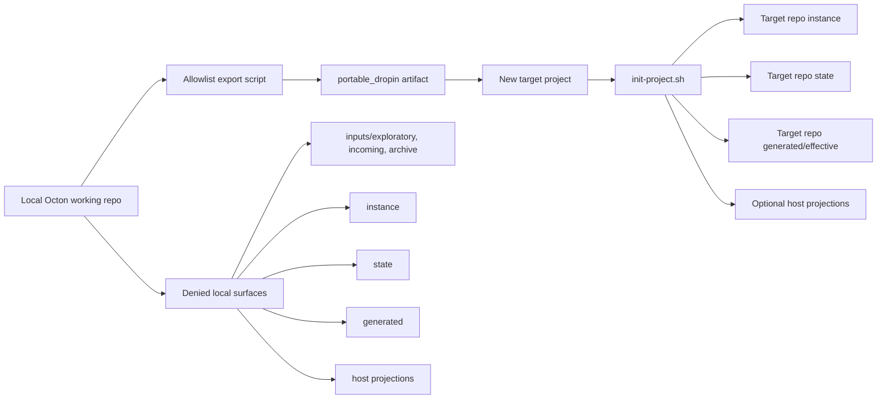

# SRC-003: Portable public-distribution boundary review

## User Message

Act as a principal Octon release-boundary and public-distribution architect.

Goal:
Define a public GitHub publishing boundary for Octon that includes only the portable, drop-in parts needed to install or bootstrap Octon into any project. Exclude project-specific, proprietary, private, sensitive, generated, evidence, runtime-state, or local host-projection material.

Core intent:
The public repository/artifact should be a portable Octon distribution, not a full clone of this local working repository.

Context to inspect:
- `.octon/octon.yml`, especially `bootstrap_core`, `repo_snapshot`, `pack_bundle`, and generated commit defaults
- `.octon/README.md`
- `.octon/framework/scaffolding/runtime/**`
- `.octon/framework/scaffolding/runtime/templates/octon/**`
- `.octon/framework/cognition/_meta/architecture/inputs/README.md`
- `.octon/framework/constitution/contracts/retention/evidence-disclosure-tiers-v1.yml`
- `.gitignore`
- `.github/workflows/release-please.yml`
- Host projection roots: `.codex/**`, `.claude/**`, `.cursor/**`

Questions to answer:
1. What is the minimal portable Octon distribution needed to drop into a new project and get running?
2. Which current repo surfaces are portable product/framework material?
3. Which current repo surfaces are project-specific, private, proprietary-risk, or publication-restricted?
4. Should the existing `bootstrap_core`, `repo_snapshot`, or `pack_bundle` profile be reused, narrowed, or replaced with a new `public_distribution` / `portable_dropin` profile?
5. What Git, CI, `.gitignore`, export-script, or publication-gate changes are needed to prevent accidental public publication of local/project-specific material?

Strict exclusions unless explicitly justified:
- `.octon/inputs/exploratory/**`
- `.octon/inputs/additive/.incoming/**`
- `.octon/inputs/additive/.archive/**`
- repo-local `.octon/instance/**`, except portable templates or minimal default manifests
- `.octon/state/**`
- `.octon/generated/**`, except intentionally rebuilt public distribution artifacts if source-safe
- `.codex/**`, `.claude/**`, `.cursor/**` local host projections, except reviewed templates
- local evidence, logs, traces, receipts, run state, proposal lineage, scratchpads, and generated read models

Deliverables:
- Concise public-publishing verdict
- Proposed public distribution allowlist
- Explicit denylist with rationale
- Boundary model showing source repo -> public export artifact
- Recommended profile name and semantics
- Required validation gates before public push
- Recommended `.gitignore`, CI, and pre-push controls
- Open questions and assumptions

Constraints:
- Start read-only.
- Do not delete, rewrite history, publish, push, or change `.gitignore` without explicit approval.
- Do not inspect human-led ideation content beyond filenames/metadata unless explicitly authorized.
- Do not assume “non-authoritative” means “safe to publish.”
- Do not assume “portable framework” includes this repo’s local `instance`, `state`, `inputs`, or `generated` material.

## Assistant Message 1 (commentary)

I’ll keep this read-only and treat the local repo as a source workspace, not the target artifact. I’m going to inspect the manifest profiles, scaffolding templates, and publication automation to define a narrow export boundary rather than infer one from the current tracked tree.

## Assistant Message 2 (commentary)

The current manifest profiles are useful orientation, but `repo_snapshot` intentionally includes repo `instance/**`, and generated defaults still commit runtime-facing outputs. That is too broad for a public drop-in distribution. I’m now narrowing onto scaffolding/template surfaces that are meant to create a fresh instance.

## Assistant Message 3 (commentary)

The scaffold template itself includes starter `state/**`, `generated/**`, and `inputs/exploratory/**` directories, but these are empty/default convention files, not this repo’s local state. That distinction matters: templates can be public, instantiated local state should not be.

## Assistant Message 4 (commentary)

The canonical bootstrap assets already describe a drop-in flow: copy a base `.octon` harness, then run `init-project.sh` to generate repo-specific bootstrap files and objective contracts. A public distribution should ship that mechanism and neutral templates, not this repository’s instantiated `instance/**`.

## Assistant Message 5 (commentary)

One important finding: the `templates/octon/manifest.json` declares a complete base harness including `README.md`, `AGENTS.md`, `octon.yml`, and `framework/manifest.yml`, but the current file inventory I saw under that template is partial. I’ll verify whether the template is complete or just a legacy starter bundle.

## Assistant Message 6 (commentary)

The current `templates/octon` manifest is not a complete drop-in source by itself: required files named by the manifest are absent there. That points to a new curated export process: assemble from `framework/**` plus selected neutral bootstrap/template files, not simply copy `templates/octon/**` wholesale.

## Assistant Message 7 (final_answer)

**Verdict**

Partly true in intent, but not safe as implemented today: this repository should not be pushed publicly as-is. The public Octon artifact should be a curated export, not a clone of this working repo.

The closest existing profile is `bootstrap_core`, but I would not reuse it unchanged. It includes `.octon/framework/**`, which is directionally right, but it also points at a live repo `instance/manifest.yml` and does not give a complete neutral drop-in template. `repo_snapshot` is too broad for public distribution, and `pack_bundle` is for extension transfer, not base Octon installation.

Use a new profile: `portable_dropin`.

**Minimal Portable Distribution**

The drop-in distribution should contain only:

| Include | Why |
|---|---|
| `.octon/octon.yml` or a sanitized distribution manifest | Defines Octon profile semantics without local repo state |
| `.octon/README.md` | Portable orientation docs |
| `.octon/framework/**` | Product/framework authority and portable runtime/scaffolding source |
| `.octon/framework/scaffolding/runtime/bootstrap/**` | First-run bootstrap entrypoints |
| `.octon/framework/scaffolding/runtime/templates/**` | Neutral templates for generating repo-local instance/state/generated surfaces |
| Minimal root adapter templates: `AGENTS.md`, `CLAUDE.md`, `.octon/AGENTS.md` | Install-time ingress adapters only |
| Minimal default instance templates | Needed to create a new repo’s `instance/**`, but should come from templates, not this repo’s live instance |

Important gap: [templates/octon/manifest.json](/Users/jamesryancooper/Projects/octon/.octon/framework/scaffolding/runtime/templates/octon/manifest.json:1) declares required base files such as `README.md`, `AGENTS.md`, `octon.yml`, and `framework/manifest.yml`, but those files are not actually present under that template root. That template must be repaired or replaced before it can be the public distribution source.

**Explicit Denylist**

| Path | Rationale |
|---|---|
| `.octon/inputs/exploratory/**` | Human-led notes, plans, proposals, reports, ideation; not safe by being non-authoritative |
| `.octon/inputs/additive/.incoming/**` | Raw intake; likely highest ambiguity and sensitivity risk |
| `.octon/inputs/additive/.archive/**` | Retained intake/history; not public by default |
| `.octon/inputs/additive/extensions/**` | Not base distribution; export only as separately reviewed packs |
| `.octon/instance/**` | Repo-specific durable authority; create from template in target repos |
| `.octon/state/**` | Runtime/control/evidence/continuity state |
| `.octon/generated/**` | Derived effective outputs/read models; rebuild in target |
| `.codex/**`, `.claude/**`, `.cursor/**` | Local host projections/settings; publish templates only, not projections |
| `.github/workflows/release-please.yml` as-is | Current workflow stages generated, evidence, and control paths; unsafe for public distro |
| Logs, traces, receipts, reports, archives, local evidence | Publication-restricted unless explicitly redacted/classified |

**Evidence**

| Evidence | Interpretation |
|---|---|
| [octon.yml](/Users/jamesryancooper/Projects/octon/.octon/octon.yml:33) | `bootstrap_core` includes framework plus only `instance/manifest.yml`; `repo_snapshot` includes local `instance/**`; `pack_bundle` targets extension exports |
| [octon.yml](/Users/jamesryancooper/Projects/octon/.octon/octon.yml:60) | Generated/effective and raw-input freshness defaults are operational concerns, not public boundary controls |
| [README.md](/Users/jamesryancooper/Projects/octon/.octon/README.md:29) | Defines `framework` as portable core, `instance` as repo-specific authority, `state` as mutable truth/evidence, `generated` as rebuildable, `inputs` as non-authoritative |
| [inputs README](/Users/jamesryancooper/Projects/octon/.octon/framework/cognition/_meta/architecture/inputs/README.md:3) | Inputs are raw source material and never runtime, policy, evidence, publication, or host-projection authority |
| [evidence tiers](/Users/jamesryancooper/Projects/octon/.octon/framework/constitution/contracts/retention/evidence-disclosure-tiers-v1.yml:16) | Raw/private evidence is not publishable by default; generated read models cannot become evidence |
| [runtime bootstrap README](/Users/jamesryancooper/Projects/octon/.octon/framework/scaffolding/runtime/bootstrap/README.md:1) | Bootstrap assets are the right portable install machinery |
| [init-project.sh](/Users/jamesryancooper/Projects/octon/.octon/framework/scaffolding/runtime/bootstrap/init-project.sh:96) | Bootstrap writes new repo-local `instance/**` artifacts, confirming they should be generated per target repo |
| [release-please.yml](/Users/jamesryancooper/Projects/octon/.github/workflows/release-please.yml:100) | Current release workflow explicitly stages generated/evidence/control paths |
| [.gitignore](/Users/jamesryancooper/Projects/octon/.gitignore:1) | Current ignore rules still allow many Octon runtime/evidence surfaces to be tracked |

**Boundary Model**

**Recommended Profile**

Use `portable_dropin`.

Semantics:

- allowlist-driven export only
- no live repo `instance/**`
- no live `state/**`
- no live `generated/**`
- no raw `inputs/**`
- no host projections
- creates target-local authority/state/generated outputs only after install
- optional extension packs are separate reviewed artifacts, not part of the base profile

Keep `bootstrap_core` as an internal bootstrap source profile or narrow it to stop copying live `instance/manifest.yml`. Do not use `repo_snapshot` or `pack_bundle` for the public base artifact.

**Required Gates**

Highest impact controls:

1. Add a `portable_dropin` export script that copies only allowlisted paths into a clean temp directory.
2. Add a denylist validator that fails if the artifact contains `.octon/inputs`, `.octon/instance`, `.octon/state`, `.octon/generated`, `.codex`, `.claude`, or `.cursor`, except approved templates under `.octon/framework/scaffolding/runtime/templates/**`.
3. Add a template completeness check for `templates/octon/manifest.json`.
4. Add secret/sensitive-content scanning on the export artifact and public branch.
5. Replace or disable the current release workflow for public distribution; it currently publishes generated/evidence/control paths.
6. Add a pre-push hook or CI job that blocks public remotes from receiving denied paths.
7. Use `.gitattributes export-ignore` for local-only roots if archive-based distribution is used.
8. Treat `.gitignore` as hygiene only, not the security boundary.

**Recommended Wording**

“`.octon/framework/**` plus reviewed bootstrap templates form the portable Octon distribution source. A public `portable_dropin` artifact is produced by allowlist export. Repository-local `inputs/**`, `instance/**`, `state/**`, `generated/**`, evidence, and host projections are installation/runtime material and are excluded unless separately classified and intentionally published.”

**Open Questions**

- Should public Octon be a separate repository, or a generated release artifact from this repo?
- Which parts of `.octon/framework/**` need license/provenance review before publication?
- Are any additive extension packs intended to ship as first-party public packs?
- Should the public artifact include generated starter files, or should all `state/**` and `generated/**` be created only during first init?
- Should `bootstrap_core` be deprecated in favor of `portable_dropin`, or retained as an internal profile?

