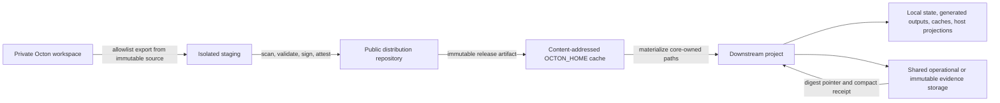

# SRC-010: Hosted footprint and core update architecture

## User Message

# Octon Hosted-Repository Footprint and Core Update Architecture

Act as a principal Octon architecture, information-boundary, developer-experience, and release-engineering reviewer.

## Objective

Define the repository-storage and core-update model for Octon itself and for every project that adopts Octon.

The intended outcome is an easily portable and updateable Octon core that:

- speeds local development;
- avoids committing large volumes of generated evidence, runtime state, and derived artifacts;
- keeps sensitive or project-local material off public surfaces by default;
- preserves reproducibility, collaboration, governance, and required auditability;
- allows Octon core updates without overwriting or destabilizing project-specific authority or local material.

Evaluate these goals critically. Do not assume that every Octon project should use the same Git-tracking policy in every collaboration or hosting scenario.

## Architectural Surfaces

Keep these four surfaces distinct:

1. **Private Octon workspace repository**

   The full repository used to develop and self-host Octon. It may contain framework source, repo-specific instance authority, inputs, state, evidence, generated outputs, and development residue under an intentionally private policy.

2. **Public Octon distribution repository**

   A separate distribution mirror populated only from a generated, allowlist-based `portable_dropin` artifact. It must never be a clone, mirror, subtree split, or history projection of the private workspace.

3. **Downstream Octon project repository**

   A project-specific repository that consumes Octon. It owns its own instance authority and may be public or private.

4. **Machine-local or external operational storage**

   Local runtime state, generated outputs, evidence, caches, logs, host projections, and any external immutable evidence or artifact storage.

Do not collapse these surfaces into one repository policy.

## Established Public-Distribution Direction

Preserve these decisions unless strong repository evidence demonstrates a conflict:

- Public Octon lives in a separate distribution repository.
- That repository is populated only by a validated `portable_dropin` artifact.
- The public artifact contains publication-cleared framework and neutral bootstrap material only.
- Local instance authority, inputs, state, generated output, evidence, host projections, additive packs, and residue are excluded by default.
- Target initialization creates target-local authority, state, evidence roots, generated outputs, and host projections.
- Core updates must not overwrite target-local material.

## Hypothesis to Evaluate

A major purpose of the distribution model is to improve development speed by avoiding routine commits and pushes of generated evidence, generated-effective outputs, run state, logs, and similar high-churn artifacts.

Evaluate whether the following should become Octon’s default posture:

> Octon projects keep operational evidence, runtime state, generated outputs, caches, logs, and host projections local by default. Hosted repositories receive only durable authored material and the minimum intentionally publishable receipts or artifacts required for collaboration, CI, governance, release, or recovery.

Determine where this is correct, where exceptions are necessary, and what must remain reproducible or shareable.

## Questions to Resolve

1. Should downstream projects commit `.octon/framework/**`, or should they commit only a version lock and retrieve a verified `portable_dropin` artifact?

2. Compare at least these update models:

   - vendored, committed framework snapshot;
   - version lock plus local artifact cache;
   - package or release-asset retrieval;
   - Git submodule or subtree;
   - a justified hybrid.

3. Recommend the model that best balances:

   - fast local development;
   - deterministic installation;
   - offline or degraded-network operation;
   - reviewable framework upgrades;
   - supply-chain integrity;
   - compatibility checks;
   - simple rollback;
   - low repository churn.

4. For each `.octon` class root, determine what a downstream project should:

   - commit by default;
   - commit only after explicit classification;
   - keep local by default;
   - store externally with a retained pointer;
   - regenerate on demand;
   - prohibit from public publication.

5. Do not treat `.octon/inputs/**` as one homogeneous class. Decide separately for:

   - raw additive intake;
   - intake archives;
   - normalized extension source;
   - exploratory ideation;
   - proposals and proposal lineage;
   - advisory plans;
   - syntheses and reports.

6. Define the minimum evidence that must reach a hosted repository for PR review, CI claims, release authorization, collaboration, recovery, and governance. Distinguish this from private raw evidence and transport-only CI artifacts.

7. Determine the correct self-hosting policy for Octon:

   - what the private Octon workspace may track;
   - what the public Octon distribution repository may contain;
   - whether Octon’s own development project should follow the same downstream-project defaults or an explicitly broader private policy.

8. Define how an Octon project upgrades its core without affecting:

   - `.octon/instance/**`;
   - `.octon/inputs/**`;
   - `.octon/state/**`;
   - `.octon/generated/**`;
   - `.codex/**`, `.claude/**`, and `.cursor/**`;
   - project-owned files outside `.octon/**`.

9. Specify upgrade requirements for version resolution, compatibility checks, dry-run previews, file ownership, checksums, provenance, migrations, conflict detection, rollback, and interrupted-update recovery.

10. Resolve the prior public-distribution open questions where architectural evidence supports a recommendation. Clearly identify any decision that still requires sponsor, maintainer, security, or legal input.

## Required Classification Matrix

For each relevant repository surface, provide:

| Path or surface | Architectural role | Default Git posture | Public/private posture | Exceptions | Update ownership |
|---|---|---|---|---|---|

Use these Git-posture classifications:

- `hosted-required`
- `hosted-optional-after-classification`
- `local-by-default`
- `external-with-pointer`
- `generated-on-demand`
- `prohibited-from-public-distribution`

At minimum, classify:

- `.octon/octon.yml`
- `.octon/framework/**`
- `.octon/instance/**`
- every major `.octon/inputs/**` subtype
- `.octon/state/control/**`
- `.octon/state/evidence/**`
- `.octon/state/continuity/**`
- `.octon/generated/effective/**`
- `.octon/generated/cognition/**`
- `.octon/generated/proposals/**`
- `.octon/AGENTS.md`
- `.codex/**`, `.claude/**`, and `.cursor/**`
- root adapters, logs, caches, reports, archives, and release artifacts

## Repository Evidence

Review relevant current evidence, including:

- `.octon/octon.yml`
- `.octon/README.md`
- `.octon/framework/cognition/_meta/architecture/shared-foundation.md`
- `.octon/framework/cognition/_meta/architecture/inputs/README.md`
- `.octon/framework/constitution/contracts/retention/evidence-disclosure-tiers-v1.yml`
- `.octon/framework/orchestration/runtime/_ops/scripts/export-harness.sh`
- `.octon/framework/scaffolding/runtime/**`
- `.octon/framework/capabilities/_ops/scripts/publish-host-projections.sh`
- `.gitignore`
- `.github/workflows/release-please.yml`

Inspect other paths only as needed to verify tracking, dependency, update, or publication behavior.

## Deliverables

1. A concise verdict on the local-first evidence and generated-output hypothesis.
2. A recommended topology for the four architectural surfaces.
3. The required repository-surface classification matrix.
4. A recommended downstream framework installation and update model.
5. A distinct policy for the private self-hosting Octon workspace.
6. A policy for the public Octon distribution repository.
7. A policy for downstream public and private project repositories.
8. A minimum hosted-evidence and CI-artifact policy.
9. Core update invariants and rollback behavior.
10. Required changes to `portable_dropin`, initialization, Git policy, CI, and validation.
11. A migration path from the current high-churn tracking model.
12. Answers to prior open questions, with remaining sponsor decisions clearly identified.
13. Recommended normative policy wording.

Label conclusions as:

- **Confirmed evidence**
- **Sponsor decision**
- **Recommendation**
- **Assumption**
- **Open question**

## Constraints

- Begin read-only.
- Do not modify files or repository configuration.
- Do not inspect human-led ideation content.
- Do not assume that `inputs/**` is safe or appropriate to host.
- Do not assume that all hosted repositories are public.
- Do not equate non-authority with publication safety.
- Do not eliminate evidence needed for collaboration, governance, release, or recovery merely to reduce Git churn.
- Do not recommend Git submodules, vendoring, or remote package retrieval without evaluating their operational and supply-chain tradeoffs.
- Do not let a core update overwrite project-local authority, inputs, state, generated outputs, evidence, or host projections.
- Do not use workspace Git history as the public distribution mechanism.

The final recommendation should optimize for an updateable Octon core, fast local development, bounded hosted-repository content, reproducible installations, and clear separation between portable framework ownership and project-local ownership.

## Assistant Message 1 (commentary)

I’m using the `audit-domain-architecture` skill again because this request crosses class-root ownership, storage, update, and release boundaries. I’ll verify the current tracking and update machinery first, then evaluate the five delivery models and derive separate policies for the private workspace, public distribution, and downstream repositories without reading ideation content or changing files.

## Assistant Message 2 (commentary)

The audit will run in observed, deep-evidence mode across `.octon/**`, Git policy, and release tooling. The skill normally writes evidence bundles, but your read-only constraint overrides that output behavior; I’ll keep the findings and coverage ledger in the response only.

## Assistant Message 3 (commentary)

I’m treating this as a bounded, read-only architecture audit. I’ll verify the current tracking, export, bootstrap, evidence, and update mechanisms, then separate observed repository behavior from the target policy and recommendations.

## Assistant Message 4 (commentary)

The repository already encodes the right conceptual split between portable framework, instance authority, mutable state, derived outputs, and non-authoritative inputs. The key question is operational: whether installation, Git defaults, evidence retention, and upgrades actually preserve that split, so I’m now tracing those mechanisms rather than inferring policy from directory names.

## Assistant Message 5 (commentary)

The current adoption contract already says “install portable framework only, initialize instance locally, rebuild generated locally,” which aligns with the target model. However, I have not found a core artifact lock, verified resolver, or transactional core-upgrade command; the existing migration workflow addresses an older layout contract, not ongoing framework version updates.

## Assistant Message 6 (commentary)

A key counterpoint to “local by default” is collaboration: mutable control and raw evidence cannot simply disappear from shared systems when multiple operators, CI, or regulated retention depend on them. The better rule is Git-locality, not machine-only locality: keep high-churn material out of Git, but place required shared state/evidence in an access-controlled operational or immutable store and retain compact, publishable pointers and receipts.

## Assistant Message 7 (commentary)

The update model also exposes an ownership issue beyond Git: downstream core must be immutable, yet current initialization can write project-specific adapter enablement inside `framework/**`, and normal Rust builds place large caches beneath the framework tree. Those write paths need to move to `instance/**` or `$OCTON_HOME` before a shared, replaceable core can be enforced.

## Assistant Message 8 (commentary)

The recommendation is converging on a hybrid: exact lock plus signed release artifact plus content-addressed `$OCTON_HOME` cache as the downstream default, with an explicit vendored mode only for air-gapped or policy-constrained projects. This preserves deterministic rollback and offline reuse without making every project carry Octon’s framework history or high-volume operational artifacts.

## Assistant Message 9 (final_answer)

**Architectural Verdict**

**Partly aligned.** Octon’s class-root architecture supports the intended model: portable framework, repository-owned authority, mutable state, retained evidence, generated outputs, and inputs are structurally distinct. The repository’s current export, bootstrap, Git, release, and update mechanisms do not yet enforce that model.

**Recommendation:** The local-first hypothesis is correct as a **Git default**, but not as a universal machine-only rule:

> Keep high-churn operational material out of Git by default. Retain shared or mandatory state and evidence in controlled operational or immutable storage, with compact classified receipts and pointers in Git.

Authority placement and publication safety remain independent classifications.

**Confirmed Evidence**

- The canonical architecture defines `framework/**` as portable core, `instance/**` as repository authority, `state/**` as operational truth/evidence, and `generated/**` as rebuildable output. Framework updates are intended to preserve instance content. [shared-foundation.md](/Users/jamesryancooper/Projects/octon/.octon/framework/cognition/_meta/architecture/shared-foundation.md:30)
- External adoption already requires installing portable framework, initializing repository-specific authority, and rebuilding generated output locally. [external-project-adoption-v1.md](/Users/jamesryancooper/Projects/octon/.octon/framework/engine/runtime/spec/external-project-adoption-v1.md:7)
- Current profiles do not define `portable_dropin`; current generated defaults require committing several generated families. [octon.yml](/Users/jamesryancooper/Projects/octon/.octon/octon.yml:33)
- Current HEAD contains approximately 40,112 tracked state files totaling 398 MiB, 1,871 generated files, and 5,748 input files. This is a self-host workspace posture, not a suitable downstream default.
- Private raw evidence is already intended for pointer or external immutable storage, while compact claim-bearing evidence may be Git-hosted. [evidence-disclosure-tiers-v1.yml](/Users/jamesryancooper/Projects/octon/.octon/framework/constitution/contracts/retention/evidence-disclosure-tiers-v1.yml:16)
- The exporter recursively copies the working tree and invokes publication operations before export. It could copy ignored local build material, including the current multi-gigabyte Rust target directory. [export-harness.sh](/Users/jamesryancooper/Projects/octon/.octon/framework/orchestration/runtime/_ops/scripts/export-harness.sh:91)
- Initialization can write target-specific adapter configuration into `framework/**`, conflicting with replaceable-core ownership. [init-project.sh](/Users/jamesryancooper/Projects/octon/.octon/framework/scaffolding/runtime/bootstrap/init-project.sh:105)
- The starter-template manifest names required files that are currently absent from the template tree. [manifest.json](/Users/jamesryancooper/Projects/octon/.octon/framework/scaffolding/runtime/templates/octon/manifest.json:7)

**Target Topology**

**Sponsor decision:** The public repository remains a synthetic distribution mirror. Workspace Git history, subtree history, and full-tree mirroring never cross the boundary.

**Framework Delivery Model**

| Model | Assessment | Disposition |
|---|---|---|
| Vendored committed framework | Best offline behavior and Git rollback; large diffs, repository churn, easy local modification | Supported exception |
| Exact lock plus local cache | Low churn, deterministic, fast after first retrieval; needs a trusted bootstrapper and cache policy | Default mechanism |
| Release asset or package retrieval | Good immutable transport when signed and digest-pinned; network and registry dependency | Default transport |
| Git submodule | Exact commit, but poor bootstrap/authentication UX and couples projects to distribution Git topology | Reject as default |
| Git subtree | Copies history and files, creates upgrade churn, and weakens the no-history-projection boundary | Reject |
| Hybrid | Lock + signed release asset + content-addressed cache, with vendored or internal-mirror mode | **Recommended** |

Downstream repositories should normally commit `.octon/core.lock.yml`, not `.octon/framework/**`. The private workspace and public distribution repository remain exceptions because framework source is their product.

**Classification Matrix**

Defaults below apply to downstream repositories.

| Path or surface | Architectural role | Default Git posture | Public/private posture | Exceptions | Update ownership |
|---|---|---|---|---|---|
| `.octon/octon.yml` | Core root manifest | `hosted-required` | Public-safe after framework review | Project customizations prohibited | Core updater |
| Proposed `.octon/core.lock.yml` | Exact runtime-consumed core resolution | `hosted-required` | Public-safe; no credentials | None | Core resolver |
| `.octon/framework/**` | Portable authored core | `local-by-default` | Hosted in workspace/distribution; cleared framework only | Vendored mode | Octon core |
| `.octon/instance/**` | Repository-specific authored authority | `hosted-required` | Public projects require clearance; secrets use references | External authority store by policy | Project |
| `inputs/additive/.incoming/**` | Raw intake | `local-by-default` | `prohibited-from-public-distribution` | Sanitized intake metadata only | Project |
| `inputs/additive/.archive/**` | Historical intake | `external-with-pointer` | `prohibited-from-public-distribution` | Small cleared lineage | Project/evidence owner |
| `inputs/additive/extensions/**` | Normalized extension source | `hosted-optional-after-classification` | No base-distribution packs | External signed pack plus lock | Project/pack owner |
| `inputs/exploratory/ideation/**` | Human-led exploration | `local-by-default` | `prohibited-from-public-distribution` by default | Explicit human classification | Human owner |
| `inputs/exploratory/proposals/**` | Proposal and lineage input | `hosted-optional-after-classification` | Excluded from public distribution | Active collaborative packets | Project |
| `inputs/exploratory/plans/**` | Advisory planning | `hosted-optional-after-classification` | Cleared downstream publication only | None; never authority by location | Project |
| `inputs/exploratory/syntheses/**` | Research synthesis | `hosted-optional-after-classification` | Cleared downstream publication only | Raw sources external | Project |
| `inputs/exploratory/reports/**` | Non-authoritative reports | `local-by-default` | Distribution-prohibited | Sanitized compact report | Project |
| `.octon/state/control/**` | Mutable operational truth | `local-by-default` | `prohibited-from-public-distribution` | Shared external coordinator for multi-operator work | Runtime |
| Private `.octon/state/evidence/**` | Raw retained evidence | `external-with-pointer` | `prohibited-from-public-distribution` | Inline only when explicitly safe and required | Evidence system |
| Publishable evidence receipts | Compact claim evidence | `hosted-required` | Public only after disclosure validation | Required only when a hosted claim depends on it | Validator/disclosure owner |
| `.octon/state/continuity/**` | Resumption and handoff state | `local-by-default` | Distribution-prohibited | External shared handoff or compact hosted summary | Runtime/project |
| `.octon/generated/effective/**` | Runtime-facing derived handles | `generated-on-demand` | Live outputs distribution-prohibited | Ephemeral cache allowed | Canonical publisher |
| `.octon/generated/cognition/**` | Derived read models | `generated-on-demand` | Live outputs distribution-prohibited | Reviewed golden fixtures belong in framework | Generator |
| `.octon/generated/proposals/**` | Proposal discovery projection | `generated-on-demand` | Distribution-prohibited | None | Generator |
| `.octon/AGENTS.md`, root adapters | Required ingress projections | `hosted-required` | Distribution contains neutral templates only | Must remain thin/parity copies | Initializer |
| `.codex/**`, `.claude/**`, `.cursor/**` | Host projections | `generated-on-demand` | Live roots distribution-prohibited | Reviewed templates under framework | Projection publisher |
| Logs, caches, temporary files | Operational residue | `local-by-default` | `prohibited-from-public-distribution` | None | Producing tool |
| Local reports and archives | Retained or disposable residue | `external-with-pointer` | Distribution-prohibited | Classified compact summaries | Evidence owner |
| Release archives and binaries | Distribution payload | `external-with-pointer` | Public release assets allowed | Internal mirror or sealed offline bundle | Release pipeline |
| Checksums, SBOM, provenance, signatures | Release verification metadata | `hosted-required` | Public and immutable | No sensitive build paths | Release pipeline |

**`portable_dropin` Specification**

**Recommendation:** The profile should allow only publication-cleared `.octon/octon.yml`, `.octon/framework/**`, neutral bootstrappers such as `octonw`/`octonw.cmd`, license and notice material, an install manifest, per-file hashes, SBOM, provenance, signatures, and reviewed distribution-only CI metadata marked `installable: false`.

It must deny `.octon/{instance,inputs,state,generated}/**`, live host projections, additive packs, logs, evidence, reports, archives, caches, local build output, and `.git/**`. Export must enumerate files from an immutable source tree into empty staging, never use recursive working-tree copying, and never mutate source state.

Existing profiles remain insufficient:

- `bootstrap_core` includes a live instance manifest and lacks publication/supply-chain semantics.
- `repo_snapshot` includes repository authority and enabled packs and invokes publication.
- `pack_bundle` contains no core.
- `full_fidelity` explicitly requires workspace history.

**Core Update Contract**

1. Resolve an exact version under project-owned update policy; mutable tags are never sufficient.
2. Fetch or reuse a content-addressed artifact under `$OCTON_HOME`, following the existing host-scoped storage precedent. [provision-host-tools.md](/Users/jamesryancooper/Projects/octon/.octon/framework/capabilities/runtime/commands/provision-host-tools.md:44)
3. Verify archive digest, file manifest, signature, provenance, license ledger, platform, and supported instance schemas.
4. Produce a dry-run ownership diff; fail on local edits or unexpected files in core-owned paths.
5. Stage on the target filesystem, record an interruption journal, validate against project authority, then replace only `.octon/framework/**`, `.octon/octon.yml`, and the lock. Write the lock last.
6. If an instance migration is required, emit a separate migration plan or patch and stop. Core update never silently edits project-owned roots.
7. Treat existing generated and host projections as stale through digest mismatch. Rebuild them only through an explicit reconciliation command.

Rollback restores the previous cached artifact, root manifest, and lock. Interrupted runs must deterministically resume or roll back. Explicit rollback may bypass monotonic-version protection; ordinary updates may not.

**Minimum Hosted Evidence**

| Purpose | Git-hosted minimum | External or CI-only material |
|---|---|---|
| PR and collaboration | Change ID, exact commit, scope, validation summary, evidence digests, rollback handle | Full logs, traces, screenshots |
| CI claim | Commit/workflow identity, verdict, check summary, artifact digests, run locator and retention | Raw test output, coverage bodies, build caches |
| Release | Authorization, signed artifact manifest, SBOM, provenance, compatibility result, rollback version | Binaries and extensive build logs |
| Recovery | Current and previous core locks, update receipt, immutable backup pointers | Transaction journal and raw snapshots |
| Governance | Authored ADR/policy plus required approval, exception, or revocation receipts | Raw deliberation and private context |

CI uploads are transport artifacts, not retained evidence until indexed into a canonical evidence class. [evidence-store-v1.md](/Users/jamesryancooper/Projects/octon/.octon/framework/engine/runtime/spec/evidence-store-v1.md:52)

**Critical Findings And Acceptance Criteria**

| ID | Severity | Finding and required acceptance |
|---|---|---|
| `HRA-001` | High | Git defaults are repository-role unaware. Add role-specific storage policy and prove downstream fixtures do not track live state/generated/host roots. |
| `HRA-002` | High | No exact core lock, trusted resolver, or transactional update path exists. Pass install, offline-cache, upgrade, downgrade-denial, rollback, and interruption tests. |
| `HRA-003` | Critical | Export copies the working tree and may include ignored residue. Replace it with immutable allowlist enumeration and negative tests for ignored, symlink-escape, and denylisted content. |
| `HRA-004` | High | Bootstrap templates are incomplete and initialization writes project configuration under framework. A clean empty-repo initialization must produce complete neutral authority without framework mutation. |
| `HRA-005` | High | Current binary publication does not emit the required checksum, signature, SBOM, or provenance set. Every released asset must be verifiable offline from retained metadata. |
| `HRA-006` | High | External immutable evidence is contracted, but no definitive production backend was found. Shared/regulated profiles require a tested durable backend before adopting Git-local defaults. |
| `HRA-007` | Medium | Host projections are currently tracked and derive from effective and extension material. Downstream defaults must generate locally and scan any explicitly hosted projection. |
| `HRA-008` | Release blocker | Framework-wide license, provenance, sensitivity, and publication clearance is incomplete; no root license/notice surface was found. Publication requires a zero-uncleared-file ledger, without implying a legal conclusion. |

**Roadmap**

1. **P0, policy:** Ratify repository roles, core/project ownership, evidence minima, artifact trust model, and `portable_dropin`.
2. **P0, release boundary:** Implement immutable allowlist export, full framework clearance, deterministic manifest/SBOM/signing, and public-tree equality gates.
3. **P1, adoption/update:** Add lock schema, wrappers, cache resolver, compatibility preflight, transaction recovery, and complete neutral initialization.
4. **P1, storage:** Add role-specific `.gitignore` templates, pre-commit/CI path gates, external evidence backend, compact receipt validation, and workspace public-remote pre-push denial.
5. **P2, migration:** Stop adding new live artifacts to Git; classify existing state/generated/inputs; externalize raw evidence; retain compact receipts; remove current tracked residue in scoped forward commits. History rewriting remains a separate security decision.
6. **P2, pilot:** Test public/private downstream repositories, clean clone, offline restore, framework upgrade, stale-output denial, rollback, and public-repository regeneration.

**Keep As-Is**

Retain the five class roots, deny-blind-copy adoption contract, evidence disclosure tiers, zero-pack base distribution, target-local initialization intent, and `bootstrap_core` as an internal implementation profile. The private self-host workspace may use a broader classified policy, but should not define downstream defaults.

**Recommended Normative Wording**

> Octon repositories SHALL host durable project authority, exact core-resolution locks, and only intentionally classified publishable evidence. Operational control, raw evidence, generated outputs, caches, logs, and host projections SHALL remain local or externally retained by default. Downstream core SHALL be materialized from a signed, digest-pinned `portable_dropin` artifact and treated as immutable core-owned content. Core updates SHALL modify only core-owned paths. The public distribution repository SHALL be generated exclusively from the validated allowlist artifact and never from workspace Git history.

**Open Questions**

- **Open question:** Public repository identity, signing trust root, credential ownership, and release authorization.
- **Open question:** External state/evidence provider, retention periods, access control, and disaster recovery.
- **Recommendation:** Ship the complete publication-cleared framework in v1; defer runtime/developer package splitting until a framework dependency closure is proven.
- **Open question:** Required vendored/offline support period and supported internal-mirror formats.
- **Open question:** Whether existing hosted workspace history needs security review based on its actual visibility and prior publication.
- **Open question:** Cross-platform transaction semantics and support level for Windows bootstrapping.

This was an observed-mode, read-only audit. Human-led ideation was not inspected, no validators with mutation risk were run, no audit receipts were written, and no tracked or staged files changed. The review converged; implementation readiness requires closing `HRA-001` through `HRA-005` and `HRA-008`, plus `HRA-006` for collaboration profiles that require durable shared evidence.

