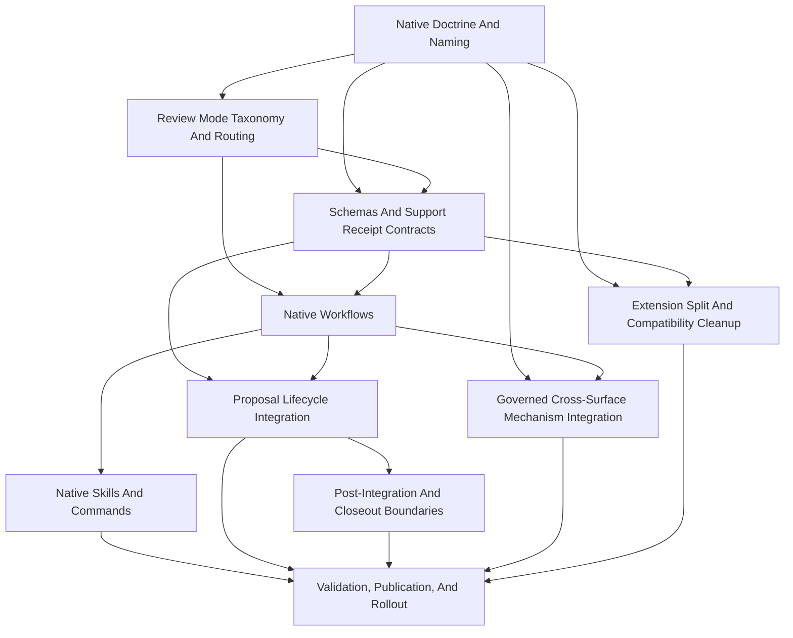

# Packet Sequence

## Dependency Graph

## Execution Order

1. `architectural-review-native-doctrine-and-naming`: Native Doctrine And
   Naming.
2. `architectural-review-routing-taxonomy`: Review Mode Taxonomy And Routing.
3. `architectural-review-schemas-and-receipts`: Schemas And Support Receipt
   Contracts.
4. `architectural-review-native-workflows`: Native Workflows.
5. `architectural-review-native-skills-commands`: Native Skills And Commands.
6. `architectural-review-proposal-lifecycle-integration`: Proposal Lifecycle
   Integration.
7. `architectural-review-post-integration-boundaries`: Post-Integration And
   Closeout Boundaries.
8. `architectural-review-governed-mechanism-integration`: Governed
   Cross-Surface Mechanism Integration.
9. `architectural-review-extension-split-cleanup`: Extension Split And
   Compatibility Cleanup.
10. `architectural-review-validation-publication-rollout`: Validation,
    Publication, And Rollout.

## Validation Barriers

- Phase 1 cannot close until strict receipt schemas and semantic validators are
  specified.
- Phase 2 cannot start lifecycle gate wiring until strict support receipt
  validators reject placeholder, stale, missing-evidence, omitted-validator,
  and ambiguous pass cases.
- Phase 4 cannot close until generated registries and projections are refreshed
  through scripts and validated.
