# Canonical Authority and Failure Model

This document resolves the authorization and runtime-failure questions in
Revision 2. It is proposal lineage, not authority. It does not issue a grant,
capability, approval, delegation, or effect.

Evidence labels used below are:

- **[Declared]**: a current contract or specification states the claim;
- **[Static]**: the claim follows from inspected source at the recorded
  worktree;
- **[Dynamic]**: the claim was exercised by the focused test command recorded
  in the evidence appendix;
- **[Inference]**: the claim is an architectural conclusion or a predicted
  failure mode that has not been fault-injected.

Inference is not upgraded to runtime fact. In particular, the concurrency and
crash conclusions below remain implementation risks until the required fault
tests pass.

## 1. Current Authorization Model: Precise Findings

### 1.1 What the canonical typed path currently does

**[Declared]** The execution contract names
`authorize_execution(ExecutionRequest) -> GrantBundle` as the engine-owned
authorization boundary. It correctly says that `GrantBundle` is a decision
product, not a consumable effect capability, and that a material API must
receive `AuthorizedEffect<T>` and turn it into `VerifiedEffect<T>` before
mutation (`execution-authorization-v1.md:7-20,27-34`).

**[Static]** The implemented path is:

1. `authorize_execution` binds or loads run state, evaluates ownership,
   support, context, policy, approval, budget, egress, and revocation posture,
   writes a decision artifact and retained grant bundle, advances the run to
   `authorized`, and returns an in-memory `GrantBundle`
   (`execution.rs:2000-2208,2580-2980,3025-3264`).
2. The authority engine issues typed effects only from an allow grant.
   `issue_authorized_effect` records request and mint events, builds the token
   from the grant, persists the token record, and writes a mint receipt
   (`effects.rs:799-994`). `ExecutorLaunch` already exists as an effect kind and
   has a public issuer (`effects.rs:165-171`;
   `authorized_effects/src/lib.rs:389-393`).
3. `verify_authorized_effect` checks the passed grant, typed token, canonical
   token record, run and route bindings, support and capability posture, scope,
   expiry, revocation, approval, exception, rollback, budget, egress, and run
   lifecycle state (`effects.rs:210-574`). It then records consumption-requested
   and consumed events, writes the consumption receipt, updates the token
   record, and returns a process-local `VerifiedEffect<T>`
   (`effects.rs:576-666`).
4. Some kernel material APIs take `VerifiedEffect<T>` guards, but execution is
   still performed in-process. For example, the studio path verifies an
   `ExecutorLaunch` token for a directory-creation wrapper and then directly
   invokes `ProcessCommand::new("cargo")`; the process launch itself does not
   consume the guard (`kernel/src/commands/mod.rs:113-120,724-756`).

This ordering is the only correct terminology:

```text
governing inputs -> authorization decision -> grant -> typed capability
-> verification/reservation -> effect attempt -> observed outcome evidence
```

Token verification does not precede token issuance. A Run Contract does not
mint either a grant or a token.

### 1.2 The lifecycle executor is operationally a second authorization plane

**Answer 1 — yes.** **[Static]**
`lifecycle_executor::authorize_before_dispatch` is not merely a structural
adapter around the canonical authority engine. It independently decides
whether dispatch may proceed and directly gates child process or workflow
launch (`lifecycle_executor/src/adapter.rs:94-146`). It never calls
`authorize_execution`, never accepts `GrantBundle`, and never accepts or
verifies `AuthorizedEffect<ExecutorLaunch>`
(`lifecycle_executor/src/authorization.rs:38-147`). Therefore it is a second
go/no-go authorization plane in operational effect, even though its artifact
is named a delegation proof rather than a grant.

**Answer 2 — it does not verify a canonical grant.** **[Static]** It validates:

- a delegation contract embedded in the request;
- a caller-selected invocation mode;
- evidence-gate strings embedded in the request;
- a lifecycle context-pack binding;
- observed receipt presence and fields; and
- a write scope derived from the request target, expected paths, and expected
  receipts.

It then writes and round-trips its own YAML `DelegationProof`
(`authorization.rs:56-147,160-355`). An optional `authority_ref` is copied into
the proof and provenance list, but it is not required, opened, hashed, schema
checked, or compared to a canonical grant (`authorization.rs:84-95,500-519`).

### 1.3 Which lifecycle fields can be supplied or widened

**Answer 3 — at the lifecycle-executor API boundary, all of the named fields
can influence dispatch without canonical authorization.** The exact posture is:

| Field | Current behavior | Evidence |
| --- | --- | --- |
| `mode: unattended` | The CLI exposes `--invocation-authority` as a free string with default `unattended`; the request builder copies it into `LifecycleInvocationAuthority.mode`. The executor accepts `unattended` as sufficient invocation posture when its local contract checks pass. | **[Static]** `kernel/src/main.rs:1259-1261`; `kernel/src/lifecycle.rs:4119-4179,4320-4335`; `authorization.rs:219-229`. |
| `mode: grant-consumption` | The executor treats the string itself as proof that grant consumption occurred. It relaxes contract and replay restrictions without loading any canonical grant. | **[Static]** `authorization.rs:68-73,111-124,160-203,219-229`. |
| `authority_ref` | Optional and informational only; the normal request builder sets it to `None`, including when it labels provenance `typed-human-exception-grant`. | **[Static]** `kernel/src/lifecycle.rs:4324-4332`; `authorization.rs:93-95,513-515`. |
| declared scope | The executor constructs the proof scope from request fields. It does not compare that scope with `GrantBundle.scope_constraints`, and the launched Codex process receives workspace-write access rooted at the repository. Expected paths constrain completion observation, not all writes the child may perform. | **[Static]** `authorization.rs:337-355`; `codex.rs:417-452`; `observer.rs:12-52,57-126`. |
| evidence gates | The executor accepts a `BTreeMap<String,String>` from the request and treats the literal value `pass` as satisfying a required gate. | **[Static]** `request.rs:5-42`; `authorization.rs:231-252`. **[Dynamic]** The integration test inserts `strict-review: pass` directly, after which dispatch completes (`lifecycle_executor/tests/adapter.rs:1855-1923`). |

The normal kernel builder does improve provenance: it loads route contracts and
maps checkpointed gate results into the request
(`kernel/src/lifecycle.rs:4182-4285,4339-4355`). Program execution also has a
separate authority-zone and local `ProgramApprovalGrant` model
(`kernel/src/lifecycle_program.rs:14966-15169,17380-17579`). Those checks can
narrow the common path, but they do not repair the executor boundary: a public
`LifecycleRouteExecutionRequest` remains self-sufficient for dispatch and none
of these artifacts is a canonical authority-engine grant or launch token.

Revision 2 retires `ProgramApprovalGrant` as an authority-bearing name and
type. Its surviving information becomes `ProgramApprovalInput`: authenticated
human-approval evidence, authority-zone classification, expiry, and exact
scope that only `authorize_execution` may evaluate as a governing input. It
cannot satisfy launch or effect verification, issue a grant/capability, or
widen an existing grant. A migration-only reader may translate retained
`ProgramApprovalGrant` records into `ProgramApprovalInput`, but its output is
`STAGE_ONLY` until canonical reauthorization. Repository-wide call-graph
negative controls must prove that no lifecycle-program approval type reaches a
launch/effect adapter except through the canonical authority request.

**[Dynamic]** Focused tests pass a request with `authority_ref: None`, a locally
constructed delegation contract, and `mode: unattended`, then launch fake
Codex/Claude executors successfully
(`lifecycle_executor/tests/adapter.rs:392-480,652-703,1313-1327,1609-1624,
1697-1721`). This is dynamic evidence of the competing plane; it is not an
adversarial bypass test against a privileged host boundary.

### 1.4 Child launch, delegation, and broker status

**[Static]** After the lifecycle proof is written, the adapter calls the real
executor. Codex and Claude are started with `Command::spawn`; Codex receives
`--sandbox workspace-write --cd <repo-root>`, while Claude receives only its
prompt flags. Neither path clears the inherited environment
(`lifecycle_executor/src/adapter.rs:129-146,382-406`;
`lifecycle_executor/src/codex.rs:225-290,417-452`). Workflow leaves likewise
spawn a command directly with the repository as current directory
(`workflow_leaf.rs:424-446`). Cancellation and timeout handling exist, but the
canonical authority engine is not in this launch path.

**[Static]** A lifecycle delegation proof is therefore evidence written by the
component requesting dispatch, not a capability issued by an independent
authority. It may record why a route was selected, but it cannot prove that
the canonical engine granted the launch.

**[Static]** There is no runtime effect-broker crate or process in the retained
implementation. Material APIs verify tokens and then perform work in-process.
The file named `policy-grant-broker.sh` is a separate shell grant-record
generator; it does not execute privileged effects and does not produce the
canonical `GrantBundle`/`AuthorizedEffect<T>` chain
(`policy-grant-broker.sh:1-20,91-197`). Its `broker` name is a terminology
collision, not evidence of brokered complete mediation.

### 1.5 Additional correctness limits in the typed path

These limits do not negate the useful typed API, but they prevent treating it
as a completed trust boundary:

- **[Static]** `GrantBundle` is serializable/deserializable and has no grant
  digest or issuer signature field (`api.rs:408-522`). The verifier compares
  the token with the `GrantBundle` value passed by the caller and checks that
  authority references exist; it does not verify a signed canonical grant
  digest (`effects.rs:229-345`).
- **[Static]** `VerifiedEffect<T>` implements `Clone`, and material wrappers
  generally accept it by shared reference. A single-use token can therefore
  yield a reusable process-local guard even though the token record is marked
  consumed (`authorized_effects/src/lib.rs:283-325`).
- **[Static]** Scope comparison is not path-component safe and is symmetric:
  `token_scope_ref.starts_with(target_scope)` permits a target that is a parent
  of the token scope, while string-prefix matching can confuse siblings such
  as `a` and `ab` (`effects.rs:1832-1851`).
- **[Static]** The only crate that currently enables `authority-mint` is the
  authority engine, which is useful compile-time hygiene. The feature itself is
  a Cargo feature, however, not a host privilege boundary
  (`authorized_effects/Cargo.toml:7-10`;
  `authority_engine/Cargo.toml:17`).

These are defense-in-depth types inside one trust domain. They cannot substitute
for an OS-enforced sandbox and a credential-owning broker outside the model and
repository modification boundary.

## 2. Target Canonical Authority Flow

### 2.1 One flow and one owner per transition

```mermaid
flowchart TD
    GI["Run Contract and governing inputs<br/>No authority minted"]
    HL["Harness Input Lock<br/>Owner: Governed Harness Factory"]
    PC["Harness compilation plan<br/>Owner: Policy Compiler"]
    HF["Effective Harness Manifest<br/>Owner: Governed Harness Factory"]
    CI["Sealed compiled authorization input<br/>Owner: Policy Compiler"]
    AD["Authorization decision<br/>Owner: Authority Engine"]
    GB["GrantBundle with canonical digest and issuer binding<br/>Owner: Authority Engine"]
    CER["ChildExecutionRequest plus parent grant binding<br/>Owner: Lifecycle Executor submits; no authority"]
    CAD["Child authorization decision<br/>Owner: Authority Engine"]
    CGB["Fresh child GrantBundle<br/>Owner: Authority Engine"]
    CP["Signed typed capability issuance request<br/>Owner: Authority Engine capability issuer"]
    AC["Registered AuthorizedEffect&lt;T&gt; reference<br/>Owner: Capability Ledger registration"]
    BR["Authenticated broker reservation request<br/>Owner: Effect or Launch Broker"]
    RL["Authenticated reservation lease<br/>Owner: Capability Ledger"]
    VG["VerifiedEffect&lt;T&gt;<br/>Owner: Effect or Launch Broker; non-cloneable"]
    EC["EvidenceCapacityLease<br/>Owner: Evidence Store"]
    CS["Consume-intent plus outbox commit; capability irreversibly spent<br/>Owner: Capability Ledger"]
    RR["Exclusive consumed-operation recovery lease<br/>Owner: Capability Ledger"]
    LS["Fresh base and effect-profile attestations<br/>Owners: governing/revocation/clock, credential, target, finalization, and provider-control sources as required"]
    LB["AttemptLivenessBundle<br/>Owner: credentialless liveness assembler"]
    AS["Outbox import, attempt-start commit, and receipt<br/>Owner: Evidence Store"]
    LA["One-time evidence-attempt-link acknowledgement<br/>Owner: Capability Ledger"]
    IG["AttemptInvocationGuard&lt;T&gt;<br/>Owner: Effect or Launch Broker; non-cloneable"]
    PE["Privileged effect<br/>Owner: Broker adapter or sandbox launcher"]
    OF["Observed attempt and outcome facts<br/>Owner: Effect or Launch Broker"]
    ES["Canonical sequence and receipt record<br/>Owner: Evidence Store"]
    SR["Signed receipt and journal head<br/>Owner: Evidence Signer"]
    EA["Independent external anchor<br/>Owner: Anchor Writer"]
    LE["Lifecycle Executor<br/>Prepares route and submits launch request; never authorizes"]
    CA["Child agent<br/>Credentialless candidate sandbox"]

    GI -->|"lock structural sources and requested paths/actions"| HL
    HL -->|"classify consequence and emit exact compilation plan"| PC
    PC -->|"compile plan without policy discretion"| HF
    HF -->|"verify plan conformance and bind manifest digest"| CI
    CI -->|"evaluate canonical policy and live control"| AD
    AD -->|"ALLOW creates grant; other decisions create no capability"| GB
    GB -->|"root subject: construct/sign exact typed payload"| CP
    GB -->|"bind parent ID/digest and requested subset"| CER
    CER -->|"authorize_execution; evaluate narrowing"| CAD
    CAD -->|"ALLOW only"| CGB
    CGB -->|"construct/sign child ExecutorLaunch/effect payload"| CP
    CP -->|"register_issue atomically activates lineage/generation"| AC
    AC -->|"expose reference only after registration"| BR
    BR -->|"ledger verifies canonical grant/capability and reserves"| RL
    RL -->|"broker validates authenticated lease and constructs guard"| VG
    VG -->|"reserve race-safe minimum bytes/objects bound to exact operation"| EC
    EC -->|"commit immediately before crossing effect boundary; bind lease digest"| CS
    CS -->|"import consume outbox; persist before-call recovery point"| AS
    CS -. "broker crash before attempt-start; claim_consumed_recovery" .-> RR
    RR -->|"recheck liveness; evidence-store CAS begin_recovered_attempt"| AS
    LS -->|"origin-authenticate exact operation, epochs, credential scope, and target"| LB
    LB -->|"evidence store independently verifies every source and freshness"| AS
    AS -->|"broker submits receipt digest; ledger links once"| LA
    LB -->|"capability ledger independently re-verifies the same bundle at link"| LA
    LA -->|"broker validates ack and constructs guard"| IG
    IG -->|"adapter consumes winner-only guard"| PE
    PE -->|"observe actual result, not model-supplied receipt"| OF
    OF --> ES
    ES --> SR
    SR --> EA
    LE -->|"submit ExecutorLaunch request plus registered reference"| BR
    PE -->|"launch with stripped credentials and enforced envelope"| CA
```



Delegation is a canonical child-authorization transition from a parent
`GrantBundle` to a fresh child `GrantBundle`; capability derivation then starts
from the child grant. A delegated child agent never receives a parent grant or
a capability issued for the parent subject. The canonical authority engine runs
`authorize_execution` on a `ChildExecutionRequest` that binds the parent grant
ID/digest and subset proof, then issues a fresh child-scoped `GrantBundle`.
`ExecutorLaunch` and any later child effect capabilities are issued only from
that child grant. The child grant binds parent run, child identity, route,
context-pack and effective-harness digests, project/worktree scope, budget,
expiry, revocation, and allowed effect classes; every field is equal to or
narrower than the parent. Revoking the parent cascades to child grants, while a
child can be revoked independently. The authority-engine delegation proof is
the receipt binding parent and child grants. It is not an alternative issuer.

This is the sole normal operational authority flow. Two bounded externally
rooted mechanisms are not competing authorization planes: Phase 1B may verify
an operator signature to activate only an exact prevalidated first trust epoch,
and the separate break-glass identity may stop/revoke/isolate or restore only a
previously trusted slot. Neither may emit a `GrantBundle`, activate an arbitrary
candidate, authorize an ordinary effect, widen scope, or remain activation-
capable after bootstrap retirement; both require independent retained receipts.

### 2.2 Transition ownership

| Transition | Sole owner | Required output | Must not do |
| --- | --- | --- | --- |
| governing inputs -> Harness Input Lock | Governed Harness Factory | Deterministic structural source/trust classes, descriptive project/tool/context facts, requested paths/actions, and source digests | Classify effect/risk, apply policy, authorize, or include volatile/self-referential fields |
| Harness Input Lock -> harness compilation plan | Policy compiler | Canonicalized project boundary, effect class, requested envelope, risk/consequence class, policy/support/budget requirements, stale/conflict findings, and exact limits for harness compilation | Mint a grant, infer approval, widen input, or delegate normative classification to the factory |
| compilation plan -> Effective Harness Manifest | Governed Harness Factory | Deterministic concrete tool/context/validation/sandbox/launch manifest and input lock that exactly implements the plan | Reclassify effect/risk, relax the plan, authorize, or include request-dependent/self-referential digest fields |
| plan plus manifest -> compiled authorization input | Policy compiler | Conformance result plus request, plan, manifest, project, policy, and freshness digests | Repair a nonconforming manifest silently or mint authority |
| compiled input -> decision | Authority engine | `ALLOW`, `STAGE_ONLY`, `ESCALATE`, or `DENY` with stable reasons and evaluated canonical refs | Trust request labels, generated views, or lifecycle mode strings as authority |
| allow decision -> `GrantBundle` | Authority engine | Canonical grant identity, digest/signature, subject/run binding, scope, effect classes, expiry, revocation and approval bindings | Treat the Run Contract as issuer or make a non-allow decision consumable |
| parent grant plus child request -> child `GrantBundle` | Authority engine through `authorize_execution` | Fresh child subject, parent lineage, subset proof, independent revocation/budget/expiry, and child grant digest | Pass the parent grant/capability to the child or widen any parent field |
| grant -> signed capability issuance request | Capability issuer inside the authority engine | Exact typed signed payload with grant digest, effect descriptor digest, operation-lineage ID, attempt generation, canonical idempotency key, predecessor/supersession, scope, expiry, and nonce | Expose a bearer reference before ledger registration or let arbitrary callers/repository code construct the payload |
| issuance request -> registered `AuthorizedEffect<T>` reference | Capability ledger | `register_issue` atomically validates issuer/grant/lineage, activates one issued version, supersedes an eligible predecessor in the same transaction, and only then returns/exposes the reference | Leave an exposed capability without ledger state or activate two lineage versions/generations concurrently |
| registered capability plus broker request -> reservation lease | Capability ledger, on authenticated broker request | Atomic verification, exclusive reservation, and authenticated lease/receipt; capability is not yet spent | Construct a process-local broker guard, return a reusable bearer guard to the model, or treat reservation alone as effect success |
| reservation lease -> `VerifiedEffect<T>` | Effect or launch broker | Validate ledger identity, lease/capability/request binding, current lease state, and construct a non-cloneable process-local guard | Accept caller-created lease fields, export the guard, or perform an effect before consume/attempt-start |
| verified guard -> evidence-capacity lease | Evidence store, on authenticated broker request | Transactionally reserve the capability/profile-declared minimum bytes and objects against effect, run, project, global, and Change-index quotas; return a short-lived authenticated `EvidenceCapacityLease` bound to capability, operation, generation, broker, expected evidence classes, and finalization posture | Treat a racy quota preflight as reservation, authorize, let a caller select a smaller budget, or release an ambiguous lease without checking ledger state |
| verified guard plus evidence-capacity lease -> consume-intent commit | Capability ledger, on authenticated broker request | Verify the lease identity/digest/scope/expiry and one durable transaction that irreversibly spends the capability, fixes lineage/generation/idempotency/target/evidence allocation, and writes a minimal immutable evidence outbox before the boundary | Release/reuse a spent capability or commit consumption before controls/preconditions/capacity are ready |
| consumed intent -> normal attempt-start receipt or abandonment | Evidence store, on authenticated broker request | Idempotently import the ledger outbox; require a fresh composite liveness/precondition receipt covering revocation, expiry, approval/credential availability, policy epoch, and exact target/SHA; CAS either `attempt_started` and return one authenticated `AttemptStartReceipt` or `abandoned_before_attempt`; any crash after attempt-start is conservatively `outcome_unknown` | Invoke before the record is durable, start from stale liveness, return two winning receipts, or misclassify a crash after it as no-attempt |
| consumed pre-attempt operation -> recovery lease | Capability ledger, on authenticated recovery-broker request | `claim_consumed_recovery` returns one expiring `RecoveryLease` bound to the consumed outbox digest, exact typed effect/target, lineage/generation/idempotency, broker session, and evaluated epochs only when evidence proves no attempt/abandonment. The lease continues a spent operation; it is not authority or a new capability. | Reconstruct `VerifiedEffect<T>`, widen/reissue, grant two leases, claim after attempt/abandonment, or reclaim expiry without fresh evidence-store proof |
| recovery lease -> recovered attempt-start receipt or abandonment | Evidence store, on authenticated recovery-broker request | Validate lease/store/lineage binding and the same fresh composite liveness/precondition receipt; CAS `begin_recovered_attempt` to one `AttemptStartReceipt` or terminal abandonment; losers receive `AlreadyStarted`/`Abandoned` | Trust a stale lease/liveness receipt, permit two winners, or retry after attempt-start |
| attempt-start receipt -> attempt-link acknowledgement | Capability ledger, on authenticated broker request | `link_attempt_start` independently verifies every `AttemptLivenessBundle` source signature, exact operation/outbox/broker/target binding, freshness and current epochs plus receipt binding; atomically records exactly one evidence-attempt link and returns `AttemptLinkAck` binding receipt and bundle digests | Trust store-only liveness validation, accept another operation/stale epoch, link twice/after abandonment, or let store compromise alone create two invocation guards |
| attempt-link acknowledgement -> `AttemptInvocationGuard<T>` | Effect or launch broker | Validate ledger/store identities and exact receipt/ack/operation binding, then construct one non-cloneable process-local guard | Accept caller-created fields, export/clone the guard, or reuse the earlier pre-consume `VerifiedEffect<T>` |
| invocation guard -> effect | Broker adapter; launch broker for child processes | Consume the winner-only guard while attempting the exact effect under credential, filesystem, process, and network restrictions | Invoke without consuming the guard or delegate the privileged credential/raw effect API to the proposer |
| effect -> observed facts | Effect or launch broker | Attempt time, actual response/state, external object/SHA, and recovery status | Claim a model-supplied result as observed |
| observed facts -> canonical evidence | Transactional evidence sequence/receipt store | Monotonic append-only facts and reconciliation lineage | Sign, authorize, or rewrite history |
| canonical evidence -> signed evidence | Evidence signer | Authentic normalized receipt and signed head, including failures/revocations/disputes | Perform the effect, suppress factual adverse outcomes, or sign caller-free-form content |
| signed evidence plus originating finalization obligation -> external anchor | Anchor writer | Verify the obligation registered with the consumed originating capability and authenticated signed-head/store binding; append only the fixed digest envelope by conditional-create/idempotency key; return provider receipt | Accept arbitrary payload/target, append without the originating obligation, rewrite/delete, or treat anchor publication as a new unconstrained authority |

### 2.3 Required `ExecutorLaunch` capability

**Answer 4 — yes.** Every child-agent and workflow process launch must require
a distinct, single-use `AuthorizedEffect<ExecutorLaunch>`. It must bind:

- grant identity and digest, run ID, parent/child identity, and delegation
  derivation;
- project ID, disposable worktree identity, canonicalized read/write roots,
  and excluded canonical/control/evidence roots;
- route ID, executable identity and digest, argv template, executor profile,
  and timeout/cancellation policy;
- Run Contract, context pack, effective harness, policy, runtime, and support
  tuple digests;
- environment-variable allowlist, credential set (normally empty), network
  posture, process limits, and host sandbox profile;
- operation-lineage ID, attempt generation, issued-at, expiry, revocation
  epoch, single-use state, and idempotency key.
- a mandatory fixed evidence-finalization obligation for Class B/C: admitted
  anchor target/namespace, signed-head-only payload schema, signer/store
  identities, conditional-create/idempotency key, expiry, and retry posture.

The lifecycle executor may prepare this request and validate non-authorizing
preconditions. The launch broker submits the exact capability and request to
the capability ledger, which atomically verifies/reserves and returns an
authenticated lease. The broker validates that lease, constructs its private
guard, installs and verifies the sandbox controls, requests a durable
consume-intent/outbox commit from the capability ledger, requests outbox import and
`attempt_started` from the evidence store, validates the
`AttemptStartReceipt`, obtains the sole ledger `AttemptLinkAck`, constructs
`AttemptInvocationGuard<ExecutorLaunch>`, and only then consumes that guard to
perform the process launch. Once consume
intent commits, the capability remains spent even if
process creation never occurs. Before `attempt_started`, recovery may resume
that same consumed generation exactly once only after all liveness and target
preconditions are rechecked; otherwise it abandons the generation and fresh
authorization is required. A verified token for `mkdir` does not authorize the
later `Command::spawn`.

### 2.4 Allocation of pre-dispatch checks

**Answer 5** is the following strict allocation:

| Component | Checks it owns |
| --- | --- |
| Policy compiler | Resolve Workspace Project and Project Profile; normalize paths and effect class; classify candidate/durable/trust-root consequence; compile capability, budget, network, credential, validation, rollback, and support requirements into an exact Harness Compilation Plan; after factory compilation, verify plan conformance and seal the compiled authorization input with the effective-harness digest. Output is non-authorizing. |
| Governed Harness Factory | Deterministically compile the exact policy plan plus structural tool/context inputs into the Effective Harness Manifest and compilation receipt. It owns canonicalization and concrete controls, but not effect/risk classification, policy intersection, approval, or authority. |
| Authority engine | Verify admitted compiler identity/version/output and canonical input digests; do not reclassify effect/risk/self-development mode. Apply the compiler class to live approval/exception/revocation/support/budget/egress policy, intersect requested scope monotonically with Run Contract/project/host ceilings, enforce a small versioned invariant lattice of absolute no-widening/protected-root rules, decide, issue grant, and sign typed issuance requests for ledger registration. |
| Lifecycle executor | Load the selected route; bind inputs; build context; validate schema, target and expected-path safety, receipt observations, completion preconditions, retry/cancellation/timeout posture, and executable availability; submit the exact launch request. It may deny or narrow but never convert those facts into authority. |
| OS sandbox | Enforce filesystem mounts/ACLs, worktree isolation, process tree, syscall/child-process constraints, resource limits, network rules, and removal of ambient credentials. It enforces the issued envelope even if child code is hostile. |
| Effect or launch broker | Own privileged credentials; submit the exact grant/capability to the capability ledger; validate the authenticated reservation lease and construct the non-cloneable guard; install/recheck effect preconditions; request ledger consume/outbox and evidence-store import/attempt-start transitions; execute the exact privileged operation; reconcile ambiguous outcomes; emit actual-outcome evidence. |
| Attempt-liveness attestors and assembler | Base sources prove governing-input/approval/revocation/clock state, credential projection, and exact target/SHA/version. The capability's effect profile additionally names mandatory sources: ordinary B/C requires evidence-capacity plus signer/anchor readiness; provider merge requires current verifier/invalidation-service and App/ruleset state; other adapters name their own independent preconditions. The credentialless assembler validates and binds every required origin-authenticated statement. None authorizes or performs the effect. |

The Policy Compiler is the sole semantic classifier. The authority engine's
invariant lattice is intentionally smaller and non-discretionary: set
intersection, schema/type binding, absolute protected roots/effect types, and
monotonic “cannot become less restrictive” comparisons. It is not a second
classifier and cannot upgrade/downgrade the compiler's class. A malicious
compiler can still cause semantic overgrant inside scopes not caught by that
small lattice, so the compiler remains part of the authorization TCB despite
having no grant key.

#### AttemptLivenessBundle

Every normal and recovered begin-attempt requires a short-lived
`AttemptLivenessBundle` bound to:

- capability/outbox digest, typed effect, operation lineage, generation,
  idempotency key, exact target, and broker session;
- trusted time source/skew, policy and governing-input pointer epochs,
  revocation epoch, grant/capability expiry, and approval/exception refs;
- credential-handle class/audience/scope/availability without the secret;
- exact target observer identity, observed version/SHA/precondition digest, and
  observation time;
- active `EvidenceCapacityLease` identity/digest/allocation and, for ordinary
  B/C, independently authenticated signer plus anchor-writer/target readiness;
- every effect-profile-specific source required by the signed capability. A
  provider merge additionally binds verifier/invalidation-service liveness,
  the exact App installation/check/obligation state, and ruleset epoch;
- each source identity/signature/nonce, assembler identity, issued-at,
  expires-at, and bundle digest.

Every base or effect-profile source signs its own statement with a distinct
origin-authentication key. A separate credentialless assembler cannot invent
missing facts; it verifies and packages them. The evidence store and capability
ledger independently re-verify the required-source set, every signature,
freshness bound, capacity lease, and exact operation binding. Ordinary B/C
requires live finalization; only a pre-registered strictly narrowing obligation
may carry `deferred_finalization_allowed: true`, still with reserved evidence
capacity. Failure produces `abandoned_before_attempt` before the adapter; after
CAS, cancellation is best effort and reconciliation owns truth.

#### EvidenceCapacityLease lifecycle

Before consume intent, the broker asks the evidence store to transactionally
reserve the policy/capability-declared critical-record and raw-evidence budget.
The resulting `EvidenceCapacityLease` is non-authorizing and binds project,
run, effect class, capability/operation/generation, broker session, bytes,
objects, Change-index share, retention tier, issued/expiry time, and lease
digest. A pre-consume cancellation may release it only after the capability
ledger proves that no matching consume intent committed.

Ledger consume intent binds the lease digest into the immutable outbox. On
outbox import, the store converts the lease into a non-expiring allocation for
that spent operation. If a short lease reaches expiry while consume status is
unknown, the store quarantines rather than releases it until an authenticated
ledger lookup proves unconsumed or returns the outbox for import. Recovery
reuses the same allocation; it never reserves a smaller replacement. This
prevents quota races and stranded spent effects while keeping unused
pre-consume reservations reclaimable.

### 2.5 Eliminate duplicate semantics

**Answer 6** requires a clean semantic migration:

1. Rename `authorize_before_dispatch` to
   `validate_dispatch_preconditions`. Its result is a
   `DispatchPreconditionReceipt`, explicitly `authorizes_execution: false`.
2. Remove authorizing meaning from `LifecycleInvocationAuthority`. If a mode is
   retained for UX, rename it `LifecycleDispatchPosture`; make it an input to
   the policy compiler, not a grant substitute. Remove CLI-selectable
   `grant-consumption`.
3. Replace optional `authority_ref` with required canonical
   `executor_launch_capability_ref` and digest at the broker API. The broker
   resolves it; the executor cannot merely echo it.
4. Emit delegation derivation receipts from the authority engine. Lifecycle
   route and program proofs may reference that receipt but cannot create it.
   Convert `ProgramApprovalGrant` into non-authorizing
   `ProgramApprovalInput`; only canonical `authorize_execution` may evaluate
   it. A compatibility reader, if needed, is `STAGE_ONLY` and may never
   satisfy launch or effect verification.
5. Route every lifecycle `Command::spawn`, workflow process launch, and
   studio/other executor launch through the same launch-broker API and add them
   to authorization-boundary coverage. The current inventory covers studio but
   omits lifecycle child launches (`material-side-effect-inventory.yml:65-76,
   146-154`).
6. Retire `policy-grant-broker.sh` as a grant issuer. If retained for tests,
   rename it as a policy/grant simulator and prevent its records from satisfying
   canonical schemas or broker verification.
7. Give durable effects one broker request/attempt/outcome state machine. Do
   not let each wrapper invent approval, consumption, retry, and receipt
   semantics.
8. Add a temporary compatibility reader only if migration requires it. It may
   translate old proof fields into a candidate request, must return
   `STAGE_ONLY`, and must never mint a capability. Remove it after retained runs
   are migrated or retired.
9. Replace the public in-process `verify_authorized_effect` consumption path
   with the following sole target API sequence:
   - `capability_ledger::verify_and_reserve` returns an authenticated
     `ReservationLease` bound to the broker request;
   - a broker-private constructor validates that lease and creates the
     non-cloneable process-local `VerifiedEffect<T>`;
   - `evidence_store::reserve_capacity` transactionally returns an
     `EvidenceCapacityLease` bound to the exact capability/operation/profile;
   - `capability_ledger::commit_consume_intent` verifies/binds that capacity
     lease, irreversibly spends the reservation lease, and returns an immutable
     `ConsumeOutboxRef`;
   - `evidence_store::import_and_begin_attempt` imports that outbox, validates a
     fresh composite revocation/expiry/approval/credential/policy/target
     liveness-precondition receipt, and returns `AttemptStartReceipt` before
     adapter invocation;
   - `capability_ledger::link_attempt_start` independently re-verifies the
     `AttemptLivenessBundle` signatures/freshness/current epochs and validates
     that receipt against the spent lineage/generation/outbox/bundle, atomically
     records the sole `evidence_attempt_link`, and returns `AttemptLinkAck`
     binding receipt and bundle digests; only then does the
     broker construct a non-cloneable `AttemptInvocationGuard<T>` that the
     adapter must consume;
   - after a broker crash with a spent capability but no attempt-start,
     `capability_ledger::claim_consumed_recovery` returns at most one
     authenticated `RecoveryLease` for the lineage/generation; a dead recovery
     lease is reclaimable only after the evidence store proves no
     `attempt_started`/`abandoned_before_attempt` state;
   - `evidence_store::begin_recovered_attempt` rechecks the exclusive recovery
     claim, validates/stores the same fresh liveness/precondition digest used
     on the normal path, and uses CAS to
     return exactly one `AttemptStartReceipt`. The recovering broker must win
     the same one-time ledger link before constructing the normal-path
     `AttemptInvocationGuard<T>`. Losers receive `AlreadyStarted` or
     `Abandoned`, and the adapter consumes the sole winning guard.
   The old function is removed or reduced to a non-consuming validation helper
   unavailable to material APIs. Repository call-graph tests fail if it, or
   any direct token-record write, remains a parallel reserve/consume path.

The enforced typestate is
`ReservationLease -> VerifiedEffect<T> -> EvidenceCapacityLease -> ConsumeOutboxRef ->
AttemptStartReceipt -> AttemptLinkAck -> AttemptInvocationGuard<T> -> adapter
consumption`.
`VerifiedEffect<T>` is strictly pre-consume and can never enter an adapter.
`RecoveryLease` rejoins at the evidence-store begin-attempt CAS, then must win
the same one-time ledger link before it yields the same invocation guard type.

## 3. Failure Semantics

### 3.1 Current persistence order and what is proven

**[Static]** Current issuance and consumption are multi-file sequences without
transactional coupling:

```text
issue:
  append token-requested event
  -> append token-minted event
  -> write token record
  -> write mint receipt

verify/consume:
  load and check token record
  -> append consumption-requested event
  -> append consumed event
  -> write consumption receipt
  -> overwrite token record as consumed
  -> return VerifiedEffect<T>

caller:
  perform effect
  -> later attempt final execution receipt
```

The exact order is visible at `effects.rs:842-994` and `effects.rs:576-666`.
The consumption schema records only `minted`, `verified`, or `rejected`; it has
no attempted/succeeded/failed/unknown effect outcome
(`authorized-effect-token-consumption-v1.schema.json:7-99`).

**[Static]** Journal append is also read-compute-append-rewrite without a lock
or compare-and-swap: it loads the whole journal, derives the next sequence and
previous hash, appends the line, then rewrites the manifest
(`runtime_bus/src/lib.rs:384-434,1778-1823`). Token records are plain
`fs::write` replacements (`policy.rs:81-95`; `effects.rs:1154-1176`).

**[Dynamic]** At the recorded worktree, the focused command
`cargo test --manifest-path
.octon/framework/engine/runtime/crates/Cargo.toml -p octon_authority_engine -p
octon_lifecycle_executor -p octon_runtime_bus` passed 153 tests: 75
authority-engine tests, 61 lifecycle
executor tests, and 17 runtime-bus tests. This proves sequential negative token
checks, normal lifecycle dispatch, cancellation/timeout behavior, and
sequential journal integrity. It does **not** prove atomic token consumption,
crash recovery, concurrent append, concurrent run start, provider
reconciliation, or outage degradation; no test in those suites injects those
faults.

**[Inference]** Two consumers can load the same `minted` single-use record
before either overwrites it. Because there is no record lock or second check,
an interleaving exists in which both append their events and both receive a
verified guard. Concurrent journal writers can likewise derive the same next
sequence and previous hash. These are high-confidence static race analyses, not
dynamic race findings.

### 3.2 Target attempt state machine

The authority engine assigns one stable `operation_lineage_id` and
`idempotency_key` to a semantic effect request. The system exposes one logical
operation protocol per `(operation_lineage_id, idempotency_key)`, but its two
transactional stores have non-overlapping ownership. Capability IDs are
versioned members of the lineage. The capability ledger enforces global
uniqueness of the active lineage across all replacements, not merely uniqueness
per capability ID:

```text
Capability ledger (authority/replay state):
  issued -> reserved -> consume_intent_committed + immutable outbox
       |        |                         |
       |        -> issued + reservation_released event
       |                                  -> evidence_attempt_link
       -> superseded | expired | revoked

Recovery-lease overlay while capability remains spent:
  none -> recovery_reserved -> evidence_attempt_link
          |                 -> recovery_lease_released event -> none
          -> recovery_denied

Evidence sequence/receipt store (factual effect state):
  outbox_imported -> abandoned_before_attempt
       |
       -> attempt_started -> observed_succeeded
                          -> observed_failed
                          -> outcome_unknown
  recovered_import follows the same exclusive branch
  observed/unknown -> reconciled -> signed -> anchored
```

- `reserved` means exactly one broker owns a short attempt lease; it does not
  mean the capability is consumed or the effect occurred.
  `release_reservation` atomically clears that lease, restores the current
  capability to `issued` eligibility, and appends an immutable
  `reservation_released` event only after the ledger proves no consume intent
  committed and the capability remains current. `released` is not a separate
  retryable state.
- `consume_intent_committed` is the single irreversible consumption point. The
  same capability-ledger transaction fixes
  lineage/generation/target/idempotency/preconditions, marks the capability
  spent, and writes a minimal immutable outbox record.
- `recovery_reserved` is an exclusive, expiring lease over an already spent
  lineage/generation; it does not mint authority or make the capability
  reusable. It binds the outbox digest, typed effect/target, lineage,
  generation, idempotency, broker session, expiry, and evaluated epochs. An
  expired lease may be taken over only after the evidence store proves neither
  `attempt_started` nor `abandoned_before_attempt` exists; the ledger appends
  `recovery_lease_released` before granting at most one successor lease.
- `outbox_imported` with no `attempt_started` means consumption committed but
  the adapter was never invoked. Before recovery may continue that same
  consumed operation,
  the broker must durably re-evaluate revocation, expiry, approval/credential
  availability, current policy epoch, and every exact-target/SHA/precondition
  bound at consume time. If any liveness or precondition check fails, recovery
  must record terminal `abandoned_before_attempt` and must not call the
  adapter. If all
  checks remain current, recovery may continue that generation exactly once
  through an exclusive ledger `RecoveryLease` and evidence-store CAS
  `begin_recovered_attempt`; the dead process's `VerifiedEffect<T>` is never
  reconstructed or reused.
- `abandoned_before_attempt` is the terminal, proven-no-effect branch after an
  explicit abandonment or failed liveness/precondition recheck. A new attempt
  generation then requires fresh authorization/capability; the spent
  capability is never released or re-consumed.
- `attempt_started` is committed by the evidence store before invoking the
  adapter. It is a conservative recovery boundary: a crash after commit is
  `outcome_unknown` even when the process may have died just before the call.
- `observed_succeeded` requires broker-observed effect identity and resulting
  state.
- `observed_failed` means the broker knows the effect did not succeed or knows
  a safe compensating result.
- `outcome_unknown` forbids blind retry. Reconciliation must query the actual local or
  provider state, using the idempotency key or exact target identity.
- `evidence_attempt_link` is only a capability-ledger pointer to the
  idempotently imported evidence-store operation; the capability ledger never
  owns attempt, outcome, reconciliation, signature, or anchor truth.
- replacing an issued, unconsumed capability atomically marks the predecessor
  `superseded` in the same transaction that activates the successor in the same
  attempt generation. A reserved predecessor cannot be replaced until the
  reservation is safely released.
- after `abandoned_before_attempt` or a reconciled no-effect failure, a fresh
  authorization may create the next monotonically numbered attempt generation
  in the same operation lineage. Success or unresolved/unknown outcome forbids
  another generation. A successor never erases prior spent state.
- every generation retains the semantic operation lineage. Local and
  non-idempotent adapters enforce the same uniqueness/reconciliation rule even
  when no provider-native idempotency facility exists.
- Evidence signing and external anchoring happen after outcome observation.
  Signer failure does not erase or repeat the effect.

Reservation is one atomic capability-ledger transaction. Evidence capacity is
one atomic evidence-store reservation between capability reservation and
consume. Consume intent, spent token state,
lineage/generation/idempotency/target preconditions, capacity-lease digest, and
a minimal evidence-outbox record are a second atomic capability-ledger
transaction. The
evidence store imports that outbox idempotently and commits `attempt_started`
before the broker invokes the adapter. If consume commits but import does not,
recovery imports the outbox, rechecks live revocation/expiry/approval,
credential, policy-epoch, and target preconditions, and either continues the
same consumed operation once or records `abandoned_before_attempt`; it never
re-consumes and never executes after a failed recheck. If
`attempt_started` commits but no outcome does, recovery treats the result as
unknown and reconciles. No distributed transaction between the two stores is
required. The privileged effect cannot be made transactionally atomic with an
external provider, so idempotency and reconciliation are mandatory.

## 4. Required Fault-Injection Matrix

No runtime-correctness claim for the following cases may be accepted from code
inspection alone.

| # | Injected fault | Required safe outcome | Recovery and retained evidence |
| --- | --- | --- | --- |
| 1 | Grant issued; no effect capability issued | No privileged effect is possible. The grant remains a decision record, not a bearer capability. Candidate work may continue. | Record `grant_without_capability`; permit a later newly evaluated issuance or expire/revoke the grant. Never infer a capability from the Run Contract or grant file. |
| 2 | Capability issuance/registration interrupted, or registered capability not consumed | No capability reference is exposed unless `register_issue` committed. No attempt exists. Expiry and revocation remain effective. At most one capability version in the operation lineage can be active. An unused evidence-capacity lease is released only after ledger proof of no consume. | Crash before/after payload signing, `register_issue`, predecessor supersession, reference return, capacity reservation, and verified release; reconcile a committed record as `issued`, otherwise expose nothing. Cancel/expire/supersede it and reclaim capacity without leaving old/new versions concurrently reservable. |
| 3 | Reservation, evidence-capacity reservation, or consume-intent commit begun; persistence incomplete | Atomic recovery yields either no lease or one exact capacity lease, and either no consume-intent/outbox or one fully committed irreversible spend/outbox bound to a durable allocation—never a half-valid guard, quota race, released consumed allocation, or ambiguous reusable capability. | Kill the broker before/after every ledger/store commit and capacity TTL. Roll back an uncommitted write; release only with authenticated no-consume proof; quarantine on ledger outage; or import the one committed outbox into its allocation and emit one recovery receipt. |
| 4 | Capability consumed; effect not attempted | Capability remains spent. Before any `attempt_started` record, recovery acquires one exclusive `RecoveryLease`, then validates `AttemptLivenessBundle`. It may CAS `begin_recovered_attempt`, win the sole ledger attempt link, and continue once only when every check remains live; otherwise it records `abandoned_before_attempt`. It never reconstructs the dead guard or releases/re-consumes the capability. | Prove no `attempt_started`/attempt-link exists. Start at least 64 concurrent recovery claimants and malicious-store duplicate-receipt producers; assert one recovery lease, one `AttemptLinkAck`, one invocation guard/call. Crash/reclaim only with ledger no-link plus store no-attempt proof. Mutate every liveness sub-attestation; each abandons before invocation. |
| 5 | Attempt-start committed or ledger attempt-link/adapter outcome unknown | Mark `outcome_unknown` even when a crash occurred after the pre-call WAL commit or link but before the actual call; block blind retry and dependent durable transitions. Preserve all candidate work. | Inject immediately after `attempt_started`, before/after `link_attempt_start`, guard construction, and adapter invocation. A malicious store returns multiple receipts but ledger grants one link. Query target state by exact lineage/generation/key; resolve or compensate. |
| 6 | Effect succeeded; final receipt missing | Do not repeat the effect. The effect remains real even though evidence finalization failed. | Recover from broker WAL plus provider/local observation, create a `recovered_success` attestation, sign and anchor it, and flag the original receipt gap. |
| 7 | Receipt exists; external state disagrees | External observed state wins for factual status. Mark the receipt disputed; block claims and dependent effects. | Re-query with an independent adapter, retain both observations, then repair evidence, compensate, or open an incident. Never rewrite history silently. |
| 8 | Concurrent token consumption | Exactly one reservation and one consume-intent commit can win across every old/new capability version in one operation lineage. All other callers receive the same terminal/idempotency record or deterministic `already_reserved/already_consumed/superseded`. | Run at least 64 synchronized consumers across predecessor/successor IDs. Assert one spent lineage, at most one provider/local call, one outcome lineage, and no reusable `VerifiedEffect`. |
| 9 | Concurrent journal append | Every accepted event has one unique contiguous sequence and correct previous hash; no accepted writer returns success for a lost/corrupt append. | Run multi-process append storms. Use a single writer, transactional sequence allocation, or CAS. Verify ledger, manifest, signed head, and restart reconstruction. |
| 10 | Concurrent run start | One run identity is created. The second start is an idempotent attach/read or a deterministic conflict; it does not create competing roots or duplicate `run-created` events. | Enforce a unique run key transaction and return the canonical existing run reference. Test threads and separate processes. |
| 11 | Revocation during a running executor | New broker requests fail immediately. A consumed operation with no `attempt_started` record is abandoned before adapter invocation. After `attempt_started`, cancellation is best effort and the outcome remains unknown until reconciliation rather than being claimed prevented. The launch broker signals cancellation; the child loses broker access and consequential credentials. Local candidate edits already made are preserved for inspection. | Poll/subscribe to revocation at safe boundaries, terminate within the profile SLO, inject revocation before and after `attempt_started`, record the last checkpoint, reconcile any in-flight effect, and offer resume only under fresh authorization. |
| 12 | Broker, signer, verifier, network, or GitHub outage | Fail closed only at the unavailable transition. Isolated candidate analysis/edit/build/test continues when its sandbox remains sound. No durable effect is reported as complete. | Persist a pending request or unsigned observed outcome as appropriate, identify the failed dependency, and provide the shortest safe retry/reconcile route. Recovery must be idempotent and must not require repeating candidate work. |

For cases 3 through 7, injection points must exist immediately before and after
every capability-ledger commit, consume-outbox import, `attempt_started` commit,
adapter invocation, local mutation, provider request/response, outcome append,
receipt write, signature, and anchor publication. Tests must restart a fresh
process from disk; in-memory continuation is insufficient.

## 5. Narrow Degraded Operation

Fail-closed applies to the consequential transition, not to the entire
developer workflow.

| Unavailable or unsafe component | Work that continues | Transition that blocks |
| --- | --- | --- |
| Remote/provider effect broker or GitHub/network | Analysis, isolated edits, local commits, builds, tests, linters, patch and evidence preparation | Push, PR mutation, merge, publication, deployment, or other affected remote effect |
| Local authority engine | An already running candidate sandbox may continue inside its previously enforced immutable envelope; completed work is preserved | New or widened grants/capabilities and all durable transitions |
| Capability ledger | Existing sound sandboxes continue Class A work within their installed envelope and lease | Capability registration, reservation, consume, pre-attempt recovery, every new ExecutorLaunch, and B/C start |
| Identity/lease registry | Existing sound sandboxes continue only within a still-valid locally verifiable lease/freshness bound | New run/mission/executor/child identities, delegation, lease renewal, and any transition requiring fresh identity |
| Canonical governing-input store or trusted clock/revocation cache | Existing sandboxes continue bounded Class A work only while their immutable envelope and offline lease remain valid | New authorization/issuance and every normal/recovered begin-attempt whose fresh policy/approval/revocation/time receipt cannot be proven |
| Launch broker or OS sandbox enforcement | Unaffected existing sandboxes and unrelated projects | New child launch on the affected host; a sandbox whose enforcement fails is stopped and preserved |
| Credential vault/JIT issuer | Credentialless Class A work and broker effects using an independent healthy credential partition | Only the adapter/target requiring the unavailable credential; its pending request is preserved for fresh liveness/target revalidation |
| Evidence signer or external anchor | Candidate work; facts from an effect already past consume remain pending; pre-registered strictly narrowing/fail-closed obligations (check invalidation, exact rollback to a capability-bound prior production/deployment or trust slot, strictly exposure-reducing bounded compensation, stop/revoke) may execute through healthy ledger/evidence gates and queue origin-authenticated facts | Every new ordinary B/C business effect, success claim, merge, new activation, widening, or unbounded/non-reducing compensation whose required attestation is incomplete; recovery signs/anchors pending facts without repeating effects |
| Merge verifier/CI | Candidate work, local validation, and—when separately authorized—branch push/PR preparation | Merge and any downstream release that requires the verifier result |
| Retained evidence store | Existing already launched, sound sandboxes continue bounded Class A loops and may buffer low-overhead candidate telemetry within the profile limit | Every new ExecutorLaunch and B/C start because consume-outbox import/attempt-start cannot be persisted; outcomes already past attempt remain pending reconciliation |

Degradation must never fall back from brokered execution to ambient model
credentials, direct Git/GitHub commands, an unsigned proof, a generated view,
or operator shell improvisation. When the blocked service returns, Octon resumes
from the pending transition and exact candidate SHA rather than rerunning the
engineering task.

## 6. Denial and Recovery Contract

Every denial or blocked transition must emit one concise machine-readable
record and one operator-readable sentence. The minimum record is:

```yaml
schema_version: octon-denial-recovery-v1
denial_id: <stable-id>
run_id: <run-id>
transition: <requested-transition>
effect_class: <candidate|durable-reversible|consequential-or-trust-root>
capability_id: <capability-id-or-none>
operation_lineage_id: <stable-semantic-operation-id-or-none>
attempt_generation: <non-negative-integer-or-none>
idempotency_key: <stable-key-or-none>
decision: <stage_only|escalate|deny|pending_dependency>
reason_code: <stable-code>
reason: <specific-observed-reason>
policy:
  ref: <canonical-policy-ref>
  version: <version>
  digest: <sha256>
missing_or_invalid_evidence:
  - <exact-item-or-empty>
preserved_work_ref: <worktree-or-candidate-sha>
capability_state: <none|issued|superseded|reserved|consume_intent_committed|expired|revoked>
recovery_state: <none|recovery_reserved|recovery_lease_released|recovery_denied|evidence_attempt_link>
evidence_state: <none|outbox_pending_import|outbox_imported|abandoned_before_attempt|attempt_started|outcome_unknown|observed_failed|observed_succeeded|reconciled_failed|reconciled_succeeded|disputed|pending_signature|signed|pending_anchor|anchored>
retry_safety: <safe|reconcile-first|fresh-authorization-required|prohibited>
shortest_safe_recovery:
  action: <specific-action>
  ref: <canonical-help-or-pending-request-ref>
operator_notification: <none|digest|immediate>
```

The recovery action must be executable or directly actionable: refresh one
stale harness, supply one named receipt, wait for one dependency, reconcile one
effect by idempotency key, request one typed approval, or start one explicit
compensation. “Manual intervention” alone is not a recovery route. Routine
Class A or policy-allowed Class B denial recovery must not require an operator
approval unless the corrected request crosses into Class C.

## 7. Acceptance Tests for Authorization Unification

Implementation is not complete until all of the following pass with retained
evidence:

1. A lifecycle request containing valid route fields, `mode: unattended`,
   `authority_ref`, and passing gate strings but no canonical launch capability
   is denied before process creation.
2. A caller-selected `grant-consumption` string cannot relax replay,
   governance, scope, or human-boundary checks. A legacy request is stage-only
   and emits a migration reason.
3. An `authority_ref` that is missing, wrong-kind, wrong-run, stale, forged, or
   digest-mismatched is denied by the broker.
4. Only an allow grant lets the authority issuer sign an
   `ExecutorLaunch` issuance request; ledger `register_issue` exposes the
   registered reference. Stage-only, escalate, and deny produce neither.
5. A launch token is bound to exact child, route, executable digest, argv,
   worktree, context, harness, policy/runtime versions, environment, network,
   operation-lineage ID, attempt generation, idempotency key, expiry, and
   revocation epoch. Mutating each field independently denies.
6. Token scope uses canonical path-component containment. Parent-path and
   sibling-prefix probes (`a` versus `ab`) deny. Symlink, junction, case-folding,
   and Windows path variants have host-specific negative controls.
7. A single-use verified guard is not `Clone`, cannot leave the broker, and is
   consumed by the exact process-launch/effect function, not a preparatory
   helper.
8. Static call-graph coverage finds every lifecycle, workflow, studio, service,
   provider, Git, publication, and deployment spawn/effect path. Direct
   `Command::spawn`, provider SDK mutation, and credentialed shell paths outside
   approved broker adapters fail CI.
9. The child process receives no consequential credential or inherited secret;
   attempts to use ambient GitHub, cloud, registry, deployment, or signer
   credentials fail. Broker requests within the capability envelope succeed.
10. A delegation derivation is issued by the authority engine and binds parent
    and child. Editing a lifecycle delegation proof cannot create, widen, or
    revive a child capability.
11. Run Contract, Workspace Project, Project Profile, effective harness,
    lifecycle proof, plan, receipt, and generated view mutations never mint a
    grant. They can only change the next canonical authorization request.
12. Retiring or renaming `policy-grant-broker.sh` leaves exactly one production
    grant schema, issuer, state root, verifier, and revocation path.
13. Concurrent predecessor/successor capabilities in one operation lineage
    cannot both reserve or consume. Reissuance atomically supersedes the
    predecessor; generation advance requires a proven terminal no-effect state.
14. All twelve fault cases in the preceding matrix pass under repeated
    multi-process fault injection, including process restart and retained
    receipt verification.
15. Each denial contains reason, policy ref/version/digest, exact missing
    evidence, preserved-work ref, retry safety, and shortest safe recovery.
16. During broker, signer, verifier, network, and GitHub outages, an existing
    isolated candidate run can edit/build/test while the unavailable durable
    transition remains pending and no bypass credential is exposed.

## 8. Evidence Limits and Confidence

- **High confidence:** the lifecycle executor currently forms a competing
  dispatch-authorization plane; it does not verify a canonical grant or typed
  launch token. This is supported by source and passing integration tests.
- **High confidence:** child process launch currently occurs directly after the
  lifecycle proof and is not broker-mediated. This is supported by source.
- **High confidence:** current token/journal persistence is multi-step and has
  no visible lock/CAS transaction. This is supported by source.
- **Medium-high confidence, inference only:** current single-use token and
  journal operations are race-prone under the described interleavings. No
  concurrent fault injection was run, so this is not a dynamic finding.
- **Unknown:** behavior under real broker, signer, provider, GitHub, and network
  outages, because those target components do not yet exist as one enforced
  effect path and no live outage test was performed.
- The audit was taken at repository commit recorded in
  `resources/evidence-appendix.yml` with a materially dirty worktree. The only
  modified file in the inspected runtime subset was
  `kernel/src/lifecycle_program.rs`; its worktree hunks were outside the cited
  authority and dispatch ranges. No source file was normalized or reset for
  this review.
