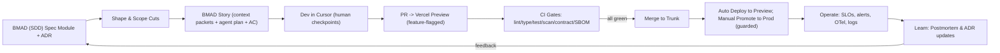

Harmony is a lean, **opinionated** methodology you can adopt tomorrow with two developers, optimized for **speed with safety** on your stated stack and hosting. It integrates **BMAD (Agentic agile with custom (SDD) spec‑first module) + Cursor + Turborepo + Vercel** end‑to‑end, while baking in **SRE, DevSecOps, OWASP ASVS, NIST SSDF, STRIDE, 12‑Factor, Monolith‑First, Hexagonal**.

> **Sources (select)**
>
> - OWASP **ASVS v5 (canonical)**
> - **NIST SSDF** (SP 800‑218)
> - **Google SRE** (SLIs/SLOs, error budgets, postmortems)
> - **DORA** metrics
> - **Trunk‑Based Development**
> - **12‑Factor App**
> - **Hexagonal architecture**
> - **Kanban/Little’s Law**
> - **Shape Up**
> - **Turborepo** (caching/monorepo/Vercel)
> - **Vercel** (previews, envs, promote/rollback, feature flags, cron)
> - **CodeQL/Semgrep**
> - **GitHub** (branch protection, CODEOWNERS, secret scanning)
> - **OTel** (Next.js/Astro + Node)
> - **Playwright/Pact/Schemathesis**
> - **OWASP cheat sheets** (CSP/CSRF/SSRF)
> - Citations are sprinkled where load‑bearing.

---

## 1) Executive Summary (≤2 pages)

**Goal.** Ship small, safe, and frequent changes with **enterprise‑grade** security, reliability, and performance using **agent‑assisted** workflows. Humans own correctness, security, and licensing.

**Methodology**:

- **Spec‑first**: every meaningful change starts with a **Specification one‑pager** + **ADR** capturing problem, scope, API/UI contracts, SLIs/SLOs, **non‑functionals**, and a **micro‑threat model (STRIDE)** mapped to **OWASP ASVS** & **NIST SSDF** tasks.
- **Agentic agile (BMAD)**: Convert the Spec to a **BMAD story** (context packets + agent plan + acceptance criteria). Use **Cursor** to generate plans/diffs/tests from the Spec, but enforce human checkpoints and license checks.
- **Flow over ceremony**: **Trunk‑Based Development** (+ short‑lived branches), tiny PRs, gated **Vercel Preview** per PR, **feature‑flagged** releases with guarded manual promote to prod; rollbacks are instant by promoting a prior preview.
- **Reliability guardrails**: Define **SLIs/SLOs**, manage via **error budgets**, alert on budget burn, run blameless postmortems with action items.
- **Security by default**: **OWASP ASVS** controls + **NIST SSDF** activities embedded in **CI/CD** quality gates: static analysis (**CodeQL/Semgrep**), dependency & **license** scan, **secret scanning**, SBOM, and contract tests.
- **Architecture**: **12‑Factor** monolith‑first in a **Turborepo** monorepo with **Hexagonal** boundaries enforced by **contract tests**, and observability via **OpenTelemetry** + structured logs.

**Expected impact (for a 2‑dev team after 60–90 days)**:

- **Lead time**: hours → sub‑day for small changes via trunk flow, preview environments, and tiny PRs. **DORA** research supports doing speed *with* stability.
- **Change‑fail rate**: drops via feature flags, previews, contract tests, and error‑budget‑driven discipline.
- **MTTR**: minutes–hours via instant rollback (promote a known‑good preview) and clear runbooks.
- **SLO attainment**: measurable improvement by alerting on **burn‑rate** and holding code until budget recovers.

---

## 2) Method Lifecycle Overview



---

## 3) Operating Cadence for 2 devs

**Cycle**: 1‑week mini‑cycles.
**Roles**: rotate weekly: **Driver (Dev A)**, **Navigator/Reviewer (Dev B)**.

- **Async daily check‑in (2 bullets)**: Yesterday outcome, Today intent (+ block).
- **Pairing**: Ping‑pong for risky changes and critical boundaries (auth, billing, data).
- **Weekly retro (≤15 min)**: 3 questions: What slowed flow? What broke gates? What SLO budget burned? Adjust WIP/gates accordingly (error‑budget policy).

---

## 4) Flow & WIP Policy (Kanban for 2 people)

**Board columns**: *Backlog → Ready → In‑Dev → In‑Review → Preview → Release → Done → Blocked.*

**Explicit WIP limits (hard)**:

- Ready: 3 cards max; In‑Dev: 1 per dev; In‑Review: 2 total; Preview: 2.
  **Pull policies**: A card moves **only** when Definition of Ready/Done is satisfied.

- **Definition of Ready (DoR)**: BMAD spec one‑pager + ADR present; acceptance criteria + contracts; **STRIDE** threats & mitigations listed; flags plan; perf budget; test outline.

- **Definition of Done (DoD)**: All **CI gates** pass; coverage & budgets OK; **preview e2e smoke** OK; **SLO guard** no regression; docs/runbook updated; feature behind a flag; default OFF. Enable only when the error budget is healthy; disable or halt rollout on burn‑rate alerts.
  **Why strict WIP?** Keep WIP tiny to reduce cycle time per **Little’s Law** (WIP = Throughput × Cycle Time).

---

## 5) Spec‑First + BMAD (step‑by‑step)

1. **Write the BMAD (SDD module) spec one‑pager** (template below): problem, constraints, **API/UI contracts (OpenAPI/JSON‑Schema)**, non‑functionals (perf, reliability, privacy), **ASVS** controls and **SSDF** tasks, **STRIDE** risks & tests.
2. **Shape**: Cut scope (“must”, “defer”). Pull useful parts of **Shape Up** (appetite, scopes).
3. **Transform into BMAD story**: add **context packets** (domain, constraints, examples), the **agentic plan** (ordered steps Cursor can execute), clear acceptance criteria.
4. **Cursor workflow**:
   - Paste Spec → generate **plan** and **checklist**; **pause**.
   - Ask Cursor to propose **diffs** *with* tests and contracts; **pause** again for a **human review** (security, correctness, licensing).
   - Record **license status** via GitHub **Dependency Review** + **SBOM (Syft)**. Optionally run Node `license-checker` or Python `pip-licenses` locally and attach notes to the PR.
   - Run **threat-model from spec** prompt to produce test cases (XSS/CSRF/SSRF/IDOR). Use **OWASP cheat sheets** for CSP/CSRF/SSRF while coding.

---

## 6) Branching & Release Model

- **Trunk‑Based**: short‑lived branches (≤1 day). One small change per PR. Use **feature flags** for any risky behavior.
- **Vercel Previews**: every PR gets a live URL for acceptance and e2e smoke. **Promote** a known‑good preview to production (instant rollback path).
- **Environment naming & Production policy**: Use **PR Preview** (per PR), **Trunk Preview** (on `main`), and **Production** (manual promote only). In Vercel, disable **Auto Production Deployments** so Production is updated exclusively via `vercel promote <preview-url>`.
- **Feature flags**: use **Vercel Flags** as the provider (server‑evaluated). The in‑repo `packages/config/flags.ts` reads flag values from the Vercel provider (registered at app startup) and falls back to env overrides (`HARMONY_FLAG_*`) for local/dev. Call `setFlagProvider(vercelFlagsProvider)` during application startup — for this repo, register in `apps/api/src/server.ts` (API) and in the SSR entry when adding SSR surfaces. For **Astro SSG/static** pages, evaluate flags server‑side and inject values at build time or via Edge middleware; avoid using `process.env` in the browser. Otherwise, evaluation uses env (`HARMONY_FLAG_*`) and defaults. Clean up flags within 2 cycles.
- **Environments & secrets**: use **Vercel envs** + CLI to manage; never commit secrets; rely on **GitHub secret scanning** + **TruffleHog** in CI.

---

## 7) CI/CD Quality Gates

The pipeline supports **TypeScript and Python**. CI runs language-specific linters, type checks, and tests per package using Turbo filters. Python gates run conditionally—only when a package contains Python (detected by a `pyproject.toml` or `.py` files). TypeScript **`strict`** is enforced via tsconfig; the Type Check stage runs `tsc --noEmit` as a dedicated gate.

**Mermaid view of gates**:

```mermaid
flowchart TB
  A[PR Opened] --> B[Turbo cache restore]
  B --> C[Lint/Format: ESLint (type-aware), Ruff/Black]
  C --> D["Unit Tests (Vitest default; pytest)"]
  D --> E[Type Check: TypeScript (tsc --noEmit with strict), mypy]
  E --> F[Contract Tests: OpenAPI/JSON-Schema + Pact]
  F --> G[E2E Smoke: Playwright vs Preview URL]
  G --> H[Static Analysis: CodeQL + Semgrep]
  H --> I[Dependencies: Dependabot/SCA + License scan]
  I --> J[Secrets Scan: GitHub + Gitleaks]
  J --> K[SBOM: Syft → artifact]
  K --> L[Perf/Bundle Budgets]
  L --> M[Turbo cache save; PR comment with Preview URL]
  M -->|all required checks| N[Merge Allowed]
```

**Checklist (required to merge unless marked optional/adopt incrementally)**:

- [] **Lint/format**: ESLint (type-aware) + `typescript-eslint`; add Ruff/Black when Python is added (optional).
- [] **Type Check**: TypeScript (`tsc --noEmit` with strict); add mypy when Python is added (optional).
- [] **Tests**: unit. OpenAPI breaking-change check (**oasdiff**) enforced. Pact/Schemathesis and preview **e2e smoke** (Playwright) are recommended (optional).
- [] **Static analysis**: **CodeQL** (GitHub code scanning) + **Semgrep** rules; fail on high‑sev.
- [] **Dependencies**: **Dependabot alerts** + SCA (e.g., OWASP Dependency‑Check); license policy via GitHub **Dependency Review**.
- [] **Secret scan**: GitHub **secret scanning** + **TruffleHog**.
- [] **SBOM**: **Syft** (SPDX by default) uploaded as artifact (e.g., `sbom/sbom.spdx.json`).
- [] **Contracts & bundles**: OpenAPI/JSON‑Schema present; enforce OpenAPI diff (**oasdiff**). **Bundle size** budgets are recommended; add CI enforcement later.
- [] **Preview URL** comment: linked from Vercel integration; feature **flag off by default**.

---

## 8) Test Strategy (pyramid + contracts)

- **Unit** close to logic (pure TS/Python).
- **Contract tests** at **ports** (API/UI) to freeze **Hexagonal** boundaries: Pact for consumer/provider; validate OpenAPI with Schemathesis; Prism mocks for dev.
- **AI “golden” tests**: snapshot expected model outputs for critical prompts and guard with **JSON‑Schema**.
- **Golden test stability**: prefer deterministic fixtures and schema-based assertions; allow bounded tolerances for token variance. Fail on schema or material output drift, not minor wording differences.
- **E2E smoke** on Preview (Playwright) for core flows (login, pay, CRUD) — recommended.
- **Canary/flag validation checklist** before enabling flags for a % of users.

---

## 9) Security Baseline (mapped to frameworks)

**OWASP ASVS** (sample of included controls):

- **Auth/session/access control**, **input validation**, **error handling**, **logging/monitoring**, **config/hardening**, **crypto at rest/in transit**; map to Spec’s **ASVS IDs**; include a minimal evidence record per PR.

**NIST SSDF** (SP 800‑218) baked into lifecycle:

- **Plan/Organize**: threat modeling (STRIDE), SBOM plan, SLO/SLA doc.
- **Protect Software**: SCA, secret scanning, signed releases, protected branches.
- **Produce Well‑Secured Software**: code review, fuzz/negative tests, CodeQL/Semgrep, unit/contract/e2e.
- **Respond to Vulnerabilities**: triage SOP, patch SLAs, postmortems, SBOM updates.

**STRIDE per feature** (micro‑threat model in Spec): identify risks → mitigations → tests → checklist items. (Use OWASP cheat sheets for CSP/CSRF/SSRF; for **Next.js** use **next-safe-middleware**. Use **Helmet** only when running a custom Node/Express server. For **Astro**, set security headers at the platform (e.g., Vercel project headers) for SSG; use SSR middleware only when using an SSR adapter.)

**Secrets, headers, defenses**:

- **Secrets** only in Vercel envs; CI blocks leaks. **CSP/HSTS/X‑Frame‑Options/Referrer‑Policy** via framework middleware or platform headers; for Astro static sites, configure headers at the hosting layer (e.g., Vercel) and prefer platform‑level headers for SSG. For SSR (Next.js or Astro adapters), enforce headers in middleware; platform‑level headers take precedence, and SSR middleware should complement, not conflict. CSRF protections for mutations; SSRF‑hardening on outbound calls.
- **SBOM** in releases; **license policy** gates (ban GPL if incompatible).

---

## 10) Reliability & Ops (Google SRE)

- **SLIs**: availability, p95 latency, error rate, saturation (CPU/DB connections/queue depth).
- **SLOs (starter)**:
  - API availability ≥ **99.9%** (monthly).
  - p95 API latency ≤ **300 ms** (warm), ≤ **600 ms** (includes cold starts).
  - p95 page **TTFB ≤ 400 ms** for top route.
  - 5xx error rate ≤ **0.5%**.
- **Error budgets**: 43m/month at 99.9%; if burned, freeze feature flags and focus on reliability until recovered. Alert on **burn‑rate** (multi‑window).
- **On‑call (2‑dev rotation)**: 1 week each; no 24/7 pages for low‑impact; page only for SLO threats.
- **Incidents**: severities, **rollback first** (Vercel promote), then fix‑forward; blameless **postmortem** template below.
- **Observability**: **OpenTelemetry** for traces/metrics + structured logs (**pino**) wired to your vendor. Next.js supports OTel and `@vercel/otel`; Astro can emit server traces when using SSR adapters. Bootstrap OTel early from `infra/otel/instrumentation.ts` (default OTLP endpoint `http://localhost:4318`, override with `OTEL_EXPORTER_OTLP_ENDPOINT`).

---

## 11) Performance & Scalability

- **Perf budgets & SLIs**: TTFB, p95 route/API latencies, error rate, bundle size, **cold start** limits (see Vercel guidance). Use **Edge** for ultra‑low‑latency reads; use **Serverless** for short, bursty compute. Move sustained/heavy or long‑running work to background queues/workers; minimize cold starts.
- **Caching**: at app (**React cache for Next.js surfaces**; for **Astro**, rely on SSG + CDN or adapter SSR caching), CDN (Vercel), and data (Upstash Redis) with **cache‑key discipline**.
- **Queues/backpressure**: Default: **QStash** for serverless simplicity; alternative: **BullMQ + Upstash (Redis)** for heavier workloads or long‑running tasks; **Vercel Cron** for scheduled jobs.
- **DB basics**: indexes on read paths, batched writes, pagination, idempotency keys, soft limits and rate limiting.
- **Load test plan**: quick repeatables (k6/Artillery/autocannon) on Preview. Run against **PR Preview** for risky changes or **Trunk Preview** for broader regressions; minimum 2 minutes or ≥1,000 requests. Recommended policy: consider gating merges if p95 exceeds budget by >10%.

---

## 12) Architecture & Repository Structure

- **12‑Factor**: configs in env, stateless processes, logs as streams, disposability, build‑release‑run.
- **Monolith‑First (modular monolith)** in **Turborepo**: deployable apps (`apps/web`, `apps/api`) + shared libs (`packages/…`). **Remote caching** accelerates CI.
- **Hexagonal** (**Ports & Adapters**): isolate edges (web, API, db, external) with interfaces and **contract tests**.

Framework strategy: **Next.js** is the default for SaaS/dynamic web apps; **Astro** is used for content‑first properties (blogs/docs/marketing). The current `apps/web` is Astro; additional Next.js apps will be added for dynamic surfaces as the project grows.

- **Feature flags implementation**: flags are declared in `packages/config/flags.ts`. At app startup, register the **Vercel Flags provider** so `isFlagEnabled()` and `listFlags()` read from it by default, with local env (`HARMONY_FLAG_*`) as fallback for development. On **SSR** surfaces (Next.js, Astro adapters), flags are server‑evaluated by the provider. On **Astro SSG/static** pages, use `isFlagEnabled` only on the server; inject flag values at build time or fetch via Edge/API — do not rely on `process.env` in the browser.

**Example layout & ownership (CODEOWNERS)**:
Note: Illustrative example; `apps/app` (Next.js) may not exist yet. Add Next.js surfaces as needed.

```plaintext
repo/
  ├── apps/
  │   ├── web/        # Astro (docs/marketing, content-first)
  │   ├── app/        # Next.js (SaaS app, dynamic content)
  │   └── api/        # Node API (or Next API routes)
  ├── packages/
  │   ├── domain/     # core business logic (pure TS/Python)
  │   ├── adapters/   # db, http clients
  │   ├── contracts/  # OpenAPI/JSON Schemas, Pact files
  │   └── ui-kit/     # shared React UI
  ├── infra/
  │   ├── ci/         # GH Actions workflows
  │   └── otel/       # OTel config
  ├── docs/
  │   └── specs/      # Specs, ADRs
  ├── turbo.json
  └── CODEOWNERS
```

Use **CODEOWNERS** to enforce review by area (e.g., `packages/domain` → both devs; `adapters/db` → primary owner). Protect `main` with required checks.

---

## 13) Cursor‑Native Playbook (ready prompts)

> Use these **verbatim** in Cursor. Keep prompts (suggested filenames) under `/docs/prompts/`. Paste into PRs as evidence.

- **Spec‑to‑code**:
  *“Given the spec below, propose a minimal design and file‑by‑file diff (TypeScript/Python). Include contract types, tests, and a step‑by‑step plan. Flag any security, privacy, or licensing concerns. Do NOT add new deps without justification.”*
- **Refactor‑safely**:
  *“Refactor `<path>` to match the Hexagonal boundary. Preserve public contracts and ensure existing tests pass. Propose additional tests for risky branches.”*
- **Generate tests from spec**:
  *“From this Spec + OpenAPI/JSON‑Schema, generate unit + contract tests. Include negative tests derived from STRIDE threats.”*
- **Schema & contract tests**:
  *“Validate responses against `<schema>` using AJV/Zod. Add tests that fail on schema drift.”*
- **Explain diff & risks**:
  *“Summarize this diff: intent, surface area, security/perf risks, rollback plan, and flags to guard.”*
- **License‑safe suggestion**:
  *“Recommend libraries with permissive licenses only (MIT/BSD/Apache). Provide license matrix and bundle impact. Avoid GPL.”*
- **Threat‑model from spec**:
  *“Enumerate STRIDE threats for this feature. For each, propose mitigations and tests (unit/contract/e2e).”*
- **Perf budget enforcement**:
  *“Check this change against our perf budgets. Identify bundle increases and server latency risks. Suggest reductions.”*

---

## 14) Tooling Map (GitHub/Vercel/Turborepo)

- **GitHub Projects**: board columns above; templates for Spec/BMAD/bug; Insights for cycle time. Protect `main` with **required checks**.
- **Actions matrix per package**: `turbo run lint test build --filter=...` using remote cache.
- **Required checks**: the gates configured in `infra/ci/pr.yml` (subset of §7); adopt additional gates incrementally.
- **Vercel**: previews on every PR; **promote** for instant rollback; env & secret management; **feature flags** via Vercel Flags/Toolbar; **cron** for schedules.

---

## 15) Metrics & Improvement

- **Minimal DORA**: lead time (PR open→merge), deployment frequency, change‑fail %, MTTR. Track automatically via PR & Actions timestamps; correlate with SLO burn.
- **SRE targets**: publish current SLOs, weekly error‑budget report; adjust gates when burn is high (e.g., freeze features, raise test thresholds).
- **Weekly retro prompts**:

  - *What blocked flow?*
  - *What broke gates?*
  - *Which SLI/SLO regressed?*
  - *What 1 guardrail to tighten/loosen?*

---

## 16) 30/60/90 Adoption Plan

- **Day 1–30 (Foundations)**: set up **board, Spec/ADR, CODEOWNERS, branch protection**, Turbo pipelines, minimal CI (lint, unit, typecheck, preview). Enable **Vercel previews/envs**, **secret scanning**, **Dependabot**.
- **Day 31–60 (Security/Reliability)**: add **CodeQL, Semgrep, SBOM**, Pact/Schemathesis, Playwright smoke; define **SLOs**, alerts on burn rate; OTel + pino.
- **Day 61–90 (Perf & Flags)**: set **perf/bundle budgets**, feature flag process, load tests on preview, postmortems template, error‑budget policy in README.

---

## 17) Worked Example — “OAuth login + org billing” (sketch)

**Spec extract (abbrev)**:

- Problem: Add OAuth (Google) login + org billing (Stripe).
- Contracts: `/api/auth/callback`, `/api/billing/webhook` (OpenAPI).
- Non‑functionals: p95 auth callback ≤ 600 ms; availability ≥ 99.9%.
- Security: ASVS V2 (authentication), V3 (session), V4 (access control), V10 (errors/logging). **STRIDE**: spoofing (OAuth state), tampering (webhook sig), info disclosure (PII), DoS (webhook storms), elevation (role mapping). Mitigations: state+nonce, Stripe signature verify, PII minimization, rate limit, RBAC checks.

**BMAD story → Cursor**:

- Context packets: OAuth sequence, Stripe events (`checkout.session.completed`, `invoice.paid`).
- Agent plan: add adapters (`adapters/oauth-google.ts`, `adapters/stripe.ts`), domain services (`AuthService`, `BillingService`), routes, tests (unit + Pact for webhook), e2e smoke on Preview.
- Acceptance: user can sign‑in → org created/linked; paid plan toggles flag `billing.active`; webhook retries idempotent.

**PR flow**:

- Tiny PR 1: contracts + stub adapters + tests (failing) → green.
- Tiny PR 2: OAuth implementation behind `flag.oauth_google`, CSRF/state checks, contract tests pass.
- Tiny PR 3: Stripe webhook with signature verify + idempotent store; Pact verifies; Playwright smoke passes on Preview.
- Release: enable `flag.oauth_google` to internal org only → monitor SLO/error rate → widen.


## Cursor Prompt Snippets Library

```plaintext
/docs/prompts/spec-to-code.md
/docs/prompts/refactor-safely.md
/docs/prompts/threat-model-from-spec.md
/docs/prompts/perf-budget-enforcement.md
/docs/prompts/license-safe-suggestion.md
```

## Extras

**Data migrations & rollback**:

- Forward‑only schema; write‑compat via dual‑write/dual‑read when needed; **feature flag** gates migration usage; keep backfill idempotent; have a `rollback.md` with `vercel promote` to prior deployment.

**Feature flags cleanup cadence**: tag flags by owner & expiry; automate weekly report; remove within 2 cycles.

**AI license‑safety tips**: prefer permissive deps; add **license scan gates**; Cursor diff review must include license notes (`license-checker`, `pip-licenses`).

**Day‑in‑the‑life (Driver/Navigator)**:

- **Mon**: Spec/BMAD → small PR #1.
- **Tue**: Tests/contracts; PR #2.
- **Wed**: Feature + flags; preview smoke.
- **Thu**: Security scans & perf budgets; PR #3.
- **Fri**: Enable flag for internal; retro (15m); plan next cycle.

---

## Quick‑Start Page (tomorrow morning)

**Cadence & roles**: 1‑week cycle; rotate **Driver/Navigator**; async daily check‑ins.

**Board & WIP**: Backlog → Ready (3) → In‑Dev (1 per dev) → In‑Review (2) → Preview (2) → Release → Done → Blocked.

**Spec → BMAD → PR flow**:

1. Write **BMAD spec one‑pager** + **ADR**.
2. Convert to **BMAD story**.
3. Use **Cursor** to propose plan/diffs/tests with checkpoints.
4. Open tiny PR → **Vercel Preview** → run e2e smoke → merge if gates pass.

**Required CI checks**: lint/format; TS `--strict`; unit; typecheck; **OpenAPI diff (oasdiff)**; **CodeQL + Semgrep**; **Dependabot/SCA + Dependency Review (license)**; **secret scanning + TruffleHog**; **SBOM**; Preview URL comment. Recommended: Pact/Schemathesis and **e2e smoke (Playwright)**; publish **bundle/perf budgets** (CI enforcement optional).

**SLOs (starter)**: Availability 99.9%; p95 API ≤300 ms warm (≤600 ms incl. cold); p95 TTFB ≤400 ms; 5xx ≤0.5%. **Error budget** gates releases.

**Release behind a flag**: ship with `flag.<feature>=off` → enable for internal → ramp; **rollback** = *promote prior preview to production*.

**How to rollback**: Vercel dashboard/CLI: `vercel promote <deployment-url>`.

**Top 10 security/perf checks**:

1. STRIDE threats covered; 
2. CSRF tokens on mutations;
3. CSP set;
4. SSRF outbound allow‑list;
5. Secrets in env only;
6. CodeQL/Semgrep clean;
7. SBOM present;
8. License policy OK;
9. p95 latency within budget;
10. bundle under budget.

**Incident hotline**: page only for **SLO burn** or **customer impact**; **rollback first**, then fix; blameless **postmortem** within 48h.

---

## Short appendix of authoritative references

- **OWASP ASVS v5 (canonical)**.
- **NIST SSDF SP 800‑218** (SSDF 1.1).
- **Google SRE** (SLIs/SLOs, error budgets, postmortems).
- **DORA** four keys.
- **Trunk‑Based Development**.
- **12‑Factor** app.
- **Hexagonal Architecture**.
- **Kanban/WIP (Little’s Law)**.
- **Turborepo** (caching/monorepos) + **Vercel** (previews, promote, envs, flags, cron).
- **Static analysis & SCA**: CodeQL, Semgrep, Dependabot, OWASP Dependency‑Check; **SBOM**: Syft; **secret scanning**: GitHub + TruffleHog.
- **Observability**: Next.js/Astro (SSR) OTel + Node OTel + pino.

---

### Final notes

- This method intentionally **minimizes ceremony**: few meetings, tiny PRs, clear gates, strong **Spec‑first + BMAD** with **Cursor** as a power tool and **humans as the safety system**.
- It **scales with your risk**: tighten gates when error budget burns, loosen when healthy.
- It is **fully compatible** with your stack and hosting, and gives you **enterprise‑grade** security and reliability from day one.
