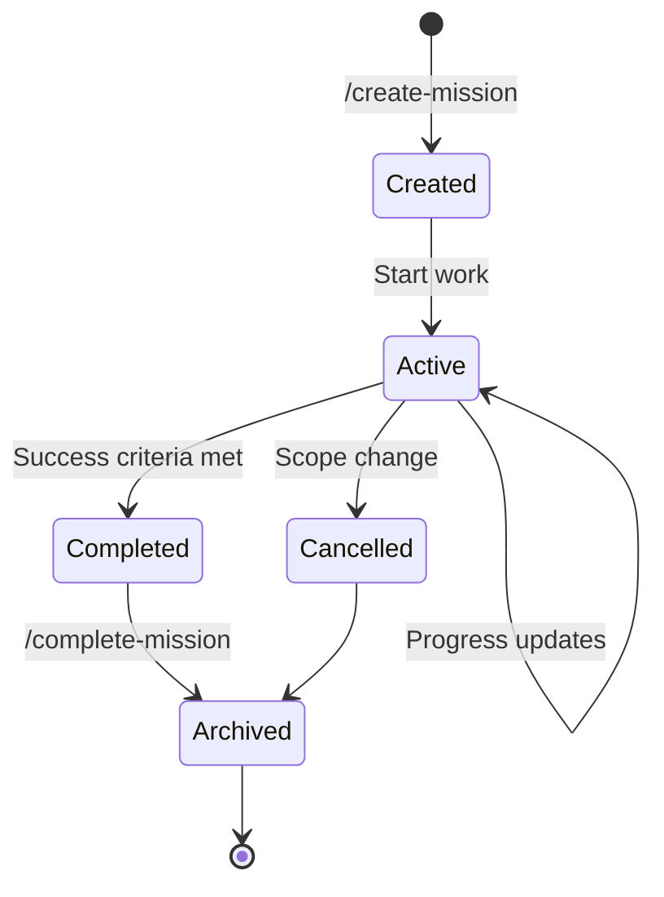
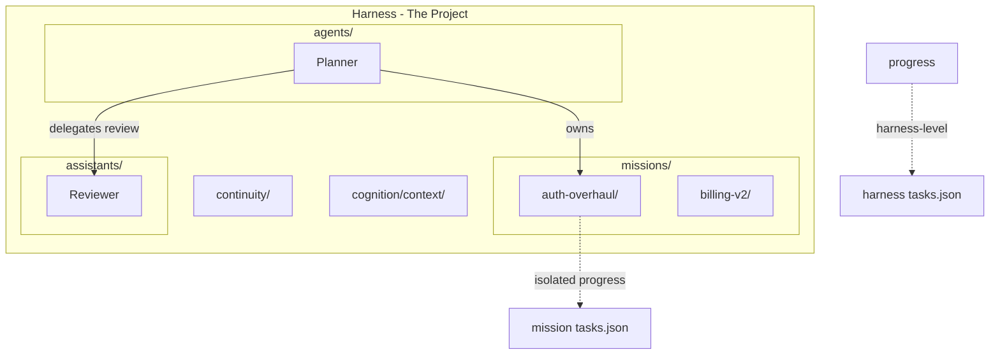

# Harness Missions

Missions are **time-bounded sub-projects** within a harness. They provide isolated progress tracking for parallel workstreams or large initiatives that need their own goal, tasks, and memory.

---

## What is a Mission?

A mission is a bounded, goal-oriented sub-effort that:

- Has a **specific goal** and **success criteria**
- Has an **owner** (agent, assistant, or human)
- Maintains **isolated progress** (own `tasks.json`, `log.md`)
- Has a **lifecycle**: created → active → completed → archived

Missions let you run parallel workstreams within the same harness without polluting each other's progress tracking.

---

## When to Create a Mission

| Scenario | Use Mission? | Alternative |
|----------|--------------|-------------|
| Parallel workstreams in same area | Yes | — |
| Time-bounded initiative (weeks) | Yes | — |
| Delegatable unit of work | Yes | — |
| Single task, completes in one session | No | Use harness `tasks.json` |
| Different codebase area | No | Create nested `.harmony` |

**Decision heuristic:** If you need isolated progress tracking for a bounded effort, create a mission.

---

## Mission Lifecycle



| Status | Description |
|--------|-------------|
| **Created** | Scaffolded, goal defined, not yet started |
| **Active** | Work in progress |
| **Completed** | Success criteria met |
| **Cancelled** | Abandoned (scope change, no longer needed) |
| **Archived** | Moved to `missions/.archive/` after completion/cancellation |

---

## Directory Structure

```text
.harmony/orchestration/missions/
├── registry.yml           # Index of active/archived missions
├── README.md              # Usage guide
├── .archive/              # Completed/cancelled missions (mission-specific archive)
├── _template/             # Template for new missions
│   ├── mission.md
│   ├── tasks.json
│   └── log.md
└── <mission-slug>/        # Active mission
    ├── mission.md         # Goal, scope, owner, status
    ├── tasks.json         # Mission-specific tasks
    ├── log.md             # Mission-specific progress
    └── context/           # Mission-specific decisions (optional)
```

---

## Registry Format

The `registry.yml` tracks active and archived missions:

```yaml
schema_version: "1.0"

active:
  - id: auth-overhaul
    status: active
    owner: planner
    started: 2025-01-03
    target_completion: 2025-01-31
    
  - id: billing-v2
    status: active
    owner: "@architect"
    started: 2025-01-05

archived:
  - id: doc-migration
    completed: 2024-12-15
```

---

## Mission Specification Format

Each `mission.md` follows this structure:

```markdown
---
title: "Mission: [slug]"
status: active
owner: null
started: YYYY-MM-DD
target_completion: null
---

# Mission: [slug]

## Goal
[One paragraph describing the objective.]

## Scope
- [File/directory pattern 1]
- [File/directory pattern 2]

## Success Criteria
- [ ] [Criterion 1]
- [ ] [Criterion 2]

## Owner
[Agent role or @assistant or human]

## Notes
[Additional context]
```

---

## How Missions Relate to Harness



### Progress Isolation

| Level | File | Scope |
|-------|------|-------|
| **Harness** | `continuity/tasks.json` | Cross-cutting tasks, not mission-specific |
| **Mission** | `missions/<slug>/tasks.json` | Tasks for this specific initiative |

Missions have their own progress tracking. When a mission completes, its final state is preserved in the archive.

---

## Creating a Mission

### Via Workflow

```text
/create-mission auth-overhaul
```

This will:
1. Copy `_template/` to `missions/auth-overhaul/`
2. Initialize `mission.md` with slug and start date
3. Add to `registry.yml` under `active`

### Manually

1. Copy `missions/_template/` to `missions/<slug>/`
2. Update `mission.md` with goal, scope, success criteria
3. Assign an owner
4. Add to `registry.yml` under `active`

---

## Completing a Mission

### Via Workflow

```text
/complete-mission auth-overhaul
```

Or for a cancelled mission:
```text
/complete-mission auth-overhaul --cancelled
```

This will:
1. Update `mission.md` status to `completed` or `cancelled`
2. Add final entry to `log.md`
3. Move to `missions/.archive/auth-overhaul/`
4. Update `registry.yml` (move from `active` to `archived`)

---

## Mission Ownership

Missions can be owned by:

| Owner Type | Example | Description |
|------------|---------|-------------|
| **Agent role** | `planner` | Agent orchestrates the mission |
| **Assistant** | `@architect` | Assistant leads focused work |
| **Human** | `@alice` | Human drives the mission |

The owner is responsible for:
- Maintaining the mission's `tasks.json`
- Updating the mission's `log.md`
- Completing or cancelling the mission

---

## Relationship to Agents and Assistants

```
┌─────────────────────────────────────────────────────────┐
│                     HARNESS                              │
│                                                          │
│  ┌─────────────┐  ┌─────────────┐  ┌─────────────┐      │
│  │   Mission   │  │   Mission   │  │   Mission   │      │
│  │ auth-overhaul│ │ billing-v2  │  │ doc-cleanup │      │
│  └──────┬──────┘  └──────┬──────┘  └─────────────┘      │
│         │                │                               │
│         ▼                ▼                               │
│  ┌──────────────────────────────────┐                   │
│  │           AGENT (Planner)        │ ← orchestrates    │
│  └────────────┬─────────────────────┘                   │
│               │ delegates to                             │
│       ┌───────┴───────┐                                 │
│       ▼               ▼                                  │
│  ┌──────────┐   ┌──────────┐                            │
│  │Assistant │   │Assistant │  ← focused work            │
│  │(reviewer)│   │(refactor)│                            │
│  └──────────┘   └──────────┘                            │
└─────────────────────────────────────────────────────────┘
```

- **Agents** can own missions and orchestrate their completion
- **Assistants** can be delegated subtasks within a mission
- **Missions** provide the bounded context for work

---

## Example: Auth Overhaul Mission

```text
missions/auth-overhaul/
├── mission.md
├── tasks.json
└── log.md
```

**mission.md:**
```markdown
---
title: "Mission: auth-overhaul"
status: active
owner: planner
started: 2025-01-03
target_completion: 2025-01-31
---

# Mission: auth-overhaul

## Goal
Replace legacy auth system with OAuth2/OIDC implementation.

## Scope
- `src/auth/**`
- `docs/api/auth.md`
- `tests/auth/**`

## Success Criteria
- [ ] OAuth2 provider integration complete
- [ ] Legacy auth removed
- [ ] All auth tests passing
- [ ] API docs updated

## Owner
planner (with @reviewer for code review)
```

---

## See Also

- [README.md](./README.md) — Canonical harness structure
- [Research Projects](./projects.md) — Human-led investigations (compare to missions)
- [Agency](./agency.md) — Actor taxonomy and assistant role definitions
- [Progress](./progress.md) — Session continuity tracking
- [Taxonomy](./taxonomy.md) — Artifact type classification
