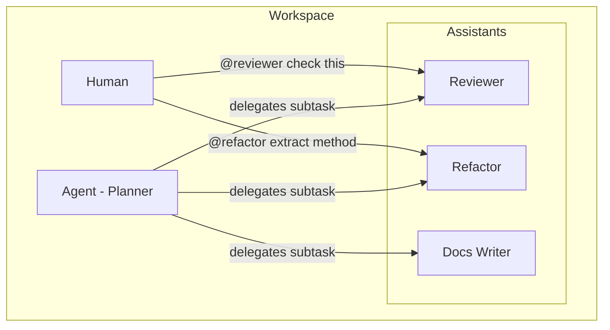

# Workspace Assistants

Assistants are **focused specialists** that perform scoped, one-off tasks. They can be invoked directly by humans via `@mention` or delegated to by agents.

---

## What is an Assistant?

An assistant is a packaged behavior definition that:

- Has a **specific mission** (review code, refactor, write docs)
- Accepts **invocation** via @mention or delegation
- Produces **structured output** in a defined format
- Operates under **boundaries** and knows when to escalate

Assistants are **stateless**—they inherit context from the calling workspace or agent, complete their task, and return results.

---

## Assistants vs Agents

| Characteristic | Agent | Assistant |
|----------------|-------|-----------|
| **Autonomy** | Autonomous, long-running | Invoked for specific tasks |
| **Lifecycle** | Persistent across sessions | Stateless (inherits context) |
| **Scope** | Orchestrates broad work | Focused, scoped operations |
| **State** | Maintains own progress/memory | No persistent state |
| **Examples** | Planner, Builder, Verifier | Reviewer, Refactor, Docs |



---

## Directory Structure

```text
.workspace/assistants/
├── registry.yml           # @mention mappings
├── README.md              # Usage guide
├── _template/             # Template for new assistants
│   └── assistant.md
├── reviewer/
│   └── assistant.md       # Reviewer spec
├── refactor/
│   └── assistant.md       # Refactor spec
└── docs/
    └── assistant.md       # Docs writer spec
```

---

## Registry Format

The `registry.yml` file maps @mentions to assistant definitions:

```yaml
schema_version: "1.0"
default: null  # Optional default assistant

assistants:
  - name: reviewer
    path: reviewer/
    aliases: ["@review", "@rev"]
    description: "Code review specialist for quality, style, and correctness."
    
  - name: refactor
    path: refactor/
    aliases: ["@refactor", "@ref"]
    description: "Refactoring specialist for code improvements."
```

| Field | Required | Description |
|-------|----------|-------------|
| `name` | Yes | Assistant identifier |
| `path` | Yes | Directory containing `assistant.md` |
| `aliases` | Yes | @mention triggers (including primary) |
| `description` | Yes | One-line description |

---

## Assistant Specification Format

Each `assistant.md` follows this structure:

```markdown
---
title: "Assistant: [name]"
description: "[One-line description]"
access: agent
---

# Assistant: [name]

## Mission
[One sentence defining what this assistant does.]

## Invocation
- **Direct:** Human types `@[name] [task]` in chat
- **Delegated:** Agent delegates subtask to this assistant

## Operating Rules
1. [Rule 1]
2. [Rule 2]

## Output Format
[Structured output template]

## Boundaries
- Never [constraint 1]
- Prefer [preference 1]

## When to Escalate
- If [condition], escalate to [agent/human]
```

---

## Invocation Patterns

### Direct Invocation (Human)

User types in chat:
```text
@reviewer Check this PR for security issues
@refactor Extract the validation logic into a helper
@docs Improve the API documentation clarity
```

### Delegated Invocation (Agent)

An agent (e.g., Planner) delegates:
```text
Agent: "Delegating code review to @reviewer"
→ Reviewer assistant executes
→ Returns structured findings to agent
```

---

## @mention Router Spec

The @mention router follows these rules:

**Rule A — Turn-level selection:**
If a user message starts with `@assistant_name`, route the entire turn to that assistant.

**Rule B — Inline delegation:**
If `@assistant_name` appears mid-message, treat it as a subtask delegation.

**Rule C — Locality:**
Nearest `.workspace/assistants/registry.yml` wins. Child workspaces can override parent assistants.

---

## When to Create an Assistant

| Scenario | Create Assistant? | Alternative |
|----------|-------------------|-------------|
| Repeated specialized task | Yes | — |
| Task needs consistent output format | Yes | — |
| Agent should be able to delegate | Yes | — |
| One-off task, no reuse | No | Just do it inline |
| Long-running orchestration | No | Create an Agent role |

---

## Example: Reviewer Assistant

```markdown
---
title: "Assistant: Reviewer"
description: "Code review specialist for quality, style, correctness, and security."
access: agent
---

# Assistant: Reviewer

## Mission
Review code changes for quality, style, correctness, and security issues.

## Invocation
- **Direct:** Human types `@reviewer [task]` or `@rev [task]`
- **Delegated:** Agent delegates review subtask

## Operating Rules
1. Focus on the specific code or changes provided
2. Prioritize issues by severity: security > correctness > style
3. Provide actionable feedback with specific line references
4. Suggest fixes, not just problems

## Output Format
### Review Summary
**Verdict:** [Approve / Request Changes / Needs Discussion]

### Findings
- **Critical:** [severity-tagged findings]
- **Important:** [severity-tagged findings]
- **Minor:** [severity-tagged findings]

### Suggested Patches
[Code blocks with fixes]

## Boundaries
- Never approve code with security vulnerabilities
- Stay within the scope of provided changes

## When to Escalate
- Architectural concerns → escalate to Planner
- Unclear requirements → request human clarification
```

---

## See Also

- [README.md](./README.md) — Canonical workspace structure
- [Missions](./missions.md) — Time-bounded sub-projects
- [Taxonomy](./taxonomy.md) — Artifact type classification
