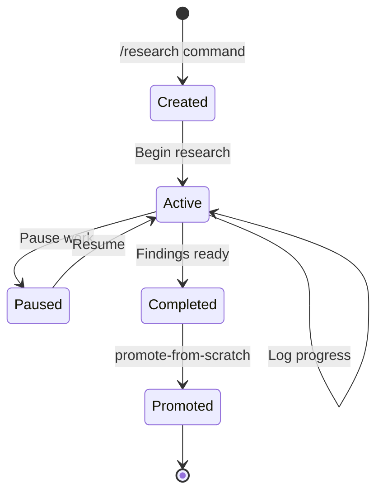
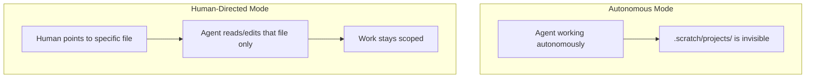
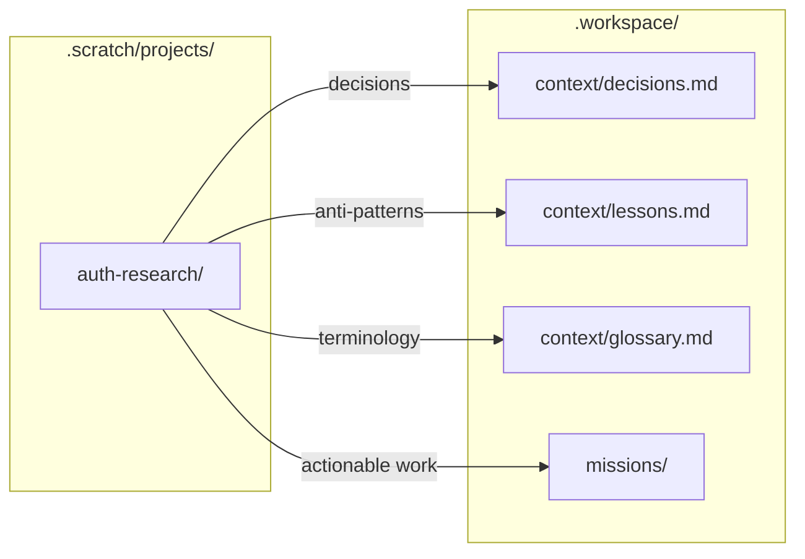

# Research Projects

Research projects are **human-led investigations** that live in `.workspace/.scratch/projects/`. They provide isolated scope, memory, and continuity for structured research that may span multiple sessions—but require explicit human direction for agent collaboration.

---

## What is a Research Project?

A research project is a **scaled-down workspace** for human-led exploration:

| Workspace Component | Research Project Equivalent |
|---------------------|----------------------------|
| `scope.md` | `project.md` (Goal, Scope, Questions) |
| `progress/log.md` | `log.md` (Session notes) |
| `context/decisions.md` | Findings Summary in `project.md` |
| `progress/tasks.json` | Key Questions in `project.md` |

Research projects provide structure for investigations that:

- Span **multiple sessions** and need continuity
- Require **isolated context** separate from workspace progress
- Will eventually **promote findings** to agent-facing locations
- Benefit from **explicit goal and scope** definition

---

## Projects vs. Missions

Research projects and missions serve different purposes:

| Aspect | Research Project | Mission |
|--------|------------------|---------|
| **Location** | `.scratch/projects/` | `missions/` |
| **Autonomy** | Human-led only | Agent-accessible |
| **Purpose** | Explore and research | Execute and deliver |
| **Output** | Insights to promote | Completed work |
| **Ownership** | Always human-driven | Agent, assistant, or human |
| **Structure** | Lightweight (2 files) | Full progress tracking |

**Decision heuristic:**
- Need to **investigate or explore** something? → Research project
- Need to **execute and deliver** something? → Mission

---

## Project Lifecycle



| Status | Description |
|--------|-------------|
| **Active** | Research in progress |
| **Paused** | Temporarily on hold (document reason) |
| **Completed** | Findings summarized, ready to promote |
| **Promoted** | Insights published to agent-facing locations |

---

## Directory Structure

```text
.workspace/.scratch/projects/
├── registry.md            # Index of all projects by status
├── _template/             # Template for new projects
│   ├── project.md
│   ├── log.md
│   └── resources.md
└── <project-slug>/        # Active project
    ├── project.md         # Goal, scope, questions, findings
    ├── log.md             # Session progress notes
    ├── resources.md       # Links to useful workspace resources
    ├── sources.md         # References and links (optional)
    ├── findings.md        # Detailed findings (optional)
    └── notes/             # Free-form research notes (optional)
```

---

## Registry Format

The `registry.md` tracks all research projects in three tables:

```markdown
## Active

| Project | Goal | Started | Last Activity |
|---------|------|---------|---------------|
| auth-patterns | Evaluate auth library options | 2025-01-10 | 2025-01-12 |

## Paused

| Project | Goal | Paused Reason |
|---------|------|---------------|
| perf-audit | Profile app performance | Waiting on staging env |

## Completed

| Project | Goal | Completed | Promoted To |
|---------|------|-----------|-------------|
| api-design | Design v2 API structure | 2025-01-05 | context/decisions.md |
```

---

## Project Specification Format

Each `project.md` follows this structure:

```markdown
---
title: "Research: [topic]"
status: active
started: YYYY-MM-DD
last_activity: YYYY-MM-DD
---

# Research: [topic]

## Goal
[What question are we trying to answer? What are we exploring?]

## Scope

**In scope:**
- [What's included]

**Out of scope:**
- [What's excluded]

## Key Questions
1. [Question 1]
2. [Question 2]
3. [Question 3]

## Constraints
- [Time, resource, or other constraints]

## Promotion Path

When this research matures, findings should go to:
- [ ] `context/decisions.md` — Design decisions made
- [ ] `context/lessons.md` — Anti-patterns discovered
- [ ] `context/glossary.md` — New terminology defined
- [ ] Create mission — If actionable work identified

## Status
**Current:** active
**Notes:** [Any status notes]

---

## Findings Summary

*Summarize key findings here as research progresses.*

### Key Insights
1. [Insight 1]
2. [Insight 2]

### Decisions Made
- [Decision and rationale]

### Open Questions
- [Remaining questions]
```

---

## Progress Log Format

Each `log.md` captures session-by-session progress:

```markdown
# Research Log: [topic]

Progress notes for this research project.

---

## [YYYY-MM-DD]

**Focus:** [What you explored this session]

**Findings:**
- [Key finding 1]
- [Key finding 2]

**Sources reviewed:**
- [Source 1]
- [Source 2]

**Questions raised:**
- [New question that emerged]

**Next:**
- [What to explore next session]
```

---

## Autonomy Rules

Research projects live in `.scratch/`, which is **human-led only**:



| Mode | Agent Behavior |
|------|----------------|
| **Autonomous** | MUST NOT scan, read, or write to `.scratch/projects/**` |
| **Human-directed** | MAY access specific files when human explicitly points to them |

### Valid Collaboration

```text
Human: "Review .scratch/projects/auth-research/findings.md and help organize"
Agent: [Reads specific file, assists as directed]
```

### Invalid Autonomous Action

```text
Agent: "I found relevant notes in .scratch/projects/..."
→ VIOLATION: Agent scanned .scratch/ without human direction
```

---

## Creating a Project

### Via Command

```text
/research <slug>
```

This delegates to `.workspace/workflows/scratch/create-research-project/` and will:
1. Copy `_template/` to `projects/<slug>/`
2. Initialize `project.md` with slug and start date
3. Add entry to `registry.md` under **Active**

### Manually

1. Copy `projects/_template/` to `projects/<slug>/`
2. Fill in `project.md` with goal, scope, and key questions
3. Add entry to **Active** table in `registry.md`
4. Begin research, logging progress in `log.md`

---

## During Research

Best practices while a project is active:

| Activity | How |
|----------|-----|
| Log progress | Update `log.md` at end of each session |
| Track findings | Summarize insights in `project.md` as you go |
| Add sources | Create `sources.md` for references (optional) |
| Update registry | Keep `Last Activity` current in `registry.md` |
| Use workspace resources | Leverage assistants and prompts via `resources.md` |

---

## Leveraging Workspace Resources

Research projects can leverage workspace resources while maintaining human-led control. The `resources.md` file in each project documents available resources and how to use them.

### Assistants

Invoke workspace assistants for focused help during research:

```text
Human: "@reviewer Check my findings in .scratch/projects/auth-patterns/project.md
        for logical gaps and contradictions"
```

| Assistant | Research Use Case |
|-----------|-------------------|
| `@reviewer` | Review findings for clarity, gaps, contradictions |
| `@docs` | Help organize research notes into structured documentation |
| `@refactor` | Restructure project files or consolidate notes |

Assistants respect the human-led model because **you explicitly invoke them**.

### Research Prompts

A set of research-focused prompts lives in `.workspace/prompts/research/`:

| Prompt | Purpose | When to Use |
|--------|---------|-------------|
| `analyze-sources.md` | Extract insights from source materials | When reviewing documentation, articles, code |
| `synthesize-findings.md` | Consolidate notes into coherent insights | Mid-research or before promotion |
| `compare-alternatives.md` | Evaluate options against criteria | When choosing between approaches |
| `identify-gaps.md` | Find holes in research coverage | Periodically during research |
| `prepare-promotion.md` | Ready findings for workspace promotion | When research is mature |

**Usage:**
```text
Human: "Use .workspace/prompts/research/synthesize-findings.md to consolidate
        my notes in .scratch/projects/auth-patterns/"
```

### Research Phases and Tools

Research projects typically progress through five phases. Each phase has recommended tools:

```mermaid
flowchart TD
    subgraph gathering [1. Gathering]
        A[analyze-sources.md<br/>prompt] --> B[Log findings]
    end

    subgraph assessing [2. Assessment]
        C[identify-gaps.md<br/>prompt] --> D[Fill gaps]
    end

    subgraph synthesis [3. Synthesis]
        E[/synthesize-research<br/>skill] --> F[Review output]
    end

    subgraph evaluation [4. Evaluation]
        G[compare-alternatives.md<br/>prompt] --> H[Make decisions]
    end

    subgraph promotion [5. Promotion]
        I[prepare-promotion.md<br/>prompt] --> J[Promote to workspace]
    end

    gathering --> assessing
    assessing --> synthesis
    synthesis --> evaluation
    evaluation --> promotion
```

### Phase-Aligned Tool Selection

| Phase | Tool Type | Recommended | Why |
|-------|-----------|-------------|-----|
| **Gathering** | Prompt | `analyze-sources.md` | Flexible, judgment-based extraction |
| **Assessment** | Prompt | `identify-gaps.md` | Context-dependent gap analysis |
| **Synthesis** | **Skill** | `/synthesize-research` | Structured output, audit trail |
| **Evaluation** | Prompt | `compare-alternatives.md` | Judgment-based comparison |
| **Promotion** | Prompt | `prepare-promotion.md` | Context-dependent formatting |

### Skills vs Prompts Decision

| Use Skills | Use Prompts |
|------------|-------------|
| Need **structured, repeatable** output | Need **flexible, exploratory** guidance |
| Want **audit trail** (run logs) | One-off or iterative exploration |
| **Chaining** operations (pipelines) | **Context-dependent** decisions |
| Defined inputs → defined outputs | Variable inputs/outputs |
| **Synthesis phase** (consolidation) | **All other phases** (judgment needed) |

### Available Skills for Research

| Skill | Command | Phase | Use For |
|-------|---------|-------|---------|
| [research-synthesizer](.workspace/skills/research-synthesizer/) | `/synthesize-research` | Synthesis | Consolidate notes into structured findings |

**Invocation:**
```text
/synthesize-research .scratch/projects/<project>/
```

**Output location:** `.workspace/skills/outputs/drafts/<topic>-synthesis.md`

### Skill Output Integration

After running a skill, integrate outputs back into your project:

1. **Reference in log.md:**
   ```markdown
   ## [Date]
   **Skill run:** `/synthesize-research`
   **Output:** `.workspace/skills/outputs/drafts/my-topic-synthesis.md`
   **Review notes:** [Your observations on the synthesis]
   ```

2. **Update project.md Findings Summary** with key insights from synthesis

3. **Use synthesis as input** for evaluation phase prompts

### Context References

Projects should consume workspace context as research inputs:

| Resource | How It Helps Research |
|----------|----------------------|
| `context/glossary.md` | Understand domain terminology |
| `context/decisions.md` | Know existing decisions to build on |
| `context/lessons.md` | Avoid known anti-patterns |
| `context/constraints.md` | Respect non-negotiable boundaries |

### The Resources File

Each project includes a `resources.md` that documents:

1. **Relevant assistants** — Which specialists can help
2. **Useful prompts** — Which research prompts apply
3. **Available skills** — Composable capabilities to invoke
4. **Context to reference** — Background knowledge to consult
5. **Project-specific resources** — External links, codebase areas, contacts

This provides a curated starting point so you don't have to remember what's available.

---

## Completing Research

When findings are ready to promote:

1. **Summarize findings** in `project.md` Findings Summary section
2. **Run promotion workflow** using `workflows/promote-from-scratch.md`
3. **Move registry entry** from **Active** to **Completed**
4. **Note destination** where findings were promoted

---

## Pausing Research

When work needs to pause:

1. **Document reason** in `project.md` Status section
2. **Move registry entry** from **Active** to **Paused**
3. **Resume later** by moving back to **Active**

---

## Promotion Workflow

When insights mature, promote them to agent-facing locations:



### Where to Promote

| Content Type | Destination |
|--------------|-------------|
| Design decisions | `context/decisions.md` |
| Anti-patterns discovered | `context/lessons.md` |
| New terminology | `context/glossary.md` |
| Actionable work identified | Create mission in `missions/` |
| Finalized constraints | `context/constraints.md` |

### Promotion Rules

1. **Never copy verbatim** — Summarize and distill
2. **Update project status** — Mark as Completed in registry
3. **Note destination** — Record where findings went
4. **Keep original** — Research remains for reference

---

## When to Use Projects

| Scenario | Use Project? | Alternative |
|----------|--------------|-------------|
| Multi-session investigation | Yes | — |
| Need isolated context/findings | Yes | — |
| Will eventually promote findings | Yes | — |
| Quick one-off exploration | No | Use `ideas/` |
| Daily notes or drafts | No | Use `daily/` or `drafts/` |

**Decision heuristic:** If research will span multiple sessions and produce promotable insights, create a project.

---

## Example: Auth Patterns Research

```text
projects/auth-patterns/
├── project.md
├── log.md
└── sources.md
```

**project.md:**
```markdown
---
title: "Research: Auth Library Evaluation"
status: active
started: 2025-01-10
last_activity: 2025-01-12
---

# Research: Auth Library Evaluation

## Goal
Evaluate authentication library options for the new user service.

## Scope

**In scope:**
- OAuth2/OIDC libraries for Node.js
- Session management approaches
- Token refresh patterns

**Out of scope:**
- Authorization (handled separately)
- Legacy system migration

## Key Questions
1. Which library has the best TypeScript support?
2. How do refresh token flows compare?
3. What are the security tradeoffs?

## Promotion Path
- [x] `context/decisions.md` — Library selection
- [ ] `context/lessons.md` — Security pitfalls found
- [ ] Create mission — Implementation work

## Findings Summary

### Key Insights
1. Library A has best TS support but limited OIDC
2. Library B is more mature but heavier bundle

### Decisions Made
- Selected Library A for TypeScript-first approach

### Open Questions
- How to handle token refresh in offline mode?
```

---

## See Also

- [Scratch Area](./scratch.md) — Parent directory and other scratch subdirectories
- [Dot-Prefixed Directories](./dot-files.md) — Autonomy rules for human-led directories
- [Missions](./missions.md) — Agent-facing sub-projects (compare to research projects)
- [Assistants](./assistants.md) — Focused specialists for scoped tasks
- [Prompts](./prompts.md) — Reusable task templates
- [Skills](./skills.md) — Composable capabilities with defined I/O
- [README.md](./README.md) — Canonical workspace structure
- `.workspace/.scratch/README.md` — In-workspace documentation
- `.workspace/prompts/research/` — Research-focused prompts
- `.workspace/skills/` — Workspace skills directory
- `.workspace/workflows/scratch/create-research-project/` — Project creation workflow
- `.workspace/workflows/promote-from-scratch.md` — Promotion workflow
