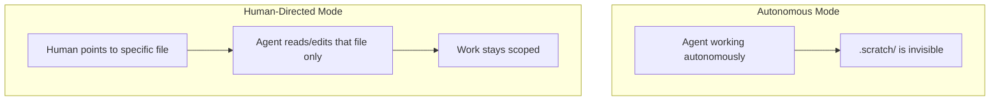
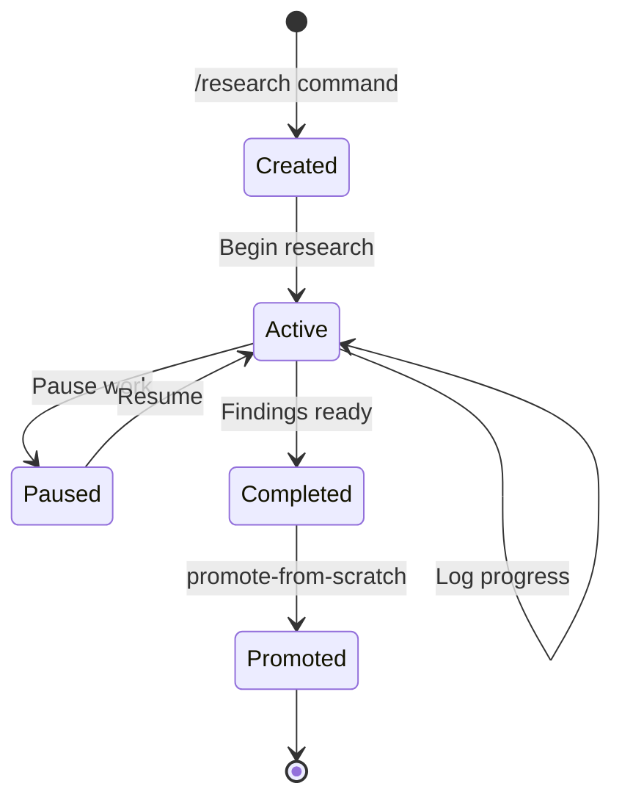
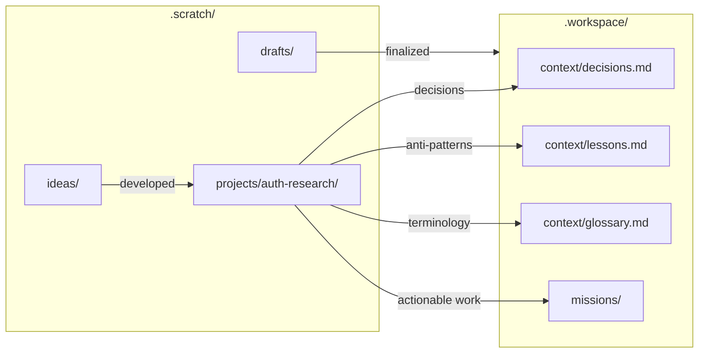
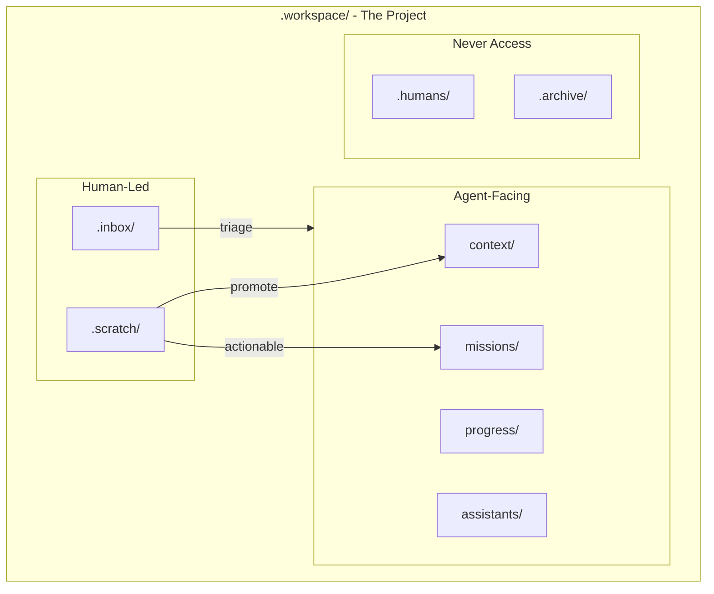

# Workspace Scratch Area

The `.scratch/` directory is a **persistent, human-led space** for thinking, research, and exploration. Unlike the main workspace which is agent-facing, `.scratch/` requires explicit human direction for agent collaboration.

---

## Purpose

The scratch area serves needs that don't fit in agent-facing directories:

| Need | Solution |
|------|----------|
| Conduct structured research | `projects/` |
| Explore ideas before committing | `ideas/` |
| Draft content not ready for agents | `drafts/` |
| Keep daily notes | `daily/` |
| Save snippets for reference | `clips/` |

---

## Directory Structure

```text
.scratch/
├── README.md       # Purpose and rules
├── projects/       # Isolated research projects
│   ├── registry.md
│   ├── _template/
│   └── <project-slug>/
│       ├── project.md
│       ├── log.md
│       └── [additional files]
├── ideas/          # Brainstorming and possibilities
├── daily/          # Date-based notes (YYYY-MM-DD.md)
├── drafts/         # Work-in-progress documents
└── clips/          # Snippets and fragments
```

---

## Autonomy Rules

**This directory is human-led. Agents must not access it autonomously.**



| Mode | Agent Behavior |
|------|----------------|
| **Autonomous** | MUST NOT scan, read, or write to `.scratch/**` |
| **Human-directed** | MAY access specific files when human explicitly points to them |

### Valid Collaboration

```text
Human: "Review .scratch/projects/auth-research/findings.md and help organize"
Agent: [Reads specific file, assists as directed]
```

### Invalid Autonomous Action

```text
Agent: "I found relevant notes in .scratch/..."
→ VIOLATION: Agent scanned .scratch/ without human direction
```

---

## Research Projects

For **structured, multi-session research** with isolated scope, memory, and continuity, use the `projects/` directory.

### What is a Research Project?

A research project is a **scaled-down workspace** for human-led investigation:

| Workspace Component | Research Project Equivalent |
|---------------------|----------------------------|
| `scope.md` | `project.md` (Goal, Scope, Questions) |
| `progress/log.md` | `log.md` (Session notes) |
| `context/decisions.md` | Findings Summary in `project.md` |
| `progress/tasks.json` | Key Questions in `project.md` |

### When to Use Projects

| Scenario | Use Project? | Alternative |
|----------|--------------|-------------|
| Multi-session investigation | Yes | — |
| Need isolated context/findings | Yes | — |
| Will eventually promote findings | Yes | — |
| Quick one-off exploration | No | Use `ideas/` |
| Daily notes or drafts | No | Use `daily/` or `drafts/` |

### Project Structure

```text
projects/<slug>/
├── project.md     # Goal, scope, questions, status, findings
├── log.md         # Progress log with session notes
├── sources.md     # References and links (optional)
├── findings.md    # Detailed findings (optional)
└── notes/         # Free-form research notes (optional)
```

### Project Lifecycle



| Status | Description |
|--------|-------------|
| **Active** | Research in progress |
| **Paused** | Temporarily on hold (document reason) |
| **Completed** | Findings summarized, ready to promote |
| **Promoted** | Insights published to agent-facing locations |

### Creating a Project

**Via command (works in Cursor, Claude Code, Codex, etc.):**
```text
/research <slug>
```

**Manually:**
1. Copy `projects/_template/` to `projects/<slug>/`
2. Fill in `project.md` with goal, scope, questions
3. Add entry to `projects/registry.md`

See `.workspace/workflows/scratch/create-research-project/00-overview.md` for the full workflow.

### Project Registry

The `projects/registry.md` tracks all research projects:

| Section | Purpose |
|---------|---------|
| **Active** | Currently being researched |
| **Paused** | On hold with documented reason |
| **Completed** | Finished and promoted |

---

## Promotion Workflow

When insights mature, promote them to agent-facing locations.



### Where to Promote

| Content Type | Destination |
|--------------|-------------|
| Design decisions | `context/decisions.md` |
| Anti-patterns discovered | `context/lessons.md` |
| New terminology | `context/glossary.md` |
| Actionable work identified | Create mission in `missions/` |
| Finalized constraints | `context/constraints.md` |

### Promotion Rules

1. **Never copy verbatim** — Summarize and distill
2. **Update project status** — Mark as Promoted in registry
3. **Note destination** — Record where findings went
4. **Keep original** — Research remains for reference

Use `workflows/promote-from-scratch.md` for the structured promotion workflow.

---

## Relationship to Workspace



| Directory | Autonomy | Persistence |
|-----------|----------|-------------|
| Agent-facing dirs | Autonomous access | Permanent |
| `.scratch/` | Human-led only | Persistent |
| `.inbox/` | Human-led only | Temporary |
| `.humans/`, `.archive/` | Never access | Reference only |

---

## Best Practices

### For Daily Use

- Use `daily/YYYY-MM-DD.md` for stream-of-consciousness notes
- Use `ideas/` for quick "what if" explorations (may evolve into projects)
- Use `clips/` for reference snippets

### For Research

- All research belongs in `projects/`
- Create a project when research will span multiple sessions
- Log progress in `log.md` at end of each session
- Summarize findings as you go in `project.md`
- Promote when insights are ready, not when research is "done"

### For Collaboration

- Point agents to specific files when you need help
- Keep agent work scoped to referenced files
- Use promote workflow to publish polished insights

---

## See Also

- [Research Projects](./projects.md) — Dedicated documentation for research projects
- [Dot-Prefixed Directories](./dot-files.md) — Autonomy rules for all human-led directories
- [README.md](./README.md) — Canonical workspace structure
- [Missions](./missions.md) — Agent-facing sub-projects (compare to research projects)
- `.workspace/.scratch/README.md` — In-workspace documentation
- `.workspace/workflows/scratch/create-research-project/00-overview.md` — Project creation workflow
- `.workspace/workflows/promote-from-scratch.md` — Promotion workflow
