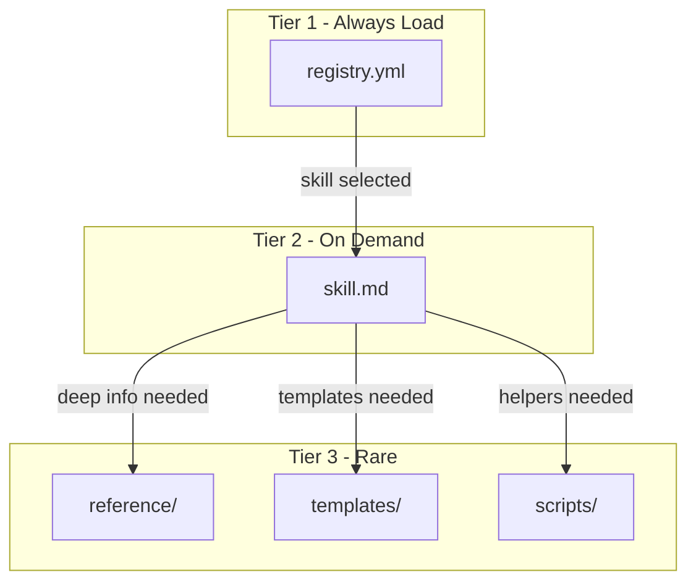
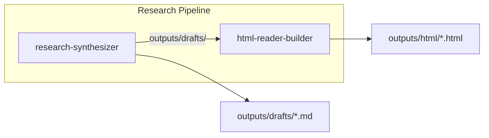

# Workspace Skills

Skills are **composable capability units** that define clear inputs, outputs, and behavior. They enable deterministic invocation, pipeline composition, and auditable execution.

---

## What is a Skill?

A skill is a packaged capability that:

- Has **defined inputs and outputs** (enables composition)
- Supports **deterministic invocation** (commands) and probabilistic triggers
- Produces **auditable results** (run logs)
- Follows **progressive disclosure** (registry first, then skill details)

Skills adapt the [Universal Skills](https://github.com/anthropics/skills) pattern to workspace conventions.

---

## Skills vs Other Artifact Types

| Aspect | Skill | Assistant | Workflow | Prompt |
|--------|-------|-----------|----------|--------|
| **Purpose** | Composable capability | Focused specialist | Multi-step procedure | Task template |
| **I/O contract** | Yes (typed paths) | No | No | No |
| **Composable** | Yes (pipelines) | No | Loosely | No |
| **Logging** | Required | No | No | No |
| **Invocation** | `/command` or explicit | `@mention` | Reference | Reference |
| **State** | Stateless + logs | Stateless | Stateless | Stateless |

**Decision heuristic:**
- Need **composable operations** with defined I/O? → Skill
- Need a **focused specialist** for scoped tasks? → Assistant
- Need a **multi-step procedure** to follow? → Workflow
- Need a **judgment-based template**? → Prompt

---

## Directory Structure

```text
.workspace/skills/
├── README.md              # Usage guide
├── registry.yml           # Skill catalog (progressive disclosure)
├── _template/
│   ├── SKILL.md           # New skill template
│   └── scripts/           # Executable helpers template
├── <skill-id>/
│   ├── SKILL.md           # Skill definition
│   ├── templates/         # Skill-specific templates (optional)
│   ├── reference/         # Detailed reference material (optional)
│   └── scripts/           # Executable helpers (optional)
├── sources/               # Standard input folder
├── outputs/
│   ├── drafts/            # Initial outputs
│   ├── refined/           # Processed outputs
│   ├── html/              # HTML outputs
│   ├── social/            # Social media outputs
│   └── assets/            # Generated assets
└── logs/
    └── runs/              # Execution logs
```

---

## Registry Format

The `registry.yml` serves as a compact catalog for progressive disclosure. Agents read this first, then load individual skills only when needed.

```yaml
schema_version: "1.1"
default: null

routing:
  explicit_command_required: false
  ambiguity_resolution: "ask"  # ask | first_match | most_specific

skills:
  - id: research-synthesizer
    name: Research Synthesizer
    path: research-synthesizer/
    version: "1.0.0"
    summary: "Synthesize scattered research notes into coherent findings."
    commands:
      - /synthesize-research
    explicit_call_patterns:
      - "use skill: research-synthesizer"
    triggers:
      - "synthesize my research"
    inputs:
      - path: "sources/*.md"
        type: folder
    outputs:
      - path: "outputs/drafts/*.md"
        type: markdown
        format: markdown
        determinism: stable
    requires:
      tools:
        - filesystem.read
        - filesystem.write.outputs
    depends_on: []

pipelines:
  - id: research-to-publish
    name: Research to Publish
    description: "Research → Synthesize → Build HTML"
    steps:
      - research-synthesizer
      - html-reader-builder
```

### Registry Schema

| Field | Required | Description |
|-------|----------|-------------|
| `id` | Yes | Stable kebab-case identifier |
| `name` | Yes | Human-readable name |
| `path` | Yes | Directory containing skill.md |
| `version` | Yes | Semantic version |
| `summary` | Yes | One-line description for routing |
| `commands` | Recommended | Explicit /commands for deterministic invocation |
| `explicit_call_patterns` | Recommended | Patterns like "use skill: skill-id" |
| `triggers` | Optional | Natural language patterns for probabilistic matching |
| `inputs` | Yes | Input path patterns with type |
| `outputs` | Yes | Output path patterns with type, format, determinism |
| `requires.tools` | Optional | Required capabilities |
| `depends_on` | Optional | Skills that should run first |

---

## Skill Definition Format

Each `SKILL.md` follows this structure:

```markdown
---
# Identity
id: "skill-id"
name: "Skill Name"
version: "1.0.0"
summary: "One-line summary for routing."
description: |
  Longer description with usage context.
access: agent

# Provenance
author:
  name: "Author Name"
  contact: "email/handle"
created_at: "YYYY-MM-DD"
updated_at: "YYYY-MM-DD"
license: "MIT"

# Invocation
commands:
  - /command
explicit_call_patterns:
  - "use skill: skill-id"
triggers:
  - "natural language"

# I/O Contract
inputs:
  - name: input_name
    type: file
    required: true
    path_hint: "sources/*.md"
    schema: null

outputs:
  - name: output_name
    type: markdown
    path: "outputs/drafts/*.md"
    format: "markdown"
    determinism: "stable"

# Dependencies
requires:
  tools: []
  packages: []
  services: []
depends_on: []

# Safety
safety:
  tool_policy:
    mode: deny-by-default
    allowed:
      - filesystem.read
      - filesystem.write.outputs
  file_policy:
    write_scope:
      - ".workspace/skills/outputs/**"
      - ".workspace/skills/logs/**"
    destructive_actions: never

# Behavior
behavior:
  goals:
    - "Primary goal"
  steps:
    - "Read inputs"
    - "Process"
    - "Write outputs"
    - "Write run log"

# Validation
acceptance_criteria:
  - "Criterion 1"

# Examples
examples:
  - input: "sources/topic.md"
    invocation: "/command sources/topic.md"
    output: "outputs/drafts/topic.md"
    description: "Example usage"
---

# Skill: skill-id

## Mission
[One sentence]

## Behavior
### Goals
1. [Goal]

### Steps
1. [Step]
2. Write output
3. Write run log

## Boundaries
- [Constraint]

## When to Escalate
- [Condition]

## References
For detailed info, see `reference/` directory.
For executable helpers, see `scripts/` directory.
```

### Skill Schema Fields

| Section | Field | Required | Description |
|---------|-------|----------|-------------|
| Identity | `id` | Yes | Stable kebab-case identifier |
| Identity | `name` | Yes | Human-readable name |
| Identity | `version` | Yes | Semantic version |
| Identity | `summary` | Yes | One-line routing hint |
| Identity | `description` | Yes | Detailed usage context |
| Provenance | `author` | Recommended | Author name and contact |
| Provenance | `created_at` | Recommended | Creation date |
| Provenance | `updated_at` | Recommended | Last update date |
| Provenance | `license` | Recommended | License (e.g., MIT) |
| Invocation | `commands` | Recommended | /command triggers |
| Invocation | `explicit_call_patterns` | Recommended | "use skill: id" patterns |
| Invocation | `triggers` | Optional | Natural language triggers |
| I/O | `inputs[].type` | Yes | file, text, folder, glob, json, yaml |
| I/O | `outputs[].type` | Yes | markdown, html, json, images, audio, log |
| I/O | `outputs[].format` | Recommended | Specific format details |
| I/O | `outputs[].determinism` | Recommended | stable, variable, non-deterministic |
| Safety | `tool_policy.mode` | Yes | deny-by-default or allow-by-default |
| Safety | `file_policy.write_scope` | Yes | Allowed write paths |
| Behavior | `goals` | Yes | What the skill achieves |
| Behavior | `steps` | Yes | Execution steps |
| Validation | `acceptance_criteria` | Yes | Success criteria |
| Examples | `examples[]` | Recommended | Input/output examples |

---

## Progressive Disclosure

Skills follow a three-tier disclosure model:



| Tier | Content | When Loaded |
|------|---------|-------------|
| **Tier 1** | `registry.yml` | Always (routing) |
| **Tier 2** | `<skill>/SKILL.md` | When skill is selected |
| **Tier 3** | `reference/`, `templates/`, `scripts/` | When specific info needed |

### Routing Rules

1. If explicit command (`/skill-name`), route directly
2. If `use skill: <id>` pattern, route directly
3. Otherwise, match against triggers in registry
4. If ambiguous, ask one clarifying question or propose top 2 options

---

## Invocation

### Explicit Commands (Recommended)

```text
/synthesize-research .scratch/projects/topic/
```

### Explicit Pattern

```text
use skill: research-synthesizer
```

### Generic Invocation

```text
/use-skill research-synthesizer .scratch/projects/topic/
```

### Trigger Matching (Probabilistic)

```text
"synthesize my research notes"
→ Matches trigger "synthesize my research"
→ Routes to research-synthesizer
```

---

## Skill Pipelines

Skills compose via outputs becoming inputs for downstream skills:



Define pipelines in `registry.yml`:

```yaml
pipelines:
  - id: research-to-publish
    name: Research to Publish
    description: "Synthesize research and build HTML reader"
    steps:
      - research-synthesizer
      - html-reader-builder
```

---

## Run Logging

Every skill execution should produce a log at:
`.workspace/skills/logs/runs/<timestamp>-<skill-id>.md`

```markdown
---
run_id: 2025-01-12T10-31-00Z-research-synthesizer
skill_id: research-synthesizer
skill_version: "1.0.0"
status: success  # success | partial | failed
started_at: 2025-01-12T10:31:00Z
ended_at: 2025-01-12T10:44:12Z

inputs:
  - .scratch/projects/auth-patterns/
outputs:
  - .workspace/skills/outputs/drafts/auth-patterns-synthesis.md
tools_used:
  - filesystem.read
  - filesystem.write.outputs
external_calls:
  - type: web.search
    purpose: "verify terminology"
---

## Summary

- Synthesized auth patterns research
- Identified 5 key themes

## Notes

- Flagged 2 contradictions for human review
```

---

## Safety Policies

Skills declare safety constraints in frontmatter:

### Tool Policy

```yaml
safety:
  tool_policy:
    mode: deny-by-default  # or allow-by-default
    allowed:
      - filesystem.read
      - filesystem.write.outputs
      - web.search
```

### File Policy

```yaml
safety:
  file_policy:
    write_scope:
      - ".workspace/skills/outputs/**"
      - ".workspace/skills/logs/**"
    destructive_actions: never  # or prompt
```

**Default stance:** `deny-by-default` with explicit allowlist.

---

## Creating a Skill

### Via Command

```text
/create-skill <skill-id>
```

This will:
1. Copy `_template/` to `skills/<skill-id>/`
2. Initialize `SKILL.md` with placeholder content
3. Create `templates/`, `reference/`, `scripts/` directories
4. Add entry to `registry.yml`
5. Update `catalog.md` skills table

### Manually

1. Copy `skills/_template/` to `skills/<skill-id>/`
2. Update `SKILL.md` with full definition
3. Add entry to `registry.yml`
4. Update `.workspace/catalog.md` skills table

---

## When to Create a Skill

| Scenario | Create Skill? | Alternative |
|----------|---------------|-------------|
| Repeated capability with defined I/O | Yes | — |
| Need to chain operations (pipelines) | Yes | — |
| Require auditability (run logs) | Yes | — |
| One-off task requiring judgment | No | Use Prompt |
| Focused specialist role | No | Use Assistant |
| Complex multi-step procedure | No | Use Workflow |

---

## Integration with Projects

Research projects (`.scratch/projects/`) can leverage skills throughout their lifecycle.

### Research Phases and Skills

| Phase | Recommended Tool | Why |
|-------|------------------|-----|
| **Gathering** | Prompt | Flexible, judgment-based |
| **Assessment** | Prompt | Context-dependent |
| **Synthesis** | **Skill** (`/synthesize-research`) | Structured output, audit trail |
| **Evaluation** | Prompt | Judgment-based |
| **Promotion** | Prompt | Context-dependent |

### Invoking Skills from Projects

```text
/synthesize-research .scratch/projects/my-research/
```

### Integrating Skill Outputs

After running a skill, integrate outputs back into your project:

1. **Reference in `log.md`:**
   ```markdown
   ## [Date]
   **Skill run:** `/synthesize-research`
   **Output:** `.workspace/skills/outputs/drafts/my-research-synthesis.md`
   **Review notes:** [Observations]
   ```

2. **Update `project.md`** Findings Summary with key insights

3. **Use synthesis** as input for evaluation phase

### Project Resources File

Each project's `resources.md` lists available skills:

```markdown
## Available Skills

| Skill | Command | Phase | Use For |
|-------|---------|-------|---------|
| research-synthesizer | `/synthesize-research` | Synthesis | Consolidate findings |
```

See [Research Projects](./projects.md) for full integration details.

---

## Host Adapters

Skills work across different agent hosts via symlinks from standard harness folders:

```text
.workspace/skills/                      # Source of truth
├── research-synthesizer/
│   └── SKILL.md

.claude/skills/                         # Claude Code (symlinks)
└── research-synthesizer -> ../../.workspace/skills/research-synthesizer

.cursor/skills/                         # Cursor (symlinks)
└── research-synthesizer -> ../../.workspace/skills/research-synthesizer

.codex/skills/                          # Codex (symlinks)
└── research-synthesizer -> ../../.workspace/skills/research-synthesizer
```

**Setup:** Run `.workspace/skills/scripts/setup-harness-links.sh` to create symlinks.

**Registry:** `CLAUDE.md` points to `registry.yml` for progressive disclosure (workspace-specific).

---

## See Also

- [README.md](./README.md) — Canonical workspace structure
- [Assistants](./assistants.md) — Focused specialists
- [Workflows](./workflows.md) — Multi-step procedures
- [Prompts](./prompts.md) — Task templates
- [Taxonomy](./taxonomy.md) — Artifact type classification
- [Research Projects](./projects.md) — Human-led investigations
- `.workspace/skills/README.md` — In-workspace documentation
