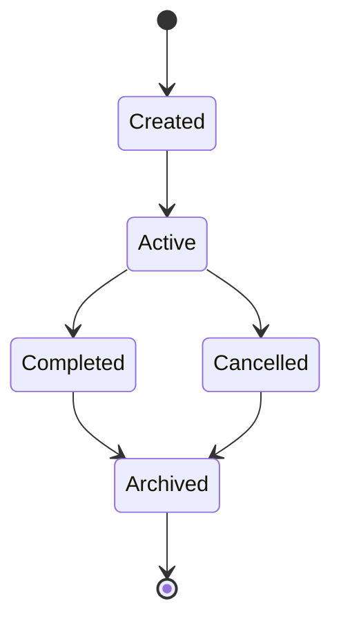

# Workspace Artifact Taxonomy

This document clarifies the distinctions between workspace artifact types: **commands**, **workflows**, **prompts**, and their relationship to **Cursor commands**. It also calls out **FlowKit flow assets** because they can look similar to workspace workflows but are owned and executed differently.

---

## Quick Reference

| Type | Location | Nature | When to Use |
|------|----------|--------|-------------|
| **Cursor Command** | `.cursor/commands/` | User entry point | IDE integration needed |
| **Workspace Command** | `.workspace/commands/` | Deterministic procedure | Atomic, repeatable operation |
| **Workspace Workflow** | `.workspace/workflows/` | Multi-step procedure | Complex, sequential operation |
| **Workspace Prompt** | `.workspace/prompts/` | Task template | Context-dependent, requires judgment |
| **Assistant** | `.workspace/assistants/` | Focused specialist | Scoped, delegatable tasks |
| **Mission** | `.workspace/missions/` | Sub-project | Isolated, time-bounded work |
| **FlowKit Flow (repo-wide)** | `packages/workflows/` | Runnable flow assets | Needs FlowKit runtime/CI/Studio execution |

---

## The Key Distinctions

### Executable vs Template

| Category | Types | Characteristics |
|----------|-------|-----------------|
| **Executable** | Commands, Workflows | Agent follows steps exactly; deterministic output |
| **Template** | Prompts | Agent adapts to situation; output varies |

### Atomic vs Multi-Step

| Category | Types | Characteristics |
|----------|-------|-----------------|
| **Atomic** | Commands | Single action; completes in one operation |
| **Multi-Step** | Workflows | Sequential steps; may span multiple actions |

---

## Terminology

| Term | Location | Triggered By | Scope |
|------|----------|--------------|-------|
| **Cursor Command** | `.cursor/commands/` | User typing `/command-name` in chat | Repository-wide |
| **Workspace Command** | `.workspace/commands/` | Cursor command delegation or direct agent reference | Workspace-specific, atomic |
| **Workspace Workflow** | `.workspace/workflows/` | Cursor command delegation or direct agent reference | Workspace-specific, multi-step |
| **Workspace Prompt** | `.workspace/prompts/` | Direct agent reference | Workspace-specific, template |
| **FlowKit Flow** | `packages/workflows/` | `pnpm flowkit:run packages/workflows/<flowId>/config.flow.json` or `/run-flow @packages/workflows/<flowId>/config.flow.json` | Repository-wide |

---

## Cursor Commands

**Location:** `.cursor/commands/*.md`

Repo-wide entry points triggered by users typing `/command-name` in Cursor chat. These delegate to workspace commands or workflows.

### Characteristics

- IDE integration (shows in command palette and autocomplete)
- Repository-wide scope
- User-initiated
- Typically brief: usage syntax + reference to implementation

---

## Workspace Commands

**Location:** `.workspace/commands/*.md`

Workspace-specific atomic operations that operate on artifacts in the workspace's parent directory.

See [commands.md](./commands.md) for full details and examples.

### Characteristics

- Single-action, atomic operations
- Workspace-specific scope
- Can be triggered by Cursor commands or directly by agents
- No IDE integration (unless wrapped by a Cursor command)

### Examples

- `format-for-publication.md` — Single formatting action
- `validate-frontmatter.md` — Single validation check
- `lint-conventions.md` — Single lint pass

---

## Workspace Workflows

**Location:** `.workspace/workflows/*.md` or `.workspace/workflows/<name>/`

Multi-step procedures that operate on artifacts in the workspace's parent directory.

See [workflows.md](./workflows.md) for full details and examples.

### Characteristics

- Multi-step procedures
- Workspace-specific scope
- Can be triggered by Cursor commands or referenced by agents
- No IDE integration (unless wrapped by a Cursor command)

### Examples

- `audit-and-refactor.md` — Multi-step audit procedure
- `publish-to-docs.md` — Multi-step publication workflow
- `create-workspace/` — Subdirectory with sequential steps

---

## Workspace Prompts

**Location:** `.workspace/prompts/*.md`

Task templates that guide agents through context-dependent work requiring judgment or parameterization.

See [prompts.md](./prompts.md) for full details.

### Characteristics

- Templates, not executable procedures
- Require context or parameters from user/situation
- Output varies based on judgment
- Agent adapts template to the specific case

### Examples

- `audit-content.md` — Review content (criteria vary)
- `improve-clarity.md` — Enhance readability (subjective)
- `summarize-changes.md` — Summarize work (context-dependent)

### Command vs Prompt Decision

See `.workspace/catalog.md#command-vs-prompt-decision` for the canonical decision logic.

---

## Assistants

**Location:** `.workspace/assistants/<name>/assistant.md`

Focused specialists that serve agents or humans for scoped, one-off tasks.

See [assistants.md](./assistants.md) for full details.

### Characteristics

- Invoked via `@mention` or agent delegation
- Stateless (inherits context from caller)
- Produces structured output in defined format
- Knows when to escalate

### Assistant vs Agent

| Characteristic | Agent | Assistant |
|----------------|-------|-----------|
| Autonomy | Autonomous, long-running | Invoked for specific tasks |
| Lifecycle | Persistent across sessions | Stateless |
| Scope | Orchestrates broad work | Focused, scoped operations |
| Examples | Planner, Builder, Verifier | Reviewer, Refactor, Docs |

### When to Create an Assistant

- Repeated specialized task
- Task needs consistent output format
- Agent should be able to delegate

---

## Missions

**Location:** `.workspace/missions/<slug>/`

Time-bounded sub-projects with isolated progress tracking.

See [missions.md](./missions.md) for full details.

### Characteristics

- Has specific goal and success criteria
- Has an owner (agent, assistant, or human)
- Maintains isolated progress (`tasks.json`, `log.md`)
- Lifecycle: created → active → completed → archived

### Mission Lifecycle

### When to Create a Mission

| Scenario | Use Mission? |
|----------|--------------|
| Parallel workstreams | Yes |
| Time-bounded initiative | Yes |
| Delegatable unit of work | Yes |
| Single task, one session | No |
| Different codebase area | No (use nested workspace) |

---

## FlowKit Flows (Repo-Wide)

**Location:** `packages/workflows/<flowId>/`

FlowKit flows are **executable flow assets** run by FlowKit (CLI + LangGraph runtime), not workspace workflows.

### Characteristics

- **Machine-wired execution** — flow graphs and semantics are defined by `config.flow.json` + `manifest.yaml`.
- **Repo-wide scope** — used by the FlowKit CLI, CI automation, and LangGraph Studio.
- **Different metadata model** — canonical prompt frontmatter stays minimal; wiring and classification live in config/manifest.

### Choosing Between `.workspace/workflows/**` and `packages/workflows/**`

Use this guide when you're deciding *where* a multi-step workflow belongs:

| Dimension | `.workspace/workflows/**` (Workspace Workflow) | `packages/workflows/**` (FlowKit Flow Assets) |
|---|---|---|
| Primary purpose | Human/agent **procedure** (“follow these steps”) | Runnable **execution contract** (config + manifest + prompts) |
| How it runs | An agent reads Markdown and follows steps | FlowKit CLI + runtime execute a manifest-defined graph |
| Entry points | Direct agent reference; optional `/…` wrapper via `.cursor/commands/*` | `pnpm flowkit:run …/config.flow.json`; `/run-flow @…/config.flow.json`; apps/CI calling the runner |
| Strengths | Low ceremony; high readability; great for IDE UX and runbooks | Deterministic ordering; structured state/output; easier automation/CI/Studio; clearer “semantics” ownership |
| Weaknesses | Harder to automate reliably; “determinism” depends on agent compliance; limited structured observability | More setup/maintenance; more concepts (config/manifest/runtime); overkill for simple runbooks |
| Best for | Workspace management, procedural checklists, thin tool wrappers | Long-running / repeatable flows, evaluators/assessments, any workflow you want to run from multiple surfaces |

**Rule of thumb**

- If it must be runnable/auditable as a system (CLI/CI/runtime/Studio) → `packages/workflows/<flowId>/`
- If it’s primarily guidance/UX (“how we do this here”, optionally wrapped as a Cursor command) → `.workspace/workflows/**`

See `docs/kits/planning-and-orchestration/flowkit/guide.md` for the ownership map and entrypoints.

---

## Decision Guidance

All decision flowcharts and tables are maintained in `.workspace/catalog.md#decision-guidance` as the single source of truth. This includes:

- **Artifact Type Decision** — When to create Cursor commands, workspace commands, workflows, or prompts
- **Command vs Prompt Decision** — Distinguishing deterministic operations from templates
- **Workspace Modification Decision** — Choosing between create, update, migrate, and evaluate

See `.workspace/catalog.md` for complete decision flowcharts and examples.

---

## File Locations Summary

| Type | Location | Scope | IDE Integration |
|------|----------|-------|-----------------|
| Cursor Commands | `.cursor/commands/*.md` | Repository-wide | Yes |
| Workspace Commands | `.workspace/commands/*.md` | This workspace only | No (unless wrapped) |
| Workspace Workflows | `.workspace/workflows/*.md` | This workspace only | No (unless wrapped) |
| Prompts | `.workspace/prompts/*.md` | Task templates | No |
| Assistants | `.workspace/assistants/<name>/` | Focused specialists | Via @mention |
| Missions | `.workspace/missions/<slug>/` | Sub-projects | No |
| Checklists | `.workspace/checklists/*.md` | Quality gates | No |
| FlowKit Flow assets | `packages/workflows/<flowId>/` | Repository-wide | No (but can be wrapped via `/run-flow`) |

---

## See Also

- [Workspace Commands](./commands.md) — Deterministic atomic operations
- [Workspace Workflows](./workflows.md) — Multi-step procedures
- [Workspace Prompts](./prompts.md) — Context-dependent task templates
- [Assistants](./assistants.md) — Focused specialists for scoped tasks
- [Missions](./missions.md) — Time-bounded sub-projects
- [Checklists](./checklists.md) — Quality gates
- [README.md](./README.md) — Canonical workspace structure reference
