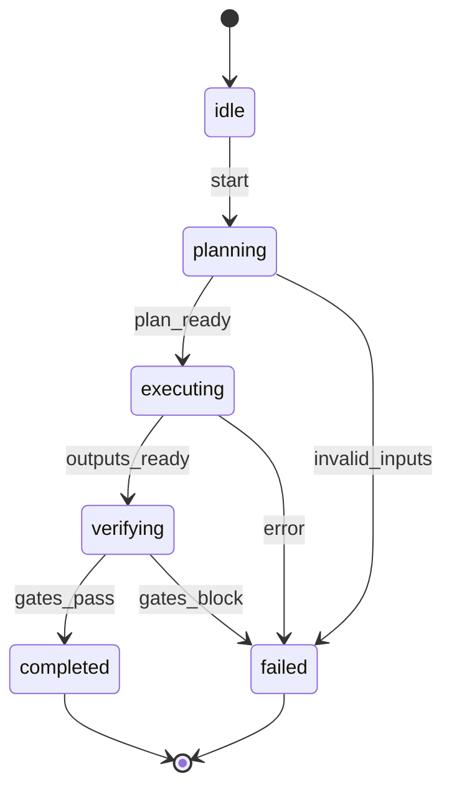

# AI-ToolKit — The AI-Powered, Opinionated, Unified Toolset for Small Teams

A modular, local-first toolkit that lets a tiny team ship outsized results with AI. It’s opinionated where it matters (interfaces, safety, structure) and flexible everywhere else. Everything is a **kit** with a crisp purpose, clear inputs/outputs, and predictable integration points.

> Terminology note: In this handbook, “SpecKit” refers to our AI‑Toolkit kit (code `speckit`) that wraps GitHub’s Spec Kit. Mentions of the upstream tool explicitly use “GitHub’s Spec Kit”.

---

## Runtime Compatibility (Node vs Edge)

Choose the runtime that preserves determinism, safety, and performance while keeping complexity low.

- Node (default)
  - Recommended for: AgentKit, ToolKit (non‑trivial ops), EvalKit, TestKit, ComplianceKit, PatchKit/ReleaseKit integrations.
  - Rationale: richer I/O, longer execution windows, broader library support, predictable export of OTel.
- Edge (selective)
  - Recommended for: FlagKit evaluation, HeadersKit, minimal ObservaKit correlation on request boundaries.
  - Constraints: avoid heavy dependencies; keep attribute cardinality low; prefer short synchronous spans.
- Telemetry
  - Edge → OTLP HTTP is supported; fall back to buffered export when offline per ObservaKit offline mode.
  - Always include `run.id`, `kit.name`, `kit.version`, `stage` to correlate across runtimes.
- Caching & Next.js 15+/16
  - Defaults: Next.js 15+/16 sets `no-store` for `fetch` and GET Route Handlers. Kits MUST opt‑in explicitly to caching (`force-static`, `default-cache`, or headers) and pair with stable `cacheKey` derivation.
  - Do not leak TTLs into outputs or filenames; TTL only influences validity, never content. Record `determinism.cacheKey` and, when applicable, `cache.ttl` in the run record.
  - Edge surfaces should remain read‑mostly and short‑lived; long or stateful work belongs in Node/worker with spans covering the job lifecycle.
- Background work
  - Schedule non‑blocking side‑effects using Next.js `next/after` (or platform jobs) to keep user paths fast and reliable.
  - Long‑running work belongs in Node (or a worker) with ObservaKit spans covering the job lifecycle.

### Next.js 15+/16 & React 19 Integration (Guidance)

- Server Actions (React 19):
  - Use for deterministic, typed mutations invoked from UI surfaces. Keep business logic in kits and call Server Actions as thin controllers.
  - Emit `kit.<kit>.execute` spans inside the action; propagate `run.id` via headers or form data; print one‑line JSON result to logs.
  - Prefer `useActionState` for form state; pair with optimistic UI using `useOptimistic` only for clearly idempotent updates.
- Partial Prerendering (PPR) and Streaming:
  - Opt pages/layouts into PPR selectively. Keep dynamic islands behind `Suspense` with clear span boundaries around data fetches.
  - Respect caching defaults (`no-store`); when opting into caching (`force-static`, `revalidate`), derive a stable `cacheKey` and record it in run records.
- Edge vs Node boundaries:
  - Evaluate feature flags at the Edge (Vercel Flags/Edge Config) and keep Edge handlers read‑mostly with low‑cardinality attributes.
  - Keep heavy or stateful work (AI calls, indexing, long I/O) in Node/worker; schedule follow‑ups using `next/after`.
- Data fetching:
  - Use React 19 `use` with the extended Next.js `fetch` where appropriate; memoize per‑request; avoid cross‑request mutable caches.
  - Default to `no-store`; explicitly opt in to caching and revalidation policies when stability is guaranteed.
- Hydration and security:
  - Heed improved hydration error messages; fix server/client mismatches before enabling caching.
  - Enforce security headers via platform or middleware; never expose secrets to the client; evaluate flags server‑side.
  - For Next.js SSR/Route Handlers, prefer `next-safe-middleware` for CSP and core headers; complement with platform-level headers on Vercel and avoid duplicative/conflicting policies.

- Bundling & cold starts:
  - Use Next.js 15+/16 bundling controls to externalize or prebundle heavy packages where appropriate. Avoid bundling large libraries on the Edge; default heavy or stateful libs to Node/Serverless surfaces.
  - Measure cold starts and bundle size deltas with ObservaKit spans/metrics; only introduce bundling changes when they materially reduce latency without increasing operational complexity.

#### Astro (SSG/SSR) Integration (Guidance)

- Surfaces:
  - Prefer SSG for content‑first properties (docs/marketing); use SSR adapters only when runtime dynamics are required.
  - Evaluate feature flags server‑side (build‑time injection for SSG; Edge/API for SSR). Avoid client‑side `process.env`.
- Caching & data:
  - Treat SSG pages as static; pair dynamic islands with API routes and `CacheKit` for memoized reads. Do not embed secrets in generated assets.
  - For SSR, follow the same defaults as Next.js 15+/16 (no‑store by default); opt‑in to caching explicitly and record `determinism.cacheKey` in run records.
- Observability:
  - Emit OTel spans from SSR adapters or API routes; for pure SSG, rely on platform logs and downstream traces originating from invoked APIs.
  - Keep attribute cardinality low; include `run.id` where requests are tied to kit executions.
- Security:
  - Enforce CSP and core headers at the platform level for SSG; complement with SSR middleware only when necessary. Route secret access exclusively via **VaultKit**.

#### UI & Collaboration Surfaces (Guidance)

- Surfaces:
  - Use **UIkit** for lightweight review/approval/search surfaces. Compose small, deterministic views that call Server Actions as thin controllers over kits.
  - Keep UI components stateless where possible; move orchestration and validation to Application Use Cases that call kits.
- Interactions:
  - Wire actions through Server Actions with `useActionState` and optimistic updates only when the operation is idempotent and safely reversible.
  - Always emit ObservaKit spans around user-triggered actions and include `run.id` for correlation.
- Safety & accessibility:
  - Never expose secrets or flag values to the client; evaluate flags server-side and inject only non-sensitive booleans as needed.
  - Adopt **A11yKit** checks; ensure semantic HTML and ARIA where appropriate; treat accessibility violations as policy/eval failures for surfaces subject to review.

## The Problem with Multi-Agent Workflows

In today’s software-development landscape, small teams are under pressure to deliver ever more features, faster, and with higher reliability. At the same time, the rise of multi-agent AI workflows brings enormous promise — but also significant, often unaddressed risks.

- When multiple AI agents coordinate without strong structure, teams often encounter duplication of effort, circular loops or dead-locks in reasoning.
- The lack of clear role definitions, shared memory/context, and orchestration leads to brittle systems that break under pressure.
- Agents can complete tasks but still fail to resolve the correct intent, or produce technically plausible but contextually inappropriate results.
- Without guardrails and observability, multi-agent systems magnify risks of misalignment, cascading errors, non-deterministic outcomes, and reduced trust in AI-powered workflows.
- Complexity often dominates: tool proliferation, tangled interfaces, scattered data flows — resulting in slower development, harder debugging, and compromised speed or safety.

### Delivering on the Promise of Multi-Agent Workflows And AI-Accelerated Development

We envision a modular, local-first toolkit that empowers a tiny team to ship outsized results with AI. This vision rests on delivering **clear, predictable building blocks (kits)** that enforce structure where necessary, yet remain flexible elsewhere. Every element is aligned with the broader Harmony Framework — prioritising simplicity, safety-by-default, spec-first design, and rapid iteration. By transforming agentic workflows from fragile experiments into predictable, observable components, teams can scale AI-assisted development with confidence.

---

## The Purpose of the AI-Toolkit

The **AI-Toolkit** exists to accelerate software development through AI-powered automation, enabling small teams to deliver high-quality, safe, and reliable software at speed. It does this by equipping AI agents with deterministic, **guard-railed tools** — called **kits** — that bring structure, visibility, and repeatability into what would otherwise be loosely-controlled workflows.

Each kit embodies a single, crisp purpose, with clear inputs, outputs, and well-defined integration points. This ensures that AI agents operate in a **transparent, reproducible, and controlled** environment rather than drifting into undocumented or unpredictable behaviour. By guiding agents down **guarded paths**, the toolkit ensures safety, accuracy, quality, and speed — all while reducing cognitive and operational load for developers.

In alignment with Harmony’s principles of **simplicity over complexity**, **spec-first rather than ceremony**, and **flow over fluff**, the AI-Toolkit is opinionated where it matters (interfaces, safety, structure) and flexible everywhere else. It favours minimal viable complexity — only introducing additional layers when required by SLOs, compliance, or scale.

The AI-Toolkit addresses the core pitfalls encountered when implementing multiple AI agents within an automated workflow: ambiguous hand-offs, uncontrolled tool invocation, context fragmentation, cascading hallucinations or mis-reasoning, and difficulty in debugging or observing inter-agent interactions. By enforcing **deterministic tool boundaries**, **human checkpoints**, and **observability across all runs**, the toolkit transforms multi-agent complexity into measurable, predictable progress rather than uncontrolled autonomous behaviour.

In short: the AI-Toolkit is the **practical backbone** of Harmony’s promise — a modular, local-first framework that lets a tiny team ship outsized results, without sacrificing simplicity, safety, or correctness. It turns multi-agent chaos into structured, safe, high-velocity development — **fast, safe, and aligned by design**.

---

## How the kits are grouped

- **Core Workflows:** Do the work (docs, code, stack, retrieval)
- **Planning & Orchestration:** Decide *what* to do and *how* to run it
- **Knowledge & Retrieval:** Organize and query your knowledge base
- **Quality & Governance:** Keep outputs correct, consistent, and compliant
- **Automation & Delivery:** Ship changes and keep things moving
- **Development & Architecture Accelerators:** Move faster with safer scaffolds and refactors
- **Observability & Ops:** See what happened and learn
- **UI & Collaboration:** Lightweight surfaces for humans

> Notation: “Integrates with” lists the primary nearby kits; all kits log runs to **ObservaKit** and can be scheduled by **ScheduleKit**.

---

## System Invariants (Non‑Negotiables)

These invariants apply to every kit and workflow so the Toolkit operates as a cohesive, deterministic, and governable system across Harmony’s lifecycle (Spec → Plan → Implement → Verify → Ship → Operate → Learn).

- Crisp purpose and contracts
  - Each kit has a single, clear purpose and publishes typed inputs/outputs (JSON‑Schema) with observable artifacts.
- Spec‑first, no silent apply
  - Implement using Plan → Diff → Explain → Test; agents produce artifacts only. Side‑effects run behind `--dry-run` by default; no direct apply in local/dev flows.
- Determinism by default
  - Pin AI provider/model/version/params; compute and record a stable `prompt_hash`. Use idempotency keys for mutating ops and cache keys for pure/expensive ops. Use content‑addressed artifact naming under `runs/`.
- Observability everywhere
  - Emit OTel traces/logs with required resource attributes; keep attributes low‑cardinality; include `trace_id` in PRs. Support offline buffering and an explicit `kit.observakit.flush`.
- Governance and typed failures
  - Policies are fail‑closed; violations block progression. Use typed errors with actionable summaries; assemble evidence with ComplianceKit.
- Safety and secret hygiene
  - Redact by default (GuardKit). All secret access flows through VaultKit. Never serialize secrets/PII in artifacts, logs, or span attributes.
- Human‑in‑the‑Loop (HITL)
  - Map risk (Trivial/Low/Medium/High) to gates and approvals; require flags and rollback plans; Preview smoke for Medium/High; navigator/security reviewers per rubric.
- Local‑first operation
  - All kits support `--dry-run` and function without network for validation/plan flows. Telemetry may buffer to disk and flush later.
- Simplicity‑first ergonomics
  - Prefer platform features (Vercel envs/cron/flags) over new deps. Monolith‑first with clear ports/adapters. One small change per PR. Consistent CLI flags across all kits.

## Harmony Alignment (Lean AI-Accelerated Methodology)

Harmony is a lean, opinionated delivery method for tiny teams to ship quickly and safely on their chosen stack. It pairs spec‑first, agentic agile development in an AI‑driven IDE with a monorepo workflow and TypeScript/Python services, and bakes in SRE and DevSecOps practices. Harmony aligns with OWASP ASVS, NIST SSDF, and STRIDE, and adopts architectural principles from 12‑Factor, Monolith‑First, and Hexagonal—so you can ship fast, ship safe, and ship with confidence. For the full methodology and lifecycle overview, see docs/handbook/methodology/README.md.

This toolkit maps directly to Harmony. Use the kits as ready‑to‑run building blocks with AI‑driven quality, security, and reliability built in.

- **Spec‑first agentic agile, ADRs** → **SpecKit** + **PlanKit** + **Dockit**
- **Trunk‑Based Development, tiny PRs, previews** → **PatchKit** + **Vercel Previews**
- **Security by default** (OWASP ASVS v5, NIST SSDF, STRIDE) → **PolicyKit** + **EvalKit** + **GuardKit** + **VaultKit**
- **Architecture** (12‑Factor, Monolith‑First, Hexagonal) → **StackKit** + **ScaffoldKit** (+ contract tests via **TestKit**)
- **SRE guardrails** (SLIs/SLOs, error budgets) → **ObservaKit** + **BenchKit** (+ policies in **PolicyKit**)
- **Observability** (OpenTelemetry + structured logs) → **ObservaKit** (default instrumentation hooks)
- **Testing and contracts** (Playwright, Pact, Schemathesis) → **TestKit** (gates in CI)
- **Monorepo developer experience** → **Turborepo** (caching) + **ScaffoldKit** (monolith‑first template)

Harmony alignment notes are called out inline below in the relevant kits.

Alignment stamp (2025‑11‑07): PASS — AI‑Toolkit covers all four Harmony pillars and every lifecycle stage. This revision clarifies Next.js bundling/security guidance and UI collaboration patterns; see “Pillars Coverage Matrix” and “Lifecycle Alignment Map” for systemic coverage.

---

## System Coherence: Harmony’s Pillars Implemented by the AI-Toolkit

The AI-Toolkit is designed as a cohesive, self-reinforcing system aligned to Harmony’s four pillars. Each pillar is made concrete by specific kits, artifacts, and gates that create a closed-loop from Spec → Plan → Implement → Verify → Ship → Operate → Learn.

- **Speed with Safety**
  - Trunk-based flow with tiny PRs via **PatchKit** and **Vercel Previews**; controlled rollout via **FlagKit**.
  - Fast, repeatable runs with **CacheKit** and minimal kit interfaces; background tasks via **ScheduleKit**.
  - Release confidence and instant rollback: promote prior Preview; changes are always small, observable, and reversible.
- **Simplicity over Complexity**
  - Monolith-first (Turborepo) boundaries with clear ports/adapters; kits expose small, predictable contracts.
  - “One way to do it” discipline: standard kit inputs/outputs, shared run records under `/runs`, single observability surface via **ObservaKit**.
  - Local-first by default; avoid new dependencies and prefer platform features unless SLOs/compliance demand otherwise.
- **Quality through Determinism**
  - Pinned AI config (provider/model/version/params) and low-variance defaults, plus **golden tests** via **DatasetKit** + **EvalKit**.
  - **PolicyKit** enforces ASVS/SSDF/STRIDE policies; **TestKit** covers contracts (OpenAPI/JSON‑Schema, Pact, Schemathesis).
  - All runs traced (OTel) and explainable; every material output is verifiable and reproducible.
- **Guided Agentic Autonomy**
  - AI systems autonomously self‑build, self‑heal, and self‑tune within deterministic, observable, and reversible bounds—while humans retain ultimate authority, oversight, and accountability.
  - Deterministic agent loops (Plan → Diff → Explain → Test) with HITL checkpoints; no silent apply.
  - Pinned AI config (provider/model/version/params) and stable prompt hash; golden tests guard outputs.
  - Observability and provenance: OTel traces for runs; PRs include trace links and Eval/Policy outcomes.

### Pillars Coverage Matrix (Kits ↔ Pillars)

| Pillar | Primary Kits | Reinforcement Mechanisms |
| --- | --- | --- |
| Speed with Safety | PatchKit, FlagKit, CacheKit, ScheduleKit, ObservaKit | Tiny PRs with previews; progressive rollout via flags; cached/idempotent runs; scheduled non-blocking tasks; traces tie changes to outcomes |
| Simplicity over Complexity | StackKit, ScaffoldKit, ToolKit, CacheKit | Monolith-first boundaries with clear ports/adapters; minimal, predictable kit interfaces; reuse via small wrappers; memoization to avoid recomputation |
| Quality through Determinism | EvalKit, PolicyKit, TestKit, ComplianceKit, ObservaKit | Contract tests, policy gates, schema-guarded outputs, evidence packs; OTel spans/logs for explainability and postmortems |
| Guided Agentic Autonomy | AgentKit, GuardKit, PolicyKit, EvalKit, ObservaKit, PatchKit/NotifyKit (HITL) | Deterministic agent loops (Plan → Diff → Explain → Test); pinned AI config + prompt hash; golden tests; HITL checkpoints; traces/provenance; fail‑closed governance; no silent apply |

Note: Each kit declares the pillar(s) it reinforces in its metadata and run records. This ensures systemic coherence and enables policy- and evidence-driven adoption.

---

### Core Kit Catalog (Pillars ↔ Lifecycle ↔ Spans)

This catalog clarifies how the essential kits reinforce Harmony’s pillars and lifecycle, and which canonical spans they must emit.

| Kit | Pillars | Lifecycle | Required Spans (minimum) |
| --- | --- | --- | --- |
| SpecKit | simplicity_over_complexity, quality_through_determinism | spec | `kit.speckit.specify` |
| PlanKit | speed_with_safety, quality_through_determinism | plan | `kit.plankit.plan` |
| AgentKit | speed_with_safety, guided_agentic_autonomy | implement | `kit.agentkit.execute` |
| ToolKit | speed_with_safety, simplicity_over_complexity | implement | `kit.toolkit.call.<action>` |
| EvalKit | quality_through_determinism | verify | `kit.evalkit.verify` |
| PolicyKit | quality_through_determinism | spec·plan·verify·ship | `kit.policykit.check` |
| TestKit | quality_through_determinism | verify | `kit.testkit.run` |
| PatchKit | speed_with_safety | ship | `kit.patchkit.open_pr` |
| ReleaseKit | speed_with_safety | ship | `kit.releasekit.tag` |
| FlagKit | speed_with_safety | ship·operate | `kit.flagkit.evaluate`, `kit.flagkit.toggle` |
| ObservaKit | quality_through_determinism | all | `kit.observakit.flush` + required attributes |
| ComplianceKit | quality_through_determinism | verify·ship·learn | `kit.compliancekit.assemble` |
| CacheKit | speed_with_safety, simplicity_over_complexity | implement | `kit.cachekit.hit`, `kit.cachekit.miss` |

Notes:

- Kit metadata MUST include `pillars`, `lifecycleStages`, and `observability.requiredSpans` as defined below.
- Kits may participate in multiple lifecycle stages; spans should encode `stage` as an attribute for filtering.

### Kit Contracts Summary (Harmonized)

This table standardizes each core kit’s purpose, lifecycle coverage, schemas, spans, and default gates. Schema paths are normative and live under the Contracts Registry (see section below). If a schema is not yet present, add it when the kit is implemented or materially updated.

| Kit | Purpose | Stage(s) | Inputs Schema (normative) | Outputs/Artifacts (normative) | Required Spans | Gates (default) |
| --- | --- | --- | --- | --- | --- | --- |
| SpecKit | Produce spec one‑pager + ADR | spec | `packages/contracts/schemas/kits/speckit.inputs.v1.json` | `docs/specs/*.md`, `docs/specs/adr-*.md` | `kit.speckit.specify` | PolicyKit preflight (ASVS/SSDF), ObservaKit trace open |
| PlanKit | Produce plan (BMAD) from spec | plan | `packages/contracts/schemas/kits/plankit.inputs.v1.json` | `plan.json` | `kit.plankit.plan` | PolicyKit ruleset selected; dry‑run OK |
| AgentKit | Execute plan (produce artifacts only) | implement | `packages/contracts/schemas/kits/agentkit.inputs.v1.json` | Proposed diffs, tests, notes under `runs/**` | `kit.agentkit.execute` | GuardKit redaction; idempotency required on mutating ops |
| ToolKit | Deterministic action wrappers (Git/HTTP/Shell) | implement | `packages/contracts/schemas/kits/toolkit.inputs.v1.json` | Structured logs, proposed changes | `kit.toolkit.call.<action>` | GuardKit + CacheKit; fail closed on secret/redaction errors |
| EvalKit | Verify structure/grounding/style | verify | `packages/contracts/schemas/kits/evalkit.inputs.v1.json` | `runs/eval/*.json` | `kit.evalkit.verify` | Thresholds enforced; fail‑closed on miss |
| PolicyKit | Evaluate policy rulesets (ASVS/SSDF/STRIDE) | spec·plan·verify·ship | `packages/contracts/schemas/kits/policykit.inputs.v1.json` | `runs/policy/*.json` | `kit.policykit.check` | Fail‑closed by default (`policy.failClosed = true`) |
| TestKit | Contract/unit/e2e invoker | verify | `packages/contracts/schemas/kits/testkit.inputs.v1.json` | `runs/test/*.json` | `kit.testkit.run` | OpenAPI diff fail‑closed; contract tests required on changed surfaces |
| PatchKit | Open PR + changelog | ship | `packages/contracts/schemas/kits/patchkit.inputs.v1.json` | PR number, preview URL | `kit.patchkit.open_pr` | Feature flag OFF by default; preview smoke recommended |
| ReleaseKit | Tag and release | ship | `packages/contracts/schemas/kits/releasekit.inputs.v1.json` | Tag, changelog | `kit.releasekit.tag` | Requires green policy/eval gates |
| FlagKit | Server‑side flag evaluation/toggles | ship·operate | `packages/contracts/schemas/kits/flagkit.inputs.v1.json` | Flag states/rollout plan | `kit.flagkit.evaluate`, `kit.flagkit.toggle` | Progressive delivery; rollback path ready |
| ObservaKit | Telemetry (traces/logs/metrics) | all | n/a | `runs/**` links + vendor traces | `kit.observakit.flush` | Never log secrets; redaction on by default |
| ComplianceKit | Assemble evidence pack | verify·ship·learn | `packages/contracts/schemas/kits/compliancekit.inputs.v1.json` | Evidence pack manifest under `runs/**` | `kit.compliancekit.assemble` | Required for high‑risk changes |
| CacheKit | Idempotency + memoization | implement | `packages/contracts/schemas/kits/cachekit.inputs.v1.json` | Cache hit/miss records | `kit.cachekit.hit`, `kit.cachekit.miss` | Pure ops must declare `--cache-key` |

Notes:

- “Inputs Schema” and “Outputs/Artifacts” identify contract locations to keep interfaces crisp and consistent across kits.
- If a kit spans multiple lifecycle stages, set `stage` on spans and record the stage in the run record.

## Lifecycle Alignment Map (Harmony ⇄ Kits)

| Harmony Stage | Primary Kits | Artifacts (evidence) | Guards (gates) |
| --- | --- | --- | --- |
| Spec / Shape | SpecKit, StackKit, DiagramKit, Dockit | Spec one‑pager, ADR, `stack.yml`, architecture diagrams | PolicyKit preflight (ASVS/SSDF), ObservaKit trace |
| Plan | PlanKit | `plan.json` (BMAD), checklists | PolicyKit rules (scope/risks), ComplianceKit checklists |
| Implement | AgentKit, ToolKit, DevKit, CodeModKit | Proposed diffs, unit tests, adapters | GuardKit (redaction), CacheKit (idempotency), ObservaKit spans |
| Verify | EvalKit, TestKit, PolicyKit, ComplianceKit | Eval reports, contract test results, policy outcomes | CI gates (CodeQL, Semgrep, SBOM, OpenAPI diff), fail-closed |
| Ship | PatchKit, ReleaseKit, FlagKit, NotifyKit | PR, Preview URL, CHANGELOG, rollout plan | Preview e2e smoke, risk rubric, manual promote-only to prod |
| Operate | ObservaKit, BenchKit | Traces, metrics, structured logs, perf deltas | SLO/error‑budget guardrails, alerts |
| Learn | Dockit | ADR updates, postmortem, decision logs | ComplianceKit evidence links, ObservaKit trace links |

Notes:

- All stages emit **ObservaKit** traces and write run records under `/runs`. **ComplianceKit** assembles evidence across stages for audits.
- Harmony’s WIP and risk policies are enforced through **PolicyKit** rules and PatchKit PR templates (risk rubric, rollback, flags).

### Lifecycle Conformance Checklist (per change)

- [ ] Spec/Shape: Spec one‑pager + ADR; micro‑STRIDE with mitigations/tests; contracts present (OpenAPI/JSON‑Schema where applicable).
- [ ] Plan: `plan.json` (BMAD) with explicit steps and HITL checkpoints; risk class chosen; rollback and flag plan drafted.
- [ ] Implement: Proposed diffs (no silent apply); tests included; AI config pinned and recorded; idempotency keys for mutating ops.
- [ ] Verify: EvalKit/TestKit/PolicyKit pass; OpenAPI diff checked; license/provenance noted; secret scans clean.
- [ ] Ship: PR opened with Preview URL; feature behind a flag by default; promote only from known‑good preview.
- [ ] Operate: ObservaKit trace/logs present; SLIs within budgets; alert policies configured when relevant surfaces change.
- [ ] Learn: ADR updated; evidence pack linked (run records, traces, eval/policy outcomes); postmortem if incident triggered.

---

## Canonical Lifecycle Flow Contract (System Integration v0.2)

This contract makes the end‑to‑end flow deterministic, observable, and governable. Each step emits required artifacts and spans, and gates are fail‑closed by default.

1. Spec → Plan
   - Kits: SpecKit → PlanKit
   - Inputs: approved Spec one‑pager + ADR; micro‑STRIDE
   - Artifacts: `docs/specs/*.md`, `plan.json`
   - Required spans: `kit.speckit.specify`, `kit.plankit.plan`
   - Gate: PolicyKit preflight (ASVS/SSDF), ObservaKit trace opened

2. Implement (Agentic)
   - Kits: AgentKit → ToolKit (+ CacheKit) producing proposed diffs only
   - Artifacts: proposed diffs, tests, notes; no direct apply
   - Required spans: `kit.agentkit.execute`, `kit.toolkit.call.*`
   - Gates: GuardKit redaction; idempotency keys attached to mutating ops

3. Verify (Quality & Security)
   - Kits: EvalKit, TestKit, PolicyKit, ComplianceKit
   - Artifacts: eval reports, test results, policy outcomes, evidence pack links
   - Required spans: `kit.evalkit.verify`, `kit.policykit.check`
   - Gates: fail‑closed on threshold/policy violations

4. Ship
   - Kits: PatchKit → ReleaseKit (optional) + FlagKit
   - Artifacts: PR, CHANGELOG, rollout/rollback plan
   - Required spans: `kit.patchkit.open_pr`, `kit.releasekit.tag` (optional)
   - Gates: Preview smoke (recommended), feature off by default

5. Operate → Learn
   - Kits: ObservaKit, BenchKit → Dockit (+ ScheduleKit for cadence)
   - Artifacts: traces/logs/metrics, perf deltas, ADR/postmortem updates
   - Required spans: `kit.observakit.flush`, domain spans around changed flows

Required run record additions for this flow (see schema v0.2 below): `stage`, `risk`, `hitl.checkpoint`, `prompt_hash` (if AI used), `idempotencyKey`, `cacheKey`, `policy.ruleset` and outcome.

### Kit Lifecycle State Machine (standard v0.2)

Define consistent states and transitions across all kits to improve determinism, observability, and governance. These states are orthogonal to Harmony stages and are represented in spans as attributes (`kit.state`) and as span events for transitions.

- States (string enum): `idle` → `planning` → `executing` → `verifying` → `completed` | `failed`
- Transitions (event names emitted on the active lifecycle span):
  - `state.enter`: `{ from, to }`
  - `inputs.validated`: `{ schema, result }`
  - `artifact.write`: `{ path, kind }`
  - `gate.pass` / `gate.block`: `{ gate, reason }`
  - `hitl.requested` / `hitl.approved` / `hitl.rejected` / `hitl.waived`: `{ checkpoint, approver }`
  - `error`: `{ error_type, message }` (no secrets/PII)

Recommended spans per state:

- `planning` → `kit.<kit>.plan` (e.g., `kit.plankit.plan`)
- `executing` → `kit.<kit>.execute` or `kit.toolkit.call.<action>`
- `verifying` → `kit.evalkit.verify`, `kit.policykit.check`, `kit.testkit.run`
- Terminal states: add `kit.state` attribute to the parent lifecycle span and include `status` in the run record

Mermaid state sketch:



## Governance & Guardrails Matrix (ASVS • SSDF • STRIDE)

- **OWASP ASVS v5**: mapped to PolicyKit rules; enforced via EvalKit/TestKit/CI scanners.
  - Examples: authentication/session controls → TestKit + CodeQL; input validation → EvalKit checks; logging/monitoring → ObservaKit presence.
- **NIST SSDF (SP 800‑218)**: lifecycle activities tied to kits and CI stages (plan/protect/produce/respond).
  - Produce well‑secured software: CodeQL, Semgrep, unit/contract/e2e; Respond: incidents → Dockit + postmortem + guardrail updates in PolicyKit.
- **STRIDE** per feature: SpecKit micro‑threat model → mitigations/tests/policies. GuardKit provides redaction; HeadersKit sets CSP/headers; VaultKit/PolicyKit ensure secrets hygiene.

### Evidence & Retention (ComplianceKit)

- Evidence packs are assembled by **ComplianceKit** per PR and per release: run records (`/runs/**`), ObservaKit trace links, EvalKit/PolicyKit outcomes, OpenAPI/JSON‑Schema diffs, SBOM, license notes, preview smoke results.
- Retain evidence for the lifetime of the release (or per policy). Store only non‑sensitive data; link out to traces/logs by `trace_id`.
- Map evidence items to frameworks (ASVS/SSDF IDs) to enable fast audits and postmortems. See Appendices B–D for schema and ADR templates.

---

### PolicyKit Rulesets (naming, versioning, fail‑closed)

To align with Harmony governance, PolicyKit rules MUST be explicit and versioned:

- Ruleset identity: `policy.ruleset = <framework>|<profile>@<version>` (e.g., `ASVS@5.0`, `SSDF@1.1`, `Harmony-Minimal@2025-11-01`).
- Versioning: prefer calendar versions for policy bundles consumed by multiple kits; semantic versions are acceptable for library-style policies.
- Fail‑closed: when `policy.failClosed = true`, any missing evidence, parse error, or provider failure MUST block the gate and be surfaced with a typed `PolicyViolationError`.
- Evidence linking: include `policy.checked[]` IDs (e.g., `ASVS-2.1.1`) and `policy.result` in the run record and as OTel attributes.
- PR integration: PatchKit SHOULD render a ruleset summary and outcomes in the PR body and require navigator acknowledgement for deviations.

#### Example risk‑based gating profile (PolicyKit default)

```json
{
  "policy": {
    "ruleset": "Harmony-Minimal@2025-11-01",
    "failClosed": true,
    "riskProfile": {
      "trivial": {
        "gates": ["lint", "typecheck"],
        "hitl": "optional"
      },
      "low": {
        "gates": ["lint", "typecheck", "unit", "openapi-diff?", "contracts?"],
        "hitl": "reviewer"
      },
      "medium": {
        "gates": [
          "lint",
          "typecheck",
          "unit",
          "contracts",
          "openapi-diff",
          "preview-smoke",
          "security-scan",
          "observability"
        ],
        "hitl": "navigator",
        "flags": { "required": true }
      },
      "high": {
        "gates": [
          "lint",
          "typecheck",
          "unit",
          "contracts",
          "openapi-diff",
          "preview-smoke",
          "security-scan+license",
          "observability",
          "sbom"
        ],
        "hitl": "navigator+security",
        "flags": { "required": true, "canary": true }
      }
    }
  }
}
```

## Example Workflows

### 1) Daily Doc Refresh

1. **ScheduleKit** triggers → **PlanKit** builds “Doc Refresh”.
2. **AgentKit** runs: IngestKit → IndexKit → Dockit (PromptKit + QueryKit grounding).
3. **EvalKit** verifies structure/links/grounding/security; **TestKit** runs code blocks/contracts.
4. **PatchKit** opens PR; **NotifyKit** posts summary; **ObservaKit** stores traces.

### 2) Safe Refactor/Migration

1. Goal → **PlanKit** (analyze → codemod → validate → PR).
2. **AgentKit** executes: QueryKit (impact) → **CodeModKit** (AST changes) → DevKit (edge fixes/tests).
3. **EvalKit** runs tests/style/security (CodeQL/Semgrep/SBOM/secrets); **PatchKit** opens PR with Vercel Preview; **BenchKit** posts perf deltas; NotifyKit alerts.

### 3) New Service (from Stack Profile)

1. **StackKit** profile chosen/updated.
2. **ScaffoldKit** generates monolith-first service skeleton (Turborepo), CI, observability hooks.
3. **DevKit** implements endpoints; **SeedKit** seeds sample data.
4. **Dockit** writes how-tos; **DiagramKit** generates architecture diagrams.
5. **EvalKit** gates (contracts + security); **PatchKit** ships (preview → promote); **ReleaseKit** updates CHANGELOG.

### 4) Architecture Decision (ADR)

1. **SearchKit** pulls external evidence; **QueryKit** surfaces internal usage.
2. **StackKit** proposes decision; **DiagramKit** updates diagrams.
3. **Dockit** writes ADR; **PatchKit** opens PR; **PolicyKit/EvalKit/ComplianceKit** gate.

### 5) Incident → Postmortem

1. Incident logs collected in **ObservaKit** (OTel + structured logs).
2. **Dockit** drafts postmortem; **QueryKit** fetches timelines/PRs.
3. **PlaybookKit** runs remediation steps; **PolicyKit** adds guardrails (ASVS/SSDF tasks).
4. **PatchKit** ships fixes; **ReleaseKit** tags hotfix.

---

## Human‑in‑the‑Loop (HITL) Checkpoints

Harmony mandates human governance with minimal ceremony:

1. **Before implementation**: Spec one‑pager + ADR approved; micro‑STRIDE present; acceptance criteria clear.
2. **Before merge**: PR review with risk rubric (Trivial/Low/Medium/High), license/provenance note, OpenAPI diff where applicable, Preview e2e smoke (recommended), ObservaKit trace URL.
3. **Before promotion**: Feature behind a flag; navigator approval; rollback path validated (promote prior Preview).
4. **After promotion**: Short watch window; check SLO burn‑rate and key SLIs; document in PR.

Agent constraints:

- Agents cannot commit to protected branches or approve PRs; secrets are never exposed.
- Agents must pin provider/model/version/params; record ObservaKit trace URL and EvalKit run IDs in PRs.

---

### Risk & HITL Policy (standard v0.2)

Map risk to mandatory gates and human checkpoints. All gates are fail‑closed unless explicitly waived by navigator with rationale in PR.

| Risk | Required Gates | HITL | Flags & Rollback |
| --- | --- | --- | --- |
| Trivial | Lint/typecheck only | Optional reviewer | Not required |
| Low | Unit/contract tests; PolicyKit/EvalKit pass | One reviewer | Optional flag; rollback note |
| Medium | + Preview smoke; ObservaKit trace link | Navigator review | Feature flag required; rollback plan required |
| High | + Security review; license note; watch window | Navigator + security reviewer | Feature flag required; rollback path validated; promote‑back rehearsed |

Role responsibilities:

- Driver: implementation, risk classification, rollback/flag plan.
- Navigator: review and gating decisions; approves deviations.
- Agents: produce artifacts only; never approve/merge or handle secrets.
- Two‑person rule (High risk): High‑risk changes require Driver + Navigator involvement end‑to‑end (from spec approval to promotion/rollback). Agents never approve or promote; humans own correctness, security, licensing, and rollout safety.

Enforcement:

- PolicyKit encodes the rubric; PatchKit blocks merge on missing gates.
- ComplianceKit aggregates evidence (`/runs`, trace links, policy/eval outcomes) per PR.

### HITL States & Semantics

HITL checkpoints are represented in run records and telemetry with explicit states to preserve determinism and auditability:

- States: `planned` → `requested` → `approved` | `rejected` | `waived`
- Required fields
  - `hitl.checkpoint`: human gate (e.g., `pre-implement`, `pre-merge`, `pre-promote`, `post-promote`).
  - `hitl.approver`: GitHub handle or email of approver.
  - `hitl.approvedAt`: ISO8601 timestamp.
  - For waivers: include `hitl.justification` and link to PR comment.
- Operational note: use **NotifyKit** to request and record approvals; include PR URLs and link the approval event to the active `run.id`.
- Telemetry events (see ObservaKit): emit span events `hitl.requested`, `hitl.approved`, `hitl.rejected`, `hitl.waived` on the parent lifecycle span.

### Stop‑the‑Line Triggers (Toolkit enforcement)

The toolkit enforces immediate block or rollback when any of the following occur. These conditions map to explicit kit gates and exit codes to preserve safety and determinism:

- Secret exposure or prohibited data in artifacts/logs
  - Gate: **GuardKit** (exit 4). Action: scrub artifacts, rotate credentials if applicable, re‑run with redaction on.
- License or provenance violation
  - Gate: **PolicyKit** rules + Dependency Review. Action: replace/justify dependency; document license note in PR.
- Security regression or critical ASVS/STRIDE failure
  - Gate: **PolicyKit/EvalKit/TestKit** (exits 2/3). Action: fix failing controls/tests; navigator/security review required.
- SLO burn‑rate breach or reliability regression
  - Gate: **ObservaKit** SLO guard. Action: freeze risky flags; prioritize reliability; rollback if needed.
- Missing rollback path or feature flag for risky change
  - Gate: **PatchKit** PR checks. Action: add flag + rollback plan; keep OFF by default until preview smoke is green.
- Missing observability on changed flows (no trace/logs)
  - Gate: **PolicyKit** observability rule. Action: add required spans/logs and a representative `trace_id` in PR.
- AI provenance not pinned (provider/model/version/params)
  - Gate: **PolicyKit** determinism rule. Action: pin config and include `prompt_hash` and run links in PR.

### PatchKit PR Template (minimal default)

PatchKit SHOULD generate (or validate) a minimal PR body conforming to Harmony’s governance and determinism rules. Use this as the default template; PatchKit fills placeholders and appends links/evidence.

```markdown
## Summary
- Intent:
- Scope:
- Risk: <Trivial|Low|Medium|High>

## Determinism & Provenance (AI)
- AI used: <yes|no>
- Provider/Model/Version: <e.g., openai gpt-4.1 2025-10-01>
- Params: temperature=<≤0.3>, top_p=<>, seed=<if supported>
- Prompt hash: <sha256>
- ObservaKit trace: <URL or trace_id>
- Eval/Test runs: <links or IDs>

## Governance
- Policies checked: <e.g., ASVS@5.0, SSDF@1.1> → result: <pass|fail>
- Contracts: <OpenAPI/JSON‑Schema diff link>
- Security checks: CodeQL/Semgrep/Secrets/SBOM → <pass|notes>

## Flags & Rollback
- Feature flag(s): <flag.name> (default: OFF)
- Rollback: `vercel promote <prev-preview-url>`

## Acceptance
- Checklist: tests green; preview smoke (if Medium/High); navigator approval (if required)

## Notes
- License/provenance: <Dependency Review notes>
```

## Minimal, Small-Team Setup (Directory Layout)

```plaintext
/kits
  /dockit       /devkit        /stackkit
  /plankit      /agentkit      /toolkit
  /speckit      /testkit       /searchkit
  /ingestkit    /indexkit      /querykit
  /promptkit    /evalkit       /observakit
  /guardkit     /policykit     /cachekit
  /compliancekit /a11ykit      /headerskit
  /notifykit    /schedulekit   /costkit
  /codemodkit   /scaffoldkit   /playbookkit
  /diagramkit   /depkit        /benchkit
  /datasetkit   /modelkit      /releasekit
  /migrationkit /flagkit       /uikit
  /i18nkit      /seedkit       /vaultkit
/docs         (source)
/docs_out     (proposed outputs)
/ingest       (normalized sources)
/indexes      (search stores)
/runs         (traces + artifacts)
/policy       (yaml rules)
/prompts      (prompt templates)
/stack        (stack profiles)
/datasets     (goldens for RAG/eval)
```

---

## Kit Template & Turbo Integration (Developer Ergonomics)

Standardize the on‑disk layout and commands for each kit to keep developer flow fast and predictable in a Turborepo.

### Kit directory skeleton (normative)

```plaintext
/kits/<kit-name>/
  README.md
  package.json
  tsconfig.json
  src/
    index.ts           # programmatic API (pure; no side‑effects)
    cli.ts             # CLI entrypoint (parses flags/env; calls `src/index`)
    observability.ts   # ObservaKit bootstrap (exports tracer/logger)
    errors.ts          # typed error classes (maps to standard exit codes)
  schema/
    <kit>.inputs.v1.json
    <kit>.outputs.v1.json
  metadata/
    kit.metadata.json  # conforms to KitMetadata v0.2
  runs/                # local artifacts during dev (gitignored)
  __tests__/           # unit + contract tests (Eval/Test/Policy fixtures)
```

### Turbo pipelines (convention)

Add or align pipelines in `turbo.json` so all kits expose the same verbs:

```json
{
  "pipeline": {
    "build": { "dependsOn": ["^build"], "outputs": ["dist/**"] },
    "lint": { "outputs": [] },
    "typecheck": { "outputs": [] },
    "test": { "dependsOn": ["build"], "outputs": ["runs/test/**"] },
    "kit:run": { "cache": false }
  }
}
```

Recommended `package.json` scripts per kit:

```json
{
  "scripts": {
    "build": "tsup src/cli.ts --format cjs,esm --dts --out-dir dist",
    "lint": "eslint .",
    "typecheck": "tsc --noEmit",
    "test": "vitest run",
    "kit:run": "node dist/cli.js --dry-run --stage implement"
  }
}
```

Notes:

- CLI flags and outputs MUST match the Kit Interface Contract and the standard exit codes. Tests should cover schema validation (inputs/outputs), typed errors, and policy/eval wiring.
- Keep `src/index.ts` pure and side‑effect free; perform IO and process exits only in `cli.ts`. This separation improves testability and reuse from other kits.

## Kit Interface Contract (Standard)

Every kit implements a minimal, deterministic contract so runs are reproducible, observable, and easy to govern.

Required elements:

- **Purpose**: single, crisp verb/noun (“improve docs”, “verify structure”, “open PR”).
- **Inputs**: typed DTO or JSON‑Schema; must document defaults and env requirements.
- **Outputs**: artifact file paths, PR numbers, report IDs; must include success/failure status and summary.
- **Side‑effects**: file edits, network calls, PRs/releases; all side‑effects must be logged.
- **Determinism**: `ai.provider`, `ai.model`, `ai.version`, `ai.temperature`, `ai.top_p`, `ai.seed` (if supported), `idempotencyKey`, `cacheKey`.
- **Observability**: OTel spans with required attributes (see ObservaKit guide), structured logs with `trace_id` and `span_id`.
- **Governance**: policy IDs evaluated (ASVS/SSDF/STRIDE), eval suites and thresholds.
- **Errors**: typed errors (e.g., `AuthenticationError`, `PolicyViolationError`) with actionable messages.

### CLI & Config Contract (applies to all kits)

Run interfaces are standardized to maximize determinism and ease orchestration. All kits SHOULD implement these flags and envs:

- Required flags
  - `--dry-run` (boolean; default true in local): perform all validation and emit artifacts with side-effects suppressed.
  - `--idempotency-key <string>`: overrides derived key; required for mutating ops.
  - `--cache-key <string>`: declare cache identity for pure/expensive ops.
  - `--stage <spec|plan|implement|verify|ship|operate|learn>`: lifecycle stage for telemetry/governance.
  - `--risk <trivial|low|medium|high>`: risk class to bind gates/HITL policy.
  - `--ai.provider <name>` `--ai.model <name>` `--ai.version <semver|date>` `--ai.temperature <0..1>` `--ai.top_p <0..1>` `--ai.seed <int>` (when AI is used).
- Optional flags
  - `--inputs <path>` and `--outputs <dir>`: explicit I/O boundaries (schema-validated).
  - `--policy.ruleset <id>` `--policy.version <semver|date>` `--policy.fail-closed`.
  - `--trace` `--trace-parent <trace_id>`: link runs to upstream traces.
- Standard envs
  - `OTEL_EXPORTER_OTLP_ENDPOINT` (default `http://localhost:4318`) and `OTEL_SERVICE_NAME` (auto: `harmony.kit.<kit>`).
  - `HARMONY_ENV` (`local|preview|prod`) mapped to `deployment.environment`.
  - Provider-specific envs are read only through **VaultKit**; secrets must never be logged or serialized to run records.

All kits MUST print a one-line JSON summary to stdout on success/failure, matching the run-record schema keys `status` and `summary` at minimum.

### Kit Implementation Quality Checklist (quick)

- Purpose is a single crisp verb/noun; inputs/outputs documented and schema‑validated.
- AI config pinned (provider/model/version/temperature/top_p/seed when supported); prompt hash recorded.
- Idempotency key derived for mutating ops; cache key declared for pure/expensive ops.
- Policy ruleset selected and recorded; fail‑closed behavior exercised locally (`--dry-run`).
- Observability present: lifecycle/action spans with required attributes; structured logs with `trace_id`/`span_id`.
- Artifacts written to `runs/{timestamp}-{kit}-{runId}/` with low‑cardinality names; `artifact.write` span events emitted.
- Typed errors used with exit codes (0–8); one‑line JSON summary printed on failure with actionable message.
- Secrets/PII never serialized; GuardKit redaction on by default; VaultKit for secret reads.
- Contracts updated in `packages/contracts`; barrel exports refreshed; diffs linked in PR.
- HITL checkpoints encoded when risk ≥ medium; PR body includes risk rubric, flags, rollback, trace URL.

Reference run record (stored under `/runs/<timestamp>-<kit>-<runId>.json`):

```json
{
  "runId": "2025-11-07T12-00-01Z-plankit-9f2c",
  "kit": { "name": "plankit", "version": "0.2.0" },
  "inputs": { "goal": "Doc Refresh", "scope": ["/docs"] },
  "ai": {
    "provider": "openai",
    "model": "gpt-4.1",
    "version": "2025-10-01",
    "temperature": 0.2,
    "top_p": 1,
    "seed": 12345
  },
  "artifacts": [
    { "path": "docs_out/changes.md", "type": "markdown" },
    { "path": "runs/eval/summary.json", "type": "report" }
  ],
  "policy": { "checked": ["ASVS-2.1.1", "SSDF-PO.1"], "result": "pass" },
  "eval": { "suite": "basic-docs", "score": 0.94, "threshold": 0.9 },
  "telemetry": {
    "trace_id": "f3a0b1c2d3e4f5a6",
    "spans": ["kit.plankit.plan", "kit.agentkit.execute"]
  },
  "summary": "Planned and executed doc refresh; eval passed; PR #123 opened.",
  "status": "success"
}
```

### Run Record JSON‑Schema (minimal)

```json
{
  "$schema": "https://json-schema.org/draft/2020-12/schema",
  "title": "KitRunRecord",
  "type": "object",
  "required": ["runId", "kit", "inputs", "status", "summary", "telemetry"],
  "properties": {
    "runId": { "type": "string" },
    "kit": {
      "type": "object",
      "required": ["name", "version"],
      "properties": {
        "name": { "type": "string" },
        "version": { "type": "string" }
      }
    },
    "inputs": { "type": "object" },
    "ai": {
      "type": "object",
      "properties": {
        "provider": { "type": "string" },
        "model": { "type": "string" },
        "version": { "type": "string" },
        "temperature": { "type": "number" },
        "top_p": { "type": "number" },
        "seed": { "type": ["integer", "string"] }
      }
    },
    "artifacts": {
      "type": "array",
      "items": {
        "type": "object",
        "required": ["path", "type"],
        "properties": {
          "path": { "type": "string" },
          "type": { "type": "string" }
        }
      }
    },
    "policy": { "type": "object" },
    "eval": {
      "type": "object",
      "properties": {
        "suite": { "type": "string" },
        "score": { "type": "number" },
        "threshold": { "type": "number" }
      }
    },
    "telemetry": {
      "type": "object",
      "required": ["trace_id"],
      "properties": {
        "trace_id": { "type": "string" },
        "spans": { "type": "array", "items": { "type": "string" } }
      }
    },
    "status": { "type": "string", "enum": ["success", "failure"] },
    "summary": { "type": "string" }
  }
}
```

Notes:

- Never store secrets in run records or logs; redact with **GuardKit** by default.
- Run records must link to ObservaKit traces and PRs where applicable.

### Kit Exit Codes & Error Taxonomy (standard v0.2)

Standardize exit codes and error types so CI and governance gates behave deterministically. Kits MUST return one of the following exit codes and include a one-line JSON summary (`status`, `summary`) on stdout; details go to run records and ObservaKit.

- 0: Success (`status=success`)
- 1: Generic failure (unexpected)
- 2: Policy violation (`PolicyViolationError`)
- 3: Evaluation/test failure (`EvaluationFailureError`)
- 4: Guard/redaction failure or prohibited secret detected (`GuardViolationError`)
- 5: Invalid inputs/schema (`InputValidationError`)
- 6: Provider/integration error (e.g., AI/HTTP/IO) (`UpstreamProviderError`)
- 7: Idempotency conflict (`IdempotencyConflictError`)
- 8: Cache integrity error (`CacheIntegrityError`)

Typed errors MUST:

- Extend `Error`, set `name`, and include a `code` matching the exit code
- Provide structured context (no secrets/PII) and Suggested Action text
- Log as structured error with `error.type`, `error.code`, `error.message`, `trace_id`, `span_id`

Example JSON summary (stdout):

```json
{"status":"failure","summary":"PolicyKit blocked: ASVS-2.1.1 unmet; see run record."}
```

Example structured error log (pino-like):

```json
{"level":"error","msg":"Policy violation","error.type":"PolicyViolationError","error.code":2,"policy.ruleset":"ASVS@5.0","policy.checked":["ASVS-2.1.1"],"policy.result":"fail","trace_id":"<id>","span_id":"<id>"}
```

#### HTTP mapping (for API/Route wrappers)

When exposing kit invocations via HTTP (Route Handlers, API routes), map exit codes to HTTP statuses:

- `0` → 200 OK
- `1` → 500 Internal Server Error
- `2` → 403 Forbidden (policy blocked) or 422 Unprocessable Entity when gate failures are user‑correctable
- `3` → 422 Unprocessable Entity (evaluation/test failed)
- `4` → 400 Bad Request (guard/redaction violation)
- `5` → 400 Bad Request (input/schema invalid)
- `6` → 502 Bad Gateway (upstream/provider failure)
- `7` → 409 Conflict (idempotency conflict)
- `8` → 500 Internal Server Error (cache integrity)

---

## Kit Metadata Standard (v0.2)

Define kit‑level metadata to make responsibilities, governance, and observability explicit and machine‑readable.

```json
{
  "$schema": "https://json-schema.org/draft/2020-12/schema",
  "title": "KitMetadata",
  "type": "object",
  "required": [
    "name",
    "version",
    "pillars",
    "lifecycleStages",
    "inputsSchema",
    "outputsSchema",
    "observability",
    "determinism",
    "safety",
    "idempotency"
  ],
  "properties": {
    "name": { "type": "string" },
    "version": { "type": "string" },
    "description": { "type": "string" },
    "pillars": {
      "type": "array",
      "items": { "enum": [
        "speed_with_safety",
        "simplicity_over_complexity",
        "quality_through_determinism",
        "guided_agentic_autonomy"
      ]}
    },
    "lifecycleStages": {
      "type": "array",
      "items": { "enum": [
        "spec",
        "plan",
        "implement",
        "verify",
        "ship",
        "operate",
        "learn"
      ]}
    },
    "inputsSchema": { "type": "string" },
    "outputsSchema": { "type": "string" },
    "policy": {
      "type": "object",
      "properties": {
        "rules": { "type": "array", "items": { "type": "string" } },
        "rulesetVersion": { "type": "string" },
        "failClosed": { "type": "boolean" }
      }
    },
    "observability": {
      "type": "object",
      "required": ["serviceName", "requiredSpans", "logRedaction"],
      "properties": {
        "serviceName": { "type": "string" },
        "requiredSpans": { "type": "array", "items": { "type": "string" } },
        "logRedaction": { "type": "boolean" }
      }
    },
    "determinism": {
      "type": "object",
      "properties": {
        "ai": {
          "type": "object",
          "properties": {
            "provider": { "type": "string" },
            "model": { "type": "string" },
            "temperatureMax": { "type": "number" },
            "supportsSeed": { "type": "boolean" },
            "promptHashAlgorithm": { "type": "string" }
          }
        },
        "artifactNaming": { "type": "string" }
      }
    },
    "safety": {
      "type": "object",
      "properties": {
        "hitl": { "type": "object", "properties": { "requiredFor": { "type": "array", "items": { "enum": ["medium", "high"] } } } }
      }
    },
    "idempotency": {
      "type": "object",
      "properties": {
        "required": { "type": "boolean" },
        "idempotencyKeyFrom": { "type": "array", "items": { "type": "string" } }
      }
    },
    "compatibility": {
      "type": "object",
      "properties": {
        "contracts": { "type": "array", "items": { "type": "string" } },
        "kits": { "type": "array", "items": { "type": "string" } },
        "breakingChangePolicy": { "type": "string" },
        "deprecatedSince": { "type": "string" }
      }
    },
    "dryRun": { "type": "object", "properties": { "supported": { "type": "boolean" } } }
  }
}
```

Example metadata:

```json
{
  "name": "plankit",
  "version": "0.2.0",
  "pillars": ["speed_with_safety", "quality_through_determinism"],
  "lifecycleStages": ["plan", "implement"],
  "inputsSchema": "schema/plankit.inputs.json",
  "outputsSchema": "schema/plankit.outputs.json",
  "policy": { "rules": ["ASVS-2.1.1", "SSDF-PO.1"], "rulesetVersion": "2025-11-01", "failClosed": true },
  "observability": {
    "serviceName": "harmony.kit.plankit",
    "requiredSpans": ["kit.plankit.plan"],
    "logRedaction": true
  },
  "determinism": {
    "ai": { "provider": "openai", "model": "gpt-4.1", "temperatureMax": 0.3, "supportsSeed": true, "promptHashAlgorithm": "sha256" },
    "artifactNaming": "runs/{timestamp}-{kit}-{runId}/"
  },
  "safety": { "hitl": { "requiredFor": ["medium", "high"] } },
  "idempotency": { "required": true, "idempotencyKeyFrom": ["inputs.goal", "git.sha"] },
  "compatibility": {
    "contracts": ["plankit.inputs.v1", "plankit.outputs.v1"],
    "kits": ["agentkit@>=0.2.0"],
    "breakingChangePolicy": "semver-major-only"
  },
  "dryRun": { "supported": true }
}
```

### Run Record JSON‑Schema (standard v0.2)

Extends the minimal schema with lifecycle metadata, HITL checkpoints, and determinism fields.

```json
{
  "$schema": "https://json-schema.org/draft/2020-12/schema",
  "title": "KitRunRecordV0_2",
  "type": "object",
  "required": ["runId", "kit", "inputs", "status", "summary", "telemetry", "stage", "risk"],
  "properties": {
    "runId": { "type": "string" },
    "kit": { "$ref": "#/definitions/KitRef" },
    "inputs": { "type": "object" },
    "ai": { "type": "object" },
    "artifacts": { "type": "array" },
    "policy": { "type": "object" },
    "eval": { "type": "object" },
    "telemetry": { "type": "object" },
    "status": { "type": "string", "enum": ["success", "failure"] },
    "summary": { "type": "string" },
    "stage": { "type": "string", "enum": ["spec", "plan", "implement", "verify", "ship", "operate", "learn"] },
    "risk": { "type": "string", "enum": ["trivial", "low", "medium", "high"] },
    "hitl": {
      "type": "object",
      "properties": {
        "checkpoint": { "type": "string" },
        "approver": { "type": "string" },
        "approvedAt": { "type": "string" }
      }
    },
    "determinism": {
      "type": "object",
      "properties": {
        "prompt_hash": { "type": "string" },
        "idempotencyKey": { "type": "string" },
        "cacheKey": { "type": "string" }
      }
    }
  },
  "definitions": {
    "KitRef": {
      "type": "object",
      "required": ["name", "version"],
      "properties": {
        "name": { "type": "string" },
        "version": { "type": "string" }
      }
    }
  }
}
```

#### Run ID Format (recommended)

- Use a stable, low‑cardinality identifier to correlate artifacts, spans, and PRs without leaking sensitive data:
  - `runId = <ISO8601-UTC-with-dashes>Z-<kitName>-<short-stable-id>`
  - Example: `2025-11-07T12-00-01Z-plankit-9f2c`
- The short ID should be derived from stable inputs (e.g., git SHA fragment + inputs hash), not timestamps alone. Do not include PII or secrets in `runId`.

## Contracts Registry & Schema Conventions (Harmonized)

Centralize all kit contracts in a single registry to keep interfaces deterministic and discoverable.

- Location: `packages/contracts`
  - OpenAPI: `packages/contracts/openapi.yaml` (aggregate) and service‑specific files as needed.
  - JSON Schemas (kits): `packages/contracts/schemas/kits/`
    - Naming: `<kit>.inputs.v<MAJOR>.json` and `<kit>.outputs.v<MAJOR>.json` (e.g., `plankit.inputs.v1.json`).
    - Draft: JSON Schema 2020‑12.
- Versioning:
  - Breaking contract changes → bump MAJOR and provide migration notes; backward‑compatible additions → bump MINOR.
  - Each kit’s metadata (`inputsSchema`, `outputsSchema`) MUST reference the current versioned files.
- CI/Governance:
  - OpenAPI diffs are required (oasdiff) for API‑touching changes.
  - JSON‑Schema changes SHOULD include a schema diff summary and updated tests/goldens.
  - PatchKit PRs MUST link the contract diffs when a kit interface changes.
- Barrel exports: update `packages/contracts/src/index.ts` (or equivalent) to re‑export new/updated schemas for programmatic consumers.

This registry is the single source of truth for inter‑kit interfaces and aligns with Harmony’s spec‑first, contract‑driven flow.

Interoperability promise:

- Kits depend only on normative contracts in `packages/contracts` and respect semantic versioning boundaries. Breaking changes require a MAJOR bump with migration notes; MINOR additions must be backward-compatible. Cross‑kit integration tests (via TestKit/Pact/Schemathesis where applicable) verify forward/backward compatibility. Use kit metadata `compatibility` and `deprecatedSince` fields to signal support windows and orchestrate safe upgrades.

## Deterministic Operation Policy (Agents & Tools)

These defaults make outputs reproducible and reviewable:

1. **Pin AI config**: provider/model/version; temperature ≤ 0.3; prefer deterministic decoding; record `seed` when supported.
2. **Schema‑guarded outputs**: validate material outputs against JSON‑Schema or contract tests; add golden tests for critical prompts.
3. **Fail closed**: policy/eval/test failures block **PatchKit**; explain deviations in PR with navigator approval.
4. **License/provenance**: include Dependency Review note; avoid new deps unless they materially reduce complexity.
5. **Explainability**: attach ObservaKit trace URL + EvalKit run IDs to PRs; include risk class and rollback/flag plan.

### Local‑First & Privacy‑First Defaults

- Run kits locally by default; prefer on‑device or self‑hosted providers where feasible. Never require internet access for dry‑runs, planning, or schema validation.
- Redact by default via **GuardKit**; disallow secrets in prompts, artifacts, and logs. Route all secret access through **VaultKit**.
- Enforce idempotency on mutating ops (idempotency keys); require `--dry-run` for any file or network changes when running locally.
- When remote AI is required, pin region and model; record provider/model/version/params in the run record; fail closed on provider errors.

### Deterministic Prompts & Artifact Naming

- Prompt hashing (when AI used):
  - `prompt_hash = sha256(canonicalize(system_prompt, user_prompt, inputs_without_secrets))`
  - Canonicalize by JSON‑stringifying with sorted keys; omit secrets or replace with stable placeholders.
  - `inputs_without_secrets` MUST exclude tokens/keys and any user data classified as sensitive; replace with stable placeholders (e.g., `<REDACTED:EMAIL>`), and record the redaction strategy in the run record `determinism.prompt_hash` notes when needed.
- Artifact and directory naming:
  - Directory: `runs/{timestamp}-{kit}-{runId}/`
  - Files: include `{stage}-{artifactKind}-{stableName}.{ext}`; avoid high‑cardinality filenames.
- Idempotency keys:
  - Derive from stable inputs + git SHA + stage (e.g., `sha256(plan.inputs + git.sha + stage)`), persisted in `determinism.idempotencyKey`.
- Cache keys:
  - Pure operations declare a `cacheKey` based on content hash of inputs; do not include timestamps or non‑deterministic values.

#### CacheKit TTL & Validity Policy

- Default TTLs (guidelines):
  - Pure network fetches with low volatility: 15 minutes.
  - Derived indexes/stores (content‑addressed): no TTL; invalidate on content hash change.
  - Provider metadata (models/prices): 24 hours unless otherwise specified.
- Invalidation triggers:
  - Content hash or contract version bump; policy ruleset version change; environment change (`HARMONY_ENV`).
  - Explicit `--cache-bust` or `CACHEKIT_BUST=1` for emergency invalidation.
- Safety:
  - Cache integrity failures MUST raise `CacheIntegrityError` (exit code 8) and block in CI.
  - Never cache secrets/PII; cache entries MUST exclude sensitive data or use stable placeholders.
- Determinism:
  - TTLs must not leak into artifact names or outputs; only keys/metadata control validity.
  - Record `determinism.cacheKey` and (when applicable) `cache.ttl` in the run record.

### PR‑Ready Determinism Checklist

- [ ] AI configuration pinned and recorded (provider, model, version, temperature/top_p, max_tokens, seed if supported; include a stable prompt hash if full prompt cannot be stored).
- [ ] Inputs and outputs validated against JSON‑Schema or contracts; golden tests updated when material outputs change.
- [ ] Idempotency keys used on all mutating operations; cache keys declared for expensive pure operations.
- [ ] Local `--dry-run` available and exercised for any file/network side‑effects; fail‑closed on policy/eval/test errors.
- [ ] ObservaKit spans/logs present with `trace_id` linked in the PR; errors include structured metadata without secrets.
- [ ] PolicyKit/TestKit/EvalKit outcomes attached (or linked) in the PR; license/provenance note included.
- [ ] Human‑in‑the‑loop approvals recorded per risk class; feature behind a flag by default.

---

## Simplicity & Scalability Rules

Keep the toolkit lean and scalable for tiny teams:

- Prefer platform capabilities (Vercel envs/headers/cron, Edge Config flags) over new dependencies.
- Monolith-first (Turborepo) with clear ports/adapters; split only when SLOs or ownership boundaries truly require it.
- One small change per PR; feature‑flag risky behavior; preview e2e smoke before merge (recommended).
- Avoid client‑side secrets; evaluate flags server‑side; redact logs by default; block promotions on secret scan failures.
- Maintain a small debt ledger and a hard WIP policy per Harmony; protect flow and reverse quickly when needed.

### Adoption Tiers (simplicity‑first)

- Core (Day 1): Dockit + QueryKit + IndexKit; PatchKit + NotifyKit; ObservaKit + CacheKit.
- Plus (Day 30): GuardKit + PolicyKit + EvalKit; FlagKit; ScheduleKit.
- Advanced (Day 60+): TestKit contracts (Pact/Schemathesis), CodeModKit, BenchKit, ComplianceKit evidence packs.

### Kit Versioning & Release Policy

- Kits follow Semantic Versioning (`MAJOR.MINOR.PATCH`). The `kit.version` in run records must reflect the released version.
- Backward‑compatible changes to inputs/outputs increment MINOR; breaking contract changes increment MAJOR and must include migration notes and updated schemas.
- Each kit maintains `schema/` for inputs/outputs and a `CHANGELOG.md` summarizing notable changes and required actions.
- PRs that modify a kit must update its version, schemas, and documentation, and include OpenAPI/JSON‑Schema diffs where contracts are affected.
- ComplianceKit assembles evidence linking kit versions to PRs/releases to support audits and postmortems.

#### Deprecation & Compatibility

- Declare deprecations in kit metadata (`compatibility.deprecatedSince`) and document support windows. Provide an upgrade path and migration notes for every MAJOR bump.
- Use `compatibility.contracts` and `compatibility.kits` to state interoperable versions; CI should verify matrices for critical cross‑kit pairs (e.g., PlanKit ↔ AgentKit).
- Avoid churn: prefer additive MINOR changes; batch breaking changes behind a single MAJOR with clear migration steps.

---

## What to Build First (90/10 impact)

1. **Dockit + QueryKit + IndexKit** → instant doc quality w/ citations.
2. **EvalKit (basic)** → structure/style/links/hallucination checks.
3. **PatchKit + NotifyKit** → painless approvals and shipping (PR previews on Vercel).
4. **ObservaKit + CacheKit** → debuggability and speed; add OTel hooks early.
5. Add **SearchKit** (external docs) and **GuardKit** (redaction) next.
6. Then **DevKit** (code) and **CodeModKit** (safe refactors) with **Cursor**.
7. Finally **StackKit** + **ScaffoldKit** to productize architecture decisions (Turborepo + monolith-first + hexagonal).

---

## Quick Summary of Roles

| Kit          | Focus                       | Example Output             |
| ------------ | --------------------------- | -------------------------- |
| Dockit       | Docs improvement            | Markdown diffs, changelog  |
| DevKit       | Code-level assistance       | Refactors, tests, comments |
| StackKit     | Architecture & stack        | `stack.yml`, ADRs          |
| PlanKit      | Plans (bmad)                | `plan.json`                |
| SpecKit      | Spec-first + ADR            | Specs, ADRs                |
| AgentKit     | Execute plans               | Artifacts, run logs        |
| ToolKit      | Action wrappers             | Shell/Git/HTTP actions     |
| IngestKit    | Normalize                   | `ingest/*.jsonl`           |
| SearchKit    | External sources            | Fetched docs/evidence      |
| IndexKit     | Build stores                | `indexes/*`                |
| QueryKit     | Answers + evidence          | Citations, evidence pack   |
| PromptKit    | Prompts                     | Templates                  |
| TestKit      | Tests & contracts           | Reports, PR checks         |
| EvalKit      | Verification                | Reports, PR checks         |
| PolicyKit    | Guardrails                  | Policy YAML outcomes       |
| ComplianceKit| Standards & evidence        | Coverage reports           |
| GuardKit     | Safety/PII                  | Redacted logs              |
| HeadersKit   | Security headers/CSP        | CSP/headers config         |
| CacheKit     | Memoization/artifacts       | Cached runs                |
| ObservaKit   | Telemetry & artifacts       | Traces, logs               |
| PatchKit     | PRs & changelog             | PRs, RELEASE notes         |
| ScheduleKit  | Cadence                     | Job runs                   |
| NotifyKit    | Approvals                   | Slack/email summaries      |
| CodeModKit   | AST codemods                | Diffs, migration reports   |
| ScaffoldKit  | Project/feature skeletons   | New service repos          |
| DiagramKit   | Diagrams                    | .mmd/.puml/.svg            |
| DepKit       | Dependency mgmt             | Upgrade PRs                |
| BenchKit     | Performance                 | Benchmark deltas           |
| DatasetKit   | Goldens for RAG/eval        | `datasets/*.jsonl`         |
| ModelKit     | Model policy                | `models.yml`               |
| ReleaseKit   | Releases                    | CHANGELOG, GitHub release  |
| MigrationKit | Schema/data migrations      | Migrations, reports        |
| FlagKit      | Feature flags               | Flags, rollout plans       |
| i18nKit      | Localization                | Locale files               |
| UIkit        | Review UI                   | Approvals/search UI        |
| SeedKit      | Fixtures                    | Seeds/data                 |
| VaultKit     | Secrets                     | Masked env                 |

---

## ObservaKit: OTel, DORA/SLOs, and Required Telemetry

Standardize instrumentation across all kits:

- **Service identity**: `service.name = "harmony.kit.<kitName>"`; `service.version` from git SHA or package version; `deployment.environment` set (e.g., `local`, `preview`, `prod`).
- **Span names**: `kit.<kit>.<action>` (e.g., `kit.evalkit.verify`, `kit.patchkit.open_pr`).
- **Required span attributes**:
  - `kit.name`, `kit.version`, `run.id`, `git.sha`, `repo`, `branch`
  - If AI used: `ai.provider`, `ai.model`, `ai.version`, `ai.temperature`, `ai.top_p`, `ai.seed`
  - Policy/Eval: `policy.ruleset`, `policy.result`, `eval.suite`, `eval.score`, `eval.threshold`
- **Structured logs**: include `trace_id`, `span_id`, severity, and summary; default redaction via GuardKit; never log PII/PHI.
- **DORA metrics mapping** (computed by ObservaKit or downstream analytics):
  - Lead time: PR opened → merged (from Vercel/GitHub events)
  - Deploy frequency: merges promoted to prod
  - Change‑fail rate: rollbacks/promote‑back events or hotfix tags
  - MTTR: incident opened → resolved timestamps
- **SLO guardrails**: surface burn‑rate alerts; **PolicyKit** may block promotions if budgets exceed thresholds.

Implementation notes:

- Bootstrap OTel from `infra/otel/instrumentation.ts` (defaults to `http://localhost:4318`; override with `OTEL_EXPORTER_OTLP_ENDPOINT`).
- Treat ObservaKit as the single pane for traces/logs/metrics; compute DORA from PR/platform events correlated by `trace_id` and git SHA.
- See Appendices C for starter SLO templates and cardinality guardrails.

### Required Resource Attributes & Log Fields (standard v0.2)

All kits MUST set these OpenTelemetry Resource attributes and log fields to enable consistent correlation, DORA, and governance:

- Resource (set once per process):
  - `service.name = "harmony.kit.<kitName>"`
  - `service.version = <semver|git-sha>`
  - `deployment.environment = <local|preview|prod>`
  - `telemetry.distro.name = "observakit"` (optional), `telemetry.distro.version`
  - `harmony.repo`, `harmony.branch`

- Span attributes (on lifecycle/action spans):
  - `run.id`, `kit.name`, `kit.version`, `stage`, `git.sha`, `repo`, `branch`
  - If AI used: `ai.provider`, `ai.model`, `ai.version`, `ai.temperature`, `ai.top_p`, `ai.seed`, `prompt_hash`
  - Policy/Eval/Test: `policy.ruleset`, `policy.result`, `eval.suite`, `eval.score`, `eval.threshold`

- Structured log shape (pino-like recommended):

```json
{
  "level": "info",
  "msg": "artifact written",
  "trace_id": "<id>",
  "span_id": "<id>",
  "kit": {"name": "plankit", "version": "0.2.0"},
  "run": {"id": "2025-11-07T12-00-01Z-plankit-9f2c"},
  "artifact": {"path": "runs/…/verify-report.json", "type": "report"}
}
```

Sampling policy:

- Head-based sampling for low traffic; tail-based (or always-on) for long traces or high-value flows
- Never drop error spans; prefer sampling decisions at the root span
- Keep attribute cardinality bounded; prefer IDs/enums over free text

### Span Map & Cardinality Guardrails

Canonical spans (minimum):

- `kit.speckit.specify` → `kit.plankit.plan` → `kit.agentkit.execute` → `kit.toolkit.call.<action>` →
  `kit.evalkit.verify` → `kit.policykit.check` → `kit.patchkit.open_pr` → (`kit.releasekit.tag`)

Guardrails:

- Keep attribute cardinality bounded; prefer enums/IDs over free‑text.
- Always include `run.id`, `kit.name`, `kit.version`, `stage`, `git.sha`, `repo`, `branch`.
- Log errors with a typed `error.type` and `error.message` (no secrets/PII); attach `trace_id`.
- Derive `prompt_hash` once per run (if AI used); attach it as an attribute to the parent span only.
- Sampling: head‑based for low‑traffic; tail‑based for long traces; never drop error spans.

#### Span Event Semantics (recommended)

Emit low-cardinality span events on the active lifecycle span to improve explainability without inflating attributes:

- `artifact.write` with `{ path, kind }` when material artifacts are produced.
- `policy.fail` with `{ ruleset, id }` for each violated rule; pair with an error log.
- `eval.fail` with `{ suite, score, threshold }` on evaluation failure.
- `gate.block` / `gate.pass` with `{ gate, reason }` when CI/policy gates block or pass.
- `hitl.requested` / `hitl.approved` / `hitl.rejected` / `hitl.waived` with `{ checkpoint, approver }`.
- `flag.toggle` with `{ flag, from, to }` when **FlagKit** changes rollout state.

#### Offline/Local‑First Telemetry Mode

To preserve local‑first operation and determinism without network access:

- When `--dry-run` is true or `OTEL_EXPORTER_OTLP_ENDPOINT` is unreachable, ObservaKit SHOULD buffer telemetry to disk and defer export.
- Buffer file (NDJSON): `runs/{timestamp}-{kit}-{runId}/otel-buffer.ndjson` containing spans and logs with `trace_id`/`span_id`.
- Flushing rules:
  - Auto‑flush on `kit.observakit.flush` span end (best‑effort).
  - Manual flush allowed via a CLI mode or a kit‑provided utility that replays buffered spans to the configured OTLP endpoint.
- Redaction still applies to buffered logs; never include secrets/PII.
- Include a buffered‑export summary event on the parent lifecycle span (when later flushed) to keep provenance intact.

### Sensitive Data Classes & Redaction Policy (standard v0.2)

- Data classes (enumerated):
  - SECRET (API tokens/keys, credentials), AUTH (session/cookies), PII (names, emails, addresses), KEY_MATERIAL (encryption keys), PAYMENT (non‑PCI tokens only), HEALTH (HIPAA‑like), OTHER_SENSITIVE (free‑text classified by policy).
- Redaction:
  - Never serialize sensitive values in run records, logs, or artifacts. Replace with `<REDACTED:<CLASS>>` placeholders.
  - GuardKit performs redaction at log/write boundaries; ObservaKit assumes inputs are pre‑redacted.
- Disallowed:
  - Secrets in prompts, artifacts, or span attributes. Do not include PII in `trace_id`/`span_id` or filenames.
- Provenance:
  - When redaction occurs, add `redaction=true` to logs and emit a `artifact.write` or `error` event with context (no secrets).
- Validation:
  - PolicyKit MAY enforce evidence of redaction for medium/high risk changes; CI should block on detected leaks.

### Common Failure Modes & Fixes (operational)

- Missing spans/logs:
  - Ensure each kit calls its `observability` bootstrap and sets required resource attributes; verify `kit.<kit>.<action>` spans appear with `run.id`.
- PolicyKit blocks with “missing evidence”:
  - Attach links to Eval/Test outputs and run records; ensure `policy.checked[]` IDs are present in the run record and span attributes.
- Idempotency conflicts (exit 7):
  - Provide a stable `--idempotency-key`; avoid reusing keys across different inputs or stages.
- Cache integrity errors (exit 8):
  - Regenerate caches, verify keys don’t include timestamps, and avoid caching sensitive data.
- Secrets in outputs/logs:
  - Route secret access through **VaultKit**; enable GuardKit redaction at write/log boundaries; scrub artifacts and re‑run with `--dry-run`.
- Preview gate failures:
  - Run fast smoke (`scripts/smoke-check.sh`), fix contract/test drift, and verify feature is behind a flag with a rollback plan.

---

## Who Calls What

- **PlanKit** calls **AgentKit** with a plan (from **SpecKit**), recording a run and opening a trace.
- **AgentKit** calls **ToolKit** wrappers and leverages **CacheKit** for idempotency and memoization.
- **Dockit/DevKit/StackKit** call **QueryKit** for grounding; **QueryKit** reads **IndexKit** stores; **IndexKit** builds from **IngestKit**, which ingests from **SearchKit**.
- **EvalKit**, **TestKit**, **PolicyKit**, and **ComplianceKit** gate outputs and **PatchKit** PRs; **ComplianceKit** assembles evidence and links ObservaKit traces; **HeadersKit** and **A11yKit** contribute checks.
- **ReleaseKit** coordinates with **FlagKit** for progressive delivery and rollback; flags via **Vercel Flags** (Edge Config).
- **SearchKit** feeds **IngestKit** with external content.
- **DiagramKit**, **BenchKit**, **DepKit**, **MigrationKit**, **i18nKit** hang off the main flows as needed.
- **ScheduleKit** triggers **PlanKit → AgentKit**; **NotifyKit** informs humans; **ObservaKit** records everything; **GuardKit/VaultKit** enforce redaction and secret hygiene.

Notes:

- Prefer non‑blocking side‑effects using Next.js `next/after` or platform jobs where applicable. Long‑running work should run off the critical path and be traced.
- Feature flags provider registration: register the Vercel Flags provider at app startup (API and SSR surfaces) via the repo’s flag config (e.g., `packages/config/flags.ts`) and evaluate flags server‑side. Local/dev may fall back to `HARMONY_FLAG_*` envs.

---

## Ports & Adapters (Hexagonal) Conventions (Harmonized)

Keep domain logic isolated from infrastructure and UI, and freeze boundaries with contracts/tests:

- Ports (interfaces) live in `packages/domain` and describe capabilities (e.g., `UserRepository`, `PaymentService`).
- Adapters live in `packages/adapters` and implement ports (e.g., `DatabaseUserRepository`, `HttpPaymentService`).
- Contracts live in `packages/contracts` (OpenAPI + JSON‑Schema); kit schemas under `packages/contracts/schemas/kits`.
- Naming (alignment with Harmony):
  - Interfaces: `PascalCase` (e.g., `UserRepository`).
  - Implementations: descriptive prefix/suffix (e.g., `DatabaseUserRepository`, `InMemoryUserRepository`).
  - DTOs: `PascalCase` with `DTO` suffix and context (e.g., `CreateUserDTO`).
- Tests:
  - Pact for adapter contracts (consumer/provider), Schemathesis for OpenAPI (property‑based), unit tests for domain logic.
  - Place adapter contract tests adjacent to adapters; export shared contracts via `packages/contracts`.
- CI gates:
  - Contract diffs (oasdiff) fail‑closed on breaking changes; kit schema diffs accompany PRs that touch inter‑kit interfaces.

This convention ensures kits compose cleanly around stable, testable ports, improving determinism and maintainability.

## ASCII Overview

```mermaid
[ScheduleKit] ─► [PlanKit] ─► [AgentKit] ─► [ToolKit] ─┬─► Dockit
                                                      ├─► DevKit ─┬─► CodeModKit
                                                      ├─► StackKit ─► ScaffoldKit ─► DiagramKit
                                                      ├─► PatchKit ─► ReleaseKit
                                                      └─► EvalKit, PolicyKit & ComplianceKit (gates)
SearchKit ─► IngestKit ─► IndexKit ◄─ QueryKit ◄─────────────┘
ObservaKit (traces) • GuardKit/VaultKit (safety) • NotifyKit (HITL) • CostKit/ModelKit (routing)
```

---

If you want, I can generate a **starter repo** scaffold with the directory layout, stubbed CLI commands, and minimal JSON schemas so you can run a full “Doc Refresh → PR” flow on day one.
