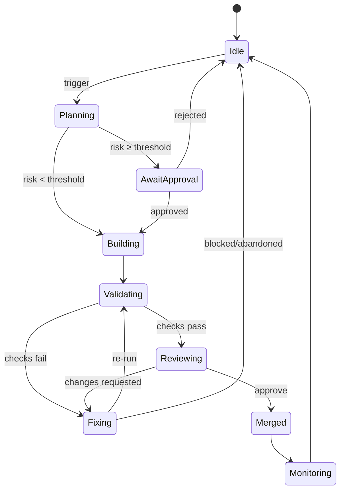

# Kaizen Subsystem (Technical)

This document specifies the Kaizen subsystem: an agentic, fail-closed improvement loop that proposes and validates small, incremental changes via dry‑run pull requests before any merge to main.

## Summary

- Purpose: continuous, automated improvements with human-governed safety.
- Mode: fail‑closed with dry‑run PRs; no merge without validation + approval.
- Agents: Planner, Builder, Verifier; backed by the Knowledge Plane and CI/CD.
- Triggers: scheduled cadence and event-driven (e.g., CVEs, CI failures).
- HITL: plan approval (risk‑gated) and pre‑merge code review.
- Outputs: branch + PR per improvement, verification artifacts, post‑merge outcomes logged.

## Audience and Scope

Developer-facing documentation for engineers building, operating, and extending the Kaizen loop. Covers responsibilities, workflow, controls, and operations. Tooling specifics (CI vendor, exact commands) are illustrative; outcomes are normative.

## System Components

- Planner Agent: analyzes system state via the Knowledge Plane and proposes improvements with rationale and risk.
- Builder Agent: implements approved plans on an isolated branch and opens PRs.
- Verifier Agent: executes automated checks (tests, static analysis) and reports results.
- Knowledge Plane: shared context for findings, plans, policies, and outcomes.
- CI/CD Pipeline: runs verification gates and performs merges/deploys per policy.

## Workflow (Dry‑Run Improvement Loop)

The loop executes on cadence or trigger and iterates over small, isolated changes.

1) Trigger

- Scheduler (e.g., nightly) or event (new CVE, CI failure on main, drift detected).
- Optional manual start to request an improvement pass.

2) Plan Generation (Planner)

- Reviews system context and candidates: fix failing tests, refactor duplication, update dependencies, improve logging, add DB index, etc.
- Prioritizes and selects one item (or a trivially orthogonal bundle).
- Assigns risk aligned to governance thresholds; prepares validation criteria.

3) Plan Approval (HITL)

- If risk ≥ threshold, await human approval; low‑risk routine maintenance may auto‑proceed per policy.
- Early maturity: prefer quick human review of all plans to build trust.

4) Execution as Dry‑Run (Builder)

- Create branch: `kaizen-<YYYYMMDD>-<topic>`.
- Implement the change; open a PR labeled "Kaizen-AI proposed" and link plan context.

5) Automated Validation (Verifier + CI)

- Run unit/integration tests, linting/static analysis, and other required checks.
- If failures occur, loop on fixes within the PR when tractable; otherwise hold for human input.

6) Review & Decision (HITL)

- Human reviewer validates intent, quality, and alignment even when CI is green.
- Approve when satisfied; request changes or close otherwise.

7) Merge & Deploy

- Merge to main after approval. CI/CD deploys per standard release policy.

8) Monitor Outcomes

- Observe effects (e.g., performance improvements) and detect regressions.
- Record outcomes in the Knowledge Plane for traceability.

9) Iterate

- Return to idle until next schedule or trigger; prefer one improvement at a time unless changes are clearly independent.

```mermaid
flowchart LR
  T[Trigger (schedule/event)] --> P[Plan]
  P -->|risk < threshold| B[Build (branch + PR)]
  P -->|risk ≥ threshold| A[HITL Plan Approval]
  A -->|approved| B
  A -->|rejected| X[Fail-closed: no change]
  B --> V[Verifier + CI]
  V -->|checks pass| R[HITL Review]
  V -->|checks fail| F[Fix or Hold]
  F -->|fixed| V
  F -->|blocked| X
  R -->|approve| M[Merge]
  R -->|request changes| F
  M --> O[Monitor Outcome]
  O --> K[Log to Knowledge]
  K --> T
```

## Fail‑Closed Controls

Default posture is "no change" unless evidence and approval support merge.

- Any test or verification failure prevents merge; PR remains open for fixes or is closed.
- If planning or building reveals unexpected complexity, halt and flag HITL.
- Human reviewers can reject or request changes even on all‑green runs.
- Post‑merge monitoring may trigger revert/rollback if adverse effects are detected.

This guarantees safety even when an AI misjudges an improvement: the process blocks or reverts rather than silently drifting system behavior.

## Triggers and Scheduling

- Cadence: nightly/weekly runs to "garden" quality (docs, tests, refactors).
- Events: new CVEs, dependency freshness, CI failures, performance anomalies, or other drift signals.
- Manual: on‑demand runs by maintainers.

## Branching and PR Conventions

- Branch naming: `kaizen-<YYYYMMDD>-<topic>`.
- PR title example: `chore: bump json-lib to 2.3.2 (Kaizen AI)`.
- Labels: `Kaizen-AI proposed`; link to plan/risk context in the PR body.
- One PR per improvement; avoid batching unless trivial and orthogonal.

## Validation and Quality Gates

- Required checks: unit/integration tests, lint/static analysis, type checks; security/license scans where applicable.
- Verifier may include dependency/SBOM diffs for update clarity.
- CI status and artifacts are written back to the Knowledge Plane.

## Human‑in‑the‑Loop (HITL)

- Plan approval when risk ≥ threshold; can be streamlined for low‑risk maintenance.
- Pre‑merge code review for semantic correctness and intent alignment.
- Early operation favors more HITL to build trust; automation can expand over time.

## Observability and Feedback

- After merge, monitor key metrics to validate intended effects and detect side effects.
- Knowledge Plane records: proposed plan, risk, approver, PR link, checks, outcome, and post‑merge observations.
- Failed or rejected attempts inform future planning and policy refinements.

## Failure Handling and Rollback

- Prefer feature flags for risky behavior changes; roll out gradually when possible.
- Maintain rapid rollback capability; revert recent PR if production signals regress.
- Keep changes small so that reverting is straightforward and low‑risk.

## Operational Controls

- Pause/resume the loop (e.g., during high‑risk release windows).
- Suggest‑only mode: propose plans and PR diffs without auto‑execution when trust is low.
- Daily summary dashboards: "3 PRs opened, 2 merged, 1 awaiting input" for visibility.

## Metrics and Reporting

- Throughput: improvements proposed vs. merged.
- Lead time: trigger → merge duration.
- Change failure rate: percent of PRs reverted or rejected post‑checks.
- MTTR for event‑driven fixes (e.g., CVE remediation time).
- Coverage/quality drift corrected over time.

## Example Scenarios

### Low‑risk dependency update

- Plan: bump `json-lib` from `2.3.1` to `2.3.2`; no API changes; run full tests.
- Execution: update dependency; open PR; CI passes; human approves; merge; outcome logged.

### Behavior change needing specification

- Plan: add null guards for recurring NPE in ModuleA.FunctionX; update tests.
- Execution: implement change and tests; CI reveals ambiguity or failures; hold for human decision.
- Resolution: clarify intended behavior; update spec/tests; proceed or abandon; fail‑closed protects main until intent is explicit.

## State Model



## Notes

- Keep changes small, traceable, and independently reviewable.
- Treat Kaizen PRs like any team member’s: same standards, same gates.
- The loop increases velocity while preserving safety by defaulting to no change without proof.
