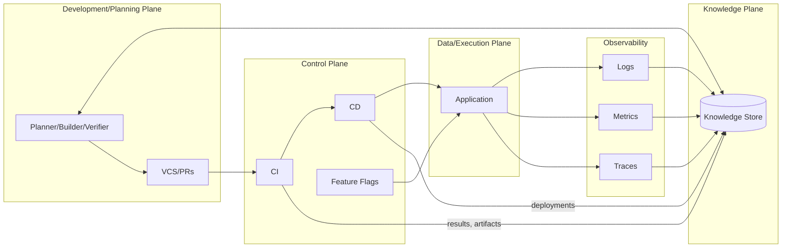

# Tooling Integration: Planes, Contracts, and Flows

This document specifies how Harmony’s engineering toolchain integrates across planes (control, data, knowledge, and development), the contracts between tools, expected data flows, and operational guarantees. It serves as a reference for implementing, extending, and troubleshooting integrations.

## Scope and Goals

- Define the planes and responsibilities across the ecosystem.
- Catalog tool roles and primary integration points.
- Specify inter‑kit contracts, payloads, and APIs.
- Document end‑to‑end flows and failure handling.
- Provide examples that are production‑ready and testable.

## Terminology and Planes

- **Data/Execution Plane:** Application runtime handling user requests. Emits telemetry.
- **Control Plane:** CI/CD, feature flags, and orchestrators that configure and deploy the data plane.
- **Knowledge Plane:** Aggregated system knowledge (designs, specs, build/test results, deployments, and derived insights). Not on the runtime critical path.
- **Development/Planning Plane:** Source control, code review, IDEs, and planning/AI agents.
- **Security Plane (conceptual):** Governance and security enforcement overlaying all planes.



## Tooling Inventory and Roles

| Tool/Service                                       | Primary Role                               | Key Integrations                                                                 |
|----------------------------------------------------|--------------------------------------------|----------------------------------------------------------------------------------|
| VCS (GitHub/GitLab)                                | Code collaboration and review              | CI via webhooks/status checks; Issue tracker linking                             |
| CI (Actions/GitLab/Jenkins)                        | Build, test, analyze                       | VCS status; artifacts; Knowledge Plane results; SAST/coverage annotations        |
| CD (ArgoCD/Harness/scripts)                        | Promote artifacts to envs                  | CI artifacts; infra APIs; Observability for canaries; Feature flags coordination |
| Issue Tracker (Jira/GitHub Issues)                 | Planning and work tracking                 | VCS linking; bots; Knowledge Plane indexing                                      |
| Observability (Prometheus/Grafana, Jaeger, ELK)    | Metrics, traces, logs                      | App instrumentation (OpenTelemetry); event ingestion; Knowledge Plane indexing   |
| Feature Flags                                      | Runtime configuration                      | App SDKs; CD rollout gating; defaults/fallbacks                                  |
| Knowledge Plane                                    | System of record for engineering knowledge | CI/CD ingestion; Observability summaries; Agent APIs                             |
| Dev Tools (IDE/Review)                             | Pre‑commit checks and review context       | Linters in IDE; PR annotations (coverage, SAST, test failures)                   |
| Security Tools (Dependabot/SAST/DAST)              | Security posture and signals               | PRs to VCS; CI checks; issue creation                                            |

## Inter‑Kit Contracts

### VCS ↔ CI

- **Purpose:** Trigger pipelines and display commit/PR status.
- **Direction:** VCS → CI via webhooks on push/PR; CI → VCS via Status/Checks API.
- **Transport:** HTTPS webhooks; REST APIs.
- **Success criteria:** Required checks pass; PR annotated with results.
- **Failure handling:** Branch protection blocks merges; reruns allowed; alerts to owners.

### CI ↔ Knowledge Plane

- **Purpose:** Persist build/test outcomes, coverage, and SBOM metadata.
- **Direction:** CI → KP (push after each pipeline stage).
- **Transport:** REST with token auth.
- **Data model (example):**

```json
{
  "build_id": "ci-2025-11-11T10:35:00Z-9f2e",
  "repo": "harmony/monorepo",
  "commit": "a1b2c3d",
  "branch": "feature/abc",
  "tests": [
    {"id": "spec:FR-003:unit:foo", "result": "pass", "duration_ms": 42},
    {"id": "spec:FR-007:int:bar", "result": "fail", "duration_ms": 3100, "trace": "trace-123"}
  ],
  "coverage": {"lines": 83.2, "branches": 78.5},
  "sbom_digest": "sha256:...",
  "artifacts": [
    {"name": "web-image", "type": "container", "digest": "sha256:..."}
  ]
}
```

- **Failure handling:** Buffer and retry on 5xx; do not block CI outcome.

### CI ↔ Issue Tracker

- **Purpose:** Link changes to work items and create incidents when needed.
- **Direction:** CI → Issues (optional automation); VCS messages close issues (Fixes #123).
- **Transport:** REST; commit message conventions.
- **Failure handling:** Non‑blocking; bots can reconcile periodically.

### CD ↔ CI and Infra

- **Purpose:** Deploy artifacts from CI to target environments.
- **Direction:** CI → CD trigger with artifact refs; CD → Infra (Kubernetes/cloud APIs).
- **Transport:** GitOps, REST/CLI.
- **Success criteria:** Health checks pass; canary metrics within thresholds.

### CD ↔ Observability

- **Purpose:** Automated canary analysis and deployment event correlation.
- **Direction:** CD → Obs (deployment events); CD ← Obs (metrics queries).
- **Transport:** Prometheus/Grafana APIs.
- **Example PromQL:** `rate(http_server_errors_total[5m]) < 0.01`.

### Feature Flags ↔ Application

- **Purpose:** Runtime configuration toggles for progressive delivery.
- **Direction:** App ↔ Flag Service (SDK with local cache and defaults).
- **Contract:** `flagClient.get("newFeatureX", default=false)`; must operate under network loss.
- **Failure handling:** Deterministic defaults; cache TTL with backoff.

### Knowledge Plane ↔ Agents (Planner/Builder/Verifier)

- **Purpose:** Read specs and system state; write test and verification results.
- **Direction:** Agents ↔ KP via authenticated APIs.
- **Example endpoints:**
  - `GET /kp/specs/{id}` → Markdown spec.
  - `GET /kp/test_failures?since=2025-11-01`.
  - `POST /kp/test_results` → see CI ↔ KP schema.

### Security Tools ↔ VCS/CI

- **Purpose:** Surface dependency and code risks early.
- **Direction:** Security → VCS (PRs/comments); Security → CI (checks).
- **Failure handling:** Treat as required or advisory per policy; auto‑issue creation optional.

## Inter‑Plane Contracts

- **Control ↔ Data:** Deployments and configuration (including feature flags) from control to data; health and readiness from data to control.
- **Control ↔ Knowledge:** CD posts deployment facts (version, env, time) to KP for correlation.
- **Data ↔ Knowledge:** Telemetry routed from app instrumentation to observability and indexed/summarized into KP.
- **Dev ↔ Knowledge:** Developers and agents query specs, traceability, and recent results; update specs and links.

## End‑to‑End Flow

```mermaid
sequenceDiagram
  participant Dev as Developer/Agent
  participant VCS as VCS
  participant CI as CI
  participant CD as CD
  participant APP as Application
  participant OBS as Observability
  participant KP as Knowledge Plane

  Dev->>VCS: Push branch / open PR
  VCS-->>CI: Webhook triggers pipeline
  CI->>CI: Build, test, analyze
  CI->>VCS: Report PR status/annotations
  CI->>KP: Push results, coverage, SBOM
  CI-->>CD: Trigger deploy to staging
  CD->>APP: Rollout new version
  APP->>OBS: Emit metrics/logs/traces
  CD->>OBS: Post deployment event
  OBS-->>CD: Canary metrics query
  CD->>KP: Record deployment fact
  note over KP: Agents query KP for planning
  Dev->>VCS: Merge PR; repeat to prod
```

Flow narrative:

1. Commit/PR triggers CI which builds, tests, and annotates the PR.
2. CI publishes results and artifacts to the Knowledge Plane.
3. On success, CI triggers CD to stage/prod; CD records deployment into KP.
4. Application emits telemetry; Observability stores time‑aligned signals; KP indexes summaries/links.
5. Agents/planners use KP and Observability APIs to propose fixes or improvements and open issues/PRs.

## Automation and Sync

- **Webhooks/bots:** Keep issues, PRs, and knowledge entries in sync when items close or change.
- **Scheduled jobs:** Periodic SBOM and vulnerability syncs to KP and issue tracker.
- **PR annotations:** Coverage, test failures, and SAST comments via CI.

## Separation of Concerns

- CI ensures code quality and artifacts; it does not make user‑exposure decisions (CD/flags handle rollout).
- Feature flags provide values; application code interprets behavior.
- Knowledge Plane is authoritative for engineering knowledge but not on the application’s runtime path.
- Avoid duplicating truths between the issue tracker and KP; prefer linking or automated sync.

## Failure Handling and Resilience

- **CI unavailable:** Branch protections block merges; rerun when restored.
- **Flag service unreachable:** Use deterministic defaults and cached values; fail safe (prefer disabled).
- **Knowledge Plane down:** Application unaffected; CI buffers and retries publishing.
- **Observability degraded:** Minimal OS metrics/logs continue; alerts may be delayed; KP marks gaps.

## Implementation Notes and Examples

- **GitHub Commit Status API:** Report per‑job checks with URLs to logs.
- **Prometheus Canary Check:**

```bash
curl -s "${PROM_URL}/api/v1/query" \
  --data-urlencode 'query=rate(http_requests_total{status=~"5.."}[5m])'
```

- **Feature Flag Read (pseudo‑code):**

```ts
const enabled = flagClient.get("newFeatureX", false);
if (enabled) {
  renderNewPath();
} else {
  renderOldPath();
}
```

- **CI → KP publish (shell sketched):**

```bash
curl -X POST "$KP_URL/api/results" \
  -H "Authorization: Bearer $KP_TOKEN" \
  -H "Content-Type: application/json" \
  -d @results.json
```

## Extensibility

- Provider swaps (e.g., CI, flags, or CD) require only adapter changes at the contract level.
- New tools integrate by declaring: purpose, direction, transport, payload schema, and failure semantics.

## References

- OpenTelemetry instrumentation for services.
- GitHub/GitLab webhooks and Status/Checks APIs.
- Prometheus/Grafana/Jaeger APIs for metrics/traces.
- SBOM formats (CycloneDX, SPDX) and ingestion practices.
