# Harmony Methodology

Harmony is a lean, **opinionated**, AI-accelerated methodology you can adopt tomorrow with two developers, optimized for **speed and quality with safety** on your stated stack and hosting. It integrates **Spec‑First (via SpecKit `speckit` wrapping GitHub’s Spec Kit) + Agentic agile (via PlanKit `plankit` wrapping BMAD) + AI-driven IDE (Cursor) + Monorepo Workflow (Turborepo) + Deployment Platform (Vercel)** end‑to‑end, while baking in **SRE, DevSecOps, OWASP ASVS, NIST SSDF, STRIDE, 12‑Factor, Monolith‑First, Hexagonal**.

---

## Harmony’s Unifying Objective

Harmony unifies speed, safety, and simplicity so a tiny team can ship high‑quality software quickly, safely, and predictably. Every framework and tool listed above reinforces one of Harmony’s four pillars and closes the loop from secure specification → agentic implementation → observable operations → postmortem learning.

### The Four Pillars

1. **Speed with Safety** — Fast flow (trunk-based development, small PRs), automated quality/security gates, and frequent integration deliver quick results without sacrificing reliability.
2. **Simplicity over Complexity** — Monolith-first and 12-Factor patterns keep architecture lean, Kanban and Shape Up focus work and limit scope, and spec-driven changes minimize dependencies and overhead.
3. **Quality through Determinism** — Rigorous, measurable gates (OWASP ASVS, NIST SSDF, STRIDE threat modeling, SLOs/DORA metrics) plus contract and property-based tests ensure every change is observable, testable, and reversible.
4. **Guided Agentic Autonomy** — AI systems autonomously self-build, self-heal, and self-tune within deterministic, observable, and reversible bounds—while humans retain ultimate authority, oversight, and accountability.

Together these pillars create a self‑reinforcing system that makes changes small, deterministic, testable, and reversible.

> Terminology note: “SpecKit” refers to our AI‑Toolkit kit (code `speckit`) that wraps GitHub’s Spec Kit. Mentions of the upstream tool explicitly use “GitHub’s Spec Kit”.

#### Pillars → Practices Map (at a glance)

| Pillar | Primary Practices/Tools | Feedback loop it reinforces |
| --- | --- | --- |
| Speed with Safety | Trunk‑Based Development; Vercel Previews + `vercel promote`; Feature Flags (Vercel Flags); Tiny PRs | Frequent, reversible integration; instant rollback; safe, progressive rollout |
| Simplicity over Complexity | Monolith‑First (Turborepo); 12‑Factor; Hexagonal boundaries; Spec‑First | Low coordination cost; crisp ports/adapters; scope control before code |
| Quality through Determinism | Spec‑First + BMAD; OpenAPI/JSON‑Schema; PolicyKit/EvalKit/TestKit; ObservaKit | Typed contracts; fail‑closed governance; observable outcomes tied to traces |
| Guided Agentic Autonomy | AgentKit; GuardKit; PolicyKit/EvalKit; PatchKit/NotifyKit (HITL); ObservaKit | Deterministic agent loops; HITL checkpoints; pinned AI config & golden tests; traces/provenance; fail‑closed governance |

---

## Where the AI‑Toolkit Fits

The AI‑Toolkit provides the kit‑level building blocks that implement Harmony’s gates and flows. For a concise mapping from Harmony’s principles to specific kits, see “Harmony Alignment” in docs/handbook/ai-toolkit/README.md#harmony-alignment-lean-ai-accelerated-methodology. In practice, use FlagKit for feature gating and progressive delivery (Vercel Flags via Edge Config), ObservaKit for telemetry, EvalKit/PolicyKit/GuardKit for gates, and PatchKit for PRs.

### Stage‑to‑Kit Map (operational)

- Spec → Plan → Implement → Verify → Ship → Learn
  - Spec/Shape: SpecKit (`speckit`), PlanKit
  - Implement (agentic): AgentKit, DevKit, CodeModKit (as needed)
  - Verify/Govern: EvalKit (structure/hallucination), PolicyKit (ASVS/SSDF policy), GuardKit (redaction), TestKit (unit/contract/e2e), ComplianceKit (evidence)
  - Ship: PatchKit (PRs), Vercel Previews (promotion), ReleaseKit (changelog)
  - Observe/Learn: ObservaKit (OTel traces + logs), BenchKit (perf), Dockit (docs/ADR), ScheduleKit (jobs)

### Deterministic Agent Loops & Provenance (AI‑Toolkit alignment)

- Standard agent loop: Plan → Diff → Explain → Test (no direct apply). Each step produces an artifact (plan, proposed edits, risk/explain notes, tests) that is reviewable.
- Pin and record AI configuration whenever agents are used for code or content:
  - Provider, model and version; temperature/top_p, max_tokens; seed (if supported) and region.
  - Record the system prompt and inputs (minus secrets) and persist via ObservaKit traces.
  - Attach the ObservaKit trace URL (and EvalKit run ID when applicable) to the PR description.
- Require reproducibility:
  - Add or update AI “golden tests” guarded by JSON‑Schema via EvalKit/TestKit; fail on schema or material output drift.
  - Prefer low‑variance settings (temperature ≤ 0.3) for deterministic outputs; justify higher variance in PR.
- License and provenance:
  - Run GitHub Dependency Review and include a license/provenance note in the PR.
  - Avoid adding new dependencies unless they materially reduce complexity; prefer permissive licenses (MIT/BSD/Apache).

---

## System Guarantees (self‑reinforcing invariants)

Harmony operates as a closed loop with a few non‑negotiable, compounding habits that keep tiny teams fast, safe, and sustainable:

- Spec‑first changes: Every material change starts with a one‑pager + ADR and micro‑STRIDE. No spec, no start.
- No silent apply: Agents produce plans/diffs/tests only; humans gate side‑effects. Local runs default to `--dry-run`.
- Deterministic AI: Provider/model/version/params pinned; low variance (temperature ≤ 0.3); prompt hash recorded; golden tests guard drift.
- Observability required: Changed flows must emit OTel spans/logs; PRs link a `trace_id`. Evidence packs are assembled per PR.
- Idempotency & rollback: Mutations use idempotency keys; risky features ship behind flags; rollback is “promote prior preview”.
- Fail‑closed governance: Policy/Eval/Test gates block on missing evidence or violations; High‑risk changes require navigator + security review.
- Local‑first & privacy‑first: Secrets never leave Vault/env; PII redacted at log/write boundaries; offline telemetry buffers flush later.
- Cost & efficiency guardrails: Publish monthly AI token and infra budgets; alert on cost anomalies; freeze risky merges/promotions on sustained anomalies until budgets recover. PRs that use AI must include pinned model config and a short cost note (estimated/observed).
- Supply chain provenance: SBOMs are produced for releases and build artifacts are attested (e.g., GitHub attestations/Sigstore). Provenance notes are linked in PRs for changes that affect build/release surfaces.
- Small batches by policy: Trunk‑based, tiny PRs, explicit WIP limits, and preview smoke keep cycle time short and outcomes reversible.
- Waiver discipline: Gate waivers are exceptional and rare; Navigator approval (and Security for High‑risk) is required with an explicit scope/timebox (≤ 7 days or until merge) and a PR‑linked justification. Waivers are disallowed for secrets/PII exposure, missing observability on changed flows, missing rollback/flag, and sustained SLO burn‑rate violations. Waivers auto‑expire at merge and must include a follow‑up issue for any residual risk or work.

These guarantees align 1:1 with the AI‑Toolkit’s invariants (determinism, typed contracts, idempotency, observability, and fail‑closed policy), ensuring the methodology is self‑reinforcing instead of fragile.

---

## Harmony's Components

Here’s an explanation of each framework, method, and tool in the **Harmony Methodology** — and *why* it aligns with the **Harmony Methodology** for Lean AI-Accelerated development. Together, these ensure that every change — human or AI-generated — is **traceable, testable, and reversible**, fulfilling Harmony’s “lean AI-accelerated” promise.

### Frameworks & Standards

| Item                       | Role                                       | Why it aligns with Harmony                                                                                                                                                                                                                   |
| -------------------------- | ------------------------------------------ | -------------------------------------------------------------------------------------------------------------------------------------------------------------------------------------------------------------------------------------------- |
| **OWASP ASVS v5**          | Application Security Verification Standard | Provides clear, testable security requirements (auth, input validation, crypto, logging) that integrate directly into Harmony’s **spec-first + CI gates** (CodeQL, Semgrep, SBOM). Maps 1-to-1 with Harmony’s “security by default” policy.  |
| **NIST SSDF (SP 800-218)** | Secure Software Development Framework      | Defines secure development activities (planning, coding, reviewing, releasing) that Harmony automates and embeds into each lifecycle stage. The SSDF “plan-protect-produce-respond” phases align with Harmony’s BMAD → CI → Postmortem loop. |
| **OpenTelemetry (OTel)**   | Observability Standard                     | Harmony mandates OTel for **structured logs, traces, and metrics**, ensuring reliable AI observability and root cause analysis (tied to **ObservaKit** and **BenchKit**).                                                                    |

### Methods & Practices

| Item                        | Role                               | Why it aligns with Harmony                                                                                                                         |
| --------------------------- | ---------------------------------- | -------------------------------------------------------------------------------------------------------------------------------------------------- |
| **Google SRE**              | Reliability Engineering discipline | Introduces SLIs, SLOs, and **error budgets**, the backbone of Harmony’s reliability guardrails and postmortems.                                    |
| **DORA Metrics**            | DevOps performance metrics         | Harmony explicitly targets DORA’s four keys—lead time, deploy frequency, MTTR, and change-fail rate—to measure improvement in automation and flow. |
| **Trunk-Based Development** | Integration practice               | Core to Harmony’s “flow over ceremony”: small, frequent PRs to a single trunk with instant **Vercel previews** and feature flags for safe rollout. |
| **12-Factor App**           | Cloud-native design principles     | Ensures stateless, portable, and disposable services—Harmony’s **Turborepo monolith-first stack** adheres to this for simplicity and speed.        |
| **Kanban / Little’s Law**   | Flow optimization principle        | Harmony’s WIP limits (Ready=3, In-Dev=1 per dev) derive directly from Little’s Law to maximize throughput and reduce cycle time.                   |
| **Shape Up**                | Product shaping method             | Used to size “appetites” and cut scope before development—Harmony’s BMAD step #2 (“Shape”) implements this to define crisp, buildable features.    |
| **STRIDE**                  | Threat-modeling methodology        | Harmony mandates STRIDE per feature in the spec phase, linking threats → mitigations → tests, enforced by **PolicyKit** and **GuardKit**.          |
| **Monolith-First**          | Architectural strategy             | Harmony advocates a **modular monolith** in **Turborepo** before microservices—maximizing speed and minimizing ops overhead for small teams.       |

### Architectural Patterns

| Item                       | Role                           | Why it aligns with Harmony                                                                                                                                                      |
| -------------------------- | ------------------------------ | ------------------------------------------------------------------------------------------------------------------------------------------------------------------------------- |
| **Hexagonal Architecture** | Domain-driven ports & adapters | Core pattern of Harmony: keeps business logic isolated from infrastructure. Enables testability, AI-generated adapters, and contract testing via **Pact** and **Schemathesis**. |

### Platforms & Platform Controls

| Item       | Role                           | Why it aligns with Harmony                                                                                                                                                |
| ---------- | ------------------------------ | ------------------------------------------------------------------------------------------------------------------------------------------------------------------------- |
| **Vercel** | Deployment platform            | Implements Harmony’s **safe deploys**: PR previews, feature flags, and instant rollback (`vercel promote`)—turning SLO-based release gating into a one-command operation. |
| **GitHub** | Source of truth and guardrails | Provides branch protection, CODEOWNERS, and built-in secret scanning—Harmony integrates all into its CI/CD quality gates.                                                 |

### Build & Repo Tooling

| Item          | Role                | Why it aligns with Harmony                                                                                                                              |
| ------------- | ------------------- | ------------------------------------------------------------------------------------------------------------------------------------------------------- |
| **Turborepo** | Monorepo build tool | Central to Harmony’s **modular monolith** design: enables incremental builds, shared caching, and parallel CI pipelines for both Python and TypeScript. |

### Security Analysis Tooling

| Item        | Role                       | Why it aligns with Harmony                                                                                                    |
| ----------- | -------------------------- | ----------------------------------------------------------------------------------------------------------------------------- |
| **CodeQL**  | Semantic static analysis   | Integrated into CI for code scanning, enforcing ASVS/NIST controls for code-level vulnerabilities.                            |
| **Semgrep** | Rule-based static analysis | Fast, rule-driven checks for style and security; Harmony uses it alongside CodeQL for coverage and custom policy enforcement. |

### Testing & Contract Tools

| Item             | Role                       | Why it aligns with Harmony                                                                                                        |
| ---------------- | -------------------------- | --------------------------------------------------------------------------------------------------------------------------------- |
| **Playwright**   | End-to-end testing         | Powers preview smoke tests to validate deployments in **Vercel previews** before promotion.                                       |
| **Pact**         | Contract testing           | Enforces boundary contracts across adapters (Hexagonal pattern) and aligns with Harmony’s **ports/adapters testing discipline**.  |
| **Schemathesis** | Property-based API testing | Tests OpenAPI contracts automatically; enforces correctness and prevents drift—Harmony mandates this for APIs with OpenAPI specs. |

### Specifications & Schemas

| Item            | Role                     | Why it aligns with Harmony                                                                                 |
| --------------- | ------------------------ | ---------------------------------------------------------------------------------------------------------- |
| **OpenAPI**     | API description standard | Foundation of Harmony’s **spec-first** model; drives contract testing, diff checks, and schema validation. |
| **JSON Schema** | Data validation schema   | Used across Harmony kits to validate AI and API payloads, including “golden test” outputs for determinism. |

### Guidance

| Item                                   | Role                       | Why it aligns with Harmony                                                                                                                         |
| -------------------------------------- | -------------------------- | -------------------------------------------------------------------------------------------------------------------------------------------------- |
| **OWASP Cheat Sheets (CSP/CSRF/SSRF)** | Targeted security guidance | Harmony integrates these directly into the **Spec → Threat Model → Tests** flow; Cursor prompts even reference them by name during implementation. |

---

## How Harmony’s Components Reinforce Each Other

Methods (SRE, DORA, Shape Up) define how work flows. Frameworks and standards (ASVS, SSDF, STRIDE) define what “safe” means. Tools and platforms (Vercel, GitHub, OTel, Turborepo) ensure speed and safety coexist. This alignment makes Harmony lean, agent‑ready, and safe by default—so AI‑accelerated teams can move fast without breaking trust.

### 1) Security and Compliance (Defense‑in‑Depth)

- OWASP ASVS and NIST SSDF establish baseline security and development controls; specs and CI gates map directly to them.
- STRIDE injects threat modeling at design time (spec‑first), translating risks → mitigations → tests.
- CodeQL, Semgrep, and OWASP cheat sheets operationalize controls as automated CI checks and developer guidance.
- Outcome: security and compliance are built in, not bolted on after the fact.

### 2) Speed and Flow (Lean Delivery)

- Trunk‑Based Development, Kanban/Little’s Law, and Shape Up synchronize scope, WIP, and integration cadence.
  - Shape Up defines appetites and trims scope.
  - Kanban limits WIP to keep cycle times low.
  - Trunk‑based flow yields tiny, frequent integrations.
- Monolith‑First and 12‑Factor keep the architecture lean, reducing coordination and operational overhead.
- Outcome: delivery is continuous, reversible, and predictable.

### 3) Reliability and Observability (Continuous Feedback)

- Google SRE introduces SLIs/SLOs and error budgets; DORA metrics measure speed versus stability to guide release decisions.
- OpenTelemetry powers the observability stack (via ObservaKit) for traces, metrics, and structured logs.
- Vercel and GitHub provide controlled deployment and governance surfaces that enforce reliability goals.
- Outcome: reliability is measurable, and feedback loops are fast.

### 4) Architecture and Maintainability

- Hexagonal architecture, Turborepo, OpenAPI, and JSON Schema form Harmony’s structural backbone.
  - Contracts/schemas define boundaries and expectations.
  - Pact and Schemathesis ensure adapters remain compatible.
  - Turborepo enforces modularity and fast iteration.
- Outcome: systems are deterministic, testable, and easy to evolve—aligned with spec‑first and simplicity‑first rules.

### 5) Testing and Quality Assurance

- Playwright, Pact, and Schemathesis span the testing pyramid (E2E, contract, property‑based layers).
- Combined with JSON Schema validations and EvalKit, they produce verifiable AI and code outputs.
- Outcome: agent‑assisted changes are safe, observable, and reversible.

### 6) Guided Agentic Autonomy (Deterministic Agent Loops & HITL)

- Deterministic, reviewable agent loops: Plan → Diff → Explain → Test; no silent apply.
- Pinned AI configuration and low‑variance defaults; golden tests guarded by JSON‑Schema prevent drift.
- Observability and provenance: OTel traces/logs on runs; PRs include representative `trace_id` and Eval/Policy outcomes.
- Fail‑closed governance: HITL checkpoints enforced; agents cannot approve PRs or push to protected branches; humans retain ultimate authority, oversight, and accountability.
- Outcome: AI systems autonomously self‑build, self‑heal, and self‑tune within deterministic, observable, and reversible bounds.

### In Short

- Not random best practices: each fills a clear gap (security, flow, observability, architecture) with minimal overlap.
- Mutual reinforcement: DORA depends on trunk flow; trunk flow depends on safe CI gates (ASVS, SSDF); SLOs depend on observability (OTel).
- Shared philosophy: prioritize small, deterministic, testable, reversible changes—the core of Harmony.

---

## Harmony in Practice

**Goal.** Ship small, quality, safe, and frequent changes with **enterprise‑grade** security, reliability, and performance using **agent‑assisted** workflows. Humans own correctness, security, and licensing.

**Guiding principle.** **Simplicity first**: prefer the smallest viable process, design, and tooling that satisfy the requirement. Add complexity only when SLOs, scale, or compliance clearly require it; avoid unnecessary dependencies.

**Methodology**:

- **Simplicity‑first**: choose the simplest process, design, and tooling that meets the requirement. Defer advanced patterns until justified by SLOs/scale/compliance. Default to no new dependency unless it materially reduces complexity.
- **Spec‑first**: every meaningful change starts with a **Specification one‑pager** + **ADR** capturing problem, scope, API/UI contracts, SLIs/SLOs, **non‑functionals**, and a **micro‑threat model (STRIDE)** mapped to **OWASP ASVS** & **NIST SSDF** tasks.
- **Agentic agile (BMAD)**: Convert the Spec to a **BMAD story** (context packets + agent plan + acceptance criteria). Use **Cursor** to generate plans/diffs/tests from the Spec, but enforce human checkpoints and license checks.
- **Flow over ceremony**: **Trunk‑Based Development** (+ short‑lived branches), tiny PRs, gated **Vercel Preview** per PR, **feature‑flagged** releases with guarded manual promote to prod; rollbacks are instant by promoting a prior preview.
- **Reliability guardrails**: Define **SLIs/SLOs**, manage via **error budgets**, alert on budget burn, run blameless postmortems with action items.
- **Security by default**: **OWASP ASVS** controls + **NIST SSDF** activities embedded in **CI/CD** quality gates: static analysis (**CodeQL/Semgrep**), dependency & **license** scan, **secret scanning**, SBOM, and contract tests.
- **Architecture**: **12‑Factor** monolith‑first in a **Turborepo** monorepo with **Hexagonal** boundaries enforced by **contract tests**, and observability via **OpenTelemetry** + structured logs.

**Expected impact (for a 2‑dev team after 60–90 days)**:

- **Lead time**: hours → sub‑day for small changes via trunk flow, preview environments, and tiny PRs. **DORA** research supports doing speed *with* stability.
- **Change‑fail rate**: drops via feature flags, previews, contract tests, and error‑budget‑driven discipline.
- **MTTR**: minutes–hours via instant rollback (promote a known‑good preview) and clear runbooks.
- **SLO attainment**: measurable improvement by alerting on **burn‑rate** and holding code until budget recovers.

### Human–AI Roles & HITL Checkpoints

- Roles
  - Driver (Dev A): owns implementation, risk call, and rollout plan.
  - Navigator/Reviewer (Dev B): owns review, security/license checks, and rollout readiness.
  - Agents (Cursor + AI‑Toolkit): propose plans/diffs/tests; never approve risk or production changes.
- Two‑person rule: High‑risk changes require Driver + Navigator involvement end‑to‑end from spec to promotion.

- Non‑negotiables (AI)
  - Cannot commit directly to protected branches; cannot approve PRs; cannot handle secrets or long‑lived credentials.
  - Must produce artifacts (plan, diffs, tests) for human review; no silent apply. Mutations require idempotency keys.
  - Must operate with pinned provider/model/version and documented parameters (temperature, top_p, max_tokens, seed if supported); runs record a stable prompt hash.

- Non‑negotiables (Humans)
  - Classify PR risk (Trivial/Low/Medium/High) and confirm rollback/flag plan.
  - Verify license/provenance and secret hygiene; check OpenAPI/JSON‑Schema diff where applicable.
  - Confirm observability for changed flows (trace + structured logs) and attach a representative trace or trace_id in the PR.
- Required human‑in‑the‑loop checkpoints
  1. Before implementation: SpecKit one‑pager + micro‑STRIDE + acceptance criteria approved by Navigator.
  2. Before merge: PR review using the risk rubric (below) with license/provenance note and OpenAPI diff.
  3. Before promotion: Feature behind a flag, Preview e2e smoke green, rollback noted, owner on‑call.
  4. After promote: 30‑minute watch window; check SLO burn‑rate and key SLIs; document in PR thread.
- Stop‑the‑line triggers (any → block or rollback)
  - Secret exposure, license violation, security regression (ASVS high/critical), SLO burn‑rate breach.
  - Missing rollback path or flag; Preview e2e red; OpenAPI breaking change without consumer sign‑off.
  - Missing observability on changed flows; missing PR risk rubric; AI model/provider/params not pinned when agents were used.
  - Debt budget exceeded or WIP limits breached for >24h without mitigation (freeze feature work; restore system health first).
- Decision log
  - Dockit auto‑prompts an ADR summary on merge; link PR, preview URL, post‑deploy notes, and (when agents were used) AI provider/model/version + parameters and ObservaKit/EvalKit run links.

### HITL Waivers & Exceptions (minimal rules)

- Waivers are exceptional and rare—prefer scope cuts, flags, and staged rollouts.
- Who can waive: Navigator (High‑risk requires Navigator + Security). Agents cannot waive.
- PR requirements: waiver justification (why safe now), explicit scope/timebox (≤ 7 days or until merge), named owner, and link to a follow‑up issue.
- Disallowed waivers: secrets/PII exposure, missing rollback/flag, missing observability on changed flows, sustained SLO burn‑rate breaches (see Stop‑the‑line triggers).
- Expiration & tracking: waivers auto‑expire at merge; reopening requires a new waiver. Add a `waiver` label and review in the weekly retro.

---

## Method Lifecycle Overview

```mermaid
flowchart LR
  A["Spec (GitHub’s Spec Kit via SpecKit) + ADR"] --> B[Shape & Scope Cuts]
  B --> C["BMAD Story (context packets + agent plan + AC)"]
  C --> D["Dev in Cursor (human checkpoints)"]
  D --> E["PR -> Vercel Preview (feature-flagged)"]
  E --> F[CI Gates: lint/type/test/scan/contract/SBOM]
  F -->|all green| G[Merge to Trunk]
  G --> H["Auto Deploy to Preview; Manual Promote to Prod (guarded)"]
  H --> I[Operate: SLOs, alerts, OTel, logs]
  I --> J[Learn: Postmortem & ADR updates]
  J -->|feedback| A
```



Note: Schedule non‑blocking tasks (e.g., notifications, cache invalidation, analytics enrichment) with `next/after` where applicable so responses are fast and side‑effects are reliable without blocking the user path.

---

## Operating Cadence for 2 devs

**Cycle**: 1‑week mini‑cycles.
**Roles**: rotate weekly: **Driver (Dev A)**, **Navigator/Reviewer (Dev B)**.

- **Async daily check‑in (2 bullets)**: Yesterday outcome, Today intent (+ block).
- **Pairing**: Ping‑pong for risky changes and critical boundaries (auth, billing, data).
- **Weekly retro (≤15 min)**: 3 questions: What slowed flow? What broke gates? What SLO budget burned? Adjust WIP/gates accordingly (error‑budget policy).

### Backlog Intake & Triage (lightweight)

- Keep Backlog bounded (≤ 30 active items); archive/split items stale > 30 days.
- New work must meet DoR essentials before moving to Ready; otherwise keep as “Idea/Draft”.
- Prioritize by appetite, SLO/risk, and value; stamp initial risk class and note flag/rollback approach.

### Sustainable Pace Policy

- Focus hours: two 2‑hour deep‑work blocks per day; async by default outside those blocks.
- No after‑hours work except incidents; incidents follow rollback‑first policy and postmortem within 48h.
- Daily Kaizen: 10 minutes to remove one friction (tooling, doc, test); track as a tiny PR and label `kaizen` for easy weekly review.
- If WIP limits are exceeded for >24h, pause new work, swarm to restore flow, then resume.
- No mid‑cycle scope increases; new asks go to Backlog/Ready. Descoping is allowed to protect the appetite.
- Reserve 10% weekly capacity for maintenance (deps, tests, docs) to prevent debt accumulation.
- WIP aging triggers: any card >2 days in **In‑Dev** or >3 days end‑to‑end cycle time triggers a swarm to unblock; >3 days in **In‑Dev** escalates to a scope cut or split. Track WIP age and cycle time in board insights.

### Sustainability & Burnout Guardrails

- Meeting budget: ≤4 hours/week total synchronous meetings; default to async. Require an agenda and desired outcomes; auto‑cancel if missing. Keep at least one no‑meeting day/week for deep work.
- Focus protection: During focus blocks, notifications are silenced; only on‑call incidents may interrupt. Use the board to signal availability.
- Review SLA: PRs in **In‑Review** receive first response within 4 working hours. If blocked >4 hours, escalate to Navigator or reassign to maintain flow.
- Timeboxing & scope: If a task is estimated to exceed 1 day, split or descoped before starting. If **In‑Dev** reaches 1 day without reviewable output, initiate a scope cut or pair‑swarm.
- Communication hygiene: Prefer issues/PRs over DMs for decisions; summarize decisions in the PR/issue thread to preserve history.
- Recovery policy: No heroics. After incidents, preserve the 48h blameless postmortem and protect the following day’s focus blocks to recover.

---

## Flow & WIP Policy (Kanban for 2 people)

**Board columns**: *Backlog → Ready → In‑Dev → In‑Review → Preview → Release → Done → Blocked.*

**Explicit WIP limits (hard)**:

- Ready: 3 cards max; In‑Dev: 1 per dev; In‑Review: 2 total; Preview: 2.
  **Pull policies**: A card moves **only** when Definition of Ready/Done is satisfied.
- Blocked: 2 max across the board. If exceeded for >24h, freeze new pulls and swarm root causes. Capture blockers in issues with owners and timestamps.
- Aging targets: median **In‑Dev** age < 2 days; 90th percentile card age < 5 days. Adjust WIP or cut scope if targets are missed for 2 consecutive weeks.

- **Definition of Ready (DoR)**: BMAD spec one‑pager + ADR present; acceptance criteria + contracts; **STRIDE** threats & mitigations listed; flags plan; perf budget; test outline.
  - Data classification noted for changed surfaces (PII/PHI/SECRET/AUTH/OTHER_SENSITIVE) with handling approach.
  - AI determinism plan (if agents used): provider/model/version pinned, temperature ≤ 0.3, prompt hash strategy, golden tests plan, and ObservaKit trace linkage.
  - Observability plan: which spans/logs to add and where the representative `trace_id` will be captured in PR.
  - Cost note (if AI or infra-impacting): expected token/infra impact and budget alignment (OK/Investigate).

- **Definition of Ready (DoR) addenda**: PR risk class selected (Trivial/Low/Medium/High) with rollback and flag plan noted.

- **Definition of Done (DoD)**: All **CI gates** pass; coverage & budgets OK; **preview e2e smoke** OK; **SLO guard** no regression; docs/runbook updated; **DoSafe** and **DoSm** satisfied; feature behind a flag; default OFF; PR includes risk rubric and (if agents used) AI provenance. Enable only when the error budget is healthy; disable or halt rollout on burn‑rate alerts.

### Definition of Safe (DoSafe)

Note: Terminology harmonization — we use **DoSafe** for “Definition of Safe” (to avoid confusion with Denial‑of‑Service).

- License and provenance approved (no policy‑blocked licenses; note in PR).
- Secrets absent; CSP/CSRF/SSRF defenses in place per surface; outbound allow‑list enforced.
- Rollback path validated (previous preview ready) and feature flag kill‑switch documented.
- SLOs unchanged or improved; p95 latency and error rate within budgets on Preview.
- Observability present: trace/span coverage on the changed flow; structured logs include trace IDs.

### Definition of Small (DoSm)

- One concern per PR (single user‑visible change or boundary).
- Default thresholds: ≤500 changed LOC (excluding generated/lock files) and ≤10 files touched; ≤1 day from start to review. If larger, split by scope or guard behind a feature flag.
- Exceptions require a short “size‑override” note in the PR and Navigator approval before merge.

### Tech Debt Budget & Risk Classifier

- Maintain a lightweight debt ledger (issues labeled `debt`) capped at a small, fixed budget (e.g., 10 items).
- If the budget is exceeded, freeze feature work and burn down debt until under the cap.
- Classify changes in PRs: Trivial, Low, Medium, High risk. High risk requires: flag, preview e2e, navigator approval, and rollback plan.
  **Why strict WIP?** Keep WIP tiny to reduce cycle time per **Little’s Law** (WIP = Throughput × Cycle Time).
- Debt freeze policy: if debt budget is exceeded or error‑budget burn is high, pause new feature work and restore system health first. Daily Kaizen items (tiny PRs removing friction) do not count toward the debt budget.

### Lightweight PR Risk Rubric (template)

- Trivial: Copy, docs, or non‑functional comment/style only; no code paths executed at runtime. Gates: lint + typecheck.
- Low: Small change, covered by unit/contract tests; no security surface; instant rollback available. Gates: standard CI; optional preview smoke.
- Medium: User‑visible change or boundary touch (API/UI/adapter) with tests; moderate blast radius. Gates: standard CI + preview smoke; flag required; navigator review.
- High: Auth/billing/data/security/infra changes; migration; high blast radius. Gates: standard CI + preview smoke; flag required; navigator + security review; rollback path validated; watch window post‑promote.

---

### Change Types & Required Gates (fast classifier)

| Change type | Typical risk | Required gates (minimum) |
| --- | --- | --- |
| Docs/content only | Trivial | Lint/typecheck |
| UI copy/style (no logic) | Trivial/Low | Lint/typecheck; unit (if components changed) |
| UI logic/SSR (no auth/data) | Low/Medium | Lint/typecheck; unit; preview smoke; observability update |
| API/controller changes (no breaking contracts) | Medium | Standard CI; contracts present; preview smoke; flag; navigator review |
| Contract change (OpenAPI/DTO) | Medium/High | oasdiff; consumer sign‑off; contract tests; preview smoke; flag; navigator review |
| Auth/session/access control | High | CodeQL/Semgrep; unit/contract; preview smoke; security review; flag; rollback plan |
| Data model/migration | High | Migration plan; idempotency; backup/rollback; preview smoke; flag; navigator + security review |
| Build/release/infra (pipelines, headers, CSP) | Medium/High | Static analysis; SBOM; provenance/attestation; preview smoke; navigator review |
| AI prompt/logic surfaces | Medium | AI determinism checks; golden tests; ObservaKit trace; cost note; preview smoke; flag |

Notes:

- “Required gates” are additive to the Lightweight PR Risk Rubric. Breaking changes require explicit consumer approval.
- For AI changes, pin provider/model/version/params and attach a cost note (estimated/observed) in the PR.

---

## Spec‑First + BMAD (step‑by‑step)

1. **Write the SpecKit spec one‑pager** (template below): problem, constraints, **API/UI contracts (OpenAPI/JSON‑Schema)**, non‑functionals (perf, reliability, privacy), **ASVS** controls and **SSDF** tasks, **STRIDE** risks & tests.
2. **Shape**: Cut scope (“must”, “defer”). Pull useful parts of **Shape Up** (appetite, scopes).
3. **Transform into BMAD story**: add **context packets** (domain, constraints, examples), the **agentic plan** (ordered steps Cursor can execute), clear acceptance criteria.
4. **Cursor workflow**:
   - Paste Spec → generate **plan** and **checklist**; **pause**.
   - Ask Cursor to propose **diffs** *with* tests and contracts; **pause** again for a **human review** (security, correctness, licensing).
   - Pin **AI config** (provider, model/version, temperature/top_p, max_tokens, seed if supported); record in PR description and in ObservaKit traces; attach a trace URL.
   - Add/update **AI golden tests** (EvalKit/TestKit) for deterministic outputs; guard with JSON‑Schema.
   - Record **license status** via GitHub **Dependency Review** + **SBOM (Syft)**. Optionally run Node `license-checker` or Python `pip-licenses` locally and attach notes to the PR.
   - Run **threat-model from spec** prompt to produce test cases (XSS/CSRF/SSRF/IDOR). Use **OWASP cheat sheets** for CSP/CSRF/SSRF while coding.
   - Determinism & runtime: follow the AI‑Toolkit’s “Deterministic Operation Policy” and “Runtime Compatibility (Node vs Edge)” guidance in `docs/handbook/ai-toolkit/README.md` to keep outputs reproducible and runtime choices simple.

---

## Branching & Release Model

- **Trunk‑Based**: short‑lived branches (≤1 day). One small change per PR. Use **feature flags** for any risky behavior.
- **Vercel Previews**: every PR gets a live URL for acceptance and e2e smoke. **Promote** a known‑good preview to production (instant rollback path).
- **Environment naming & Production policy**: Use **PR Preview** (per PR), **Trunk Preview** (on `main`), and **Production** (manual promote only). In Vercel, disable **Auto Production Deployments** so Production is updated exclusively via `vercel promote <preview-url>`.
- **Feature flags**: use **Vercel Flags** (Edge Config‑backed) as the provider (server‑evaluated). The in‑repo `packages/config/flags.ts` reads flag values from the Vercel provider (registered at app startup) and falls back to env overrides (`HARMONY_FLAG_*`) for local/dev. Call `setFlagProvider(vercelFlagsProvider)` during application startup — for this repo, register in `apps/api/src/server.ts` (API) and in Next.js SSR entry points (e.g., `apps/ai-console/instrumentation.ts` or your App Router root) when adding SSR surfaces. For **Astro SSG/static** pages, evaluate flags server‑side and inject values at build time or via Edge middleware; avoid using `process.env` in the browser. Otherwise, evaluation uses env (`HARMONY_FLAG_*`) and defaults. Clean up flags within 2 cycles.
- **Environments & secrets**: use **Vercel envs** + CLI to manage; never commit secrets; rely on **GitHub secret scanning** + **TruffleHog** in CI.
- **Preview smoke (fast path)**: Use Playwright or the provided helper `scripts/smoke-check.sh` to verify the PR Preview URL for core routes; link results in the PR.
- **Flags hygiene automation**: Run `scripts/flags-stale-report.js` weekly and remove or consolidate stale flags; each flag must have an owner and explicit expiry.
- **Next.js 15+/16 and React 19 note**: Defaults for `fetch`/GET handlers are `no-store`; opt into caching explicitly when stable and record cache keys. Prefer Server Actions for mutations and `next/after` for non‑blocking tasks; heed hydration mismatch warnings before enabling caching.
- **Small change policy**: PRs should satisfy **DoSm** by default. If not feasible, split scope or include a brief “size‑override” justification and obtain Navigator approval before merge.
- **Review cadence**: Aim for first reviewer response within 4 working hours; if exceeded, ping the alternate reviewer listed in **CODEOWNERS** to prevent idle WIP.

### Release Freeze Procedure (error‑budget policy)

Triggered when multi‑window burn‑rate alerts sustain > 30 minutes or SLOs are at risk:

1. Freeze risky merges and promotions (Medium/High risk) until budgets recover.
2. Keep features behind flags; reduce or disable canary cohorts; validate rollback by promoting a known‑good preview.
3. Prioritize reliability fixes: incident triage, perf regressions, error spikes, and missing observability on changed flows.
4. Exit criteria: error‑budget burn returns to healthy thresholds for two consecutive alert windows (or 24h) and preview smoke is green.
5. Communicate status in the current PR(s) and retro; link ObservaKit trace IDs and postmortem follow‑ups.

---

## CI/CD Quality Gates

The pipeline supports **TypeScript and Python**. CI runs language-specific linters, type checks, and tests per package using Turbo filters. Python gates run conditionally—only when a package contains Python (detected by a `pyproject.toml` or `.py` files). TypeScript **`strict`** is enforced via tsconfig; the Type Check stage runs `tsc --noEmit` as a dedicated gate.

**Mermaid view of gates**:

```mermaid
flowchart TB
  A[PR Opened] --> B[Turbo cache restore]
  B --> C[Lint/Format: ESLint (type-aware), Ruff/Black]
  C --> D["Unit Tests (Vitest default; pytest)"]
  D --> E[Type Check: TypeScript (tsc --noEmit with strict), mypy]
  E --> F[Contract Tests: OpenAPI/JSON-Schema + Pact]
  F --> G[E2E Smoke: Playwright vs Preview URL]
  G --> H[Static Analysis: CodeQL + Semgrep]
  H --> I[Dependencies: Dependabot/SCA + License scan]
  I --> J[Secrets Scan: GitHub + Gitleaks]
  J --> K[SBOM: Syft → artifact]
  K --> L[Perf/Bundle Budgets]
  L --> M[Turbo cache save; PR comment with Preview URL]
  M -->|all required checks| N[Merge Allowed]
```

**Checklist (required to merge unless marked optional/adopt incrementally)**:

- [ ] **Lint/format**: ESLint (type-aware) + `typescript-eslint`; add Ruff/Black when Python is added (optional).
- [ ] **Type Check**: TypeScript (`tsc --noEmit` with strict); add mypy when Python is added (optional).
- [ ] **Tests**: unit. OpenAPI breaking-change check (**oasdiff**) enforced. Pact/Schemathesis and preview **e2e smoke** (Playwright) are recommended (optional).
- [ ] **Static analysis**: **CodeQL** (GitHub code scanning) + **Semgrep** rules; fail on high‑sev.
- [ ] **Dependencies**: **Dependabot alerts** + SCA (e.g., OWASP Dependency‑Check); license policy via GitHub **Dependency Review**.
- [ ] **Secret scan**: GitHub **secret scanning** + **TruffleHog**.
- [ ] **SBOM**: **Syft** (SPDX by default) uploaded as artifact (e.g., `sbom/sbom.spdx.json`).
- [ ] **Provenance/attestation**: build/release artifacts attested (e.g., GitHub attestations/Sigstore cosign). Adopt incrementally; cite link in PR for infra/release-impacting changes.
- [ ] **Contracts & bundles**: OpenAPI/JSON‑Schema present; enforce OpenAPI diff (**oasdiff**). **Bundle size** budgets are recommended; add CI enforcement later.
- [ ] **Preview URL** comment: linked from Vercel integration; feature **flag off by default**.
- [ ] **PR template & risk rubric**: include risk class, rollback plan, flag name(s), license/provenance note, and threat‑model link.
- [ ] **PR size policy**: Meets **DoSm** thresholds or includes a navigator‑approved size‑override note.
- [ ] **HITL gate**: High‑risk PRs require navigator review and security review before merge.
- [ ] **SPDX/REUSE headers**: adopt incrementally; add SPDX identifiers to new/changed files (optional).
- [ ] **Observability**: changed flows emit traces/logs; trace IDs visible in logs and in a PR comment (**required for changed flows**).
- [ ] **AI provenance** (when agents used): pin provider/model/version and parameters (temperature/top_p, max_tokens, seed if supported); include ObservaKit trace URL and EvalKit run links in PR.
- [ ] **Cost budgets** (AI + infra): PR includes brief cost note for AI changes; cost anomaly alerts freeze risky merges/promotions until resolved (policy aligned with error‑budget freeze).
- [ ] **SLO freeze automation**: when burn‑rate alerts sustain >30 minutes, block risky merges and promotions until budgets recover (fail‑closed policy).
- [ ] **WIP aging check**: if median **In‑Dev** age > 2 days for 2 consecutive weeks, tighten WIP or cut scope before accepting new work.

### Gate Waivers (rare)

- Authority: Only the Navigator may waive a gate (High‑risk requires Navigator + Security). Agents cannot waive.
- Recording: Document the waiver inline in the PR using the “Waivers” section of the template with justification, scope/timebox (≤ 7 days or until merge), owner, and follow‑up issue link.
- Disallowed: secrets/PII scan failures, missing observability on changed flows, missing rollback/flag, or active SLO freeze—these cannot be waived.
- Lifecycle: Waivers are labeled `waiver`, reviewed in weekly retro, and auto‑expire at merge.

Reference: Use the PatchKit PR Template (canonical) in `docs/handbook/ai-toolkit/README.md` (section “PatchKit PR Template”) to standardize PR bodies, determinism/provenance notes, and risk rubric.

---

## Test Strategy (pyramid + contracts)

- **Unit** close to logic (pure TS/Python).
- **Contract tests** at **ports** (API/UI) to freeze **Hexagonal** boundaries: Pact for consumer/provider; validate OpenAPI with Schemathesis; Prism mocks for dev.
- **AI “golden” tests**: snapshot expected model outputs for critical prompts and guard with **JSON‑Schema**.
- **Golden test stability**: prefer deterministic fixtures and schema-based assertions; allow bounded tolerances for token variance. Fail on schema or material output drift, not minor wording differences.
- **E2E smoke** on Preview (Playwright) for core flows (login, pay, CRUD) — recommended.
- **Canary/flag validation checklist** before enabling flags for a % of users.
  - Start with a small, internal or low‑risk cohort (≤ 5% traffic) and default OFF.
  - Kill‑switch documented and verified; rollout plan and owner recorded.
  - Success criteria defined up‑front: p95 latency within budget, 5xx ≤ 0.5%, no SLO burn‑rate breach.
  - Observability in place: representative `trace_id` linked in PR; dashboard links attached.
  - Rollback rehearsal completed (`vercel promote <known‑good‑preview>`).
  - Idempotency validated on toggles; no client‑cached secrets or state drift.
  - Minimum canary window: ≥ 60 minutes of normal traffic before widening.

---

## Security Baseline (mapped to frameworks)

**OWASP ASVS** (sample of included controls):

- **Auth/session/access control**, **input validation**, **error handling**, **logging/monitoring**, **config/hardening**, **crypto at rest/in transit**; map to Spec’s **ASVS IDs**; include a minimal evidence record per PR.

**NIST SSDF** (SP 800‑218) baked into lifecycle:

- **Plan/Organize**: threat modeling (STRIDE), SBOM plan, SLO/SLA doc.
- **Protect Software**: SCA, secret scanning, signed releases, protected branches.
- **Produce Well‑Secured Software**: code review, fuzz/negative tests, CodeQL/Semgrep, unit/contract/e2e.
- **Respond to Vulnerabilities**: triage SOP, patch SLAs, postmortems, SBOM updates.

**STRIDE per feature** (micro‑threat model in Spec): identify risks → mitigations → tests → checklist items. (Use OWASP cheat sheets for CSP/CSRF/SSRF; for **Next.js** use **next-safe-middleware**. Use **Helmet** only when running a custom Node/Express server. For **Astro**, set security headers at the platform (e.g., Vercel project headers) for SSG; use SSR middleware only when using an SSR adapter.)

**Secrets, headers, defenses**:

- **Secrets** only in Vercel envs; CI blocks leaks. **CSP/HSTS/X‑Frame‑Options/Referrer‑Policy** via framework middleware or platform headers; for Astro static sites, configure headers at the hosting layer (e.g., Vercel) and prefer platform‑level headers for SSG. For SSR (Next.js or Astro adapters), enforce headers in middleware; platform‑level headers take precedence, and SSR middleware should complement, not conflict. CSRF protections for mutations; SSRF‑hardening on outbound calls.
- **SBOM** in releases; **license policy** gates (ban GPL if incompatible).
  - **Data classification & PII**: classify data touched by a change; ensure appropriate handling (encryption, redaction, access controls) and avoid logging sensitive content.
  - **Provenance & signed releases**: attest build artifacts (e.g., GitHub attestations/Sigstore cosign) and sign releases; link provenance in PRs that modify pipelines or release processes.

#### Accessibility & Privacy Addendum

- Enable `eslint-plugin-jsx-a11y` for UI surfaces; treat critical a11y violations as policy/eval failures on reviewable surfaces.
- Use semantic HTML and appropriate ARIA attributes; exercise basic keyboard/screen‑reader checks on critical flows (adopt incrementally).
- Never log PII/PHI; rely on **GuardKit** redaction by default and log only stable IDs/non‑sensitive metadata.
- Enforce CSP and core security headers via platform/middleware (see Next.js guidance); avoid duplicative/conflicting policies.
- Cookies and sessions follow secure defaults: `HttpOnly`, `Secure`, `SameSite`, and CSRF tokens on mutations.

---

## Reliability & Ops (Google SRE)

- **SLIs**: availability, p95 latency, error rate, saturation (CPU/DB connections/queue depth).
- **SLOs (starter)**:
  - API availability ≥ **99.9%** (monthly).
  - p95 API latency ≤ **300 ms** (warm), ≤ **600 ms** (includes cold starts).
  - p95 page **TTFB ≤ 400 ms** for top route.
  - 5xx error rate ≤ **0.5%**.
- **Error budgets**: 43m/month at 99.9%; if burned, freeze feature flags and focus on reliability until recovered. Alert on **burn‑rate** (multi‑window).
- **Cost guardrails**: publish monthly AI token and infra cost budgets; alert on anomalies (spend or unit‑cost spikes). Treat sustained anomalies like error‑budget burns: freeze risky merges/promotions and resolve before widening rollout.
- **On‑call (2‑dev rotation)**: 1 week each; no 24/7 pages for low‑impact; page only for SLO threats.
- **Incidents**: severities, **rollback first** (Vercel promote), then fix‑forward; blameless **postmortem** template below.
- **Observability**: **OpenTelemetry** for traces/metrics + structured logs (**pino**) wired to your vendor. Next.js supports OTel and `@vercel/otel`; Astro can emit server traces when using SSR adapters. Bootstrap OTel early from `infra/otel/instrumentation.ts` (default OTLP endpoint `http://localhost:4318`, override with `OTEL_EXPORTER_OTLP_ENDPOINT`).
  - Coverage: target trace/span coverage for the top 5 user flows; add spans around new/changed paths.
  - Safety: use GuardKit to redact PII in logs by default; only log IDs and non‑sensitive metadata.
  - Hygiene: include `trace_id`/`span_id` in all logs; set retention appropriate to data policies; link a representative trace in the PR comment for High‑risk changes.
  - Local‑first telemetry: when offline or in `--dry-run`, buffer spans/logs locally and flush later (per ObservaKit’s offline mode) to preserve provenance without leaking secrets.

### Incident Severity Levels (summary)

| Severity | Impact & Examples | Action |
| --- | --- | --- |
| Sev‑1 | Broad customer impact or SLO breach in production; revenue/security risk | Page on‑call; rollback first (promote prior preview); freeze risky merges; 30‑min watch window; postmortem within 48h |
| Sev‑2 | Limited cohort impact or partial degradation; error budget at risk | Page on‑call; mitigate (flag, rollback subset); prioritize fix in current cycle; postmortem if SLO budget materially affected |
| Sev‑3 | Minor issue with workaround; no SLO risk | Triage during focus hours; fix‑forward via small PR behind a flag; include note in weekly retro |

---

## Performance & Scalability

- **Perf budgets & SLIs**: TTFB, p95 route/API latencies, error rate, bundle size, **cold start** limits (see Vercel guidance). Use **Edge** for ultra‑low‑latency reads; use **Serverless** for short, bursty compute. Move sustained/heavy or long‑running work to background queues/workers; minimize cold starts.
- **Caching**: at app (**React cache for Next.js surfaces**; for **Astro**, rely on SSG + CDN or adapter SSR caching), CDN (Vercel), and data (Upstash Redis) with **cache‑key discipline**.
- **Queues/backpressure**: Default: **QStash** for serverless simplicity; alternative: **BullMQ + Upstash (Redis)** for heavier workloads or long‑running tasks; **Vercel Cron** for scheduled jobs.
- **DB basics**: indexes on read paths, batched writes, pagination, idempotency keys, soft limits and rate limiting.
- **Load test plan**: quick repeatables (k6/Artillery/autocannon) on Preview. Run against **PR Preview** for risky changes or **Trunk Preview** for broader regressions; minimum 2 minutes or ≥1,000 requests. Recommended policy: consider gating merges if p95 exceeds budget by >10%.
- **Partial Prerendering & Streaming**: adopt PPR for mixed static/dynamic pages; keep dynamic islands behind `Suspense` with clear span boundaries; measure TTFB/TTI before/after adoption.
- **Cost/perf correlation**: track token usage and infra cost alongside latency/error SLIs (ObservaKit + CostKit). Prefer changes that improve or maintain both; flag regressions in PRs with a short note.

---

## Architecture & Repository Structure

- **12‑Factor**: configs in env, stateless processes, logs as streams, disposability, build‑release‑run.
- **Monolith‑First (modular monolith)** in **Turborepo**: deployable apps (`apps/web`, `apps/api`) + shared libs (`packages/…`). **Remote caching** accelerates CI.
- **Hexagonal** (**Ports & Adapters**): isolate edges (web, API, db, external) with interfaces and **contract tests**.

Framework strategy: **Next.js** is the default for SaaS/dynamic web apps; **Astro** is used for content‑first properties (blogs/docs/marketing). The current `apps/web` is Astro; additional Next.js apps will be added for dynamic surfaces as the project grows.

- **Feature flags implementation**: flags are declared in `packages/config/flags.ts`. At app startup, register the **Vercel Flags provider** (Edge Config‑backed) so `isFlagEnabled()` and `listFlags()` read from it by default, with local env (`HARMONY_FLAG_*`) as fallback for development. On **SSR** surfaces (Next.js, Astro adapters), flags are server‑evaluated by the provider. On **Astro SSG/static** pages, use `isFlagEnabled` only on the server; inject flag values at build time or fetch via Edge/API — do not rely on `process.env` in the browser.
- **React 19/Next.js 15+/16 integration**: prefer **Server Actions** for deterministic mutations (thin controllers over use‑cases), evaluate flags server‑side, and use `next/after` for background side‑effects. Fix hydration mismatches before enabling caching; default to `no-store` and opt‑in to caching with stable `cacheKey`s.

**Example layout & ownership (CODEOWNERS)**:
Note: Illustrative example; `apps/app` (Next.js) may not exist yet. Add Next.js surfaces as needed.

```plaintext
repo/
  ├── apps/
  │   ├── web/        # Astro (docs/marketing, content-first)
  │   ├── app/        # Next.js (SaaS app, dynamic content)
  │   └── api/        # Node API (or Next API routes)
  ├── packages/
  │   ├── domain/     # core business logic (pure TS/Python)
  │   ├── adapters/   # db, http clients
  │   ├── contracts/  # OpenAPI/JSON Schemas, Pact files
  │   └── ui/     # shared React UI
  ├── infra/
  │   ├── ci/         # GH Actions workflows
  │   └── otel/       # OTel config
  ├── docs/
  │   └── specs/      # Specs, ADRs
  ├── turbo.json
  └── CODEOWNERS
```

Use **CODEOWNERS** to enforce review by area (e.g., `packages/domain` → both devs; `adapters/db` → primary owner). Protect `main` with required checks.

## Scaling Policy (2→6 developers)

- Keep the modular monolith in a single Turborepo; split ownership by surface (web, api, adapters, domain) using CODEOWNERS and review rotation.
- Introduce a weekly “release train” for production promotions; keep PR‑per‑change and preview smoke tests per PR.
- Maintain WIP limits per pair; add a second pair (Dev C/D) mirroring the Driver/Navigator roles.
- Require High‑risk changes to add a short canary (internal flag cohort) for ≥1 hour before general enablement.
- Run daily trunk Preview e2e smoke against top flows; gate promotions on failures.
- Keep flags short‑lived: set owner and expiry, and automate weekly stale‑flag reports.
- Add resilience to ownership: nominate alternates in **CODEOWNERS** per area to avoid single‑reviewer bottlenecks. If a review is idle >24h, the alternate is auto‑pinged and empowered to proceed.

---

## Cursor‑Native Playbook (ready prompts)

> Use these **verbatim** in Cursor. Keep prompts (suggested filenames) under `/docs/prompts/`. Paste into PRs as evidence.

- **Spec‑to‑code**:
  *“Given the spec below, propose a minimal design and file‑by‑file diff (TypeScript/Python). Include contract types, tests, and a step‑by‑step plan. Flag any security, privacy, or licensing concerns. Do NOT add new deps without justification.”*
- **Refactor‑safely**:
  *“Refactor `<path>` to match the Hexagonal boundary. Preserve public contracts and ensure existing tests pass. Propose additional tests for risky branches.”*
- **Generate tests from spec**:
  *“From this Spec + OpenAPI/JSON‑Schema, generate unit + contract tests. Include negative tests derived from STRIDE threats.”*
- **Schema & contract tests**:
  *“Validate responses against `<schema>` using AJV/Zod. Add tests that fail on schema drift.”*
- **Explain diff & risks**:
  *“Summarize this diff: intent, surface area, security/perf risks, rollback plan, and flags to guard.”*
- **License‑safe suggestion**:
  *“Recommend libraries with permissive licenses only (MIT/BSD/Apache). Provide license matrix and bundle impact. Avoid GPL.”*
- **Threat‑model from spec**:
  *“Enumerate STRIDE threats for this feature. For each, propose mitigations and tests (unit/contract/e2e).”*
- **Perf budget enforcement**:
  *“Check this change against our perf budgets. Identify bundle increases and server latency risks. Suggest reductions.”*
- **PR risk rubric (summarize & gate)**:
  *“Classify this PR as Trivial/Low/Medium/High using the lightweight rubric. List gating steps met (flag, rollback, preview smoke, navigator/security review) and any missing gates.”*
- **Observability scaffolding**:
  *“Add OTel spans and structured logs to `<path/function>`. Ensure `trace_id` is logged on errors and key events. Show before/after snippets and a sample trace outline.”*

---

## Tooling Map (GitHub/Vercel/Turborepo)

- **GitHub Projects**: board columns above; templates for Spec/BMAD/bug; Insights for cycle time. Protect `main` with **required checks**.
- **Actions matrix per package**: `turbo run lint test build --filter=...` using remote cache.
- **Required checks**: the gates configured in `infra/ci/pr.yml` (subset of §7); adopt additional gates incrementally.
- **Vercel**: previews on every PR; **promote** for instant rollback; env & secret management; **feature flags** via Vercel Flags/Toolbar; **cron** for schedules.
- **Scripts**: `scripts/smoke-check.sh` for quick PR preview smoke checks; `scripts/flags-stale-report.js` for weekly flag hygiene reports.

---

## Metrics & Improvement

- **Minimal DORA**: lead time (PR open→merge), deployment frequency, change‑fail %, MTTR. Track automatically via PR & Actions timestamps; correlate with SLO burn.
- **SRE targets**: publish current SLOs, weekly error‑budget report; adjust gates when burn is high (e.g., freeze features, raise test thresholds).
- **Kaizen log**: surface daily `kaizen` PRs in the weekly retro; aim for ≥5 small improvements/week. Celebrate and keep the habit compounding.
- **WIP/cycle analytics**: monitor WIP aging, 50th/90th percentile cycle time, and blocked WIP. Tighten WIP or cut scope if trends degrade for 2 consecutive weeks.
- **Cost dashboard**: review monthly AI token and infra cost trends; investigate anomalies; record decisions in the weekly retro and PR notes.
- **Weekly retro prompts**:

  - *What blocked flow?*
  - *What broke gates?*
  - *Which SLI/SLO regressed?*
  - *What 1 guardrail to tighten/loosen?*

---

## 30/60/90 Adoption Plan

- **Day 1–30 (Foundations)**: set up **board, Spec/ADR, CODEOWNERS, branch protection**, Turbo pipelines, minimal CI (lint, unit, typecheck, preview). Enable **Vercel previews/envs**, **secret scanning**, **Dependabot**.
- **Day 31–60 (Security/Reliability)**: add **CodeQL, Semgrep, SBOM**, Pact/Schemathesis, Playwright smoke; define **SLOs**, alerts on burn rate; OTel + pino; require **Observability** for changed flows.
- **Day 61–90 (Perf & Flags)**: set **perf/bundle budgets**, feature flag process, load tests on preview, postmortems template, error‑budget policy in README.
  - Automate **flags hygiene** with `scripts/flags-stale-report.js`; adopt `scripts/smoke-check.sh` for fast preview validation.

---

## Worked Example — “OAuth login + org billing” (sketch)

**Spec extract (abbrev)**:

- Problem: Add OAuth (Google) login + org billing (Stripe).
- Contracts: `/api/auth/callback`, `/api/billing/webhook` (OpenAPI).
- Non‑functionals: p95 auth callback ≤ 600 ms; availability ≥ 99.9%.
- Security: ASVS V2 (authentication), V3 (session), V4 (access control), V10 (errors/logging). **STRIDE**: spoofing (OAuth state), tampering (webhook sig), info disclosure (PII), DoS (webhook storms), elevation (role mapping). Mitigations: state+nonce, Stripe signature verify, PII minimization, rate limit, RBAC checks.

**BMAD story → Cursor**:

- Context packets: OAuth sequence, Stripe events (`checkout.session.completed`, `invoice.paid`).
- Agent plan: add adapters (`adapters/oauth-google.ts`, `adapters/stripe.ts`), domain services (`AuthService`, `BillingService`), routes, tests (unit + Pact for webhook), e2e smoke on Preview.
- Acceptance: user can sign‑in → org created/linked; paid plan toggles flag `billing.active`; webhook retries idempotent.

**PR flow**:

- Tiny PR 1: contracts + stub adapters + tests (failing) → green.
- Tiny PR 2: OAuth implementation behind `flag.oauth_google`, CSRF/state checks, contract tests pass.
- Tiny PR 3: Stripe webhook with signature verify + idempotent store; Pact verifies; Playwright smoke passes on Preview.
- Release: enable `flag.oauth_google` to internal org only → monitor SLO/error rate → widen.

---

## Cursor Prompt Snippets Library

```plaintext
/docs/prompts/spec-to-code.md
/docs/prompts/refactor-safely.md
/docs/prompts/threat-model-from-spec.md
/docs/prompts/perf-budget-enforcement.md
/docs/prompts/license-safe-suggestion.md
```

---

## Extras

**Data migrations & rollback**:

- Forward‑only schema; write‑compat via dual‑write/dual‑read when needed; **feature flag** gates migration usage; keep backfill idempotent; have a `rollback.md` with `vercel promote` to prior deployment.

**Feature flags cleanup cadence**: tag flags by owner & expiry; automate weekly report; remove within 2 cycles.

**AI license‑safety tips**: prefer permissive deps; add **license scan gates**; Cursor diff review must include license notes (`license-checker`, `pip-licenses`).

**Day‑in‑the‑life (Driver/Navigator)**:

- **Mon**: Spec/BMAD → small PR #1.
- **Tue**: Tests/contracts; PR #2.
- **Wed**: Feature + flags; preview smoke.
- **Thu**: Security scans & perf budgets; PR #3.
- **Fri**: Enable flag for internal; retro (15m); plan next cycle.

---

## Quick‑Start Page (tomorrow morning)

**Cadence & roles**: 1‑week cycle; rotate **Driver/Navigator**; async daily check‑ins.

**Simplicity‑first**: Ship the smallest viable change that meets the requirement; avoid new dependencies unless they clearly reduce complexity or meet a non‑functional requirement.

**Board & WIP**: Backlog → Ready (3) → In‑Dev (1 per dev) → In‑Review (2) → Preview (2) → Release → Done → Blocked.

**Spec → BMAD → PR flow**:

1. Write **BMAD spec one‑pager** + **ADR**.
2. Convert to **BMAD story**.
3. Use **Cursor** to propose plan/diffs/tests with checkpoints.
4. Open tiny PR → **Vercel Preview** → run e2e smoke → merge if gates pass.

**Required CI checks**: lint/format; TS `--strict`; unit; typecheck; **OpenAPI diff (oasdiff)**; **CodeQL + Semgrep**; **Dependabot/SCA + Dependency Review (license)**; **secret scanning + TruffleHog**; **SBOM**; Preview URL comment; **Observability for changed flows** (trace/logs + trace_id in PR). Recommended: Pact/Schemathesis and **e2e smoke (Playwright or `scripts/smoke-check.sh`)**; publish **bundle/perf budgets** (CI enforcement optional).

**SLOs (starter)**: Availability 99.9%; p95 API ≤300 ms warm (≤600 ms incl. cold); p95 TTFB ≤400 ms; 5xx ≤0.5%. **Error budget** gates releases.

**Release behind a flag**: ship with `flag.<feature>=off` → enable for internal → ramp; **rollback** = *promote prior preview to production*.

**How to rollback**: Vercel dashboard/CLI: `vercel promote <deployment-url>`.

**Top 10 security/perf checks**:

1. STRIDE threats covered;
2. CSRF tokens on mutations;
3. CSP set;
4. SSRF outbound allow‑list;
5. Secrets in env only;
6. CodeQL/Semgrep clean;
7. SBOM present;
8. License policy OK;
9. p95 latency within budget;
10. bundle under budget.

**Incident hotline**: page only for **SLO burn** or **customer impact**; **rollback first**, then fix; blameless **postmortem** within 48h.

---

## Authoritative References

- **Standards**: OWASP ASVS v5 (canonical); NIST SSDF SP 800‑218 (v1.1)
- **Practices**: Google SRE (SLIs/SLOs, error budgets, postmortems); DORA metrics; Trunk‑Based Development; 12‑Factor App; Hexagonal architecture; Kanban/WIP (Little’s Law); Shape Up
- **Tooling & governance**: GitHub (branch protection, CODEOWNERS, secret scanning)
- **Static analysis & SCA**: CodeQL; Semgrep; Dependabot; OWASP Dependency‑Check; SBOM: Syft; Secret scanning: GitHub, TruffleHog
- **Testing & contract**: Playwright; Pact; Schemathesis
- **Observability**: OpenTelemetry (Next.js/Astro SSR + Node); pino
- **Delivery platform**: Turborepo (caching/monorepo); Vercel (previews, envs, promote/rollback, feature flags, cron)
- **OWASP cheat sheets**: CSP, CSRF, SSRF

---

### Final notes

- This method intentionally **minimizes ceremony and complexity**: few meetings, tiny PRs, clear gates, strong **Spec‑first + BMAD** with **Cursor** as a power tool and **humans as the safety system**.
- It **scales with your risk**: tighten gates when error budget burns, loosen when healthy.
- It is **fully compatible** with your stack and hosting, and gives you **enterprise‑grade** security and reliability from day one.
