# FlowKit — Flows and the Shared LangGraph Runtime

- **Purpose:** Provide a standard, runtime‑agnostic way to configure and run long‑running, multi‑step AI workflows (flows) using explicit graphs wired to Harmony prompts, kits, and documents.
- **Responsibilities:** define flow contracts (`FlowConfig`, `FlowRunner`, `FlowRunResult`), call a runner over HTTP (`/flows/run`), model workflow state, orchestrate prompt/action execution, enforce ordering and stop conditions, surface telemetry, and coordinate hand‑offs to other kits (PlanKit, AgentKit, PromptKit, PolicyKit, ObservaKit, etc.).
- **Harmony alignment:** turns Harmony’s architecture/methodology guidance into executable flows; ensures workflows remain deterministic, inspectable, and easy to validate against the architecture and methodology docs.
- **Integrates with:** PlanKit (plans → flows), SpecKit (specs → flow inputs), AgentKit (plan‑driven agents that invoke flows), PromptKit (prompt assets), PolicyKit/GuardKit (gates), ObservaKit (traces/metrics/logs), TestKit/EvalKit (validation flows), Cursor custom commands (`run` tool) for local developer workflows.
- **I/O:** inputs: canonical prompts (`packages/workflows/**`), workflow manifests (`*.yaml`), Harmony docs (for context); outputs: structured run state, reports (for example, alignment reports), and orchestrated edits proposed for downstream kits/agents.
- **Wins:** repeatable, auditable workflows that directly reflect Harmony docs and AI‑Toolkit kits, with clear state and minimal hidden magic.
- **Runtime model:** FlowKit itself is **runtime‑agnostic**; it assumes “there is some runner that can execute flows” over HTTP. In this monorepo, that runner is the **shared LangGraph runtime** under `agents/runner/runtime/**`, which all flows and agents reuse.
- **Implementation choices (opinionated in this repo):**
  - Python + [LangGraph](https://docs.langchain.com/oss/python/langgraph/overview) for graph orchestration and state handling in the shared runtime.
  - Typed state models (pydantic or dataclasses) per flow for clarity and validation.
  - YAML workflow manifests + prompt frontmatter + configuration, not code.
  - Cursor custom commands + `run` tool for low‑friction local execution.

---

## 1. Core Concepts

FlowKit sits in **Planning & Orchestration** alongside SpecKit and PlanKit. It focuses on the *execution* of multi‑step work once a plan or canonical prompt exists, and delegates actual graph execution to a separate runtime over HTTP.

### 1.1 Flow

A **flow** is a named LangGraph graph that models a multi‑step workflow:

- Has a clear **entrypoint** and **stop conditions**.
- Operates over a shared **state object**.
- Calls Harmony prompts and AI‑Toolkit kits as needed.

Examples:

- `ArchitectureAssessmentFlow` — implements the architecture assessment pipeline (inventory → analyze → map → detect_issues → align → edit → validate → summarize → declare_no_update).
- `SpecToPlanFlow` — chains SpecKit + PlanKit + AgentKit to go from spec → plan → executable run.

### 1.2 Node (Action)

Each **node** represents a single actionable step in the flow:

- For architecture assessment, nodes map 1:1 to action prompts:
  - `inventory`, `analyze`, `map`, `detect_issues`, `align`, `edit`, `validate`, `summarize`, `declare_no_update`.
- A node:
  - Reads its action prompt (for example, `assessment/architecture/actions/inventory.md`).
  - Uses LangGraph + an LLM to execute the step.
  - Mutates the shared state (for example, fills `state.inventory` or appends to `state.issue_register`).

### 1.3 State

FlowKit uses a **typed state object** per flow. For the architecture assessment, this includes:

- `workspace_root` (repo root used for resolving prompts/paths) and `docs_path` (manifest-provided root such as `docs/architecture`).
- Manifest-driven configuration (`expected_files`, `expected_cross_refs`, `thresholds`) that scopes inventory, cross-link checks, and scoring.
- `inventory` (files, headings, terms, roles, invariants, links).
- `terminology_map` and `decision_map`.
- `issue_register`.
- `alignment_plan`.
- `edits_applied`.
- `validation_summary`.
- `alignment_report`.

The state flows through nodes; LangGraph takes care of passing and updating it.

### 1.4 Workflow Manifest

Each flow can be described by a **YAML manifest** (for example, `packages/workflows/architecture_assessment/manifest.yaml`) that defines:

- `suite` and `description`.
- `canonical_prompt_path` — points back to the canonical Markdown prompt.
- `steps`:
  - `id`, `name`.
  - `prompt_path` — which action prompt to load.
  - `meta.type`, `meta.mode`, `meta.action`, `meta.subject`, `meta.step_index`.
  - Optional `depends_on` for explicit dependencies.

FlowKit uses this manifest to build the LangGraph graph wiring.

### 1.5 Canonical Prompt

Each flow has a **canonical prompt** that acts as the human‑readable spec and entrypoint, for example:

- `packages/workflows/architecture_assessment/00-overview.md`
  - Contains: role, mission, scope, objectives, process, focus areas, expected output, quality rubric, constraints, stop instruction.
  - Frontmatter is intentionally minimal (`title`, `description` only); `config.flow.json` + `manifest.yaml` provide wiring and semantics.

FlowKit does **not** re‑spec the workflow; it executes what the canonical prompt and manifest encode.

---

## 2. Architecture & Design Decisions

### 2.0 Layered Integration (at a glance)

FlowKit is intentionally implemented as a **layered integration** so each concern has a single owner:

- **Cursor** owns the IDE entrypoint (`/run-flow`) and delegates immediately.
- **`.harmony`** owns the *procedure* for running a flow (human/agent workflow), not flow semantics.
- **`packages/kits/flowkit`** owns the canonical TypeScript implementation: `.flow.json` validation, CLI UX, HTTP runner client, run records.
- **`agents/runner/runtime`** owns the Python runtime: `/healthz`, `/flows/run`, flow dispatch, and concrete LangGraph graphs.

#### End-to-End Execution Chain

```mermaid
flowchart LR
  Cursor["Cursor: /run-flow"] --> CursorCmd[".cursor/commands/run-flow.md"]
  CursorCmd --> WorkspaceWF[".harmony/orchestration/workflows/flowkit/run-flow/*"]
  WorkspaceWF --> Pnpm["pnpm flowkit:run <config.flow.json>"]
  Pnpm --> RootScript["package.json: flowkit:run"]
  RootScript --> KitsScript["packages/kits/package.json: flowkit:run-config"]
  KitsScript --> FlowkitCLI["packages/kits/flowkit/src/cli.ts"]
  FlowkitCLI --> RunnerHealth["GET /healthz (optional autostart)"]
  RunnerHealth --> RunnerRun["POST /flows/run"]
  RunnerRun --> Runtime["agents/runner/runtime/server.py"]
  Runtime --> Graphs["Flow handlers + LangGraph graphs"]
  FlowkitCLI --> Runs["runs/** (run records)"]

  Studio["langgraph dev --config langgraph.json"] --> StudioEntry["agents/runner/runtime/*/studio_entry.py"]
  StudioEntry --> Graphs
```



#### Entry Points (and when to use them)

| Entry point | Where | Use when |
|---|---|---|
| `/run-flow @<config.flow.json>` | `.cursor/commands/run-flow.md` | Running from Cursor chat with a guided procedure |
| Workflow procedure | `.harmony/orchestration/workflows/flowkit/run-flow/*` | Following the canonical “how to run a flow” steps manually |
| `pnpm flowkit:run <config.flow.json>` | `package.json` | Running from terminal/CI using the repo script |
| `flowkit run <config.flow.json>` | `packages/kits/package.json` bin | Running via installed kit binaries (same underlying CLI) |
| `createHttpFlowRunner().run({ config, params? })` | `packages/kits/flowkit/src/index.ts` | Running flows from apps/agents with optional runtime `params` |
| `langgraph dev --config langgraph.json` | `langgraph.json` | Debugging/visualizing graphs in LangGraph Studio |

#### File Ownership Map

| Layer | Canonical owner | Files (examples) |
|---|---|---|
| Cursor entrypoint | `.cursor/commands` | `.cursor/commands/run-flow.md` |
| Workspace harness | `.harmony/orchestration/workflows` | `.harmony/orchestration/workflows/flowkit/run-flow/*` |
| Package semantics + CLI | `packages/kits/flowkit` | `packages/kits/flowkit/src/cli.ts`, `packages/kits/flowkit/src/index.ts` |
| Flow assets | `packages/workflows` | `packages/workflows/<flowId>/config.flow.json`, `manifest.yaml`, `00-overview.md`, `NN-<step>.md` |
| Runtime execution | `agents/runner/runtime` | `agents/runner/runtime/server.py`, `agents/runner/runtime/**/graph_factory.py` |
| Studio wiring | repo root + runtime | `langgraph.json`, `agents/runner/runtime/**/studio_entry.py` |

#### Workspace vs Package

- `.harmony/orchestration/workflows/flowkit/run-flow/*` documents the *procedure* for running `pnpm flowkit:run`.
- The FlowKit CLI is the source of truth for `.flow.json` semantics and validation (`packages/kits/flowkit/src/cli.ts` → `validateFlowConfig`).

#### Locality vs Repo-Wide

- The root `.harmony` is a **repo-wide harness** (see `.harmony/scope.md`), so FlowKit run procedures belong there.
- Domain workspaces can add *references* for discoverability, but should **delegate** to the same canonical workflow rather than forking the logic.

### 2.1 Placement in Harmony

- **Docs:** This guide lives under `docs/kits/planning-and-orchestration/flowkit/guide.md`.
- **Purpose:** it is the orchestration layer that makes Harmony’s architecture/methodology/AI‑Toolkit guidance executable.
- **Dependencies:**
  - Harmony Architecture (`docs/architecture/**`) — defines the target system and constraints.
  - Harmony Methodology (`docs/methodology/**`) — defines how work should flow (Spec‑First, Agentic Agile/BMAD, etc.).
  - Harmony Kits (`docs/kits/**`) — describes the kits FlowKit coordinates during execution.

### 2.2 PlanKit vs AgentKit vs FlowKit vs the LangGraph runtime

For full detail, see `docs/kits/planning-and-orchestration/kit-roles.md`. At a glance:

- **PlanKit**:
  - Owns the **planning** stage between SpecKit and execution.
  - Consumes SpecKit artifacts and methodology constraints.
  - Produces BMAD‑style plans and a canonical `plan.json` plus ADR/checklist updates.
- **AgentKit**:
  - Runs **PlanKit plans** as durable, stateful agent graphs with retries/resume/HITL.
  - Consumes `plan.json`, decides *which* flows to run and in what order, and maintains durable agent state.
  - Uses FlowKit + the shared LangGraph runtime as its execution engine; it does **not** own its own runtime.
- **FlowKit**:
  - Defines the **flow contract** (`FlowConfig`, `FlowRunner`, `FlowRunResult`).
  - Provides an HTTP runner client (`createHttpFlowRunner`) and CLI that POST to `<runtime>/flows/run`.
  - Given a `FlowConfig`, turns “run this flow with these paths and params” into a single HTTP call to the runtime and returns a structured result.
- **LangGraph runtime** (`agents/runner/runtime/**`):
  - Implements concrete graphs for flows using LangGraph (`StateGraph`) and Pydantic state models.
  - Exposes `/flows/run` and dispatches to flow‑specific graphs (for example `architecture_assessment`).
  - Provides LangGraph Studio entrypoints via `langgraph.json` → `studio_entry.py`.

One typical pipeline:

1. SpecKit + Methodology produce/validate a spec.
2. PlanKit turns spec + constraints into a plan and `plan.json`.
3. AgentKit reads `plan.json`, decides which flow(s) to run, and constructs FlowKit `FlowConfig` objects for each step.
4. FlowKit calls the shared LangGraph runtime (`/flows/run`) for each requested flow.
5. The LangGraph runtime executes the graph and returns structured state/results to FlowKit (and therefore to AgentKit or any other caller).

### 2.3 Why LangGraph

FlowKit uses LangGraph because:

- **Graph‑native:** workflows are DAGs or small graphs, not just linear scripts.
- **Stateful:** each node updates a shared state object, making flows inspectable and debuggable.
- **LLM‑centric:** designed for LLM agents and tools, matching Harmony’s AI‑Toolkit focus.
- **Deterministic control:** you explicitly define nodes and edges; there is no “magic” orchestration.

### 2.4 Why `.flow.json`, Manifests, and Minimal Frontmatter

Instead of hard‑coding flows, FlowKit uses clear layers:

- **`.flow.json` configs**:
  - Register each flow (id, display name, description).
  - Carry classification metadata (`type`, `subject`, `mode`, `subtype`) plus runtime wiring (runner URL, auto-start info).
  - Point to the canonical prompt and workflow manifest paths.
- **YAML workflow manifests**:
  - Define steps, ordering, prompt paths, and meta tags.
  - Carry assessment semantics in an `assessment` block (`docs_path`, `expected_files`, `expected_cross_refs`, `thresholds`).
- **Markdown frontmatter** on canonical prompts:
  - Limited to `title` + `description`, keeping the human spec clean and leaving wiring/semantics to config.

Benefits:

- Developers can evolve workflows by editing Markdown/YAML/JSON, keeping behavior close to prompts.
- Tools (including Cursor and AI agents) can introspect flows without reading Python internals.

### 2.5 Determinism, Safety, and Alignment

FlowKit is designed to:

- Preserve Harmony’s emphasis on **determinism and safety**:
  - Minimal hidden state; everything lives in the flow state object.
  - Explicit stop conditions (for example, `declare_no_update`).
  - Strong constraints from Architecture/Methodology docs.
- Keep flows **aligned with AI‑Toolkit and architecture**:
  - Flows for architecture align with `docs/architecture` scope and constraints.
  - Flows for planning/orchestration respect Methodology/PlanKit guidance.

---

## 3. Implementation Outline

FlowKit’s implementation is intentionally minimal and composable: TypeScript contracts and clients live in `packages/kits/flowkit`, and runtime implementations live elsewhere (for example, the shared LangGraph runtime under `agents/runner/runtime/**`).

### 3.1 Directory Layout (example)

In code, FlowKit is split into:

- **Kit contracts and TS interfaces** under `packages/kits/flowkit/` (TypeScript/Node side).
- **Runtime implementations** under a non‑app host (for example, `agents/runner/runtime/`), which:
  - Consume flow prompts and workflow YAML from `packages/workflows/**` (and shared prompt libraries from `packages/prompts/**`).
  - Build and run LangGraph graphs for each flow.
  - Expose a single `/flows/run` HTTP API for all flows.

In this repo, the shared LangGraph runtime is organized like this (simplified):

```text
agents/runner/runtime/
  __init__.py
  pyproject.toml      # Python dependencies (langgraph, pydantic, pyyaml, markdown)
  assessment/
    __init__.py
    state.py          # State model for ArchitectureAssessmentFlow
    graph.py          # LangGraph graph construction and node implementations
    run.py            # Public entrypoint (CLI + helpers, canonical prompt validation)
    parsing.py        # Markdown/frontmatter parsing utilities
    analysis.py       # Terminology/decision map building, issue detection
    __tests__/
      test_parsing.py # Tests for parsing utilities
      test_analysis.py # Tests for analysis utilities
  <other flows>/
    ...               # Additional flow-specific state/graph/node modules
  server.py           # HTTP runner exposing /flows/run for all flows
  ...
```

On the flow assets side, FlowKit expects each flow to follow a standardized layout under `packages/workflows/<flowId>/`:

- Flow config: `config.flow.json`
- Workflow manifest: `manifest.yaml`
- Canonical prompt: `00-overview.md`
- Step prompts: `01-<step>.md`, `02-<step>.md`, ... (numbered like `.harmony` workflows)

Example:

```text
packages/workflows/architecture_assessment/
  config.flow.json
  manifest.yaml
  00-overview.md
  01-inventory.md
  02-analyze.md
  ...
  09-declare-no-update.md
```

### 3.2 Graph Construction (implementation)

The architecture assessment flow graph construction:

1. **Canonical prompt validation**: `run.py` confirms the canonical prompt exists and has `title`/`description` frontmatter (no runtime wiring lives in the prompt).
2. **Manifest loading**: The `.flow.json` supplies the manifest path; FlowKit loads it, extracting both the workflow steps and the `assessment` block (docs path, expected files/cross-links, thresholds).
3. **State initialization**: Creates `AssessmentState` with `run_id`, `workspace_root`, manifest-derived `docs_path`, and config-driven expectations/thresholds plus empty collections for inventory, maps, issues, etc.
4. **Node registration**: For each step in the manifest:
   - Maps `meta.action` to a node function (e.g., `inventory` → `inventory_node`).
   - Registers the node with LangGraph using the step's `id`.
5. **Edge wiring**: Honors `depends_on` relationships from the manifest, or falls back to sequential ordering by `step_index`.
6. **Execution**: The graph is compiled and invoked with the initial state, producing a final state with `alignment_report` or a no-update declaration driven by manifest thresholds.

**Node implementations**:
- `inventory_node`: Uses `parsing.py` utilities to walk `docs/architecture`, parse Markdown files, extract headings/terms/roles/processes/invariants/controls/links, and populate `state.inventory`.
- `analyze_node`: Builds terminology and decision maps from the inventory using `analysis.py` utilities.
- `map_node`: Normalizes terminology and decision representations (currently a pass-through; future enhancements can add semantic normalization).
- `detect_issues_node`: Runs conflict, duplication, ambiguity, gap, and cross-link detection, populating `state.issue_register`.
- `align_node`: Converts high/medium severity issues into alignment decisions with planned changes.
- `edit_node`: Records what edits would be applied (read-only assessment; actual edits handled by downstream agents).
- `validate_node`: Checks if alignment plan addresses issues, producing a validation summary.
- `summarize_node`: Builds the `AlignmentReport` with executive summary, alignment score (0-100), key misalignments, normalized glossary, edits by file, and open questions.
- `declare_no_update_node`: Checks if alignment score >= 90 and no high-severity issues remain; if so, emits the canonical no-update declaration.

### 3.3 State Models

The `AssessmentState` model (implemented in `state.py`):

- **Explicit and typed**: Uses Pydantic v2 `BaseModel` with strict type annotations.
- **Mirrors canonical prompt structure**:
  - `inventory`: List of `FileInventoryItem` objects (path, title, frontmatter, headings, key_terms, roles, processes, invariants, controls, links).
  - `terminology_map`: Dict mapping normalized terms to `TerminologyEntry` (definitions, files, notes).
  - `decision_map`: List of `DecisionEntry` objects (id, description, files, status, notes).
  - `issue_register`: List of `Issue` objects (id, type, severity, location, description, evidence).
  - `alignment_plan`: List of `AlignmentDecision` objects (id, description, files, planned_changes, open_question_id).
  - `edits_applied`: List of `EditRecord` objects (file_path, summary, evidence_locations).
  - `validation_summary`: `ValidationSummary` (resolved_issue_ids, residual_issue_ids, notes).
  - `alignment_report`: `AlignmentReport` (executive_summary, alignment_score, key_misalignments, normalized_glossary, edits_by_file, open_questions).
- **Metadata**: Includes `run_id` (UUID), `workspace_root` (repo root for provenance), `docs_path`, and manifest-driven expectations for ObservaKit correlation and enforcement.

---

## 4. Usage Patterns

### 4.1 Running Flows from the CLI

FlowKit ships a Node-based CLI that reads a `.flow.json` config, validates it, and talks to the FlowKit HTTP runner service. From the repo root:

```bash
pnpm flowkit:run packages/workflows/architecture_assessment/config.flow.json
```

> 💡 **Runtime prep:** Run `uv sync` inside `agents/runner/runtime` once to install the Python dependencies into `.venv`. The architecture assessment config sets `runtime.autoStart.pythonCommand` to `agents/runner/runtime/.venv/bin/python`, so FlowKit automatically spins up the LangGraph HTTP runner with that environment. Override the command per flow if you host runtimes elsewhere.

The CLI:

- Ensures the path ends with `.flow.json` and exists.
- Parses the config (flow id, canonical prompt, workflow manifest, runtime binding).
- Instantiates the appropriate `FlowRunner` (an HTTP client that talks to the locally started runner or a remote endpoint).
- Emits a structured `FlowRunResult` JSON payload (with `metadata`, `runId`, and optional `artifacts`) or fails fast with a descriptive error.

#### 4.1.1 Drift Prevention (Path Validation)

When moving flows, prompts, or manifests, validate that all referenced paths still exist:

```bash
pnpm flowkit:check-paths
```

This checks critical FlowKit assets and verifies that every `packages/workflows/**/*.flow.json` file points at an existing `canonicalPromptPath` and `workflowManifestPath`.

### 4.2 Running Flows via Cursor Custom Commands

For conversational workflows, use the project-local Cursor command defined in `.cursor/commands/run-flow.md`. The command now:

- Enforces that **exactly one** `@Files` reference resolves to a `.flow.json` config, then parses that JSON to surface the flow id, display name, description, manifest path, entrypoint, and optional workspace root.
- Announces the selected flow back to the user before execution and invokes `pnpm flowkit:run <resolved-config-path>` from the repo root, streaming CLI output directly into chat.
- Never auto-launches LangGraph Studio; instead, every response includes two sections:
  - **Flow result** — success/failure details, artifacts, and the config path that was run.
  - **LangGraph Studio** — a ready-to-copy snippet that sets `FLOWKIT_STUDIO_WORKFLOW_MANIFEST`, `FLOWKIT_STUDIO_WORKFLOW_ENTRYPOINT`, and (when provided) `FLOWKIT_STUDIO_WORKSPACE_ROOT`, followed by `langgraph dev --config langgraph.json`. Because those values are pulled straight from the `.flow.json`, the snippet stays correct even as additional flows are added.

This keeps `/run-flow` focused on executing flows while still giving developers one-click guidance for inspecting the same flow inside Studio.

### 4.3 `.flow.json` Reference

Each flow owns a colocated config file that registers it with FlowKit tooling. Example (`packages/workflows/architecture_assessment/config.flow.json`):

```json
{
  "id": "architecture_assessment",
  "displayName": "Architecture Assessment",
  "description": "Evaluate Harmony architecture docs and emit an alignment report with issues, plans, and no-update declarations.",
  "type": "assessment",
  "subject": "architecture",
  "mode": "full",
  "subtype": "alignment",
  "canonicalPromptPath": "packages/workflows/architecture_assessment/00-overview.md",
  "workflowManifestPath": "packages/workflows/architecture_assessment/manifest.yaml",
  "workflowEntrypoint": "architecture-inventory",
  "runtime": {
    "type": "http-service",
    "url": "http://127.0.0.1:8410",
    "autoStart": {
      "pythonCommand": "agents/runner/runtime/.venv/bin/python",
      "module": "agents.runner.runtime.server",
      "host": "127.0.0.1",
      "port": 8410,
      "readyTimeoutSeconds": 60
    },
    "timeoutSeconds": 1800
  },
  "policyProfile": "architecture-assessment-default",
  "requiredGates": ["policykit", "evalkit-basic"],
  "observability": {
    "spanPrefix": "harmony.flow.architecture_assessment"
  }
}
```

### 4.4 Visualizing Runs in LangGraph Studio

LangGraph Studio can attach directly to the shared LangGraph runtime so you can explore every node, edge, and state mutation. This repo already includes:

- A LangGraph‑ready entrypoint at `agents/runner/runtime/assessment/studio_entry.py` that exports the compiled `architecture_assessment` graph as `graph`.
- A `langgraph.json` file in the repository root that registers the `architecture_assessment` graph (and any future graphs you add) for the LangGraph CLI.

To launch Studio locally:

1. Install the CLI (one time per workstation).
2. Ensure the runtime dependencies are installed.
3. From the repo root, run the LangGraph dev server:

   ```bash
   uv tool install "langgraph-cli[inmem]"
   cd agents/runner/runtime
   uv sync
   LANGCHAIN_API_KEY=<optional-langsmith-key> langgraph dev --config langgraph.json
   ```

The CLI opens Studio in your browser and proxies to the local runtime. By default it uses:

- `FLOWKIT_STUDIO_WORKSPACE_ROOT` (falls back to the repo root derived from `studio_entry.py`).
- `FLOWKIT_STUDIO_WORKFLOW_MANIFEST` (defaults to `packages/workflows/architecture_assessment/manifest.yaml`).
- `FLOWKIT_STUDIO_WORKFLOW_ENTRYPOINT` (defaults to the manifest’s first step).

Override those environment variables before running `langgraph dev` if you want Studio to load a different manifest, workspace root, or entrypoint.

The `/run-flow` command now prints those exact environment variables after every flow run so you can copy/paste them directly:

```bash
FLOWKIT_STUDIO_WORKFLOW_MANIFEST=<workflowManifestPath-from-config>
FLOWKIT_STUDIO_WORKFLOW_ENTRYPOINT=<workflowEntrypoint-from-config>
FLOWKIT_STUDIO_WORKSPACE_ROOT=<workspaceRoot-when-defined>
langgraph dev --config langgraph.json
```

Because the snippet is generated from the selected `.flow.json`, it works for any registered flow and keeps Studio pointed at the same manifest the CLI just executed.

**Multi-flow convention:** keep `.flow.json`, `langgraph.json`, and `studio_entry.py` in sync as you add new flows.

- Add a `langgraph.json` entry (or equivalent module) for each flow you want visible in Studio, or rely on the env overrides above if you prefer not to register it yet.
- Ensure the `.flow.json` fields (`workflowManifestPath`, `workflowEntrypoint`, optional `workspaceRoot`) remain the source of truth; `/run-flow` and Studio both read from the same values.
- Document any non-default Studio entrypoints directly inside the flow config so the command—and your teammates—never need to guess.

Once Studio is running you can:

- Visualize the graphs defined in your workflow manifests (for example `inventory → analyze → … → declare_no_update` for architecture assessment).
- Inspect node inputs/outputs and the shared state models (for example `AssessmentGraphState`).
- Replay or branch from checkpoints generated by the runtime.

Use Studio whenever you need to troubleshoot flow wiring, confirm manifest edits, or demo the orchestration story to other teams. For a conceptual overview of how Studio relates to FlowKit, AgentKit, PlanKit, and the shared runtime, see `kit-roles.md`.

Key fields:

- `id`, `displayName`, `description`: identity metadata surfaced in CLI and Cursor confirmations.
- `type`, `subject`, `mode`, `subtype`: optional classification metadata for discovery/routing.
- `canonicalPromptPath`, `workflowManifestPath`: existing FlowKit artifacts the runtime consumes.
- `workflowEntrypoint`: node id that FlowKit should feed into the LangGraph builder.
- `runtime`: execution binding (the HTTP runner service endpoint, plus auto-start metadata for local runs).
- Optional Policy/Observability metadata for downstream gates and tracing.

### 4.5 Defining New Flows

To add a new Harmony‑aligned flow:

1. **Create a flow directory**
   - Under `packages/workflows/<flowId>/`, create a self-contained flow directory following the standard contract:
     - `config.flow.json` — registration config
     - `manifest.yaml` — workflow definition
     - `00-overview.md` — canonical prompt (flow-level spec)
     - `NN-<step>.md` — step-specific prompts (numbered like `.harmony` workflows)
2. **Write the canonical prompt**
   - In `packages/workflows/<flowId>/00-overview.md`, describe role, mission, scope, objectives, process, outputs, constraints, and stop instruction.
   - Keep frontmatter minimal (just `title` + `description`). Wiring, classification, and entrypoints live in `config.flow.json`.
3. **Write step prompts**
   - For each step, create `01-<step>.md`, `02-<step>.md`, etc.
   - Name should match `meta.action` (e.g., `detect_issues` → `04-detect-issues.md`).
   - Focus each prompt on that single step's objective, inputs, outputs, constraints.
4. **Add a workflow manifest**
   - In `packages/workflows/<flowId>/manifest.yaml`, define:
     - `canonical_prompt_path` → `packages/workflows/<flowId>/00-overview.md`
     - `steps` with `id`, `name`, `prompt_path`, `depends_on`, and `meta`.
     - Each `steps[*].prompt_path` → the corresponding `NN-<step>.md`.
5. **Create the registration config**
   - In `packages/workflows/<flowId>/config.flow.json`, populate:
     - Identity (`id`, `displayName`, `description`)
     - Classification (`type`, `subject`, `mode`, `subtype`)
     - Paths (`canonicalPromptPath`, `workflowManifestPath`, `workflowEntrypoint`)
     - Runtime binding (`runtime.type`, `runtime.url`, `autoStart`)
     - Policy/observability (`policyProfile`, `requiredGates`, `observability`)
6. **Implement the FlowKit graph**
   - Add a state model and graph builder in `agents/runner/runtime/<flowId>/`.
7. **Wire `/run-flow` (optional)**
   - Reference the new `config.flow.json` in `/run-flow` (or a bespoke command) if the flow should be launchable from Cursor chat.

---

### 4.6 TypeScript FlowRunner Helper (Node ↔ HTTP Bridge)

FlowKit includes a helper for calling the HTTP runner service from Node, so apps and tools (including Cursor commands) can orchestrate flows without re‑implementing the bridge.

- `packages/kits/flowkit` exports:
  - `createHttpFlowRunner(options)` — builds a `FlowRunner` that POSTs to `<baseUrl>/flows/run`, injects `runId`, and surfaces metadata (runner endpoint, runtime run id, manifest path, etc.). Includes dependency-injection hooks for testing.
  - `architectureAssessmentCliRunner` — a preconfigured runner that targets `process.env.FLOWKIT_RUNNER_URL ?? "http://127.0.0.1:8410"`.

**Error handling**: The TypeScript kit surfaces runner HTTP status codes and response bodies, plus hints about health/availability.

**Result metadata**: `FlowRunResult` includes optional `metadata` with `flowName`, `workflowManifestPath`, `canonicalPromptPath`, `repoRoot`, `runnerEndpoint`, and `runtimeRunId` for ObservaKit correlation.

Example (Node/TS):

```ts
import {
  architectureAssessmentCliRunner,
  type FlowConfig
} from "@harmony/flowkit";

const config: FlowConfig = {
  flowName: "architecture_assessment",
  canonicalPromptPath:
    "packages/workflows/architecture_assessment/00-overview.md",
  workflowManifestPath:
    "packages/workflows/architecture_assessment/manifest.yaml"
  // workspaceRoot is optional; defaults to process.cwd()
};

const result = await architectureAssessmentCliRunner.run({ config });
// result.result is parsed JSON (AlignmentReport) from the HTTP runner service.
// result.runId is a UUID you can use for correlation/telemetry.
// result.metadata includes flowName, canonicalPromptPath, workflowManifestPath, repoRoot, runnerEndpoint, and runtimeRunId.
```

You can define your own runners for other flows by calling `createHttpFlowRunner` with a different base URL (remote runner, edge deployment, etc.).

---

## 5. Why This Layout (Pros and Cons)

FlowKit’s split between `packages/kits/flowkit` (contracts) and `agents/runner/runtime` (runtime implementation) is deliberate.

### 5.1 Pros (Why it’s the best fit)

- **Architectural clarity**
  - Matches the Harmony Architecture blueprint: kits live under `packages/kits` as control‑plane libraries; agentic execution lives under `agents/*`.
  - Keeps FlowKit’s TypeScript contracts separate from any particular runtime or hosting choice.
- **Clean dependency direction**
  - Consumers (apps, agents, Kaizen jobs, CI) depend on FlowKit via `packages/kits/flowkit`.
  - FlowKit’s TS contracts depend on nothing in `agents/*`; the Python runtime in `agents/runner/runtime` depends on prompts and the workflow manifest, not on app code.
  - Avoids circular patterns like “kit imports its own runtime”, which would blur control‑plane boundaries.
- **Reuse and composability**
  - Any app (`apps/web`, `apps/api`, `apps/ai-console`, `apps/ai-gateway`) can call FlowKit via the TS kit, regardless of where the runtime is hosted.
  - The runner under `agents/runner/runtime` can host multiple flows (architecture, methodology, comparison, etc.) without changing the FlowKit contract surface.
- **Methodology alignment**
  - Clean `Spec → Plan → Flow → Implement → Verify → Ship → Learn` chain:
    - SpecKit validates specs.
    - PlanKit produces BMAD plans.
    - FlowKit instantiates flows (via `FlowRunner`), implemented in `agents/runner/runtime`.
    - AgentKit, TestKit, PolicyKit, etc. are invoked from inside those flows.
  - FlowKit is the **flow execution orchestrator**, not an app or a gateway.
- **Future‑ready hosting**
  - You can:
    - Continue to run flows locally via CLI.
    - Wrap `agents/runner/runtime` in a thin `apps/flowkit-runner` HTTP/CLI service later.
  - None of those changes require you to move or redesign FlowKit’s TS contracts under `packages/kits/flowkit`.

### 5.2 Cons (and why they’re acceptable)

- **More structure to learn**
  - Contributors must learn:
    - Kits → `packages/kits/<kit>`.
    - Runtimes → `agents/runner/runtime/*`.
  - The docs call this out explicitly, and the pattern is consistent with other Harmony boundaries (e.g., domain vs adapters vs apps).
- **Slight indirection**
  - Using FlowKit from TS involves wiring a `FlowRunner` implementation that calls the Python runtime (CLI or HTTP).
  - This is the cost of keeping control‑plane contracts stable while allowing runtime implementations to evolve independently. It buys testability, swap‑ability, and clearer separation of concerns.

Overall, the pros—architectural clarity, reuse, clean layering, and tight alignment with the Methodology—outweigh the added indirection. This layout is the recommended and normative way to implement FlowKit in this repo.

### 5.3 Responsibility Matrix

Each FlowKit concern has exactly one owner to prevent drift and duplication:

| Responsibility | Owner | Notes |
|----------------|-------|-------|
| IDE trigger (`/run-flow`) | `.cursor/commands` | Thin wrapper; delegates to workflow |
| Procedural workflow steps | `.harmony/orchestration/workflows/flowkit/` | Describes *procedure*, not *semantics* |
| `.flow.json` schema + validation | `packages/kits/flowkit` | See `cli.ts` → `validateFlowConfig` |
| CLI flags and output format | `packages/kits/flowkit` | Produces deterministic JSON |
| Runner lifecycle (autostart/health) | `packages/kits/flowkit` | Uses `/healthz` and optional python autostart |
| `/flows/run` HTTP protocol | Runtime + `packages/contracts` | Contract-first; see `openapi.yaml` |
| Concrete flow implementations | `agents/runner/runtime/**` | Should not be imported by TS kits |
| Studio wiring | Runtime + repo root | `langgraph.json`, `studio_entry.py` |
| Canonical docs | `docs/kits/.../flowkit/` | This file |

---

## 6. When to Use FlowKit

Use FlowKit when:

- A workflow spans multiple steps/actions and needs shared state.
- You want an auditable, replayable history of agent work.
- The workflow encodes Harmony architecture/methodology guidance and must remain aligned with those docs.
- You need to coordinate multiple kits (PlanKit, AgentKit, PromptKit, PolicyKit, ObservaKit, etc.) in a single run.

If a task is:

- Single‑shot, stateless, or trivial → use a direct kit call (for example, AgentKit or PromptKit) without a flow.
- Multi‑step, cross‑kit, or long‑running → model it as a FlowKit flow.

FlowKit’s job is to make those flows explicit, reliable, and easy to run from both automation and local tools like Cursor.
